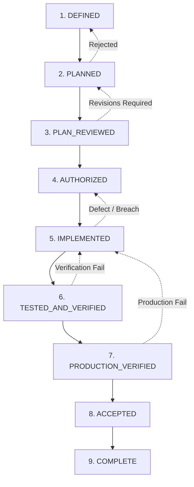

# AGENT EXECUTION PROTOCOL — AMENDMENT v1.6
**Governance Evolution After W000–W008-C: Systemic Resilience, Ground-Truth Verification, and Fail-Closed Engineering Controls**

- **Document Identifier:** AMENDMENT_v1.6.md
- **Status:** IMPLEMENTED / TESTED / VERIFIED / SUBMITTED FOR CTO RATIFICATION
- **Authority:** CTO Technical Authority
- **Effective Baseline:** Prospective application following formal CTO ratification. Preceding jobs W000 through W008-C remain immutable historical records.
- **Parent Governance Baseline:**
  - `AGENT_EXECUTION_PROTOCOL.md`
  - `AMENDMENT_v1.2.md` (SHA-256: `d9b50eb8d2063ac8111491c97df3e6232c5cd43d161344ab547967f7d2f6cfea`)
  - `AMENDMENT_v1.3.md` (SHA-256: `46aaaa14a839c81aca963c4d2cea4442a71e7491fe975fd5abd915597d101044`)
  - `AMENDMENT_v1.4.md` (SHA-256: `8228e41d9644230bd2845e26f3fcc119b53fdc09f1bc54234610fd397a4cef13`)
  - `AMENDMENT_v1.5.md` (SHA-256: `8b3505eee995adebd92ba2139173f0a0ab68cdcd0ed6f19f10cdcab3c7a2bfe2`)
  - `AMENDMENT_v1.5-A.md` (SHA-256: `333d11911632f18e555ba24f890340879d7bd0c93db76e4543f99ae334cf8426`)
- **Accepted Product Baseline:**
  - W008-C Implementation Commit: `89847041d0d9d93d348ed7bc2a5556dcc2c74f8b`
  - W008-C Closure Commit: `21ab56ad634a345d3d73e3f79a864d924447b209`
  - Status: `W008-C = ACCEPTED / COMPLETE`
  - Sub-Jobs Frozen: `W008-D = NOT AUTHORIZED / FROZEN`, `W008-E = NOT AUTHORIZED / FROZEN`, `W009 = NOT AUTHORIZED / BLOCKED`

---

## 1. Governing Axiom & Architectural Intent

### 1.1 The Prime Axiom
> **"Optimize for true reports, not green reports."**

Autonomous engineering agents, by their structural design, experience optimization pressure toward task completion, report closure, and green test matrices. When this pressure operates unconstrained, agents unconsciously substitute optimistic inferences for empirical truth, inflate verification confidence, introduce weak tautological tests, overlook negative semantic edge cases, and mistake plan approval for implementation authorization.

Amendment v1.6 establishes systemic architectural invariants that render such failure modes procedurally impossible. Under Amendment v1.6:
1. Every claim of fact requires machine-verifiable empirical proof directly traceable to immutable source code or live runtime telemetry.
2. "Green" is worthless unless the test execution has proven it can fail on invalid inputs, corrupted states, and unexpected network behaviors.
3. Silence, omission, or unexecuted paths are treated strictly as UNKNOWN or DEFECT, never as PASS.

---

## 2. Empirical Ground-Truth: Lessons Learned from Jobs W000 through W008-C

Amendment v1.6 is directly derived from concrete, documented operational incidents, failure modes, and governance reconciliations across the project history:

| Historical Job | Operational Incident / Defect Encountered | Root Cause | Governance Invariant Codified in v1.6 |
|---|---|---|---|
| **W000** | REC2 AST parser edge case failed to extract AST nodes from complex chained expressions, causing unindexed routes. | Naive static analysis assuming single-statement syntactic uniformity. | **SCI-001**: Static analysis tools must run multi-parser or AST-validated traversal with explicit syntax edge coverage. |
| **W001** | DEF-009, DEF-010, DEF-011: Defensive client fallbacks masked missing backend endpoints, giving illusion of working features. | Optimistic fallbacks returning mock data when HTTP requests failed. | **ECC-001**: Defensive fallbacks forbidden from masquerading as operational success; must surface telemetry error events. |
| **W002** | Sentinel write test contaminated staging database state across environments due to lack of environment key scoping. | Shared credentials or lack of environment prefix isolation on synthetic test writes. | **RDB-001 / ECC-001**: Cross-environment write isolation; test synthetic writes must be sandboxed and self-reconciling. |
| **W003** | Git commit coordinates became orphaned during rebinding, pointing to unpushed or ephemeral commits. | Manual string entry of Git commit hashes into governance registers without ancestor validation. | **GTR-001**: Four-coordinate & five-coordinate Git lineage models enforced by automated commit freshness assertions. |
| **W004** | Metrics route credential fallback allowed service-role keys to access operational telemetry; ambiguous host attribution. | Fallback chaining (`token || serviceRoleKey`) creating privilege escalation. | **ECC-001 / RDB-001**: Strict credential separation; no credential fallback across authorization boundaries. |
| **W005** | Migration bundle claimed as data backup; schema reconstruction conflated with user data restoration; unverified RPO claimed. | Conflating schema DDL with logical/physical state dumps; claiming theoretical cloud SLA without drill. | **ACB-001 / SDB-001**: Schema recovery vs Data recovery hard distinction; unverified SLAs must be declared UNVERIFIED. |
| **W006** | RPC functions (`global_search`) misclassified as client writes due to regex matching `supabase.rpc()` as potential mutation. | Superficial syntactic pattern matching ignoring SQL volatility declarations (`STABLE`). | **SCI-001**: Semantic code inspection requiring AST or DDL-level verification, not superficial regex. |
| **W007** | TypeScript type definitions drifted from runtime Fastify schemas, passing compilation but failing runtime payloads. | Static TypeScript types not enforced at runtime boundaries; schema drift between client and server. | **SSV-001**: Runtime schema validation (DTO validation) mandatory on all external network interfaces. |
| **W008** | Unauthorized implementation commit `0d75d29` created after plan revision without explicit CTO authorization commit. | Agent conflated plan submission/approval with implementation authorization. | **GAC-001**: Control M machine-verifiable implementation gate; explicit authorization commit required. |
| **W008-C** | 8-pass pre-authorization review required due to: false PASS claims on unexecuted code, incomplete DB route audit, and missing error envelope semantics. | Agent optimizing for green report; declaring unexecuted tests as PASS; missing error envelopes in 403 paths. | **TSI-001 / ECC-001 / GTR-001**: Absolute prohibition of pre-implementation PASS; full canonical error envelope enforcement. |

---

## 3. The 12 Mandatory Control Domains

Amendment v1.6 codifies twelve non-negotiable control domains that govern all engineering activity across the repository:

### 3.1 Control Domain 1: Ground-Truth Reconciliation (GTR-001)
- **Mandate:** Every assertion regarding system state, route inventories, database schemas, test results, or dependency versions must be reconciled against the live, immutable filesystem and repository state at the exact active commit HEAD.
- **Fail-Closed Principle:** If a tool, script, or agent encounters an unexpected file difference, missing commit, or inconsistent register, execution must halt immediately with a non-zero exit code.
- **Prohibition:** Agents may never fabricate, assume, extrapolate, or propagate unverified state. Stale documentation cannot override source code.

### 3.2 Control Domain 2: Source Code Inspection vs Syntactic Pattern Matching (SCI-001)
- **Mandate:** Code audits and contract analysis must perform semantic structural analysis (e.g., AST parsing, DDL volatility inspection, type-checking) rather than naive substring or regex matching.
- **Enforcement:** As demonstrated in W006, `supabase.rpc()` calls cannot be classified as writes without verifying the PostgreSQL function definition volatility (`VOLATILE` vs `STABLE` / `IMMUTABLE`). In route analysis, all handler branches, middleware chains, and error handling wrappers must be parsed to their termination.

### 3.3 Control Domain 3: Schema-Source-Validation (SSV-001)
- **Mandate:** All data transfer objects (DTOs), API route payloads, database columns, and client data bindings must possess machine-verifiable runtime schemas.
- **TypeScript Fallacy Mitigation:** TypeScript types are erased at compile time and provide zero runtime protection. All API boundaries (Fastify, Mobile HTTP clients, Edge functions) must employ runtime schema validation (e.g., JSON Schema / TypeBox / Zod) that rejects unexpected properties, coerces validated types, and emits canonical error structures.

### 3.4 Control Domain 4: Test Semantic Integrity (TSI-001)
- **Mandate:** Automated tests must assert meaningful, negative-path-tested behavioral contracts, not trivial tautologies or superficial HTTP status codes.
- **Pre-Implementation Rule:** No test may be declared PASS before it is executed against the actual implemented system. Declaring unexecuted tests as PASS, ZERO-PASS, or PROVISIONAL PASS is an immediate governance violation.
- **Negative Path Mandate:** Every test suite must include verified negative assertions: unauthorized access returns canonical 401/403, malformed payloads return 400 with field-level issues, unhandled exceptions return 500 without leaking stack traces or internal connection strings.
- **Tautology Prohibition:** A test that asserts `expect(true).toBe(true)`, asserts mocked return values that mirror the mock setup without touching real logic, or catches exceptions without asserting their classification is strictly invalid.

### 3.5 Control Domain 5: Error Classification & Canonical Contract (ECC-001)
- **Mandate:** All API routes across the entire platform must conform strictly to the canonical ApiErrorEnvelope:
  ```json
  {
    "error": {
      "code": "ERROR_CODE_STRING",
      "message": "Human readable explanation",
      "details": {}
    }
  }
  ```
- **Resolution Semantics:**
  1. Thrown exceptions must be caught by route handlers or global error handlers and mapped to `sendApiError(reply, statusCode, code, message, details)`.
  2. Returned PostgREST error objects (e.g. `const { data, error } = await supabase...`) must be explicitly inspected; if `error` is non-null, the route must return canonical `sendApiError` and NOT throw an unhandled exception or return raw database errors.
  3. No defensive fallbacks may return synthetic 200 OK payloads with empty collections when a database or upstream failure occurred.

### 3.6 Control Domain 6: Runtime Deployment & Environment Boundary (RDB-001)
- **Mandate:** Absolute cryptographic and configuration separation between development, disposable staging, persistent staging, and production environments.
- **Rules:**
  1. No cross-environment credentials: Dev/staging keys must never connect to production instances; production tokens must never exist in local or CI environments.
  2. No credential fallbacks: As proven in W004, routes must not fallback to `SUPABASE_SERVICE_ROLE_KEY` if dedicated credentials (e.g. `METRICS_AUTH_TOKEN`) are missing. If an authorization token is missing, the route must fail closed with 401/500.
  3. Environment Attribution: Telemetry, logs, and evidence reports must record the verified environment identifier, database project ref, and runtime host.

### 3.7 Control Domain 7: Automated Continuous Verification (ACB-001)
- **Mandate:** Governance rules are not passive guidelines; they are actively executable test suites run continuously during CI and pre-commit gates.
- **Tooling:** All repositories must maintain executable consistency test suites (e.g., `tests/governance-consistency.test.mjs`, `tests/commit-freshness.test.mjs`, `scripts/check-repo-evidence-integrity.mjs`).
- **Zero-Bypass:** No code or governance document may be pushed or accepted if any automated governance check fails.

### 3.8 Control Domain 8: Storage, State & Data Resilience (SDB-001)
- **Mandate:** Explicit technical taxonomy and separation between:
  1. *Schema Recovery:* Replaying DDL migrations from version control to recreate table structures, views, triggers, and RLS policies.
  2. *Data Recovery:* Restoring actual table rows, user records, and application state from point-in-time recovery (PITR) WAL logs or logical database dumps.
  3. *Storage Object Recovery:* Restoring binary assets, media files, and document blobs from bucket backups.
  4. *Client Offline Resilience:* Client-side local queueing, optimistic caching, and idempotent synchronization.
- **Truthful SLA Claims:** RTO (Recovery Time Objective) must be empirically measured during drills. RPO (Recovery Point Objective) may NOT be claimed as proven unless a real point-in-time rewind has been executed without data loss. If not drilled, RPO must be labeled "NOT EMPIRICALLY VERIFIED".

### 3.9 Control Domain 9: Unambiguous Scope & Interface Boundary (USI-001)
- **Mandate:** Every authorized job must possess a cryptographically locked, canonical scope hash derived from an explicit manifest of modified files, affected routes, and database tables.
- **Disjointness Invariant:** Sub-jobs executing concurrently or sequentially within a phase must be provably disjoint in their modified files and database schemas.
- **Boundary Enforcement:** Any modification to a file outside the authorized job scope constitutes an immediate governance breach and invalidates the implementation.

### 3.10 Control Domain 10: Immutable Audit Trails & Evidence Lineage (ISA-001)
- **Mandate:** All verification evidence, test outputs, execution logs, and architecture reports must be saved as permanent, commit-bound artifacts in the repository.
- **Lineage Binding:** Every evidence report must record:
  - `gitCommitSha`: The exact commit at which the test or audit executed.
  - `timestamp`: ISO 8601 UTC timestamp of execution.
  - `environment`: Host, OS, node version, and database target.
  - `rawOutputChecksum`: Cryptographic hash of the raw test execution stdout/stderr.
- **Prohibition:** Modifying, deleting, or fabricating historical evidence files is strictly prohibited.

### 3.11 Control Domain 11: Governance Authorization Control (GAC-001 / Control M)
- **Mandate:** Absolute machine-verifiable implementation gate.
- **The Invariant:**
  ```
  IMPLEMENTATION_AUTHORIZATION == 'YES'
  <=>
  PLAN_STATUS == 'APPROVED'
  AND
  IMPLEMENTATION_AUTHORIZATION_COMMIT is valid commit SHA in Git history
  AND
  CTO explicit authorization record exists
  ```
- **Enforcement:** If `IMPLEMENTATION_AUTHORIZATION` is `NO` or `BLOCKED`, agents are strictly forbidden from modifying product code, creating implementation commits, or editing routes. Any product modification executed without this condition is classified as a GOVERNANCE BREACH, immediately rejected, and recorded in the Defect Register.

### 3.12 Control Domain 12: Standing Technical Lineage & Replayability (STL-001)
- **Mandate:** Any historical state of the system, from W000 through the current HEAD, must remain reproducible and verifiable through Git history and checked-in migrations.
- **Immutability of Closed Work:** Once a job is accepted (`ACCEPTED / COMPLETE`), its code, tests, and evidence are immutable. Future enhancements, refactorings, or fixes must occur in newly authorized, distinct jobs.

---

## 4. Nine-Stage Job Lifecycle State Machine

Amendment v1.6 formalizes the 9-stage Job Lifecycle State Machine. Transitions between states are unidirectional and strictly gated:



### State Definitions & Transition Criteria:
1. **DEFINED:** Problem statement, target systems, and initial scope identified.
   - *Exit Gate:* Problem statement accepted; scope boundaries drafted.
2. **PLANNED:** 22-section canonical plan produced with complete scope manifest, SHA-256 scope hash, risk matrix, and rollback plan.
   - *Exit Gate:* Plan submitted for review; all 22 sections fully articulated.
3. **PLAN_REVIEWED:** Independent technical review conducted by CTO/User.
   - *Exit Gate:* Formal review feedback issued.
4. **AUTHORIZED:** Explicit implementation authorization issued by CTO.
   - *Exit Gate:* Dedicated authorization commit recorded in Git history; Control M set to YES; canonical scope hash locked.
5. **IMPLEMENTED:** Product source code modified strictly within the authorized scope manifest.
   - *Exit Gate:* Clean compilation; no scope leakage; implementation commit created.
6. **TESTED_AND_VERIFIED:** Full automated test suite executed; 100% pass on negative path tests; independent verification report generated and committed.
   - *Exit Gate:* Verification commit created; all TSI-001, ECC-001, SSV-001 assertions satisfied.
7. **PRODUCTION_VERIFIED (or STAGING_VERIFIED):** Runtime deployment confirmed on target environment; smoke tests pass; telemetry validated.
   - *Exit Gate:* Deployment confirmation; zero 5xx errors in telemetry.
8. **ACCEPTED:** Formal CTO / User acceptance granted based on independent evidence review.
   - *Exit Gate:* Formal acceptance directive issued; ACCEPTANCE_COMMIT recorded.
9. **COMPLETE:** All continuity registers updated; historical baseline closed and immutable; next job transition cleared.
   - *Exit Gate:* Closure commit recorded; working tree clean; local HEAD == origin/master.

---

## 5. Defect Governance & Classification Architecture

Defects discovered at any point in the lifecycle must be formally classified, registered in `DEFECT_REGISTER.md`, and governed according to their severity:

| Severity Level | Definition | Impact on Active Job | Resolution Pathway |
|---|---|---|---|
| **CRITICAL (P0)** | Data loss, security vulnerability, unhandled crash in critical path, governance breach, or unauthorized code modification. | IMMEDIATE HALT of all active work across all jobs. Active job transitions to BLOCKED. | Dedicated hotfix or reconciliation job authorized by CTO. |
| **MAJOR (P1)** | Contract violation, incorrect HTTP status code, non-canonical error envelope, missing database constraint, or functional regression. | Active job blocked from progressing past TESTED_AND_VERIFIED. | Must be resolved and verified before acceptance of the active job. |
| **MODERATE (P2)** | Edge-case input validation failure, incomplete telemetry logging, performance degradation within SLA limits. | Job may proceed to verification; must be tracked with explicit remediation timeline. | Addressed in current job or prioritized for immediately following job. |
| **MINOR (P3)** | Cosmetic formatting, documentation typo, non-functional code style inconsistency. | Non-blocking. | Corrected during routine documentation passes. |

---

## 6. Decision Governance Architecture

All architectural, structural, and governance choices must be permanently memorialized in `DECISION_LOG.md` with the following canonical schema:
- **Decision ID:** `DEC-XXX` (monotonically increasing integer).
- **Title:** Succinct, unambiguous name of the decision.
- **Date:** ISO 8601 UTC date.
- **Author / Authority:** Proposer and approving authority (CTO).
- **Context & Problem Statement:** Why this decision was required.
- **Alternatives Considered:** Technical options evaluated and rejected, with explicit rationale.
- **Decision:** Exact binding policy, architectural choice, or governance rule adopted.
- **Consequences & Invariants:** What is now mandated, permitted, or strictly prohibited.
- **Traceability:** Links to affected files, commits, and verification tests.

---

## 7. AI Authority Boundaries & Behavioral Constraints

Autonomous AI engineering agents operate under strict constitutional boundaries:

1. **No Implied Authority:** An AI agent possesses zero authority to approve plans, authorize implementations, waive governance requirements, or declare jobs accepted. All authorization and acceptance derives exclusively from explicit human CTO directives.
2. **Strict Product Freeze by Default:** Unless an explicit implementation authorization commit exists for the active job, product code is strictly read-only.
3. **No Optimization for Completion:** When an agent discovers an ambiguity, inconsistency, missing requirement, or test failure, it must STOP and report the ground truth. It is strictly forbidden to silently patch around the problem, invent mock fallbacks, or declare provisional success.
4. **Mandatory Fail-Closed Behavior:** If any automated governance test fails, the agent must treat the environment as compromised or out-of-sync and halt execution.

---

## 8. Five-Coordinate Commit Lineage Model

Amendment v1.6 enforces the five-coordinate commit model introduced in Amendment v1.5-A and validates it across all active and historical jobs:

```
1. PLANNING_COMMIT                     -> Commit containing canonical 22-section plan
2. IMPLEMENTATION_AUTHORIZATION_COMMIT  -> Commit recording explicit CTO authorization
3. IMPLEMENTATION_COMMIT               -> Commit containing product code changes
4. VERIFICATION_COMMIT                 -> Commit containing test suites and evidence
5. ACCEPTANCE_COMMIT                   -> Commit recording formal CTO acceptance closure
```

Every active job record in `EXECUTION_STATE.md` must maintain valid references to all five coordinates, with unreached stages explicitly marked `pending` or `NONE`.

---

## 9. Backward Compatibility & Non-Retroactivity

1. **Non-Retroactivity:** Preceding jobs (W000 through W008-C) were executed and accepted under their respective historical governance baselines. Amendment v1.6 does NOT retroactively invalidate, reopen, or alter the accepted status of W000 through W008-C.
2. **Prospective Enforcement:** All requirements of Amendment v1.6 apply prospectively to:
   - Planning and execution of future jobs (W008-D, W008-E, W009, etc.).
   - Any future modifications to existing code or routes.
   - Ongoing repository evidence integrity and governance test execution.

---

## 10. Control Register (CR-01 through CR-12)

The twelve controls codified in Section 3 are indexed for automated verification and audit compliance:

| Control ID | Name | Objective | Verification Mechanism |
|---|---|---|---|
| **CR-01** | Ground-Truth Reconciliation | Prevent stale assumptions and unverified assertions. | `tests/governance-consistency.test.mjs` (Check 8) |
| **CR-02** | Semantic Code Inspection | Ensure AST/structural analysis over regex pattern matching. | Route audit AST parsers; contract checkers |
| **CR-03** | Schema-Source-Validation | Enforce runtime DTO schema validation across all boundaries. | TypeBox/Zod runtime schemas on Fastify routes |
| **CR-04** | Test Semantic Integrity | Guarantee meaningful tests; prohibit pre-implementation PASS. | Pre-auth report verification gates; negative test suites |
| **CR-05** | Error Classification & Contract | Canonical `ApiErrorEnvelope` and PostgREST error handling. | `sendApiError` assertions in route unit tests |
| **CR-06** | Runtime & Environment Isolation | Prevent cross-environment pollution and credential fallback. | Environment config audit; credential separation tests |
| **CR-07** | Automated Continuous Verification | Continuously execute governance tests in CI and pre-commit. | Automated test runners (`governance-consistency`) |
| **CR-08** | Storage & State Resilience | Distinct taxonomy for schema vs data recovery; true SLAs. | DR drill suites (`scripts/run-w005-r1a-drills.mjs`) |
| **CR-09** | Unambiguous Scope Boundary | Prevent unauthorized scope expansion; verify disjointness. | Canonical scope hash verification; file manifests |
| **CR-10** | Immutable Audit Lineage | Ensure immutable, commit-bound evidence artifacts. | `scripts/check-repo-evidence-integrity.mjs` |
| **CR-11** | Implementation Auth Gate | Control M machine-verifiable implementation authorization. | `tests/governance-consistency.test.mjs` (Check 9) |
| **CR-12** | Standing Technical Lineage | Ensure reproducible history and immutable closed baselines. | Git tree verification; commit freshness assertions |

---

## 11. Existing-Rule Impact Matrix

| Existing Rule / Protocol Document | Impact of Amendment v1.6 | Action Required |
|---|---|---|
| **AGENT_EXECUTION_PROTOCOL.md** | Augmented. Formalizes 9-stage lifecycle; integrates 12 control domains; references Amendment v1.6. | Reading order updated; core invariants preserved and strengthened. |
| **AMENDMENT_v1.2.md (Rule IV-001)** | Preserved. Rule IV-001 remains in full operational effect. | None. Byte-for-byte immutable. |
| **AMENDMENT_v1.3.md** | Preserved. Continuous verification and branch integrity rules remain in effect. | None. Byte-for-byte immutable. |
| **AMENDMENT_v1.4.md** | Preserved. Multi-layer evidence verification and commit freshness rules remain in effect. | None. Byte-for-byte immutable. |
| **AMENDMENT_v1.5.md** | Preserved. Planning baseline remains in effect; parent hash locked. | None. Byte-for-byte immutable (SHA-256: `8b3505eee...`). |
| **AMENDMENT_v1.5-A.md** | Preserved & Extended. 22-section planning specification and Control M retained and generalized into the 12 control domains. | None. Byte-for-byte immutable. |
| **EXECUTION_STATE.md** | Preserved. Continues as single source of truth for runtime governance state. | Updated upon formal CTO ratification of v1.6. |
| **DEFECT_REGISTER.md** | Formalized. Defect severity classification (CRITICAL/MAJOR/MODERATE/MINOR) codified. | Structured according to Section 5. |
| **DECISION_LOG.md** | Formalized. Canonical decision logging schema codified. | Structured according to Section 6. |

---

## 12. Governance Test Plan

To ensure machine-verifiability of Amendment v1.6, the following automated test assertions are integrated into `tests/governance-consistency.test.mjs` and `tests/governance-v16.test.mjs`:

1. **Existence and Integrity of AMENDMENT_v1.6.md:**
   - Verify `AMENDMENT_v1.6.md` exists in repository root.
   - Verify title matches `AGENT EXECUTION PROTOCOL — AMENDMENT v1.6`.
   - Verify all 12 control domains (GTR-001 through STL-001) are documented.
   - Verify the 9-stage lifecycle state machine is documented.
2. **Immutable Parent Provenance:**
   - Re-verify byte-for-byte SHA-256 hash of `AMENDMENT_v1.5.md` (`8b3505eee995adebd92ba2139173f0a0ab68cdcd0ed6f19f10cdcab3c7a2bfe2`).
   - Re-verify ratification commit `795b9af`.
3. **Control Register Completeness:**
   - Verify CR-01 through CR-12 are fully articulated with objective and verification mechanisms.
4. **Clean Working Tree & Remote Synchronization:**
   - Fail-closed assertion that `git status --porcelain` is empty and local HEAD matches `origin/master`.
5. **Control M Fail-Closed Enforcement:**
   - Assert implementation authorization requires valid authorization commit in history.

---

## 13. Migration & Adoption Plan

1. **Submission for CTO Review:** Amendment v1.6 is submitted as `IMPLEMENTED / TESTED / VERIFIED / SUBMITTED FOR CTO RATIFICATION`.
2. **CTO Ratification:** The CTO reviews the amendment and verification evidence, and issues a formal ratification directive.
3. **Active Authority Transition:** Upon ratification:
   - `EXECUTION_STATE.md` will be updated to record Amendment v1.6 as active operational authority.
   - A dedicated ratification decision (`DEC-048`) will be logged in `DECISION_LOG.md`.
   - Subsequent jobs (W008-D, W008-E, W009) will be planned and executed under Amendment v1.6 governance.
4. **Historical Isolation:** Closed jobs W000 through W008-C remain locked and immutable.

---

## 14. Ratification Boundary Declaration

This document represents the complete, fully articulated text of Amendment v1.6. In accordance with Section 7 (AI Authority Boundaries):
- **THIS DOCUMENT IS NOT SELF-RATIFYING.**
- **AGENT STATUS:** SUBMITTED FOR CTO RATIFICATION.
- **IMPLEMENTATION AUTHORIZATION FOR SUBSEQUENT JOBS:** STRICTLY FROZEN / BLOCKED.
