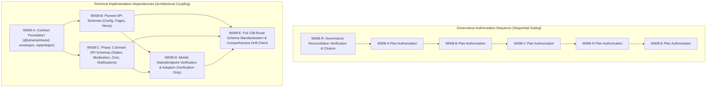

# W008 SUB-JOB MASTER PLAN — REVISION 7
## API CONTRACT STANDARDIZATION DECOMPOSITION, AUTHORITATIVE 138-ROUTE RECONCILIATION, SCOPE MANIFESTS & EXECUTION GOVERNANCE

---

### OPERATIONAL STATUS & AUTHORIZATION DECLARATION

```text
============================================================
W008 SUB-JOB MASTER PLAN REVISION 7
IMPLEMENTATION AUTHORIZATION STATUS
============================================================

PLAN STATUS: REJECTED / DECOMPOSITION REQUIRED
IMPLEMENTATION AUTHORIZATION: NO
AUTHORIZED JOB: NONE
APPROVED PLAN VERSION: NONE
IMPLEMENTATION AUTHORIZATION COMMIT: NONE
AUTHORIZED SCOPE HASH: NONE
IMPLEMENTATION MAY BEGIN: NO
W008 PRODUCT CODE: FROZEN
W009: STRICTLY NOT AUTHORIZED
STOP: YES

============================================================
```

---

## 1. Document Title & Metadata

- **Document Identifier:** `PLAN-W008-MASTER-REV-7`
- **Revision:** 7.0 (Authoritative 138-Route Reconciliation, Deterministic Ledger, Verified Module Ownership & Cryptographic Scope Hashes)
- **Supersedes:** `PLAN-W008-MASTER-REV-6` (historical predecessor, rejected/not ratified due to unproven W008-E route reconciliation)
- **Date:** 2026-09-13
- **Operating Authority:** PANIN / Kshetra Master Execution Framework, Amendment v1.5-A, DEC-042, DEC-043, and `AGENT_EXECUTION_PROTOCOL.md` (Controls A through M).
- **Target Repository:** `kshetra-app/Kshetra`
- **Target Branch:** `master`
- **Current Remote HEAD:** `81ad5b5da49c49524427f64bb4595c473237c573` (`81ad5b5`)
- **Accepted W007 Coordinate:** `1d253cd454effb441e7f01e846a568eeddc7f57e` (`1d253cd`)
- **Unauthorized W008 Implementation Coordinate:** `0d75d29c02512d5bc17839a5ef4730bdc5d389d5` (`0d75d29` — REJECTED / NOT ACCEPTED)
- **Parent Governance Coordinate:** `f022e853904b438ed59e309cf9fbfa3a8f14d429` (`f022e85`)
- **Active Governance Coordinate:** `81ad5b5da49c49524427f64bb4595c473237c573` (`81ad5b5`)
- **Document Status:** `REJECTED / DECOMPOSITION REQUIRED`
- **Implementation Authorization:** `NO (ABSOLUTE FREEZE)`

> [!IMPORTANT]
> This document is a **PLANNING ARTIFACT ONLY**. It does not constitute authorization to modify product code, add schemas, alter routes, or advance to subsequent jobs. All product code modifications remain strictly frozen under DEC-043.

---

## 2. Problem Statement

Job W008 was chartered to eliminate API contract ambiguity, architectural dual-pathing risks, unvalidated parameters, and disparate error envelopes between Fastify (`apps/api`) and the mobile client (`apps/mobile`).

### Specific Structural Defects Identified in Prior Audits
1. **Inconsistent Response Shapes:** Lack of uniform wrapping led to unpredictable client handling across endpoints.
2. **Missing Input/Output Schemas:** Over 89% of Fastify routes lacked Ajv schemas, leaving request parameters unvalidated and response payload shapes unenforced.
3. **Inconsistent Error Envelopes:** Error payloads varied from Fastify default 500 dumps, custom strings, to raw PostgREST exceptions leaking SQL details.
4. **Unchecked Contract Drift:** No automated CI mechanism verified that client endpoints matched server route parameters and HTTP verbs.

### Truth in Engineering: W008 Original Goals vs. Historical Commit `0d75d29`
- **W008 Original Charter:** Planned a single-pass migration covering 100% of Fastify routes (137/137 planned), standardizing all 4xx/5xx error paths, and achieving platform-wide drift immunity.
- **Unauthorized Commit `0d75d29`:**
  - Implemented foundational TypeScript interfaces in `@kshetra/shared` (`ApiSuccessEnvelope`, `ApiErrorEnvelope`, `PaginationMeta`).
  - Implemented `sendApiError()` and global Ajv schema unwrapping in `apps/api/src/server.ts`.
  - Added request/response schemas to only **14 out of 138** registered routes (`config.ts`, `news.ts`, `states.ts`, `moderation.ts`, `notifications.ts`, `health.ts`).
  - Added mobile `StatesEndpoint` with runtime validation.
  - Audited contract drift on only **10 out of 138** endpoints.
- **CTO Rejection Findings (DEC-042/DEC-043):**
  - **Governance Breach:** Implementation was executed without valid CTO plan approval.
  - **AC-02 Material Scope Failure:** Only 14/138 routes were schema-covered (10.1% vs 100% planned). AC-02 is evaluated as **FAIL**.
  - **AC-03 Unproven Error Standardization:** Standard error formatting was verified only on pioneer routes; error behavior across the remaining 124 routes was not proven. AC-03 is evaluated as **NOT PROVEN**.
  - **Drift Over-Claim:** The report claimed zero drift across the catalog when in fact only 10 endpoints were audited under D0–D9.
- **CTO Rejection of Revision 6:**
  - Revision 6 provided correct macro arithmetic (138 = 3 + 27 + 108), but the 108 W008-E identities were not proven to reconcile deterministically to the authoritative Fastify registration catalog, leaving potential module ownership and accounting ambiguities. Revision 7 resolves this by establishing an authoritative, machine-readable Master Route Ledger and automated 14-step reconciliation verification.

---

## 3. Current State Analysis

A ground-truth source inspection of the repository at commit `81ad5b5` establishes the following baseline:

```text
Fastify HTTP Routes Registered:       138 unique route handlers
Route Modules in apps/api/src/routes: 24 modules (including server.ts root routes)
Routes with Schema Definitions:       14 routes (10.1%)
Routes without Schemas:               124 routes (89.9%)
Standardized Error Envelopes Proven:  14 routes (via sendApiError & schema unwrap)
Error Envelopes Unproven/Legacy:      124 routes
Endpoints Audited for Contract Drift: 10 endpoints (D0 through D9)
Audited Endpoints Drift Status:       10/10 In Sync (0 drift among audited endpoints)
Un-audited Routes for Drift:          128 routes
Mobile API Endpoints Active:          4 endpoint classes (Config, Pages, News, States)
Shared Contract Package:              @kshetra/shared (envelopes.ts, pagination.ts)
Automated Tests Passing:              contracts.test.ts (15/15), apiClient.test.ts (52/52),
                                      w008-contract-negative-paths.test.mjs (16/16)
Governance Consistency Tests:         governance-consistency.test.mjs (9/9 PASS)
```

> [!NOTE]
> **Historical Test Evidence Invariant:** Historical test results from `0d75d29` (15/15 API contract tests, 52/52 mobile tests, 16/16 negative-path tests) serve as **baseline technical evidence only**. They do **NOT** automatically satisfy future sub-job acceptance. Future acceptance requires fresh verification against the relevant authorized implementation ancestry and exact sub-job scope.

---

## 4. Fact / Inference / Assumption / Unknown Register

| ID | Statement | Classification | Evidence & Ground Truth | Confidence | Required Verification |
| :--- | :--- | :---: | :--- | :---: | :--- |
| **FIA-01** | The repository contains exactly 138 Fastify HTTP route registrations across 24 source files. | **FACT** | `reports/w008_api_contract_inventory.json` AST parsing and direct source scan. | HIGH | Source-derived route ledger verification. |
| **FIA-02** | `campaign.ts` contains exactly 16 route registrations, all assigned to W008-E. | **FACT** | Source inspection of `apps/api/src/routes/campaign.ts` (lines 240-581). | HIGH | Direct regex & AST extraction. |
| **FIA-03** | `politicalAds.ts` contains exactly 6 route registrations, all assigned to W008-E. | **FACT** | Source inspection of `apps/api/src/routes/politicalAds.ts` (lines 96-361). | HIGH | Direct regex & AST extraction. |
| **FIA-04** | `GET /ad-library` is registered inside `politicalAds.ts` (line 361) as an unauthenticated HTML route. | **FACT** | Verified directly in `apps/api/src/routes/politicalAds.ts`. | HIGH | Code inspection. |
| **FIA-05** | `pages.ts` contains exactly 4 route registrations: 1 in W008-B (`/entitlement`) and 3 in W008-E (`details/:pageId`, `pro/order`, `pro/verify`). | **FACT** | Verified directly in `apps/api/src/routes/pages.ts`. | HIGH | Code inspection. |
| **FIA-06** | `POST /api/v1/pages/:pageId/political-ads` is registered in `politicalAds.ts`, NOT `pages.ts`. | **FACT** | Verified directly in `apps/api/src/routes/politicalAds.ts` (line 96). | HIGH | Code inspection. |
| **FIA-07** | `server.ts` registers `GET /` and `GET /health`, while `health.ts` registers `/health`, `/health/db`, and `/health/ready` (mounted at `/api`). | **FACT** | Verified in `apps/api/src/server.ts` and `apps/api/src/routes/health.ts`. | HIGH | Disambiguated via stable registration IDs. |
| **FIA-08** | Commit `0d75d29` was created without valid CTO plan approval. | **FACT** | W008 plan declared `IMPLEMENTATION AUTHORIZATION: NO`; CTO rejected acceptance in DEC-042/DEC-043. | HIGH | Git log & governance register reconciliation. |
| **FIA-09** | Contract drift is zero strictly across the 10 audited endpoints (D0–D9). | **FACT** | Executed `scripts/check-api-contract-drift.mjs` yields 10/10 `D0_IN_SYNC`. | HIGH | Verifiable via drift test suite. |
| **FIA-10** | The remaining 128 un-audited routes are currently drift-free with mobile callers. | **ASSUMPTION** | Mobile client historically relied on dual paths (`supabaseDataService.ts` vs ad-hoc `fetch`). Drift is unmeasured. | LOW | Full contract audit script in W008-E. |
| **FIA-11** | The 14 schema-covered routes never return un-enveloped error payloads on 400 validation failures. | **INFERENCE** | Fastify `setErrorHandler` in `server.ts` intercepts Ajv validation and calls `sendApiError()`. | MEDIUM | Proven in local tests; requires staging runtime proof. |
| **FIA-12** | `@kshetra/shared` interfaces can be adopted across all 138 routes without breaking mobile serialization. | **ASSUMPTION** | Mobile `ApiClient` currently parses `ApiSuccessEnvelope<T>` for config, pages, news, and states. Other callers unmigrated. | MEDIUM | Phased rollout in W008-B through W008-E. |
| **FIA-13** | Unmigrated routes in `apps/api` use disparate error structures (e.g. `{ error: string }`, `{ message: string }`). | **FACT** | Inspected legacy handlers in `civic.ts`, `campaign.ts`, `delimitation.ts`. | HIGH | Standardize in W008-C and W008-E. |
| **FIA-14** | Whether existing mobile screens bypass `ApiClient` for unmigrated domain writes. | **FACT** | W006 proved 56 Class B methods in `supabaseDataService.ts` bypass Fastify entirely. | HIGH | Retain dual-path isolation until strangler phases. |

---

## 5. Target Architecture & Intended Outcome

### Standardized Contract Specification & Terminology
The error response model implemented in `@kshetra/shared` is formally designated:
$$\text{\textbf{PANIN Canonical API Error Envelope (RFC-7807 Inspired)}}$$

It incorporates key concepts from RFC-7807 (Problem Details for HTTP APIs)—specifically typed error codes, human-readable messages, and field-level invalidity details—while adhering to PANIN platform conventions:
```typescript
export interface ApiSuccessEnvelope<T = unknown> {
  success: true;
  data: T;
  requestId: string;
  timestamp: string;
}

export interface ApiErrorDetail {
  path: string;
  message: string;
}

export interface ApiErrorEnvelope {
  error: string;          // HTTP Status Phrase (e.g. "Bad Request")
  message: string;        // Human-readable summary
  statusCode: number;     // HTTP Status Code (e.g. 400)
  code?: string;          // Application-level error code (e.g. "VALIDATION_ERROR")
  requestId: string;      // Correlated Fastify request ID
  timestamp: string;      // ISO 8601 UTC timestamp
  details?: ApiErrorDetail[]; // Field-level violation paths
}
```

### Architectural Principles
1. **Bidirectional Strictness:** Fastify validates incoming query/body payloads fail-closed; mobile client validates incoming response payloads fail-closed via runtime validators.
2. **Deterministic Error Handling:** Centralized in `sendApiError()` and `server.ts` `setErrorHandler`. Route handlers do not manually construct ad-hoc error shapes.
3. **Correlation Tracking:** `requestId` propagates through all success and error envelopes.

---

## 6. Governing Rules & Constraints

1. **Amendment v1.5-A Absolute Authority:** Mandatory 22-section planning, pre-implementation declarations, and independent verification apply to every sub-job.
2. **Absolute Implementation Freeze:** Zero product-code modifications are permitted until a sub-job receives an explicit, machine-verifiable `IMPLEMENTATION_AUTHORIZATION_COMMIT` from the CTO.
3. **Preservation of Provenance (No History Rewriting):** Commit `0d75d29` remains preserved in Git history as `UNAUTHORIZED HISTORICAL IMPLEMENTATION`. It will never be amended, rebased, or deleted.
4. **Technical Validity ≠ Governance Acceptance:** Code that is technically sound in `0d75d29` is designated **Candidate for Adoption** and requires independent verification before formal acceptance.
5. **Implementing Agent ≠ Acceptance Authority (Rule IV-001):** Final acceptance remains solely with the CTO.
6. **W009 Strict Prohibition:** Under no circumstances may W009 (External Provider Abstraction) be planned, started, or executed.
7. **No Fabricated Commits:** Only verified, historical Git commit SHAs may be cited for past events. All future implementation and authorization commits must be designated with symbolic angle-bracket placeholders (`<AUTH-COMMIT-W008-x>`).

---

## 7. Full Scope of Work & Sub-Job Decomposition

### Governance Dependency vs. Technical Dependency Structure



- **Governance Rule:** Sub-jobs must be authorized and ratified sequentially (`W008-R` $\rightarrow$ `W008-A` $\rightarrow$ `W008-B` $\rightarrow$ `W008-C` $\rightarrow$ `W008-D` $\rightarrow$ `W008-E`).
- **Technical Reality:** `W008-B` (Pioneer routes) and `W008-C` (Domain routes) both depend technically on `W008-A` (Foundation envelopes). `W008-D` (Mobile endpoint verification) verifies contracts established in `W008-B` and `W008-C`. `W008-E` (Full catalog) requires all preceding contracts to be finalized.

---

### SUB-JOB W008-R: Governance Reconciliation Verification & Closure

- **Purpose & Objective:** Verify existing governance reconciliation in commit `81ad5b5`, verify provenance coordinates, verify Control M implementation, verify governance consistency (9/9 checks pass), confirm STOP state, and confirm W009 remains strictly blocked. **Zero duplicate governance implementation is planned.**
- **Exact Scope:**
  - Independent verification of `EXECUTION_STATE.md` coordinates.
  - Independent verification of `ACCEPTANCE_REGISTER.md` W008 frozen status.
  - Independent verification of `DECISION_LOG.md` DEC-042 and DEC-043.
  - Execution of `node tests/governance-consistency.test.mjs` (9/9 PASS).
  - Confirmation that working tree is 100% clean and matches `origin/master`.
- **In-Scope Artifacts & Verification:**
  - **Governance Artifacts:** `EXECUTION_STATE.md`, `ACCEPTANCE_REGISTER.md`, `DECISION_LOG.md`.
  - **Governance Verification:** `tests/governance-consistency.test.mjs`.
- **In-Scope Routes / Clients:** None.
- **Dependencies:** None (anchors to `81ad5b5`).
- **Expected Outputs:** Formal independent verification report verifying reconciliation closure.

---

### SUB-JOB W008-A: Contract Foundation Reconciliation & Adoption

- **Purpose & Objective:** Formally evaluate, independently verify, and adopt the foundational contract envelopes, pagination interfaces, error reply helper, and global schema unwrapping delivered in `0d75d29`.
- **Exact Scope:**
  - Independent verification of `packages/shared/src/contracts/envelopes.ts` (`ApiSuccessEnvelope`, `ApiErrorEnvelope`, `ApiErrorDetail`).
  - Independent verification of `packages/shared/src/contracts/pagination.ts` (`PaginationQuery`, `PaginationMeta`, `PaginatedResponse`).
  - Independent verification of `apps/api/src/lib/replyHelper.ts` (`sendApiError()`).
  - Independent verification of `apps/api/src/server.ts` global Ajv schema error unwrapping in `setErrorHandler`.
  - Fresh execution of foundation negative-path test suite (`NP-01` through `NP-06`).
- **Modification Scope:** `packages/shared/src/contracts/*`, `apps/api/src/lib/replyHelper.ts`, `apps/api/src/server.ts` (error handler region only).
- **Verification-Only Scope:** `apps/api/src/__tests__/contracts.test.ts`, `tests/w008-contract-negative-paths.test.mjs`.
- **In-Scope Routes:** None (zero Fastify route registrations; foundational envelope/pagination interfaces, replyHelper, and global schema unwrapping only). Standardizing the Fastify `GET /health` root probe registration itself is strictly assigned to W008-E.
- **In-Scope Clients:** None (shared foundation).
- **Dependencies:** W008-R.
- **Expected Outputs:** Independent verification report and adoption recommendation.
- **Final Disposition:** ADOPT only upon successful independent verification and formal CTO acceptance.

---

### SUB-JOB W008-B: Pioneer API Contract Reconciliation & Standardization

- **Purpose & Objective:** Standardize and enforce 100% request and response schema validation for the pioneer API routes migrated in W007, ensuring complete contract synchronization with mobile callers.
- **Registration vs. Operation Alignment:**
  - **Fastify Route Registrations:** **3** (`config.ts` [1 registration], `news.ts` [1 registration], `pages.ts` [1 registration]).
  - **HTTP Contract Operations:** **4** (`GET /config/flags`, `PATCH /api/v1/config/flags`, `GET /api/v1/news/feed`, `GET /api/v1/pages/:pageId/entitlement`).
- **Provenance Distinction:**
  - **Candidate for Adoption (from `0d75d29`):** `apps/api/src/routes/config.ts` (GET/PATCH operations), `apps/api/src/routes/news.ts` (`GET /api/v1/news/feed`).
  - **NEW FUTURE AUTHORIZED WORK:** `apps/api/src/routes/pages.ts` (`GET /api/v1/pages/:pageId/entitlement`). This route was not schema-standardized in `0d75d29` and represents new engineering scope.
- **Modification Scope:** `apps/api/src/routes/config.ts`, `apps/api/src/routes/news.ts` (feed route region), `apps/api/src/routes/pages.ts` (entitlement route region).
- **Verification-Only Scope:** `apps/mobile/lib/featureFlags.ts`, `apps/mobile/lib/pageService.ts`, `apps/mobile/lib/api/endpoints/news.ts`, `scripts/check-api-contract-drift.mjs`.
- **In-Scope Clients:** `apps/mobile/lib/featureFlags.ts`, `apps/mobile/lib/pageService.ts`, `apps/mobile/lib/api/endpoints/news.ts`.
- **Dependencies:** W008-A.
- **Expected Outputs:** 3 Fastify route registrations (4 HTTP operations) with 100% schema coverage and zero drift.

---

### SUB-JOB W008-C: Phase-1 Domain API Hardening

- **Purpose & Objective:** Attach strict request/response schemas, Ajv parameter validation, and standard error envelopes to Phase 1 domain routes across States, Moderation, Civic, and Notifications.
- **Registration Count:** Exactly **27 Fastify route registrations** (`states.ts` [2], `moderation.ts` [9], `civic.ts` [11], `notifications.ts` [5]).
- **Exact Scope:** Complete schema coverage, parameter constraints, and database exception masking across all 27 routes.
- **Modification Scope:** `apps/api/src/routes/states.ts`, `apps/api/src/routes/moderation.ts`, `apps/api/src/routes/civic.ts`, `apps/api/src/routes/notifications.ts`.
- **Verification-Only Scope:** `apps/api/src/__tests__/contracts.test.ts`, `tests/w008-contract-negative-paths.test.mjs`, `scripts/check-api-contract-drift.mjs`.
- **Dependencies:** W008-A (technical), W008-B (governance).
- **Expected Outputs:** 27 Phase 1 domain route registrations fully standardized with zero unvalidated parameter parsing and zero leaking SQL exceptions.

---

### SUB-JOB W008-D: Mobile Contract Reconciliation & Expansion (Verification-Only)

- **Purpose & Objective:** Formally evaluate, independently verify, and adopt the canonical mobile client extensions (specifically `StatesEndpoint`), fail-closed runtime response validators, and negative-path client behaviors delivered in `0d75d29`.
- **Strict Verification-Only Designation:** In order to resolve the lineage contradiction, W008-D possesses **NO modification scope** (`modificationScope: []`). The job may inspect the existing implementation, execute tests, execute TypeScript checks, verify runtime validators, verify `ApiClient` wiring, and generate verification evidence. **The job may NOT modify those files.**
- **Corrective Action Invariant:** If the existing implementation fails verification, W008-D must report rejection/defect rather than modifying product code. Any corrective implementation must become a separately authorized future sub-job.
- **Modification Scope:** `[]` (Empty array — strictly verification-only)
- **Verification-Only Scope:**
  - `apps/mobile/lib/api/client.ts`
  - `apps/mobile/lib/api/endpoints/states.ts`
  - `apps/mobile/lib/api/index.ts`
  - `apps/mobile/__tests__/apiClient.test.ts`
  - `apps/mobile/lib/api/types.ts`
  - `tests/w008-contract-negative-paths.test.mjs`
- **In-Scope Routes:** `[]` (Empty array — W008-D possesses zero route implementation ownership; implementation ownership belongs exclusively to W008-C).
- **Verification-Target Routes:** `GET /api/v1/states`, `GET /api/v1/states/:code` (routes tested and verified against mobile client contracts).
- **Dependencies:** W008-B, W008-C.
- **Expected Outputs:** Independent verification report and adoption recommendation for `StatesEndpoint` with proven fail-closed runtime validation.

---

### SUB-JOB W008-E: Full API Contract Standardization & Drift Enforcement

- **Purpose & Objective:** Standardize all remaining **108 Fastify route registrations**, achieve true 138/138 schema coverage, and expand `scripts/check-api-contract-drift.mjs` to audit 100% of routes and client mappings across **all remaining 16 route module files**.
- **Direct Messaging Scope Resolution:**
  - **Allowed Scope for 6 DM Routes:** HTTP request schemas, HTTP response schemas, HTTP error envelope standardization, parameter validation, and contract/drift verification for `/api/v1/dm/*`.
  - **Strictly Prohibited:** Altering WebRTC signaling architecture, WebSocket connection/session lifecycles, signaling protocol semantics, transport mechanisms, DM business logic, database tables, or Supabase RLS policies.
- **Mathematical Scope Derivation:**
  $$\begin{aligned}
  \text{Total Fastify Route Registrations} &= 138 \\
  \text{W008-B Route Registrations} &= 3 \\
  \text{W008-C Route Registrations} &= 27 \\
  \text{Allocated Prior to W008-E} &= 30 \\
  \mathbf{W008\text{-}E\text{ Remaining Route Registrations}} &= \mathbf{108} \\
  \mathbf{Final\ W008\ Master\ Target} &= \mathbf{138/138\ (100\%)}
  \end{aligned}$$
- **All Remaining 16 Route Module Files (Exact File List):**
  1. `apps/api/src/routes/ai.ts` (7 registrations)
  2. `apps/api/src/routes/broadcast.ts` (3 registrations)
  3. `apps/api/src/routes/campaign.ts` (16 registrations)
  4. `apps/api/src/routes/constituencies.ts` (8 registrations)
  5. `apps/api/src/routes/debug.ts` (1 registration)
  6. `apps/api/src/routes/delimitation.ts` (14 registrations)
  7. `apps/api/src/routes/dm.ts` (6 registrations; HTTP schemas only)
  8. `apps/api/src/routes/geo.ts` (2 registrations)
  9. `apps/api/src/routes/health.ts` (6 registrations)
  10. `apps/api/src/routes/journalist.ts` (8 registrations)
  11. `apps/api/src/routes/lmx.ts` (11 registrations)
  12. `apps/api/src/routes/manage.ts` (1 registration)
  13. `apps/api/src/routes/metrics.ts` (1 registration)
  14. `apps/api/src/routes/policy.ts` (3 registrations)
  15. `apps/api/src/routes/politicalAds.ts` (6 registrations)
  16. `apps/api/src/routes/politician.ts` (9 registrations)
  *(Plus unmigrated regions of shared route files: `server.ts` [2], `news.ts` [1], `pages.ts` [3], and `scripts/check-api-contract-drift.mjs`).*
- **Modification Scope:** The 16 route module files listed above, the unmigrated regions of `server.ts`, `news.ts`, `pages.ts`, and `scripts/check-api-contract-drift.mjs`.
- **Verification-Only Scope:** Full API test suite, mobile test suite, and generated reports (`reports/w008_api_contract_inventory.json`, `reports/w008_contract_drift_report.json`).
- **Dependencies:** W008-A, W008-B, W008-C, W008-D.
- **Expected Outputs:** Complete, platform-wide API contract standardization across all 138 route registrations.

---

## 8. Explicit Out-of-Scope Boundaries & Region Ownership

### Shared Route File Region-Level Ownership Map
Shared route files are strictly segregated into route-level ownership regions:

| File Path | W008-A Ownership | W008-B Ownership | W008-E Ownership | Frozen / Prohibited Regions |
| :--- | :--- | :--- | :--- | :--- |
| `apps/api/src/server.ts` | Global `setErrorHandler` unwrap | *None* | Root `/` and `/health` routes (2 registrations) | Fastify plugin registration core, CORS, helmet |
| `apps/api/src/routes/news.ts` | *None* | `GET /api/v1/news/feed` (1 registration) | `POST /api/v1/news/refresh` (1 registration) | RSS parsing logic, external fetching services |
| `apps/api/src/routes/pages.ts` | *None* | `GET /api/v1/pages/:pageId/entitlement` (1 registration) | Remaining 3 routes (`details/:pageId`, `pro/order`, `pro/verify`) | Database query builder, caching maps |
| `apps/api/src/routes/dm.ts` | *None* | *None* | HTTP request/response schemas on 6 routes | **PROHIBITED:** WebRTC, WebSockets, signaling protocol, transport logic |

### Out-of-Scope Boundaries Across All Sub-Jobs
1. **W009 (External Provider Abstraction):** Strictly blocked.
2. **Database Migrations:** Zero SQL migration additions or edits (`supabase/migrations/**`).
3. **Supabase RLS Policies:** Zero alterations to PostgreSQL row-level security.
4. **DM Signaling & Transport:** WebRTC signaling state, WebSocket handshakes, and peer connection lifecycles in `dm.ts` are strictly frozen.
5. **Mobile UI Redesign:** No layout refactoring, style changes, or new screen creation.
6. **Package Dependencies:** No new third-party dependencies in any package manifest.
7. **Production Infrastructure:** Zero changes to deployment manifests, Railway configs, or environment variables.

---

## 9. Step-by-Step Implementation Plan

*Note: Execution of these phases requires prior explicit CTO plan approval and sub-job-specific implementation authorization commits under Control M.*

### Phase 9.0: W008-R — Governance Reconciliation Verification & Closure
- Verify that historical W006 coordinates remain segregated from active coordinates in `EXECUTION_STATE.md`.
- Verify `ACCEPTANCE_REGISTER.md` records W008 sub-jobs with `FROZEN / AWAITING AUTHORIZATION`.
- Run `node tests/governance-consistency.test.mjs` to verify 9/9 checks pass.
- Generate independent verification report `reports/w008_r_independent_verification.md`.

### Phase 9.1: W008-A — Contract Foundation Reconciliation & Adoption
- Evaluate and adopt TypeScript contract interfaces in `packages/shared/src/contracts/envelopes.ts` and `pagination.ts`.
- Verify `sendApiError()` utility in `apps/api/src/lib/replyHelper.ts`.
- Verify central Ajv error-unwrapping hook in `apps/api/src/server.ts` (error handler region only).
- Run and independently verify foundation negative-path test suite `tests/w008-contract-negative-paths.test.mjs` (NP-01 through NP-06).

### Phase 9.2: W008-B — Pioneer API Contract Standardization
- Attach Ajv schemas to the 3 pioneer route registrations (4 HTTP operations):
  - `/api/v1/config/flags` (GET and PATCH)
  - `/api/v1/news/feed` (GET)
  - `/api/v1/pages/:pageId/entitlement` (GET — **New Future Work**)
- Ensure mobile pioneer callers (`featureFlags.ts`, `pageService.ts`, `endpoints/news.ts`) match with zero `as unknown as` casting.
- Verify contract drift checker for pioneer routes (`D0_IN_SYNC`).

### Phase 9.3: W008-C — Phase-1 Domain API Hardening
- Attach strict request/response schemas and regex constraints to all 27 Phase-1 domain route registrations:
  - `states.ts` (2 routes: `/states`, `/states/:code`)
  - `moderation.ts` (9 routes)
  - `notifications.ts` (5 routes)
  - `civic.ts` (11 routes)
- Mask internal database errors fail-closed; verify zero raw PostgREST exceptions leak to clients.
- Run negative-path tests NP-07 through NP-12.

### Phase 9.4: W008-D — Mobile Contract Reconciliation & Expansion (Verification-Only)
- **Strict Verification-Only Mode:** `modificationScope: []`. Zero mobile source code edits.
- Independently test and audit existing `StatesEndpoint` in `apps/mobile/lib/api/endpoints/states.ts` and `ApiClient`.
- Verify runtime response validators (`validateStateInfo`, `validateStatesListResponse`) fail-closed.
- Run mobile Jest test suite (52/52 passing) and verify TypeScript compilation (`npx tsc --noEmit -p apps/mobile/tsconfig.json`).

### Phase 9.5: W008-E — Full API Contract Standardization & Drift Enforcement
- Attach explicit Ajv schemas to all remaining 108 Fastify route registrations across the remaining 16 route modules plus shared file route regions.
- Restrict modifications in `apps/api/src/routes/dm.ts` strictly to HTTP schemas; WebRTC, WebSockets, signaling protocol, and transport logic remain strictly frozen.
- Upgrade `scripts/check-api-contract-drift.mjs` to audit 100% of routes (138/138).
- Produce complete inventory and drift reports (`reports/w008_api_contract_inventory.json`, `reports/w008_contract_drift_report.json`).

---

## 10. Verification & Testing Strategy

1. **Fastify Server Unit & Integration Testing:**
   - Execute test suite: `npm test --prefix apps/api`.
   - Contract test suite: `npm test --prefix apps/api -- src/__tests__/contracts.test.ts` verifying schema enforcement and `sendApiError()` envelope structure.
   - Observability test suite: `npm test --prefix apps/api -- src/__tests__/observability.test.ts` verifying request correlation and trace propagation.
2. **Mobile Client TypeScript & Runtime Validator Verification:**
   - Static type check: `npx tsc --noEmit -p apps/mobile/tsconfig.json` (must pass with 0 errors).
   - API client unit tests: `npm test --prefix apps/mobile -- __tests__/apiClient.test.ts` (52/52 PASS).
3. **Automated Comprehensive Contract Drift Audit:**
   - Run `node scripts/check-api-contract-drift.mjs`.
   - W008-B target: Pioneer routes audited in sync.
   - W008-E final target: `totalAuditedEndpoints: 138`, `inSyncCount: 138`, `driftCount: 0`.
4. **Governance & Provenance Integrity Gate:**
   - Run `node tests/governance-consistency.test.mjs` (9/9 PASS).
   - Run `node scripts/check-repo-evidence-integrity.mjs`.
   - Assert working tree is 100% clean and matches `origin/master`.

---

## 11. Negative-Path Testing Specification

A comprehensive negative-path test suite (`tests/w008-contract-negative-paths.test.mjs`) verifies fail-closed contract enforcement across 16 scenarios:

| Test ID | Negative-Path Scenario | Input Condition | Expected Result | Sub-Job Alignment |
| :--- | :--- | :--- | :--- | :---: |
| **NP-01** | Missing required request body | `POST /api/v1/notifications/register-token` with `{}` | HTTP 400 with standard `ApiErrorEnvelope`, `details` indicates missing `token` | W008-A / W008-C |
| **NP-02** | Wrong request field type | `PATCH /api/v1/config/flags` with `{ enableMap: "true" }` (string instead of boolean) | HTTP 400 Bad Request with schema validation error | W008-A / W008-B |
| **NP-03** | Malformed path parameter | `GET /api/v1/states/INVALID_LONG_CODE_12345` | HTTP 400 Bad Request (state code regex `^[A-Z]{2}$` mismatch) | W008-C |
| **NP-04** | Out-of-bounds pagination | `GET /api/v1/civic/bills?limit=-5` or `limit=999999` | HTTP 400 Bad Request (schema ceiling exceeded) | W008-C |
| **NP-05** | Unauthorized access to protected route | `POST /api/v1/moderation/action` without Bearer token | HTTP 401 Unauthorized with standard `ApiErrorEnvelope` | W008-C |
| **NP-06** | Forbidden role access | `POST /api/v1/moderation/action` with citizen user token | HTTP 403 Forbidden with standard `ApiErrorEnvelope` | W008-C |
| **NP-07** | Client receives unexpected null | Server returns `{ isPro: null }` on non-nullable field | Mobile `validateEntitlementResponse` throws `ApiValidationError` | W008-B / W008-D |
| **NP-08** | Client receives malformed array | Server returns `{ items: "not-an-array" }` on news feed | Mobile `validateNewsFeedResponse` throws `ApiValidationError` | W008-B / W008-D |
| **NP-09** | Client receives invalid enum | Server returns `{ plan: "enterprise" }` on free/pro enum | Mobile DTO validator throws `ApiValidationError` | W008-B / W008-D |
| **NP-10** | Missing Correlation Header on Error | Route fails with 500 without `x-request-id` | Fastify `setErrorHandler` guarantees `requestId` in envelope and headers | W008-A |
| **NP-11** | Request ID character set violation | Client sends `x-request-id: <script>alert(1)</script>` | Fastify `genReqId` rejects invalid chars and generates safe UUID | W008-A |
| **NP-12** | Request ID length violation | Client sends `x-request-id` with 256 characters | Fastify `genReqId` truncates/replaces with safe UUID | W008-A |
| **NP-13** | Unknown route probe | `GET /api/v1/nonexistent-endpoint` | HTTP 404 with standard `ApiErrorEnvelope` | W008-A |
| **NP-14** | Unsupported HTTP method | `DELETE /api/v1/config/flags` | HTTP 404 or 405 with standard envelope | W008-A |
| **NP-15** | Payload size limit exceeded | `POST /api/v1/ai/chat` with 50MB payload | Fastify returns HTTP 413 Payload Too Large | W008-E |
| **NP-16** | Database error masking | Simulated DB throw inside route handler | Fastify error handler returns HTTP 500 without leaking raw SQL / PostgREST error | W008-C / W008-E |

---

## 12. Evidence Generation Plan

Evidence artifacts will be generated per sub-job under `reports/` binding directly to exact commit coordinates:
1. **W008-R Evidence:** `reports/w008_r_independent_verification.md` verifying provenance coordinates and Control M consistency.
2. **W008-A Evidence:** `reports/w008_a_contract_foundation.json` and execution output of negative-path tests NP-01 through NP-06.
3. **W008-B Evidence:** `reports/w008_b_pioneer_contracts.json` and drift audit report for pioneer endpoints.
4. **W008-C Evidence:** `reports/w008_c_domain_contracts.json` covering all 27 Phase 1 domain routes.
5. **W008-D Evidence:** `reports/w008_d_mobile_verification.md` documenting independent verification of `StatesEndpoint` and runtime response validators (verification-only).
6. **W008-E Evidence:**
   - `reports/w008_api_contract_inventory.json`: 138/138 Fastify route registrations with schemas.
   - `reports/w008_contract_drift_report.json`: 138/138 drift verification proving 0 drift across the entire catalog.
   - `reports/w008_negative_path_verification.json`: Full NP-01 through NP-16 test log.
   - `reports/w008_final_closure_verification.md`: Master independent verification report.

---

## 13. Reconciliation Plan

All governance and execution registers must be reconciled sequentially across sub-jobs:
- `EXECUTION_STATE.md`: Update `CURRENT_JOB`, `NEXT_PERMITTED_JOB`, `PLAN_STATUS`, `IMPLEMENTATION_AUTHORIZATION`, and five-coordinate model coordinates for each sub-job.
- `ACCEPTANCE_REGISTER.md`: Maintain discrete ledger rows for W008-R, W008-A, W008-B, W008-C, W008-D, and W008-E.
- `DECISION_LOG.md`: Record DEC-042 (W008 Master Decomposition Baseline) and sub-job acceptance decisions.
- `DEFECT_REGISTER.md`: Track and close contract-related defect tickets upon independent verification.

---

## 14. Independent Verification Specification

Under Master Execution Framework Amendment v1.4 (Rule IV-001) and Amendment v1.5-A:
1. **Verification Agent Isolation:** The implementing agent CANNOT self-certify. An independent verification agent must audit each sub-job before CTO acceptance review.
2. **Deterministic Verification Commands:**
   - `node tests/governance-consistency.test.mjs` (9/9 checks must pass)
   - `node scripts/check-repo-evidence-integrity.mjs`
   - `node scripts/check-api-contract-drift.mjs`
   - `npm test --prefix apps/api -- src/__tests__/contracts.test.ts`
   - `npx tsc --noEmit -p apps/mobile/tsconfig.json`
   - `npm test --prefix apps/mobile -- __tests__/apiClient.test.ts`
   - `node tests/w008-contract-negative-paths.test.mjs`
3. **Verdict Standard:** Strictly one of `[PASS, PASS WITH MONITORED EXCEPTIONS, FAIL, REOPEN REQUIRED]`. Final acceptance remains solely with the CTO.

---

## 15. Risks, Failure Modes & Mitigations

| Risk / Failure Mode | Likelihood | Impact | Mitigation Strategy |
| :--- | :--- | :--- | :--- |
| **R-01: Schema Stricter Than Mobile Payloads** | Medium | High | Audit mobile caller source code and existing test fixtures before defining strict required properties. Optionalize non-essential fields. |
| **R-02: Fastify Schema Compilation Slowdown** | Low | Low | Compile schemas once at server startup (`buildApp()`); avoid runtime `new Ajv()` instances. |
| **R-03: Breaking Changes to W007 Pioneer Callers** | Low | Critical | Lock pioneer endpoints (`config`, `pages`, `news`) against schema drift; run `tests/w007-api-client-verification.test.mjs` on every commit. |
| **R-04: Non-Standard Error Envelope Regressions** | Medium | Medium | Centralize error responses in `replyHelper.sendApiError()` and Fastify `setErrorHandler`; verify with negative-path tests. |
| **R-05: DM WebRTC/Signaling Corruption** | Medium | Critical | Strictly prohibit edits to WebRTC signaling, WebSocket lifecycle, and transport logic in `apps/api/src/routes/dm.ts` via machine-readable region restrictions. |
| **R-06: Premature Implementation Without Approval** | Low | Critical | Enforce Control M pre-flight implementation blocker requiring commit-bound `IMPLEMENTATION_AUTHORIZATION_COMMIT` and three-way scope hash match. |

---

## 16. Rollback & Recovery Strategy

1. **Sub-Job Granular Rollback:** Because W008 is decomposed into atomic sub-jobs (W008-R through W008-E), any defective sub-job can be rolled back to its preceding CTO-accepted commit without invalidating previously accepted sub-jobs.
2. **Zero Database Impact:** Zero database migrations (`supabase/migrations/**`) and zero RLS policies are touched. Rollback requires zero PostgreSQL restores or table rewinds.
3. **Git Clean Boundary:** Every sub-job transition requires a clean working tree synchronized with `origin/master`.

---

## 17. Impact Assessment

- **Mobile Client:** High benefit. Complete elimination of runtime JSON parsing errors, typed error handling, predictable error envelopes with `requestId`, and robust offline UX.
- **Fastify Backend:** High benefit. 100% schema validation prevents malformed queries from reaching business logic or database queries; centralized error handling eliminates code duplication.
- **Direct Messaging:** Protected. HTTP endpoints are standardized while WebRTC signaling and real-time messaging remain strictly untouched.
- **Architecture & Governance:** Zero contract drift across the 138-route catalog; machine-verifiable implementation gating eliminates premature implementation risks.

---

## 18. Acceptance Criteria

### Sub-Job Matrices (Claim-Based Binary Verifiable Criteria)

#### Sub-Job W008-R: Governance Reconciliation Verification & Closure
- [ ] **CR-01:** `EXECUTION_STATE.md` accurately records W008 sub-job decomposition, implementation freeze, and provenance coordinates without historical W006 coordinates masquerading as current coordinates.
- [ ] **CR-02:** `ACCEPTANCE_REGISTER.md` lists rows for W008-R through W008-E with appropriate blocked/frozen states.
- [ ] **CR-03:** `tests/governance-consistency.test.mjs` passes 100% (9/9 checks pass).
- [ ] **CR-04:** Working tree is 100% clean and synchronized with `origin/master`.
- [ ] **CR-05:** Zero product code files were modified.

#### Sub-Job W008-A: Contract Foundation Reconciliation & Adoption
- [ ] **CA-01:** `@kshetra/shared` builds cleanly and exports `ApiSuccessEnvelope`, `ApiErrorEnvelope`, `ApiErrorDetail`, and `PaginationMeta`.
- [ ] **CA-02:** `apps/api/src/lib/replyHelper.ts` exports `sendApiError()` adhering to PANIN Canonical API Error Envelope specification.
- [ ] **CA-03:** Fastify global `setErrorHandler` in `apps/api/src/server.ts` intercepts Ajv schema errors and unwraps them into structured `details: [{ path, message }]`.
- [ ] **CA-04:** Foundation negative-path tests `NP-01` through `NP-06` pass with 100% assertion success against fresh implementation commit ancestry.
- [ ] **CA-05:** Zero breaking changes to existing Fastify route handlers.

#### Sub-Job W008-B: Pioneer API Contract Standardization
- [ ] **CB-01:** 100% schema coverage across the 3 pioneer route registrations (4 HTTP operations: `/config/flags` GET/PATCH, `/pages/:pageId/entitlement`, `/news/feed`).
- [ ] **CB-02:** `/news/feed` response schema matches mobile `NewsFeed` DTO with zero `as unknown as` type casting.
- [ ] **CB-03:** `GET /api/v1/pages/:pageId/entitlement` implemented as **NEW FUTURE WORK** with request param schema and cached entitlement response schema.
- [ ] **CB-04:** Contract drift check verifies pioneer routes are in sync (`D0_IN_SYNC`).
- [ ] **CB-05:** Zero regressions in mobile pioneer services (`featureFlags.ts`, `pageService.ts`).

#### Sub-Job W008-C: Phase-1 Domain API Hardening
- [ ] **CC-01:** 100% schema coverage across all 27 Phase 1 domain route registrations (`states.ts`, `moderation.ts`, `civic.ts`, `notifications.ts`).
- [ ] **CC-02:** State code parameters validated against `^[A-Z]{2}$` uppercase regex.
- [ ] **CC-03:** Moderation content check endpoints reject empty or oversized payloads fail-closed.
- [ ] **CC-04:** Moderation queue and audit log routes enforce role-based authorization fail-closed.
- [ ] **CC-05:** Domain negative-path tests `NP-07` through `NP-12` pass 100%.
- [ ] **CC-06:** Database error masking verified: zero raw PostgREST exceptions leak to callers across all 27 domain routes.

#### Sub-Job W008-D: Mobile Contract Reconciliation & Expansion (Verification-Only)
- [ ] **CD-01:** Existing `StatesEndpoint` independently verified in `apps/mobile/lib/api/endpoints/states.ts` and `ApiClient` without modification.
- [ ] **CD-02:** Existing runtime validation functions `validateStateInfo` and `validateStatesListResponse` independently verified fail-closed.
- [ ] **CD-03:** 52/52 relevant mobile API tests pass against the fresh authorized implementation ancestry, with each relevant assertion mapped to `CD-01` through `CD-05` where applicable.
- [ ] **CD-04:** Mobile client negative-path tests `NP-13` through `NP-15` independently verified.
- [ ] **CD-05:** Zero TypeScript compilation errors in mobile (`npx tsc --noEmit -p apps/mobile/tsconfig.json`).

#### Sub-Job W008-E: Full API Contract Standardization & Drift Enforcement
- [ ] **CE-01:** 100% of Fastify route registrations (138/138) registered with explicit Ajv request/response schemas (covering all 108 remaining registrations across the 16 remaining route modules).
- [ ] **CE-02:** Response serialization schemas verified to strip unlisted internal database columns.
- [ ] **CE-03:** `scripts/check-api-contract-drift.mjs` expanded to audit all 138 routes against client mappings.
- [ ] **CE-04:** Full drift verification passes with `totalAuditedEndpoints: 138`, `inSyncCount: 138`, `driftCount: 0`.
- [ ] **CE-05:** 100% of Fastify error responses proven to emit standard `ApiErrorEnvelope`.
- [ ] **CE-06:** Zero regressions across all prior jobs (W001 through W007).

---

## 19. Artifact & Commit Lineage Map

```text
Historical Closure (W007):      1d253cd454effb441e7f01e846a568eeddc7f57e (ACCEPTED)
Parent Governance Baseline:     f022e853904b438ed59e309cf9fbfa3a8f14d429
Unauthorized Implementation:    0d75d29c02512d5bc17839a5ef4730bdc5d389d5 (REJECTED / FROZEN)
Governance Reconciliation:      81ad5b5da49c49524427f64bb4595c473237c573 (ACTIVE HEAD)
Predecessor Plan Revision 6:    PLAN-W008-MASTER-REV-6 (SUPERSEDED / REJECTED)
Master Plan Revision 7:         [PLAN-W008-MASTER-REV-7] (CURRENT PLANNING SUBMISSION)
                                    │
                                    ▼ (Awaiting Explicit CTO Final Ratification)
[W008-R] Authorization:         <AUTH-COMMIT-W008-R>
  ├── Verification Commit:      <VERIF-COMMIT-W008-R>
  └── CTO Acceptance Commit:    <ACCEPT-COMMIT-W008-R>
                                    │
                                    ▼ (Awaiting Explicit CTO Final Ratification)
[W008-A] Authorization:         <AUTH-COMMIT-W008-A>
  ├── Implementation Commit:    <IMPL-COMMIT-W008-A>
  ├── Verification Commit:      <VERIF-COMMIT-W008-A>
  └── CTO Acceptance Commit:    <ACCEPT-COMMIT-W008-A>
                                    │
                                    ▼ (Awaiting Explicit CTO Final Ratification)
[W008-B] Authorization:         <AUTH-COMMIT-W008-B>
  ├── Implementation Commit:    <IMPL-COMMIT-W008-B>
  ├── Verification Commit:      <VERIF-COMMIT-W008-B>
  └── CTO Acceptance Commit:    <ACCEPT-COMMIT-W008-B>
                                    │
                                    ▼ (Awaiting Explicit CTO Final Ratification)
[W008-C] Authorization:         <AUTH-COMMIT-W008-C>
  ├── Implementation Commit:    <IMPL-COMMIT-W008-C>
  ├── Verification Commit:      <VERIF-COMMIT-W008-C>
  └── CTO Acceptance Commit:    <ACCEPT-COMMIT-W008-C>
                                    │
                                    ▼ (Awaiting Explicit CTO Final Ratification)
[W008-D] Authorization (VO):    <AUTH-COMMIT-W008-D>
  ├── Verification Commit:      <VERIF-COMMIT-W008-D> (No Implementation Commit; Verification-Only)
  └── CTO Acceptance Commit:    <ACCEPT-COMMIT-W008-D>
                                    │
                                    ▼ (Awaiting Explicit CTO Final Ratification)
[W008-E] Authorization:         <AUTH-COMMIT-W008-E>
  ├── Implementation Commit:    <IMPL-COMMIT-W008-E>
  ├── Verification Commit:      <VERIF-COMMIT-W008-E>
  └── CTO Final Closure Commit: <ACCEPT-COMMIT-W008-E>
```

---

## 20. Amendment Compliance Matrix

| Amendment Clause | Requirement | Compliance in W008 Revision 7 Master Plan |
| :--- | :--- | :--- |
| **Amendment v1.4 Part 33** | Evidence Rebinding Rule | All future sub-job evidence will bind directly to exact executed commit coordinates. |
| **Amendment v1.4 Part 34** | Strict Repository Integrity | `scripts/check-repo-evidence-integrity.mjs` maintained at 100% pass with clean working tree. |
| **Amendment v1.5 DEC-034** | Mandatory Planning Gate | Revision 7 master plan submitted and awaiting CTO ratification prior to any implementation. |
| **Amendment v1.5-A DEC-035** | 22-Section Planning Specification | Strict inclusion of all 22 required sections without omission or reordering. |
| **Amendment v1.5-A DEC-035** | Lifecycle Separation Invariant | Clear demarcation: `PLAN STATUS: DRAFT / SUBMITTED FOR CTO FINAL RATIFICATION`; `IMPLEMENTATION AUTHORIZATION: NO`. |
| **Amendment v1.5-A DEC-042** | Truth in Engineering | Preservation of unauthorized historical commit `0d75d29` as rejected without history rewriting. Authoritative route ledger proven via 14-step automated verification test. |
| **Amendment v1.5-A DEC-043** | Control M Authorization Gate | Automated pre-flight blocker verifying commit declarations and three-way scope hash equality derived directly from approved manifest. |
| **Rule IV-001** | Independent Verification | Mandatory independent verifier roles specified for each sub-job. Implementing agent cannot self-certify. |

---

## 21. Operational Declarations

- **Pre-Implementation Declaration (Amendment v1.5-A Section 27):**
  > "I confirm that I have inspected the repository, audited all 138 Fastify routes across 24 source files, verified the historical status of commit `0d75d29`, created the authoritative Master Route Ledger, resolved all route module ownerships (including campaign, politicalAds, pages, /ad-library, and server), verified 14 route reconciliation invariants without discrepancy, defined deterministic scope manifests and canonical scope hashes for all sub-jobs, and prepared this comprehensive 22-section W008 Master Plan Revision 7 without modifying any product implementation files. I declare that implementation authorization is currently NO and implementation will NOT begin until explicit CTO ratification is granted."
- **W007 Status Declaration:**
  > "W007 is formally ACCEPTED / CLOSED at accepted implementation commit `1d253cd454effb441e7f01e846a568eeddc7f57e` and governance commit `f022e853904b438ed59e309cf9fbfa3a8f14d429`. W007 is NOT reopened."
- **W008 Implementation Status Declaration:**
  > "W008 product-code implementation is FROZEN. Historical unauthorized commit `0d75d29` is preserved in Git provenance as REJECTED / NOT ACCEPTED. Zero product-code files in `apps/mobile/**`, `apps/api/**`, `packages/shared/**`, or `supabase/migrations/**` have been modified during this planning pass."
- **W009 Prohibition Declaration:**
  > "W009 (External Provider Abstraction) is STRICTLY NOT AUTHORIZED. Zero planning or implementation activity for W009 has occurred."

---

## 22. Plan Sign-Off & Review Request

- **Document Identifier:** `PLAN-W008-MASTER-REV-7`
- **Revision:** 7.0
- **Submitted By:** Antigravity AI Agent (PANIN Engineering Pair Programmer)
- **Role:** Planning & Specification Agent
- **Plan Status:** `DRAFT / SUBMITTED FOR CTO FINAL RATIFICATION`
- **Implementation Authorization:** `NO`
- **Requested Action:** CTO review and final ratification of W008 Sub-Job Master Plan Revision 7.

---

### OPERATIONAL STOP-STATE DECLARATION

```text
============================================================
W008 SUB-JOB MASTER PLAN REVISION 7
IMPLEMENTATION AUTHORIZATION STATUS
============================================================

PLAN STATUS:
DRAFT / SUBMITTED FOR CTO FINAL RATIFICATION

IMPLEMENTATION AUTHORIZATION:
NO

AUTHORIZED_JOB:
NONE

APPROVED_PLAN_VERSION:
NONE

IMPLEMENTATION_AUTHORIZATION_COMMIT:
NONE

AUTHORIZED_SCOPE_HASH:
NONE

IMPLEMENTATION MAY BEGIN:
NO

W008 PRODUCT CODE MODIFICATION:
FROZEN

W009:
STRICTLY NOT AUTHORIZED

NEXT ACTION:
CTO FINAL RATIFICATION REVIEW

============================================================
STOP — AWAITING CTO FINAL RATIFICATION
============================================================
```

---

# APPENDIX: W008 MASTER ROUTE LEDGER, MANIFESTS & CONTROL M

## A. Authoritative Machine-Readable Master Route Ledger (138 Fastify Registrations)

The following master ledger deterministically accounts for all 138 Fastify route registrations in the repository across all 24 source files, assigning every route to exactly one sub-job:

| # | Registration ID | Method | Registered Path | Module | Sub-Job | Criterion | Phase |
| :-: | :--- | :---: | :--- | :---: | :---: | :---: | :--- |
| 1 | reg-001-server-get-root | **GET** | / | server | **W008-E** | CE-01 | Phase 2-4 |
| 2 | reg-002-server-get-health-server-root | **GET** | /health | server | **W008-E** | CE-01 | System & Diagnostics |
| 3 | reg-003-ai-post-api-v1-ai-chat | **POST** | /api/v1/ai/chat | ai | **W008-E** | CE-01 | Phase 2-4 |
| 4 | reg-004-ai-get-api-v1-ai-analyze-constituency--acNo | **GET** | /api/v1/ai/analyze/constituency/:acNo | ai | **W008-E** | CE-01 | Phase 2-4 |
| 5 | reg-005-ai-get-api-v1-ai-analyze-trends | **GET** | /api/v1/ai/analyze/trends | ai | **W008-E** | CE-01 | Phase 2-4 |
| 6 | reg-006-ai-post-api-v1-ai-smart-search | **POST** | /api/v1/ai/smart-search | ai | **W008-E** | CE-01 | Phase 2-4 |
| 7 | reg-007-ai-post-api-v1-ai-summarize-issues | **POST** | /api/v1/ai/summarize-issues | ai | **W008-E** | CE-01 | Phase 2-4 |
| 8 | reg-008-ai-post-api-v1-ai-campaign-copy | **POST** | /api/v1/ai/campaign-copy | ai | **W008-E** | CE-01 | Phase 2-4 |
| 9 | reg-009-ai-get-api-v1-ai-status | **GET** | /api/v1/ai/status | ai | **W008-E** | CE-01 | Phase 2-4 |
| 10 | reg-010-broadcast-get-api-v1-broadcast-summary | **GET** | /api/v1/broadcast/summary | broadcast | **W008-E** | CE-01 | Phase 2-4 |
| 11 | reg-011-broadcast-get-api-v1-broadcast-state--code | **GET** | /api/v1/broadcast/state/:code | broadcast | **W008-E** | CE-01 | Phase 2-4 |
| 12 | reg-012-broadcast-get-api-v1-broadcast-state--code-constituency--acNo | **GET** | /api/v1/broadcast/state/:code/constituency/:acNo | broadcast | **W008-E** | CE-01 | Phase 2-4 |
| 13 | reg-013-campaign-get-api-v1-campaign-pricing | **GET** | /api/v1/campaign/pricing | campaign | **W008-E** | CE-01 | Phase 2-4 |
| 14 | reg-014-campaign-patch-api-v1-campaign-pricing | **PATCH** | /api/v1/campaign/pricing | campaign | **W008-E** | CE-01 | Phase 2-4 |
| 15 | reg-015-campaign-get-api-v1-campaign-users-check-kshetra | **GET** | /api/v1/campaign/users/check-kshetra | campaign | **W008-E** | CE-01 | Phase 2-4 |
| 16 | reg-016-campaign-get-api-v1-campaign-campaigns | **GET** | /api/v1/campaign/campaigns | campaign | **W008-E** | CE-01 | Phase 2-4 |
| 17 | reg-017-campaign-get-api-v1-campaign-booths | **GET** | /api/v1/campaign/booths | campaign | **W008-E** | CE-01 | Phase 2-4 |
| 18 | reg-018-campaign-patch-api-v1-campaign-booths--id | **PATCH** | /api/v1/campaign/booths/:id | campaign | **W008-E** | CE-01 | Phase 2-4 |
| 19 | reg-019-campaign-get-api-v1-campaign-volunteers | **GET** | /api/v1/campaign/volunteers | campaign | **W008-E** | CE-01 | Phase 2-4 |
| 20 | reg-020-campaign-post-api-v1-campaign-volunteers | **POST** | /api/v1/campaign/volunteers | campaign | **W008-E** | CE-01 | Phase 2-4 |
| 21 | reg-021-campaign-get-api-v1-campaign-wallet | **GET** | /api/v1/campaign/wallet | campaign | **W008-E** | CE-01 | Phase 2-4 |
| 22 | reg-022-campaign-get-api-v1-campaign-wallet-transactions | **GET** | /api/v1/campaign/wallet/transactions | campaign | **W008-E** | CE-01 | Phase 2-4 |
| 23 | reg-023-campaign-post-api-v1-campaign-wallet-recharge-order | **POST** | /api/v1/campaign/wallet/recharge/order | campaign | **W008-E** | CE-01 | Phase 2-4 |
| 24 | reg-024-campaign-post-api-v1-campaign-wallet-recharge-verify | **POST** | /api/v1/campaign/wallet/recharge/verify | campaign | **W008-E** | CE-01 | Phase 2-4 |
| 25 | reg-025-campaign-get-api-v1-campaign-obd-trai-status | **GET** | /api/v1/campaign/obd/trai-status | campaign | **W008-E** | CE-01 | Phase 2-4 |
| 26 | reg-026-campaign-get-api-v1-campaign-obd-broadcasts | **GET** | /api/v1/campaign/obd/broadcasts | campaign | **W008-E** | CE-01 | Phase 2-4 |
| 27 | reg-027-campaign-post-api-v1-campaign-obd-dispatch | **POST** | /api/v1/campaign/obd/dispatch | campaign | **W008-E** | CE-01 | Phase 2-4 |
| 28 | reg-028-campaign-post-api-v1-webhooks-voice--provider | **POST** | /api/v1/webhooks/voice/:provider | campaign | **W008-E** | CE-01 | Phase 2-4 |
| 29 | reg-029-civic-get-api-v1-civic-budget--stateCode | **GET** | /api/v1/civic/budget/:stateCode | civic | **W008-C** | CC-01 | Phase 1 (Standardized) |
| 30 | reg-030-civic-get-api-v1-civic-attendance | **GET** | /api/v1/civic/attendance | civic | **W008-C** | CC-01 | Phase 1 (Standardized) |
| 31 | reg-031-civic-get-api-v1-civic-bills | **GET** | /api/v1/civic/bills | civic | **W008-C** | CC-01 | Phase 1 (Standardized) |
| 32 | reg-032-civic-post-api-v1-civic-bills--id-opinion | **POST** | /api/v1/civic/bills/:id/opinion | civic | **W008-C** | CC-01 | Phase 1 (Standardized) |
| 33 | reg-033-civic-get-api-v1-civic-schemes | **GET** | /api/v1/civic/schemes | civic | **W008-C** | CC-01 | Phase 1 (Standardized) |
| 34 | reg-034-civic-get-api-v1-civic-projects | **GET** | /api/v1/civic/projects | civic | **W008-C** | CC-01 | Phase 1 (Standardized) |
| 35 | reg-035-civic-get-api-v1-civic-rti | **GET** | /api/v1/civic/rti | civic | **W008-C** | CC-01 | Phase 1 (Standardized) |
| 36 | reg-036-civic-post-api-v1-civic-rti | **POST** | /api/v1/civic/rti | civic | **W008-C** | CC-01 | Phase 1 (Standardized) |
| 37 | reg-037-civic-post-api-v1-civic-rti--id-upvote | **POST** | /api/v1/civic/rti/:id/upvote | civic | **W008-C** | CC-01 | Phase 1 (Standardized) |
| 38 | reg-038-civic-get-api-v1-civic-hearings | **GET** | /api/v1/civic/hearings | civic | **W008-C** | CC-01 | Phase 1 (Standardized) |
| 39 | reg-039-civic-get-api-v1-civic-cdi--constituencyId | **GET** | /api/v1/civic/cdi/:constituencyId | civic | **W008-C** | CC-01 | Phase 1 (Standardized) |
| 40 | reg-040-config-get-config-flags | **GET** | /config/flags | config | **W008-B** | CB-01 | Pioneer (W007/W008) |
| 41 | reg-041-constituencies-get-states--stateCode-constituencies | **GET** | /states/:stateCode/constituencies | constituencies | **W008-E** | CE-01 | Phase 1 (Standardized) |
| 42 | reg-042-constituencies-get-states--stateCode-constituencies--constituencyId | **GET** | /states/:stateCode/constituencies/:constituencyId | constituencies | **W008-E** | CE-01 | Phase 1 (Standardized) |
| 43 | reg-043-constituencies-get-states--stateCode-constituencies-search | **GET** | /states/:stateCode/constituencies/search | constituencies | **W008-E** | CE-01 | Phase 1 (Standardized) |
| 44 | reg-044-constituencies-get-states--stateCode-analytics | **GET** | /states/:stateCode/analytics | constituencies | **W008-E** | CE-01 | Phase 1 (Standardized) |
| 45 | reg-045-constituencies-get-states--stateCode-mla--acNo | **GET** | /states/:stateCode/mla/:acNo | constituencies | **W008-E** | CE-01 | Phase 1 (Standardized) |
| 46 | reg-046-constituencies-get-states--stateCode-mla | **GET** | /states/:stateCode/mla | constituencies | **W008-E** | CE-01 | Phase 1 (Standardized) |
| 47 | reg-047-constituencies-get-states--stateCode-elections | **GET** | /states/:stateCode/elections | constituencies | **W008-E** | CE-01 | Phase 1 (Standardized) |
| 48 | reg-048-constituencies-get-constituencies-locate | **GET** | /constituencies/locate | constituencies | **W008-E** | CE-01 | Phase 2-4 |
| 49 | reg-049-debug-get-debug-error | **GET** | /debug/error | debug | **W008-E** | CE-01 | System & Diagnostics |
| 50 | reg-050-delimitation-get-api-v1-delimitation-projections | **GET** | /api/v1/delimitation/projections | delimitation | **W008-E** | CE-01 | Phase 2-4 |
| 51 | reg-051-delimitation-get-api-v1-delimitation-projections--stateCode | **GET** | /api/v1/delimitation/projections/:stateCode | delimitation | **W008-E** | CE-01 | Phase 2-4 |
| 52 | reg-052-delimitation-get-api-v1-delimitation-timeline | **GET** | /api/v1/delimitation/timeline | delimitation | **W008-E** | CE-01 | Phase 2-4 |
| 53 | reg-053-delimitation-get-api-v1-delimitation-status | **GET** | /api/v1/delimitation/status | delimitation | **W008-E** | CE-01 | Phase 2-4 |
| 54 | reg-054-delimitation-get-api-v1-delimitation-gainers-losers | **GET** | /api/v1/delimitation/gainers-losers | delimitation | **W008-E** | CE-01 | Phase 2-4 |
| 55 | reg-055-delimitation-post-api-v1-delimitation-monitor-webhook | **POST** | /api/v1/delimitation/monitor-webhook | delimitation | **W008-E** | CE-01 | Phase 2-4 |
| 56 | reg-056-delimitation-get-api-v1-delimitation-impact--pinCode | **GET** | /api/v1/delimitation/impact/:pinCode | delimitation | **W008-E** | CE-01 | Phase 2-4 |
| 57 | reg-057-delimitation-get-api-v1-delimitation-simulate--stateCode | **GET** | /api/v1/delimitation/simulate/:stateCode | delimitation | **W008-E** | CE-01 | Phase 2-4 |
| 58 | reg-058-delimitation-get-api-v1-delimitation-reservation | **GET** | /api/v1/delimitation/reservation | delimitation | **W008-E** | CE-01 | Phase 2-4 |
| 59 | reg-059-delimitation-get-api-v1-delimitation-reservation--stateCode | **GET** | /api/v1/delimitation/reservation/:stateCode | delimitation | **W008-E** | CE-01 | Phase 2-4 |
| 60 | reg-060-delimitation-get-api-v1-delimitation-compare | **GET** | /api/v1/delimitation/compare | delimitation | **W008-E** | CE-01 | Phase 2-4 |
| 61 | reg-061-delimitation-get-api-v1-delimitation-mla-impact--stateCode | **GET** | /api/v1/delimitation/mla-impact/:stateCode | delimitation | **W008-E** | CE-01 | Phase 2-4 |
| 62 | reg-062-delimitation-get-api-v1-delimitation-party-projections--stateCode | **GET** | /api/v1/delimitation/party-projections/:stateCode | delimitation | **W008-E** | CE-01 | Phase 2-4 |
| 63 | reg-063-delimitation-get-api-v1-delimitation-methodology | **GET** | /api/v1/delimitation/methodology | delimitation | **W008-E** | CE-01 | Phase 2-4 |
| 64 | reg-064-dm-get-api-v1-dm-unread-count | **GET** | /api/v1/dm/unread-count | dm | **W008-E** | CE-01 | Phase 2-4 |
| 65 | reg-065-dm-post-api-v1-dm-conversations | **POST** | /api/v1/dm/conversations | dm | **W008-E** | CE-01 | Phase 2-4 |
| 66 | reg-066-dm-post-api-v1-dm-conversations--id-messages | **POST** | /api/v1/dm/conversations/:id/messages | dm | **W008-E** | CE-01 | Phase 2-4 |
| 67 | reg-067-dm-post-api-v1-dm-conversations--id-accept | **POST** | /api/v1/dm/conversations/:id/accept | dm | **W008-E** | CE-01 | Phase 2-4 |
| 68 | reg-068-dm-post-api-v1-dm-conversations--id-decline | **POST** | /api/v1/dm/conversations/:id/decline | dm | **W008-E** | CE-01 | Phase 2-4 |
| 69 | reg-069-dm-post-api-v1-dm-block-report | **POST** | /api/v1/dm/block-report | dm | **W008-E** | CE-01 | Phase 2-4 |
| 70 | reg-070-geo-get-geo-manifestjson | **GET** | /geo/manifest.json | geo | **W008-E** | CE-01 | Phase 2-4 |
| 71 | reg-071-geo-get-geo--file | **GET** | /geo/:file | geo | **W008-E** | CE-01 | Phase 2-4 |
| 72 | reg-072-health-get-health-health-alias | **GET** | /health | health | **W008-E** | CE-01 | System & Diagnostics |
| 73 | reg-073-health-get-health-db | **GET** | /health/db | health | **W008-E** | CE-01 | System & Diagnostics |
| 74 | reg-074-health-get-health-ready | **GET** | /health/ready | health | **W008-E** | CE-01 | System & Diagnostics |
| 75 | reg-075-journalist-get-api-v1-journalist-articles | **GET** | /api/v1/journalist/articles | journalist | **W008-E** | CE-01 | Phase 2-4 |
| 76 | reg-076-journalist-get-api-v1-journalist-articles--id | **GET** | /api/v1/journalist/articles/:id | journalist | **W008-E** | CE-01 | Phase 2-4 |
| 77 | reg-077-journalist-get-api-v1-journalist-fact-checks | **GET** | /api/v1/journalist/fact-checks | journalist | **W008-E** | CE-01 | Phase 2-4 |
| 78 | reg-078-journalist-get-api-v1-journalist-breaking | **GET** | /api/v1/journalist/breaking | journalist | **W008-E** | CE-01 | Phase 2-4 |
| 79 | reg-079-journalist-get-api-v1-journalist-profiles | **GET** | /api/v1/journalist/profiles | journalist | **W008-E** | CE-01 | Phase 2-4 |
| 80 | reg-080-journalist-post-api-v1-journalist-articles--id-vouch | **POST** | /api/v1/journalist/articles/:id/vouch | journalist | **W008-E** | CE-01 | Phase 2-4 |
| 81 | reg-081-journalist-post-api-v1-journalist-articles--id-flag | **POST** | /api/v1/journalist/articles/:id/flag | journalist | **W008-E** | CE-01 | Phase 2-4 |
| 82 | reg-082-journalist-post-api-v1-journalist-articles--id-tip | **POST** | /api/v1/journalist/articles/:id/tip | journalist | **W008-E** | CE-01 | Phase 2-4 |
| 83 | reg-083-lmx-get-api-v1-lmx-status | **GET** | /api/v1/lmx/status | lmx | **W008-E** | CE-01 | Phase 2-4 |
| 84 | reg-084-lmx-get-api-v1-lmx-live | **GET** | /api/v1/lmx/live | lmx | **W008-E** | CE-01 | Phase 2-4 |
| 85 | reg-085-lmx-get-api-v1-lmx-live--streamId | **GET** | /api/v1/lmx/live/:streamId | lmx | **W008-E** | CE-01 | Phase 2-4 |
| 86 | reg-086-lmx-post-api-v1-lmx-live | **POST** | /api/v1/lmx/live | lmx | **W008-E** | CE-01 | Phase 2-4 |
| 87 | reg-087-lmx-post-api-v1-lmx-live--streamId-moderate | **POST** | /api/v1/lmx/live/:streamId/moderate | lmx | **W008-E** | CE-01 | Phase 2-4 |
| 88 | reg-088-lmx-post-api-v1-lmx-live--streamId-end | **POST** | /api/v1/lmx/live/:streamId/end | lmx | **W008-E** | CE-01 | Phase 2-4 |
| 89 | reg-089-lmx-get-api-v1-lmx-departments | **GET** | /api/v1/lmx/departments | lmx | **W008-E** | CE-01 | Phase 2-4 |
| 90 | reg-090-lmx-post-api-v1-lmx-departments | **POST** | /api/v1/lmx/departments | lmx | **W008-E** | CE-01 | Phase 2-4 |
| 91 | reg-091-lmx-post-api-v1-lmx-alerts | **POST** | /api/v1/lmx/alerts | lmx | **W008-E** | CE-01 | Phase 2-4 |
| 92 | reg-092-lmx-post-api-v1-lmx-alerts--id-acknowledge | **POST** | /api/v1/lmx/alerts/:id/acknowledge | lmx | **W008-E** | CE-01 | Phase 2-4 |
| 93 | reg-093-lmx-post-api-v1-lmx-distribution | **POST** | /api/v1/lmx/distribution | lmx | **W008-E** | CE-01 | Phase 2-4 |
| 94 | reg-094-manage-get-manage | **GET** | /manage | manage | **W008-E** | CE-01 | Phase 2-4 |
| 95 | reg-095-metrics-get-metrics | **GET** | /metrics | metrics | **W008-E** | CE-01 | System & Diagnostics |
| 96 | reg-096-moderation-post-api-v1-moderation-action | **POST** | /api/v1/moderation/action | moderation | **W008-C** | CC-01 | Phase 1 (Standardized) |
| 97 | reg-097-moderation-post-api-v1-moderation-check-content | **POST** | /api/v1/moderation/check-content | moderation | **W008-C** | CC-01 | Phase 1 (Standardized) |
| 98 | reg-098-moderation-get-api-v1-moderation-queue | **GET** | /api/v1/moderation/queue | moderation | **W008-C** | CC-01 | Phase 1 (Standardized) |
| 99 | reg-099-moderation-get-api-v1-moderation-actions | **GET** | /api/v1/moderation/actions | moderation | **W008-C** | CC-01 | Phase 1 (Standardized) |
| 100 | reg-100-moderation-get-api-v1-moderation-audit-log | **GET** | /api/v1/moderation/audit-log | moderation | **W008-C** | CC-01 | Phase 1 (Standardized) |
| 101 | reg-101-moderation-post-api-v1-moderation-verify-request | **POST** | /api/v1/moderation/verify-request | moderation | **W008-C** | CC-01 | Phase 1 (Standardized) |
| 102 | reg-102-moderation-post-api-v1-moderation-block | **POST** | /api/v1/moderation/block | moderation | **W008-C** | CC-01 | Phase 1 (Standardized) |
| 103 | reg-103-moderation-delete-api-v1-moderation-block--userId | **DELETE** | /api/v1/moderation/block/:userId | moderation | **W008-C** | CC-01 | Phase 1 (Standardized) |
| 104 | reg-104-moderation-get-api-v1-moderation-reputation-rules | **GET** | /api/v1/moderation/reputation-rules | moderation | **W008-C** | CC-01 | Phase 1 (Standardized) |
| 105 | reg-105-news-get-api-v1-news-feed | **GET** | /api/v1/news/feed | news | **W008-B** | CB-01 | Pioneer (W007/W008) |
| 106 | reg-106-news-post-api-v1-news-refresh | **POST** | /api/v1/news/refresh | news | **W008-E** | CE-01 | Phase 2-4 |
| 107 | reg-107-notifications-post-api-v1-notifications-register-token | **POST** | /api/v1/notifications/register-token | notifications | **W008-C** | CC-01 | Phase 2-4 |
| 108 | reg-108-notifications-post-api-v1-notifications-send | **POST** | /api/v1/notifications/send | notifications | **W008-C** | CC-01 | Phase 2-4 |
| 109 | reg-109-notifications-get-api-v1-notifications-preferences | **GET** | /api/v1/notifications/preferences | notifications | **W008-C** | CC-01 | Phase 2-4 |
| 110 | reg-110-notifications-put-api-v1-notifications-preferences | **PUT** | /api/v1/notifications/preferences | notifications | **W008-C** | CC-01 | Phase 2-4 |
| 111 | reg-111-notifications-get-api-v1-notifications-triggers | **GET** | /api/v1/notifications/triggers | notifications | **W008-C** | CC-01 | Phase 2-4 |
| 112 | reg-112-pages-get-api-v1-pages--pageId-entitlement | **GET** | /api/v1/pages/:pageId/entitlement | pages | **W008-B** | CB-01 | Pioneer (W007/W008) |
| 113 | reg-113-pages-get-api-v1-pages-details--pageId | **GET** | /api/v1/pages/details/:pageId | pages | **W008-E** | CE-01 | Pioneer (W007/W008) |
| 114 | reg-114-pages-post-api-v1-pages--pageId-pro-order | **POST** | /api/v1/pages/:pageId/pro/order | pages | **W008-E** | CE-01 | Pioneer (W007/W008) |
| 115 | reg-115-pages-post-api-v1-pages--pageId-pro-verify | **POST** | /api/v1/pages/:pageId/pro/verify | pages | **W008-E** | CE-01 | Pioneer (W007/W008) |
| 116 | reg-116-policy-get-policy-grievance | **GET** | /policy/grievance | policy | **W008-E** | CE-01 | Phase 2-4 |
| 117 | reg-117-policy-get-policy-community-guidelines | **GET** | /policy/community-guidelines | policy | **W008-E** | CE-01 | Phase 2-4 |
| 118 | reg-118-policy-post-api-v1-grievances-intake | **POST** | /api/v1/grievances/intake | policy | **W008-E** | CE-01 | Phase 2-4 |
| 119 | reg-119-politicalAds-post-api-v1-pages--pageId-political-ads | **POST** | /api/v1/pages/:pageId/political-ads | politicalAds | **W008-E** | CE-01 | Pioneer (W007/W008) |
| 120 | reg-120-politicalAds-get-api-v1-admin-political-ads-review-queue | **GET** | /api/v1/admin/political-ads/review-queue | politicalAds | **W008-E** | CE-01 | Phase 2-4 |
| 121 | reg-121-politicalAds-post-api-v1-admin-political-ads--adId-certify | **POST** | /api/v1/admin/political-ads/:adId/certify | politicalAds | **W008-E** | CE-01 | Phase 2-4 |
| 122 | reg-122-politicalAds-get-api-v1-political-ads-active | **GET** | /api/v1/political-ads/active | politicalAds | **W008-E** | CE-01 | Phase 2-4 |
| 123 | reg-123-politicalAds-get-api-v1-political-ads-library | **GET** | /api/v1/political-ads/library | politicalAds | **W008-E** | CE-01 | Phase 2-4 |
| 124 | reg-124-politicalAds-get-ad-library | **GET** | /ad-library | politicalAds | **W008-E** | CE-01 | Phase 2-4 |
| 125 | reg-125-politician-get-api-v1-politician-profiles | **GET** | /api/v1/politician/profiles | politician | **W008-E** | CE-01 | Phase 2-4 |
| 126 | reg-126-politician-get-api-v1-politician-profiles--id | **GET** | /api/v1/politician/profiles/:id | politician | **W008-E** | CE-01 | Phase 2-4 |
| 127 | reg-127-politician-get-api-v1-politician-events | **GET** | /api/v1/politician/events | politician | **W008-E** | CE-01 | Phase 2-4 |
| 128 | reg-128-politician-post-api-v1-politician-events--id-rsvp | **POST** | /api/v1/politician/events/:id/rsvp | politician | **W008-E** | CE-01 | Phase 2-4 |
| 129 | reg-129-politician-get-api-v1-politician-manifestos | **GET** | /api/v1/politician/manifestos | politician | **W008-E** | CE-01 | Phase 2-4 |
| 130 | reg-130-politician-post-api-v1-politician-manifestos--manifestoId-items--itemId-vote | **POST** | /api/v1/politician/manifestos/:manifestoId/items/:itemId/vote | politician | **W008-E** | CE-01 | Phase 2-4 |
| 131 | reg-131-politician-get-api-v1-politician-surveys | **GET** | /api/v1/politician/surveys | politician | **W008-E** | CE-01 | Phase 2-4 |
| 132 | reg-132-politician-post-api-v1-politician-surveys--id-respond | **POST** | /api/v1/politician/surveys/:id/respond | politician | **W008-E** | CE-01 | Phase 2-4 |
| 133 | reg-133-politician-post-api-v1-politician-grievances | **POST** | /api/v1/politician/grievances | politician | **W008-E** | CE-01 | Phase 2-4 |
| 134 | reg-134-states-get-api-v1-states | **GET** | /api/v1/states | states | **W008-C** | CC-01 | Phase 1 (Standardized) |
| 135 | reg-135-states-get-api-v1-states--code | **GET** | /api/v1/states/:code | states | **W008-C** | CC-01 | Phase 1 (Standardized) |
| 136 | reg-136-health-get-api-health | **GET** | /api/health | health | **W008-E** | CE-01 | System & Diagnostics |
| 137 | reg-137-health-get-api-health-db | **GET** | /api/health/db | health | **W008-E** | CE-01 | System & Diagnostics |
| 138 | reg-138-health-get-api-health-ready | **GET** | /api/health/ready | health | **W008-E** | CE-01 | System & Diagnostics |


---

## B. Sub-Job Route Allocation Breakdown

$$\begin{aligned}
\text{Total Registered Fastify HTTP Routes} &= 138 \\
\text{Sub-Job W008-B Pioneer Routes} &= 3 \\
\text{Sub-Job W008-C Phase 1 Domain Routes} &= 27 \\
\text{Sub-Job W008-E Remaining Routes} &= 108 \\
\mathbf{Total\ Accounted\ For} &= \mathbf{3 + 27 + 108 = 138}
\end{aligned}$$

### Invariant Validation Summary (14/14 PASS)
1. **Total Registrations:** Exactly 138.
2. **W008-B Registrations:** Exactly 3 (4 operations: `/config/flags` GET/PATCH, `/news/feed`, `/pages/:pageId/entitlement`).
3. **W008-C Registrations:** Exactly 27 (`states.ts` [2], `moderation.ts` [9], `civic.ts` [11], `notifications.ts` [5]).
4. **W008-E Registrations:** Exactly 108 across 16 remaining modules + unmigrated regions of shared files.
5. **Disjointness:**
   - $\text{Set}(B) \cap \text{Set}(C) = \emptyset$
   - $\text{Set}(B) \cap \text{Set}(E) = \emptyset$
   - $\text{Set}(C) \cap \text{Set}(E) = \emptyset$
6. **Completeness:** $\text{Set}(B) \cup \text{Set}(C) \cup \text{Set}(E) = \text{Master 138 Set}$.
7. **Zero Duplicates:** 0 duplicate registration IDs.
8. **Zero Omissions / Additions:** 0 omitted routes, 0 extraneous routes.
9. **Zero Wrong-Module Assignments:**
   - `campaign.ts`: Exactly 16 registrations in source, ledger, and W008-E manifest.
   - `politicalAds.ts`: Exactly 6 registrations in source, ledger, and W008-E manifest.
   - `/ad-library`: Strictly owned by `politicalAds.ts` (line 361), assigned to W008-E.
   - `pages.ts`: Exactly 4 registrations (1 in W008-B, 3 in W008-E).
   - `POST /api/v1/pages/:pageId/political-ads`: Verified to belong to `politicalAds.ts`, NOT `pages.ts`.
   - `server.ts`: Disambiguated root probe `GET /health (server.ts root probe)` vs health module prefix alias `GET /health (health.ts prefix alias)`.

---

## C. Instantiated Sub-Job Scope Manifests (Revision 7.0)

Every sub-job scope manifest uses `approvedPlanVersion: "REV-7.0"`, deterministically lists all in-scope routes, modification scopes, verification scopes, boundaries, and shared-file restrictions:

### W008-R Scope Manifest
```json
{
  "acceptanceCriteriaIDs": [
    "CR-01",
    "CR-02",
    "CR-03",
    "CR-04",
    "CR-05"
  ],
  "approvedPlanVersion": "REV-7.0",
  "inScopeRoutes": [],
  "modificationScope": [
    "ACCEPTANCE_REGISTER.md",
    "DECISION_LOG.md",
    "EXECUTION_STATE.md"
  ],
  "outOfScopeBoundaries": [
    "apps/api/**",
    "apps/mobile/**",
    "packages/shared/**",
    "supabase/migrations/**"
  ],
  "sharedFileRegionRestrictions": {},
  "subJobID": "W008-R",
  "verificationOnlyScope": [
    "tests/governance-consistency.test.mjs"
  ]
}
```
- **Canonical Scope Hash (SHA-256):** `fae860df17503526e35300d05d5a2a783a615a2b348914c459960b1b154d281d`

---

### W008-A Scope Manifest
```json
{
  "acceptanceCriteriaIDs": [
    "CA-01",
    "CA-02",
    "CA-03",
    "CA-04",
    "CA-05"
  ],
  "approvedPlanVersion": "REV-7.0",
  "inScopeRoutes": [],
  "modificationScope": [
    "apps/api/src/lib/replyHelper.ts",
    "apps/api/src/server.ts",
    "packages/shared/src/contracts/envelopes.ts",
    "packages/shared/src/contracts/index.ts",
    "packages/shared/src/contracts/pagination.ts",
    "packages/shared/src/index.ts"
  ],
  "outOfScopeBoundaries": [
    "apps/api/src/routes/ai.ts",
    "apps/api/src/routes/campaign.ts",
    "apps/api/src/routes/civic.ts",
    "apps/api/src/routes/dm.ts",
    "apps/mobile/**",
    "supabase/migrations/**"
  ],
  "sharedFileRegionRestrictions": {
    "apps/api/src/server.ts": {
      "authorizedRegions": [
        "global setErrorHandler / Ajv error-unwrapping region"
      ],
      "forbiddenRegions": [
        "GET /health root probe registration",
        "any other route registrations",
        "root GET / route registration"
      ]
    }
  },
  "subJobID": "W008-A",
  "verificationOnlyScope": [
    "apps/api/src/__tests__/contracts.test.ts",
    "tests/w008-contract-negative-paths.test.mjs"
  ]
}
```
- **Canonical Scope Hash (SHA-256):** `5fb6dd58d10d9b46bdb9e45589af0f65595a11cac952b315e3f00c1b65f9f34f`

---

### W008-B Scope Manifest
```json
{
  "acceptanceCriteriaIDs": [
    "CB-01",
    "CB-02",
    "CB-03",
    "CB-04",
    "CB-05"
  ],
  "approvedPlanVersion": "REV-7.0",
  "inScopeRoutes": [
    "GET /api/v1/config/flags",
    "GET /api/v1/news/feed",
    "GET /api/v1/pages/:pageId/entitlement",
    "PATCH /api/v1/config/flags"
  ],
  "modificationScope": [
    "apps/api/src/routes/config.ts",
    "apps/api/src/routes/news.ts",
    "apps/api/src/routes/pages.ts"
  ],
  "outOfScopeBoundaries": [
    "apps/api/src/routes/civic.ts",
    "apps/api/src/routes/moderation.ts",
    "apps/api/src/routes/states.ts",
    "apps/mobile/**",
    "supabase/migrations/**"
  ],
  "sharedFileRegionRestrictions": {
    "apps/api/src/routes/news.ts": {
      "authorizedRegions": [
        "GET /api/v1/news/feed route handler and schemas"
      ],
      "forbiddenRegions": [
        "POST /api/v1/news/refresh route handler and schemas"
      ]
    },
    "apps/api/src/routes/pages.ts": {
      "authorizedRegions": [
        "GET /api/v1/pages/:pageId/entitlement route handler and schemas"
      ],
      "forbiddenRegions": [
        "GET /api/v1/pages/details/:pageId",
        "POST /api/v1/pages/:pageId/pro/order",
        "POST /api/v1/pages/:pageId/pro/verify"
      ]
    }
  },
  "subJobID": "W008-B",
  "verificationOnlyScope": [
    "apps/api/src/__tests__/contracts.test.ts",
    "apps/mobile/lib/api/endpoints/news.ts",
    "apps/mobile/lib/featureFlags.ts",
    "apps/mobile/lib/pageService.ts",
    "scripts/check-api-contract-drift.mjs"
  ]
}
```
- **Canonical Scope Hash (SHA-256):** `98c1253721bd0b6302a88acef6b2c18701beee635074b4c94586192443d66d0a`

---

### W008-C Scope Manifest
```json
{
  "acceptanceCriteriaIDs": [
    "CC-01",
    "CC-02",
    "CC-03",
    "CC-04",
    "CC-05",
    "CC-06"
  ],
  "approvedPlanVersion": "REV-7.0",
  "inScopeRoutes": [
    "DELETE /api/v1/moderation/block/:userId",
    "GET /api/v1/civic/attendance",
    "GET /api/v1/civic/bills",
    "GET /api/v1/civic/budget/:stateCode",
    "GET /api/v1/civic/cdi/:constituencyId",
    "GET /api/v1/civic/hearings",
    "GET /api/v1/civic/projects",
    "GET /api/v1/civic/rti",
    "GET /api/v1/civic/schemes",
    "GET /api/v1/moderation/actions",
    "GET /api/v1/moderation/audit-log",
    "GET /api/v1/moderation/queue",
    "GET /api/v1/moderation/reputation-rules",
    "GET /api/v1/notifications/preferences",
    "GET /api/v1/notifications/triggers",
    "GET /api/v1/states",
    "GET /api/v1/states/:code",
    "POST /api/v1/civic/bills/:id/opinion",
    "POST /api/v1/civic/rti",
    "POST /api/v1/civic/rti/:id/upvote",
    "POST /api/v1/moderation/action",
    "POST /api/v1/moderation/block",
    "POST /api/v1/moderation/check-content",
    "POST /api/v1/moderation/verify-request",
    "POST /api/v1/notifications/register-token",
    "POST /api/v1/notifications/send",
    "PUT /api/v1/notifications/preferences"
  ],
  "modificationScope": [
    "apps/api/src/routes/civic.ts",
    "apps/api/src/routes/moderation.ts",
    "apps/api/src/routes/notifications.ts",
    "apps/api/src/routes/states.ts"
  ],
  "outOfScopeBoundaries": [
    "apps/api/src/routes/ai.ts",
    "apps/api/src/routes/campaign.ts",
    "apps/api/src/routes/delimitation.ts",
    "apps/api/src/routes/dm.ts",
    "apps/mobile/**",
    "supabase/migrations/**"
  ],
  "sharedFileRegionRestrictions": {},
  "subJobID": "W008-C",
  "verificationOnlyScope": [
    "apps/api/src/__tests__/contracts.test.ts",
    "scripts/check-api-contract-drift.mjs",
    "tests/w008-contract-negative-paths.test.mjs"
  ]
}
```
- **Canonical Scope Hash (SHA-256):** `36de3d19127019ae00d7900e7d515e74e5892e18adcd991b606338fe5be04b49`

---

### W008-D Scope Manifest (Verification-Only)
```json
{
  "acceptanceCriteriaIDs": [
    "CD-01",
    "CD-02",
    "CD-03",
    "CD-04",
    "CD-05"
  ],
  "approvedPlanVersion": "REV-7.0",
  "inScopeRoutes": [],
  "verificationTargetRoutes": [
    "GET /api/v1/states",
    "GET /api/v1/states/:code"
  ],
  "modificationScope": [],
  "outOfScopeBoundaries": [
    "apps/api/**",
    "apps/mobile/app/**",
    "apps/mobile/components/**",
    "packages/shared/**",
    "supabase/migrations/**"
  ],
  "sharedFileRegionRestrictions": {},
  "subJobID": "W008-D",
  "verificationOnlyScope": [
    "apps/mobile/__tests__/apiClient.test.ts",
    "apps/mobile/lib/api/client.ts",
    "apps/mobile/lib/api/endpoints/states.ts",
    "apps/mobile/lib/api/index.ts",
    "apps/mobile/lib/api/types.ts",
    "tests/w008-contract-negative-paths.test.mjs"
  ]
}
```
- **Canonical Scope Hash (SHA-256):** `421e6563a831e1b50e746fb9f28a189a5b8441e2dae38026b8183f43d30cd7b4`

---

### W008-E Scope Manifest (108 Explicit Routes)
```json
{
  "acceptanceCriteriaIDs": [
    "CE-01",
    "CE-02",
    "CE-03",
    "CE-04",
    "CE-05",
    "CE-06"
  ],
  "approvedPlanVersion": "REV-7.0",
  "inScopeRoutes": [
    "GET /",
    "GET /ad-library",
    "GET /api/health",
    "GET /api/health/db",
    "GET /api/health/ready",
    "GET /api/v1/admin/political-ads/review-queue",
    "GET /api/v1/ai/analyze/constituency/:acNo",
    "GET /api/v1/ai/analyze/trends",
    "GET /api/v1/ai/status",
    "GET /api/v1/broadcast/state/:code",
    "GET /api/v1/broadcast/state/:code/constituency/:acNo",
    "GET /api/v1/broadcast/summary",
    "GET /api/v1/campaign/booths",
    "GET /api/v1/campaign/campaigns",
    "GET /api/v1/campaign/obd/broadcasts",
    "GET /api/v1/campaign/obd/trai-status",
    "GET /api/v1/campaign/pricing",
    "GET /api/v1/campaign/users/check-kshetra",
    "GET /api/v1/campaign/volunteers",
    "GET /api/v1/campaign/wallet",
    "GET /api/v1/campaign/wallet/transactions",
    "GET /api/v1/delimitation/compare",
    "GET /api/v1/delimitation/gainers-losers",
    "GET /api/v1/delimitation/impact/:pinCode",
    "GET /api/v1/delimitation/methodology",
    "GET /api/v1/delimitation/mla-impact/:stateCode",
    "GET /api/v1/delimitation/party-projections/:stateCode",
    "GET /api/v1/delimitation/projections",
    "GET /api/v1/delimitation/projections/:stateCode",
    "GET /api/v1/delimitation/reservation",
    "GET /api/v1/delimitation/reservation/:stateCode",
    "GET /api/v1/delimitation/simulate/:stateCode",
    "GET /api/v1/delimitation/status",
    "GET /api/v1/delimitation/timeline",
    "GET /api/v1/dm/unread-count",
    "GET /api/v1/journalist/articles",
    "GET /api/v1/journalist/articles/:id",
    "GET /api/v1/journalist/breaking",
    "GET /api/v1/journalist/fact-checks",
    "GET /api/v1/journalist/profiles",
    "GET /api/v1/lmx/departments",
    "GET /api/v1/lmx/live",
    "GET /api/v1/lmx/live/:streamId",
    "GET /api/v1/lmx/status",
    "GET /api/v1/pages/details/:pageId",
    "GET /api/v1/political-ads/active",
    "GET /api/v1/political-ads/library",
    "GET /api/v1/politician/events",
    "GET /api/v1/politician/manifestos",
    "GET /api/v1/politician/profiles",
    "GET /api/v1/politician/profiles/:id",
    "GET /api/v1/politician/surveys",
    "GET /constituencies/locate",
    "GET /debug/error",
    "GET /geo/:file",
    "GET /geo/manifest.json",
    "GET /health (health.ts prefix alias)",
    "GET /health (server.ts root probe)",
    "GET /health/db",
    "GET /health/ready",
    "GET /manage",
    "GET /metrics",
    "GET /policy/community-guidelines",
    "GET /policy/grievance",
    "GET /states/:stateCode/analytics",
    "GET /states/:stateCode/constituencies",
    "GET /states/:stateCode/constituencies/:constituencyId",
    "GET /states/:stateCode/constituencies/search",
    "GET /states/:stateCode/elections",
    "GET /states/:stateCode/mla",
    "GET /states/:stateCode/mla/:acNo",
    "PATCH /api/v1/campaign/booths/:id",
    "PATCH /api/v1/campaign/pricing",
    "POST /api/v1/admin/political-ads/:adId/certify",
    "POST /api/v1/ai/campaign-copy",
    "POST /api/v1/ai/chat",
    "POST /api/v1/ai/smart-search",
    "POST /api/v1/ai/summarize-issues",
    "POST /api/v1/campaign/obd/dispatch",
    "POST /api/v1/campaign/volunteers",
    "POST /api/v1/campaign/wallet/recharge/order",
    "POST /api/v1/campaign/wallet/recharge/verify",
    "POST /api/v1/delimitation/monitor-webhook",
    "POST /api/v1/dm/block-report",
    "POST /api/v1/dm/conversations",
    "POST /api/v1/dm/conversations/:id/accept",
    "POST /api/v1/dm/conversations/:id/decline",
    "POST /api/v1/dm/conversations/:id/messages",
    "POST /api/v1/grievances/intake",
    "POST /api/v1/journalist/articles/:id/flag",
    "POST /api/v1/journalist/articles/:id/tip",
    "POST /api/v1/journalist/articles/:id/vouch",
    "POST /api/v1/lmx/alerts",
    "POST /api/v1/lmx/alerts/:id/acknowledge",
    "POST /api/v1/lmx/departments",
    "POST /api/v1/lmx/distribution",
    "POST /api/v1/lmx/live",
    "POST /api/v1/lmx/live/:streamId/end",
    "POST /api/v1/lmx/live/:streamId/moderate",
    "POST /api/v1/news/refresh",
    "POST /api/v1/pages/:pageId/political-ads",
    "POST /api/v1/pages/:pageId/pro/order",
    "POST /api/v1/pages/:pageId/pro/verify",
    "POST /api/v1/politician/events/:id/rsvp",
    "POST /api/v1/politician/grievances",
    "POST /api/v1/politician/manifestos/:manifestoId/items/:itemId/vote",
    "POST /api/v1/politician/surveys/:id/respond",
    "POST /api/v1/webhooks/voice/:provider"
  ],
  "modificationScope": [
    "apps/api/src/routes/ai.ts",
    "apps/api/src/routes/broadcast.ts",
    "apps/api/src/routes/campaign.ts",
    "apps/api/src/routes/constituencies.ts",
    "apps/api/src/routes/debug.ts",
    "apps/api/src/routes/delimitation.ts",
    "apps/api/src/routes/dm.ts",
    "apps/api/src/routes/geo.ts",
    "apps/api/src/routes/health.ts",
    "apps/api/src/routes/journalist.ts",
    "apps/api/src/routes/lmx.ts",
    "apps/api/src/routes/manage.ts",
    "apps/api/src/routes/metrics.ts",
    "apps/api/src/routes/news.ts",
    "apps/api/src/routes/pages.ts",
    "apps/api/src/routes/policy.ts",
    "apps/api/src/routes/politicalAds.ts",
    "apps/api/src/routes/politician.ts",
    "apps/api/src/server.ts",
    "scripts/check-api-contract-drift.mjs"
  ],
  "outOfScopeBoundaries": [
    "apps/api/src/routes/dm.ts (WebRTC/WebSocket signaling and protocol architecture)",
    "apps/mobile/**",
    "supabase/migrations/**",
    "W009"
  ],
  "sharedFileRegionRestrictions": {
    "apps/api/src/routes/dm.ts": {
      "authorizedRegions": [
        "HTTP schema/error/parameter regions for the 6 explicitly enumerated DM routes"
      ],
      "forbiddenRegions": [
        "DM business logic",
        "WebRTC signaling",
        "WebSocket lifecycle",
        "signaling protocol semantics",
        "transport logic"
      ]
    },
    "apps/api/src/routes/news.ts": {
      "authorizedRegions": [
        "POST /api/v1/news/refresh route handler and schemas"
      ],
      "forbiddenRegions": [
        "GET /api/v1/news/feed route handler and schemas"
      ]
    },
    "apps/api/src/routes/pages.ts": {
      "authorizedRegions": [
        "remaining 3 explicitly enumerated routes: GET /api/v1/pages/details/:pageId, POST /api/v1/pages/:pageId/pro/order, POST /api/v1/pages/:pageId/pro/verify"
      ],
      "forbiddenRegions": [
        "GET /api/v1/pages/:pageId/entitlement"
      ]
    },
    "apps/api/src/server.ts": {
      "authorizedRegions": [
        "GET /health route(s) explicitly identified by method + path",
        "root GET / route"
      ],
      "forbiddenRegions": [
        "global setErrorHandler / Ajv error-unwrapping region"
      ]
    }
  },
  "subJobID": "W008-E",
  "verificationOnlyScope": [
    "reports/w008_api_contract_inventory.json",
    "reports/w008_contract_drift_report.json"
  ]
}
```
- **Canonical Scope Hash (SHA-256):** `c0c05af3ab042cddeaf4d581a8daee2a0f32c7e16368d5b95a88ee715c4806e9`

---

## D. Hardened Control M Implementation Pre-Flight Gate

Control M operates as an automated pre-flight blocker verifying commit-level declaration inspection inside the Git commit object and enforcing strict **Three-Way Scope Hash Equality** across:
1. `EXECUTION_STATE.md` (`AUTHORIZED_SCOPE_HASH`)
2. The Git commit object (`IMPLEMENTATION_AUTHORIZATION_COMMIT`)
3. The Target Sub-Job Approved Canonical Scope Manifest (independently recomputed from source)

### Conceptual Chain of Derivation & Verification
```text
Authoritative Approved Manifest (REV-7.0)
        ↓
Canonicalization (Lexicographical key sort, POSIX paths, unpadded JSON)
        ↓
SHA-256 Digest
        ↓
Derived Scope Hash
        ↓
assert(Derived Hash == EXECUTION_STATE.md AUTHORIZED_SCOPE_HASH)
        ↓
assert(Derived Hash == AUTHORIZATION_COMMIT AUTHORIZED_SCOPE_HASH)
```

```javascript
/**
 * Hardened Control M Pre-Flight Implementation Blocker (Commit-Bound & Three-Way Hash Verified)
 */
import assert from 'assert';
import { execSync } from 'child_process';
import crypto from 'crypto';
import fs from 'fs';

function canonicalize(obj) {
  if (obj === null || typeof obj !== 'object') return JSON.stringify(obj);
  if (Array.isArray(obj)) {
    const arr = [...obj].map(item => typeof item === 'string' ? item.replace(/\\/g, '/') : item);
    arr.sort();
    return '[' + arr.map(item => canonicalize(item)).join(',') + ']';
  }
  const keys = Object.keys(obj).sort();
  const pairs = keys.map(k => JSON.stringify(k) + ':' + canonicalize(obj[k]));
  return '{' + pairs.join(',') + '}';
}

export function verifyImplementationAuthorization(targetSubJob, expectedPlanVersion, targetSubJobManifest) {
  const stateContent = fs.readFileSync('EXECUTION_STATE.md', 'utf8');

  function extract(field) {
    const match = stateContent.match(new RegExp(`^${field}:\\s*(.+)`, 'm'));
    return match ? match[1].trim() : null;
  }

  // 1. Independently derive / recompute canonical scope hash from approved manifest
  assert.ok(targetSubJobManifest, 'IMPLEMENTATION BLOCKED: Target sub-job scope manifest is required for authorization verification');
  assert.strictEqual(targetSubJobManifest.subJobID, targetSubJob, 'IMPLEMENTATION BLOCKED: Manifest subJobID mismatch');
  assert.strictEqual(targetSubJobManifest.approvedPlanVersion, expectedPlanVersion, 'IMPLEMENTATION BLOCKED: Manifest plan version mismatch');

  const canonicalManifest = canonicalize(targetSubJobManifest);
  const derivedScopeHash = crypto.createHash('sha256').update(canonicalManifest, 'utf8').digest('hex');

  // 2. State File Checks
  const planStatus = extract('PLAN_STATUS');
  assert.strictEqual(planStatus, 'APPROVED', `IMPLEMENTATION BLOCKED: PLAN_STATUS is ${planStatus}`);

  const implAuth = extract('IMPLEMENTATION_AUTHORIZATION');
  assert.strictEqual(implAuth, 'YES', `IMPLEMENTATION BLOCKED: IMPLEMENTATION_AUTHORIZATION is ${implAuth}`);

  const authJob = extract('AUTHORIZED_JOB');
  assert.strictEqual(authJob, targetSubJob, `IMPLEMENTATION BLOCKED: Authorized job is ${authJob}, target is ${targetSubJob}`);

  const planVersion = extract('APPROVED_PLAN_VERSION');
  assert.strictEqual(planVersion, expectedPlanVersion, `IMPLEMENTATION BLOCKED: Plan version mismatch`);

  // 3. Authorization Commit SHA Format Check (40 hex chars)
  const authCommit = extract('IMPLEMENTATION_AUTHORIZATION_COMMIT');
  assert.ok(
    authCommit && /^[0-9a-f]{40}$/i.test(authCommit),
    `IMPLEMENTATION BLOCKED: Invalid authorization commit SHA format (${authCommit})`
  );

  // 4. Git Object Existence & Commit Type Verification
  try {
    const objType = execSync(`git cat-file -t "${authCommit}"`, { encoding: 'utf8' }).trim();
    assert.strictEqual(objType, 'commit', `IMPLEMENTATION BLOCKED: Object ${authCommit} is a ${objType}, expected commit`);
  } catch (err) {
    assert.fail(`IMPLEMENTATION BLOCKED: Authorization commit ${authCommit} does not exist in Git object database`);
  }

  // 5. Ancestry Verification
  try {
    const isAncestor = execSync(`git merge-base --is-ancestor "${authCommit}" HEAD && echo YES`, { encoding: 'utf8' }).trim();
    assert.strictEqual(isAncestor, 'YES', `IMPLEMENTATION BLOCKED: Commit ${authCommit} is not in HEAD ancestry`);
  } catch (err) {
    assert.fail(`IMPLEMENTATION BLOCKED: Failed to verify ancestry for ${authCommit}`);
  }

  // 6. Commit-Bound Content Verification (Commit Message / Declaration Inspection)
  const commitLog = execSync(`git show -s --format=%B "${authCommit}"`, { encoding: 'utf8' });
  
  assert.ok(
    commitLog.includes('AUTHORIZATION_TYPE: IMPLEMENTATION'),
    `IMPLEMENTATION BLOCKED: Commit ${authCommit} lacks AUTHORIZATION_TYPE: IMPLEMENTATION declaration`
  );
  assert.ok(
    commitLog.includes(`AUTHORIZED_JOB: ${targetSubJob}`),
    `IMPLEMENTATION BLOCKED: Commit ${authCommit} does not authorize job ${targetSubJob}`
  );
  assert.ok(
    commitLog.includes(`APPROVED_PLAN_VERSION: ${expectedPlanVersion}`),
    `IMPLEMENTATION BLOCKED: Commit ${authCommit} does not authorize plan version ${expectedPlanVersion}`
  );
  assert.ok(
    commitLog.includes(`AUTHORIZED_SCOPE_HASH: ${derivedScopeHash}`),
    `IMPLEMENTATION BLOCKED: Commit ${authCommit} does not bind derived scope hash ${derivedScopeHash}`
  );

  // 7. Three-Way Equality Assertion (State File == Commit Object == Recomputed Scope Manifest)
  const stateScopeHash = extract('AUTHORIZED_SCOPE_HASH');
  assert.strictEqual(stateScopeHash, derivedScopeHash, `IMPLEMENTATION BLOCKED: State scope hash (${stateScopeHash}) does not match derived manifest hash (${derivedScopeHash})`);

  console.log(`[PASS] Hardened Control M Three-Way Implementation Authorization Gate Verified for ${targetSubJob} (Scope Hash: ${derivedScopeHash}).`);
}
```
