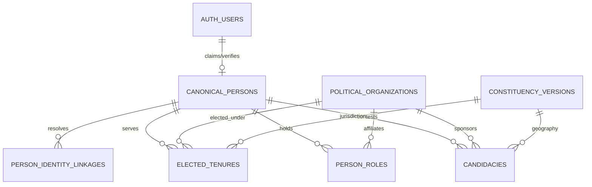

# PLAN-W018-REV-1.0: POLITICAL ENTITY MODEL (PREFLIGHT & ARCHITECTURAL SPECIFICATION)
**Status:** DRAFT / SUBMITTED FOR CTO REVIEW & RATIFICATION  
**Implementation Authorization:** STRICTLY NOT AUTHORIZED  
**Authority:** Master Product Blueprint, AI Agent Master Execution Job Book, Amendments v1.2–v1.5-A  
**Production Status:** STRICTLY AIR-GAPPED & UNTOUCHED  
**Date:** 2026-09-29  

---

## 1. Executive Summary & Authoritative Objective

### 1.1 Objective
Under the Master Execution Document, Milestone **W018 (Political Entity Model)** establishes canonical political entities across the entire PanIN / Kshetra ecosystem for:
- Member of Parliament (**MP**) (Lok Sabha & Rajya Sabha)
- Member of Legislative Assembly (**MLA**) & Legislative Council (**MLC**)
- Election **Candidate** (contesting general, assembly, or local elections)
- Political **Aspirant** (emerging leader, local challenger)
- **Journalist** (beat reporter, stringer, correspondent, fact-checker)
- **Media Organization** (press outlet, broadcast network, news bureau)
- **Political Organization** (national/state political party, civic coalition)

### 1.2 Non-Negotiable Evidence Requirement
**The same real-world entity must resolve to the same canonical ID across all relevant entry points.**  
A person must **never** receive a new canonical identity merely because:
- they contest another election;
- they change party affiliation;
- they change elected office (e.g. Sarpanch → Corporator → MLA → MP);
- they become an aspirant or register on the mobile app;
- they publish articles, press passes, manifestos, or media broadcasts;
- they change geographic constituency over time.

---

## 2. Phase 1 — Current-System Forensic Inspection

A repository-wide audit of all 51 migrations, Fastify backend routes, mobile stores, seed files, and schemas was conducted. The current state is summarized below across the 22 required inspection dimensions:

| # | Inspection Area | Existing Database Objects / Source Artifacts | Key Forensic Findings |
| :--- | :--- | :--- | :--- |
| **1** | **People / Person Identity** | `auth.users`, `public.user_profiles` (006, 027), `public.creator_kyc_records` (013) | `auth.users` manages authentication credentials. `user_profiles` stores app display name and role. `creator_kyc_records` captures legal name, phone, device fingerprint, and selfie hash. **Zero canonical real-world `person` master table currently exists.** |
| **2** | **Politicians / MPs / MLAs** | `public.legislator_profiles` (012), `public.current_legislators` (012 view), `data/seed/mp-profiles.ts`, `data/seed/*-mla-profiles.ts` | Master table `legislator_profiles` keys politicians by composite string: `MLA_TS_2023_KODANGAL_141`. MP seed data keys MPs by `LS_001`. Identical persons across offices have completely disconnected IDs. |
| **3** | **Candidates** | `public.candidate_affidavits` (008), `public.key_contestants` (012), `public.live_candidate_results` (019), `public.local_body_candidates` (023) | Candidates are represented as disconnected UUIDs or text strings per election. Affidavits are keyed by `(candidate_name, ac_no, state_code, election_year)` with no foreign key to `legislator_profiles`. |
| **4** | **Aspirants** | `public.aspirant_profiles` (010), `public.leadership_modules` (010), `public.module_progress` (010), `public.community_endorsements` (010) | Aspirants are keyed by `id UUID` tied 1:1 to `user_id UUID`. If an aspirant later files an election affidavit or becomes an MLA, their identity is entirely disconnected from `candidate_affidavits` and `legislator_profiles`. |
| **5** | **Journalists** | `public.journalist_profiles` (015), `public.articles` (015), `public.fact_checks` (015) | Tied 1:1 to `user_id UUID`. `outlet_affiliation` is a raw unvalidated `TEXT` string. |
| **6** | **Media Organizations** | `public.lmx_brand_kits` (024), `public.lmx_affiliations` (024), `public.lmx_departments` (024) | No master `media_organizations` entity exists. Handled ad-hoc via `organization_id TEXT` and `organization_name TEXT` strings without catalog validation. |
| **7** | **Political Organizations / Parties** | `public.live_party_tallies` (019), `packages/shared/src/constants/parties.ts` | Parties are raw strings (`party TEXT`) across all tables. No database master table exists for political parties. |
| **8** | **Campaigns** | `public.campaigns` (017), `public.campaign_volunteers` (017), `public.campaign_wallets` (026), `public.political_ads` (034) | Tied to `user_id UUID` of campaign manager. Stores raw candidate name. |
| **9** | **Elections** | `public.elections` (001), `public.election_results` (001), `public.live_elections` (019), `public.local_body_elections` (023) | Winner and runner-up stored as raw text strings (`winner_name TEXT`, `winner_party TEXT`). |
| **10** | **Representatives / Office-Holders** | `public.representatives` (023), `public.representative_edits` (023) | Keys office-holders by composite string: `TS-REP-GHMC-W042-2020`. Represents local tiers (Sarpanch, Corporator, Mayor, ZPTC, MPTC). Disconnected from MLA/MP tables. |
| **11** | **Verification / Trust / KYC** | `public.user_verification` (006), `public.creator_kyc_records` (013), `public.pages` (027) | Multi-tier verification requests exists, but verification binds to `auth.users(id)`, not a canonical real-world person. |
| **12** | **User / Profile Relationships** | `auth.users(id)` 1:1 `user_profiles`, 1:1 `creator_kyc_records`, 1:1 `aspirant_profiles`, 1:1 `journalist_profiles`, 1:1 `politician_portal_profiles` | User accounts are currently conflated with specific political roles. Real-world politicians scraped from ECI/MyNeta have zero linkage to user accounts. |
| **13** | **Geography Relationships** | `constituencies(id)` (001), `districts(id)` (040), `mandals(id)` (022/045), `gram_panchayats(id)` (022), `urban_local_bodies(id)` (023) | Core administrative hierarchy is well-established. |
| **14** | **Temporal Geography** | `constituency_versions`, `parliamentary_constituency_versions`, `mandal_versions` (041, 044, 045) | Established W014/W016 temporal validity model (`valid_from`, `valid_to`, `is_current`). Ready to bind political office tenures over time. |
| **15** | **UUIDs & External IDs** | ECI Candidate ID, MyNeta Candidate ID, Sansad Member ID, LGD Codes | Exists only as URLs or scattered attributes in scrapers and JSON blobs. No canonical identifier mapping. |
| **16** | **Search / Index Structures** | `global_search()` RPC (020, 036), GIN/B-tree indexes on `legislator_profiles` | Full-text search queries `legislator_profiles` by text matching. Missing unified entity search. |
| **17** | **API Endpoints** | `apps/api/src/routes/politician.ts`, `constituencies.ts`, `pages.ts`, `journalist.ts`, `lmx.ts` | `politician.ts` routes return empty arrays/mocks (`GET /api/v1/politician/profiles`). `constituencies.ts` returns static seed TS files (`/states/:stateCode/mla`). |
| **18** | **Mobile Consumers** | `apps/mobile/app/legislator/[id].tsx`, `app/representative/[id].tsx`, `app/politician-portal/`, `app/constituency/[id].tsx` | Mobile UI consumes static JSON `legislator-profiles.json`, `SEED_AFFIDAVITS`, or direct Supabase tables. |
| **19** | **Direct Supabase Consumers** | `apps/mobile/lib/supabaseDataService.ts` (`fetchPublicAspirants`, `fetchVerifiedPoliticians`) | Reads direct PostgREST tables. |
| **20** | **Provenance Structures** | `public.provenance_records`, `public.evidence_records`, `public.record_provenance_linkages`, `public.data_sources` (039) | Provenance architecture in Migration 039 supports `domain = 'political_profiles'` and `data_status_enum`. 100% reusable. |
| **21** | **RLS / Triggers / Functions** | Migration 038 & 020 RLS policies | Public read enabled on `user_profiles`, `pages`, `legislator_profiles`. Service-role authority required for verification. |
| **22** | **Duplicate Identity Models** | String-name heuristics in `apps/mobile/stores/affidavits.ts` (`getWealthGrowth(candidateName)`) | Severe duplication risk: same person across multiple elections or offices is unlinked and fragmented across 5+ tables. |

---

## 3. Phase 2 — Identity Forensics Matrix

| Entity Type | Current Table(s) | Primary ID | External ID(s) | User Link | Geography Link | Role Model | Org Link | Election Link | Verification Model | Provenance Model | API Owner | Mobile Consumer | Duplication Risk | Disposition |
| :--- | :--- | :--- | :--- | :--- | :--- | :--- | :--- | :--- | :--- | :--- | :--- | :--- | :--- | :--- |
| **MP** | `data/seed/mp-profiles.ts`, `legislator_profiles` | `LS_001` or `MP_LS_2024_...` | Sansad.in ID, MyNeta URL | None | PC name, State | Hardcoded in profile | String `party` | Contested year | Public official (Scraped) | None (Static seed) | `constituencies.ts` (Mock/Seed) | `legislator/[id].tsx` | **CRITICAL**: Disconnected from MLA career | **REUSE & MIGRATE** |
| **MLA** | `legislator_profiles`, `*-mla-profiles.ts` | `MLA_TS_2023_KODANGAL_141` | MyNeta ID, Wikipedia URL | None | AC name, number, State | House: `state_assembly` | String `current_party` | `legislator_elections` | Public official (ECI scrape) | None (Pre-W012) | `constituencies.ts` (`/mla/:acNo`) | `legislator/[id].tsx`, `constituency/[id]` | **CRITICAL**: Resets on new election term | **REUSE & MIGRATE** |
| **Candidate** | `candidate_affidavits`, `key_contestants` | `UUID` (gen_random_uuid) | MyNeta Candidate ID | None | AC no, State | Candidate | String `party` | `election_year` | ECI affidavit upload | None (Pre-W012) | None (Mobile store seed) | `AffidavitCard.tsx` | **CRITICAL**: Disconnected from winning MLA row | **REUSE & MIGRATE** |
| **Aspirant** | `aspirant_profiles` | `UUID` | None | `user_id` (1:1 auth.users) | Target AC no, State | Role `aspirant` | String `party_affiliation` | Target election year | Mobile self-registration | Pre-W012 | `supabaseDataService.ts` | `leadership-academy.tsx` | **HIGH**: Disconnected if they run as candidate | **REUSE & LINK** |
| **Local Rep** | `representatives` | `TS-REP-GHMC-W042-2020` | TSEC / APSEC ID, SEC URL | None | Ward, GP, Mandal, ULB | `office_type` enum | String `party` | `election_year`, term | `data_status` (verified) | `source_url`, `source_type` | None | `representative/[id].tsx` | **HIGH**: Resets on jurisdiction transfer | **REUSE & MIGRATE** |
| **Journalist** | `journalist_profiles` | `UUID` | Press Card URL | `user_id` (1:1 auth.users) | Coverage areas (JSONB) | `tier` enum | String `outlet_affiliation` | None | Press card verification | Pre-W012 | `journalist.ts` | `journalist/index.tsx` | **LOW**: Clean 1:1, but org is unlinked string | **REUSE & LINK** |
| **Media Org** | `lmx_brand_kits`, `lmx_affiliations` | `organization_id TEXT` | None | Contributor ID string | State | None | None | None | `is_approved` boolean | Pre-W012 | `lmx.ts` | `live/go-live.tsx` | **HIGH**: String identifier collisions | **CANONICALIZE** |
| **Party** | `packages/shared/parties.ts`, `pages` | String code (`BJP`, `INC`) | ECI Symbol / Registration | `pages.owner_id` | State | Role `party` | None | Tallies in live elections | None | Pre-W012 | `pages.ts` | `pages/index.tsx` | **HIGH**: Raw string fragmentation | **CANONICALIZE** |

---

## 4. Phase 3 — Canonical Identity Architecture Design

To eliminate identity fragmentation without breaking existing tables, we introduce a bounded, 4-tier relational canonical model:

### 4.1 Distinct Conceptual Boundaries
1. **User / Account Identity (`auth.users`):** Credentials, phone auth, private session.
2. **Real-World Person Identity (`canonical_persons`):** Real-world human being (`Anumula Revanth Reddy`), biologically unique, enduring across decades.
3. **Political Organization (`political_organizations`):** Institutional entity (e.g. `INC`, `BJP`, `BRS`, `The Hindu`, `TV9`), distinct from individuals.
4. **Political Role (`person_roles`):** A temporal hat worn by a person (e.g. 'Aspirant', 'Journalist', 'Party General Secretary').
5. **Candidacy (`candidacies`):** The historical act of contesting a specific election contest in a specific constituency under a specific party.
6. **Elected Office Tenure (`elected_tenures`):** The legal term of holding sovereign representative office (MLA, MP, Sarpanch) with start and end dates.

---

## 5. Phase 4 — Temporal & Geographic Model

### 5.1 Temporal Relationship Rules
All historical relationships attach to the established W014/W016 temporal geography (`constituency_versions`, `parliamentary_constituency_versions`, `mandal_versions`):
- **Candidacy Geography:** Linked to the specific election year. If delimitation occurred (e.g. 2008), the candidacy points to the version valid during that election.
- **Tenure Geography:** `elected_tenures` carries `term_start DATE NOT NULL`, `term_end DATE`, and `is_current BOOLEAN`. If an MLA served from 2014 to 2018 in an undivided district, their tenure record permanently binds to the 2014 geographic regime without mutating when districts are reorganized in 2016 or 2022.
- **Party Changes (Defections / Shifts):** Modeled via `elected_tenures.party_at_election` vs `elected_tenures.current_party` and `elected_tenures.defection_date`. The historical fact that they won under Party A is immutable; the current affiliation is updated with an effective date.

---

## 6. Phase 5 — Data Truth & Provenance Architecture

Under Migration 039 rules, every canonical political entity and fact must strictly reference:
- `data_sources` (e.g. `'ECI'`, `'MYNETA'`, `'LGD'`, `'SANSAD_LOKSABHA'`, `'TSEC'`);
- `provenance_records` with valid `source_authority_enum` (`'constitutional'`, `'statutory'`, `'media_ngo'`, `'crowdsourced'`);
- `data_status_enum` strictly one of:
  - `OFFICIAL`: ECI gazette, Lok Sabha bulletin, State SEC notification.
  - `VERIFIED`: MyNeta affidavit scraped with source URL, Press Pass verified by PANIN Trust & Safety.
  - `UNVERIFIED`: Crowdsourced representative submission prior to editorial moderation.
  - `UNKNOWN`: Missing historical lineage.
- **Strict Prohibition:** Zero synthetic or AI-inferred political identities or offices.

---

## 7. Phase 6 — Security & Authorization Architecture

- **100% SECURITY INVOKER Stored Functions:** All resolution and query functions will run under `SECURITY INVOKER` with fixed `search_path = public, pg_temp;`.
- **Row Level Security (RLS):**
  - `canonical_persons`, `political_organizations`, `candidacies`, `elected_tenures`: Public `SELECT` enabled for verified/official rows (`data_status IN ('OFFICIAL', 'VERIFIED')`).
  - `person_identity_linkages`: Public `SELECT` enabled; writes restricted strictly to `service_role` and approved admin moderators.
  - Sensitive personal data (unredacted phone numbers, private voter IDs) is never stored in cleartext; Voter EPIC is stored solely as a one-way salted SHA-256 hash (`epic_hash`) for collision-free deduplication.
- **Claiming Authority:** An authenticated mobile user (`auth.users`) claiming to be a real-world politician or journalist cannot unilaterally bind their `user_id` to a `canonical_person`. Account linkage requires passing `user_verification` review by admin / `service_role`.

---

## 8. Phase 7 — API Architecture & Ownership

Authoritative ownership matrix (eliminating duplicate mock paths):

| Operation | Target Route | Protocol | Authoritative Owner | Status in W018 |
| :--- | :--- | :--- | :--- | :--- |
| **Search Political Entities** | `GET /api/v1/entities/search` | Fastify → DB | Fastify API (`entityRoutes.ts`) | **NEW (Canonical)** |
| **Get Person Profile** | `GET /api/v1/entities/persons/:id` | Fastify → DB | Fastify API (`entityRoutes.ts`) | **NEW (Canonical)** |
| **Get Career Timeline** | `GET /api/v1/entities/persons/:id/timeline` | Fastify → DB | Fastify API (`entityRoutes.ts`) | **NEW (Canonical)** |
| **List Current Legislators** | `GET /api/v1/entities/legislators` | Fastify → DB | Fastify API (`entityRoutes.ts`) | **NEW (Replaces mock `/politician/profiles`)** |
| **Get Political Organization** | `GET /api/v1/entities/organizations/:id` | Fastify → DB | Fastify API (`entityRoutes.ts`) | **NEW (Canonical)** |
| **Claim Person Identity** | `POST /api/v1/entities/persons/:id/claim` | Fastify → DB | Fastify API (`entityRoutes.ts`) | **NEW (KYC-gated)** |
| **Legacy MLA Lookup** | `GET /states/:stateCode/mla/:acNo` | Fastify → DB | Fastify API (`constituencies.ts`) | **RETAIN (Wrap canonical query)** |
| **Legacy Politician RSVP** | `POST /api/v1/politician/events/:id/rsvp` | Fastify → DB | Fastify API (`politician.ts`) | **RETAIN** |
| **Legacy Pages Pro** | `POST /api/v1/pages/pro/*` | Fastify → DB | Fastify API (`pages.ts`) | **RETAIN** |

---

## 9. Phase 8 — Duplicate & Migration Analysis

### 9.1 Known Duplicate Clusters to Reconcile
1. **Revanth Reddy Cluster:**
   - `legislator_profiles`: `MLA_TS_2023_KODANGAL_141`
   - `candidate_affidavits`: `aff-ts-65-2023-revanth`, `aff-ts-65-2018-revanth`
   - `data/seed/telangana-mla-profiles.ts`: AC 65 winner
   - `data/seed/mp-profiles.ts`: 2019 MP Malkajgiri
2. **K. T. Rama Rao Cluster:**
   - `legislator_profiles`: Sircilla MLA 2023
   - `candidate_affidavits`: Sircilla 2018, Sircilla 2023
   - `data/seed/telangana-mla-profiles.ts`: AC 29 winner
3. **Local Body to MLA Cohorts:**
   - Representatives who contested municipal elections and later assembly elections.

### 9.2 Deterministic Merge & Resolution Rules
- **Rule 1 (Exact ECI Candidate ID):** If two records share an official ECI candidate ID or MyNeta URL, they resolve to the same `canonical_person`.
- **Rule 2 (Biographic Tuple):** If `(state_code, ac_no, election_year, party, normalized_name)` matches with $> 95\%$ Jaro-Winkler similarity and identical father/spouse name, resolve deterministically.
- **Rule 3 (Fail-Closed Disputed Ambiguity):** If two candidates share similar names in the same state without matching parentage or birth year, they **must not** be merged. Resolution emits `NEEDS_HUMAN_REVIEW` and retains separate provisional IDs.

---

## 10. Phase 9 — Bounded W018 Implementation Proposal

### A. Database Migration (Migration 050)
- `public.canonical_persons`
- `public.political_organizations`
- `public.person_roles`
- `public.candidacies`
- `public.elected_tenures`
- `public.person_identity_linkages`
- Helper stored procedure: `public.fn_resolve_canonical_person(...)` (100% `SECURITY INVOKER`).

### B. Shared Contracts (`@kshetra/shared`)
- Export interfaces in `packages/shared/src/types/politicalEntities.ts`:
  `CanonicalPerson`, `PoliticalOrganization`, `PersonRole`, `Candidacy`, `ElectedTenure`.

### C. Backend API Service (`apps/api`)
- Implement `apps/api/src/services/politicalEntityService.ts`.
- Implement `apps/api/src/routes/politicalEntities.ts`.
- Register routes under `/api/v1/entities/*`.

### D. Mobile Adaptation
- Update `apps/mobile/lib/api/` with typed entity client.
- Add canonical entity resolver helper to unify `MLAProfile`, `MPProfile`, and `RepresentativeProfile`.

---

## 11. Phase 10 — Acceptance Test Specification

| Test ID | Objective | Assertion / Verification Criteria |
| :--- | :--- | :--- |
| **W018-ID-01** | Same person resolves to stable ID | Revanth Reddy 2018 MLA candidate, 2019 MP, and 2023 MLA resolve to single `person_id`. |
| **W018-ID-02** | Role change preserves person ID | Aspirant becoming Candidate or MLA does not create new `canonical_person` record. |
| **W018-ID-03** | Party change preserves person ID | Politician defecting from BRS to INC retains identical `person_id`. |
| **W018-ID-04** | Multi-election candidacies | Contesting 3 elections produces 3 `candidacies` tied to 1 `person_id`. |
| **W018-ID-05** | Historical geography preserved | 2014 tenure links to 2014 constituency version; 2023 links to current version. |
| **W018-ID-06** | Career progression lifecycle | Aspirant → Candidate → Elected Representative preserves single entity lineage. |
| **W018-ID-07** | Org distinct from Person | Political party (e.g. INC) and party president (Revanth Reddy) have distinct UUIDs. |
| **W018-ID-08** | Account decoupled from Person | Anonymous or citizen `auth.users` cannot claim a politician entity without KYC approval. |
| **W018-ID-09** | Conflict fails closed | Ambiguous candidates with same common name without disambiguating data do not merge. |
| **W018-ID-10** | Provenance preservation | All canonical entities carry valid `provenance_id` and `data_status`. |
| **W018-SEC-01** | Unauthorized mutation fails closed | Non-admin caller cannot alter `person_identity_linkages` (RLS blocks). |
| **W018-SEC-02** | Verification restricted | Normal user cannot approve `user_verification` claims. |
| **W018-REG-01** | Master regression intact | Suites W011 through W017 remain 100% green. |

---

## 12. Governance & Compliance Statement

1. **Implementation Authorization:** **STRICTLY NOT AUTHORIZED.** This document represents planning and preflight forensics only.
2. **Production Status:** Production database `ehfafcnimmjusyvplbah` remains 100% air-gapped, untouched, and uncontacted.
3. **Geometry Baseline:** PostGIS 589 geometry baseline remains frozen and verified (`f839fa02...`).
4. **Deferred Milestone Integrity:** W016-C3-R10 Gap B remains deferred to W023 APK/device testing; W016-C3-R11 remains strictly blocked.
5. **No Code Mutations:** Zero migrations executed, zero database tables modified, zero production deployments performed.
