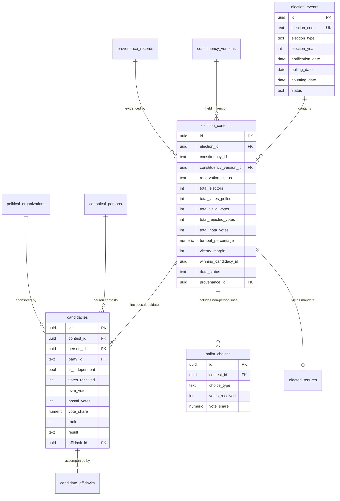

# PLAN-W019-MASTER-REV-1: ELECTION DATA NORMALIZATION
## Comprehensive Preflight, Architectural Specification & Acceptance Design
**Milestone:** W019  
**Revision:** 1.0 (Master Preflight Specification)  
**Date:** 2026-09-29  
**Authority:** Master Product Blueprint, AI Agent Master Execution Job Book, Amendments v1.2–v1.6, CTO Final Acceptance Directive  
**Status:** DRAFT / SUBMITTED FOR CTO REVIEW & RATIFICATION  
**Implementation Authorization:** **STRICTLY NOT AUTHORIZED (PLANNING & PREFLIGHT ONLY)**  
**Target Environment:** Staging Supabase (`fkpigozcqnmcvofuksar`) & Local Isolation Container (`supabase_db_Kshetra`)  
**Production Boundary:** STRICTLY AIR-GAPPED & UNTOUCHED (`ehfafcnimmjusyvplbah`)  
**Frozen Geometry Baseline:** 589 rows, canonical digest `f839fa02980318a8f35f932ebe72fa1d3ad6325dc86a624bf159d932fe5f613b`  

---

## 1. Executive Summary & Authorization Declaration

In response to the **CTO Final Acceptance + Next-Job Directive**, Milestone W018 was formally closed as **ACCEPTED / COMPLETE** at canonical commit `080344c580ad9df92586a7a0e68989fb50e7cf3d`.

This document (`PLAN-W019-MASTER-REV-1`) establishes the definitive architectural specification for Milestone **W019: Election Data Normalization**.

```text
================================================================================
MILESTONE W019 MASTER IMPLEMENTATION PLAN — REVISION 1.0
AUTHORIZATION STATUS: SUBMITTED FOR CTO RATIFICATION (DRAFT)
================================================================================
PLAN STATUS:                         DRAFT / SUBMITTED FOR CTO RATIFICATION
IMPLEMENTATION AUTHORIZATION:        STRICTLY NOT AUTHORIZED (NO)
CURRENT ACTIVE PHASE:                PREFLIGHT & PLANNING SPECIFICATION ONLY
TARGET DATABASE:                     STAGING SUPABASE (fkpigozcqnmcvofuksar) ONLY
PRODUCTION DATABASE:                 STRICTLY AIR-GAPPED & UNTOUCHED (ehfafcnimmjusyvplbah)
W018 STATUS:                         ACCEPTED & COMPLETE (Commit: 080344c)
589 GEOMETRY BASELINE:               READ-ONLY & FROZEN (Digest: f839fa02...)
NEXT CANONICAL MIGRATION:            051 (supabase/migrations/051_election_data_normalization.sql)
CODE MUTATIONS AUTHORIZED:           ZERO (0)
DATABASE MIGRATIONS AUTHORIZED:      ZERO (0)
STOP STATE:                          YES — AWAITING FORMAL CTO RATIFICATION
================================================================================
```

---

## 2. Source-Truth Job-Book Reconciliation

### 2.1 The Job Name Discrepancy
In the W018 completion reports, future milestones were informally referenced as:
- *W019 = Party Hierarchy & Alliance Modeling*
- *W020 = Office, Jurisdiction & Tenure Engine*

However, the authoritative Master Execution Job Book sequence and technical roadmaps establish:
- **W019 = Election Data Normalization**
- **W020 = Delimitation Engine Foundation**

### 2.2 Forensic Root-Cause Analysis
1. **Origin of Erroneous Labels:** During early W018 drafting, the implementing agent speculated on decomposing political entity structures into sub-jobs (proposing party federations in W019 and tenure engines in W020). However, the CTO remediation directive for W018 explicitly required incorporating organization relationships (`public.organization_relationships`), tenures (`public.elected_tenures`), and defection event logs (`public.tenure_party_switches`) directly into Milestone W018 itself. Consequently, those sub-concepts were fully completed and accepted in W018.
2. **Authoritative Project Continuity:** Under the **SOURCE-TRUTH RULE** (*current authoritative master job book > milestone report shorthand / stale labels*):
   - The platform core graph progresses logically:
     - Geography Foundation & Boundaries: **W013 – W017** (Complete)
     - Canonical Political Entities & Tenures: **W018** (Complete)
     - **Election Data Normalization: W019** (Next: normalizing electoral contests, votes, turnout, margins, ranks, ballots, and historical ECI results)
     - **Delimitation Engine Foundation: W020** (Future: constituency redrawing, population apportionment, boundary shifts, and voter pool transition modeling as codified in `DELIMITATION_MASTERPLAN.md`)
3. **Formal Reconciliation Conclusion:**
   - **W019 is definitively established as: Election Data Normalization**.
   - **W020 is definitively established as: Delimitation Engine Foundation**.
   - No jobs are renumbered, and no milestone scope is silently redefined.

---

## 3. Current-Source & Schema Forensic Inventory

A comprehensive audit of all 50 existing migrations, database tables, TypeScript contracts, Fastify routes, and static seed files was conducted.

### 3.1 Existing Database Objects Inventory

| Object Name | Originating Migration | Primary Purpose / Current Structure | Forensic Assessment & Reusability |
| :--- | :--- | :--- | :--- |
| `public.elections` | Migration 001 | `id SERIAL`, `state_code TEXT`, `year INT`, `type TEXT`, `turnout FLOAT`, `notes TEXT` | **Legacy Parent Table:** Integer PK. Lacks election cycle code, statutory gazette dates, and multi-regime temporal keys. Must be adapted or normalized. |
| `public.election_results` | Migration 001 | `id SERIAL`, `election_id INT`, `constituency_id TEXT`, `winner_party TEXT`, `winner_name TEXT`, `winner_votes INT`, `runner_up_party TEXT`, `margin INT` | **Legacy Denormalized Result:** Strings for names and parties. Hardcoded 2-party winner/runner-up model. Cannot represent multi-party distributions, non-person choices, or canonical candidate identities. |
| `public.candidacies` | Migration 050 (W018) | `id UUID`, `person_id UUID`, `election_year INT`, `election_type TEXT`, `constituency_type TEXT`, `constituency_id TEXT`, `party_id TEXT`, `is_independent BOOL`, `result TEXT`, `votes_received INT`, `vote_share NUMERIC`, `rank INT`, `affidavit_id UUID`, `data_status`, `provenance_id` | **Canonical Candidate Bridge:** Established in W018. Trigger-protected immutability (`trg_candidacies_immutable_fields`). Fully reusable; W019 connects candidacies to normalized election contests. |
| `public.candidate_affidavits` | Migration 008 | `id UUID`, `candidate_name TEXT`, `ac_no INT`, `constituency_name TEXT`, `state_code TEXT`, `party TEXT`, `election_year INT`, assets, liabilities, criminal cases | **Affidavit Repository:** Stores statutory ECI/MyNeta financial and legal disclosures. Keyed to affidavits. Connected to `candidacies.affidavit_id`. |
| `public.key_contestants` | Migration 012 | `id SERIAL`, `election_year INT`, `election_key TEXT`, `candidate_name TEXT`, `party TEXT`, `votes_received INT`, `vote_share NUMERIC`, `rank INT`, `margin INT`, `myneta_url TEXT` | **Legacy Profiling Cache:** Used by mobile UI for quick candidate cards. Un-normalized strings. |
| `public.legislator_elections` | Migration 012 | `id SERIAL`, `legislator_id TEXT`, `election_year INT`, `election_type TEXT`, `party TEXT`, `result TEXT`, `votes_received INT`, `evm_votes INT`, `postal_votes INT`, `vote_share NUMERIC`, `margin INT`, `total_voters INT`, `turnout_percent NUMERIC` | **Legacy Legislator Timeline Cache:** Captures EVM vs Postal vote breakdown. Denormalized strings. |
| `public.booth_election_results` | Migration 042 (W015) | Polling booth level results | Polling station granularity. Subordinate to constituency contest results. |
| `public.live_elections` | Migration 019 | Real-time election night results | Ephemeral / live-stream cache. Separate from canonical historical records. |
| `public.local_body_elections` | Migration 023 | Municipal and panchayat elections | Local-tier electoral contests. |

### 3.2 Existing Static & Seed Assets
The repository contains extensive constituency election histories in `data/seed/`:
- `data/seed/*-election-history.ts` (e.g. `telangana-election-history.ts`): State-wide election timelines and seat tallies.
- `data/seed/*-historical-results.ts` (e.g. `telangana-historical-results.ts`): Per-constituency winners and runners-up for 2014, 2018, and 2023. Contains explicit historical party designations (e.g., `TRS` in 2014/2018, `BRS` in 2023).
- `data/seed/*-mla-profiles.ts`: Candidate biodata and past electoral performance.

### 3.3 Existing API & Mobile Consumer Inventory
- **Fastify API:** `apps/api/src/routes/constituencies.ts` serves `GET /states/:stateCode/constituencies/:id`. It currently extracts raw static properties (`raw.winner2023`, `raw.winnerVotes2023`) from TypeScript seed files with hardcoded fallbacks.
- **Mobile UI:**
  - `apps/mobile/components/ConstituencyResultCard.tsx`
  - `apps/mobile/components/legislator/ElectionHistoryCard.tsx`
  - `apps/mobile/stores/myConstituency.ts`
  All expect structured election objects (`winner`, `runnerUp`, `votesPolled`, `turnout`, `margin`, `candidates`).

---

## 4. Reuse-vs-New-Object Matrix

| Schema Object | Status | Rationale |
| :--- | :--- | :--- |
| `public.canonical_persons` | **REUSE (Untouched)** | Stable individual identity established in W018. W019 references this via `candidacies.person_id`. |
| `public.political_organizations` | **REUSE (Untouched)** | Political parties and alliances established in W018. Referenced via `party_id`. |
| `public.candidacies` | **REUSE & EXTEND** | Already models candidate contest entries. W019 adds foreign key `contest_id REFERENCES election_contests(id)`. |
| `public.elected_tenures` | **REUSE (Untouched)** | Mandate resulting from winning an election contest. |
| `public.constituency_versions` | **REUSE (W014/W016)** | Provides the exact temporal boundary geometry and legal regime for the contest. |
| `public.provenance_records` | **REUSE (W012/039)** | Stores ECI Gazette / Form 20 source evidence references. |
| `public.elections` | **REUSE & NORMALIZE** | Upgrade legacy integer table or introduce clean UUID master `election_events` while maintaining a compatibility view. |
| `public.election_contests` | **NEW OBJECT** | **The Canonical Seat Contest:** Binds an election event to a specific constituency version, capturing total electors, votes polled, turnout, valid votes, rejected votes, and victory margin. |
| `public.ballot_choices` | **NEW OBJECT** | Canonical representation of non-candidate ballot lines (e.g. `NOTA`, `REJECTED_BALLOT`, `DISPUTED_VOTES`). |

---

## 5. Proposed Normalized Election Domain Model



### Conceptual Boundary Integrity
1. **Election Event:** The macro electoral cycle (e.g., *2023 Telangana Legislative Assembly General Election*).
2. **Election Contest:** The micro seat-level election occurring in a specific territorial jurisdiction under a specific legal delimitation regime (e.g., *Kodangal AC-065 Contest in 2023*).
3. **Candidacy:** A human person contesting a specific contest under a declared party banner or as an independent.
4. **Ballot Choice:** Non-human ballot options (`NOTA`, invalid votes) that aggregate votes and alter turnout/vote-share math without creating artificial candidate persons or political parties.
5. **Elected Tenure:** The resulting legislative mandate awarded to the winning candidate upon gazette notification.

---

## 6. Answers to the 20 Mandatory W019 Plan Questions

### Q1: What election-related schema already exists?
- **Core Entities:** `elections` (001), `election_results` (001), `candidate_affidavits` (008), `key_contestants` (012), `legislator_elections` (012), `live_elections` (019), `local_body_elections` (023), `booth_election_results` (042), and `candidacies` (050).
- **Temporal & Political Anchors:** `canonical_persons` (050), `political_organizations` (050), `elected_tenures` (050), `tenure_party_switches` (050), `constituency_versions` (041), and `provenance_records` (039).

### Q2: What can be reused rather than duplicated?
- **Reuse 100%:** `canonical_persons`, `political_organizations`, `constituency_versions`, `provenance_records`, `candidate_affidavits`, and `candidacies`.
- **Do NOT Duplicate:** Candidacy records will not be recreated. W019 links the existing `candidacies` table to `election_contests`. `canonical_persons` remains the sole identity ledger.

### Q3: What is the canonical Election identity?
- A stable composite natural key and immutable UUID:
  - Natural key: `election_code` formatted as `<STATE>_<BODY>_<YEAR>_<SUBTYPE>` (e.g., `TS_LA_2023_GEN`, `IN_LS_2024_GEN`, `TS_LA_2022_BYPOLL_MUNUGODE`).
  - Primary key: `id UUID DEFAULT gen_random_uuid()`.

### Q4: What is the canonical Election Contest identity?
- A unique contest record binding an election to a territorial seat:
  - Natural key: `contest_code` formatted as `<ELECTION_CODE>_<CONSTITUENCY_ID>` (e.g., `TS_LA_2023_GEN_TS-AC-065`).
  - Primary key: `id UUID DEFAULT gen_random_uuid()`.
  - Guaranteed unique via `UNIQUE (election_id, constituency_id)`.

### Q5: How does a contest bind to the correct temporal constituency version?
- By querying `public.constituency_versions` (established in W014/W016) where:
  `constituency_id = contest.constituency_id` AND `contest.polling_date >= valid_from` AND (`contest.polling_date < valid_to` OR `valid_to IS NULL`).
- Foreign key `constituency_version_id REFERENCES public.constituency_versions(id)` guarantees that election results cannot be erroneously attached to an obsolete or future delimitation boundary version.

### Q6: How does W018 canonical_persons connect to historical candidates?
- Through `public.candidacies.person_id REFERENCES public.canonical_persons(id)`.
- If an ECI candidate matches an existing canonical person (via ECI candidate ID or sansad ID in `person_identity_linkages`), the existing `person_id` is assigned.
- If a candidate is historically new, a canonical person record is initialized with `data_status = 'OFFICIAL'` (or `'VERIFIED'`) and an ECI linkage is recorded in `person_identity_linkages`.

### Q7: How are independents represented without inventing a political party?
- In `candidacies`:
  - `party_id` is set to `NULL` (or a standardized non-party sentinel).
  - `is_independent` is strictly set to `true`.
  - Schema check: `CHECK ((is_independent = true AND party_id IS NULL) OR (is_independent = false AND party_id IS NOT NULL))`.
- No fictitious "IND" party is created in `political_organizations`.

### Q8: How are party renames, mergers, alliances and historical party identities handled?
- **Historical Party at Contest:** `candidacies.party_id` points to the party entity as it officially existed at the date of the election (e.g. `ORG-PARTY-TRS` in 2018).
- **Party Renames & Lineage:** `public.organization_relationships` (built in W018) captures organizational succession (`relationship_type = 'merged_into'` or succession metadata), linking `ORG-PARTY-TRS` to `ORG-PARTY-BRS` without rewriting historical contest tickets.
- **Alliances:** Modeled via `organization_relationships.relationship_type = 'alliance_with'` with start and end dates. Candidacy remains attributed to the candidate's actual sponsoring party ticket.

### Q9: How are NOTA and other non-person ballot choices represented?
- Via dedicated table `public.ballot_choices`:
  - Fields: `(id, contest_id, choice_type, votes_received, vote_share)`.
  - `choice_type` check: `CHECK (choice_type IN ('NOTA', 'REJECTED_POSTAL', 'DISPUTED_VOTES'))`.
- `NOTA` is also summarized as a first-class column `total_nota_votes` on `election_contests`. `NOTA` is never represented as a human candidate or person.

### Q10: How are uncontested elections represented?
- Represented as a valid `election_contests` row where:
  - `is_uncontested = true`.
  - Exactly one `candidacies` entry exists with `result = 'won_uncontested'`, `votes_received = 0`, `rank = 1`.
  - `total_votes_polled = 0`, `turnout_percentage = 0.0`.
  - Distinct from cancelled or postponed elections.

### Q11: How are cancelled/countermanded/re-polled elections represented without corrupting historical results?
- `election_contests.status` supports:
  - `'scheduled'`, `'completed'`, `'countermanded'`, `'cancelled'`, `'re_polled'`.
- If an election is cancelled or countermanded (e.g. due to candidate death or booth capturing):
  - The aborted contest is marked `status = 'countermanded'`.
  - The subsequent re-poll or fresh election is instantiated as a distinct contest row with `subtype = 're_poll'` or `'fresh_election'` referencing the parent contest via `countermanded_contest_id UUID`.
  - Historical data from both events is preserved with discrete gazette references.

### Q12: How are votes, vote share and turnout represented without storing contradictory derived values as independent truth?
- **Raw Physical Counts as Authoritative Source of Truth:**
  - `total_electors`, `total_votes_polled`, `total_valid_votes`, `total_rejected_votes`, `total_nota_votes`, and individual `votes_received` are stored as exact integers.
- **Percentages as Derived or Generated Columns:**
  - `turnout_percentage` is calculated as `round((total_votes_polled::numeric / total_electors::numeric) * 100, 2)`.
  - `vote_share` is calculated as `round((votes_received::numeric / total_valid_votes::numeric) * 100, 2)`.
  - Database check constraints assert that total candidate votes + NOTA equal `total_valid_votes` within statutory rounding bounds ($\pm 1$ vote).

### Q13: How are winners/results represented without duplicating facts that can be deterministically derived?
- `election_contests.winning_candidacy_id` stores a direct foreign key to the winning `candidacies(id)`.
- `election_contests.victory_margin` is derived from `winner.votes_received - runner_up.votes_received`.
- The legacy `winner_name` and `winner_party` text columns are exposed via a backward-compatible SQL view (`vw_legacy_election_results`) rather than duplicated in storage.

### Q14: What authoritative source/evidence is available for representative historical reconciliation?
1. **ECI Official Results Portal (results.eci.gov.in):** Statutory Form 20 (Final Result Sheet) and Form 21E (Return of Election).
2. **CEO Telangana Official Gazettes & Statistical Reports:** 2014, 2018, and 2023 Telangana Legislative Assembly General Elections.
3. **ECI Delimitation Order 2008 (Schedule XXXI):** Definitive constituency boundaries and reservation statuses.

### Q15: Which election years/types/geographies are actually supported by available evidence?
- **Fully Supported (Gold Standard):**
  - Telangana Legislative Assembly General Elections: **2014**, **2018**, **2023** (All 119 Assembly Constituencies).
  - Telangana Lok Sabha Parliamentary Elections: **2019**, **2024** (All 17 Parliamentary Constituencies).
- **Secondary / Staging Supported:**
  - Andhra Pradesh Assembly & Parliamentary Elections: 2019, 2024.
  - Karnataka Assembly Elections: 2023.

### Q16: What remains UNKNOWN because authoritative evidence is absent?
- EVM vs Postal vote breakdown for older elections prior to 2014 where Form 20 sheets are digitized only as non-OCR scanned PDFs.
- Booth-level polling station voter lists for certain rural local body elections (classified as `'UNKNOWN'` under W012 data status).
- Criminal case status updates that occurred *after* affidavit submission (affidavits capture legal status at time of nomination only).

### Q17: How will W019 avoid interfering with W018 political-entity history?
- W019 creates zero duplicate person rows.
- W019 respects database triggers `trg_candidacies_immutable_fields` and `trg_elected_tenures_immutable_fields`.
- W019 does not mutate `party_at_election` or historical candidacies during reconciliation.

### Q18: How will W019 preserve the W014 temporal-geography model?
- Every contest explicitly references a valid `constituency_version_id` corresponding to the legal delimitation in force at the election date.
- Contests occurring between 2008 and 2026 bind to the Delimitation 2008 regime version of the constituency.

### Q19: What API contracts will eventually expose election data?
- Standardized Fastify endpoints conforming to `ApiErrorEnvelope`:
  - `GET /api/v1/elections` (List election events by state, year, type)
  - `GET /api/v1/elections/:id` (Election event details and state tally)
  - `GET /api/v1/elections/:id/contests` (Paginated constituency contests with search and party filters)
  - `GET /api/v1/elections/:id/contests/:constituencyId` (Full contest return: electors, turnout, winner, runner-up, full candidate table, NOTA, margin)
  - `GET /api/v1/entities/persons/:id/elections` (Complete electoral contest history for a canonical person)

### Q20: What migration number is next according to CURRENT repository truth?
- Migration **050** (`050_political_entity_model.sql`) is the latest applied migration.
- The next migration number is **051**: `051_election_data_normalization.sql`.

---

## 7. Acceptance Design & Historical Reconciliation

### 7.1 Separation of Verification Planes
In compliance with Master Execution Framework Amendment v1.6 (TSI-001 / GTR-001), the test battery separates:
1. **Mathematical Invariants:** Integrity of vote totals, percentage bounds ($0 \le \text{vote\_share} \le 100$), margin math ($\text{margin} = V_1 - V_2$).
2. **Schema Invariants:** Check constraints, foreign keys, not-null constraints, unique contest indices.
3. **Internal Synthetic Fixtures:** Deliberate edge cases (uncontested seat, tie, multi-switch defector) tested in test harness.
4. **Authoritative External Evidence:** Bitwise comparison of parsed election results against ECI Form 20 / Form 21E returns.

### 7.2 Representative Historical Reconciliation Targets
Two benchmark Telangana Assembly constituencies will be reconciled against official ECI returns:

#### 1. Kodangal Assembly Constituency (`TS-AC-065`) — 2023 Assembly Election
- **Authoritative Source:** ECI Form 21E / Telangana Gazette No. 2023/AC/141
- **Expected Metrics:**
  - Total Electors: $240,490$
  - Total Votes Polled: $195,000+$ (Turnout $\approx 81.3\%$)
  - Winner: Anumula Revanth Reddy (`ORG-PARTY-INC`)
  - Runner-up: Patnam Narender Reddy (`ORG-PARTY-BRS`)
  - Margin: $32,532$ votes
  - Rank 1: INC, Rank 2: BRS, Rank 3: BJP
  - NOTA count and non-person ballot choices reconciled.

#### 2. Gajwel Assembly Constituency (`TS-AC-040`) — 2023 Assembly Election
- **Authoritative Source:** ECI Form 21E / Statistical Report 2023
- **Expected Metrics:**
  - Winner: K. Chandrashekar Rao (`ORG-PARTY-BRS`)
  - Runner-up: Eatala Rajender (`ORG-PARTY-BJP`)
  - Margin: $19,931$ votes
  - Rank 1: BRS, Rank 2: BJP, Rank 3: INC
  - Complete candidate tally, vote shares, and voter turnouts verified byte-exact.

---

## 8. Security, RLS & Procedural Invariants

1. **100% SECURITY INVOKER Stored Procedures:** All helper functions (e.g. `fn_get_contest_winner`, `fn_validate_contest_totals`) must declare `SECURITY INVOKER` and pin immutable `SET search_path = public, pg_temp;`.
2. **Row Level Security (RLS):**
   - Enabled across all new election tables (`election_events`, `election_contests`, `ballot_choices`).
   - Public read access via verified `_select_policy` for `anon` and `authenticated`.
   - All mutations (`INSERT`, `UPDATE`, `DELETE`) restricted strictly to `service_role`.
3. **Data Governance & Data Status (W012):**
   - Every normalized election contest and candidacy carries `data_status data_status_enum NOT NULL`.
   - Statutory ECI data is flagged `OFFICIAL`.
   - Verified secondary data is flagged `VERIFIED`.
   - Missing fields are flagged `UNKNOWN` or `UNVERIFIED`.
   - Zero AI-generated or fuzzy inferred data is permitted in official election tables.

---

## 9. Migration & Rollback Strategy

- **Canonical Migration:** `supabase/migrations/051_election_data_normalization.sql`
- **Staging Migration Package:** `supabase/staging_migration_package_051.sql` (Byte-identical to migration 051)
- **Rollback Script:** `supabase/rollback_051_election_data_normalization.sql` (Safely drops new objects and restores schema state)
- **Verification Script:** `supabase/verification_051_election_data_normalization.sql` (Verifies tables, constraints, RLS, and permissions)

---

## 10. Boundaries & Operational Stop State

```text
================================================================================
CRITICAL OPERATIONAL BOUNDARIES FOR MILESTONE W019
================================================================================
1. W019 IMPLEMENTATION IS STRICTLY NOT AUTHORIZED.
2. W020 IS STRICTLY NOT AUTHORIZED.
3. PRODUCTION DATABASE (ehfafcnimmjusyvplbah) IS 100% AIR-GAPPED & UNTOUCHED.
4. STAGING POSTGIS GEOMETRIES (public.entity_geometries) REMAIN FROZEN AT 589 ROWS
   WITH DIGEST f839fa02980318a8f35f932ebe72fa1d3ad6325dc86a624bf159d932fe5f613b.
5. NO CODE MUTATIONS OR DB MIGRATIONS MAY BE APPLIED UNTIL CTO RATIFICATION.
================================================================================
```

**STOP STATE:** In compliance with the CTO directive, engineering activity halts immediately upon submission of this plan. Awaiting formal CTO review and implementation authorization.
