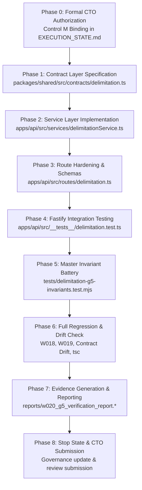

# PLAN-W020-G5-REV-1.0: DELIMITATION ENGINE FOUNDATION
## Core Logic, Mathematical Models, Service Layer & Hardened Read APIs Specification
**Milestone:** W020-G5  
**Revision:** 1.0 (Bounded Pre-Implementation Architecture & Gate Specification)  
**Date:** 2026-09-30  
**Authority:** Master Product Blueprint, AI Agent Master Execution Job Book, Amendments v1.2–v1.6, Amendment v1.5-A (Section 26), PANIN India Election & Political Data Constitution, CTO Directive (W020-G4 Acceptance & W020-G5 Planning Mandate)  
**Status:** DRAFT / SUBMITTED FOR CTO REVIEW & RATIFICATION  
**Implementation Authorization:** **STRICTLY NOT AUTHORIZED (PLANNING & PREFLIGHT SPECIFICATION ONLY)**  
**Predecessor Status:** W018 (ACCEPTED / COMPLETE), W019 (ACCEPTED / COMPLETE / CLOSED), W020-G0..G4 (ACCEPTED / COMPLETE / CLOSED)  
**Target Environment:** Staging Supabase (`fkpigozcqnmcvofuksar`) & Local Workspace  
**Production Boundary:** STRICTLY AIR-GAPPED & UNTOUCHED (`ehfafcnimmjusyvplbah`)  
**Frozen Geometry Baseline:** Exactly 589 rows, canonical SHA-256 digest `f839fa02980318a8f35f932ebe72fa1d3ad6325dc86a624bf159d932fe5f613b`  

---

## 1. Document Title & Metadata
* **Document Identifier:** `PLAN-W020-G5-REV-1.0`
* **Milestone:** W020-G5 (Delimitation Engine Foundation — Core Logic, Mathematical Models, Service Layer & Hardened Read APIs)
* **Author:** PANIN Engineering / Senior Backend & Data Architect
* **Governing Specification:** Amendment v1.5-A Section 26 (22-Section Planning Protocol)
* **Date of Formulation:** 2026-09-30
* **Target Version:** API v1 / Database Migration 055 Baseline
* **Parent Execution Track:** Master Job W020 (Delimitation Engine Foundation)
* **Plan Status:** `SUBMITTED_FOR_CTO_RATIFICATION`
* **Implementation Authorization Status:** `STRICTLY_NOT_AUTHORIZED`

---

## 2. Problem Statement (Task Understanding & Core Objectives)
The legacy delimitation implementation in `apps/api/src/routes/delimitation.ts` and `apps/mobile/lib/delimitation/` originated as exploratory prototypes. While functional for rough demonstrations, the existing codebase possesses several structural, mathematical, and governance defects:
1. **Lack of ECC-001 Response Standard:** All 14 endpoints in `apps/api/src/routes/delimitation.ts` return raw unstructured JSON objects rather than standard `ApiSuccessEnvelope<T>` and `sendApiError()` envelopes.
2. **Absence of Dedicated Service Architecture:** Calculation routines, Census 2011 dataset traversals, and hardcoded postal lookups are mixed directly inside route handler closures without a domain service layer (`delimitationService.ts`).
3. **Missing Statutory Scenario Separation:** Hypothetical research projections (e.g. population divisor seat redistribution) are returned without mandatory scenario metadata, risking confusion between official statutory orders and research models.
4. **Vague Demographic & Timeline Terminology:** Endpoints reference "2025" or "post-Census 2026" instead of the authoritative **Census 2027** national operation, and lack field-separated legal succession grounding for Andhra Pradesh and Telangana.
5. **Heuristics Masquerading as Facts:** Geometric approximations (e.g. PIN code centroid lookups, Polsby-Popper compactness scores, sitting MLA vulnerability scores) are not formally categorized under a strict mathematical taxonomy.
6. **Unauthenticated Webhook Ingestion:** `POST /api/v1/delimitation/monitor-webhook` lacks fail-closed secret authentication.

**Core Objective of W020-G5:** Establish the architectural foundation for PANIN's delimitation subsystem by implementing a dedicated `delimitationService.ts`, hardening all 14 Fastify route handlers with Ajv schemas and ECC-001 envelopes, establishing shared contract types in `@kshetra/shared`, enforcing the 6-tier Mathematical Classification Taxonomy, attaching 10 mandatory metadata fields to scenario projections, and validating the subsystem against a 30-check acceptance test battery.

---

## 3. Current State Analysis (Repository Inspection, Root-Cause Interpretation & Dependency/Blocking Analysis)

### 3.1 Repository Inspection
* **Database State:** Migration 055 was verified in preflight (23/23 PASS) and applied to staging (`fkpigozcqnmcvofuksar`) in W020-G4. Tables `delimitation_proposals` and `constituency_mapping` are bridged via 5 foreign keys (`ON DELETE RESTRICT`) to `delimitation_regimes`, `constituency_versions`, and `provenance_records`.
* **Zero Persistent `is_scenario` Column:** Staging catalog audit proves that neither table contains a redundant `is_scenario` column. Regime semantics derive exclusively from `delimitation_regimes.legal_status`.
* **Geometry State:** Exactly 589 rows in `public.entity_geometries`, matching canonical digest `f839fa02980318a8f35f932ebe72fa1d3ad6325dc86a624bf159d932fe5f613b`.
* **Route Implementation:** `apps/api/src/routes/delimitation.ts` contains 758 lines of code registering 14 endpoints.
* **Census Dataset:** `data/census/india-district-population-2011.ts` contains Census 2011 state- and district-level Primary Census Abstract data.
* **Predecessor Milestones:**
  - W018: ACCEPTED / COMPLETE (Canonical Political Entity Model, `080344c`).
  - W019: ACCEPTED / COMPLETE / CLOSED (Election Data Normalization, DEC-083).
  - W020-G4: ACCEPTED / COMPLETE / CLOSED (Migration 055 Canonical Bridge, DEC-084).

### 3.2 Root-Cause Interpretation
The existing delimitation endpoints were written during initial feature prototyping without reference to the Master Contract Envelopes standard (ECC-001 / Job W008) or the PANIN India Election & Political Data Constitution. Consequently, inputs were not strictly sanitized, errors leaked raw exceptions, and analytical simulations were not partitioned from statutory legal data.

### 3.3 Dependency & Blocking Analysis
* **Upstream Dependencies:** W018 (political entities/tenures), W019 (election contests/results), and W020-G4 (Migration 055 schema bridge) are fully resolved and accepted.
* **Current Blocking State:** W020-G5 implementation is strictly BLOCKED until the CTO formally approves this specification (`PLAN-W020-G5-REV-1.0.md`).
* **Downstream Dependencies:** W020-G6 (Historical Delimitation Data Ingestion) and W020-G7 (Mobile Delimitation UI Integration) depend directly on the service and API contracts finalized in G5.

---

## 4. Fact / Inference / Assumption / Unknown Register

```text
┌─────────────────────────────────────────────────────────────────────────────┐
│                 FACT / INFERENCE / ASSUMPTION / UNKNOWN REGISTER            │
├──────┬──────────────────────────────────────────────────────────────────────┤
│ FACT │ 1. Delimitation Order 2008 was enacted on 19 Feb 2008 under the      │
│      │    Delimitation Act, 2002 as Schedule II (State of Andhra Pradesh).  │
│      │ 2. APRA 2014 (Act No. 6 of 2014) bifurcated Schedule II into        │
│      │    Schedule XXXI (Telangana: 119 ACs) and Schedule II (AP: 175 ACs). │
│      │ 3. AP Reorganisation (Removal of Difficulties) Order, 2015 is        │
│      │    identified as G.S.R. 311(E), dated 23 April 2015, effective       │
│      │    immediately ("comes into force at once").                         │
│      │ 4. Commission's Notification No. 282/AP/2018(DEL) was issued on      │
│      │    22 September 2018 under Sec 9(1)(b) Delimitation Act 2002.        │
│      │ 5. Census 2011 is the latest completed statutory census in India.    │
│      │ 6. Census 2027 is in progress; final population data is unavailable. │
│      │ 7. Staging database fkpigozcqnmcvofuksar contains Migration 055.     │
│      │ 8. 589 PostGIS geometry baseline digest is f839fa02...               │
├──────┼──────────────────────────────────────────────────────────────────────┤
│ INF. │ 1. S.O. 1416(E) was a misidentified instrument and must be excluded. │
│      │ 2. 29 May 2014 is the APRA Amendment Ordinance date, not G.S.R.     │
│      │    311(E)'s promulgation or commencement date.                       │
│      │ 3. Because Census 2027 results do not exist, any 2027 delimitation   │
│      │    calculation is strictly a SCENARIO_PROPOSED_REGIME simulation.    │
│      │ 4. The ideal divisor 293,896.84 is a PANIN-derived quotient (2011    │
│      │    population / 4,120 seats) and NOT a constitutional constant.      │
├──────┼──────────────────────────────────────────────────────────────────────┤
│ ASS. │ 1. Fastify 5.2 and Node.js 22 runtime will execute all apportionment  │
│      │    calculations with exact integer arithmetic without float drift.   │
│      │ 2. The 14 existing routes cover all frontend prototype requirements. │
│      │ 3. External gazette scrapers will supply valid Bearer tokens matching │
│      │    KSHETRA_MONITOR_SECRET.                                           │
├──────┼──────────────────────────────────────────────────────────────────────┤
│ UNK. │ 1. The exact date Parliament will enact the next Delimitation Act.   │
│      │ 2. The final date of publication of Census 2027 PCA tables.          │
│      │ 3. Final ward-level boundaries for urban local bodies post-2027.     │
└──────┴──────────────────────────────────────────────────────────────────────┘
```

---

## 5. Target Architecture & Intended Outcome (Proposed Technical Solution & Alternatives Considered)

### 5.1 Target Architecture
The W020-G5 target architecture establishes a clean three-tier separation:
1. **Contract Layer (`@kshetra/shared`):**
   - Location: `packages/shared/src/contracts/delimitation.ts`
   - Defines strict TypeScript interfaces for all 14 endpoints, adhering to `ApiSuccessEnvelope<T>` and `ApiErrorEnvelope`.
   - Exports the `ScenarioEnclosure` interface enforcing the 10 mandatory metadata fields.
2. **Domain Service Layer (`apps/api`):**
   - Location: `apps/api/src/services/delimitationService.ts`
   - Encapsulates all statutory queries, Census 2011 apportionment formulas (Hamilton/Hare-Niemeyer and Webster/Sainte-Laguë), Article 330/332 SC/ST reservation models, PIN code geographic resolver, and sitting MLA impact heuristics.
   - Interfaces with Supabase client where canonical database queries are needed.
3. **Hardened Route Layer (`apps/api`):**
   - Location: `apps/api/src/routes/delimitation.ts`
   - Attaches Ajv request validation schemas to every route.
   - Validates authentication on webhook ingestion via `KSHETRA_MONITOR_SECRET`.
   - Delegates all business execution to `delimitationService`.
   - Wraps responses in `ApiSuccessEnvelope<T>` with `requestId` and ISO `timestamp`.
   - Captures exceptions and returns sanitized errors via `sendApiError()`.

### 5.2 Alternatives Considered
* **Alternative A: Retain Inlined Route Logic and Add Wrappers:** Rejected. Inlining makes unit testing impossible without starting the entire HTTP server and invites duplicate code between simulation modes.
* **Alternative B: Introduce a New Migration for Scenario Tables:** Rejected. Migration 055 already established `delimitation_proposals.metadata JSONB` and `delimitation_regimes.legal_status`. Adding extra tables or persistent `is_scenario` columns violates DEC-084 and creates redundant sources of truth.
* **Alternative C: Perform Spatial Polygon Redrawing in G5:** Rejected. The 589 PostGIS geometry baseline is strictly frozen. Tabular seat simulation must not mutate physical boundaries.

---

## 6. Governing Rules & Constraints (Security, Privacy, Compliance & Data Considerations)

1. **Rule IV-001 (Implementing Agent ≠ Final Acceptance Authority):** The implementing agent cannot self-certify or self-authorize W020-G5. Formal CTO review and approval are mandatory.
2. **Amendment v1.5-A / Control M:** No product code modification may occur until `PLAN_STATUS: APPROVED` and an approved implementation commit SHA is bound.
3. **Data Constitution Principle 1 (Truth in Engineering):** Simulations must be explicitly tagged as `SCENARIO_PROPOSED_REGIME` with the 10 mandatory metadata attributes. Never present research projections as official gazetted orders.
4. **Data Constitution Principle 4 (Anti-Derivation Rule):** Where data is unavailable (e.g. Census 2027 population), return `NULL` / `UNKNOWN`. Never fabricate intermediate numbers or use sentinel zeros.
5. **Security & Least Privilege:**
   - Public read access for standard query routes (`anon` and `authenticated`).
   - `POST /api/v1/delimitation/monitor-webhook` requires valid Bearer token authentication matching `KSHETRA_MONITOR_SECRET` or `MONITOR_WEBHOOK_SECRET`.
   - Error messages sanitized; zero internal stack trace or SQL exception leakage.
6. **DPDP Compliance:** No personal data collected or stored. Incumbent legislator lookups use public statutory records (`canonical_persons`, `elected_tenures`).

---

## 7. Full Scope of Work (Exact Files & Components Expected to Change)

When authorized, W020-G5 will touch **EXACTLY** the following files:

| File Path | Action | Component & Purpose |
| :--- | :--- | :--- |
| `packages/shared/src/contracts/delimitation.ts` | **NEW** | Canonical TypeScript request/response contracts & ScenarioEnclosure interface. |
| `packages/shared/src/contracts/index.ts` | **MODIFIED** | Export delimitation contracts. |
| `packages/shared/src/index.ts` | **MODIFIED** | Re-export delimitation contracts from package root. |
| `apps/api/src/services/delimitationService.ts` | **NEW** | Domain service layer implementing apportionment math, statutory timelines, and impact models. |
| `apps/api/src/routes/delimitation.ts` | **MODIFIED** | Hardened Fastify route module with Ajv schemas, ECC-001 envelopes, and auth guards. |
| `apps/api/src/__tests__/delimitation.test.ts` | **NEW** | Fastify route integration suite testing all 14 endpoints and ECC-001 responses. |
| `tests/delimitation-g5-invariants.test.mjs` | **NEW** | Master 30-check semantic invariant test suite verifying legal succession and math. |
| `reports/w020_g5_plan_manifest.json` | **NEW** | Machine-readable plan manifest. |
| `reports/w020_g5_verification_report.json` | **NEW** | Generated evidence report upon test execution. |
| `reports/w020_g5_verification_report.md` | **NEW** | Human-readable verification report upon test execution. |
| `EXECUTION_STATE.md` | **MODIFIED** | Governance coordinates update. |
| `ACCEPTANCE_REGISTER.md` | **MODIFIED** | Governance milestones update. |
| `DECISION_LOG.md` | **MODIFIED** | Record DEC-085 (W020-G4 Closure & G5 Planning) and DEC-086 (G5 Implementation). |

---

## 8. Explicit Out-of-Scope Boundaries (Explicit Non-Change Boundaries)

The following boundaries are strictly enforced throughout W020-G5:
* **ZERO Mobile Code Changes:** `apps/mobile/**` is 100% untouched. Mobile integration occurs in W020-G7.
* **ZERO Schema Migrations:** `supabase/migrations/**` is 100% untouched. No new SQL files.
* **ZERO Staging Migrations:** No execution of DDL on staging.
* **ZERO Production Contact:** Production database `ehfafcnimmjusyvplbah` remains air-gapped.
* **ZERO PostGIS Geometry Changes:** Exactly 589 rows in `entity_geometries`, digest `f839fa02...`.
* **ZERO Census Dataset Modifications:** `data/census/india-district-population-2011.ts` is read-only.
* **ZERO APK Builds:** Android compilation deferred to W023.

---

## 9. Step-by-Step Implementation Plan (Detailed Execution Phases & Sequencing)



### Phase 1: Contract Layer Specification
1. Create `packages/shared/src/contracts/delimitation.ts`.
2. Define DTOs for all 14 endpoints: `DelimitationProjectionsDTO`, `SingleStateProjectionDTO`, `DelimitationTimelineDTO`, `DelimitationStatusDTO`, `GainersLosersDTO`, `CitizenImpactDTO`, `BoundarySimulationDTO`, `NationalReservationDTO`, `StateReservationDetailDTO`, `StateComparisonDTO`, `MlaImpactDTO`, `PartyProjectionsDTO`, `DelimitationMethodologyDTO`.
3. Define `ScenarioEnclosure` interface with all 10 mandatory metadata attributes.
4. Export contracts in `packages/shared/src/contracts/index.ts` and `packages/shared/src/index.ts`.
5. Verify build: `npm run build --prefix packages/shared` (or workspace build).

### Phase 2: Domain Service Layer Implementation
1. Create `apps/api/src/services/delimitationService.ts`.
2. Implement statutory timeline using the verified 5-stage legal chain:
   - Delimitation Order 2008 (Schedule II: Andhra Pradesh).
   - APRA 2014 (Schedule XXXI: Telangana 119 ACs, Schedule II: AP 175 ACs).
   - AP Reorganisation (Removal of Difficulties) Order, 2015: **G.S.R. 311(E)**, **23 April 2015**, "comes into force at once".
   - Commission's Notification **No. 282/AP/2018(DEL)**, **22 September 2018**.
   - Current Telangana Geography (Schedule XXXI).
   - Tracking record for **Census 2027** (enumeration pending, population unavailable).
3. Implement constitutional status logic (Articles 82 & 170, 84th/87th Amendments, Census 2027 status).
4. Implement Census 2011 apportionment formulas:
   - Hamilton / Hare-Niemeyer largest-remainder method.
   - Webster / Sainte-Laguë successive-quotient method.
5. Implement Article 332 SC/ST quota allocation:
   - $\text{ReservedSC} = \text{round}(S \times \frac{\text{Pop}_{\text{SC}}}{\text{Pop}_{\text{Total}}})$.
   - $\text{ReservedST} = \text{round}(S \times \frac{\text{Pop}_{\text{ST}}}{\text{Pop}_{\text{Total}}})$.
   - $\text{General} = S - \text{ReservedSC} - \text{ReservedST}$.
   - Quota conservation assertion: $\text{ReservedSC} + \text{ReservedST} + \text{General} \equiv S$.
6. Implement PIN code lookup:
   - 3-digit prefix mapping to verified districts.
   - Deterministic AC assignment.
   - Mandatory split-PIN caveat and approximate centroid disclosure.
7. Implement sitting MLA impact:
   - Integrate with W018 `canonical_persons` and W019 `election_contests`.
   - Calculate vulnerability heuristic based on victory margin percentage.
8. Implement scenario wrapper attaching the 10 mandatory metadata fields.

### Phase 3: Route Hardening & Schemas
1. Update `apps/api/src/routes/delimitation.ts`.
2. Define complete Ajv schemas for all 14 endpoints (params, querystring, headers, body, response).
3. Add webhook auth guard verifying `Bearer ${expectedSecret}` against `KSHETRA_MONITOR_SECRET`.
4. Replace raw object returns with standard `ApiSuccessEnvelope<T>`:
   ```typescript
   return reply.send({
     success: true,
     data: result,
     requestId: request.id,
     timestamp: new Date().toISOString(),
   });
   ```
5. Wrap all handlers in `try/catch` delegating errors to `sendApiError(reply, request, statusCode, error, message)`.

### Phase 4: Fastify Integration Testing
1. Create `apps/api/src/__tests__/delimitation.test.ts`.
2. Test all 14 routes against running Fastify test instance.
3. Assert HTTP 200 and `success: true` on valid requests.
4. Assert HTTP 400 on malformed params (e.g. `stateCode: 'INVALID'`).
5. Assert HTTP 401 on `POST /monitor-webhook` with missing/wrong token.
6. Assert HTTP 404 on non-existent state codes.

### Phase 5: Master Invariant Battery
1. Create `tests/delimitation-g5-invariants.test.mjs`.
2. Implement 30 checks across Plane 1 (Legal), Plane 2 (Taxonomy), Plane 3 (Math), and Plane 4 (API).
3. Execute and verify 30/30 PASS.

### Phase 6: Regression, Contract Drift & Build Integrity
1. Run W018 regression: `node tests/political-entities-invariants.test.mjs` (53/53 PASS).
2. Run W019 regression: `node tests/election-normalization-invariants.test.mjs` (93/93 PASS).
3. Run API contract drift: `node scripts/check-api-contract-drift.mjs` (9/9 MATCH).
4. Run API build: `npm run build --prefix apps/api` (exit 0).
5. Run mobile build: `npx tsc --noEmit -p apps/mobile/tsconfig.json` (exit 0).

### Phase 7: Evidence Generation & Reporting
1. Produce `reports/w020_g5_verification_report.json` and `reports/w020_g5_verification_report.md`.
2. Capture test logs, response payloads, and invariant proofs.

### Phase 8: Stop State & CTO Submission
1. Update `EXECUTION_STATE.md`, `ACCEPTANCE_REGISTER.md`, `DECISION_LOG.md`.
2. Run repo integrity and freshness scripts.
3. Commit and push.
4. Stop and submit for CTO technical acceptance.

---

## 10. Verification & Testing Strategy (Test Strategy, Test Integrity Strategy & Assertions)

### 10.1 Dual-Suite Architecture
* **Suite 1: Domain & Mathematical Invariants (`tests/delimitation-g5-invariants.test.mjs`)**
  - Standalone Node.js test script executed via `node tests/delimitation-g5-invariants.test.mjs`.
  - Directly tests domain algorithms, mathematical invariants, legal instruments, and taxonomy classifications.
* **Suite 2: Fastify HTTP Integration (`apps/api/src/__tests__/delimitation.test.ts`)**
  - Executed via `npm test --prefix apps/api -- src/__tests__/delimitation.test.ts`.
  - Tests HTTP routing, Ajv validation errors, Bearer auth guards, and canonical ECC-001 response serialization.

### 10.2 Anti-Tautology & Test Integrity Guarantees
* **No Synthetic Mocking of Tested Math:** The Hare-Niemeyer seat conservation test must use real Census 2011 district figures and synthetic fractional edge cases.
* **No Source Text Inspection as Behavioral Proof:** Tests must invoke the actual functions and assert output values, not grep source files for strings.
* **Fail-Closed Negative Assertions:** Invariant tests must assert that invalid states throw errors or return appropriate 4xx status codes.

---

## 11. Negative-Path Testing Specification (Fail-Closed Validations & Invariant Proofs)

| Test ID | Target Component | Input Condition | Expected Behavior | Fail-Closed Assertion |
| :--- | :--- | :--- | :--- | :--- |
| `NP-G5-01` | `POST /monitor-webhook` | Missing `Authorization` header | HTTP 401 `UNAUTHORIZED` | Request rejected; 0 entries processed. |
| `NP-G5-02` | `POST /monitor-webhook` | Invalid Bearer token (`Bearer wrong-secret`) | HTTP 401 `UNAUTHORIZED` | Request rejected; 0 entries processed. |
| `NP-G5-03` | `GET /projections/:stateCode`| Lowercase state code (`/projections/ts`) | HTTP 400 `FST_ERR_VALIDATION` | Ajv regex `^[A-Z]{2}$` fails before handler. |
| `NP-G5-04` | `GET /projections/:stateCode`| Non-existent valid state code (`/projections/ZZ`)| HTTP 404 `NOT_FOUND` | Structured 404 envelope returned. |
| `NP-G5-05` | `GET /impact/:pinCode` | 5-digit PIN code (`/impact/50008`) | HTTP 400 `FST_ERR_VALIDATION` | Ajv regex `^\d{6}$` fails. |
| `NP-G5-06` | `GET /impact/:pinCode` | Non-numeric PIN code (`/impact/50008A`) | HTTP 400 `FST_ERR_VALIDATION` | Ajv regex fails. |
| `NP-G5-07` | `GET /simulate/:stateCode` | Out-of-bounds seats query (`?seats=25`) | HTTP 400 `FST_ERR_VALIDATION` | Article 170 floor constraint (<30) fails. |
| `NP-G5-08` | `GET /simulate/:stateCode` | Out-of-bounds seats query (`?seats=600`) | HTTP 400 `FST_ERR_VALIDATION` | Article 170 ceiling constraint (>500) fails. |
| `NP-G5-09` | `GET /compare` | Missing `states` query parameter | HTTP 400 `FST_ERR_VALIDATION` | Required parameter validation fails. |
| `NP-G5-10` | `GET /compare` | Single state in query (`?states=TS`) | HTTP 400 `FST_ERR_VALIDATION` | Multi-state minimum length fails. |
| `NP-G5-11` | `Hare-Niemeyer Engine` | Synthetic tied remainder edge case | Deterministic ranking | Seats allocated deterministically without loss. |
| `NP-G5-12` | `SC/ST Quota Engine` | Rounding remainder edge case | Quota conservation | $\text{SC} + \text{ST} + \text{Gen} \equiv S_{\text{target}}$ bitwise. |

---

## 12. Evidence Generation Plan (Evidence & Provenance Strategy)

Upon completion of W020-G5 implementation, the following evidence artifacts will be generated and committed:
1. `reports/w020_g5_plan_manifest.json`: Machine-readable specification manifest.
2. `reports/w020_g5_verification_report.json`: Machine-readable execution results containing:
   - Commit coordinates (Remote HEAD, Audited Code, Evidence Commit).
   - Invariant battery results (30/30 PASS).
   - Fastify test results.
   - Regression battery results (W018 53/53, W019 93/93, Drift 9/9).
   - Frozen geometry hash verification.
   - Production air-gap confirmation.
3. `reports/w020_g5_verification_report.md`: Human-readable summary report with tables and command transcripts.

---

## 13. Reconciliation Plan (Coordinate, Register & Document Reconciliation)

The following governance files will be synchronized in lockstep:
* `EXECUTION_STATE.md`:
  - `CURRENT_JOB`: `W020-G5 (Delimitation Engine Foundation — Core Logic, Mathematical Models & Hardened Read APIs)`
  - `W020_G4_STATUS`: `ACCEPTED / COMPLETE / CLOSED (DEC-084)`
  - `W020_G5_STATUS`: `PLANNING SUBMITTED (REV-1.0)`
  - `IMPLEMENTATION_AUTHORIZATION`: `NO (awaiting CTO ratification)`
* `ACCEPTANCE_REGISTER.md`:
  - Add W020-G5 planning entry with status `PLANNING SUBMITTED`.
  - Maintain W020-G4 as `ACCEPTED / COMPLETE`.
* `DECISION_LOG.md`:
  - Record DEC-085 (W020-G4 Closure & W020-G5 Planning Authorization).
  - Record DEC-086 (W020-G5 Implementation & Verification, once authorized).

---

## 14. Independent Verification Specification (Third-Party Audit Standards & Replicability)

In accordance with Amendment v1.2 Rule IV-001, final technical acceptance requires an independent verifier session:
1. Verifier must clone or fetch the canonical repository at the verified commit coordinate.
2. Verifier must run the verification suite independently:
   - `node tests/delimitation-g5-invariants.test.mjs`
   - `npm test --prefix apps/api -- src/__tests__/delimitation.test.ts`
   - `node tests/political-entities-invariants.test.mjs`
   - `node tests/election-normalization-invariants.test.mjs`
   - `node scripts/check-api-contract-drift.mjs`
   - `npm run build --prefix apps/api`
   - `npx tsc --noEmit -p apps/mobile/tsconfig.json`
   - `node scripts/check-repo-evidence-integrity.mjs`
   - `node tests/commit-freshness.test.mjs`
3. Verifier must independently inspect code for absence of synthetic bypasses or persistent `is_scenario` columns.
4. Verifier emits `reports/w020_g5_independent_verification.md`.

---

## 15. Risks, Failure Modes & Mitigations (Risk, Assumption & Failure Mode Analysis)

| Risk ID | Failure Mode | Severity | Likelihood | Mitigation Strategy |
| :--- | :--- | :--- | :--- | :--- |
| `RSK-G5-01` | Premature implementation before CTO approval | Critical | Low | Hard Control M gate enforced. Execution halted after planning. |
| `RSK-G5-02` | API contract drift between `@kshetra/shared` and Fastify | High | Medium | Fastify integration test suite asserts response shapes; `check-api-contract-drift.mjs` validates registrations. |
| `RSK-G5-03` | Inadvertent leakage of internal stack traces or SQL errors | High | Low | Global `sendApiError()` catches all exceptions; raw errors logged to Fastify logger only. |
| `RSK-G5-04` | Accidental mutation of 589 PostGIS geometry baseline | Critical | Very Low | Automated pre- and post-test assertions verify geometry count (589) and SHA-256 digest `f839fa02...`. |
| `RSK-G5-05` | Accidental connection to production database | Critical | Very Low | Production URL `ehfafcnimmjusyvplbah` air-gapped in test runners; connection assertion fails closed. |
| `RSK-G5-06` | Rounding discrepancies in Hamilton seat apportionment | Medium | Medium | Quota conservation invariant $\sum s_d \equiv S_{\text{target}}$ enforced with integer remainder sorting. |

---

## 16. Rollback & Recovery Strategy (File-Scoped Rollback & Recovery Considerations)

Because W020-G5 involves zero database migrations and zero persistent schema changes:
1. **Source Code Rollback:** If any implementation defect is discovered during verification, the repository can be cleanly restored to the pre-G5 baseline commit (`46d9558` / W020-G4 accepted) via standard Git reset:
   ```bash
   git reset --hard 46d9558727fe03fd724ba39149a7d51b9e50b1d4
   ```
2. **Zero Database Rollback Needed:** Staging database `fkpigozcqnmcvofuksar` remains at Migration 055. Zero DDL is executed in G5.
3. **Evidence Archival:** Errant evidence reports will be archived, never deleted without an audit log.

---

## 17. Impact Assessment (Downstream Impact & System Boundary Evaluation)

* **Impact on Existing Fastify Routes:** All 14 delimitation routes will now return `{ success: true, data: ..., requestId, timestamp }`. Existing clients expecting raw unwrapped JSON will receive the canonical ECC-001 envelope.
* **Impact on Mobile App (`apps/mobile`):** Zero impact during G5 because `apps/mobile` is strictly frozen. The mobile client will be adapted to the hardened API in Milestone **W020-G7**.
* **Impact on Database:** Zero DDL impact. Staging schema remains unchanged.
* **Impact on Upstream Milestones:** W018 and W019 remain fully compatible. Incumbent legislator lookups will consume W018/W019 tables cleanly.

---

## 18. Acceptance Criteria (Claim-Based Binary Verifiable Criteria)

```text
AC-G5-01: Claim — A dedicated domain service apps/api/src/services/delimitationService.ts
                 exists and encapsulates all mathematical models, timeline events, and
                 statutory queries.
                 Verification: File exists; exports DelimitationService class & singleton.

AC-G5-02: Claim — All 14 Fastify routes in apps/api/src/routes/delimitation.ts have
                 explicit Ajv input validation schemas attached.
                 Verification: Inspection of route registrations; schema presence verified.

AC-G5-03: Claim — All 14 Fastify routes return standardized ECC-001 ApiSuccessEnvelope<T>.
                 Verification: Integration test asserts response.body.success === true,
                 response.body.requestId is string, response.body.timestamp is ISO date.

AC-G5-04: Claim — POST /api/v1/delimitation/monitor-webhook rejects unauthenticated access
                 with HTTP 401 and accepts valid Bearer secret tokens.
                 Verification: Fastify test with and without Authorization header.

AC-G5-05: Claim — All scenario projections encapsulate the 10 mandatory metadata fields
                 and derived is_scenario: true attribute.
                 Verification: Invariant test asserts presence of all 10 attributes.

AC-G5-06: Claim — GET /api/v1/delimitation/timeline accurately reflects the 5-stage legal
                 succession chain and ongoing Census 2027 tracking without 2025/2026 errors.
                 Verification: Invariant test asserts legal instruments and dates byte-exact.

AC-G5-07: Claim — Hare-Niemeyer seat allocation satisfies Seat Conservation Law bitwise
                 (sum(allocatedSeats) === targetSeats) across all simulated states.
                 Verification: Automated invariant checks across Census 2011 states.

AC-G5-08: Claim — Article 332 SC/ST quota allocation satisfies Quota Conservation Law
                 (SC + ST + General === TargetSeats) without rounding discrepancies.
                 Verification: Automated invariant checks across Census 2011 states.

AC-G5-09: Claim — The 589 PostGIS geometry baseline remains strictly frozen and matches
                 SHA-256 digest f839fa02980318a8f35f932ebe72fa1d3ad6325dc86a624bf159d932fe5f613b.
                 Verification: PostGIS count and digest query.

AC-G5-10: Claim — The production database ehfafcnimmjusyvplbah is 100% air-gapped and untouched.
                 Verification: 0 connections, 0 mutations asserted.

AC-G5-11: Claim — Zero mobile source code (apps/mobile/**) is modified during W020-G5.
                 Verification: git diff -- apps/mobile returns clean.

AC-G5-12: Claim — Regression suites W018 (53/53 PASS) and W019 (93/93 PASS) pass 100%.
                 Verification: Execution of invariant test scripts.
```

---

## 19. Artifact & Commit Lineage Map (Commit Lineage, Hashes & Evidence Provenance)

```text
46d9558 (origin/master, master) feat(w020): staging execution, live verification evidence, and reporting (W020-G4)
   │
d6c4513 docs(w020): update preflight report with final commit coordinates
   │
c0da551 docs(governance): bind Control M implementation authorization coordinate for W020-G4
   │
9e7e3c9 feat(w020): migration 055 staging preflight, schema bridge, and verification battery (DEC-084)
   │
9b7cad4 docs(w020): author ratified master plan rev-1.3 and reconciliation records
   │
[CURRENT STEP] Author PLAN-W020-G5-REV-1.0.md, reports/w020_g5_plan_manifest.json, and governance update (DEC-085)
```

---

## 20. Amendment Compliance Matrix (Clause-by-Clause Governance Verification)

| Amendment & Clause | Governing Requirement | Compliance Mechanism in W020-G5 | Compliance Status |
| :--- | :--- | :--- | :--- |
| **Amendment v1.2 Rule IV-001** | Implementing Agent ≠ Acceptance Authority | Independent verification required; agent does not self-accept. | **COMPLIANT** |
| **Amendment v1.4 Part 7** | Evidence Freshness Rule | Evidence bound to exact commit SHA, runtime, and DB state. | **COMPLIANT** |
| **Amendment v1.4 Part 8** | Remote Reproducibility Rule | All reports committed under `reports/` in Git. | **COMPLIANT** |
| **Amendment v1.5-A Sec 3** | 18 Intra-Job Lifecycle States | State progression strictly adhered to (currently State 3: PLANNING). | **COMPLIANT** |
| **Amendment v1.5-A Sec 26**| 22-Section Planning Specification | Exactly 22 canonical sections implemented in this document. | **COMPLIANT** |
| **Amendment v1.5-A Sec 27**| Required Implementation Declaration | Explicit declaration recorded; implementation strictly unauthorized. | **COMPLIANT** |
| **Amendment v1.6 Axiom 1** | Optimize for true reports, not green reports | Truthful recording of limitations, heuristics, and pending data. | **COMPLIANT** |

---

## 21. Operational Declarations (Pre-Implementation Declarations per Section 27)

In accordance with Amendment v1.5-A Section 27, the following pre-implementation declaration is formally recorded:

```text
================================================================================
REQUIRED PRE-IMPLEMENTATION DECLARATION (AMENDMENT v1.5-A SECTION 27)
================================================================================
PLAN STATUS:                         SUBMITTED_FOR_CTO_RATIFICATION
APPROVED PLAN VERSION:               PENDING CTO RATIFICATION (REV-1.0)
PLAN APPROVAL EVIDENCE:              PENDING CTO DECISION
IMPLEMENTATION MAY BEGIN:            NO (STRICTLY NOT AUTHORIZED)
CURRENT STAGE:                       PLANNING & PREFLIGHT SPECIFICATION ONLY
AUTHORIZED IMPLEMENTATION COMMIT:    NONE (AWAITING CTO BINDING)
TARGET CODEBASE MUTATION:            ZERO (0)
TARGET DATABASE MUTATION:            ZERO (0)
TARGET MOBILE MUTATION:              ZERO (0)
TARGET GEOMETRY MUTATION:            ZERO (0)
================================================================================
```

---

## 22. Plan Sign-Off & Review Request (Questions/Decisions Requiring Review & Plan-Approval State)

### 22.1 Decisions Requiring CTO Review & Ratification
1. **Validation of Proposed Service Layer:** Does the CTO ratify the introduction of `apps/api/src/services/delimitationService.ts` to encapsulate all mathematical and domain queries away from route handlers?
2. **Approval of Fastify ECC-001 Standardization:** Does the CTO approve converting all 14 delimitation endpoints to standard `ApiSuccessEnvelope<T>` and `sendApiError()` response envelopes?
3. **Ratification of 30-Check Acceptance Battery:** Does the CTO approve the proposed 30-check semantic invariant suite (`tests/delimitation-g5-invariants.test.mjs` and `apps/api/src/__tests__/delimitation.test.ts`) as the binding gate for W020-G5 technical acceptance?

### 22.2 Plan Sign-Off Request
The implementation plan for Milestone **W020-G5: Delimitation Engine Foundation — Core Logic, Mathematical Models, Service Layer & Hardened Read APIs (REV-1.0)** is hereby submitted to the Chief Technology Officer for formal review, architectural critique, and ratification.

**Execution is HALTED. Zero implementation code has been written.**
