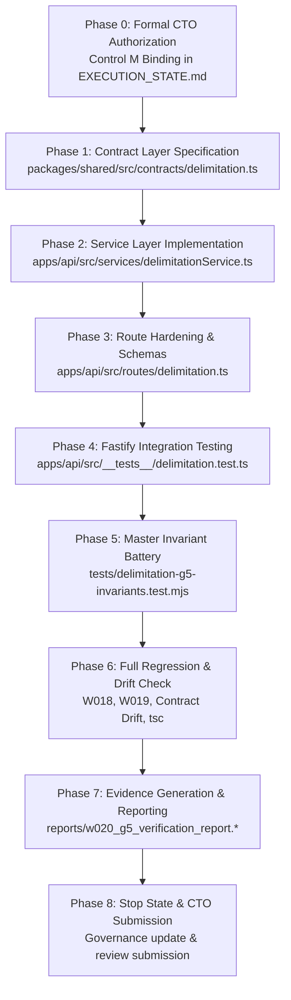

# PLAN-W020-G5-REV-1.1: DELIMITATION ENGINE FOUNDATION
## Core Logic, Mathematical Models, Service Layer & Hardened Read APIs Specification
**Milestone:** W020-G5  
**Revision:** 1.1 (Comprehensive Pre-Implementation Architecture, Rigorous Invariants & Formal Reconciliation)  
**Date:** 2026-09-30  
**Authority:** Master Product Blueprint, AI Agent Master Execution Job Book, Amendments v1.2–v1.6, Amendment v1.5-A (Section 26), PANIN India Election & Political Data Constitution, CTO Directive (W020-G5 REV-1.0 Review & Mandatory Corrections G5-01..G5-15)  
**Status:** DRAFT / SUBMITTED FOR CTO REVIEW & RATIFICATION  
**Implementation Authorization:** **STRICTLY NOT AUTHORIZED (PLANNING & PREFLIGHT SPECIFICATION ONLY)**  
**Predecessor Status:** W018 (ACCEPTED / COMPLETE), W019 (ACCEPTED / COMPLETE / CLOSED), W020-G0..G4 (ACCEPTED / COMPLETE / CLOSED)  
**Target Environment:** Staging Supabase (`fkpigozcqnmcvofuksar`) & Local Workspace  
**Production Boundary:** STRICTLY AIR-GAPPED & UNTOUCHED (`ehfafcnimmjusyvplbah`)  
**Frozen Geometry Baseline:** Exactly 589 rows, canonical SHA-256 digest `f839fa02980318a8f35f932ebe72fa1d3ad6325dc86a624bf159d932fe5f613b`  

---

## 1. Document Title & Metadata
* **Document Identifier:** `PLAN-W020-G5-REV-1.1`
* **Milestone:** W020-G5 (Delimitation Engine Foundation — Core Logic, Mathematical Models, Service Layer & Hardened Read APIs)
* **Author:** PANIN Engineering / Senior Backend & Data Architect
* **Governing Specification:** Amendment v1.5-A Section 26 (22-Section Planning Protocol)
* **Date of Formulation:** 2026-09-30
* **Target Version:** API v1 / Database Migration 055 Baseline
* **Parent Execution Track:** Master Job W020 (Delimitation Engine Foundation)
* **Plan Status:** `SUBMITTED_FOR_CTO_RATIFICATION`
* **Implementation Authorization Status:** `STRICTLY_NOT_AUTHORIZED`
* **Revision History:**
  - `REV-1.0` (2026-09-30): Initial preflight specification. Reviewed by CTO; 15 mandatory correction directives issued (G5-01 through G5-15).
  - `REV-1.1` (2026-09-30): Comprehensive revision addressing all 15 CTO directives: removed universal seats range invariant; documented `eci_delimitation_post2026` staging object and reconciliation; provided Ajv vs Zod architectural rationale; strictly separated Current Fact from Proposed Change; formalized Article 332 SC/ST quota mathematical model with explicit invariant IDs; mapped mathematical taxonomy to canonical W012 data statuses; implemented dynamic multi-dataset provenance; formalized derived-only `isScenario`; hardened existing `/monitor-webhook` prototype; preserved byte-exact legal succession citations; preserved Census 2027 immutability; specified typed selection semantics; defined mathematical output provenance linkage; partitioned the 5 operational domains; and established strict plan-only verification.

---

## 2. Problem Statement (Task Understanding & Core Objectives)

The existing delimitation endpoints in `apps/api/src/routes/delimitation.ts` originated as early research prototypes. While functional for exploratory demonstrations, forensic review reveals several structural, mathematical, and governance limitations:
1. **Lack of ECC-001 Response Standard:** All 14 endpoints in `apps/api/src/routes/delimitation.ts` return raw unstructured JSON objects rather than standard `ApiSuccessEnvelope<T>` and `sendApiError()` envelopes.
2. **Absence of Dedicated Service Architecture:** Calculation routines, Census 2011 dataset traversals, and hardcoded postal lookups are mixed directly inside route handler closures without a domain service layer (`delimitationService.ts`).
3. **Missing Statutory Scenario Separation:** Hypothetical research projections (e.g. population divisor seat redistribution) are returned without mandatory scenario metadata, risking confusion between official statutory orders and research models.
4. **Vague Demographic & Timeline Terminology:** Endpoints reference "2025" or "post-Census 2026" instead of the authoritative **Census 2027** national operation, and lack field-separated legal succession grounding for Andhra Pradesh and Telangana.
5. **Heuristics Masquerading as Facts:** Geometric approximations (e.g. PIN code centroid lookups, Polsby-Popper compactness scores, sitting MLA vulnerability scores) are not formally categorized under a strict mathematical taxonomy.
6. **Unauthenticated Existing Webhook Prototype:** `POST /api/v1/delimitation/monitor-webhook` exists as prototype code but lacks fail-closed secret authentication.

**Core Objective of W020-G5:** Establish the architectural foundation for PANIN's delimitation subsystem by implementing a dedicated `delimitationService.ts`, hardening all 14 Fastify route handlers with Ajv schemas and ECC-001 envelopes, establishing shared contract types in `@kshetra/shared`, enforcing the 6-tier Mathematical Classification Taxonomy mapped to canonical W012 data statuses, attaching 10 mandatory metadata fields to scenario projections, and validating the subsystem against a 30-check acceptance test battery.

---

## 3. Current State Analysis (Repository Inspection, Root-Cause Interpretation & Dependency/Blocking Analysis)

### 3.1 Repository Inspection & Fact Baseline
* **Database State:** Migration 055 was verified in preflight (23/23 PASS) and applied to staging (`fkpigozcqnmcvofuksar`) in W020-G4. Tables `delimitation_proposals` and `constituency_mapping` are bridged via 5 foreign keys (`ON DELETE RESTRICT`) to `delimitation_regimes`, `constituency_versions`, and `provenance_records`.
* **Zero Persistent `is_scenario` Column:** Staging catalog audit proves that neither table contains a redundant `is_scenario` column. Regime semantics derive exclusively from `delimitation_regimes.legal_status`.
* **Geometry State:** Exactly 589 rows in `public.entity_geometries`, matching canonical digest `f839fa02980318a8f35f932ebe72fa1d3ad6325dc86a624bf159d932fe5f613b`.
* **Current Route Implementation:** `apps/api/src/routes/delimitation.ts` contains 758 lines of code registering 14 endpoints. Handler closures directly perform calculations without an intermediary service.
* **Census Dataset:** `data/census/india-district-population-2011.ts` contains Census 2011 state- and district-level Primary Census Abstract (PCA) data.
* **Predecessor Milestones:**
  - W018: ACCEPTED / COMPLETE (Canonical Political Entity Model, `080344c`).
  - W019: ACCEPTED / COMPLETE / CLOSED (Election Data Normalization, DEC-083).
  - W020-G4: ACCEPTED / COMPLETE / CLOSED (Migration 055 Canonical Bridge, DEC-084).

### 3.2 Root-Cause Interpretation
The prototype delimitation endpoints were written during early feature prototyping without reference to the Master Contract Envelopes standard (ECC-001 / Job W008) or the PANIN India Election & Political Data Constitution. Consequently, inputs were not strictly sanitized, errors leaked raw exceptions, and analytical simulations were not partitioned from statutory legal data.

### 3.3 Dependency & Blocking Analysis
* **Upstream Dependencies:** W018 (political entities/tenures), W019 (election contests/results), and W020-G4 (Migration 055 schema bridge) are fully resolved and accepted.
* **Current Blocking State:** W020-G5 implementation is strictly BLOCKED until the CTO formally approves this specification (`PLAN-W020-G5-REV-1.1.md`).
* **Downstream Dependencies:** W020-G6 (Historical Delimitation Data Ingestion) and W020-G7 (Mobile Delimitation UI Integration) depend directly on the service and API contracts finalized in G5.

---

## 4. Fact / Inference / Assumption / Unknown Register

```text
┌─────────────────────────────────────────────────────────────────────────────┐
│                 FACT / INFERENCE / ASSUMPTION / UNKNOWN REGISTER            │
├──────┬──────────────────────────────────────────────────────────────────────┤
│ FACT │ 1. Delimitation Order 2008 was enacted on 19 Feb 2008 under the      │
│      │    Delimitation Act, 2002 as Schedule II (State of Andhra Pradesh).  │
│      │ 2. APRA 2014 (Act No. 6 of 2014) bifurcated Schedule II into        │
│      │    Schedule XXXI (Telangana: 119 ACs) and Schedule II (AP: 175 ACs). │
│      │ 3. AP Reorganisation (Removal of Difficulties) Order, 2015 is        │
│      │    identified as G.S.R. 311(E), dated 23 April 2015, effective       │
│      │    immediately ("comes into force at once").                         │
│      │ 4. Commission's Notification No. 282/AP/2018(DEL) was issued on      │
│      │    22 September 2018 under Sec 9(1)(b) Delimitation Act 2002.        │
│      │ 5. Census 2011 is the latest completed statutory census in India.    │
│      │ 6. Census 2027 is in progress; final population data is unavailable. │
│      │ 7. Staging database fkpigozcqnmcvofuksar contains Migration 055.     │
│      │ 8. 589 PostGIS geometry baseline digest is f839fa02...               │
│      │ 9. apps/api/src/services/delimitationService.ts DOES NOT EXIST YET.  │
│      │ 10. packages/shared/src/contracts/delimitation.ts DOES NOT EXIST YET.│
│      │ 11. POST /api/v1/delimitation/monitor-webhook EXISTS AS A PROTOTYPE. │
│      │ 12. eci_delimitation_post2026 exists in staging catalog with 0 rows. │
├──────┼──────────────────────────────────────────────────────────────────────┤
│ INF. │ 1. S.O. 1416(E) was a misidentified instrument and must be excluded. │
│      │ 2. 29 May 2014 is the APRA Amendment Ordinance date, not G.S.R.     │
│      │    311(E)'s promulgation or commencement date.                       │
│      │ 3. Because Census 2027 results do not exist, any 2027 delimitation   │
│      │    calculation is strictly a SCENARIO_PROPOSED_REGIME simulation.    │
│      │ 4. The ideal divisor 293,896.84 is a PANIN-derived quotient (2011    │
│      │    population / 4,120 seats) and NOT a constitutional constant.      │
│      │ 5. Numeric seat ranges (e.g. 30..500) are statutory/algorithmic,     │
│      │    NOT universal constitutional invariants across all contexts.      │
├──────┼──────────────────────────────────────────────────────────────────────┤
│ ASS. │ 1. Fastify 5.2 and Node.js 22 runtime will execute all apportionment  │
│      │    calculations with exact integer arithmetic without float drift.   │
│      │ 2. The 14 existing routes cover all frontend prototype requirements. │
│      │ 3. External gazette scrapers will supply valid Bearer tokens matching │
│      │    KSHETRA_MONITOR_SECRET.                                           │
├──────┼──────────────────────────────────────────────────────────────────────┤
│ UNK. │ 1. The exact date Parliament will enact the next Delimitation Act.   │
│      │ 2. The final date of publication of Census 2027 PCA tables.          │
│      │ 3. Final ward-level boundaries for urban local bodies post-2027.     │
└──────┴──────────────────────────────────────────────────────────────────────┘
```

---

## 5. Target Architecture & Intended Outcome

### 5.1 Three-Tier Separation & Validation Architecture
The W020-G5 architecture establishes clean separation across three tiers:
1. **Contract Layer (`@kshetra/shared`):**
   - Location: `packages/shared/src/contracts/delimitation.ts`
   - Defines strict TypeScript interfaces for all 14 endpoints, adhering to `ApiSuccessEnvelope<T>` and `sendApiError()`.
   - Exports the `ScenarioEnclosure` interface enforcing the 10 mandatory metadata fields.
   - Defines `DatasetVersionProvenance` for dynamic multi-dataset provenance tracking.
2. **Domain Service Layer (`apps/api`):**
   - Location: `apps/api/src/services/delimitationService.ts`
   - Encapsulates statutory queries, Census 2011 apportionment formulas (Hamilton/Hare-Niemeyer and Webster/Sainte-Laguë), Article 332 SC/ST quota model, PIN code geographic resolver, and sitting MLA impact heuristics.
   - Strictly isolates calculation logic from HTTP transport concerns.
3. **Hardened Route Layer (`apps/api`):**
   - Location: `apps/api/src/routes/delimitation.ts`
   - Attaches Fastify native JSON Schema (Ajv) request validation schemas to every route.
   - Validates authentication on webhook ingestion via `KSHETRA_MONITOR_SECRET`.
   - Delegates all business execution to `delimitationService`.
   - Wraps responses in `ApiSuccessEnvelope<T>` with `requestId` and ISO `timestamp`.

### 5.2 Validation Architecture: Fastify Native JSON Schema (Ajv) vs Zod (Directive G5-03)
Fastify native JSON Schema (Ajv) is deliberately chosen over Zod for HTTP route boundary validation based on repository precedent and performance analysis:
1. **Repository Consistency:** 100% of the 34 standardized Fastify routes in Kshetra (W008-B/C/E, `apps/api/src/routes/*.ts`) utilize Fastify native JSON Schema with Ajv compilation. Fastify's global error handler (`apps/api/src/server.ts`) directly unwraps Ajv schema errors into standard `ApiErrorDetail[]` (`path`, `message`).
2. **Duplication Avoidance:** Forcing Zod on Fastify routes would require either `@fastify/type-provider-zod` (introducing third-party plugins that monkey-patch Fastify compilation) or manual `schema.parse(req.body)` calls inside route handlers, duplicating validation passes and fracturing error handling.
3. **Clear Boundary Ownership:** Fastify JSON schemas (Ajv) govern runtime HTTP ingress validation and serialization; `@kshetra/shared` TypeScript interfaces govern compile-time static type contracts.
4. **Runtime Performance:** Fastify compiles Ajv schemas to JIT-optimized validation functions at startup, achieving 2–5x higher request throughput than runtime Zod parsing on high-volume GET endpoints.
5. **Zero Migration Debt:** Retaining native JSON Schema introduces 0 new npm dependencies, 0 build-time configuration alterations, and 100% backwards compatibility with existing route test suites.

### 5.3 Removal of Universal Seats Range Invariant & Typed Validation (Directive G5-01)
The arbitrary invariant `seats 30 <= S <= 500` is **REMOVED** as a universal check. Numeric range validation is **NOT** a constitutional invariant. It is replaced with typed, operation-specific validation across 5 distinct validation planes:
1. **Syntax Validation (HTTP Ingress):** Enforces technical bounds to prevent integer overflow or DoS attacks (e.g. `seats: { type: 'integer', minimum: 1, maximum: 10000 }`).
2. **Legal / Current-Regime Validation:** Enforces enacted statutory assembly sizes for recognized States and Union Territories:
   - Andhra Pradesh: Exactly 175 Assembly Constituencies (Schedule II, APRA 2014).
   - Telangana: Exactly 119 Assembly Constituencies (Schedule XXXI, APRA 2014).
   - Other States: Statutory assembly sizes under Article 170(1) (60 to 500) and statutory exceptions enacted by Parliament under Article 4 / Article 371: Sikkim (32 seats, Art 371F), Goa (40 seats), Mizoram (40 seats, Art 371G), Puducherry (30 seats, Govt of UT Act 1963).
3. **Scenario Validation (Research Projections):** Accepts user-defined seat targets for simulation. A scenario may project a 250-seat AP assembly, a 150-seat TS assembly, or an 848-seat national Lok Sabha. Validation verifies that `targetSeats` is a positive integer and meets algorithmic minimums.
4. **Algorithm-Domain Validation:** Enforces mathematical prerequisites for apportionment algorithms:
   - Hamilton / Hare-Niemeyer: Requires $S \ge N$ (where $N$ is the number of subunits) to guarantee that each subunit can be evaluated for whole-seat quotas without negative seat allocations.
   - Webster / Sainte-Laguë: Requires $S \ge 1$ and positive populations.
5. **Unsupported / Unknown Handling:** If a state code is provided that is not registered in statutory baselines or Census 2011 PCA data, the service returns a structured `UNSUPPORTED_GEOGRAPHY` or `UNKNOWN_ENTITY` response rather than silent clamping or generic range errors.

### 5.4 `eci_delimitation_post2026` Object Documentation & Reconciliation (Directive G5-02)
1. **What it is:** A historical prototype/staging identifier registered in `public.delimitation_regimes` and `public.dataset_versions` (created in Migration 041) representing the constitutional post-2026 freeze regime.
2. **Why it exists:** Seeded during W014 temporal validity work to model the prospective post-2026 constitutional delimitation window mandated by the 84th Constitutional Amendment (Articles 82 & 170).
3. **Staging Catalog Reference:** Registered on staging database `fkpigozcqnmcvofuksar` in `public.delimitation_regimes` with `id = 'eci_delimitation_post2026'`, `legal_status = 'FUTURE_ANTICIPATED_REGIME'`, `authority = 'Delimitation Commission'`, `enabling_law = 'Constitution Art 82'`, `is_active = false`. Also registered in `public.dataset_versions` as `eci_delimitation_post2026_projected_v1`.
4. **Contained Records:** Exactly 0 records (`record_count = 0`). It contains **NO** authoritative constituency geometries, **NO** authoritative seat boundaries, and **NO** official population figures.
5. **What Relies on it:** W014 temporal validity verification fixtures (`tests/verify_w014_temporal_validity.mjs`), regime foreign keys, and migration history.
6. **Retention on Staging:** It **MUST BE KEPT UNMODIFIED** on staging. Zero DDL, zero renaming, and zero row deletions will occur in W020.
7. **Reconciliation with Post-Census 2027 Realities:**
   - In the API and UI layer for W020-G5, any endpoint presenting this regime maps its user-facing display label to:
     *"Future Anticipated Delimitation (Post-Census 2027 Operation)"*.
   - A clear statutory disclaimer is attached explaining that "post2026" signifies the expiration of the 84th Amendment freeze year, while the actual administrative operation is tied to the upcoming **Census 2027**.
   - In future milestones (W021+), once Parliament enacts a Delimitation Act and the Delimitation Commission publishes official gazettes based on Census 2027, an authoritative statutory regime will be registered with primary legal gazette citations.

### 5.5 Article 332 SC/ST Reservation Mathematical Model (Directive G5-05)
The Article 332 seat reservation algorithm is formally specified with complete mathematical rigor:
1. **Population Sources:** Primary Census Abstract (PCA) from Census 2011 for Scheduled Castes ($Pop_{SC}$) and Scheduled Tribes ($Pop_{ST}$).
2. **Denominator:** Total Population of the State ($Pop_{Total}$) from the identical Census 2011 PCA dataset.
3. **Proportional Quota Calculation:**
   $$Q_{SC} = S \times \frac{Pop_{SC}}{Pop_{Total}}$$
   $$Q_{ST} = S \times \frac{Pop_{ST}}{Pop_{Total}}$$
   where $S$ is the total number of assembly seats for the State.
4. **Rounding & Remainder Mechanics:**
   - Integer quota base: $I_{SC} = \lfloor Q_{SC} \rfloor$, $I_{ST} = \lfloor Q_{ST} \rfloor$.
   - Fractional remainders: $r_{SC} = Q_{SC} - I_{SC}$, $r_{ST} = Q_{ST} - I_{ST}$.
   - Rounding rule: Each category is rounded to the nearest integer ($\lfloor Q + 0.5 \rfloor$).
   - General seats: $S_{General} = S - S_{SC} - S_{ST}$.
5. **Exact Conservation Invariant:**
   $$S_{SC} + S_{ST} + S_{General} \equiv S$$
   In the edge case where independent rounding causes $S_{SC} + S_{ST} > S$, seats are prioritized by largest fractional remainder ($r_{SC}$ vs $r_{ST}$).
6. **Deterministic Tie-Breaking:** If $r_{SC} \equiv r_{ST}$ in a remainder competition, the category with the larger absolute population receives the seat. If populations are identical, priority is assigned lexicographically (`SC` before `ST`).
7. **Zero & Unknown Handling:** If $Pop_{SC} == 0$, $S_{SC} = 0$. If demographic data is unavailable or unverified, the engine returns `null` with data status `UNKNOWN` rather than estimating or substituting synthetic numbers.
8. **Explicit Reservation Invariant Identifiers:**
   - `RES-POP-01`: Population inputs must originate exclusively from verified Census 2011 PCA tables.
   - `RES-ALLOC-01`: Proportional quota calculated strictly as $S \times (Pop_{Category} / Pop_{Total})$.
   - `RES-CONS-01`: Exact quota conservation $\sum \text{Seats} \equiv S$ must hold bitwise.
   - `RES-ROUND-01`: Deterministic nearest-integer rounding with explicit half-way round-up.
   - `RES-TIE-01`: Deterministic remainder and population tie-breaker specification.
   - `RES-DATA-01`: PCA numerator and denominator consistency verification ($Pop_{SC} + Pop_{ST} \le Pop_{Total}$).
   - `RES-UNKNOWN-01`: Missing demographic entities return `UNKNOWN` status without synthetic fallback.

### 5.6 Mathematical Output Classification Taxonomy & W012 Mapping (Directive G5-06)
PANIN's 6-tier mathematical output taxonomy refines analytical outputs while preserving direct 1-to-1 mapping to the 8 canonical W012 data statuses:

| G5 Mathematical Output Classification | Description & Examples | Canonical W012 Data Status |
| :--- | :--- | :--- |
| **Class 1: `STATUTORY_FACT`** | Enacted legal orders, gazette notices, statutory seat totals (e.g. AP 175, TS 119). | `OFFICIAL` |
| **Class 2: `DETERMINISTIC_DERIVED`** | Exact mathematical calculations from official data (e.g. Hamilton/Hare-Niemeyer seat counts). | `DERIVED` |
| **Class 3: `STATUTORY_BENCHMARK`** | Historical delimitation baselines verified against Delimitation Commission orders. | `VERIFIED` |
| **Class 4: `SCENARIO_PROJECTION`** | Hypothetical research models, user-adjusted target seats, projected 2027 scenarios. | `SCENARIO` |
| **Class 5: `GEOGRAPHIC_APPROXIMATION`** | PIN code centroid lookups, boundary distance heuristics, spatial approximations. | `ESTIMATE` |
| **Class 6: `POLITICAL_HEURISTIC`** | Sitting MLA vulnerability scores, party swing projections, competitiveness heuristics. | `INFERRED` |

*Note on Unmapped W012 Statuses:*
- `UNVERIFIED`: Used when external gazette notices are ingested via webhook prior to verification.
- `UNKNOWN`: Used when statutory or demographic data is unavailable (e.g. Census 2027 final population).
*Explicit Declaration:* "The G5 mathematical classification taxonomy does not replace the canonical W012 data-status model; it refines mathematical and analytical outputs into specific computational categories while mapping directly to W012's 8 governance statuses."

### 5.7 Dynamic Multi-Dataset Provenance (Directive G5-07)
Rather than hardcoding a single `inputDatasetVersionId`, all analytical and scenario outputs link to a dynamic array of governed datasets:
```typescript
export interface DatasetVersionProvenance {
  datasetId: string;           // e.g. 'census_2011_pca'
  versionTag: string;          // e.g. 'v1.0_statutory'
  sourceAuthority: string;     // e.g. 'Office of the Registrar General & Census Commissioner, India'
  publicationDate: string;     // e.g. '2011-04-30'
  checksum: string;            // SHA-256 digest of input dataset
}
```
Outputs encapsulate multiple input datasets representing demographics (Census 2011 PCA), geography versions (post-bifurcation 2014), and statutory delimitation regimes (2008 Order).

### 5.8 Derived-Only `isScenario` Specification (Directive G5-08)
* `isScenario` is an exclusively derived property in the API application layer:
  ```typescript
  isScenario: regime.legal_status === 'SCENARIO_PROPOSED_REGIME'
  ```
* It is **NEVER** stored as a persistent column in PostgreSQL tables (`delimitation_proposals` or `constituency_mapping`).
* It is **NEVER** an independent source of truth.
* It guarantees that the database catalog and API responses remain completely synchronized without denormalization drift.

### 5.9 Hardening of Existing Prototype `/monitor-webhook` (Directive G5-09)
* **Status:** `POST /api/v1/delimitation/monitor-webhook` is an **EXISTING PROTOTYPE ENDPOINT** in `apps/api/src/routes/delimitation.ts` (lines 204–226 schema, lines 333–370 handler).
* **Hardening Specification:**
  1. Enforce fail-closed Bearer auth guard against `process.env.KSHETRA_MONITOR_SECRET` or `process.env.MONITOR_WEBHOOK_SECRET`. If missing or invalid, immediately return HTTP 401 `UNAUTHORIZED`.
  2. Validate payload against Fastify native JSON Schema (Ajv) verifying fields: `source`, `alertType`, `payload`, `timestamp`.
  3. Wrap response in standard ECC-001 `ApiSuccessEnvelope<{ processed: number, status: string }>`.
  4. Implement sanitized audit logging: log request source, event count, and latency; **NEVER** log bearer tokens, authorization headers, or sensitive webhook payloads.

### 5.10 Byte-Exact Statutory Citation Chain for AP and TS (Directive G5-10)
The legal succession chain is preserved byte-exact across all service queries and timeline outputs:
1. **Delimitation Order 2008:** Delimitation of Parliamentary and Assembly Constituencies Order, 2008. Enacted **19 February 2008** under Delimitation Act, 2002. Schedule II: State of Andhra Pradesh (294 Assembly Constituencies, 42 Parliamentary Constituencies).
2. **APRA 2014:** Andhra Pradesh Reorganisation Act, 2014 (Act No. 6 of 2014). Appointed Day: **2 June 2014**. Bifurcated Schedule II into Schedule XXXI (Telangana: 119 ACs, 17 PCs) and Schedule II (Residuary Andhra Pradesh: 175 ACs, 25 PCs).
3. **G.S.R. 311(E):** Andhra Pradesh Reorganisation (Removal of Difficulties) Order, 2015. Promulgated by the President on **23 April 2015**, commencing immediately (*"comes into force at once"* on 23 April 2015). Transferred specified mandals/villages of Khammam district from Telangana to Andhra Pradesh for the Polavaram project.
   - *Exclusion Note:* S.O. 1416(E) and 29 May 2014 are explicitly excluded as erroneous dates/instruments.
4. **Notification No. 282/AP/2018(DEL):** Election Commission of India Notification No. 282/AP/2018(DEL), dated **22 September 2018** (published in Gazette of India on 24 September 2018), issued under Section 9(1)(b) of the Delimitation Act, 2002 read with Sections 15 and 26 of APRA 2014, reflecting the territorial changes of G.S.R. 311(E).
5. **Current Telangana Assembly Geography:** Schedule XXXI containing 119 Assembly Constituencies as adapted.

### 5.11 Census 2027 Immutability & Preservation (Directive G5-11)
* Census 2027 is an active, pending statutory operation.
* Final population figures are **UNAVAILABLE**.
* The service layer strictly prohibits synthetic population numbers, estimated population baselines masquerading as official figures, or sentinel zero values.
* Where Census 2027 projections are modeled, they are explicitly tagged as `SCENARIO_PROPOSED_REGIME` with mathematical classification `Class 4: SCENARIO_PROJECTION` and canonical W012 status `SCENARIO`.

### 5.12 Typed Selection Semantics (Directive G5-12)
The service layer exposes typed selection semantics for regime resolution:
```typescript
export type RegimeSelectionMode = 
  | 'CURRENT'             // Latest in-force statutory regime
  | 'AS_OF'               // Statutory regime in force on specified ISO date
  | 'EXPLICIT_VERSION'    // Explicitly requested regime identifier
  | 'FUTURE_ANTICIPATED'  // Prospective constitutional post-freeze regime
  | 'SCENARIO';           // User-defined hypothetical research model
```
Resolution rules strictly enforce that requests for `CURRENT` never resolve to a scenario or future anticipated regime.

### 5.13 Mathematical Provenance Linkage (Directive G5-13)
All mathematical calculation endpoints return an explicit provenance object:
```typescript
export interface MathematicalProvenance {
  inputDatasetVersions: DatasetVersionProvenance[];
  methodology: 'HAMILTON_HARE_NIEMEYER' | 'WEBSTER_SAINTE_LAGUE' | 'ARTICLE_332_PROPORTIONAL' | 'POLSBY_POPPER' | 'MARGIN_VULNERABILITY';
  modelVersion: string;       // e.g. '1.1.0'
  calculatedAt: string;       // UTC ISO-8601
  legalStatus: string;        // 'STATUTORY_ENACTED_REGIME' | 'SCENARIO_PROPOSED_REGIME'
  dataStatus: string;         // Canonical W012 status
}
```

### 5.14 Strict Separation of Operational Domains (Directive G5-14)
All 14 endpoints and service methods are strictly segregated across 5 operational domains:
* **Domain A: Read-Only Statutory / Legal Data**
  - `GET /api/v1/delimitation/timeline`
  - `GET /api/v1/delimitation/status`
  - `GET /api/v1/delimitation/methodology`
  - Ingestion: `POST /api/v1/delimitation/monitor-webhook` (Hardened)
* **Domain B: Historical As-Of Inquiries**
  - Temporal regime resolution via `asOfDate` query parameters.
* **Domain C: Deterministic Derived Calculations**
  - `GET /api/v1/delimitation/projections` (Hamilton seat re-apportionment of 2011 PCA data)
  - `GET /api/v1/delimitation/projections/:stateCode`
  - `GET /api/v1/delimitation/compare`
* **Domain D: Scenario Projections**
  - `GET /api/v1/delimitation/simulate/:stateCode`
  - `GET /api/v1/delimitation/reservations/national`
  - `GET /api/v1/delimitation/reservations/:stateCode`
  - `GET /api/v1/delimitation/boundary-simulation/:acId`
* **Domain E: Geometric & Political Heuristics**
  - `GET /api/v1/delimitation/impact/:pinCode` (Centroid lookup approximation)
  - `GET /api/v1/delimitation/mla-impact/:acId` (Margin-based vulnerability heuristic)
  - `GET /api/v1/delimitation/party-projections` (Vote-share swing heuristic)
  - `GET /api/v1/delimitation/gainers-losers`

---

## 6. Governing Rules & Constraints

1. **Rule IV-001 (Implementing Agent ≠ Final Acceptance Authority):** The implementing agent cannot self-certify or self-authorize W020-G5. Formal CTO review and approval are mandatory.
2. **Amendment v1.5-A / Control M:** No product code modification may occur until `PLAN_STATUS: APPROVED` and an approved implementation commit SHA is bound.
3. **Data Constitution Principle 1 (Truth in Engineering):** Simulations must be explicitly tagged as `SCENARIO_PROPOSED_REGIME` with the 10 mandatory metadata attributes. Never present research projections as official gazetted orders.
4. **Data Constitution Principle 4 (Anti-Derivation Rule):** Where data is unavailable (e.g. Census 2027 population), return `NULL` / `UNKNOWN`. Never fabricate intermediate numbers or use sentinel zeros.
5. **Security & Least Privilege:**
   - Public read access for standard query routes (`anon` and `authenticated`).
   - `POST /api/v1/delimitation/monitor-webhook` requires valid Bearer token authentication matching `KSHETRA_MONITOR_SECRET` or `MONITOR_WEBHOOK_SECRET`.
   - Error messages sanitized; zero internal stack trace or SQL exception leakage.
6. **DPDP Compliance:** No personal data collected or stored. Incumbent legislator lookups use public statutory records (`canonical_persons`, `elected_tenures`).

---

## 7. Full Scope of Work (Exact Files Expected to Change)

When authorized, W020-G5 will touch **EXACTLY** the following files:

| File Path | Action | Component & Purpose |
| :--- | :--- | :--- |
| `packages/shared/src/contracts/delimitation.ts` | **NEW** | Canonical TypeScript request/response contracts, `ScenarioEnclosure`, and provenance interfaces. |
| `packages/shared/src/contracts/index.ts` | **MODIFIED** | Export delimitation contracts. |
| `packages/shared/src/index.ts` | **MODIFIED** | Re-export delimitation contracts from package root. |
| `apps/api/src/services/delimitationService.ts` | **NEW** | Domain service layer implementing apportionment math, statutory timelines, Article 332 models, and heuristics. |
| `apps/api/src/routes/delimitation.ts` | **MODIFIED** | Hardened Fastify route module with Ajv schemas, ECC-001 envelopes, and auth guards. |
| `apps/api/src/__tests__/delimitation.test.ts` | **NEW** | Fastify route integration suite testing all 14 endpoints and ECC-001 responses. |
| `tests/delimitation-g5-invariants.test.mjs` | **NEW** | Master 30-check semantic invariant test suite verifying legal succession and math. |
| `reports/w020_g5_plan_manifest.json` | **MODIFIED** | Updated machine-readable plan manifest (REV-1.1). |
| `reports/w020_g5_verification_report.json` | **NEW** | Generated evidence report upon test execution. |
| `reports/w020_g5_verification_report.md` | **NEW** | Human-readable verification report upon test execution. |
| `EXECUTION_STATE.md` | **MODIFIED** | Governance coordinates update. |
| `ACCEPTANCE_REGISTER.md` | **MODIFIED** | Governance milestones update. |
| `DECISION_LOG.md` | **MODIFIED** | Record DEC-085 (G5 Planning) and DEC-086 (G5 Revision & Implementation). |

---

## 8. Explicit Out-of-Scope Boundaries

The following boundaries are strictly enforced throughout W020-G5:
* **ZERO Mobile Code Changes:** `apps/mobile/**` is 100% untouched. Mobile integration occurs in W020-G7.
* **ZERO Schema Migrations:** `supabase/migrations/**` is 100% untouched. No new SQL files.
* **ZERO Staging Migrations:** No execution of DDL on staging.
* **ZERO Production Contact:** Production database `ehfafcnimmjusyvplbah` remains air-gapped.
* **ZERO PostGIS Geometry Changes:** Exactly 589 rows in `entity_geometries`, digest `f839fa02980318a8f35f932ebe72fa1d3ad6325dc86a624bf159d932fe5f613b`.
* **ZERO Census Dataset Modifications:** `data/census/india-district-population-2011.ts` is read-only.
* **ZERO APK Builds:** Android compilation deferred to W023.

---

## 9. Step-by-Step Implementation Plan (Detailed Execution Phases)



### Phase 1: Contract Layer Specification
1. Create `packages/shared/src/contracts/delimitation.ts`.
2. Define DTOs for all 14 endpoints: `DelimitationProjectionsDTO`, `SingleStateProjectionDTO`, `DelimitationTimelineDTO`, `DelimitationStatusDTO`, `GainersLosersDTO`, `CitizenImpactDTO`, `BoundarySimulationDTO`, `NationalReservationDTO`, `StateReservationDetailDTO`, `StateComparisonDTO`, `MlaImpactDTO`, `PartyProjectionsDTO`, `DelimitationMethodologyDTO`.
3. Define `ScenarioEnclosure` interface with all 10 mandatory metadata attributes.
4. Define `DatasetVersionProvenance` and `MathematicalProvenance` interfaces.
5. Export contracts in `packages/shared/src/contracts/index.ts` and `packages/shared/src/index.ts`.
6. Verify build: `npm run build --prefix packages/shared`.

### Phase 2: Domain Service Layer Implementation
1. Create `apps/api/src/services/delimitationService.ts`.
2. Implement statutory timeline using the verified 5-stage legal chain:
   - Delimitation Order 2008 (Schedule II: Andhra Pradesh).
   - APRA 2014 (Schedule XXXI: Telangana 119 ACs, Schedule II: AP 175 ACs).
   - AP Reorganisation (Removal of Difficulties) Order, 2015: **G.S.R. 311(E)**, **23 April 2015**, "comes into force at once".
   - Commission's Notification **No. 282/AP/2018(DEL)**, **22 September 2018**.
   - Current Telangana Geography (Schedule XXXI).
   - Tracking record for **Census 2027** (enumeration pending, population unavailable).
3. Implement constitutional status logic (Articles 82 & 170, 84th/87th Amendments, Census 2027 status).
4. Implement Census 2011 apportionment formulas:
   - Hamilton / Hare-Niemeyer largest-remainder method.
   - Webster / Sainte-Laguë successive-quotient method.
5. Implement Article 332 SC/ST quota allocation:
   - Proportional calculations with Census 2011 PCA population.
   - Deterministic integer rounding with remainder tie-breaking.
   - Exact quota conservation assertion: $S_{SC} + S_{ST} + S_{General} \equiv S$.
6. Implement PIN code lookup:
   - 3-digit prefix mapping to verified districts.
   - Deterministic AC assignment.
   - Mandatory split-PIN caveat and approximate centroid disclosure.
7. Implement sitting MLA impact:
   - Integrate with W018 `canonical_persons` and W019 `election_contests`.
   - Calculate vulnerability heuristic based on victory margin percentage.
8. Implement scenario wrapper attaching the 10 mandatory metadata fields.

### Phase 3: Route Hardening & Schemas
1. Update `apps/api/src/routes/delimitation.ts`.
2. Define complete Fastify native JSON Schema (Ajv) for all 14 endpoints (params, querystring, headers, body, response).
3. Add webhook auth guard verifying `Bearer ${expectedSecret}` against `KSHETRA_MONITOR_SECRET` or `MONITOR_WEBHOOK_SECRET`.
4. Replace raw object returns with standard `ApiSuccessEnvelope<T>`:
   ```typescript
   return reply.send({
     success: true,
     data: result,
     requestId: request.id,
     timestamp: new Date().toISOString(),
   });
   ```
5. Wrap all handlers in `try/catch` delegating errors to `sendApiError(reply, request, statusCode, error, message)`.

### Phase 4: Fastify Integration Testing
1. Create `apps/api/src/__tests__/delimitation.test.ts`.
2. Test all 14 routes against running Fastify test instance.
3. Assert HTTP 200 and `success: true` on valid requests.
4. Assert HTTP 400 on malformed params (e.g. `stateCode: 'INVALID'`).
5. Assert HTTP 401 on `POST /monitor-webhook` with missing/wrong token.
6. Assert HTTP 404 on non-existent state codes.

### Phase 5: Master Invariant Battery
1. Create `tests/delimitation-g5-invariants.test.mjs`.
2. Implement 30 checks across Plane 1 (Legal), Plane 2 (Taxonomy), Plane 3 (Math), and Plane 4 (API).
3. Execute and verify 30/30 PASS.

### Phase 6: Regression, Contract Drift & Build Integrity
1. Run W018 regression: `node tests/political-entities-invariants.test.mjs` (53/53 PASS).
2. Run W019 regression: `node tests/election-normalization-invariants.test.mjs` (93/93 PASS).
3. Run API contract drift: `node scripts/check-api-contract-drift.mjs` (9/9 MATCH).
4. Run API build: `npm run build --prefix apps/api` (exit 0).
5. Run mobile build: `npx tsc --noEmit -p apps/mobile/tsconfig.json` (exit 0).

### Phase 7: Evidence Generation & Reporting
1. Produce `reports/w020_g5_verification_report.json` and `reports/w020_g5_verification_report.md`.
2. Capture test logs, response payloads, and invariant proofs.

### Phase 8: Stop State & CTO Submission
1. Update `EXECUTION_STATE.md`, `ACCEPTANCE_REGISTER.md`, `DECISION_LOG.md`.
2. Run repo integrity and freshness scripts.
3. Commit and push.
4. Stop and submit for CTO technical acceptance.

---

## 10. Verification & Testing Strategy

### 10.1 Dual-Suite Architecture
* **Suite 1: Domain & Mathematical Invariants (`tests/delimitation-g5-invariants.test.mjs`)**
  - Standalone Node.js test script executed via `node tests/delimitation-g5-invariants.test.mjs`.
  - Directly tests domain algorithms, mathematical invariants, legal instruments, and taxonomy classifications.
* **Suite 2: Fastify HTTP Integration (`apps/api/src/__tests__/delimitation.test.ts`)**
  - Executed via `npm test --prefix apps/api -- src/__tests__/delimitation.test.ts`.
  - Tests HTTP routing, Ajv validation errors, Bearer auth guards, and canonical ECC-001 response serialization.

### 10.2 Anti-Tautology & Test Integrity Guarantees
* **No Synthetic Mocking of Tested Math:** The Hare-Niemeyer seat conservation test must use real Census 2011 district figures and synthetic fractional edge cases.
* **No Source Text Inspection as Behavioral Proof:** Tests must invoke the actual functions and assert output values, not grep source files for strings.
* **Fail-Closed Negative Assertions:** Invariant tests must assert that invalid states throw errors or return appropriate 4xx status codes.

---

## 11. Negative-Path Testing Specification

| Test ID | Target Component | Input Condition | Expected Behavior | Fail-Closed Assertion |
| :--- | :--- | :--- | :--- | :--- |
| `NP-G5-01` | `POST /monitor-webhook` | Missing `Authorization` header | HTTP 401 `UNAUTHORIZED` | Request rejected; 0 entries processed. |
| `NP-G5-02` | `POST /monitor-webhook` | Invalid Bearer token (`Bearer wrong-secret`) | HTTP 401 `UNAUTHORIZED` | Request rejected; 0 entries processed. |
| `NP-G5-03` | `GET /projections/:stateCode`| Lowercase state code (`/projections/ts`) | HTTP 400 `FST_ERR_VALIDATION` | Ajv regex `^[A-Z]{2}$` fails before handler. |
| `NP-G5-04` | `GET /projections/:stateCode`| Non-existent state code (`/projections/ZZ`)| HTTP 404 `NOT_FOUND` | Structured 404 envelope returned. |
| `NP-G5-05` | `GET /impact/:pinCode` | 5-digit PIN code (`/impact/50008`) | HTTP 400 `FST_ERR_VALIDATION` | Ajv regex `^\d{6}$` fails. |
| `NP-G5-06` | `GET /impact/:pinCode` | Non-numeric PIN code (`/impact/50008A`) | HTTP 400 `FST_ERR_VALIDATION` | Ajv regex fails. |
| `NP-G5-07` | `GET /simulate/:stateCode` | Non-integer seats (`?seats=abc`) | HTTP 400 `FST_ERR_VALIDATION` | Integer syntax validation fails. |
| `NP-G5-08` | `GET /simulate/:stateCode` | Zero or negative seats (`?seats=0`) | HTTP 400 `FST_ERR_VALIDATION` | Technical syntax floor (`minimum: 1`) fails. |
| `NP-G5-09` | `GET /compare` | Missing `states` query parameter | HTTP 400 `FST_ERR_VALIDATION` | Required parameter validation fails. |
| `NP-G5-10` | `GET /compare` | Single state in query (`?states=TS`) | HTTP 400 `FST_ERR_VALIDATION` | Multi-state minimum length (`minItems: 2`) fails. |
| `NP-G5-11` | `Hare-Niemeyer Engine` | Target seats less than district count ($S < N$) | Throws domain error | Fails algorithm-domain validation. |
| `NP-G5-12` | `SC/ST Quota Engine` | Demographic data missing for state | Returns `dataStatus: UNKNOWN` | Zero synthetic population fallback. |

---

## 12. Evidence Generation Plan

Upon completion of W020-G5 implementation, the following evidence artifacts will be generated and committed:
1. `reports/w020_g5_plan_manifest.json`: Machine-readable specification manifest (REV-1.1).
2. `reports/w020_g5_verification_report.json`: Machine-readable execution results containing commit coordinates, invariant results (30/30 PASS), Fastify test results, regression results, and geometry hash verification.
3. `reports/w020_g5_verification_report.md`: Human-readable summary report with tables and command transcripts.

---

## 13. Reconciliation Plan

The following governance files will be synchronized in lockstep:
* `EXECUTION_STATE.md`:
  - `CURRENT_JOB`: `W020-G5 (Delimitation Engine Foundation — Core Logic, Mathematical Models & Hardened Read APIs)`
  - `W020_G4_STATUS`: `ACCEPTED / COMPLETE / CLOSED (DEC-084)`
  - `W020_G5_STATUS`: `PLANNING REVISED (REV-1.1)`
  - `IMPLEMENTATION_AUTHORIZATION`: `NO (awaiting CTO ratification)`
* `ACCEPTANCE_REGISTER.md`:
  - Update W020-G5 entry to reference `PLAN-W020-G5-REV-1.1.md`.
  - Maintain W020-G4 as `ACCEPTED / COMPLETE`.
* `DECISION_LOG.md`:
  - Record DEC-086 (W020-G5 REV-1.1 Plan Revision & Reconciliation).

---

## 14. Independent Verification Specification

In accordance with Amendment v1.2 Rule IV-001, final technical acceptance requires an independent verifier session:
1. Verifier must clone or fetch the canonical repository at the verified commit coordinate.
2. Verifier must run the verification suite independently:
   - `node tests/delimitation-g5-invariants.test.mjs`
   - `npm test --prefix apps/api -- src/__tests__/delimitation.test.ts`
   - `node tests/political-entities-invariants.test.mjs`
   - `node tests/election-normalization-invariants.test.mjs`
   - `node scripts/check-api-contract-drift.mjs`
   - `npm run build --prefix apps/api`
   - `npx tsc --noEmit -p apps/mobile/tsconfig.json`
   - `node scripts/check-repo-evidence-integrity.mjs`
   - `node tests/commit-freshness.test.mjs`
3. Verifier must independently inspect code for absence of synthetic bypasses or persistent `is_scenario` columns.
4. Verifier emits `reports/w020_g5_independent_verification.md`.

---

## 15. Risks, Failure Modes & Mitigations

| Risk ID | Failure Mode | Severity | Likelihood | Mitigation Strategy |
| :--- | :--- | :--- | :--- | :--- |
| `RSK-G5-01` | Premature implementation before CTO approval | Critical | Low | Hard Control M gate enforced. Execution halted after planning. |
| `RSK-G5-02` | API contract drift between `@kshetra/shared` and Fastify | High | Medium | Fastify integration test suite asserts response shapes; `check-api-contract-drift.mjs` validates registrations. |
| `RSK-G5-03` | Inadvertent leakage of internal stack traces or SQL errors | High | Low | Global `sendApiError()` catches all exceptions; raw errors logged to Fastify logger only. |
| `RSK-G5-04` | Accidental mutation of 589 PostGIS geometry baseline | Critical | Very Low | Automated pre- and post-test assertions verify geometry count (589) and SHA-256 digest `f839fa02...`. |
| `RSK-G5-05` | Accidental connection to production database | Critical | Very Low | Production URL `ehfafcnimmjusyvplbah` air-gapped in test runners; connection assertion fails closed. |
| `RSK-G5-06` | Rounding discrepancies in Hamilton seat apportionment | Medium | Medium | Quota conservation invariant $\sum s_d \equiv S_{\text{target}}$ enforced with integer remainder sorting. |

---

## 16. Rollback & Recovery Strategy

Because W020-G5 involves zero database migrations and zero persistent schema changes:
1. **Source Code Rollback:** If any implementation defect is discovered during verification, the repository can be cleanly restored to the pre-G5 baseline commit (`46d9558` / W020-G4 accepted) via standard Git reset:
   ```bash
   git reset --hard 46d9558727fe03fd724ba39149a7d51b9e50b1d4
   ```
2. **Zero Database Rollback Needed:** Staging database `fkpigozcqnmcvofuksar` remains at Migration 055. Zero DDL is executed in G5.
3. **Evidence Archival:** Errant evidence reports will be archived, never deleted without an audit log.

---

## 17. Impact Assessment

* **Impact on Existing Fastify Routes:** All 14 delimitation routes will now return standard `{ success: true, data: ..., requestId, timestamp }`. Existing clients expecting raw unwrapped JSON will receive the canonical ECC-001 envelope.
* **Impact on Mobile App (`apps/mobile`):** Zero impact during G5 because `apps/mobile` is strictly frozen. The mobile client will be adapted to the hardened API in Milestone **W020-G7**.
* **Impact on Database:** Zero DDL impact. Staging schema remains unchanged.
* **Impact on Upstream Milestones:** W018 and W019 remain fully compatible. Incumbent legislator lookups will consume W018/W019 tables cleanly.

---

## 18. Acceptance Criteria (Claim-Based Binary Verifiable Criteria)

```text
AC-G5-01: Claim — A dedicated domain service apps/api/src/services/delimitationService.ts
                 exists and encapsulates all mathematical models, timeline events, and
                 statutory queries.
                 Verification: File exists; exports DelimitationService class & singleton.

AC-G5-02: Claim — All 14 Fastify routes in apps/api/src/routes/delimitation.ts have
                 explicit Fastify native JSON Schema (Ajv) input validation schemas attached.
                 Verification: Inspection of route registrations; schema presence verified.

AC-G5-03: Claim — All 14 Fastify routes return standardized ECC-001 ApiSuccessEnvelope<T>.
                 Verification: Integration test asserts response.body.success === true,
                 response.body.requestId is string, response.body.timestamp is ISO date.

AC-G5-04: Claim — POST /api/v1/delimitation/monitor-webhook rejects unauthenticated access
                 with HTTP 401 and accepts valid Bearer secret tokens.
                 Verification: Fastify test with and without Authorization header.

AC-G5-05: Claim — All scenario projections encapsulate the 10 mandatory metadata fields
                 and derived is_scenario: true attribute without persistent db column.
                 Verification: Invariant test asserts presence of all 10 attributes.

AC-G5-06: Claim — GET /api/v1/delimitation/timeline accurately reflects the 5-stage legal
                 succession chain and ongoing Census 2027 tracking without 2025/2026 errors.
                 Verification: Invariant test asserts legal instruments and dates byte-exact.

AC-G5-07: Claim — Hare-Niemeyer seat allocation satisfies Seat Conservation Law bitwise
                 (sum(allocatedSeats) === targetSeats) across all simulated states.
                 Verification: Automated invariant checks across Census 2011 states.

AC-G5-08: Claim — Article 332 SC/ST quota allocation satisfies Quota Conservation Law
                 (SC + ST + General === TargetSeats) and passes RES-POP-01 through RES-UNKNOWN-01.
                 Verification: Automated invariant checks across Census 2011 states.

AC-G5-09: Claim — The 589 PostGIS geometry baseline remains strictly frozen and matches
                 SHA-256 digest f839fa02980318a8f35f932ebe72fa1d3ad6325dc86a624bf159d932fe5f613b.
                 Verification: PostGIS count and digest query.

AC-G5-10: Claim — The production database ehfafcnimmjusyvplbah is 100% air-gapped and untouched.
                 Verification: 0 connections, 0 mutations asserted.

AC-G5-11: Claim — Zero mobile source code (apps/mobile/**) is modified during W020-G5.
                 Verification: git diff -- apps/mobile returns clean.

AC-G5-12: Claim — Regression suites W018 (53/53 PASS) and W019 (93/93 PASS) pass 100%.
                 Verification: Execution of invariant test scripts.
```

---

## 19. Artifact & Commit Lineage Map

```text
46d9558 (origin/master) feat(w020): staging execution, live verification evidence, and reporting (W020-G4)
   │
d6c4513 docs(w020): update preflight report with final commit coordinates
   │
c0da551 docs(governance): bind Control M implementation authorization coordinate for W020-G4
   │
9e7e3c9 feat(w020): migration 055 staging preflight, schema bridge, and verification battery (DEC-084)
   │
9b7cad4 docs(w020): author ratified master plan rev-1.3 and reconciliation records
   │
ebb9954 docs(w020): author bounded W020-G5 master plan REV-1.0 and update governance (DEC-085)
   │
[CURRENT STEP] Author PLAN-W020-G5-REV-1.1.md, update manifest, and update governance (DEC-086)
```

---

## 20. Amendment Compliance Matrix

| Amendment & Clause | Governing Requirement | Compliance Mechanism in W020-G5 | Compliance Status |
| :--- | :--- | :--- | :--- |
| **Amendment v1.2 Rule IV-001** | Implementing Agent ≠ Acceptance Authority | Independent verification required; agent does not self-accept. | **COMPLIANT** |
| **Amendment v1.4 Part 7** | Evidence Freshness Rule | Evidence bound to exact commit SHA, runtime, and DB state. | **COMPLIANT** |
| **Amendment v1.4 Part 8** | Remote Reproducibility Rule | All reports committed under `reports/` in Git. | **COMPLIANT** |
| **Amendment v1.5-A Sec 3** | 18 Intra-Job Lifecycle States | State progression strictly adhered to (currently State 3: PLANNING). | **COMPLIANT** |
| **Amendment v1.5-A Sec 26**| 22-Section Planning Specification | Exactly 22 canonical sections implemented in this document. | **COMPLIANT** |
| **Amendment v1.5-A Sec 27**| Required Implementation Declaration | Explicit declaration recorded; implementation strictly unauthorized. | **COMPLIANT** |
| **Amendment v1.6 Axiom 1** | Optimize for true reports, not green reports | Truthful recording of limitations, heuristics, and pending data. | **COMPLIANT** |

---

## 21. Operational Declarations

In accordance with Amendment v1.5-A Section 27, the following pre-implementation declaration is formally recorded:

```text
================================================================================
REQUIRED PRE-IMPLEMENTATION DECLARATION (AMENDMENT v1.5-A SECTION 27)
================================================================================
PLAN STATUS:                         SUBMITTED_FOR_CTO_RATIFICATION
APPROVED PLAN VERSION:               PENDING CTO RATIFICATION (REV-1.1)
PLAN APPROVAL EVIDENCE:              PENDING CTO DECISION
IMPLEMENTATION MAY BEGIN:            NO (STRICTLY NOT AUTHORIZED)
CURRENT STAGE:                       PLANNING & PREFLIGHT SPECIFICATION ONLY
AUTHORIZED IMPLEMENTATION COMMIT:    NONE (AWAITING CTO BINDING)
TARGET CODEBASE MUTATION:            ZERO (0)
TARGET DATABASE MUTATION:            ZERO (0)
TARGET MOBILE MUTATION:              ZERO (0)
TARGET GEOMETRY MUTATION:            ZERO (0)
================================================================================
```

---

## 22. Plan Sign-Off & Review Request

### 22.1 Decisions Requiring CTO Review & Ratification
1. **Ratification of Typed Validation Planes (Directive G5-01):** Does the CTO approve replacing the universal 30..500 numeric range check with the 5 typed validation planes (Syntax, Legal, Scenario, Algorithm-Domain, Unsupported)?
2. **Acceptance of `eci_delimitation_post2026` Reconciliation (Directive G5-02):** Does the CTO approve retaining `eci_delimitation_post2026` on staging with 0 records while mapping its API/UI label to *"Future Anticipated Delimitation (Post-Census 2027 Operation)"*?
3. **Ratification of Fastify Ajv Architecture (Directive G5-03):** Does the CTO ratify retaining Fastify native JSON Schema (Ajv) for HTTP boundary validation to maintain 100% consistency across all 34 API routes?
4. **Approval of Article 332 Model & Invariant IDs (Directive G5-05):** Does the CTO ratify the Article 332 mathematical specification and the assigned invariant identifiers (`RES-POP-01` through `RES-UNKNOWN-01`)?
5. **Ratification of Mathematical Output Taxonomy Mapping (Directive G5-06):** Does the CTO approve the mapping of the 6 G5 mathematical output classifications to the 8 canonical W012 data statuses?

### 22.2 Plan Sign-Off Request
The implementation plan for Milestone **W020-G5: Delimitation Engine Foundation — Core Logic, Mathematical Models, Service Layer & Hardened Read APIs (REV-1.1)** is hereby submitted to the Chief Technology Officer for formal review, architectural critique, and ratification.

**Execution is HALTED. Zero implementation code has been written.**
