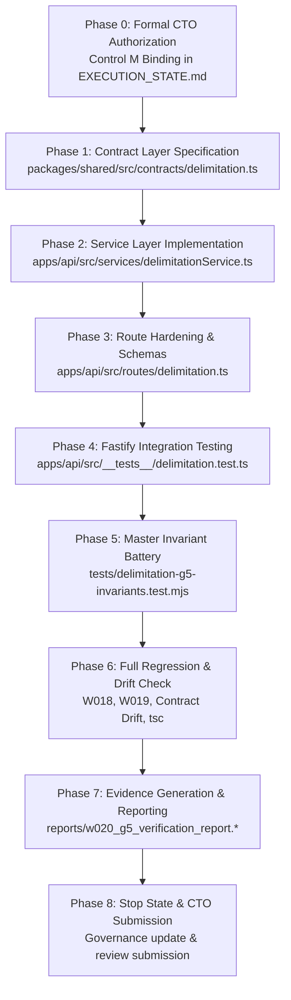

# PLAN-W020-G5-REV-1.2: DELIMITATION ENGINE FOUNDATION
## Core Logic, Mathematical Models, Service Layer & Hardened Read APIs Specification
**Milestone:** W020-G5  
**Revision:** 1.2 (Orthogonal Governance Taxonomies, Computational Safety Policies & Forensic Provenance Specification)  
**Date:** 2026-09-30  
**Authority:** Master Product Blueprint, AI Agent Master Execution Job Book, Amendments v1.2–v1.6, Amendment v1.5-A (Section 26), PANIN India Election & Political Data Constitution, CTO Directive (W020-G5 REV-1.1 Review & Mandatory Corrections G5-16..G5-20)  
**Status:** DRAFT / SUBMITTED FOR CTO REVIEW & RATIFICATION  
**Implementation Authorization:** **STRICTLY NOT AUTHORIZED (PLANNING & PREFLIGHT SPECIFICATION ONLY)**  
**Predecessor Status:** W018 (ACCEPTED / COMPLETE), W019 (ACCEPTED / COMPLETE / CLOSED), W020-G0..G4 (ACCEPTED / COMPLETE / CLOSED)  
**Target Environment:** Staging Supabase (`fkpigozcqnmcvofuksar`) & Local Workspace  
**Production Boundary:** STRICTLY AIR-GAPPED & UNTOUCHED (`ehfafcnimmjusyvplbah`)  
**Frozen Geometry Baseline:** Exactly 589 rows, canonical SHA-256 digest `f839fa02980318a8f35f932ebe72fa1d3ad6325dc86a624bf159d932fe5f613b`  

---

## 1. Document Title & Metadata
* **Document Identifier:** `PLAN-W020-G5-REV-1.2`
* **Milestone:** W020-G5 (Delimitation Engine Foundation — Core Logic, Mathematical Models, Service Layer & Hardened Read APIs)
* **Author:** PANIN Engineering / Senior Backend & Data Architect
* **Governing Specification:** Amendment v1.5-A Section 26 (22-Section Planning Protocol)
* **Date of Formulation:** 2026-09-30
* **Target Version:** API v1 / Database Migration 055 Baseline
* **Parent Execution Track:** Master Job W020 (Delimitation Engine Foundation)
* **Plan Status:** `SUBMITTED_FOR_CTO_RATIFICATION`
* **Implementation Authorization Status:** `STRICTLY_NOT_AUTHORIZED`
* **Revision History:**
  - `REV-1.0` (2026-09-30): Initial preflight specification. Reviewed by CTO; 15 mandatory correction directives issued (G5-01 through G5-15).
  - `REV-1.1` (2026-09-30): Comprehensive revision addressing G5-01..G5-15. Reviewed by CTO; 5 additional mandatory correction directives issued (G5-16 through G5-20).
  - `REV-1.2` (2026-09-30): Authoritative revision addressing G5-16..G5-20:
    - **G5-16:** Renamed the computational ingress guard to `MAX_SAFE_REQUESTED_SEATS = 10000`, explicitly declaring it has zero constitutional, legal, or electoral meaning and is solely a computational overflow/resource protection policy.
    - **G5-17:** Eliminated all 1-to-1 status equivalences; rebuilt the relationship as two orthogonal dimensions: `OUTPUT_CLASSIFICATION` (Class 1–6 plus `UNKNOWN_UNAVAILABLE`) and `DATA_STATUS` (W012 8 statuses), combined with separate `PROVENANCE` and `EVIDENCE` fields.
    - **G5-18:** Formalized Article 332 SC/ST reservation algorithm by decoupling constitutional proportionality (`RES-LEGAL-01`) from PANIN's Hamilton largest-remainder computational implementation (`RES-ALLOC-01`), defining the exact 8-step mathematical execution sequence.
    - **G5-19:** Proved forensic provenance of `eci_delimitation_post2026` directly from repository history (Migration 041, lines 82–89 & 426–437, commit `a4804d3`, record count 0, unmutated on staging).
    - **G5-20:** Removed hardcoded national seat-count validation lists; replaced with a generic engine architecture consuming governed jurisdiction data with explicit `UNSUPPORTED_GEOGRAPHY` semantics, preserving W020's authoritative Telangana focus.

---

## 2. Problem Statement (Task Understanding & Core Objectives)

The existing delimitation endpoints in `apps/api/src/routes/delimitation.ts` originated as early research prototypes. While functional for exploratory demonstrations, forensic review reveals several structural, mathematical, and governance limitations:
1. **Lack of ECC-001 Response Standard:** All 14 endpoints in `apps/api/src/routes/delimitation.ts` return raw unstructured JSON objects rather than standard `ApiSuccessEnvelope<T>` and `sendApiError()` envelopes.
2. **Absence of Dedicated Service Architecture:** Calculation routines, Census 2011 dataset traversals, and hardcoded postal lookups are mixed directly inside route handler closures without a domain service layer (`delimitationService.ts`).
3. **Missing Statutory Scenario Separation:** Hypothetical research projections (e.g. population divisor seat redistribution) are returned without mandatory scenario metadata, risking confusion between official statutory orders and research models.
4. **Vague Demographic & Timeline Terminology:** Endpoints reference "2025" or "post-Census 2026" instead of the authoritative **Census 2027** national operation, and lack field-separated legal succession grounding for Andhra Pradesh and Telangana.
5. **Heuristics Masquerading as Facts:** Geometric approximations (e.g. PIN code centroid lookups, Polsby-Popper compactness scores, sitting MLA vulnerability scores) are not formally categorized under a strict mathematical taxonomy.
6. **Unauthenticated Existing Webhook Prototype:** `POST /api/v1/delimitation/monitor-webhook` exists as prototype code in `delimitation.ts` (lines 204–226, 333–370) but lacks fail-closed secret authentication.

**Core Objective of W020-G5:** Establish the architectural foundation for PANIN's delimitation subsystem by implementing a dedicated `delimitationService.ts`, hardening all 14 Fastify route handlers with Fastify native JSON Schema (Ajv) and ECC-001 envelopes, establishing shared contract types in `@kshetra/shared`, enforcing orthogonal `OUTPUT_CLASSIFICATION` and `DATA_STATUS` dimensions, attaching 10 mandatory metadata fields to scenario projections, and validating the subsystem against a 30-check acceptance test battery.

---

## 3. Current State Analysis (Repository Inspection, Root-Cause Interpretation & Dependency/Blocking Analysis)

### 3.1 Repository Inspection & Fact Baseline
* **Database State:** Migration 055 was verified in preflight (23/23 PASS) and applied to staging (`fkpigozcqnmcvofuksar`) in W020-G4. Tables `delimitation_proposals` and `constituency_mapping` are bridged via 5 foreign keys (`ON DELETE RESTRICT`) to `delimitation_regimes`, `constituency_versions`, and `provenance_records`.
* **Zero Persistent `is_scenario` Column:** Staging catalog audit proves that neither table contains a redundant `is_scenario` column. Regime semantics derive exclusively from `delimitation_regimes.legal_status`.
* **Geometry State:** Exactly 589 rows in `public.entity_geometries`, matching canonical digest `f839fa02980318a8f35f932ebe72fa1d3ad6325dc86a624bf159d932fe5f613b`.
* **Current Route Implementation:** `apps/api/src/routes/delimitation.ts` contains 758 lines of code registering 14 endpoints. Handler closures directly perform calculations without an intermediary service.
* **Census Dataset:** `data/census/india-district-population-2011.ts` contains Census 2011 state- and district-level Primary Census Abstract (PCA) data.
* **Predecessor Milestones:**
  - W018: ACCEPTED / COMPLETE (Canonical Political Entity Model, `080344c`).
  - W019: ACCEPTED / COMPLETE / CLOSED (Election Data Normalization, DEC-083).
  - W020-G4: ACCEPTED / COMPLETE / CLOSED (Migration 055 Canonical Bridge, DEC-084).

### 3.2 Root-Cause Interpretation
The prototype delimitation endpoints were written during early feature prototyping without reference to the Master Contract Envelopes standard (ECC-001 / Job W008) or the PANIN India Election & Political Data Constitution. Consequently, inputs were not strictly sanitized, errors leaked raw exceptions, and analytical simulations were not partitioned from statutory legal data.

### 3.3 Dependency & Blocking Analysis
* **Upstream Dependencies:** W018 (political entities/tenures), W019 (election contests/results), and W020-G4 (Migration 055 schema bridge) are fully resolved and accepted.
* **Current Blocking State:** W020-G5 implementation is strictly BLOCKED until the CTO formally approves this specification (`PLAN-W020-G5-REV-1.2.md`).
* **Downstream Dependencies:** W020-G6 (Historical Delimitation Data Ingestion) and W020-G7 (Mobile Delimitation UI Integration) depend directly on the service and API contracts finalized in G5.

---

## 4. Fact / Inference / Assumption / Unknown Register

```text
┌─────────────────────────────────────────────────────────────────────────────┐
│                 FACT / INFERENCE / ASSUMPTION / UNKNOWN REGISTER            │
├──────┬──────────────────────────────────────────────────────────────────────┤
│ FACT │ 1. Delimitation Order 2008 was enacted on 19 Feb 2008 under the      │
│      │    Delimitation Act, 2002 as Schedule II (State of Andhra Pradesh).  │
│      │ 2. APRA 2014 (Act No. 6 of 2014) bifurcated Schedule II into        │
│      │    Schedule XXXI (Telangana: 119 ACs) and Schedule II (AP: 175 ACs). │
│      │ 3. AP Reorganisation (Removal of Difficulties) Order, 2015 is        │
│      │    identified as G.S.R. 311(E), dated 23 April 2015, effective       │
│      │    immediately ("comes into force at once").                         │
│      │ 4. Commission's Notification No. 282/AP/2018(DEL) was issued on      │
│      │    22 September 2018 under Sec 9(1)(b) Delimitation Act 2002.        │
│      │ 5. Census 2011 is the latest completed statutory census in India.    │
│      │ 6. Census 2027 is in progress; final population data is unavailable. │
│      │ 7. Staging database fkpigozcqnmcvofuksar contains Migration 055.     │
│      │ 8. 589 PostGIS geometry baseline digest is f839fa02...               │
│      │ 9. apps/api/src/services/delimitationService.ts DOES NOT EXIST YET.  │
│      │ 10. packages/shared/src/contracts/delimitation.ts DOES NOT EXIST YET.│
│      │ 11. POST /api/v1/delimitation/monitor-webhook EXISTS AS A PROTOTYPE. │
│      │ 12. eci_delimitation_post2026 was created in Migration 041           │
│      │     (commit a4804d3, lines 82-89 & 426-437) with record_count = 0.   │
├──────┼──────────────────────────────────────────────────────────────────────┤
│ INF. │ 1. S.O. 1416(E) was a misidentified instrument and must be excluded. │
│      │ 2. 29 May 2014 is the APRA Amendment Ordinance date, not G.S.R.     │
│      │    311(E)'s promulgation or commencement date.                       │
│      │ 3. Because Census 2027 results do not exist, any 2027 delimitation   │
│      │    calculation is strictly a SCENARIO_PROPOSED_REGIME simulation.    │
│      │ 4. The ideal divisor 293,896.84 is a PANIN-derived quotient (2011    │
│      │    population / 4,120 seats) and NOT a constitutional constant.      │
│      │ 5. MAX_SAFE_REQUESTED_SEATS = 10000 is a computational safety bound  │
│      │    and has NO constitutional, legal, or electoral meaning.           │
├──────┼──────────────────────────────────────────────────────────────────────┤
│ ASS. │ 1. Fastify 5.2 and Node.js 22 runtime will execute all apportionment  │
│      │    calculations with exact integer arithmetic without float drift.   │
│      │ 2. The 14 existing routes cover all frontend prototype requirements. │
│      │ 3. External gazette scrapers will supply valid Bearer tokens matching │
│      │    KSHETRA_MONITOR_SECRET.                                           │
├──────┼──────────────────────────────────────────────────────────────────────┤
│ UNK. │ 1. The exact date Parliament will enact the next Delimitation Act.   │
│      │ 2. The final date of publication of Census 2027 PCA tables.          │
│      │ 3. Final ward-level boundaries for urban local bodies post-2027.     │
└──────┴──────────────────────────────────────────────────────────────────────┘
```

---

## 5. Target Architecture & Intended Outcome

### 5.1 Three-Tier Separation Architecture
1. **Contract Layer (`@kshetra/shared`):**
   - Location: `packages/shared/src/contracts/delimitation.ts`
   - Defines strict TypeScript interfaces for all 14 endpoints, adhering to `ApiSuccessEnvelope<T>` and `sendApiError()`.
   - Exports the `ScenarioEnclosure` interface enforcing the 10 mandatory metadata fields.
   - Defines orthogonal `OutputClassification`, `DataStatus`, `DatasetVersionProvenance`, and `MathematicalProvenance`.
2. **Domain Service Layer (`apps/api`):**
   - Location: `apps/api/src/services/delimitationService.ts`
   - Encapsulates statutory queries, Census 2011 apportionment formulas (Hamilton/Hare-Niemeyer and Webster/Sainte-Laguë), Article 332 SC/ST quota model, PIN code geographic resolver, and sitting MLA impact heuristics.
   - Strictly isolates calculation logic from HTTP transport concerns.
3. **Hardened Route Layer (`apps/api`):**
   - Location: `apps/api/src/routes/delimitation.ts`
   - Attaches Fastify native JSON Schema (Ajv) request validation schemas to every route.
   - Validates authentication on webhook ingestion via `KSHETRA_MONITOR_SECRET` or `MONITOR_WEBHOOK_SECRET`.
   - Delegates all business execution to `delimitationService`.
   - Wraps responses in `ApiSuccessEnvelope<T>` with `requestId` and ISO `timestamp`.

### 5.2 Computational Resource & Safety Policy: `MAX_SAFE_REQUESTED_SEATS` (Directive G5-16)
To prevent integer overflow, denial of service, memory exhaustion, and runaway loops in quotient generation algorithms, an ingress computational boundary is enforced:
* **Identifier:** `MAX_SAFE_REQUESTED_SEATS = 10000`
* **Explicit Policy Declaration:**
  > *"This value has NO constitutional, statutory, electoral, geographic, or legal meaning. It is solely a computational resource/overflow protection."*
* **API Exposure Guard:** The API **MUST NOT** expose this boundary as an assertion of legal validity. Error messages for values exceeding `MAX_SAFE_REQUESTED_SEATS` state:
  `"Requested seats exceed computational resource safety limit (MAX_SAFE_REQUESTED_SEATS = 10000)."`
* **Architecture:** The bound is derived strictly from backend memory/CPU safety limits, not delimitation domain jurisprudence.

### 5.3 Orthogonal Status Dimensions: `OUTPUT_CLASSIFICATION` & `DATA_STATUS` (Directive G5-17)
The G5 mathematical/output classification does **NOT** replace, derive, or determine W012 `data_status` by itself. They are two orthogonal dimensions modeled as separate, distinct fields:

```typescript
// Dimension A: G5 Output / Calculation Classification
export type OutputClassification =
  | 'STATUTORY_FACT'            // Enacted legal orders, gazette notices, statutory seat counts
  | 'DETERMINISTIC_DERIVED'     // Computed via deterministic mathematical formulas
  | 'STATUTORY_BENCHMARK'       // Historical baselines verified against official commission orders
  | 'SCENARIO_PROJECTION'       // Hypothetical research models and user-defined simulations
  | 'GEOGRAPHIC_APPROXIMATION'  // Spatial heuristics, PIN code centroid lookups
  | 'POLITICAL_HEURISTIC'       // Incumbent vulnerability heuristics, swing models
  | 'UNKNOWN_UNAVAILABLE';      // Data or projection mathematically or legally unresolvable

// Dimension B: Canonical W012 Data Status (from packages/shared)
export type DataStatus =
  | 'OFFICIAL'                  // Primary gazetted statutory authority
  | 'DERIVED'                   // Deterministically derived from official data
  | 'VERIFIED'                  // Audited and corroborated against external source
  | 'SCENARIO'                  // Unenacted scenario projection
  | 'ESTIMATE'                  // Approximate statistical or spatial estimate
  | 'INFERRED'                  // Heuristically inferred analytical attribute
  | 'UNVERIFIED'                // Raw input pending authoritative corroboration
  | 'UNKNOWN';                  // Missing, withheld, or pending statutory operation
```

#### Valid Orthogonal Combinations Matrix:
1. `DETERMINISTIC_DERIVED` + `DERIVED`: Hamilton seat re-apportionment computed strictly from verified Census 2011 PCA population figures.
2. `DETERMINISTIC_DERIVED` + `UNKNOWN`: Deterministic algorithm invoked where population breakdown or sub-district census counts are unavailable.
3. `HEURISTIC` + `INFERRED`: Sitting MLA vulnerability score calculated from historical victory margin percentages.
4. `STATUTORY_FACT` + `OFFICIAL`: 119 Assembly Constituencies in Telangana enacted under APRA 2014 Schedule XXXI.
5. `SCENARIO_PROJECTION` + `SCENARIO`: Hypothetical 150-seat assembly simulation using user-specified seat count.
6. `UNKNOWN_UNAVAILABLE` + `UNKNOWN`: Census 2027 population fields requested prior to official statutory publication.

*Rule:* When evidence is unavailable, the engine **DOES NOT** force a speculative `data_status`; it yields `UNKNOWN_UNAVAILABLE` with `dataStatus: 'UNKNOWN'`.

### 5.4 Article 332 SC/ST Reservation Mathematical Algorithm (Directive G5-18)
Article 332's constitutional proportionality requirement and PANIN's computational implementation algorithm are formally separated:

* **Constitutional Proportionality Principle (`RES-LEGAL-01`):** Under Article 332(3) of the Constitution of India, seats reserved for the Scheduled Castes and the Scheduled Tribes in the Legislative Assembly of any State shall bear, as nearly as may be, the same proportion to the total number of seats in the Assembly as the population of the Scheduled Castes or the Scheduled Tribes in the State bears to the total population of the State.
* **PANIN Computational Algorithm (`RES-ALLOC-01`):** PANIN adopts the **Hamilton / Largest Remainder Method** to operationalize Article 332(3) into a deterministic integer allocation.

#### Exact 8-Step Execution Sequence:
1. **Quota Calculation:**
   $$Q_{SC} = S \times \frac{Pop_{SC}}{Pop_{Total}}, \quad Q_{ST} = S \times \frac{Pop_{ST}}{Pop_{Total}}$$
   where $S$ is the total seats, $Pop_{SC}$ and $Pop_{ST}$ are the official Scheduled Caste and Scheduled Tribe populations, and $Pop_{Total}$ is the total state population from the verified Census PCA dataset.
2. **Integer / Base Allocation:**
   $$I_{SC} = \lfloor Q_{SC} \rfloor, \quad I_{ST} = \lfloor Q_{ST} \rfloor$$
   $$R_{base} = I_{SC} + I_{ST}$$
3. **Remaining-Seat Calculation:**
   The total target reserved seats $R_{target}$ is determined by rounding the sum of quotas:
   $$R_{target} = \lfloor Q_{SC} + Q_{ST} + 0.5 \rfloor$$
   The surplus seats to distribute via remainders is:
   $$K = R_{target} - R_{base} \quad (K \in \{0, 1, 2\})$$
4. **Remainder Calculation (`RES-ROUND-01`):**
   $$r_{SC} = Q_{SC} - I_{SC}, \quad r_{ST} = Q_{ST} - I_{ST}$$
5. **Remainder Ordering:**
   Categories are ranked by fractional remainder descending:
   - If $r_{SC} > r_{ST}$, priority order is $(SC, ST)$.
   - If $r_{ST} > r_{SC}$, priority order is $(ST, SC)$.
6. **Deterministic Tie-Breaking (`RES-TIE-01`):**
   If $r_{SC} \equiv r_{ST}$:
   - Priority is given to the category with the larger absolute population ($Pop_{SC}$ vs $Pop_{ST}$).
   - If populations are identical, priority is assigned lexicographically (`SC` before `ST`).
7. **Final Allocation:**
   Award 1 additional seat to the top $K$ categories in the priority order:
   $$S_{SC} = I_{SC} + \Delta_{SC}, \quad S_{ST} = I_{ST} + \Delta_{ST}$$
   where $\Delta_{c} \in \{0, 1\}$ and $\sum \Delta_c = K$.  
   General seats are computed as:
   $$S_{General} = S - S_{SC} - S_{ST}$$
8. **Seat Conservation Assertion (`RES-CONS-01`):**
   The engine asserts bitwise:
   $$S_{SC} + S_{ST} + S_{General} \equiv S$$

*Data Integrity & Missing Data Rules:*
- `RES-DATA-01`: Population inputs must originate exclusively from verified Census Primary Census Abstract tables.
- `RES-UNKNOWN-01`: If demographic data for the requested jurisdiction is missing or unverified, the calculation aborts fail-closed, returning `outputClassification: 'UNKNOWN_UNAVAILABLE'`, `dataStatus: 'UNKNOWN'`, and `data: null`. Zero synthetic fallback numbers are permitted.

### 5.5 Provenance of `eci_delimitation_post2026` (Directive G5-19)
The provenance of the `eci_delimitation_post2026` object is established directly from repository history:
1. **Exact Migration Filename:** `supabase/migrations/041_geography_versioning_and_temporal_validity.sql` (mirrored in `supabase/staging_migration_package_041.sql`).
2. **Exact Insertion Location:**
   - In `public.dataset_versions` (lines 82–89):
     `id = 'eci_delimitation_post2026_projected_v1'`, `dataset_id = 'eci_delimitation_orders'`, `version_tag = 'post2026_anticipated'`, `effective_from = '2026-01-01'`, `record_count = 0`, `default_status = 'UNVERIFIED'`, `metadata = {"statutory_reference": "Constitution of India, Articles 82 & 170 (Post-2026 Delimitation Freeze)", "legal_status": "PROSPECTIVE_UNENACTED", "evidence_state": "constitutional_mandate"}`.
   - In `public.delimitation_regimes` (lines 426–437):
     `id = 'eci_delimitation_post2026'`, `name = 'Post-2026 Constitutional Delimitation (Anticipated)'`, `legal_status = 'FUTURE_ANTICIPATED_REGIME'`, `authority = 'Parliament of India / Future Delimitation Commission'`, `enabling_law = 'Constitution of India (84th Amendment, Arts 82 & 170)'`, `effective_from = '2026-01-01'`, `is_active = false`, `dataset_version_id = 'eci_delimitation_post2026_projected_v1'`, `metadata = {"description": "Constitutional mandate for delimitation following first census after 2026. Un-enacted prospective regime."}`.
3. **Commit SHA Introducing Object:** `a4804d356c9eae28f8a9508ed95c74021c940789` (`a4804d3`, 2026-09-22, *"feat(w014): implement geography versioning and temporal validity model"*). Reconciled in W014 commits `8107243`, `d00df00`, and `bb7c6ec`.
4. **Current Row Count:** Exactly 0 records in linked datasets (`record_count = 0`). The catalog row itself is 1 row in `delimitation_regimes` and 1 row in `dataset_versions`.
5. **Current FK / Reference Relationships:**
   - `public.delimitation_regimes.dataset_version_id` references `public.dataset_versions(id)`.
   - In Migration 055: `public.delimitation_proposals.delimitation_regime_id` references `public.delimitation_regimes(id)` via `fk_delim_proposals_regime` with `ON DELETE RESTRICT`.
6. **Tests & Fixtures Referencing Object:**
   - `tests/verify_w014_temporal_validity.mjs` (asserts regime presence and temporal validity).
   - `scripts/verify_w014_temporal_validity.mjs`.
   - `reports/w020_g4_staging_execution.json` (verified during W020-G4 catalog audit).
7. **Original Intended Semantic Meaning:**
   Created during W014 to represent the prospective constitutional post-2026 freeze window under the 84th Constitutional Amendment (Articles 82 & 170). It is marked `is_active = false` with 0 records to guarantee that no synthetic constituency boundaries or seats are fabricated.
8. **Retention Policy:** Retained **UNTOUCHED** on staging. Zero DDL, zero renaming, zero deletions. In the API layer, its display label maps to:
   *"Future Anticipated Delimitation (Post-Census 2027 Operation)"*.

### 5.6 Generic Engine Architecture & Governed Jurisdiction Data (Directive G5-20)
National seat-count lists (e.g. Sikkim 32, Goa 40, Puducherry 30) are **REMOVED** from hardcoded engine code. The architecture is strictly structured as:
$$\text{GENERIC ENGINE ARCHITECTURE} + \text{GOVERNED JURISDICTION DATA} + \text{EXPLICIT UNSUPPORTED/UNKNOWN SEMANTICS}$$

1. **Generic Engine:** Apportionment algorithms (Hamilton, Webster), Article 332 models, and temporal queries are jurisdiction-agnostic mathematical routines accepting generic numeric inputs and governed jurisdiction records.
2. **Governed Jurisdiction Data:** Statutory seat counts and legal regimes are loaded exclusively from governed database records (`delimitation_regimes`, `dataset_versions`) and governed demographic datasets (`data/census/india-district-population-2011.ts`).
3. **W020 Bounded Jurisdiction Coverage:** W020 is strictly bounded to the authoritative **Telangana** geography (119 Assembly Constituencies, 17 Parliamentary Constituencies, Schedule XXXI of APRA 2014) and verified Census 2011 state baselines.
4. **Explicit Unsupported / Unknown Semantics:** If a request queries a jurisdiction not present in governed datasets, the engine returns a structured error:
   ```json
   {
     "code": "UNSUPPORTED_GEOGRAPHY",
     "message": "Jurisdiction is not registered in governed delimitation baselines.",
     "jurisdiction": "ZZ",
     "dataStatus": "UNKNOWN"
   }
   ```
   No hardcoded national fallback tables exist in the codebase.

---

## 6. Governing Rules & Constraints

1. **Rule IV-001 (Implementing Agent ≠ Final Acceptance Authority):** The implementing agent cannot self-certify or self-authorize W020-G5. Formal CTO review and approval are mandatory.
2. **Amendment v1.5-A / Control M:** No product code modification may occur until `PLAN_STATUS: APPROVED` and an approved implementation commit SHA is bound.
3. **Data Constitution Principle 1 (Truth in Engineering):** Simulations must be explicitly tagged as `SCENARIO_PROPOSED_REGIME` with the 10 mandatory metadata attributes. Never present research projections as official gazetted orders.
4. **Data Constitution Principle 4 (Anti-Derivation Rule):** Where data is unavailable (e.g. Census 2027 population), return `NULL` / `UNKNOWN`. Never fabricate intermediate numbers or use sentinel zeros.
5. **Security & Least Privilege:**
   - Public read access for standard query routes (`anon` and `authenticated`).
   - `POST /api/v1/delimitation/monitor-webhook` requires valid Bearer token authentication matching `KSHETRA_MONITOR_SECRET` or `MONITOR_WEBHOOK_SECRET`.
   - Error messages sanitized; zero internal stack trace or SQL exception leakage.
6. **DPDP Compliance:** No personal data collected or stored. Incumbent legislator lookups use public statutory records (`canonical_persons`, `elected_tenures`).

---

## 7. Full Scope of Work (Exact Files Expected to Change)

When authorized, W020-G5 will touch **EXACTLY** the following files:

| File Path | Action | Component & Purpose |
| :--- | :--- | :--- |
| `packages/shared/src/contracts/delimitation.ts` | **NEW** | Canonical TypeScript request/response contracts, `ScenarioEnclosure`, and orthogonal provenance interfaces. |
| `packages/shared/src/contracts/index.ts` | **MODIFIED** | Export delimitation contracts. |
| `packages/shared/src/index.ts` | **MODIFIED** | Re-export delimitation contracts from package root. |
| `apps/api/src/services/delimitationService.ts` | **NEW** | Domain service layer implementing apportionment math, statutory timelines, Article 332 models, and heuristics. |
| `apps/api/src/routes/delimitation.ts` | **MODIFIED** | Hardened Fastify route module with Ajv schemas, ECC-001 envelopes, and auth guards. |
| `apps/api/src/__tests__/delimitation.test.ts` | **NEW** | Fastify route integration suite testing all 14 endpoints and ECC-001 responses. |
| `tests/delimitation-g5-invariants.test.mjs` | **NEW** | Master 30-check semantic invariant test suite verifying legal succession and math. |
| `reports/w020_g5_plan_manifest.json` | **MODIFIED** | Updated machine-readable plan manifest (REV-1.2). |
| `reports/w020_g5_verification_report.json` | **NEW** | Generated evidence report upon test execution. |
| `reports/w020_g5_verification_report.md` | **NEW** | Human-readable verification report upon test execution. |
| `EXECUTION_STATE.md` | **MODIFIED** | Governance coordinates update. |
| `ACCEPTANCE_REGISTER.md` | **MODIFIED** | Governance milestones update. |
| `DECISION_LOG.md` | **MODIFIED** | Record DEC-086 (REV-1.1 Revision) and DEC-087 (REV-1.2 Revision). |

---

## 8. Explicit Out-of-Scope Boundaries

The following boundaries are strictly enforced throughout W020-G5:
* **ZERO Mobile Code Changes:** `apps/mobile/**` is 100% untouched. Mobile integration occurs in W020-G7.
* **ZERO Schema Migrations:** `supabase/migrations/**` is 100% untouched. No new SQL files.
* **ZERO Staging Migrations:** No execution of DDL on staging.
* **ZERO Production Contact:** Production database `ehfafcnimmjusyvplbah` remains air-gapped.
* **ZERO PostGIS Geometry Changes:** Exactly 589 rows in `entity_geometries`, digest `f839fa02980318a8f35f932ebe72fa1d3ad6325dc86a624bf159d932fe5f613b`.
* **ZERO Census Dataset Modifications:** `data/census/india-district-population-2011.ts` is read-only.
* **ZERO APK Builds:** Android compilation deferred to W023.

---

## 9. Step-by-Step Implementation Plan (Detailed Execution Phases)



### Phase 1: Contract Layer Specification
1. Create `packages/shared/src/contracts/delimitation.ts`.
2. Define DTOs for all 14 endpoints: `DelimitationProjectionsDTO`, `SingleStateProjectionDTO`, `DelimitationTimelineDTO`, `DelimitationStatusDTO`, `GainersLosersDTO`, `CitizenImpactDTO`, `BoundarySimulationDTO`, `NationalReservationDTO`, `StateReservationDetailDTO`, `StateComparisonDTO`, `MlaImpactDTO`, `PartyProjectionsDTO`, `DelimitationMethodologyDTO`.
3. Define `ScenarioEnclosure` interface with all 10 mandatory metadata attributes.
4. Define orthogonal `OutputClassification`, `DataStatus`, `DatasetVersionProvenance`, and `MathematicalProvenance` interfaces.
5. Export contracts in `packages/shared/src/contracts/index.ts` and `packages/shared/src/index.ts`.
6. Verify build: `npm run build --prefix packages/shared`.

### Phase 2: Domain Service Layer Implementation
1. Create `apps/api/src/services/delimitationService.ts`.
2. Implement statutory timeline using the verified 5-stage legal chain:
   - Delimitation Order 2008 (Schedule II: Andhra Pradesh).
   - APRA 2014 (Schedule XXXI: Telangana 119 ACs, Schedule II: AP 175 ACs).
   - AP Reorganisation (Removal of Difficulties) Order, 2015: **G.S.R. 311(E)**, **23 April 2015**, "comes into force at once".
   - Commission's Notification **No. 282/AP/2018(DEL)**, **22 September 2018**.
   - Current Telangana Geography (Schedule XXXI).
   - Tracking record for **Census 2027** (enumeration pending, population unavailable).
3. Implement constitutional status logic (Articles 82 & 170, 84th/87th Amendments, Census 2027 status).
4. Implement Census 2011 apportionment formulas (Hamilton / Hare-Niemeyer and Webster / Sainte-Laguë).
5. Implement Article 332 SC/ST quota allocation using the 8-step sequence (`RES-LEGAL-01` through `RES-UNKNOWN-01`).
6. Implement PIN code lookup with 3-digit prefix mapping to verified districts and approximate centroid disclosure.
7. Implement sitting MLA impact integrating with W018 `canonical_persons` and W019 `election_contests`.
8. Implement scenario wrapper attaching the 10 mandatory metadata fields.

### Phase 3: Route Hardening & Schemas
1. Update `apps/api/src/routes/delimitation.ts`.
2. Define complete Fastify native JSON Schema (Ajv) for all 14 endpoints (params, querystring, headers, body, response) enforcing `MAX_SAFE_REQUESTED_SEATS = 10000` computational boundary.
3. Add webhook auth guard verifying `Bearer ${expectedSecret}` against `KSHETRA_MONITOR_SECRET` or `MONITOR_WEBHOOK_SECRET`.
4. Replace raw object returns with standard `ApiSuccessEnvelope<T>`.
5. Wrap all handlers in `try/catch` delegating errors to `sendApiError(reply, request, statusCode, error, message)`.

### Phase 4: Fastify Integration Testing
1. Create `apps/api/src/__tests__/delimitation.test.ts`.
2. Test all 14 routes against running Fastify test instance.
3. Assert HTTP 200 and `success: true` on valid requests.
4. Assert HTTP 400 on malformed params or values exceeding `MAX_SAFE_REQUESTED_SEATS`.
5. Assert HTTP 401 on `POST /monitor-webhook` with missing/wrong token.
6. Assert HTTP 404 on unconfigured jurisdictions (`UNSUPPORTED_GEOGRAPHY`).

### Phase 5: Master Invariant Battery
1. Create `tests/delimitation-g5-invariants.test.mjs`.
2. Implement 30 checks across Plane 1 (Legal), Plane 2 (Taxonomy), Plane 3 (Math), and Plane 4 (API).
3. Execute and verify 30/30 PASS.

### Phase 6: Regression, Contract Drift & Build Integrity
1. Run W018 regression: `node tests/political-entities-invariants.test.mjs` (53/53 PASS).
2. Run W019 regression: `node tests/election-normalization-invariants.test.mjs` (93/93 PASS).
3. Run API contract drift: `node scripts/check-api-contract-drift.mjs` (9/9 MATCH).
4. Run API build: `npm run build --prefix apps/api` (exit 0).
5. Run mobile build: `npx tsc --noEmit -p apps/mobile/tsconfig.json` (exit 0).

### Phase 7: Evidence Generation & Reporting
1. Produce `reports/w020_g5_verification_report.json` and `reports/w020_g5_verification_report.md`.
2. Capture test logs, response payloads, and invariant proofs.

### Phase 8: Stop State & CTO Submission
1. Update `EXECUTION_STATE.md`, `ACCEPTANCE_REGISTER.md`, `DECISION_LOG.md`.
2. Run repo integrity and freshness scripts.
3. Commit and push.
4. Stop and submit for CTO technical acceptance.

---

## 10. Verification & Testing Strategy

### 10.1 Dual-Suite Architecture
* **Suite 1: Domain & Mathematical Invariants (`tests/delimitation-g5-invariants.test.mjs`)**
  - Standalone Node.js test script executed via `node tests/delimitation-g5-invariants.test.mjs`.
  - Directly tests domain algorithms, mathematical invariants, legal instruments, and orthogonal taxonomies.
* **Suite 2: Fastify HTTP Integration (`apps/api/src/__tests__/delimitation.test.ts`)**
  - Executed via `npm test --prefix apps/api -- src/__tests__/delimitation.test.ts`.
  - Tests HTTP routing, Ajv validation errors, Bearer auth guards, and canonical ECC-001 response serialization.

### 10.2 Anti-Tautology & Test Integrity Guarantees
* **No Synthetic Mocking of Tested Math:** The Hare-Niemeyer seat conservation test must use real Census 2011 district figures and synthetic fractional edge cases.
* **No Source Text Inspection as Behavioral Proof:** Tests must invoke the actual functions and assert output values, not grep source files for strings.
* **Fail-Closed Negative Assertions:** Invariant tests must assert that invalid states throw errors or return appropriate 4xx status codes.

---

## 11. Negative-Path Testing Specification

| Test ID | Target Component | Input Condition | Expected Behavior | Fail-Closed Assertion |
| :--- | :--- | :--- | :--- | :--- |
| `NP-G5-01` | `POST /monitor-webhook` | Missing `Authorization` header | HTTP 401 `UNAUTHORIZED` | Request rejected; 0 entries processed. |
| `NP-G5-02` | `POST /monitor-webhook` | Invalid Bearer token (`Bearer wrong-secret`) | HTTP 401 `UNAUTHORIZED` | Request rejected; 0 entries processed. |
| `NP-G5-03` | `GET /projections/:stateCode`| Lowercase state code (`/projections/ts`) | HTTP 400 `FST_ERR_VALIDATION` | Ajv regex `^[A-Z]{2}$` fails before handler. |
| `NP-G5-04` | `GET /projections/:stateCode`| Non-existent state code (`/projections/ZZ`)| HTTP 404 `NOT_FOUND` | Structured `UNSUPPORTED_GEOGRAPHY` returned. |
| `NP-G5-05` | `GET /impact/:pinCode` | 5-digit PIN code (`/impact/50008`) | HTTP 400 `FST_ERR_VALIDATION` | Ajv regex `^\d{6}$` fails. |
| `NP-G5-06` | `GET /impact/:pinCode` | Non-numeric PIN code (`/impact/50008A`) | HTTP 400 `FST_ERR_VALIDATION` | Ajv regex fails. |
| `NP-G5-07` | `GET /simulate/:stateCode` | Seats exceeding safety policy (`?seats=10001`)| HTTP 400 `FST_ERR_VALIDATION` | `MAX_SAFE_REQUESTED_SEATS` guard triggers. |
| `NP-G5-08` | `GET /simulate/:stateCode` | Zero or negative seats (`?seats=0`) | HTTP 400 `FST_ERR_VALIDATION` | Technical syntax floor (`minimum: 1`) fails. |
| `NP-G5-09` | `GET /compare` | Missing `states` query parameter | HTTP 400 `FST_ERR_VALIDATION` | Required parameter validation fails. |
| `NP-G5-10` | `GET /compare` | Single state in query (`?states=TS`) | HTTP 400 `FST_ERR_VALIDATION` | Multi-state minimum length (`minItems: 2`) fails. |
| `NP-G5-11` | `Hare-Niemeyer Engine` | Target seats less than district count ($S < N$) | Throws domain error | Fails algorithm-domain validation. |
| `NP-G5-12` | `SC/ST Quota Engine` | Demographic data missing for state | Returns `dataStatus: UNKNOWN` | Zero synthetic population fallback. |

---

## 12. Evidence Generation Plan

Upon completion of W020-G5 implementation, the following evidence artifacts will be generated and committed:
1. `reports/w020_g5_plan_manifest.json`: Machine-readable specification manifest (REV-1.2).
2. `reports/w020_g5_verification_report.json`: Machine-readable execution results containing commit coordinates, invariant results (30/30 PASS), Fastify test results, regression results, and geometry hash verification.
3. `reports/w020_g5_verification_report.md`: Human-readable summary report with tables and command transcripts.

---

## 13. Reconciliation Plan

The following governance files will be synchronized in lockstep:
* `EXECUTION_STATE.md`:
  - `CURRENT_JOB`: `W020-G5 (Delimitation Engine Foundation — Core Logic, Mathematical Models & Hardened Read APIs)`
  - `W020_G4_STATUS`: `ACCEPTED / COMPLETE / CLOSED (DEC-084)`
  - `W020_G5_STATUS`: `PLANNING REVISED (REV-1.2)`
  - `IMPLEMENTATION_AUTHORIZATION`: `NO (awaiting CTO ratification)`
* `ACCEPTANCE_REGISTER.md`:
  - Update W020-G5 entry to reference `PLAN-W020-G5-REV-1.2.md`.
  - Maintain W020-G4 as `ACCEPTED / COMPLETE`.
* `DECISION_LOG.md`:
  - Record DEC-087 (W020-G5 REV-1.2 Plan Revision & Forensic Provenance Reconciliation).

---

## 14. Independent Verification Specification

In accordance with Amendment v1.2 Rule IV-001, final technical acceptance requires an independent verifier session:
1. Verifier must clone or fetch the canonical repository at the verified commit coordinate.
2. Verifier must run the verification suite independently:
   - `node tests/delimitation-g5-invariants.test.mjs`
   - `npm test --prefix apps/api -- src/__tests__/delimitation.test.ts`
   - `node tests/political-entities-invariants.test.mjs`
   - `node tests/election-normalization-invariants.test.mjs`
   - `node scripts/check-api-contract-drift.mjs`
   - `npm run build --prefix apps/api`
   - `npx tsc --noEmit -p apps/mobile/tsconfig.json`
   - `node scripts/check-repo-evidence-integrity.mjs`
   - `node tests/commit-freshness.test.mjs`
3. Verifier must independently inspect code for absence of synthetic bypasses or persistent `is_scenario` columns.
4. Verifier emits `reports/w020_g5_independent_verification.md`.

---

## 15. Risks, Failure Modes & Mitigations

| Risk ID | Failure Mode | Severity | Likelihood | Mitigation Strategy |
| :--- | :--- | :--- | :--- | :--- |
| `RSK-G5-01` | Premature implementation before CTO approval | Critical | Low | Hard Control M gate enforced. Execution halted after planning. |
| `RSK-G5-02` | API contract drift between `@kshetra/shared` and Fastify | High | Medium | Fastify integration test suite asserts response shapes; `check-api-contract-drift.mjs` validates registrations. |
| `RSK-G5-03` | Inadvertent leakage of internal stack traces or SQL errors | High | Low | Global `sendApiError()` catches all exceptions; raw errors logged to Fastify logger only. |
| `RSK-G5-04` | Accidental mutation of 589 PostGIS geometry baseline | Critical | Very Low | Automated pre- and post-test assertions verify geometry count (589) and SHA-256 digest `f839fa02...`. |
| `RSK-G5-05` | Accidental connection to production database | Critical | Very Low | Production URL `ehfafcnimmjusyvplbah` air-gapped in test runners; connection assertion fails closed. |
| `RSK-G5-06` | Rounding discrepancies in Hamilton seat apportionment | Medium | Medium | Quota conservation invariant $\sum s_d \equiv S_{\text{target}}$ enforced with integer remainder sorting. |

---

## 16. Rollback & Recovery Strategy

Because W020-G5 involves zero database migrations and zero persistent schema changes:
1. **Source Code Rollback:** If any implementation defect is discovered during verification, the repository can be cleanly restored to the pre-G5 baseline commit (`46d9558` / W020-G4 accepted) via standard Git reset:
   ```bash
   git reset --hard 46d9558727fe03fd724ba39149a7d51b9e50b1d4
   ```
2. **Zero Database Rollback Needed:** Staging database `fkpigozcqnmcvofuksar` remains at Migration 055. Zero DDL is executed in G5.
3. **Evidence Archival:** Errant evidence reports will be archived, never deleted without an audit log.

---

## 17. Impact Assessment

* **Impact on Existing Fastify Routes:** All 14 delimitation routes will now return standard `{ success: true, data: ..., requestId, timestamp }`. Existing clients expecting raw unwrapped JSON will receive the canonical ECC-001 envelope.
* **Impact on Mobile App (`apps/mobile`):** Zero impact during G5 because `apps/mobile` is strictly frozen. The mobile client will be adapted to the hardened API in Milestone **W020-G7**.
* **Impact on Database:** Zero DDL impact. Staging schema remains unchanged.
* **Impact on Upstream Milestones:** W018 and W019 remain fully compatible. Incumbent legislator lookups will consume W018/W019 tables cleanly.

---

## 18. Acceptance Criteria (Claim-Based Binary Verifiable Criteria)

```text
AC-G5-01: Claim — A dedicated domain service apps/api/src/services/delimitationService.ts
                 exists and encapsulates all mathematical models, timeline events, and
                 statutory queries.
                 Verification: File exists; exports DelimitationService class & singleton.

AC-G5-02: Claim — All 14 Fastify routes in apps/api/src/routes/delimitation.ts have
                 explicit Fastify native JSON Schema (Ajv) input validation schemas attached,
                 enforcing MAX_SAFE_REQUESTED_SEATS = 10000 computational bound.
                 Verification: Inspection of route registrations; schema presence verified.

AC-G5-03: Claim — All 14 Fastify routes return standardized ECC-001 ApiSuccessEnvelope<T>.
                 Verification: Integration test asserts response.body.success === true,
                 response.body.requestId is string, response.body.timestamp is ISO date.

AC-G5-04: Claim — POST /api/v1/delimitation/monitor-webhook rejects unauthenticated access
                 with HTTP 401 and accepts valid Bearer secret tokens.
                 Verification: Fastify test with and without Authorization header.

AC-G5-05: Claim — All scenario projections encapsulate the 10 mandatory metadata fields
                 and derived is_scenario: true attribute without persistent db column.
                 Verification: Invariant test asserts presence of all 10 attributes.

AC-G5-06: Claim — GET /api/v1/delimitation/timeline accurately reflects the 5-stage legal
                 succession chain and ongoing Census 2027 tracking without 2025/2026 errors.
                 Verification: Invariant test asserts legal instruments and dates byte-exact.

AC-G5-07: Claim — Output classifications and W012 data statuses are maintained as orthogonal
                 dimensions with separate provenance and evidence fields.
                 Verification: Contract inspection and response serialization tests.

AC-G5-08: Claim — Article 332 SC/ST quota allocation satisfies Quota Conservation Law
                 (SC + ST + General === TargetSeats) and executes the 8-step mathematical
                 sequence (RES-LEGAL-01 through RES-UNKNOWN-01).
                 Verification: Automated invariant checks across Census 2011 states.

AC-G5-09: Claim — The 589 PostGIS geometry baseline remains strictly frozen and matches
                 SHA-256 digest f839fa02980318a8f35f932ebe72fa1d3ad6325dc86a624bf159d932fe5f613b.
                 Verification: PostGIS count and digest query.

AC-G5-10: Claim — The production database ehfafcnimmjusyvplbah is 100% air-gapped and untouched.
                 Verification: 0 connections, 0 mutations asserted.

AC-G5-11: Claim — Zero mobile source code (apps/mobile/**) is modified during W020-G5.
                 Verification: git diff -- apps/mobile returns clean.

AC-G5-12: Claim — Regression suites W018 (53/53 PASS) and W019 (93/93 PASS) pass 100%.
                 Verification: Execution of invariant test scripts.
```

---

## 19. Artifact & Commit Lineage Map

```text
46d9558 (origin/master) feat(w020): staging execution, live verification evidence, and reporting (W020-G4)
   │
d6c4513 docs(w020): update preflight report with final commit coordinates
   │
c0da551 docs(governance): bind Control M implementation authorization coordinate for W020-G4
   │
9e7e3c9 feat(w020): migration 055 staging preflight, schema bridge, and verification battery (DEC-084)
   │
9b7cad4 docs(w020): author ratified master plan rev-1.3 and reconciliation records
   │
ebb9954 docs(w020): author bounded W020-G5 master plan REV-1.0 and update governance (DEC-085)
   │
d86991a docs(w020): author bounded W020-G5 master plan REV-1.1 addressing CTO review (DEC-086)
   │
[CURRENT STEP] Author PLAN-W020-G5-REV-1.2.md, update manifest, and update governance (DEC-087)
```

---

## 20. Amendment Compliance Matrix

| Amendment & Clause | Governing Requirement | Compliance Mechanism in W020-G5 | Compliance Status |
| :--- | :--- | :--- | :--- |
| **Amendment v1.2 Rule IV-001** | Implementing Agent ≠ Acceptance Authority | Independent verification required; agent does not self-accept. | **COMPLIANT** |
| **Amendment v1.4 Part 7** | Evidence Freshness Rule | Evidence bound to exact commit SHA, runtime, and DB state. | **COMPLIANT** |
| **Amendment v1.4 Part 8** | Remote Reproducibility Rule | All reports committed under `reports/` in Git. | **COMPLIANT** |
| **Amendment v1.5-A Sec 3** | 18 Intra-Job Lifecycle States | State progression strictly adhered to (currently State 3: PLANNING). | **COMPLIANT** |
| **Amendment v1.5-A Sec 26**| 22-Section Planning Specification | Exactly 22 canonical sections implemented in this document. | **COMPLIANT** |
| **Amendment v1.5-A Sec 27**| Required Implementation Declaration | Explicit declaration recorded; implementation strictly unauthorized. | **COMPLIANT** |
| **Amendment v1.6 Axiom 1** | Optimize for true reports, not green reports | Truthful recording of limitations, heuristics, and pending data. | **COMPLIANT** |

---

## 21. Operational Declarations

In accordance with Amendment v1.5-A Section 27, the following pre-implementation declaration is formally recorded:

```text
================================================================================
REQUIRED PRE-IMPLEMENTATION DECLARATION (AMENDMENT v1.5-A SECTION 27)
================================================================================
PLAN STATUS:                         SUBMITTED_FOR_CTO_RATIFICATION
APPROVED PLAN VERSION:               PENDING CTO RATIFICATION (REV-1.2)
PLAN APPROVAL EVIDENCE:              PENDING CTO DECISION
IMPLEMENTATION MAY BEGIN:            NO (STRICTLY NOT AUTHORIZED)
CURRENT STAGE:                       PLANNING & PREFLIGHT SPECIFICATION ONLY
AUTHORIZED IMPLEMENTATION COMMIT:    NONE (AWAITING CTO BINDING)
TARGET CODEBASE MUTATION:            ZERO (0)
TARGET DATABASE MUTATION:            ZERO (0)
TARGET MOBILE MUTATION:              ZERO (0)
TARGET GEOMETRY MUTATION:            ZERO (0)
================================================================================
```

---

## 22. Plan Sign-Off & Review Request

### 22.1 Decisions Requiring CTO Review & Ratification
1. **Ratification of Computational Safety Policy (Directive G5-16):** Does the CTO approve `MAX_SAFE_REQUESTED_SEATS = 10000` with the explicit declaration that it has zero constitutional, legal, or electoral meaning and is solely a computational resource/overflow guard?
2. **Approval of Orthogonal Status Model (Directive G5-17):** Does the CTO approve decoupling `OUTPUT_CLASSIFICATION` (Class 1–6 plus `UNKNOWN_UNAVAILABLE`) from `DATA_STATUS` (W012 8 statuses) as orthogonal dimensions with separate `PROVENANCE` and `EVIDENCE` fields?
3. **Ratification of Formal Article 332 Algorithm Sequence (Directive G5-18):** Does the CTO approve separating constitutional proportionality (`RES-LEGAL-01`) from PANIN's Hamilton computational allocation method (`RES-ALLOC-01`), and ratify the exact 8-step sequence?
4. **Acceptance of Forensic `eci_delimitation_post2026` Provenance (Directive G5-19):** Does the CTO accept the repository evidence establishing the creation of `eci_delimitation_post2026` in Migration 041 (`a4804d3`, lines 82–89 & 426–437) with record count 0, retained unmodified on staging?
5. **Approval of Generic Engine Architecture (Directive G5-20):** Does the CTO approve replacing hardcoded national seat-count lists with generic engine architecture consuming governed jurisdiction data, preserving W020's authoritative Telangana scope?

### 22.2 Plan Sign-Off Request
The implementation plan for Milestone **W020-G5: Delimitation Engine Foundation — Core Logic, Mathematical Models, Service Layer & Hardened Read APIs (REV-1.2)** is hereby submitted to the Chief Technology Officer for formal review, architectural critique, and ratification.

**Execution is HALTED. Zero implementation code has been written.**
