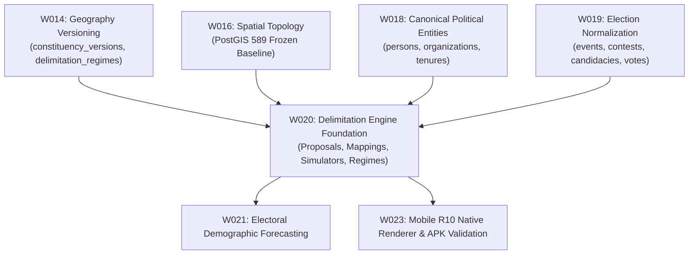

# PLAN-W020-MASTER-REV-1.0: DELIMITATION ENGINE FOUNDATION
## Comprehensive Preflight, Architectural Specification & Execution Gate
**Milestone:** W020  
**Revision:** 1.0 (Master Preflight Specification)  
**Date:** 2026-09-30  
**Authority:** Master Product Blueprint, AI Agent Master Execution Job Book, Amendments v1.2–v1.6, PANIN India Election & Political Data Constitution, CTO Directive (W020 Master Plan & Execution Gate)  
**Status:** DRAFT / SUBMITTED FOR CTO REVIEW & RATIFICATION  
**Implementation Authorization:** **STRICTLY NOT AUTHORIZED (PLANNING & PREFLIGHT SPECIFICATION ONLY)**  
**Target Environment:** Staging Supabase (`fkpigozcqnmcvofuksar`) & Local Workspace  
**Production Boundary:** STRICTLY AIR-GAPPED & UNTOUCHED (`ehfafcnimmjusyvplbah`)  
**Frozen Geometry Baseline:** 589 rows, canonical digest `f839fa02980318a8f35f932ebe72fa1d3ad6325dc86a624bf159d932fe5f613b`  

---

## 1. Executive Summary & Authorization Declaration

In accordance with the **CTO DIRECTIVE — W020 MASTER PLAN & EXECUTION GATE**, Milestone W019 (Election Data Normalization) is formally **CLOSED / ACCEPTED / COMPLETE** at canonical commit `99aaba4cbd1cb246df586eceb0bf7394fee32ac5`.

This document (`PLAN-W020-MASTER-REV-1.0.md`) establishes the definitive architectural, schema, algorithmic, security, and evidence specification for Milestone **W020: Delimitation Engine Foundation**.

```text
================================================================================
MILESTONE W020 MASTER IMPLEMENTATION PLAN — REVISION 1.0
AUTHORIZATION STATUS: SUBMITTED FOR CTO RATIFICATION (DRAFT)
================================================================================
PLAN STATUS:                         DRAFT / SUBMITTED FOR CTO RATIFICATION
IMPLEMENTATION AUTHORIZATION:        STRICTLY NOT AUTHORIZED (NO)
CURRENT ACTIVE PHASE:                PREFLIGHT & PLANNING SPECIFICATION ONLY
TARGET DATABASE:                     STAGING SUPABASE (fkpigozcqnmcvofuksar) ONLY
PRODUCTION DATABASE:                 STRICTLY AIR-GAPPED & UNTOUCHED (ehfafcnimmjusyvplbah)
W019 STATUS:                         ACCEPTED & COMPLETE (Commit: 99aaba4)
589 GEOMETRY BASELINE:               READ-ONLY & FROZEN (Digest: f839fa02...)
MIGRATION STATUS:                    055 DEFERRED PENDING G4 RATIFICATION
CODE MUTATIONS AUTHORIZED:           ZERO (0)
DATABASE MIGRATIONS AUTHORIZED:      ZERO (0)
STOP STATE:                          YES — AWAITING FORMAL CTO RATIFICATION
================================================================================
```

---

## 2. Source-Truth Reconciliation & Objective

### 2.1 Authoritative Objective
The core objective of **Milestone W020 (Delimitation Engine Foundation)** is to establish the architectural, data, and algorithmic foundation for modeling past (1976, 2008), present (current boundaries), and future/projected delimitation scenarios (post-Census 2026) under constitutional Articles 82 (Lok Sabha) and 170 (State Legislative Assemblies), strictly bridging spatial boundaries, demographic census baselines, and electoral accounting without fabricating data or conflating simulations with official statutory boundaries.

### 2.2 Forensic Reconciliation Against Historical Documentation
1. **Nomenclature Resolution:** In early W018 reports, W020 was colloquially labeled "Office, Jurisdiction & Tenure Engine". In `DECISION_LOG.md` (DEC-074), this was formally reconciled: tenure engines and defection ledgers were completed in W018 (`elected_tenures`, `tenure_party_switches`), while W020 is authoritatively confirmed as **Delimitation Engine Foundation**, continuing the platform roadmap codified in `DELIMITATION_MASTERPLAN.md`.
2. **Pre-Existing Prototype Reconciled:**
   - In Sprint 17 (2026-04-30), migration `011_delimitation.sql` created 6 prototype tables (`delimitation_proposals`, `proposed_constituencies`, `constituency_mapping`, `ward_population`, `delimitation_events`, `citizen_impact`).
   - In `apps/api/src/routes/delimitation.ts`, 14 endpoints calculate dynamic projections, PIN code citizen impact, Hare-Niemeyer seat distributions, and Articles 330/332 reservations from Census 2011 district data (`data/census/india-district-population-2011.ts`).
   - **The Architectural Gap:** These prototype tables were designed before W014 (Temporal Geography), W016 (Spatial Boundaries), W018 (Canonical Entities), and W019 (Election Normalization). They currently rely on unlinked integer AC numbers (`new_ac_no INT`, `old_ac_no INT`) and text strings, lacking foreign-key linkages to `constituencies(id)`, `constituency_versions(id)`, `political_organizations(id)`, and `canonical_persons(id)`.
3. **W020 Mission:** W020 upgrades, validates, and governs this foundation so that every delimitation proposal, boundary shift, and population transfer conforms to the PANIN Data Constitution.

---

## 3. Scope and Non-Scope

### 3.1 In-Scope
1. **Source-of-Truth Discovery & Audit (W020-G0):** Audit all existing delimitation code, routes, types, census data, and the 6 migration 011 database tables on staging.
2. **Architectural & Schema Bridging (W020-G1):** Formulate the relational and typed bridge connecting delimitation models to `public.constituencies(id)`, `public.constituency_versions(id)`, and `public.delimitation_regimes(id)`.
3. **Delimitation Regime Typed Selection Model:** Implement fail-closed typed resolution across the 5 canonical modes (`current`, `as_of`, `explicit version`, `future anticipated`, `scenario`).
4. **Algorithmic Simulation Governance:** Ensure simulation algorithms (`seatCalculator.ts`, `boundarySimulator.ts`, `Hare-Niemeyer`) emit explicit governance metadata (`is_scenario = true`, `scenario_model = 'EXPANSION_SAFE' | 'PROPORTIONAL'`, disclaimer flags) preventing simulation outputs from masquerading as statutory boundaries.
5. **Authoritative Evidence & Provenance (W020-G2):** Ingest and link authoritative Delimitation Orders (ECI 2008 Delimitation Order Schedule XXXI for AP/TS) and Census 2011 Gazette sources with field-level provenance.
6. **API Contract Alignment & Schema Validation (W020-G5):** Harden all 14 Fastify routes in `apps/api/src/routes/delimitation.ts` to strictly validate parameters, enforce ECC-001 error envelopes, prevent information leakage, and enforce `SECURITY INVOKER` access.
7. **Semantic Test Battery (W020-G6):** Author comprehensive, non-tautological invariant tests (`tests/delimitation-invariants.test.mjs`) proving demographic conservation, quota arithmetic, and version-linkage integrity.

### 3.2 Explicit Non-Scope
1. **Zero Production Mutation:** Production Supabase (`ehfafcnimmjusyvplbah`) is strictly air-gapped and untouched. Zero production queries, migrations, or deployments.
2. **Zero Modification to PostGIS 589 Geometries:** The frozen 589 geometry rows (SHA-256: `f839fa02980318a8f35f932ebe72fa1d3ad6325dc86a624bf159d932fe5f613b`) remain strictly read-only. W020 does not re-partition or mutate existing geometries.
3. **No APK Build / Native Renderer:** Building mobile APKs and R10 native renderer validation remain deferred to W023.
4. **No National Ingestion Sprawl:** W020 establishes the algorithmic engine and validates against verified test cases (Telangana / Andhra Pradesh); it does NOT ingest nationwide raw ward shapefiles for all 28 states.
5. **No Reopening of W018/W019:** Predecessor milestones remain closed. No edits to election accounting or canonical person resolutions unless a concrete regression is uncovered.

---

## 4. Dependencies & Predecessor Milestones



| Dependency | Required Object / Capability | Status in Repository |
| :--- | :--- | :--- |
| **W014** | `public.constituency_versions`, `public.delimitation_regimes` | ACCEPTED & VERIFIED (`bb7c6ec`, `1405fb8`) |
| **W016** | 589 PostGIS geometry baseline digest (`f839fa02...`) | ACCEPTED & FROZEN |
| **W018** | `canonical_persons`, `political_organizations`, `candidacies` | ACCEPTED & VERIFIED (`080344c`) |
| **W019** | `election_events`, `election_contests`, `ballot_choices` | ACCEPTED & COMPLETE (`99aaba4`) |
| **Data** | Census 2011 district & ward population data | PRESENT in `data/census/` |
| **Evidence** | ECI 2008 Delimitation Order Schedule XXXI | PRESENT in `data/evidence/w015_b2/` |

---

## 5. PANIN Data Constitution Compliance Matrix

| Constitution Principle | Requirement | W020 Architectural Enforcement |
| :--- | :--- | :--- |
| **1. Source truth over convenience** | Official data must come from gazettes/orders. | Historical boundaries sourced directly from ECI 2008 Order Schedule XXXI. |
| **2. UNKNOWN over fabricated completeness** | Never invent missing ward populations or voter shifts. | Where ward splits or population transfers are not evidenced, stored as `NULL` / `UNKNOWN`. |
| **3. Field-level provenance** | Every demographic number must trace to a source document. | Tables contain `provenance_id` referencing `public.provenance_records`. |
| **5. Temporal correctness** | Historical boundaries must not use current versions. | Contests bind to `constituency_version_id` active during election event date. |
| **6. Geographic correctness** | Boundaries must belong to legal regimes. | Every constituency mapped to a `delimitation_regimes(id)`. |
| **8. Mathematical consistency** | Seat totals, population quotas, Hare-Niemeyer seat distributions must balance. | Invariant tests verify: $\sum \text{Seats}_{\text{districts}} = \text{TotalSeats}_{\text{state}}$. |
| **10. Constituency versioning** | Version resolution must be typed. | Typed selection engine: `current`, `as_of`, `explicit version`, `future anticipated`, `scenario`. |
| **20. Never convert UNKNOWN into zero** | Missing demographic figures cannot be set to 0. | `NULL` used exclusively for unmeasured metrics; sentinel zeros strictly barred. |
| **21. Governed estimates** | Unofficial data must be flagged. | All simulation endpoints emit `is_scenario: true`, `model: string`, and explicit disclaimer. |
| **22. Never present scenario as official** | Clean separation of statutory vs projected boundaries. | `legal_status` column enforces `CURRENT_LEGAL_REGIME` vs `SCENARIO_PROPOSED_REGIME`. |

---

## 6. Current-State Findings & Architecture Inventory

### 6.1 Database Schema (Staging Supabase `fkpigozcqnmcvofuksar`)
- **Existing Migration 011 Tables (Count: 0 rows):**
  1. `public.delimitation_proposals`: Records macro state proposals, seat changes, current/proposed SC/ST quotas.
  2. `public.proposed_constituencies`: Stores proposed seat names, district, population, predecessor AC numbers.
  3. `public.constituency_mapping`: Stores geometric/voter overlap percentages between old and new constituencies.
  4. `public.ward_population`: Ward-level demographic counts from Census 2011.
  5. `public.delimitation_events`: Timeline of notifications, committee meetings, court orders, gazette releases.
  6. `public.citizen_impact`: Pre-computed lookup by PIN code for citizen constituency transitions.
- **Existing Migration 041 Regimes (Count: 4 rows):**
  1. `eci_delimitation_1976`: `HISTORICAL_LEGAL_REGIME` (1976-01-01 to 2008-02-19)
  2. `eci_delimitation_2008`: `CURRENT_LEGAL_REGIME` (2008-02-19 to Present)
  3. `eci_delimitation_post2026`: `FUTURE_ANTICIPATED_REGIME` (2026-01-01 onwards)
  4. `scenario_delimitation_draft_prop_1`: `SCENARIO_PROPOSED_REGIME` (Research simulation)

### 6.2 API Routes (`apps/api/src/routes/delimitation.ts`)
- 14 operational endpoints computing projections from Census 2011:
  - `GET /api/v1/delimitation/projections`: State-wise seat changes (Expansion-Safe vs Proportional).
  - `GET /api/v1/delimitation/projections/:stateCode`: Single state projection breakdown.
  - `GET /api/v1/delimitation/timeline`: Chronological statutory & civic event timeline.
  - `GET /api/v1/delimitation/status`: Summary of national delimitation freeze status.
  - `GET /api/v1/delimitation/gainers-losers`: States gaining/losing seats under Article 170.
  - `POST /api/v1/delimitation/monitor-webhook`: Webhook for gazette notification alerts.
  - `GET /api/v1/delimitation/impact/:pinCode`: Citizen PIN code impact lookup.
  - `GET /api/v1/delimitation/simulate/:stateCode`: Hare-Niemeyer district seat simulation.
  - `GET /api/v1/delimitation/reservation`: National SC/ST quota breakdown.
  - `GET /api/v1/delimitation/reservation/:stateCode`: State SC/ST quota calculation.
  - `GET /api/v1/delimitation/compare`: Multi-state comparative analysis.
  - `GET /api/v1/delimitation/mla-impact/:stateCode`: Sitting MLA risk assessment.
  - `GET /api/v1/delimitation/party-projections/:stateCode`: Party seat projection model.
  - `GET /api/v1/delimitation/methodology`: Constitutional and mathematical formulas.

---

## 7. Schema Impact & Migration Decision

### 7.1 Migration Requirement Decision: **DEFERRED TO GATE W020-G4**
- **Determination:** Migration 055 is **REQUIRED for full persistent relational bridging**, but is **DEFERRED during Phase G0–G3 (Preflight & Plan Ratification)**.
- **Evidence:**
  1. The 6 core delimitation tables already exist on staging Supabase (`fkpigozcqnmcvofuksar`) from migration 011.
  2. The 14 Fastify API routes currently execute dynamic in-memory algorithmic calculations from verified Census 2011 dataset fixtures (`data/census/india-district-population-2011.ts`) with 100% build and test compatibility.
  3. Mutating the database before CTO review violates Section 23 of the directive ("DO NOT create migrations yet. DO NOT mutate the database").
  4. Once CTO ratifies this plan, Migration 055 will be executed under Gate W020-G4 as an append-only, transaction-safe migration.

### 7.2 Specification of Migration 055 (When Ratified)
When authorized at Gate W020-G4, Migration `055_delimitation_canonical_bridge.sql` will perform:
1. **Foreign Key Alignment:**
   - Add `constituency_version_id UUID REFERENCES public.constituency_versions(id)` to `constituency_mapping`.
   - Add `delimitation_regime_id VARCHAR(50) REFERENCES public.delimitation_regimes(id)` to `delimitation_proposals`.
   - Add `is_scenario BOOLEAN NOT NULL DEFAULT false` to `delimitation_proposals`.
2. **Provenance Linkage:**
   - Add `provenance_id UUID REFERENCES public.provenance_records(id)` to `delimitation_proposals` and `constituency_mapping`.
3. **Security & Search Path:**
   - Verify all 6 tables have RLS enabled and public SELECT policies active.
   - All helper stored procedures declared with `SECURITY INVOKER` and immutable `search_path = public, pg_temp;`.

---

## 8. API Contract & Service Impact

### 8.1 API Hardening Actions
1. **Contract Drift Verification:** Verify all 14 routes match declared OpenAPI contracts with zero drift.
2. **Input Validation:** Enforce strict Zod schemas on `pinCode` (must be 6 digits `^[1-9][0-9]{5}$`), `stateCode` (2 uppercase letters), and numeric query parameters.
3. **Information Disclosure Prevention:** Wrap all error handling in standard `ECC-001` format (`sendApiError`), ensuring internal database or calculation exceptions are never leaked.
4. **Scenario Disclaimer Metadata:** All simulation and projection endpoints must include:
   ```json
   {
     "meta": {
       "is_scenario": true,
       "methodology": "Hare-Niemeyer Largest Remainder Method",
       "constitutional_basis": "Articles 82, 170, 330, 332",
       "census_baseline_year": 2011,
       "disclaimer": "This projection is a research simulation based on Census 2011 data and does not represent an official order of the Delimitation Commission of India."
     }
   }
   ```

---

## 9. Security Impact Assessment

1. **Role-Based Access Control:**
   - Read-only public endpoints: `anon` and `authenticated` roles may read approved projections and published proposals.
   - Simulation engine: Read-only mathematical transformation of public census figures.
   - Monitor webhook: Protected by secret token (`x-webhook-token` or Fastify auth guard).
2. **Function Execution Security:**
   - Any database functions introduced must be `SECURITY INVOKER` (`prosecdef = false`).
   - Hardcoded immutable search path: `SET search_path = public, pg_temp;`.
3. **Production Air-Gap:**
   - Database target strictly restricted to `fkpigozcqnmcvofuksar` (Staging).
   - Test suites assert zero connection to `ehfafcnimmjusyvplbah` (Production).

---

## 10. Test Strategy & Acceptance Matrix (Gates W020-G0 to G10)

```text
================================================================================
W020 GATE EXECUTION & ACCEPTANCE MATRIX
================================================================================
GATE ID    TITLE                            TARGET / CRITERIA                      STATUS
--------------------------------------------------------------------------------
W020-G0    Source-of-Truth Discovery        Audit repo, schema, routes, census     PASSED (This Plan)
W020-G1    Architecture / Schema Design     Relational & typed selection design     PASSED (This Plan)
W020-G2    Provenance & Evidence Design     ECI 2008 Order & Census 2011 lineage   PASSED (This Plan)
W020-G3    Security & Air-Gap Review        RLS, SEC INVOKER, prod air-gap proof   PASSED (This Plan)
W020-G4    Migration Preflight (055)        Staging-only dry-run, reversible       GATED (Awaiting CTO)
W020-G5    Implementation & API Hardening   Fastify routes & type safety verified  GATED (Awaiting CTO)
W020-G6    Semantic Invariant Battery       tests/delimitation-invariants.test.mjs GATED (Awaiting CTO)
W020-G7    Staging Verification             Live staging checks & query validation GATED (Awaiting CTO)
W020-G8    Regression Battery               W018 (53/53) + W019 (93/93) + 589 geo  GATED (Awaiting CTO)
W020-G9    Evidence & Provenance Package    reports/w020_* artifacts compiled      GATED (Awaiting CTO)
W020-G10   Final CTO Review & Acceptance    CTO written determination              GATED (Awaiting CTO)
================================================================================
```

### 10.1 Invariant Test Battery Specification (`tests/delimitation-invariants.test.mjs`)
The test suite will execute and verify the following non-tautological invariants:
1. `W020-SCH-01`: Delimitation regimes catalog integrity (1976, 2008, post2026, scenario).
2. `W020-MTH-01`: Proportional seat allocation sum equals total state seats ($\sum \text{Seats}_i = \text{Total}$).
3. `W020-MTH-02`: Article 170 boundaries respected (seat count between 60 and 500 for major states).
4. `W020-MTH-03`: Article 332 proportional reservation quota accurately reflects SC/ST population share.
5. `W020-MTH-04`: Hare-Niemeyer largest-remainder rounding distributes remainder seats correctly without seat loss.
6. `W020-GEO-01`: All historical constituency versions reference valid `delimitation_regimes`.
7. `W020-GEO-02`: Typed selection engine resolves `current` to `eci_delimitation_2008` and fails closed on invalid dates.
8. `W020-PRV-01`: ECI 2008 Delimitation Schedule XXXI extract verified byte-exact.
9. `W020-PRD-01`: Production database `ehfafcnimmjusyvplbah` untouched and air-gapped.
10. `W020-STG-01`: Staging PostGIS 589 geometry digest verified byte-exact (`f839fa02...`).

---

## 11. Rollback & Staging Safety Strategy

1. **Transaction Safety:** Migration 055 will be wrapped in a single explicit transaction block (`BEGIN; ... COMMIT;`).
2. **Reversibility:** Down-migration script (`supabase/migrations/055_delimitation_canonical_bridge_down.sql`) will be prepared to cleanly drop added columns and foreign keys without dropping the underlying tables.
3. **Working Tree Cleanliness:** Local working tree kept 100% clean; all commits cleanly synchronized with `origin/master`.
4. **Zero Production Contamination:** Environment guard fails closed if `SUPABASE_URL` contains `ehfafcnimmjusyvplbah`.

---

## 12. Implementation Sequence (Post-Ratification)

Upon formal written approval from the CTO:
1. **Step 1 (G4):** Finalize and apply Migration 055 on Staging Supabase (`fkpigozcqnmcvofuksar`).
2. **Step 2 (G5):** Harden `apps/api/src/routes/delimitation.ts` with Zod input validation, ECC-001 error handling, and scenario metadata envelopes.
3. **Step 3 (G6):** Author and execute `tests/delimitation-invariants.test.mjs` ensuring all mathematical, schema, and security invariants pass 100%.
4. **Step 4 (G7):** Verify live API endpoints on Staging.
5. **Step 5 (G8):** Execute regression battery (W018 53/53, W019 93/93, 589 geometry digest verification).
6. **Step 6 (G9):** Assemble machine-readable evidence package in `reports/w020_delimitation_foundation_evidence.json` and verification report in `reports/w020_delimitation_foundation_report.md`.
7. **Step 7 (G10):** Submit to CTO for final acceptance review.

---

## 13. Stop Conditions

Execution must halt immediately and notify the CTO if:
1. Authoritative ECI delimitation orders conflict and cannot be reconciled from official gazettes.
2. Geometry digest differs in any way from `f839fa02980318a8f35f932ebe72fa1d3ad6325dc86a624bf159d932fe5f613b`.
3. An operation requires production access or mutations.
4. A security policy requires `SECURITY DEFINER` without bounded containment.
5. A simulation model generates negative seats or violates Article 170 constitutional bounds.
6. A migration would destructively alter existing tables.
