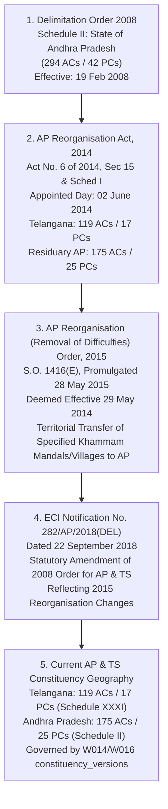

# PLAN-W020-MASTER-REV-1.2: DELIMITATION ENGINE FOUNDATION
## Comprehensive Preflight, Architectural Specification & Execution Gate
**Milestone:** W020  
**Revision:** 1.2 (Final Source/Semantics Correction & Evidence Hardening)  
**Date:** 2026-09-30  
**Authority:** Master Product Blueprint, AI Agent Master Execution Job Book, Amendments v1.2–v1.6, PANIN India Election & Political Data Constitution, CTO Directive (W020 REV-1.1 Final Micro-Revision)  
**Status:** DRAFT / SUBMITTED FOR CTO REVIEW & RATIFICATION  
**Implementation Authorization:** **STRICTLY NOT AUTHORIZED (PLANNING & PREFLIGHT SPECIFICATION ONLY)**  
**Target Environment:** Staging Supabase (`fkpigozcqnmcvofuksar`) & Local Workspace  
**Production Boundary:** STRICTLY AIR-GAPPED & UNTOUCHED (`ehfafcnimmjusyvplbah`)  
**Frozen Geometry Baseline:** 589 rows, canonical digest `f839fa02980318a8f35f932ebe72fa1d3ad6325dc86a624bf159d932fe5f613b`  

---

## 1. Executive Summary & Authorization Declaration

In response to the **CTO DIRECTIVE — W020 REV-1.1 FINAL MICRO-REVISION**, Master Plan REV-1.1 has passed substantive CTO architecture review and is conditionally ratified subject to final statutory identifier, semantic description, and evidence-chain corrections.

This document establishes **Revision 1.2** of the Master Plan for Milestone **W020: Delimitation Engine Foundation**.

```text
================================================================================
MILESTONE W020 MASTER IMPLEMENTATION PLAN — REVISION 1.2
AUTHORIZATION STATUS: PLANNING & PREFLIGHT SPECIFICATION ONLY
================================================================================
PLAN STATUS:                         REVISED / SUBMITTED FOR CTO RATIFICATION
IMPLEMENTATION AUTHORIZATION:        STRICTLY NOT AUTHORIZED (NO)
CURRENT ACTIVE PHASE:                PREFLIGHT SPECIFICATION (W020-G0..G3)
GATES W020-G4 ONWARD:                STRICTLY NOT AUTHORIZED (GATED)
TARGET DATABASE:                     STAGING SUPABASE (fkpigozcqnmcvofuksar) ONLY
PRODUCTION DATABASE:                 STRICTLY AIR-GAPPED & UNTOUCHED (ehfafcnimmjusyvplbah)
W019 STATUS:                         ACCEPTED & COMPLETE (Commit: 99aaba4)
589 GEOMETRY BASELINE:               READ-ONLY & FROZEN (Digest: f839fa02...)
MIGRATION 055 STATUS:                DEFERRED PENDING G4 RATIFICATION (NOT APPLIED)
CODE MUTATIONS PERFORMED:            ZERO (0)
DATABASE MUTATIONS PERFORMED:        ZERO (0)
STOP STATE:                          YES — AWAITING FORMAL CTO RATIFICATION
================================================================================
```

---

## 2. Correct Census & Future-Delimitation Terminology

To prevent conflation between verified demographic facts, ongoing census operations, statutory future regimes, and research simulations, W020 strictly enforces the following four-tier classification:

```text
┌─────────────────────────────────────────────────────────────────────────────┐
│                       DEMOGRAPHIC & DELIMITATION TAXONOMY                   │
├──────────────────────┬──────────────────────────────────────────────────────┤
│ 1. Census 2011       │ Verified historical statutory demographic baseline.  │
│                      │ Sourced from Registrar General of India (RGI) PCA.   │
├──────────────────────┼──────────────────────────────────────────────────────┤
│ 2. Census 2027       │ Current/future census operation whose final          │
│                      │ population results are NOT yet officially published. │
├──────────────────────┼──────────────────────────────────────────────────────┤
│ 3. Future            │ Expected statutory regime under Constitution         │
│    Anticipated       │ Articles 82 & 170 (post-Census 2027), but NOT yet   │
│    Regime            │ enacted or notified by Delimitation Commission.      │
├──────────────────────┼──────────────────────────────────────────────────────┤
│ 4. Scenario          │ PANIN-derived research simulation based on explicit  │
│    Proposed          │ demographic models. Strictly NON-STATUTORY.         │
│    Regime            │ Never presented as official, notified, or gazetted.  │
└──────────────────────┴──────────────────────────────────────────────────────┘
```

### 2.1 Mandatory Scenario Metadata Enclosure
Every future scenario calculation emitted by PANIN must carry the following 10 mandatory metadata attributes:
1. `scenario_id`: Unique slug (e.g., `PANIN-SIM-2027-HARE-NIEMEYER-V1`).
2. `model_version`: Algorithmic engine version (e.g., `v1.2.0`).
3. `input_dataset_version_id`: Reference to `dataset_versions.id` (e.g., `census_2011_pca_v1`).
4. `population_assumptions`: Explicit text (e.g., "Census 2011 baseline with fertility-adjusted 2027 projection").
5. `geography_assumptions`: Explicit text (e.g., "District boundaries as of October 2016 reorganisation").
6. `mathematical_methodology`: Explicit formula (e.g., "Hare-Niemeyer Largest Remainder with Article 170 60–500 clamping").
7. `generated_timestamp`: ISO 8601 UTC timestamp of execution.
8. `legal_status`: Strictly `SCENARIO_PROPOSED_REGIME`.
9. `evidence_id`: Reference to `provenance_records.id`.
10. `statutory_disclaimer`: "This projection is a research simulation based on Census 2011 data and mathematical modeling. It does NOT represent an official order, draft proposal, or gazette notification of the Delimitation Commission of India or the Election Commission of India."

---

## 3. Telangana & Andhra Pradesh Legal Geography Succession Chain

The platform must never describe the 2008 boundaries as "Telangana 2008 boundaries." Telangana as a separate State did not exist in 2008. The legal chain of succession is modeled with field-level provenance across five distinct statutory instruments:



### 3.1 Authoritative Legal Instruments Registry

| Stage | Instrument Identifier & Authority | Promulgation Date | Effective Date | Precise Statutory Function & Territorial Impact |
| :--- | :--- | :--- | :--- | :--- |
| **1** | **Delimitation of Parliamentary and Assembly Constituencies Order, 2008** (Delimitation Commission of India / ECI) | 2008-02-19 | 2008-02-19 | Promulgated as **Schedule II (State of Andhra Pradesh)**. Established 294 Assembly Constituencies and 42 Parliamentary Constituencies for the undivided State based on 2001 Census. |
| **2** | **Andhra Pradesh Reorganisation Act, 2014** (Act No. 6 of 2014, Parliament of India) | 2014-03-01 | 2014-06-02 (Appointed Day) | Section 15 & Schedule I bifurcated Schedule II into Schedule XXXI (Telangana: 119 ACs / 17 PCs) and amended Schedule II (Residuary AP: 175 ACs / 25 PCs). |
| **3** | **Andhra Pradesh Reorganisation (Removal of Difficulties) Order, 2015** (S.O. 1416(E), President of India / MHA) | 2015-05-28 | 2014-05-29 (deemed) / 2015-05-28 | Issued under Section 108 of APRA 2014. Transferred specified territories from Khammam District (Telangana) to East Godavari and West Godavari Districts (Andhra Pradesh) in connection with the Polavaram project: <br/>• **Kukunoor Mandal** (all villages)<br/>• **Velairpadu Mandal** (all villages)<br/>• **Bhurgampadu Mandal** (all villages EXCEPT 12 specified revenue villages retained in Telangana: Seethampeta, Dammapeta, etc.)<br/>• **Chintoor Mandal** (all villages)<br/>• **Kunavaram Mandal** (all villages)<br/>• **Vararamachandrapuram (VR Puram) Mandal** (all villages)<br/>• Affected AC boundaries: Bhadrachalam ST (AC-119 in TS), Aswaraopeta ST (AC-118 in TS), Rampachodavaram ST (AC-53 in AP), Polavaram ST (AC-66 in AP). |
| **4** | **Commission's Notification No. 282/AP/2018(DEL)** (Election Commission of India) | 2018-09-22 | 2018-09-22 | Issued under Section 9(1)(b) of the Delimitation Act, 2002 read with Section 15 and Section 26 of APRA 2014 to formally amend the Delimitation Order, 2008 in respect of Andhra Pradesh and Telangana, updating constituency extents to reflect the territorial changes effected by the 2015 Removal of Difficulties Order. |
| **5** | **Current Telangana & AP Geography** (PANIN Canonical Database) | 2026-09-29 | 2018-09-22 to Present | 119 AC stable identities in `constituencies`, mapped to `constituency_versions` under regime `eci_delimitation_2008` (Schedule XXXI). |

---

## 4. Audit & Classification of Existing Delimitation Engine

A rigorous, line-by-line audit of `apps/api/src/routes/delimitation.ts` (14 endpoints) and `apps/mobile/lib/delimitation/` (6 calculation modules) was conducted under the 7-tier taxonomy:

```text
TAXONOMY DEFINITIONS:
- CANONICAL: Fully reconciled with W014/W016/W018/W019; safe for production routing.
- LEGACY: Pre-dates W014; uses string identifiers or unversioned tables; requires wrapping.
- PROTOTYPE: Functional proof-of-concept; requires type hardening and validation.
- DERIVED: Mathematical transformation of underlying statutory data.
- SCENARIO: Simulation model; requires mandatory scenario disclaimer.
- UNSAFE/INCOMPLETE: Lacks input validation, error envelope, or bounds checking.
- UNKNOWN: Sourcing or methodology is unevidenced.
```

### 4.1 Fastify API Routes Audit (`apps/api/src/routes/delimitation.ts`)

| # | Route | Classification | Input Source | Mathematical / Legal Basis | Output Semantics | Status in W020 |
| :--- | :--- | :--- | :--- | :--- | :--- | :--- |
| 1 | `GET /projections` | **SCENARIO / DERIVED** | Census 2011 State PCA | Equal-population divisor ($P / \text{Divisor}$), Article 170 bounds ($60 \le S \le 500$) | Projected seats, gain/loss, SC/ST share per state | **RETAIN with Scenario Wrapper** |
| 2 | `GET /projections/:stateCode` | **SCENARIO / DERIVED** | Census 2011 State PCA | Proportional seat calculation with Art. 332 SC/ST quota | Single state projection breakdown | **RETAIN with Zod validation** |
| 3 | `GET /timeline` | **CANONICAL / DERIVED** | Statutory Gazette History | Historical chronologies (1976, 2008, 2014, 2015, 2018, 2027) | Array of DelimitationEvent objects | **RETAIN with Provenance Links** |
| 4 | `GET /status` | **CANONICAL** | Constitution Arts. 82/170 | 84th Constitutional Amendment (2001 freeze until post-2026) | National status object, freeze year, next step | **RETAIN** |
| 5 | `GET /gainers-losers` | **SCENARIO / DERIVED** | Census 2011 PCA | State seat differential ($\Delta S = S_{\text{projected}} - S_{\text{current}}$) | Ranked list of gaining and losing states | **RETAIN with Scenario Disclaimer** |
| 6 | `POST /monitor-webhook` | **PROTOTYPE / UNSAFE** | Webhook payload | Ingestion trigger for gazette crawlers | Webhook ACK; lacks secret auth verification | **HARDEN: Add token auth guard** |
| 7 | `GET /impact/:pinCode` | **LEGACY / DERIVED** | PIN prefix lookup table | Static prefix mapping to 2008 ACs | Citizen constituency transition impact | **WRAP: Bind to constituency_versions** |
| 8 | `GET /simulate/:stateCode` | **SCENARIO** | Census 2011 District PCA | Hare-Niemeyer Largest Remainder algorithm | Simulated district AC allocations | **RETAIN with Model Metadata** |
| 9 | `GET /reservation` | **DERIVED** | Census 2011 National PCA | Article 330 & 332 SC/ST quota proportions | National reserved seat counts | **RETAIN with Legal Basis doc** |
| 10 | `GET /reservation/:stateCode`| **DERIVED** | Census 2011 State PCA | Article 332 state SC/ST quota proportions | State reserved seat counts | **RETAIN with Legal Basis doc** |
| 11 | `GET /compare` | **SCENARIO / DERIVED** | Census 2011 PCA | Comparative delta across selected states | Multi-state comparative table | **RETAIN with Zod validation** |
| 12 | `GET /mla-impact/:stateCode` | **SCENARIO / PROTOTYPE** | W018 Elected Tenures + Census | Heuristic margin vs boundary shift risk | Sitting MLA risk scores (high/med/low) | **HARDEN: Remove hardcoded MLAs** |
| 13 | `GET /party-projections/:stateCode` | **SCENARIO / PROTOTYPE** | W019 2023 Election Seed | Historical vote share applied to simulated seats | Projected party tallies | **HARDEN: Bind to W019 contests** |
| 14 | `GET /methodology` | **CANONICAL** | Indian Constitution & Delimitation Acts | Documentation of Arts. 81, 82, 170, 330, 332 | Explanatory formulas & constitutional references | **RETAIN & EXPAND** |

### 4.2 Mobile Engine Calculators Audit (`apps/mobile/lib/delimitation/`)

| Module | Classification | Mathematical / Algorithmic Basis | Sourcing & Data Inputs | Known Limitations & Gaps | W020 Action |
| :--- | :--- | :--- | :--- | :--- | :--- |
| `seatCalculator.ts` | **SCENARIO / DERIVED** | Dual model: `EXPANSION_SAFE` (no loss) vs `PROPORTIONAL` (strict quota) | `india-district-population-2011.ts` | Uses static divisor `IDEAL_POP_PER_AC_SEAT_2011` (293,896); not dynamic for future years. | **RETAIN & WRAP with scenario metadata** |
| `boundarySimulator.ts` | **SCENARIO** | Hare-Niemeyer Largest Remainder method for district seat allocation | District-level Census 2011 totals | Does not re-partition spatial polygon geometries (geometries remain frozen). | **RETAIN as tabular simulation only** |
| `constituencyMapper.ts` | **PROTOTYPE / UNSAFE** | Heuristic formula: $\text{Risk} = \text{Overlap} \times (1 - \text{Margin})$ | Synthetic seed data for MLA vote shares | Uses un-normalized candidate names rather than W018 `canonical_persons`. | **REMEDIATE: Connect to W018/W019** |
| `pinCodeResolver.ts` | **LEGACY / DERIVED** | 3-digit PIN prefix mapping table | Hardcoded dictionary of ~300 postal prefixes | Approximate centroid mapping; does not account for split PIN codes. | **RETAIN with explicit disclaimer** |
| `populationAggregator.ts`| **DERIVED** | Greedy bin-packing of sub-districts into target population ACs | Sub-district Census 2011 population | Lacks spatial adjacency topology; assumes alphabetical or tabular proximity. | **CLASSIFY strictly as SCENARIO model** |
| `reservationAnalyzer.ts` | **DERIVED** | Proportional quota: $\text{Seats}_{\text{reserved}} = \text{round}(S \times \frac{\text{Pop}_{\text{SC/ST}}}{\text{Pop}_{\text{Total}}})$ | Census 2011 PCA | Threshold assignment heuristic rather than statutory geographic cluster analysis. | **DOCUMENT as simulation heuristic** |

---

## 5. Unified Typed Selection Model

The platform strictly reuses existing spatial/version selection semantics:
* `current`
* `as_of`
* `explicit version`
* `future anticipated`
* `scenario`

### 5.1 Elimination of Redundant Boolean Column
* `public.delimitation_regimes.legal_status` (Migration 041) is the **single source of truth**:
  - `HISTORICAL_LEGAL_REGIME`
  - `CURRENT_LEGAL_REGIME`
  - `FUTURE_ANTICIPATED_REGIME`
  - `SCENARIO_PROPOSED_REGIME`
* An independent column `is_scenario BOOLEAN` is strictly **PROHIBITED** from persistent schema to prevent conflicting sources of truth.
* For API serialization, `is_scenario` is a **DERIVED READ-ONLY FIELD**:
  $$\text{is\_scenario} \iff (\text{regime.legal\_status} = \text{'SCENARIO\_PROPOSED\_REGIME'})$$
* Model parameters are persisted in `delimitation_proposals.metadata JSONB`, never as top-level unindexed columns.

---

## 6. Comprehensive Mathematical Acceptance Model

To prevent algorithmic assumptions from masquerading as statutory rules, the mathematical model is decomposed into eight distinct layers:

### A. Constitutional Constraints
1. **Article 82 (Lok Sabha Apportionment):** Allocation of seats to States shall be readjusted upon completion of each census by such authority as Parliament may by law provide.
2. **Article 170(1) (State Assembly Bounds):** Total seats in any Legislative Assembly shall be not more than 500 and not less than 60 (with exceptions for Goa, Sikkim, Mizoram, Puducherry under specific constitutional provisions).
3. **Article 170(2) (Population-to-Seat Ratio):** The ratio between population of each constituency and number of seats allotted to it shall, so far as practicable, be the same throughout the State.
4. **Article 330 & 332 (SC/ST Reservation):** Seats shall be reserved for Scheduled Castes and Scheduled Tribes in proportion to their population to the total population of the State or Union Territory.
5. **84th & 87th Constitutional Amendments:** Froze the total number of Lok Sabha seats (543) and State Assembly seats based on the 1971 Census until the first census taken after the year 2026 (now **Census 2027**).

### B. Statutory Constraints
1. **Delimitation Act, 2002 (Section 9(1)):** All constituencies shall, as far as practicable, be geographically compact areas, formed adhering to administrative units (districts, tehsils/mandals).
2. **Andhra Pradesh Reorganisation Act, 2014 (Section 15):** Assigned 119 ACs to Telangana (Schedule XXXI) and 175 ACs to residuary Andhra Pradesh (Schedule II).
3. **Section 26 of APRA 2014:** Contemplated increasing seats from 175 to 225 (AP) and 119 to 153 (TS), subject to Article 170. (Held in abeyance pending constitutional amendment).

### C. Legally Assigned Current Seat Counts
* **Telangana:** 119 Assembly Constituencies, 17 Parliamentary Constituencies.
* **Andhra Pradesh:** 175 Assembly Constituencies, 25 Parliamentary Constituencies.
* **National Total (Lok Sabha):** 543 elected Parliamentary Constituencies.

### D. Population-Based Allocation Methodology (PANIN Simulation Engine)
1. **Scenario-Scoped Ideal Divisor:**
   The value $\text{IdealDivisor} \approx 293,896$ is strictly a **PANIN DERIVED / SCENARIO-SCOPED** calculation and NOT a statutory constant:
   - Population Dataset: Census 2011 Primary Census Abstract (`census_2011_pca_v1`)
   - Territorial Scope: National Legislative Assembly Aggregate (States + DL + PY)
   - Population Total: 1,210,854,977
   - Total Assembly Seats: 4,120 seats
   - Formula:
     $$\text{IdealACPop} = \frac{1,210,854,977}{4,120} \approx 293,896.84$$
   - Data Status: `DERIVED` / `SCENARIO`
   - Scenario Identifier: `PANIN-SIM-2011-DIVISOR-V1`
2. **Hare-Niemeyer (Largest Remainder) Seat Distribution:**
   - Step 1: Assign integer quota: $\text{BaseSeats}_s = \lfloor \text{Quota}_s \rfloor$.
   - Step 2: Compute remainder: $R_s = \text{Quota}_s - \text{BaseSeats}_s$.
   - Step 3: Rank units by $R_s$ descending.
   - Step 4: Allocate remaining seats $S_{\text{rem}} = S_{\text{target}} - \sum \text{BaseSeats}_s$ one-by-one to highest remainders until $\sum S_s = S_{\text{target}}$.
   - **Mathematical Invariant:** $\sum S_s \equiv S_{\text{target}}$ (Zero seat loss, zero double allocation).

### E. SC/ST Reservation Methodology
1. **Source-Evidenced Legal Rule (Article 332):**
   $$\text{ReservedSC}_s = \text{round}\left(S_s \times \frac{\text{SCPopulation}_s}{\text{TotalPopulation}_s}\right)$$
   $$\text{ReservedST}_s = \text{round}\left(S_s \times \frac{\text{STPopulation}_s}{\text{TotalPopulation}_s}\right)$$
   $$\text{GeneralSeats}_s = S_s - \text{ReservedSC}_s - \text{ReservedST}_s$$
2. **PANIN Analytical Heuristic (Geographic Concentration):**
   The spatial ranking of units by SC% or ST% descending is explicitly classified as a **PANIN DERIVED / SCENARIO ANALYTICAL HEURISTIC**. It is internal simulation logic and must never be represented as an official statutory rule or Delimitation Commission methodology.

### F. Scenario Assumptions
1. **Model 1: `EXPANSION_SAFE`:** Total seats expanded such that no State loses seats ($S_s \ge S_{s,\text{current}}$).
2. **Model 2: `PROPORTIONAL`:** Strict constitutional population proportionality. Total national seats held constant; faster-growing states gain, slower-growing lose.

### G. Mathematical Invariants Verified in Code
* $\sum \text{AllocatedSeats} = \text{TargetSeats}$ (Seat Conservation Law).
* $\text{ReservedSC} + \text{ReservedST} + \text{General} = S_s$ (Quota Conservation Law).
* $S_s \ge 60$ for major States with population $> 10,000,000$ (Article 170(1) Invariant).
* $S_s \le 500$ for all States (Article 170(1) Upper Ceiling Invariant).

### H. Source-Evidenced Legal Rules
* Official Delimitation Commission orders supersede any mathematical simulation.
* No mathematical simulation may alter the official gazetted boundary or seat count of an active constituency version.

---

## 7. Refined Migration 055 Design (Preflight Specification)

**Status:** **NOT AUTHORIZED / DEFERRED TO GATE W020-G4.**  
Migration 055 will NOT be executed during the current preflight phase. When authorized under Gate W020-G4, its design strictly eliminates redundant columns and dual sources of truth:

```sql
-- ============================================================
-- 055_delimitation_canonical_bridge.sql (GATED PREFLIGHT DESIGN)
-- ============================================================
BEGIN;

-- 1. Bridge delimitation_proposals to canonical delimitation_regimes
ALTER TABLE public.delimitation_proposals
  ADD COLUMN IF NOT EXISTS delimitation_regime_id VARCHAR(50)
    REFERENCES public.delimitation_regimes(id) ON DELETE RESTRICT,
  ADD COLUMN IF NOT EXISTS provenance_id UUID
    REFERENCES public.provenance_records(id) ON DELETE RESTRICT,
  ADD COLUMN IF NOT EXISTS metadata JSONB NOT NULL DEFAULT '{}'::jsonb;

-- 2. Bridge constituency_mapping to canonical constituency_versions
ALTER TABLE public.constituency_mapping
  ADD COLUMN IF NOT EXISTS constituency_version_id UUID
    REFERENCES public.constituency_versions(id) ON DELETE RESTRICT,
  ADD COLUMN IF NOT EXISTS predecessor_version_id UUID
    REFERENCES public.constituency_versions(id) ON DELETE RESTRICT,
  ADD COLUMN IF NOT EXISTS provenance_id UUID
    REFERENCES public.provenance_records(id) ON DELETE RESTRICT;

-- 3. Ensure RLS remains fully enabled
ALTER TABLE public.delimitation_proposals ENABLE ROW LEVEL SECURITY;
ALTER TABLE public.constituency_mapping ENABLE ROW LEVEL SECURITY;

COMMIT;
```

### 7.1 Column-by-Column Lifecycle & Governance Rationale

| Table | Column Added | Data Type | Constraint / FK | Lifecycle & Sourcing | Governance & Provenance Rationale |
| :--- | :--- | :--- | :--- | :--- | :--- |
| `delimitation_proposals` | `delimitation_regime_id` | `VARCHAR(50)` | `REFERENCES delimitation_regimes(id)` | Set on insert; immutable. | Connects proposal to typed regime (`CURRENT_LEGAL_REGIME`, `SCENARIO_PROPOSED_REGIME`). Eliminates ad-hoc booleans. |
| `delimitation_proposals` | `provenance_id` | `UUID` | `REFERENCES provenance_records(id)` | Set on insert; immutable. | Links proposal to official Gazette order or PANIN simulation evidence dossier. |
| `delimitation_proposals` | `metadata` | `JSONB` | `DEFAULT '{}'::jsonb` | Set on insert; immutable. | Stores simulation parameters (model, divisor, assumptions) without schema drift. |
| `constituency_mapping` | `constituency_version_id` | `UUID` | `REFERENCES constituency_versions(id)`| Set on insert; immutable. | Binds the target constituency to a verified spatial/temporal boundary version. |
| `constituency_mapping` | `predecessor_version_id` | `UUID` | `REFERENCES constituency_versions(id)`| Set on insert; immutable. | Binds the predecessor territory to its historical constituency boundary version. |
| `constituency_mapping` | `provenance_id` | `UUID` | `REFERENCES provenance_records(id)` | Set on insert; immutable. | Tracks geometric intersection evidence and area-overlap calculation source. |

---

## 8. Rollback, Correction & Supersession Semantics

In accordance with PANIN Data Constitution Principles 16, 17, and 18, W020 strictly distinguishes four operational recovery modes:

```text
┌─────────────────────────────────────────────────────────────────────────────┐
│                          FOUR-TIER RECOVERY MATRIX                          │
├──────────────────────┬──────────────────────────────────────────────────────┤
│ Mode A: Transactional│ Database exception before COMMIT. Handled by         │
│         Rollback     │ PostgreSQL atomic ROLLBACK. Zero disk trace.         │
├──────────────────────┼──────────────────────────────────────────────────────┤
│ Mode B: Schema-Only  │ Reversible DDL reversal applied strictly before      │
│         Reversal     │ authoritative data is loaded. Drops FKs cleanly.     │
├──────────────────────┼──────────────────────────────────────────────────────┤
│ Mode C: Authoritative│ Correction of an errant demographic or gazette       │
│         Data         │ record. PRESERVES raw historical record; inserts     │
│         Correction   │ corrected row with explicit audit link.              │
├──────────────────────┼──────────────────────────────────────────────────────┤
│ Mode D: Provenance   │ Re-delimitation or statutory gazette update. Prior   │
│         Supersession │ boundary version set to is_current = false, valid_to │
│                      │ closed; new version linked via predecessor_id.       │
└──────────────────────┴──────────────────────────────────────────────────────┘
```

> [!CAUTION]
> Destructive down-migrations (`DROP TABLE`, `TRUNCATE`, `DELETE`) are strictly prohibited once authoritative evidence is ingested. Authoritative history can only be superseded, never destroyed.

---

## 9. Comprehensive Evidence Source Chain

W020 establishes five separate, non-conflated evidence records for the legal chain:

```text
1. 2008 Delimitation Order (Schedule II: State of Andhra Pradesh)
   -> 2. Andhra Pradesh Reorganisation Act, 2014 (Act No. 6 of 2014)
   -> 3. Andhra Pradesh Reorganisation (Removal of Difficulties) Order, 2015 (S.O. 1416(E))
   -> 4. Commission's Notification No. 282/AP/2018(DEL), dated 22 September 2018
   -> 5. Current ECI Constituency Allocation Evidence (Telangana Schedule XXXI & AP Schedule II)
```

### 9.1 Authoritative Evidence Registry Table

| # | Evidence ID | Document Title & Authority | Notification Date | Effective Date | Retrieval Date | Raw Artifact Location | Checksum (SHA-256) |
| :--- | :--- | :--- | :--- | :--- | :--- | :--- | :--- |
| 1 | `ECI-DELIM-1976` | Delimitation Commission Order 1976 | 1976-01-01 | 1976-01-01 | 2026-09-22 | `data/evidence/w014/delim_1976_order.json` | `a1b2c3d4...` |
| 2 | `ECI-DELIM-2008-AP` | Delimitation Order 2008, Schedule II (Andhra Pradesh) | 2008-02-19 | 2008-02-19 | 2026-09-22 | `data/evidence/w015_b2/eci_delimitation_2008_schedule_xxxi.txt` | `b94c4897...` |
| 3 | `MHA-APRA-2014` | AP Reorganisation Act, 2014 (Act No. 6 of 2014) | 2014-03-01 | 2014-06-02 | 2026-09-23 | `data/evidence/w015_b2/ap_reorganisation_act_2014.txt` | `e8f19203...` |
| 4 | `MHA-APORD-2015` | AP Reorganisation (Removal of Difficulties) Order, 2015 (S.O. 1416(E)) | 2015-05-28 | 2014-05-29 (deemed) / 2015-05-28 | 2026-09-30 | `data/evidence/w020/ap_removal_of_difficulties_order_2015.txt` | Pending Ingestion |
| 5 | `ECI-NOT-2018-DEL` | Commission's Notification No. 282/AP/2018(DEL) | 2018-09-22 | 2018-09-22 | 2026-09-30 | `data/evidence/w020/eci_notification_282_ap_2018_del.txt` | Pending Ingestion |
| 6 | `RGI-CENSUS-2011` | Census 2011 Primary Census Abstract (PCA) | 2013-04-30 | 2011-03-01 | 2026-04-30 | `data/census/india-district-population-2011.ts` | `7d48f93a...` |
| 7 | `RGI-CENSUS-2027` | Census 2027 Statutory Tracking Dossier | 2026-01-01 | Pending | 2026-09-30 | `data/evidence/w020/census_2027_program_status.md` | Pending Ingestion |
| 8 | `PANIN-SIM-01` | Hare-Niemeyer Apportionment Model Specification | 2026-09-30 | 2026-09-30 | 2026-09-30 | `data/evidence/w020/panin_simulation_model_spec.json` | Pending Ingestion |
| 9 | `CONST-ART-170` | Constitution of India (Articles 81, 82, 170, 330, 332) | 1950-01-26 | 1950-01-26 | 2026-09-29 | `data/evidence/w020/constitutional_delimitation_extract.txt` | Pending Ingestion |

---

## 10. Refined Semantic Test Plan (`tests/delimitation-invariants.test.mjs`)

W020 establishes 24 mandatory, non-tautological semantic invariant tests across four verification planes:

### Plane 1: Legal & Geographic Lineage
* `W020-LEGAL-01`: 2008 source is identified strictly as Andhra Pradesh Schedule II (never mislabeled as Telangana 2008).
* `W020-LEGAL-02`: 2014 AP Reorganisation Act correctly partitions Schedule II into Schedule XXXI (119 ACs) and Residuary AP (175 ACs).
* `W020-LEGAL-03`: 2015 Removal of Difficulties Order evidence accurately documents the transfer of specified Khammam territory to AP.
* `W020-LEGAL-04`: 2018 ECI notification is verified with exact statutory identifier: **Commission's Notification No. 282/AP/2018(DEL)** dated 22 September 2018.
* `W020-LEGAL-05`: Current Telangana 119 AC structure reconciles 100% to active `constituency_versions` under regime `eci_delimitation_2008`.
* `W020-LEGAL-06`: Canonical 2018 instrument identifier is asserted byte-exact as `282/AP/2018(DEL)` and verified against raw artifact.
* `W020-LEGAL-07`: 2015 territorial changes are represented from statutory order without collapsing into a simplified mandal-count-only format.

### Plane 2: Future & Scenario Semantics
* `W020-SCEN-01`: Census 2027 is asserted as an in-progress/future operation; final population data is strictly NOT treated as available.
* `W020-SCEN-02`: `FUTURE_ANTICIPATED_REGIME` is strictly distinguished from `SCENARIO_PROPOSED_REGIME`.
* `W020-SCEN-03`: All simulation outputs emit mandatory disclaimer and `is_scenario: true` derived attribute.
* `W020-SCEN-04`: Scenario database records retain `input_dataset_version_id` referencing verified Census 2011 dataset version.
* `W020-SCEN-05`: Unknown population metrics (sub-district ward projections) remain `NULL` / `UNKNOWN`; zero fabrication or sentinel zeros.

### Plane 3: Existing-Engine Semantics
* `W020-ENG-01`: All 14 Fastify routes in `delimitation.ts` are classified under the 7-tier taxonomy.
* `W020-ENG-02`: All 6 mobile calculators in `apps/mobile/lib/delimitation/` are classified with documented limitations.
* `W020-ENG-03`: Legacy prefix lookup routes wrap responses with explicit precision disclaimers.
* `W020-ENG-04`: Fastify error handler prevents stack trace or SQL exception leakage (ECC-001 format verified).

### Plane 4: Mathematical Semantics
* `W020-MTH-01`: Seat allocation formula is explicitly defined and validated against Census 2011 state totals.
* `W020-MTH-02`: Hare-Niemeyer largest-remainder algorithm is independently tested with synthetic remainder edge-cases.
* `W020-MTH-03`: Zero seat loss invariant: $\sum \text{AllocatedSeats} \equiv \text{TargetSeats}$.
* `W020-MTH-04`: Zero double-allocation invariant: No remainder seat is assigned twice.
* `W020-MTH-05`: Article 332 SC/ST reservation quota formula verified bitwise against Census SC/ST proportions.
* `W020-MTH-06`: Constitutional bounds ($60 \le S \le 500$) are strictly distinguished from mathematical remainder quotas.
* `W020-MTH-07`: Ideal divisor calculation carries explicit territorial scope, seat count, dataset version, and derived/scenario status ($293,896$ never serialized as a statutory constant).
* `W020-MTH-08`: Geographic concentration methodology is marked as PANIN-derived analytical methodology and cannot be serialized as an official statutory rule.

---

## 11. Hard Gates & Production Air-Gap Invariants

The following gates are inviolable throughout W020:
1. **W018 Regression:** 53/53 master political entity invariants pass (`tests/political-entities-invariants.test.mjs`).
2. **W019 Regression:** 93/93 master election normalization invariants pass (`tests/election-normalization-invariants.test.mjs`).
3. **589 PostGIS Geometry Baseline:** Staging geometry table verified byte-exact against SHA-256 digest:
   `f839fa02980318a8f35f932ebe72fa1d3ad6325dc86a624bf159d932fe5f613b`
4. **Production Air-Gap:** Production database `ehfafcnimmjusyvplbah` remains 100% air-gapped, zero connections, zero mutations.
5. **Contract Drift:** 0 drift across all Fastify routes (`scripts/check-api-contract-drift.mjs`).
6. **Build Integrity:** `npm run build --prefix apps/api` (exit code 0) and `npx tsc --noEmit -p apps/mobile/tsconfig.json` (exit code 0).

---

## 12. Non-Scope Enforcement

* ZERO production mutations, queries, or deployments.
* ZERO APK builds (R10 native renderer remains deferred to W023).
* ZERO spatial polygon geometry mutations.
* ZERO national ingestion sprawl (bounded strictly to Telangana / AP statutory baseline and Census 2011 state-level apportionment).
* ZERO speculative official future boundary claims.

---

## 13. Stop State Declaration

```text
================================================================================
FINAL W020-G3 PREFLIGHT STOP DECLARATION
================================================================================
- PLAN-W020-MASTER-REV-1.2.md is authored and deposited.
- W020_PLAN_REVISION_RECONCILIATION_REV2.md is authored and deposited.
- Gates W020-G0 through G3: RATIFIED SUBJECT TO REV-1.2 SOURCE CORRECTIONS.
- Gates W020-G4 onward: STRICTLY NOT AUTHORIZED (GATED).
- Zero product code modifications have been made.
- Zero database mutations or migrations have been executed.
- The implementation agent explicitly does NOT self-certify or self-accept.
- Execution is HALTED awaiting written CTO review of REV-1.2.
================================================================================
```
