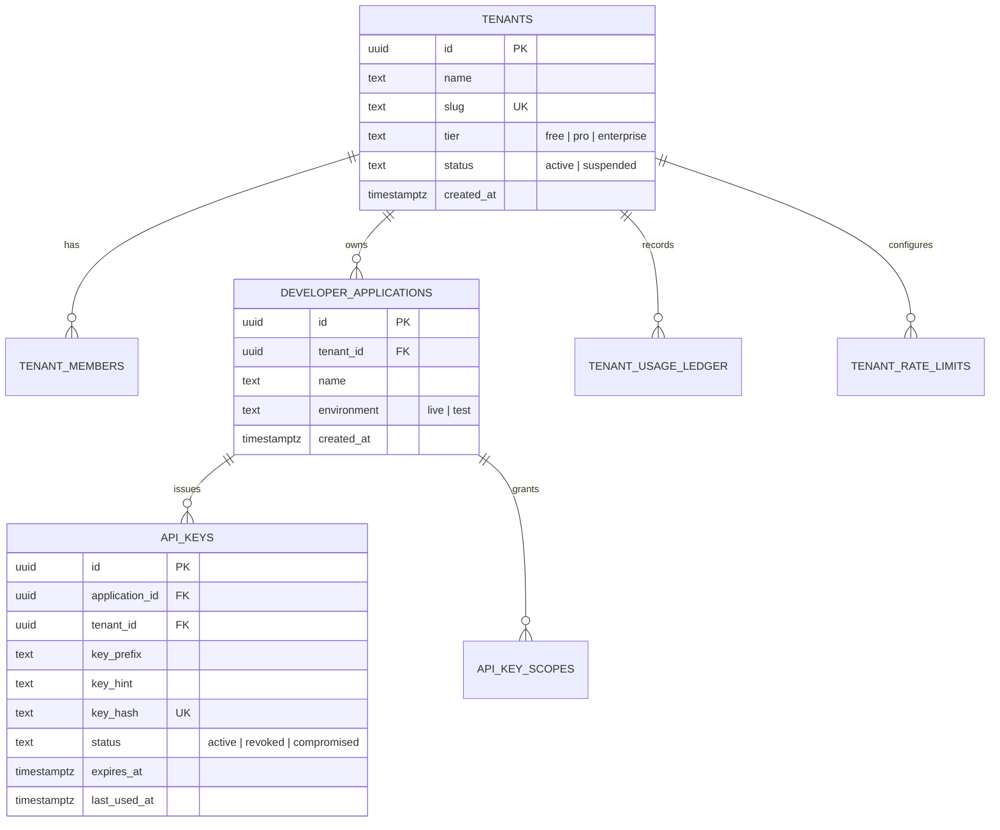

# PLAN-W021-MASTER-REV-1.0: B2B POLITICAL SAAS & PUBLIC/PARTNER DEVELOPER API FOUNDATION
## Comprehensive Architectural Specification, Security Threat Model, Data Contracts & Execution Gates
**Milestone:** W021  
**Revision:** 1.0 (Master Architectural Plan & Preflight Specification)  
**Date:** 2026-10-01  
**Authority:** Master Product Blueprint, AI Agent Master Execution Job Book, Amendments v1.2–v1.6, CTO Authorization Directive (W021-G1 Planning Only)  
**Status:** DRAFT / SUBMITTED FOR CTO REVIEW & RATIFICATION  
**Implementation Authorization:** **STRICTLY NOT AUTHORIZED (PLANNING & PREFLIGHT SPECIFICATION ONLY)**  
**Target Environment:** Staging Supabase (`fkpigozcqnmcvofuksar`) & Local API Workspace  
**Production Boundary:** STRICTLY AIR-GAPPED & UNTOUCHED (`ehfafcnimmjusyvplbah`)  
**Frozen Geometry Baseline:** 589 rows, canonical digest `f839fa02980318a8f35f932ebe72fa1d3ad6325dc86a624bf159d932fe5f613b`  

---

## 1. Executive Summary & Authorization Declaration

In accordance with the **CTO AUTHORIZATION — W021-G1 PLANNING ONLY**, Milestone W020 (Delimitation Engine Foundation) is formally **CLOSED / ACCEPTED / COMPLETE** at canonical commit `51dc383353f09db518c770ae1b4e2cf3b17f4177`.

This document (`PLAN-W021-MASTER-REV-1.0.md`) establishes the authoritative, implementation-ready architectural blueprint for Milestone **W021: B2B Political SaaS & Public/Partner Developer API Foundation**.

```text
================================================================================
MILESTONE W021 MASTER IMPLEMENTATION PLAN — REVISION 1.0
AUTHORIZATION STATUS: PLANNING ONLY / SUBMITTED FOR CTO RATIFICATION (DRAFT)
================================================================================
PLAN STATUS:                         DRAFT / SUBMITTED FOR CTO RATIFICATION
IMPLEMENTATION AUTHORIZATION:        STRICTLY NOT AUTHORIZED (NO)
CURRENT ACTIVE PHASE:                W021-G1 PLANNING ONLY
SUBSEQUENT GATES (W021-G2+):         STRICTLY NOT AUTHORIZED (GATED)
TARGET DATABASE:                     STAGING SUPABASE (fkpigozcqnmcvofuksar) ONLY
PRODUCTION DATABASE:                 STRICTLY AIR-GAPPED & UNTOUCHED (ehfafcnimmjusyvplbah)
W020 STATUS:                         ACCEPTED & CLOSED (Commit: 51dc383)
589 GEOMETRY BASELINE:               READ-ONLY & FROZEN (Digest: f839fa02...)
MIGRATION 056 STATUS:                SPECIFIED ONLY (ZERO MIGRATIONS CREATED/APPLIED)
CODE MUTATIONS AUTHORIZED:           ZERO (0)
DATABASE MIGRATIONS AUTHORIZED:      ZERO (0)
STOP STATE:                          YES — AWAITING FORMAL CTO RATIFICATION
================================================================================
```

---

## 2. Requirement Classification Taxonomy

Every architectural capability and boundary in W021 is classified under the mandatory 5-state governance taxonomy:

```text
┌─────────────────────────────────────────────────────────────────────────────┐
│                          REQUIREMENT CLASSIFICATION                         │
├──────────────────────────┬──────────────────────────────────────────────────┤
│ 1. REQUIRED              │ Essential to W021 core objective; must be        │
│                          │ implemented and verified within W021 gates.      │
├──────────────────────────┼──────────────────────────────────────────────────┤
│ 2. PROPOSED              │ Architecturally defined design; pending explicit │
│                          │ review and ratification before implementation.   │
├──────────────────────────┼──────────────────────────────────────────────────┤
│ 3. DEFERRED              │ Formally excluded from W021; scheduled for a     │
│                          │ specific named future milestone (e.g., W051).    │
├──────────────────────────┼──────────────────────────────────────────────────┤
│ 4. EXCLUDED              │ Prohibited from W021 on security, safety, or     │
│                          │ boundary grounds; will not be built.             │
├──────────────────────────┼──────────────────────────────────────────────────┤
│ 5. UNKNOWN / DECISION    │ Requires explicit CTO technical/product choice   │
│                          │ before implementation can proceed.               │
└──────────────────────────┴──────────────────────────────────────────────────┘
```

### 2.1 Scope Item Classification Matrix

| Domain Area | Capability / Feature | Classification | Rationale & Governing Boundary |
| :--- | :--- | :--- | :--- |
| **API Perimeter** | Dedicated Partner Namespace `/api/vsaas/v1/...` | **REQUIRED** | Strict physical routing separation from internal mobile API. |
| **API Perimeter** | Legacy Root Swagger Replacement | **EXCLUDED** | Internal mobile contracts in `openapi.yaml` must not be mingled with partner surface. |
| **Authentication** | Cryptographic API Key Model (`panin_live_...`) | **REQUIRED** | High-entropy token with fast constant-time lookup and SHA-256 storage. |
| **Authentication** | OAuth2 / OIDC Authorization Code Flow | **DEFERRED** | Deferred to enterprise SSO milestone (W051). API Key meets partner machine-to-machine needs. |
| **Tenancy** | Organization & Application Isolation Model | **REQUIRED** | Foundation for multi-tenant billing, quotas, key management, and security boundaries. |
| **Tenancy** | Complex RBAC / SCIM Provisioning | **DEFERRED** | Simple Two-Tier Membership (`admin`, `developer`) sufficient for W021. |
| **Metering** | Request Quota Counter (Sliding Window / Rate Limit) | **REQUIRED** | Tier-based abuse defense and quota exhaustion semantics (429). |
| **Metering** | Live Financial Ledger Billing Integration | **DEFERRED** | Deferred to commercial onboarding (W051). Staging handles test-tier limits only. ₹0 real money. |
| **External Surface**| Public Factual Electoral & Spatial Data | **REQUIRED** | Read-only delivery of normalized ECI contests, ACs, mandals, sitting tenures. |
| **External Surface**| Governed Delimitation Simulation Endpoint | **REQUIRED** | Export of Hare-Niemeyer simulations strictly bound to `PANIN_SCENARIO` metadata. |
| **External Surface**| Direct Citizen Personal Data / PII Export | **EXCLUDED** | Prohibited by DPDP Act 2023. Zero citizen phone numbers, emails, DMs, or raw reports. |
| **External Surface**| Partner Write/Mutation Endpoints | **EXCLUDED** | W021 Partner API is strictly READ-ONLY. Zero external mutation capability. |
| **Webhooks** | Outbound Event Dispatching & Signatures | **DEFERRED** | High operational footprint (retry queues, SSRF risk). Deferred to dedicated event milestone. |
| **Contracts** | Authoritative OpenAPI 3.1 Document for SaaS | **REQUIRED** | Standalone `apps/api/openapi-saas-v1.yaml` with automated drift verification. |
| **Database** | Migration 056 (Tenants, Apps, Keys, Quota Ledger) | **REQUIRED** | Clean relational persistence model deployed strictly to Staging Supabase. |
| **Production** | Production DB (`ehfafcnimmjusyvplbah`) Deployment | **EXCLUDED** | 100% Air-gapped. Zero production mutations during W021. |

---

## 3. Product & API Boundary Architecture

### 3.1 Supported Consumers & Personas
W021 serves four distinct external institutional consumer personas:
1. **Media & Editorial Organizations:** Real-time lookup of official election results, candidate margins, demographic profiles, and past winners.
2. **Political Research & Think Tanks:** Computational query of historical delimitation orders, boundary transitions, and seat allocation quotas under Article 170.
3. **Civic Tech & Educational Developers:** Integration of non-partisan constituency metadata, representative contact offices, and geographic hierarchy.
4. **Institutional Campaign Analytics (B2B SaaS):** Programmatic ingestion of normalized constituency demographic aggregates (Census 2011).

### 3.2 Canonical Namespace Separation
* **Internal Mobile / Consumer Surface:** `/api/v1/...` (Unchanged, served for Expo React Native client).
* **Internal Admin & Diagnostic Surface:** `/api/health`, `/api/metrics`, `/api/debug` (Privileged tokens).
* **Authoritative Partner & B2B SaaS Namespace:** **`/api/vsaas/v1/...`**
  * *Architectural Justification:* Evaluated against `/api/developer/v1/...`. Selected `/api/vsaas/v1/` because it mirrors the dual commercial identity of Kshetra/PanIN as both a political SaaS intelligence provider and a programmatic data partner. It guarantees absolute isolation in Fastify route registration and reverse proxy rules (e.g. Envoy/Cloudflare routing policies).

### 3.3 Endpoint Families & Information Classification

```text
┌─────────────────────────────────────────────────────────────────────────────┐
│                          EXTERNAL API SURFACE FAMILIES                      │
├───────────────────────────────┬──────────────────────┬──────────────────────┤
│ Endpoint Family               │ Classification       │ Provenance & Notice  │
├───────────────────────────────┼──────────────────────┼──────────────────────┤
│ 1. Geography & Hierarchy      │ Public Factual       │ STATUTORY_FACT       │
│    `/api/vsaas/v1/geo/...`    │ (Census / LGD)       │ ECI Schedule XXXI    │
├───────────────────────────────┼──────────────────────┼──────────────────────┤
│ 2. Normalized Elections       │ Public Factual       │ STATUTORY_FACT       │
│    `/api/vsaas/v1/elections/..│ (ECI Form 20/21E)    │ ECI Official Gazette │
├───────────────────────────────┼──────────────────────┼──────────────────────┤
│ 3. Canonical Political Entity │ Public Factual       │ STATUTORY_FACT       │
│    `/api/vsaas/v1/entities/.. │ (Gazetted Tenures)   │ Assembly Secretariats│
├───────────────────────────────┼──────────────────────┼──────────────────────┤
│ 4. Delimitation Regimes       │ Public Factual       │ STATUTORY_FACT       │
│    `/api/vsaas/v1/delim/reg.. │ (1976 / 2008 Orders) │ Delimitation Orders  │
├───────────────────────────────┼──────────────────────┼──────────────────────┤
│ 5. Delimitation Scenarios     │ Governed Simulation  │ PANIN_SCENARIO       │
│    `/api/vsaas/v1/delim/sim.. │ (Hamilton Algorithm) │ Explicit Disclaimer  │
└───────────────────────────────┴──────────────────────┴──────────────────────┘
```

---

## 4. API Key & Cryptographic Authentication Architecture

### 4.1 Evaluation of Cryptographic Approaches: SHA-256 vs KDF
* **Analysis:**
  * Password hashing algorithms (Argon2id, bcrypt, scrypt) are deliberately slow (100–300 ms CPU cost) to resist offline dictionary attacks against low-entropy human passwords.
  * API keys are **not human passwords**. They are generated with **256 bits of cryptographically secure pseudo-random entropy** (CSPRNG).
  * High-throughput API gateway lookup requires authentication latency **< 5.0 ms P95**. Subjecting every inbound API call to bcrypt would exhaust Node.js event-loop workers and violate API latency budgets.
  * *Determination:* The standard high-security API key model (adopted by Stripe, GitHub, AWS) is mandated:
    * High-entropy random payload (32 bytes = 256 bits of entropy).
    * Fast, collision-resistant cryptographic digest (**SHA-256**) for database storage and index lookup.
    * Timing-safe comparison or direct index lookup on the deterministic hash.

### 4.2 Key Anatomy & Format
API keys follow an explicit, self-describing structural format:
```text
panin_{environment}_{keyType}_{randomBase62}
```
* **Production Format:** `panin_live_sk_7Fk9...` (Prefix: `panin_live_sk_`, 32 random characters).
* **Test/Staging Format:** `panin_test_sk_3Jm2...` (Prefix: `panin_test_sk_`, 32 random characters).
* **Entropy Guarantee:** 32 characters in Base62 ($62^{32} \approx 2.27 \times 10^{57}$ combinations $\approx 190$ bits of effective entropy), generated via `crypto.randomBytes()`.

### 4.3 Key Storage & Lookup Strategy
1. **Public Key Identifier (Hint):** The first 8 characters of the random string are stored as `key_hint` (e.g. `panin_live_sk_7Fk9xQ2a...` $\rightarrow$ hint: `7Fk9xQ2a`).
2. **Secret Digest:** The full raw key is hashed using SHA-256: `key_hash = sha256(raw_key)`.
3. **Database Schema:**
   * Index: `CREATE UNIQUE INDEX idx_api_keys_hash ON api_keys(key_hash);`
   * Index: `CREATE INDEX idx_api_keys_lookup ON api_keys(key_hint) WHERE status = 'active';`
4. **Lookup Sequence:**
   * Incoming header: `Authorization: Bearer panin_live_sk_...` or `X-API-Key: panin_live_sk_...`.
   * Extract key; compute `incoming_hash = crypto.createHash('sha256').update(rawKey).digest('hex')`.
   * Fast query: `SELECT * FROM api_keys WHERE key_hash = incoming_hash AND status = 'active';`.
   * Lookup latency: Index seek in PostgreSQL **< 1.5 ms**.

### 4.4 Lifecycle & Compromise Response
* **Secret Display:** The raw API key is displayed to the developer **EXACTLY ONCE** upon generation in the admin console. It is NEVER stored in plaintext or logged.
* **Revocation:** Immediate status update `status = 'revoked', revoked_at = NOW()`.
* **Rotation:** Zero-downtime key rotation: Applications can have up to 2 active keys simultaneously during rotation windows (e.g. primary and secondary keys).
* **Compromise Mitigation:** If an API key is detected in a public repository or flagged for compromise, automated revocation trigger sets `status = 'compromised'` and invalidates in-memory cache immediately.

---

## 5. Multi-Tenant Architecture & Threat Model

### 5.1 Relational Tenancy Model
W021 implements a clean, relational multi-tenant model:



### 5.2 Isolation & RLS Boundary
* **Service-Role Gateway Pattern:** The Fastify API gateway validates the API key via service-role connection, establishes the verified `tenant_id`, and injects security context into the request (`request.tenant = { id, tier, scopes }`).
* **Cross-Tenant Attack Surface:** External partner routes are strictly READ-ONLY data lookups. Tenant data is isolated such that tenant metadata, keys, and usage records cannot be accessed across tenant boundaries.

### 5.3 Threat Model Analysis

| Threat ID | Threat Category | Attack Vector | Architectural Mitigation |
| :--- | :--- | :--- | :--- |
| **TH-01** | Credential Theft | Leaked API key in client-side code | Key prefix identification (`panin_live_sk_`), revocation API, IP allowlisting option. |
| **TH-02** | Replay Attack | MITM intercept of API call | Strict TLS 1.3 requirement (`HSTS`), short ephemeral token expiry for write paths (when added). |
| **TH-03** | Brute Force Key Guess | Repeated probes to API | $2.27 \times 10^{57}$ keyspace makes brute force mathematically impossible. Rate limiter clamps to 429. |
| **TH-04** | Scope Escalation | Key requesting unauthorized endpoints | Declarative route-level scope assertions (`requireScope('delimitation:simulate')`). |
| **TH-05** | Quota Bypass | Concurrent requests evading limits | Atomic sliding-window counters in memory / Redis / Postgres ledger. |
| **TH-06** | Timing Attack | Measuring string compare duration | Fixed-length SHA-256 digests compared via `crypto.timingSafeEqual()`. |
| **TH-07** | PII Harvester | Scraping citizen info via SaaS API | Explicit route exclusion: zero citizen PII tables exposed under `/api/vsaas/v1/`. |
| **TH-08** | Internal ID Enumeration | Traversing UUIDs or internal PKs | Public SaaS APIs expose canonical external slugs (`TS-AC-065`) rather than internal primary keys. |

---

## 6. Usage Metering, Quotas & Abuse Controls

### 6.1 Metering Unit Definition
A **Billable Metering Event** is defined as:
* Any HTTP request to the `/api/vsaas/v1/...` namespace that:
  1. Passes API key authentication (2xx, 3xx, 4xx application errors count against quota).
  2. Is NOT a fast authentication failure (401 Unauthorized does NOT count against tenant quota).
  3. Is NOT an internal gateway failure (500 Internal Error is credited back or excluded).

### 6.2 Tier Quota Specification

```text
┌─────────────────────────────────────────────────────────────────────────────┐
│                            TENANT QUOTA TIERS                               │
├───────────────────┬──────────────┬───────────────┬──────────────────────────┤
│ Tier              │ Rate Limit   │ Monthly Quota │ Permitted Scopes         │
├───────────────────┼──────────────┼───────────────┼──────────────────────────┤
│ 1. Free/Community │ 30 req/min   │ 10,000 req    │ `geo:read`, `election:rd`│
├───────────────────┼──────────────┼───────────────┼──────────────────────────┤
│ 2. Professional   │ 300 req/min  │ 250,000 req   │ `+ entities:read`        │
├───────────────────┼──────────────┼───────────────┼──────────────────────────┤
│ 3. Enterprise     │ 1,200 req/min│ 2,500,000 req │ `+ delimitation:simulate`│
└───────────────────┴──────────────┴───────────────┴──────────────────────────┘
```

### 6.3 Quota Exhaustion Semantics (HTTP 429)
When a tenant exceeds their minute rate limit or monthly consumption quota:
* Status: `429 Too Many Requests`
* Headers:
  * `Retry-After: <seconds>`
  * `X-RateLimit-Limit: <tier_limit>`
  * `X-RateLimit-Remaining: 0`
  * `X-RateLimit-Reset: <epoch_seconds>`
* Body Envelope (ECC-001 Compliant):
  ```json
  {
    "error": "Too Many Requests",
    "message": "Monthly API quota exceeded for current tier. Upgrade or wait for billing cycle reset.",
    "statusCode": 429,
    "code": "QUOTA_EXHAUSTED",
    "requestId": "f8a1...-...",
    "timestamp": "2026-10-01T21:45:00.000Z"
  }
  ```

---

## 7. Data Provenance & Constitution Compliance

W021 external API outputs must conform strictly to the PANIN Data Constitution:

1. **Source Truth Separation:**
   * Factual endpoints (`/api/vsaas/v1/elections/...`) emit `provenance: { source: 'ECI_OFFICIAL_GAZETTE', authority: 'OFFICIAL' }`.
2. **Scenario Metadata Protection:**
   * Delimitation simulation endpoints (`/api/vsaas/v1/delimitation/simulate/...`) MUST return the 10 mandatory metadata fields defined in `PLAN-W020-MASTER-REV-1.3`, including:
     * `legal_status: 'SCENARIO_PROPOSED_REGIME'`
     * `is_scenario: true`
     * `official_delimitation_order: false`
     * `statutory_disclaimer: "This projection is a research simulation based on Census 2011 data and mathematical modeling. It does NOT represent an official order or gazette notification of the Delimitation Commission of India."`
3. **Preservation of UNKNOWN:**
   * Under Constitution Rule 20, missing candidate vote breakdowns or unevidenced temporal links are returned as `null` / `UNKNOWN`. External API must NEVER fabricate zeroes.

---

## 8. Privacy & DPDP Act 2023 Enforcement

In accordance with Master Execution Framework Amendment v1.2:
* **Zero PII Exposure:**
  * Citizen mobile numbers, emails, WhatsApp IDs, and passwords are never exposed.
  * Direct messaging (`dm_conversations`, `dm_messages`) is strictly excluded.
  * Civic issue reports with citizen identity are excluded; only aggregated municipal category counts may be served.
* **Auditability:**
  * Inbound partner API calls log `tenant_id`, `application_id`, `api_key_id`, endpoint path, response code, and latency in `tenant_api_audit_log`. Zero query parameters containing sensitive filter tokens are logged.

---

## 9. Billing & Provider Integration Architecture

### 9.1 Existing Infrastructure Inventory
* **Staging Billing Entities:**
  * `user_subscriptions` (Migration 020)
  * `campaign_recharge_orders` (Migration 035)
  * `page_pro_orders` (Migration 037)
* **Provider Abstraction:** `apps/api/src/providers/razorpayProvider.ts` implementing `PaymentProvider`.
* **W021 Stance:**
  * **Zero Real Money:** All billing integration in W021 is decoupled from live settlements.
  * Staging tenants are assigned static tiers (`free`, `pro`, `enterprise`) via admin seeds for verification.
  * Automated payment gateway checkout flows for external SaaS clients are **DEFERRED to W051**.

---

## 10. Webhooks Architectural Evaluation

* **CTO Directive Review:** Determine whether outbound webhooks belong in W021.
* **Architectural Determination:** **DEFERRED TO W022 / DEDICATED EVENT MILESTONE.**
* **Justification:**
  * Outbound webhook infrastructure requires robust queue persistence (Redis / BullMQ / pg-boss), exponential backoff workers, HMAC-SHA256 request signing, replay defense, and anti-SSRF IP filtering (blocking internal VPC 10.x/192.168.x address ranges).
  * Coupling outbound webhooks into W021 would expand scope uncontrollably and compromise the stability of the core REST API surface.
  * W021 focuses exclusively on the inbound Partner REST API Foundation.

---

## 11. Authoritative OpenAPI 3.1 Strategy

* **Current Reality:** `apps/api/openapi.yaml` is a legacy Phase-1 file (474 lines) describing prototype seed endpoints.
* **W021 Strategy:**
  1. Do NOT mutate or corrupt the internal `apps/api/openapi.yaml`.
  2. Create a dedicated, standalone OpenAPI 3.1 specification: **`apps/api/openapi-saas-v1.yaml`**.
  3. Formulate an automated contract-drift test (`tests/saas-api-contract-drift.test.mjs`) verifying 100% parity between Fastify route definitions under `/api/vsaas/v1/...` and the SaaS OpenAPI document.

---

## 12. Performance & Abuse Budget

| Metric | Target / Ceiling | Measurement Method |
| :--- | :--- | :--- |
| **API Key Lookup & Auth** | **P95 < 3.0 ms** | Fastify `preHandler` timer on PostgreSQL indexed query. |
| **Public Factual Read (Cache Hit)** | **P95 < 10.0 ms** | Fastify in-memory state/candidate dictionary lookup. |
| **Public Factual Read (DB Seek)** | **P95 < 30.0 ms** | Upstream database execution time. |
| **Delimitation Scenario Simulation** | **P95 < 50.0 ms** | In-memory Hare-Niemeyer allocation engine. |
| **Concurrency Ceiling** | **50 Concurrent Connections** | Zero memory leaks, zero event-loop blocking (> 50 ms). |
| **Heap Memory Stability** | **RSS Delta < 15.0 MB** | Verified under 500 consecutive partner queries. |

---

## 13. Proposed Database Entity Specification (Migration 056)

*Note: Migration 056 is SPECIFIED HERE FOR PLANNING ONLY. No migration file is created during G1.*

```sql
-- DDL SPECIFICATION (CANDIDATE FOR W021-G2)

-- 1. SaaS Partner Tenants
CREATE TABLE IF NOT EXISTS public.saas_tenants (
  id UUID PRIMARY KEY DEFAULT gen_random_uuid(),
  name TEXT NOT NULL,
  slug TEXT NOT NULL UNIQUE,
  tier TEXT NOT NULL DEFAULT 'free' CHECK (tier IN ('free', 'pro', 'enterprise')),
  status TEXT NOT NULL DEFAULT 'active' CHECK (status IN ('active', 'suspended', 'revoked')),
  contact_email TEXT NOT NULL,
  metadata JSONB NOT NULL DEFAULT '{}'::jsonb,
  created_at TIMESTAMPTZ NOT NULL DEFAULT timezone('utc', now()),
  updated_at TIMESTAMPTZ NOT NULL DEFAULT timezone('utc', now())
);

-- 2. Developer Applications
CREATE TABLE IF NOT EXISTS public.saas_applications (
  id UUID PRIMARY KEY DEFAULT gen_random_uuid(),
  tenant_id UUID NOT NULL REFERENCES public.saas_tenants(id) ON DELETE CASCADE,
  name TEXT NOT NULL,
  environment TEXT NOT NULL DEFAULT 'test' CHECK (environment IN ('live', 'test')),
  created_at TIMESTAMPTZ NOT NULL DEFAULT timezone('utc', now())
);

-- 3. API Keys
CREATE TABLE IF NOT EXISTS public.saas_api_keys (
  id UUID PRIMARY KEY DEFAULT gen_random_uuid(),
  tenant_id UUID NOT NULL REFERENCES public.saas_tenants(id) ON DELETE CASCADE,
  application_id UUID NOT NULL REFERENCES public.saas_applications(id) ON DELETE CASCADE,
  name TEXT NOT NULL,
  key_prefix TEXT NOT NULL,
  key_hint TEXT NOT NULL,
  key_hash TEXT NOT NULL UNIQUE,
  scopes TEXT[] NOT NULL DEFAULT ARRAY['geo:read', 'elections:read']::TEXT[],
  status TEXT NOT NULL DEFAULT 'active' CHECK (status IN ('active', 'revoked', 'compromised')),
  expires_at TIMESTAMPTZ,
  last_used_at TIMESTAMPTZ,
  created_at TIMESTAMPTZ NOT NULL DEFAULT timezone('utc', now())
);

CREATE INDEX idx_saas_api_keys_lookup ON public.saas_api_keys(key_hash) WHERE status = 'active';

-- 4. Hourly Usage Aggregation Ledger
CREATE TABLE IF NOT EXISTS public.saas_usage_ledger (
  id UUID PRIMARY KEY DEFAULT gen_random_uuid(),
  tenant_id UUID NOT NULL REFERENCES public.saas_tenants(id) ON DELETE CASCADE,
  api_key_id UUID NOT NULL REFERENCES public.saas_api_keys(id) ON DELETE CASCADE,
  hour_bucket TIMESTAMPTZ NOT NULL,
  request_count INT NOT NULL DEFAULT 0,
  error_count INT NOT NULL DEFAULT 0,
  CONSTRAINT uq_saas_usage_bucket UNIQUE (tenant_id, api_key_id, hour_bucket)
);
```

---

## 14. Bounded Gate Decomposition (W021-G1 to W021-G6)

```text
┌─────────────────────────────────────────────────────────────────────────────┐
│                          W021 GATE DECOMPOSITION                            │
├─────────┬───────────────────────────────────┬───────────────────────────────┤
│ Gate    │ Scope & Objective                 │ Acceptance Criteria           │
├─────────┼───────────────────────────────────┼───────────────────────────────┤
│ W021-G1 │ Master Architecture Plan (This)   │ Ratified PLAN-W021-MASTER     │
├─────────┼───────────────────────────────────┼───────────────────────────────┤
│ W021-G2 │ Staging Migration 056 & Preflight │ DDL verified on staging;      │
│         │ Schema & Relational Integrity     │ RLS active; zero prod touch   │
├─────────┼───────────────────────────────────┼───────────────────────────────┤
│ W021-G3 │ Authentication & Middleware Engine│ Fastify plugin; SHA-256 hash  │
│         │ API Keys & Rate Limiter           │ lookup; 401/429 envelopes     │
├─────────┼───────────────────────────────────┼───────────────────────────────┤
│ W021-G4 │ Core Public SaaS Surface          │ `/api/vsaas/v1/...` routes;   │
│         │ Elections, Geo & Delimitation     │ Provenance metadata verified  │
├─────────┼───────────────────────────────────┼───────────────────────────────┤
│ W021-G5 │ Authoritative OpenAPI 3.1 & Drift │ `openapi-saas-v1.yaml` parity │
│         │ Contract Invariance Battery       │ Zero drift against Fastify    │
├─────────┼───────────────────────────────────┼───────────────────────────────┤
│ W021-G6 │ Security Probes, Master Battery   │ Full regression battery;      │
│         │ & CTO Acceptance Dossier          │ Audit dossier generated       │
└─────────┴───────────────────────────────────┴───────────────────────────────┘
```

*Governance Rule:* **No gate authorizes the next gate. Each gate requires explicit CTO review and ratification before subsequent execution.**

---

## 15. UNKNOWN / UNAVAILABLE Evidence

1. **Enterprise SSO / IdP Federation:** Not evidenced; deferred to W051.
2. **Real Money Commercial Billing API:** ₹0 real money transacted; commercial payment checkout deferred to W051.
3. **WAN PostgREST Environment Constraint:** Staging PostgREST P95 WAN latency remains subject to CTO Environmental Exception (DEC-107).

---

## 16. Implementation Authorization Declaration

* **Current Status:** `W021-G1 — PLAN COMPLETE / SUBMITTED FOR CTO RATIFICATION`
* **Implementation State:** **STRICTLY NOT AUTHORIZED.**
* Zero lines of application code altered.
* Zero migrations created.
* Zero database queries or modifications executed.
* Staging and production databases remain 100% clean and untouched.
