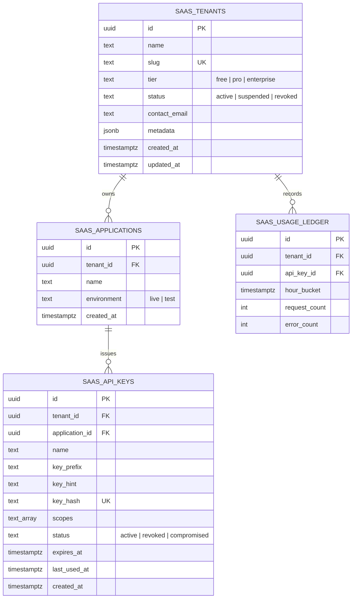

# PLAN-W021-MASTER-REV-1.0: B2B POLITICAL SAAS & PUBLIC/PARTNER DEVELOPER API FOUNDATION
## Comprehensive Architectural Specification, Cryptographic Security Flow, Multi-Tenant Model, Data Contracts & Execution Gates
**Milestone:** W021  
**Revision:** 1.0 (Master Architectural Plan & Preflight Specification — Remediated per CTO Directive)  
**Date:** 2026-10-01  
**Authority:** Master Product Blueprint, AI Agent Master Execution Job Book, Amendments v1.2–v1.6, CTO Remediation Directive (PLAN-W021-MASTER-REV-1.0)  
**Status:** DRAFT / SUBMITTED FOR CTO RE-RATIFICATION  
**Implementation Authorization:** **STRICTLY NOT AUTHORIZED (PLANNING & PREFLIGHT SPECIFICATION ONLY)**  
**Target Environment:** Staging Supabase (`fkpigozcqnmcvofuksar`) & Local API Workspace  
**Production Boundary:** STRICTLY AIR-GAPPED & UNTOUCHED (`ehfafcnimmjusyvplbah`)  
**Frozen Geometry Baseline:** 589 rows, canonical digest `f839fa02980318a8f35f932ebe72fa1d3ad6325dc86a624bf159d932fe5f613b`  

---

## 1. Executive Summary & Authorization Declaration

In accordance with the **W021-G1 CTO REMEDIATION DIRECTIVE**, this document establishes the authoritative, mathematically sound, implementation-ready architectural blueprint for Milestone **W021: B2B Political SaaS & Public/Partner Developer API Foundation**.

Milestone W020 is formally **CLOSED / COMPLETE** at canonical baseline `51dc383353f09db518c770ae1b4e2cf3b17f4177`.

```text
================================================================================
MILESTONE W021 MASTER IMPLEMENTATION PLAN — REVISION 1.0 (REMEDIATED)
AUTHORIZATION STATUS: PLANNING ONLY / SUBMITTED FOR CTO RE-RATIFICATION
================================================================================
PLAN STATUS:                         DRAFT / SUBMITTED FOR CTO RE-RATIFICATION
IMPLEMENTATION AUTHORIZATION:        STRICTLY NOT AUTHORIZED (NO)
CURRENT ACTIVE PHASE:                W021-G1 PLANNING ONLY
SUBSEQUENT GATES (W021-G2+):         STRICTLY NOT AUTHORIZED (GATED)
TARGET DATABASE:                     STAGING SUPABASE (fkpigozcqnmcvofuksar) ONLY
PRODUCTION DATABASE:                 STRICTLY AIR-GAPPED & UNTOUCHED (ehfafcnimmjusyvplbah)
W020 STATUS:                         ACCEPTED & CLOSED (Commit: 51dc383)
589 GEOMETRY BASELINE:               READ-ONLY & FROZEN (Digest: f839fa02...)
MIGRATION 056 STATUS:                SPECIFIED ONLY (ZERO MIGRATIONS CREATED/APPLIED)
CODE MUTATIONS AUTHORIZED:           ZERO (0)
DATABASE MIGRATIONS AUTHORIZED:      ZERO (0)
STOP STATE:                          YES — AWAITING FORMAL CTO RATIFICATION
================================================================================
```

---

## 2. Requirement Classification Taxonomy & Scope Inventory

Every architectural capability and boundary in W021 is classified under the mandatory 5-state governance taxonomy:

```text
┌─────────────────────────────────────────────────────────────────────────────┐
│                          REQUIREMENT CLASSIFICATION                         │
├──────────────────────────┬──────────────────────────────────────────────────┤
│ 1. REQUIRED              │ Essential to W021 core objective; must be        │
│                          │ implemented and verified within W021 gates.      │
├──────────────────────────┼──────────────────────────────────────────────────┤
│ 2. PROPOSED              │ Architecturally defined design; pending explicit │
│                          │ review and ratification before implementation.   │
├──────────────────────────┼──────────────────────────────────────────────────┤
│ 3. DEFERRED              │ Formally excluded from W021; scheduled for a     │
│                          │ specific named future milestone (e.g., W051).    │
├──────────────────────────┼──────────────────────────────────────────────────┤
│ 4. EXCLUDED              │ Prohibited from W021 on security, safety, or     │
│                          │ boundary grounds; will not be built.             │
├──────────────────────────┼──────────────────────────────────────────────────┤
│ 5. UNKNOWN / DECISION    │ Requires explicit CTO technical/product choice   │
│                          │ before implementation can proceed.               │
└──────────────────────────┴──────────────────────────────────────────────────┘
```

### 2.1 Scope Item Classification Matrix

| Domain Area | Capability / Feature | Classification | Rationale & Governing Boundary |
| :--- | :--- | :--- | :--- |
| **API Perimeter** | Dedicated Partner Namespace `/api/vsaas/v1/...` | **REQUIRED** | Strict physical routing separation from internal mobile API. |
| **API Perimeter** | Legacy Root Swagger Replacement | **EXCLUDED** | Internal mobile contracts in `openapi.yaml` must not be mingled with partner surface. |
| **Authentication** | Cryptographic API Key Model (`panin_live_sk_...`) | **REQUIRED** | 256-bit CSPRNG entropy with constant-time digest comparison and SHA-256 indexed lookup. |
| **Authentication** | OAuth2 / OIDC Authorization Code Flow | **DEFERRED** | Deferred to enterprise SSO milestone (W051). API Key satisfies machine-to-machine integrations. |
| **Tenancy** | Organization & Application Isolation Model | **REQUIRED** | Foundation for multi-tenant billing, quotas, key management, and security boundaries. |
| **Tenancy** | Complex RBAC / SCIM Provisioning | **DEFERRED** | Two-Tier Membership (`admin`, `developer`) sufficient for W021. |
| **Metering** | Request Quota Counter (In-Memory Sliding Window) | **REQUIRED** | Real-time minute rate limit and quota enforcement returning standard 429 envelopes. |
| **Metering** | Hourly Usage Aggregation Ledger (`saas_usage_ledger`) | **REQUIRED** | Relational ledger for persistent historical usage accounting, auditability, and reconciliation. |
| **Metering** | Live Financial Ledger Billing Integration | **DEFERRED** | Deferred to commercial onboarding (W051). Staging handles test-tier limits only. ₹0 real money. |
| **External Surface**| Public Factual Electoral & Spatial Data | **REQUIRED** | Read-only delivery of normalized ECI contests, ACs, mandals, sitting tenures. |
| **External Surface**| Governed Delimitation Simulation Endpoint | **REQUIRED** | Export of Hare-Niemeyer simulations strictly bound to `PANIN_SCENARIO` metadata. |
| **External Surface**| Direct Citizen Personal Data / PII Export | **EXCLUDED** | PANIN architectural privacy boundary. W021 SHALL expose zero citizen personal-data fields. |
| **External Surface**| Partner Write/Mutation Endpoints | **EXCLUDED** | W021 Partner API is strictly READ-ONLY. Zero external mutation capability. |
| **Webhooks** | Outbound Event Dispatching & Signatures | **DEFERRED** | High operational footprint (retry queues, SSRF risk). Deferred to dedicated event milestone (W022). |
| **Contracts** | Authoritative OpenAPI 3.1 Document for SaaS | **REQUIRED** | Standalone `apps/api/openapi-saas-v1.yaml` with automated drift verification. |
| **Database** | Migration 056 (Tenants, Apps, Keys, Quota Ledger) | **REQUIRED** | Clean relational persistence model deployed strictly to Staging Supabase. |
| **Production** | Production DB (`ehfafcnimmjusyvplbah`) Deployment | **EXCLUDED** | 100% Air-gapped. Zero production mutations during W021. |

---

## 3. Product & API Boundary Architecture

### 3.1 Supported Consumers & Personas
W021 serves four distinct external institutional consumer personas:
1. **Media & Editorial Organizations:** Real-time lookup of official election results, candidate margins, demographic profiles, and past winners.
2. **Political Research & Think Tanks:** Computational query of historical delimitation orders, boundary transitions, and seat allocation quotas under Article 170.
3. **Civic Tech & Educational Developers:** Integration of non-partisan constituency metadata, representative contact offices, and geographic hierarchy.
4. **Institutional Campaign Analytics (B2B SaaS):** Programmatic ingestion of normalized constituency demographic aggregates (Census 2011).

### 3.2 Canonical Namespace Separation
* **Internal Mobile / Consumer Surface:** `/api/v1/...` (Unchanged, served for Expo React Native client).
* **Internal Admin & Diagnostic Surface:** `/api/health`, `/api/metrics`, `/api/debug` (Privileged tokens).
* **Authoritative Partner & B2B SaaS Namespace:** **`/api/vsaas/v1/...`**
  * *Architectural Justification:* Evaluated against `/api/developer/v1/...`. Selected `/api/vsaas/v1/` because it explicitly mirrors the dual commercial identity of Kshetra/PanIN as both a political SaaS intelligence provider and programmatic data partner. It guarantees absolute isolation in Fastify route registration and reverse proxy rules (e.g. Envoy/Cloudflare routing policies).

### 3.3 Endpoint Families & Information Classification

```text
┌─────────────────────────────────────────────────────────────────────────────┐
│                          EXTERNAL API SURFACE FAMILIES                      │
├───────────────────────────────┬──────────────────────┬──────────────────────┤
│ Endpoint Family               │ Classification       │ Provenance & Notice  │
├───────────────────────────────┼──────────────────────┼──────────────────────┤
│ 1. Geography & Hierarchy      │ Public Factual       │ STATUTORY_FACT       │
│    `/api/vsaas/v1/geo/...`    │ (Census / LGD)       │ ECI Schedule XXXI    │
├───────────────────────────────┼──────────────────────┼──────────────────────┤
│ 2. Normalized Elections       │ Public Factual       │ STATUTORY_FACT       │
│    `/api/vsaas/v1/elections/..│ (ECI Form 20/21E)    │ ECI Official Gazette │
├───────────────────────────────┼──────────────────────┼──────────────────────┤
│ 3. Canonical Political Entity │ Public Factual       │ STATUTORY_FACT       │
│    `/api/vsaas/v1/entities/.. │ (Gazetted Tenures)   │ Assembly Secretariats│
├───────────────────────────────┼──────────────────────┼──────────────────────┤
│ 4. Delimitation Regimes       │ Public Factual       │ STATUTORY_FACT       │
│    `/api/vsaas/v1/delim/reg.. │ (1976 / 2008 Orders) │ Delimitation Orders  │
├───────────────────────────────┼──────────────────────┼──────────────────────┤
│ 5. Delimitation Scenarios     │ Governed Simulation  │ PANIN_SCENARIO       │
│    `/api/vsaas/v1/delim/sim.. │ (Hamilton Algorithm) │ Explicit Disclaimer  │
└───────────────────────────────┴──────────────────────┴──────────────────────┘
```

---

## 4. API Key Architecture & Cryptographic Construction

### 4.1 Corrected 256-Bit Entropy Construction
In response to CTO Review Remediation Item 1, the mathematical entropy specification is formally corrected and made internally consistent:

1. **Target Entropy:** **Exactly 256 bits of cryptographic entropy**.
2. **CSPRNG Source:** Node.js `crypto.randomBytes(32)` (or Web Cryptography API `crypto.getRandomValues(new Uint8Array(32))`), generating 32 raw bytes (256 bits) from the operating system's cryptographic entropy pool.
3. **Encoding:** **Base62 Encoding** (`[0-9a-zA-Z]`, 62 characters) to produce URL-safe, compact, non-punctuated alphanumeric strings without ambiguous character substitutions.
   * A 32-byte (256-bit) integer $N \in [0, 2^{256}-1]$ requires $\lceil 256 / \log_2(62) \rceil = \lceil 256 / 5.954 \rceil = 43$ Base62 characters to represent losslessly.
   * To maintain fixed length and clean visual boundaries, the secret payload is zero-padded to exactly **44 Base62 characters** ($62^{44} \approx 7.02 \times 10^{78} > 2^{256} \approx 1.1579 \times 10^{77}$).
4. **Resulting Displayed Secret Format:**
   ```text
   panin_{environment}_{keyType}_{randomSecret44}
   ```
   * **Production Live Key:** `panin_live_sk_XXXXXXXXXXXXXXXXXXXXXXXXXXXXXXXXXXXXXXXXXXXX` (Total length: 58 characters).
   * **Staging / Test Key:** `panin_test_sk_YYYYYYYYYYYYYYYYYYYYYYYYYYYYYYYYYYYYYYYYYYYY` (Total length: 58 characters).
5. **Key Anatomy Breakdown:**
   * Prefix: `panin_live_sk_` or `panin_test_sk_` (14 characters). Allows instant routing, regex credential detection in CI scanners, and environment validation.
   * Key Hint: First 8 characters of the 44-character random string (e.g., `XXXXXXXX`). Stored in plaintext in the database to enable developer identification in consoles (e.g. `panin_live_sk_XXXXXXXX...`).
   * Secret Entropy: The full 32 raw bytes (256 bits) encoded in the 44 Base62 characters.

### 4.2 Complete SHA-256 API-Key Security Flow

```text
┌─────────────────────────────────────────────────────────────────────────────┐
│                       API KEY GENERATION & STORAGE FLOW                     │
├─────────────────────────────────────────────────────────────────────────────┤
│ 1. GENERATE:  raw_bytes = crypto.randomBytes(32)                            │
│               secret_payload = base62Encode(raw_bytes)  // 44 chars         │
│               raw_api_key = "panin_" + env + "_sk_" + secret_payload        │
│                                                                             │
│ 2. DERIVE:    key_hint = secret_payload.substring(0, 8)  // 8 chars         │
│               key_hash = crypto.createHash('sha256')                        │
│                                .update(raw_api_key, 'utf8')                 │
│                                .digest('hex')  // 64-char hex string        │
│                                                                             │
│ 3. STORE:     INSERT INTO saas_api_keys                                     │
│                 (tenant_id, app_id, key_prefix, key_hint, key_hash, status) │
│               VALUES (..., 'panin_live_sk_', key_hint, key_hash, 'active'); │
│                                                                             │
│ 4. DISPLAY:   raw_api_key displayed to developer EXACTLY ONCE.             │
│               raw_api_key is NEVER written to DB, disk, or logs.            │
└─────────────────────────────────────────────────────────────────────────────┘
```

```text
┌─────────────────────────────────────────────────────────────────────────────┐
│                    API KEY INBOUND AUTHENTICATION FLOW                      │
├─────────────────────────────────────────────────────────────────────────────┤
│ 1. EXTRACT:   incoming_key = req.headers['x-api-key'] ||                    │
│                              req.headers.authorization?.replace('Bearer ','')│
│                                                                             │
│ 2. VALIDATE:  Check format: /panin_(live|test)_sk_[0-9a-zA-Z]{44}/          │
│               If invalid -> Fail closed: 401 Unauthorized (ECC-001)         │
│                                                                             │
│ 3. HASH:      incoming_hash = crypto.createHash('sha256')                   │
│                                     .update(incoming_key, 'utf8')           │
│                                     .digest('hex')                          │
│                                                                             │
│ 4. LOOKUP:    Indexed B-Tree Seek in PostgreSQL:                            │
│               SELECT * FROM saas_api_keys                                   │
│               WHERE key_hash = incoming_hash AND status = 'active';         │
│               * Note: DB index seek is fast (<1.5ms) but not constant-time. │
│                                                                             │
│ 5. VERIFY:    If row found:                                                 │
│               stored_hash_buf = Buffer.from(row.key_hash, 'utf8');          │
│               computed_hash_buf = Buffer.from(incoming_hash, 'utf8');       │
│               is_valid = crypto.timingSafeEqual(stored_hash_buf,            │
│                                                 computed_hash_buf);         │
│               If !is_valid -> Fail closed: 401 Unauthorized                 │
│                                                                             │
│ 6. CONTEXT:   Check expiration (expires_at > NOW()).                        │
│               Check environment matches server deployment mode.             │
│               Inject request.tenant = { tenantId, appId, keyId, scopes }.   │
│               Asynchronously update last_used_at timestamp.                 │
└─────────────────────────────────────────────────────────────────────────────┘
```

* **Clarification on Timing Safety:**
  * Database lookup (`WHERE key_hash = incoming_hash`) relies on B-Tree index traversal; index seeks depend on key tree location and are **NOT constant-time**. However, because the searched key is a cryptographically pseudo-random SHA-256 digest, the timing of index seeks leaks zero information about the underlying raw secret.
  * Once the candidate row is retrieved from the database, `crypto.timingSafeEqual()` is applied exclusively to the two fixed-length 64-byte UTF-8 buffers representing the hex digests, preventing byte-by-byte memory comparison timing leakage in the Node.js runtime.

### 4.3 Key Revocation, Expiration & Failure Handling
* **Revocation:** Update `status = 'revoked', revoked_at = NOW()`. Subsequent lookups filter on `status = 'active'`, failing immediately.
* **Compromise Mitigation:** Update `status = 'compromised'`. Any cached memory tokens are flushed.
* **Expiration:** If `expires_at IS NOT NULL AND expires_at < NOW()`, authentication returns `401 Unauthorized` with code `API_KEY_EXPIRED`.
* **Authentication Failure Behavior:**
  * Returns `401 Unauthorized` with `ECC-001` envelope.
  * Message: `"Invalid or inactive API key provided."` (Generic, zero leakage of whether key exists, has expired, or is revoked).
  * Fast exit: Zero tenant query or upstream processing executed.

---

## 5. Multi-Tenant Architecture & Threat Model

### 5.1 Relational Tenancy Model
W021 implements a clean, relational multi-tenant architecture:



### 5.2 Isolation & RLS Boundary
1. **Service-Role Gateway Mediation:** The Fastify API gateway validates the API key via a dedicated service-role connection, establishes the verified `tenant_id`, and injects security context into the request (`request.tenant = { tenantId, appId, keyId, tier, scopes }`).
2. **PostgreSQL RLS Policies on Tenant Data:**
   * Tables `saas_tenants`, `saas_applications`, `saas_api_keys`, and `saas_usage_ledger` enable `ROW LEVEL SECURITY`.
   * When queried in user/tenant context, policies enforce:
     ```sql
     CREATE POLICY "Tenants isolate own records" ON public.saas_tenants
       FOR ALL USING (id = NULLIF(current_setting('app.current_tenant_id', true), '')::UUID);
     ```
   * Service-role retains bypass capability for gateway authentication seeks.
3. **External Partner Route Isolation:** External partner routes (`/api/vsaas/v1/...`) are strictly READ-ONLY data lookups against public factual or governed scenario tables. Partner requests can NEVER view other tenants' keys, usage, or configurations.

### 5.3 Threat Model Analysis

| Threat ID | Threat Category | Attack Vector | Architectural Mitigation |
| :--- | :--- | :--- | :--- |
| **TH-01** | Credential Theft | Leaked API key in client-side code | Key prefix identification (`panin_live_sk_`), revocation API, IP allowlisting option. |
| **TH-02** | Replay Attack | MITM intercept of API call | Strict TLS 1.3 requirement (`HSTS`), short ephemeral token expiry for write paths (when added). |
| **TH-03** | Brute Force Key Guess | Repeated probes to API | $2^{256}$ keyspace makes brute force mathematically impossible. Rate limiter clamps to 429. |
| **TH-04** | Scope Escalation | Key requesting unauthorized endpoints | Declarative route-level scope assertions (`requireScope('delimitation:simulate')`). |
| **TH-05** | Quota Bypass | Concurrent requests evading limits | In-memory atomic sliding-window counters + hourly persistence ledger. |
| **TH-06** | Timing Attack | Measuring string compare duration | Fixed-length SHA-256 digests compared via `crypto.timingSafeEqual()`. |
| **TH-07** | PII Harvester | Scraping citizen info via SaaS API | Explicit route exclusion: zero citizen personal data exposed under `/api/vsaas/v1/`. |
| **TH-08** | Internal ID Enumeration | Traversing UUIDs or internal PKs | Public SaaS APIs expose canonical external slugs (`TS-AC-065`) rather than internal primary keys. |

---

## 6. Usage Metering, Quotas & Ledger Architecture

### 6.1 Metering Architecture & Separation of Concerns
In response to CTO Review Remediation Item 3, the classification and architectural roles of rate limiting and usage accounting are formally reconciled:

* **Dual-Mechanism Architecture:**
  1. **Real-Time Rate & Quota Enforcement (Synchronous):** Handled in-memory (via Fastify rate-limiter / token-bucket) to protect service availability and enforce per-minute bursts and monthly limits with sub-millisecond overhead.
  2. **Hourly Usage Aggregation Ledger (`saas_usage_ledger`) (Asynchronous Persistence):** **Formally classified as REQUIRED in W021.**
     * *Role:* Provides durable, persistent historical accounting of tenant consumption across hourly buckets (`hour_bucket`), enabling audit trails, offline quota reconciliation, tenant dashboard usage reporting, and future billing settlement export.
     * *Execution:* Asynchronously flushes aggregated request and error counts to `saas_usage_ledger` without blocking the HTTP response cycle.

### 6.2 Tier Quota Specification

```text
┌─────────────────────────────────────────────────────────────────────────────┐
│                            TENANT QUOTA TIERS                               │
├───────────────────┬──────────────┬───────────────┬──────────────────────────┤
│ Tier              │ Rate Limit   │ Monthly Quota │ Permitted Scopes         │
├───────────────────┼──────────────┼───────────────┼──────────────────────────┤
│ 1. Free/Community │ 30 req/min   │ 10,000 req    │ `geo:read`, `election:rd`│
├───────────────────┼──────────────┼───────────────┼──────────────────────────┤
│ 2. Professional   │ 300 req/min  │ 250,000 req   │ `+ entities:read`        │
├───────────────────┼──────────────┼───────────────┼──────────────────────────┤
│ 3. Enterprise     │ 1,200 req/min│ 2,500,000 req │ `+ delimitation:simulate`│
└───────────────────┴──────────────┴───────────────┴──────────────────────────┘
```

### 6.3 Quota Exhaustion Semantics (HTTP 429)
When a tenant exceeds their minute rate limit or monthly consumption quota:
* Status: `429 Too Many Requests`
* Headers:
  * `Retry-After: <seconds>`
  * `X-RateLimit-Limit: <tier_limit>`
  * `X-RateLimit-Remaining: 0`
  * `X-RateLimit-Reset: <epoch_seconds>`
* Body Envelope (ECC-001 Compliant):
  ```json
  {
    "error": "Too Many Requests",
    "message": "Monthly API quota exceeded for current tier. Upgrade or wait for billing cycle reset.",
    "statusCode": 429,
    "code": "QUOTA_EXHAUSTED",
    "requestId": "f8a1...-...",
    "timestamp": "2026-10-01T21:45:00.000Z"
  }
  ```

---

## 7. External Provenance Contract & Source Truth Protection

In response to CTO Review Remediation Item 6, every externally exposed delimitation scenario or projection MUST include the canonical, non-bypassable **10-Attribute Provenance Contract**:

### 7.1 Mandatory Provenance Schema (`DelimitationProvenanceResponse`)
```json
{
  "provenance": {
    "authorityLayer": "PANIN_SCENARIO",
    "computationalType": "DETERMINISTIC_DERIVED",
    "officialDelimitationOrder": false,
    "sourceReference": "Census 2011 Primary Census Abstract (RGI) & Delimitation Act 2002 Framework",
    "effectiveVersion": "2026-PANIN-SIM-V1",
    "scenarioStatus": "SCENARIO_PROPOSED_REGIME",
    "mathematicalMethod": "Hamilton-Hare-Niemeyer Largest Remainder with Article 170 Clamping",
    "generatedAt": "2026-10-01T21:50:00.000Z",
    "schemaVersion": "1.0.0",
    "statutoryDisclaimer": "This projection is a research simulation based on Census 2011 data and mathematical modeling. It does NOT represent an official order, draft proposal, or gazette notification of the Delimitation Commission of India or the Election Commission of India."
  }
}
```

### 7.2 Invariant Enforcement Rules
1. **`officialDelimitationOrder: false`** is hardcoded on all simulation outputs.
2. **`authorityLayer: "PANIN_SCENARIO"`** is non-overridable.
3. Fastify serialization schemas enforce this contract; omitting the provenance block or setting `officialDelimitationOrder: true` throws a validation invariant violation (`500 INTERNAL_PROVENANCE_ERROR`).

---

## 8. Privacy & DPDP Compliance Boundary

In response to CTO Review Remediation Item 5, the DPDP language is formally corrected to an architectural privacy boundary:

* **Architectural Privacy Mandate:**
  * **W021 SHALL expose zero citizen personal-data fields through the external SaaS API.**
  * *Boundary Statement:* This is a PANIN architectural and privacy boundary established to enforce data minimization, eliminate personal data leakage, and ensure clean tenant isolation. This technical constraint is not, by itself, a complete legal determination of DPDP applicability, which remains subject to formal human legal counsel review under Job W051.5.
* **Prohibited Data Surfaces:**
  * Zero citizen mobile numbers, emails, names, photos, or passwords.
  * Zero direct messages (`dm_conversations`, `dm_messages`).
  * Zero citizen grievance reports or personal issue submissions.
  * Only aggregated, non-personal public election data, statutory gazettes, and demographic totals are exported.

---

## 9. Billing & Provider Integration Architecture

* **Staging Billing Entities:**
  * `user_subscriptions` (Migration 020)
  * `campaign_recharge_orders` (Migration 035)
  * `page_pro_orders` (Migration 037)
* **Provider Abstraction:** `apps/api/src/providers/razorpayProvider.ts` implementing `PaymentProvider`.
* **W021 Boundary:**
  * **Zero Real Money:** All billing integration in W021 is decoupled from live settlements.
  * Staging tenants are assigned static tiers (`free`, `pro`, `enterprise`) via admin seeds for verification.
  * Automated payment gateway checkout flows for external SaaS clients are **DEFERRED to W051**.

---

## 10. Webhooks Architectural Evaluation

* **Architectural Determination:** **DEFERRED TO W022 / DEDICATED EVENT MILESTONE.**
* **Justification:**
  * Outbound webhook infrastructure requires robust queue persistence (Redis / BullMQ / pg-boss), exponential backoff workers, HMAC-SHA256 request signing, replay defense, and anti-SSRF IP filtering (blocking internal VPC 10.x/192.168.x address ranges).
  * Coupling outbound webhooks into W021 would expand scope uncontrollably and compromise the stability of the core REST API surface.
  * W021 focuses exclusively on the inbound Partner REST API Foundation.

---

## 11. Authoritative OpenAPI 3.1 Strategy

* **Current Reality:** `apps/api/openapi.yaml` is a legacy Phase-1 file (474 lines) describing prototype seed endpoints.
* **W021 Strategy:**
  1. Do NOT mutate or corrupt the internal `apps/api/openapi.yaml`.
  2. Create a dedicated, standalone OpenAPI 3.1 specification: **`apps/api/openapi-saas-v1.yaml`**.
  3. Formulate an automated contract-drift test (`tests/saas-api-contract-drift.test.mjs`) verifying 100% parity between Fastify route definitions under `/api/vsaas/v1/...` and the SaaS OpenAPI document.

---

## 12. Performance & Abuse Budget

| Metric | Target / Ceiling | Measurement Method |
| :--- | :--- | :--- |
| **API Key Lookup & Auth** | **P95 < 3.0 ms** | Fastify `preHandler` timer on PostgreSQL indexed query. |
| **Public Factual Read (Cache Hit)** | **P95 < 10.0 ms** | Fastify in-memory state/candidate dictionary lookup. |
| **Public Factual Read (DB Seek)** | **P95 < 30.0 ms** | Upstream database execution time. |
| **Delimitation Scenario Simulation** | **P95 < 50.0 ms** | In-memory Hare-Niemeyer allocation engine. |
| **Concurrency Ceiling** | **50 Concurrent Connections** | Zero memory leaks, zero event-loop blocking (> 50 ms). |
| **Heap Memory Stability** | **RSS Delta < 15.0 MB** | Verified under 500 consecutive partner queries. |

---

## 13. Detailed Database Entity Architecture (Migration 056 Candidate)

*Note: This section defines the architectural blueprint for Migration 056. No migration file is created or executed during G1.*

### 13.1 Entity Model & Integrity Specifications

```sql
-- DDL ARCHITECTURAL SPECIFICATION (CANDIDATE FOR W021-G2)

-- 1. SaaS Partner Tenants
CREATE TABLE IF NOT EXISTS public.saas_tenants (
  id UUID PRIMARY KEY DEFAULT gen_random_uuid(),
  name TEXT NOT NULL,
  slug TEXT NOT NULL,
  tier TEXT NOT NULL DEFAULT 'free',
  status TEXT NOT NULL DEFAULT 'active',
  contact_email TEXT NOT NULL,
  metadata JSONB NOT NULL DEFAULT '{}'::jsonb,
  created_at TIMESTAMPTZ NOT NULL DEFAULT timezone('utc', now()),
  updated_at TIMESTAMPTZ NOT NULL DEFAULT timezone('utc', now()),
  CONSTRAINT uq_saas_tenants_slug UNIQUE (slug),
  CONSTRAINT chk_saas_tenants_tier CHECK (tier IN ('free', 'pro', 'enterprise')),
  CONSTRAINT chk_saas_tenants_status CHECK (status IN ('active', 'suspended', 'revoked'))
);

CREATE INDEX idx_saas_tenants_status ON public.saas_tenants(status);

-- 2. Developer Applications
CREATE TABLE IF NOT EXISTS public.saas_applications (
  id UUID PRIMARY KEY DEFAULT gen_random_uuid(),
  tenant_id UUID NOT NULL REFERENCES public.saas_tenants(id) ON DELETE CASCADE,
  name TEXT NOT NULL,
  environment TEXT NOT NULL DEFAULT 'test',
  created_at TIMESTAMPTZ NOT NULL DEFAULT timezone('utc', now()),
  CONSTRAINT chk_saas_applications_env CHECK (environment IN ('live', 'test'))
);

CREATE INDEX idx_saas_applications_tenant ON public.saas_applications(tenant_id);

-- 3. API Keys
CREATE TABLE IF NOT EXISTS public.saas_api_keys (
  id UUID PRIMARY KEY DEFAULT gen_random_uuid(),
  tenant_id UUID NOT NULL REFERENCES public.saas_tenants(id) ON DELETE CASCADE,
  application_id UUID NOT NULL REFERENCES public.saas_applications(id) ON DELETE CASCADE,
  name TEXT NOT NULL,
  key_prefix TEXT NOT NULL,
  key_hint TEXT NOT NULL,
  key_hash TEXT NOT NULL,
  scopes TEXT[] NOT NULL DEFAULT ARRAY['geo:read', 'elections:read']::TEXT[],
  status TEXT NOT NULL DEFAULT 'active',
  expires_at TIMESTAMPTZ,
  last_used_at TIMESTAMPTZ,
  created_at TIMESTAMPTZ NOT NULL DEFAULT timezone('utc', now()),
  CONSTRAINT uq_saas_api_keys_hash UNIQUE (key_hash),
  CONSTRAINT chk_saas_api_keys_status CHECK (status IN ('active', 'revoked', 'compromised'))
);

CREATE INDEX idx_saas_api_keys_lookup ON public.saas_api_keys(key_hash) WHERE status = 'active';
CREATE INDEX idx_saas_api_keys_tenant ON public.saas_api_keys(tenant_id);

-- 4. Hourly Usage Aggregation Ledger
CREATE TABLE IF NOT EXISTS public.saas_usage_ledger (
  id UUID PRIMARY KEY DEFAULT gen_random_uuid(),
  tenant_id UUID NOT NULL REFERENCES public.saas_tenants(id) ON DELETE CASCADE,
  api_key_id UUID NOT NULL REFERENCES public.saas_api_keys(id) ON DELETE CASCADE,
  hour_bucket TIMESTAMPTZ NOT NULL,
  request_count INT NOT NULL DEFAULT 0,
  error_count INT NOT NULL DEFAULT 0,
  created_at TIMESTAMPTZ NOT NULL DEFAULT timezone('utc', now()),
  CONSTRAINT uq_saas_usage_bucket UNIQUE (tenant_id, api_key_id, hour_bucket)
);

CREATE INDEX idx_saas_usage_ledger_tenant ON public.saas_usage_ledger(tenant_id, hour_bucket DESC);
```

### 13.2 Row Level Security Architecture
```sql
-- RLS Activation on All New Entities
ALTER TABLE public.saas_tenants ENABLE ROW LEVEL SECURITY;
ALTER TABLE public.saas_applications ENABLE ROW LEVEL SECURITY;
ALTER TABLE public.saas_api_keys ENABLE ROW LEVEL SECURITY;
ALTER TABLE public.saas_usage_ledger ENABLE ROW LEVEL SECURITY;

ALTER TABLE public.saas_tenants FORCE ROW LEVEL SECURITY;
ALTER TABLE public.saas_applications FORCE ROW LEVEL SECURITY;
ALTER TABLE public.saas_api_keys FORCE ROW LEVEL SECURITY;
ALTER TABLE public.saas_usage_ledger FORCE ROW LEVEL SECURITY;

-- Service role retains full administrative access
CREATE POLICY "service_role_all_saas_tenants" ON public.saas_tenants
  FOR ALL TO service_role USING (true) WITH CHECK (true);

CREATE POLICY "service_role_all_saas_applications" ON public.saas_applications
  FOR ALL TO service_role USING (true) WITH CHECK (true);

CREATE POLICY "service_role_all_saas_api_keys" ON public.saas_api_keys
  FOR ALL TO service_role USING (true) WITH CHECK (true);

CREATE POLICY "service_role_all_saas_usage_ledger" ON public.saas_usage_ledger
  FOR ALL TO service_role USING (true) WITH CHECK (true);

-- Revoke all direct public/anon access
REVOKE ALL ON public.saas_tenants FROM anon, authenticated, public;
REVOKE ALL ON public.saas_applications FROM anon, authenticated, public;
REVOKE ALL ON public.saas_api_keys FROM anon, authenticated, public;
REVOKE ALL ON public.saas_usage_ledger FROM anon, authenticated, public;
```

---

## 14. Bounded Gate Decomposition (W021-G1 to W021-G6)

```text
┌─────────────────────────────────────────────────────────────────────────────┐
│                          W021 GATE DECOMPOSITION                            │
├─────────┬───────────────────────────────────┬───────────────────────────────┤
│ Gate    │ Scope & Objective                 │ Acceptance Criteria           │
├─────────┼───────────────────────────────────┼───────────────────────────────┤
│ W021-G1 │ Master Architecture Plan (This)   │ Ratified PLAN-W021-MASTER     │
├─────────┼───────────────────────────────────┼───────────────────────────────┤
│ W021-G2 │ Staging Migration 056 & Preflight │ DDL verified on staging;      │
│         │ Schema & Relational Integrity     │ RLS active; zero prod touch   │
├─────────┼───────────────────────────────────┼───────────────────────────────┤
│ W021-G3 │ Authentication & Middleware Engine│ Fastify plugin; SHA-256 hash  │
│         │ API Keys & Rate Limiter           │ lookup; 401/429 envelopes     │
├─────────┼───────────────────────────────────┼───────────────────────────────┤
│ W021-G4 │ Core Public SaaS Surface          │ `/api/vsaas/v1/...` routes;   │
│         │ Elections, Geo & Delimitation     │ Provenance metadata verified  │
├─────────┼───────────────────────────────────┼───────────────────────────────┤
│ W021-G5 │ Authoritative OpenAPI 3.1 & Drift │ `openapi-saas-v1.yaml` parity │
│         │ Contract Invariance Battery       │ Zero drift against Fastify    │
├─────────┼───────────────────────────────────┼───────────────────────────────┤
│ W021-G6 │ Security Probes, Master Battery   │ Full regression battery;      │
│         │ & CTO Acceptance Dossier          │ Audit dossier generated       │
└─────────┴───────────────────────────────────┴───────────────────────────────┘
```

*Governance Rule:* **No gate authorizes the next gate. Each gate requires explicit CTO review and ratification before subsequent execution.**

---

## 15. UNKNOWN / UNAVAILABLE Evidence

1. **Enterprise SSO / IdP Federation:** Not evidenced; deferred to W051.
2. **Real Money Commercial Billing API:** ₹0 real money transacted; commercial payment checkout deferred to W051.
3. **WAN PostgREST Environment Constraint:** Staging PostgREST P95 WAN latency remains subject to CTO Environmental Exception (DEC-107).

---

## 16. Implementation Authorization Declaration

* **Current Status:** `W021-G1 — PLAN REMEDIATION COMPLETE / SUBMITTED FOR CTO RE-RATIFICATION`
* **Implementation State:** **STRICTLY NOT AUTHORIZED.**
* Zero lines of application code altered.
* Zero migrations created.
* Zero database queries or modifications executed.
* Staging and production databases remain 100% clean and untouched.
