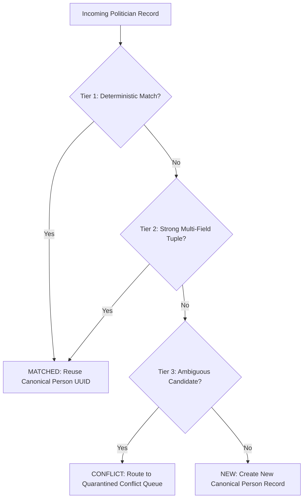

# W021.5-B0 CANONICAL MODEL RECONCILIATION DOSSIER

**Milestone:** W021.5-B0 (Canonical National Data Plane Reconciliation)  
**Governing Authority:** CTO REMEDIATION DIRECTIVE — W021.5-B0  
**Prerequisite:** W021.5-A Audited & Accepted  
**Governing Baseline Commit:** `73df0a9c56be9ebbc0ed5e857d3e790b2ab9e8cc`  
**Execution Phase:** SUBSTAGE B0 — MODEL RECONCILIATION ONLY (ZERO DATA MUTATIONS)  
**Target Architecture:** Canonical Relational Core (World B) — PostgreSQL / PostGIS (Migrations 039–058)

---

## 1. Purpose

The objective of Substage **B0** is to reconcile the existing canonical backend data architecture (World B) with the legacy static and device-side political data structures (World A), producing an evidence-backed specification for the subsequent migration phases (B1 through B8).

B0 establishes:
1. An exhaustive inventory of verified PostgreSQL schema tables, primary keys, foreign keys, unique constraints, temporal indices, and provenance fields.
2. A formal separation of political reality into four orthogonal domains: `PERSON`, `TENURE`, `CANDIDACY`, and `PARTY AFFILIATION / SWITCH`.
3. An evidence-based evaluation of constituency identity vs. delimitation boundary versioning.
4. An explicit rejection of legacy flat fallback logic (`winner2024 ?? winner2023...`) in favor of dynamic temporal state derivation.
5. A deterministic legacy-to-canonical data mapping matrix and conflict resolution hierarchy.
6. A dependency-safe migration order, idempotency design, and rollback model.

---

## 2. Scope & Absolute Boundaries

### 2.1 Permitted Scope
- Documentation and architectural reconciliation within `docs/W021.5-B0-CANONICAL-MODEL-RECONCILIATION.md`.
- Read-only inspection of repository migrations (`supabase/migrations/*.sql`), seed datasets (`data/seed/*.ts`), API services (`apps/api/src/**/*.ts`), and verification reports.

### 2.2 Prohibited Scope (Strict Enforcement)
- **Zero code modifications:** `apps/api/**`, `apps/mobile/**`, and `packages/**` must not be modified.
- **Zero migration modifications:** `supabase/migrations/**` (001 through 058) are frozen.
- **Zero seed file modifications:** `data/seed/**` and `apps/api/public/geo/**` must not be modified.
- **Zero database execution:** No DDL, DML, or data backfill may be executed against staging or production.
- **Zero production access:** Production Supabase project `ehfafcnimmjusyvplbah` remains 100% air-gapped and untouched.
- **Zero premature migration:** Substage B1 (National Constituency Canonicalization) must NOT be started.

---

## 3. Current Repository Baseline

- **Audited Commit SHA:** `73df0a9c56be9ebbc0ed5e857d3e790b2ab9e8cc`
- **Branch:** `master`
- **Working Tree:** Clean (untracked audit reports from W021.5-A and B0 specification)
- **Master Regression Suite:** 13 suites, 365 checks passing (100.0%)
- **Coexisting Worlds:**
  - **World A (Legacy / Static / Device-Side):**
    - `apps/api/src/services/stateData.ts` (imports 31 static TypeScript files; hardcoded `STATE_RAW_MAP`).
    - `data/seed/*-constituencies.ts` (4,123 assembly constituencies across 31 States & UTs).
    - `data/seed/*-mla-profiles.ts` and `data/seed/mp-profiles.ts` (politician profiles with composite text IDs).
    - `data/seed/*-election-history.ts` (static election results).
    - `apps/api/public/geo/*.json` (flat GeoJSON polygons).
    - `supabase/migrations/012_legislator_profiles.sql` (single-table mutable politician profiles).
    - `apps/mobile/stores/delimitation.ts` (client-side mock seat allocation arithmetic).
  - **World B (Canonical Relational Core):**
    - PostgreSQL / PostGIS schemas (Migrations 039–058).
    - Normalized entities: `canonical_persons`, `political_organizations`, `person_roles`, `person_party_affiliations`, `elected_tenures`, `tenure_party_switches`, `candidacies`, `election_events`, `election_contests`, `ballot_choices`, `constituencies`, `constituency_versions`, `parliamentary_constituencies`, `districts`, `states`.
    - Cryptographic and temporal provenance: `provenance_records`, `dataset_versions`, `evidence_records`, `record_provenance_linkages`.
    - Server-side Delimitation Engine: `delimitationService.ts`, `delimitationQueryService.ts` (W020).
    - PostGIS MVT Vector Tile streaming: `geoRuntime.ts`, `spatialRuntimeService.ts` (W016).

---

## 4. Canonical Architecture Principles

1. **Sole Destination (No World C):** The target of all migration is World B. No new intermediary storage layer or alternate relational schema shall be created.
2. **Immutable Sovereignty of Historical Facts:** Point-in-time statutory facts (such as votes polled, victory margins, and party contested under) can never be mutated by subsequent political realignments.
3. **Temporal Office Decoupling:** A sovereign elected office mandate (`elected_tenures`) exists independently from human identity (`canonical_persons`) and organizational party affiliation (`person_party_affiliations`).
4. **Zero Citizen PII:** Canonical data models represent public political figures and statutory electoral results only. No voter or citizen personally identifiable information is stored.

---

## 5. Actual Schema Inventory (Verified Inspection)

Each canonical entity below was inspected directly from its defining SQL migration file in `supabase/migrations/`.

```text
================================================================================
TABLE: public.canonical_persons
MIGRATION: 050_political_entity_model.sql (Line 49)
PURPOSE: Core canonical human identity for political actors across all offices, elections, and civic roles.
PRIMARY KEY: id UUID (DEFAULT gen_random_uuid())
IMPORTANT COLUMNS:
  - canonical_name TEXT NOT NULL (char_length 2..150)
  - aliases TEXT[] NOT NULL DEFAULT '{}'
  - gender TEXT CHECK (gender IN ('male', 'female', 'other'))
  - dob DATE
  - dob_estimated BOOLEAN NOT NULL DEFAULT false
  - photo_url TEXT
  - eci_candidate_id TEXT UNIQUE
  - sansad_member_id TEXT UNIQUE
  - primary_user_id UUID REFERENCES auth.users(id) UNIQUE
  - data_status public.data_status_enum NOT NULL DEFAULT 'UNVERIFIED'
  - metadata JSONB NOT NULL DEFAULT '{}'::jsonb
FOREIGN KEYS:
  - primary_user_id -> auth.users(id) ON DELETE SET NULL
  - provenance_id -> public.provenance_records(id) ON DELETE RESTRICT
UNIQUE CONSTRAINTS:
  - id (PRIMARY KEY)
  - eci_candidate_id UNIQUE
  - sansad_member_id UNIQUE
  - primary_user_id UNIQUE
INDEXES:
  - idx_canonical_persons_name ON public.canonical_persons(canonical_name)
  - idx_canonical_persons_status ON public.canonical_persons(data_status)
  - idx_canonical_persons_eci_id ON public.canonical_persons(eci_candidate_id) WHERE eci_candidate_id IS NOT NULL
  - idx_canonical_persons_sansad ON public.canonical_persons(sansad_member_id) WHERE sansad_member_id IS NOT NULL
TEMPORAL FIELDS:
  - dob DATE
  - created_at TIMESTAMPTZ NOT NULL DEFAULT now()
  - updated_at TIMESTAMPTZ NOT NULL DEFAULT now()
PROVENANCE FIELDS:
  - data_status public.data_status_enum ('OFFICIAL', 'DERIVED', 'VERIFIED', etc.)
  - provenance_id UUID REFERENCES public.provenance_records(id)
CURRENT-STATE IMPLICATION:
  Represents human biographical truth. Does NOT store current office, current party, or current constituency.
KNOWN PRODUCTION CONSUMERS:
  - apps/api/src/services/politicalEntityService.ts (searchEntities, getPersonById, getPersonCareerTimeline, listCurrentLegislators)
  - apps/api/src/services/electionService.ts (getContestDetail, getPersonElections)
  - apps/api/src/services/delimitationQueryService.ts (getSittingMlas)
  - apps/api/src/routes/saasV1.ts (/entities/search, /entities/persons/:id, /entities/legislators)
KNOWN LIMITATIONS:
  - Multilingual names (e.g. name_te) are stored in metadata JSONB rather than dedicated relational columns.
================================================================================
```

```text
================================================================================
TABLE: public.political_organizations
MIGRATION: 050_political_entity_model.sql (Line 78)
PURPOSE: Canonical registry of political parties, media organizations, civic organizations, and alliances.
PRIMARY KEY: id TEXT (e.g. 'ORG-PARTY-INC', 'ORG-PARTY-BJP')
IMPORTANT COLUMNS:
  - org_type TEXT NOT NULL CHECK (org_type IN ('political_party', 'media_organization', 'civic_organization', 'political_alliance', 'other'))
  - name TEXT NOT NULL (char_length 2..150)
  - short_name TEXT NOT NULL (char_length 1..30)
  - ec_party_code TEXT UNIQUE
  - recognition_level TEXT CHECK (recognition_level IN ('national', 'state', 'unrecognized', 'independent'))
  - headquarters_state TEXT REFERENCES public.states(code)
  - parent_org_id TEXT REFERENCES public.political_organizations(id)
  - symbol_url TEXT
  - brand_colors JSONB NOT NULL DEFAULT '{}'::jsonb
FOREIGN KEYS:
  - headquarters_state -> public.states(code) ON DELETE RESTRICT
  - parent_org_id -> public.political_organizations(id) ON DELETE SET NULL
  - page_id -> public.pages(id) ON DELETE SET NULL
  - provenance_id -> public.provenance_records(id) ON DELETE RESTRICT
UNIQUE CONSTRAINTS:
  - id (PRIMARY KEY)
  - ec_party_code UNIQUE
INDEXES:
  - idx_political_orgs_type ON public.political_organizations(org_type)
  - idx_political_orgs_short ON public.political_organizations(short_name)
  - idx_political_orgs_parent ON public.political_organizations(parent_org_id) WHERE parent_org_id IS NOT NULL
  - idx_political_orgs_ec_code ON public.political_organizations(ec_party_code) WHERE ec_party_code IS NOT NULL
TEMPORAL FIELDS:
  - created_at TIMESTAMPTZ NOT NULL DEFAULT now()
  - updated_at TIMESTAMPTZ NOT NULL DEFAULT now()
PROVENANCE FIELDS:
  - data_status public.data_status_enum NOT NULL DEFAULT 'OFFICIAL'
  - provenance_id UUID REFERENCES public.provenance_records(id)
CURRENT-STATE IMPLICATION:
  Authoritative party identity. Parties do not contain person lists directly; relationships are modeled via person_party_affiliations and candidacies.
KNOWN PRODUCTION CONSUMERS:
  - apps/api/src/services/politicalEntityService.ts (searchEntities, getOrganizationById, listCurrentLegislators)
  - apps/api/src/services/electionService.ts (getContestDetail)
  - apps/api/src/routes/saasV1.ts (/entities/search, /entities/organizations/:id)
KNOWN LIMITATIONS:
  - Historical party mergers/splits require organization_relationships rows rather than mutating org_type.
================================================================================
```

```text
================================================================================
TABLE: public.candidacies
MIGRATION: 050_political_entity_model.sql (Line 183) & 051_election_data_normalization.sql (Line 131)
PURPOSE: Point-in-time statutory election contest participation by a canonical person.
PRIMARY KEY: id UUID (DEFAULT gen_random_uuid())
IMPORTANT COLUMNS:
  - person_id UUID NOT NULL REFERENCES public.canonical_persons(id)
  - contest_id UUID REFERENCES public.election_contests(id) (Added in 051)
  - election_year INTEGER NOT NULL CHECK (election_year >= 1947)
  - election_type TEXT NOT NULL CHECK (election_type IN ('parliamentary', 'assembly', 'local_body', 'by_election'))
  - constituency_type TEXT NOT NULL CHECK (constituency_type IN ('parliamentary', 'assembly', 'local_body_ward', 'panchayat'))
  - constituency_id TEXT NOT NULL (References constituencies.id)
  - party_id TEXT REFERENCES public.political_organizations(id)
  - is_independent BOOLEAN NOT NULL DEFAULT false
  - result TEXT NOT NULL CHECK (result IN ('won', 'lost', 'forfeited_deposit', 'withdrawn', 'pending'))
  - votes_received INTEGER NOT NULL DEFAULT 0
  - vote_share NUMERIC(5,2) NOT NULL DEFAULT 0 (CHECK 0..100)
  - rank INTEGER NOT NULL DEFAULT 0
  - evm_votes INTEGER DEFAULT 0 (Added in 051)
  - postal_votes INTEGER DEFAULT 0 (Added in 051)
FOREIGN KEYS:
  - person_id -> public.canonical_persons(id) ON DELETE RESTRICT
  - contest_id -> public.election_contests(id) ON DELETE SET NULL
  - party_id -> public.political_organizations(id) ON DELETE RESTRICT
  - affidavit_id -> public.candidate_affidavits(id) ON DELETE SET NULL
  - provenance_id -> public.provenance_records(id) ON DELETE RESTRICT
UNIQUE CONSTRAINTS:
  - id (PRIMARY KEY)
  - UNIQUE(person_id, election_year, election_type, constituency_id)
INDEXES:
  - idx_candidacies_person ON public.candidacies(person_id)
  - idx_candidacies_election ON public.candidacies(election_year, election_type)
  - idx_candidacies_constituency ON public.candidacies(constituency_id)
  - idx_candidacies_party ON public.candidacies(party_id) WHERE party_id IS NOT NULL
TEMPORAL FIELDS:
  - election_year INTEGER
  - created_at TIMESTAMPTZ NOT NULL DEFAULT now()
  - updated_at TIMESTAMPTZ NOT NULL DEFAULT now()
PROVENANCE FIELDS:
  - data_status public.data_status_enum NOT NULL DEFAULT 'OFFICIAL'
  - provenance_id UUID REFERENCES public.provenance_records(id)
CURRENT-STATE IMPLICATION:
  STRICTLY IMMUTABLE. Trigger `trg_candidacies_immutable_fields` raises exception 23514 if party_id, person_id, or election coordinates are updated.
KNOWN PRODUCTION CONSUMERS:
  - apps/api/src/services/electionService.ts (getContestDetail, getPersonElections)
  - apps/api/src/services/politicalEntityService.ts (getPersonCareerTimeline)
  - apps/api/src/routes/elections.ts (/contests/:contestId, /persons/:personId/elections)
KNOWN LIMITATIONS:
  - Channel breakdowns (EVM vs Postal) default to 0 and may be null if ECI Form 20 detail is not digitized.
================================================================================
```

```text
================================================================================
TABLE: public.elected_tenures
MIGRATION: 050_political_entity_model.sql (Line 214)
PURPOSE: Sovereign office-holding periods (mandates) held by canonical persons.
PRIMARY KEY: id UUID (DEFAULT gen_random_uuid())
IMPORTANT COLUMNS:
  - person_id UUID NOT NULL REFERENCES public.canonical_persons(id)
  - office_type TEXT NOT NULL CHECK (office_type IN ('mp_lok_sabha', 'mp_rajya_sabha', 'mla', 'mlc', 'mayor', 'sarpanch', 'corporator', 'mptc_member', 'zptc_member'))
  - jurisdiction_type TEXT NOT NULL CHECK (jurisdiction_type IN ('parliamentary_constituency', 'assembly_constituency', 'urban_local_body', 'ulb_ward', 'gram_panchayat', 'gp_ward', 'mandal_parishad', 'mptc_division', 'zilla_parishad', 'zptc_division'))
  - jurisdiction_id TEXT NOT NULL (e.g. 'TS-AC-065')
  - constituency_version_id UUID (References constituency_versions.id)
  - term_start DATE NOT NULL
  - term_end DATE
  - is_current BOOLEAN NOT NULL DEFAULT true
  - party_at_election TEXT REFERENCES public.political_organizations(id)
  - current_party TEXT REFERENCES public.political_organizations(id)
  - defection_date DATE
  - candidacy_id UUID REFERENCES public.candidacies(id)
FOREIGN KEYS:
  - person_id -> public.canonical_persons(id) ON DELETE RESTRICT
  - party_at_election -> public.political_organizations(id) ON DELETE RESTRICT
  - current_party -> public.political_organizations(id) ON DELETE RESTRICT
  - candidacy_id -> public.candidacies(id) ON DELETE SET NULL
  - provenance_id -> public.provenance_records(id) ON DELETE RESTRICT
UNIQUE CONSTRAINTS:
  - id (PRIMARY KEY)
INDEXES:
  - idx_elected_tenures_person ON public.elected_tenures(person_id)
  - idx_elected_tenures_office ON public.elected_tenures(office_type)
  - idx_elected_tenures_jurisdiction ON public.elected_tenures(jurisdiction_type, jurisdiction_id)
  - idx_elected_tenures_current ON public.elected_tenures(is_current) WHERE is_current = true
TEMPORAL FIELDS:
  - term_start DATE NOT NULL
  - term_end DATE
  - defection_date DATE
  - is_current BOOLEAN
  - created_at TIMESTAMPTZ NOT NULL DEFAULT now()
  - updated_at TIMESTAMPTZ NOT NULL DEFAULT now()
PROVENANCE FIELDS:
  - data_status public.data_status_enum NOT NULL DEFAULT 'OFFICIAL'
  - provenance_id UUID REFERENCES public.provenance_records(id)
CURRENT-STATE IMPLICATION:
  party_at_election is strictly immutable (enforced by trigger fn_prevent_tenure_history_mutation). current_party updates on defection.
KNOWN PRODUCTION CONSUMERS:
  - apps/api/src/services/politicalEntityService.ts (listCurrentLegislators, getPersonCareerTimeline)
  - apps/api/src/services/delimitationQueryService.ts (getSittingMlas)
  - apps/api/src/routes/saasV1.ts (/entities/legislators)
KNOWN LIMITATIONS:
  - Multi-party coalitions supporting a tenure must be recorded via organization_relationships.
================================================================================
```

```text
================================================================================
TABLE: public.tenure_party_switches
MIGRATION: 050_political_entity_model.sql (Line 244)
PURPOSE: First-class audit log of party-switch and defection events tied to elected tenures.
PRIMARY KEY: id UUID (DEFAULT gen_random_uuid())
IMPORTANT COLUMNS:
  - tenure_id UUID NOT NULL REFERENCES public.elected_tenures(id)
  - person_id UUID NOT NULL REFERENCES public.canonical_persons(id)
  - from_party_id TEXT NOT NULL REFERENCES public.political_organizations(id)
  - to_party_id TEXT NOT NULL REFERENCES public.political_organizations(id)
  - effective_date DATE NOT NULL
  - switch_type TEXT NOT NULL DEFAULT 'defection' CHECK (switch_type IN ('defection', 'merger', 'expulsion', 'resignation', 'unaligned'))
  - gazette_reference TEXT
  - notes TEXT
FOREIGN KEYS:
  - tenure_id -> public.elected_tenures(id) ON DELETE CASCADE
  - person_id -> public.canonical_persons(id) ON DELETE RESTRICT
  - from_party_id -> public.political_organizations(id) ON DELETE RESTRICT
  - to_party_id -> public.political_organizations(id) ON DELETE RESTRICT
  - provenance_id -> public.provenance_records(id) ON DELETE RESTRICT
UNIQUE CONSTRAINTS:
  - id (PRIMARY KEY)
INDEXES:
  - idx_tenure_switches_tenure ON public.tenure_party_switches(tenure_id)
  - idx_tenure_switches_person ON public.tenure_party_switches(person_id)
  - idx_tenure_switches_date ON public.tenure_party_switches(effective_date)
TEMPORAL FIELDS:
  - effective_date DATE NOT NULL
  - created_at TIMESTAMPTZ NOT NULL DEFAULT now()
PROVENANCE FIELDS:
  - data_status public.data_status_enum NOT NULL DEFAULT 'OFFICIAL'
  - provenance_id UUID REFERENCES public.provenance_records(id)
CURRENT-STATE IMPLICATION:
  Allows deterministic point-in-time calculation of active party via stored procedure fn_get_tenure_party_at_date(tenure_id, query_date).
KNOWN PRODUCTION CONSUMERS:
  - apps/api/src/services/politicalEntityService.ts (getPersonCareerTimeline)
  - apps/api/src/services/delimitationQueryService.ts (fn_get_tenure_party_at_date caller in SQL)
KNOWN LIMITATIONS:
  - Does not model Tenth Schedule disqualification petition pendency stages (only final gazetted effective date).
================================================================================
```

```text
================================================================================
TABLE: public.constituencies
MIGRATIONS: 001_initial_schema.sql (Line 24), 003_multi_state.sql (Line 33), 040_canonical_geography_model.sql (Line 113), 041_geography_versioning_and_temporal_validity.sql (Line 647)
PURPOSE: Anchor entity representing the territorial assembly constituency seat.
PRIMARY KEY: id TEXT (e.g. 'TS-AC-1', 'TS-AC-065') [Preserved for legacy FK compatibility]
IMPORTANT COLUMNS:
  - internal_id UUID NOT NULL UNIQUE (Canonical immutable UUID created in 040)
  - canonical_code VARCHAR(50) UNIQUE (e.g. 'TS-AC-065')
  - ac_no INTEGER NOT NULL
  - name TEXT NOT NULL
  - name_te TEXT (Added in 040)
  - state_code TEXT NOT NULL REFERENCES public.states(code)
  - district TEXT NOT NULL (Legacy string from 001)
  - district_id UUID REFERENCES public.districts(id) (Canonical FK from 040)
  - parliamentary_constituency_id UUID REFERENCES public.parliamentary_constituencies(id) (Added in 040)
  - reservation_status TEXT NOT NULL CHECK (reservation_status IN ('GEN', 'SC', 'ST'))
  - current_version_id UUID REFERENCES public.constituency_versions(id) (Added in 041)
  - delimitation_regime_id VARCHAR(50) REFERENCES public.delimitation_regimes(id) (Added in 041)
  - valid_from DATE DEFAULT '2008-02-19' (Added in 041)
  - valid_to DATE (Added in 041)
  - is_current BOOLEAN DEFAULT true (Added in 041)
  - current_party TEXT (Legacy mutable column from 003)
  - current_mla TEXT (Legacy mutable column from 003)
FOREIGN KEYS:
  - state_code -> public.states(code)
  - district_id -> public.districts(id) ON DELETE RESTRICT
  - parliamentary_constituency_id -> public.parliamentary_constituencies(id) ON DELETE RESTRICT
  - current_version_id -> public.constituency_versions(id) ON DELETE SET NULL
  - delimitation_regime_id -> public.delimitation_regimes(id) ON DELETE SET NULL
  - primary_dataset_version_id -> public.dataset_versions(id) ON DELETE RESTRICT
UNIQUE CONSTRAINTS:
  - id (PRIMARY KEY)
  - internal_id UNIQUE (uq_constituencies_internal_id)
  - canonical_code UNIQUE (uq_constituencies_canonical_code)
  - UNIQUE (state_code, ac_no)
INDEXES:
  - idx_constituencies_state ON public.constituencies(state_code)
  - idx_constituencies_district ON public.constituencies(district)
  - idx_constituencies_boundary ON public.constituencies USING GIST(boundary)
  - idx_constituencies_internal_id ON public.constituencies(internal_id)
  - idx_constituencies_canonical_code ON public.constituencies(canonical_code)
  - idx_constituencies_pc_id ON public.constituencies(parliamentary_constituency_id)
  - idx_constituencies_district_id ON public.constituencies(district_id)
  - idx_constituencies_primary_version ON public.constituencies(primary_dataset_version_id)
  - idx_constituencies_current_ver ON public.constituencies(current_version_id)
  - idx_constituencies_fts ON public.constituencies USING GIN(fts)
TEMPORAL FIELDS:
  - valid_from DATE
  - valid_to DATE
  - is_current BOOLEAN
  - created_at TIMESTAMPTZ NOT NULL DEFAULT now()
  - updated_at TIMESTAMPTZ NOT NULL DEFAULT now()
PROVENANCE FIELDS:
  - primary_dataset_version_id TEXT REFERENCES public.dataset_versions(id)
CURRENT-STATE IMPLICATION:
  Legacy columns current_party and current_mla exist from Migration 003. These are SUPERSEDED by elected_tenures and must NOT be written to in World B.
KNOWN PRODUCTION CONSUMERS:
  - apps/api/src/routes/constituencies.ts (GET /states/:stateCode/constituencies, GET /constituencies/locate)
  - apps/api/src/routes/saasV1.ts (/geo/states/:stateCode/constituencies, /geo/states/:stateCode/constituencies/:acNo)
  - apps/api/src/services/spatialRuntimeService.ts (locateConstituencyAtPoint)
  - apps/api/src/routes/geoRuntime.ts (/geo/locate)
KNOWN LIMITATIONS:
  - Table name is `constituencies`, whereas version table is `constituency_versions` (not `assembly_constituency_versions`).
================================================================================
```

```text
================================================================================
TABLE: public.constituency_versions
MIGRATION: 041_geography_versioning_and_temporal_validity.sql (Line 549)
PURPOSE: Temporal and delimitation-specific statutory version of an Assembly Constituency.
PRIMARY KEY: id UUID (DEFAULT gen_random_uuid())
IMPORTANT COLUMNS:
  - constituency_internal_id UUID NOT NULL REFERENCES public.constituencies(internal_id)
  - delimitation_regime_id VARCHAR(50) NOT NULL REFERENCES public.delimitation_regimes(id)
  - version_code VARCHAR(50) NOT NULL UNIQUE (e.g. 'TS-AC-065-2008')
  - canonical_code VARCHAR(50) NOT NULL (e.g. 'TS-AC-065')
  - ac_no INTEGER NOT NULL
  - name TEXT NOT NULL
  - name_te TEXT
  - reservation VARCHAR(20) NOT NULL DEFAULT 'general' CHECK (reservation IN ('general', 'sc', 'st'))
  - eci_ac_code VARCHAR(20)
  - valid_from DATE NOT NULL
  - valid_to DATE
  - is_current BOOLEAN NOT NULL DEFAULT true
FOREIGN KEYS:
  - constituency_internal_id -> public.constituencies(internal_id) ON DELETE RESTRICT
  - delimitation_regime_id -> public.delimitation_regimes(id) ON DELETE RESTRICT
  - primary_dataset_version_id -> public.dataset_versions(id) ON DELETE RESTRICT
UNIQUE & EXCLUSION CONSTRAINTS:
  - id (PRIMARY KEY)
  - version_code UNIQUE (uq_constituency_versions_code)
  - EXCLUDE USING gist (constituency_internal_id WITH =, daterange(valid_from, valid_to, '[)') WITH &&) (uq_constituency_versions_no_overlap)
  - UNIQUE (constituency_internal_id) WHERE is_current = true (uq_constituency_versions_single_current)
INDEXES:
  - idx_constituency_versions_internal_id ON public.constituency_versions(constituency_internal_id)
  - idx_constituency_versions_regime ON public.constituency_versions(delimitation_regime_id)
  - idx_constituency_versions_current ON public.constituency_versions(constituency_internal_id) WHERE is_current = true
TEMPORAL FIELDS:
  - valid_from DATE NOT NULL
  - valid_to DATE
  - is_current BOOLEAN NOT NULL DEFAULT true
PROVENANCE FIELDS:
  - primary_dataset_version_id TEXT REFERENCES public.dataset_versions(id)
CURRENT-STATE IMPLICATION:
  Represents exact statutory boundary regime. PostGIS geometry is linked via `entity_geometries` referencing this entity.
KNOWN PRODUCTION CONSUMERS:
  - apps/api/src/services/delimitationQueryService.ts (query surface across regimes)
  - apps/api/src/services/spatialRuntimeService.ts (boundary resolution)
  - apps/api/src/routes/geoRuntime.ts (MVT tile streaming)
KNOWN LIMITATIONS:
  - Geometry is stored in `entity_geometries` rather than an inline column.
================================================================================
```

```text
================================================================================
TABLE: public.election_events
MIGRATION: 051_election_data_normalization.sql (Line 21)
PURPOSE: Canonical macro electoral cycle (state, body, year, dates, turnout).
PRIMARY KEY: id UUID (DEFAULT gen_random_uuid())
IMPORTANT COLUMNS:
  - election_code TEXT UNIQUE NOT NULL (e.g. 'TS_LA_2023')
  - state_code TEXT NOT NULL
  - election_type TEXT NOT NULL CHECK (election_type IN ('assembly', 'parliamentary', 'local_body', 'by_election'))
  - election_year INTEGER NOT NULL CHECK (election_year >= 1947)
  - title TEXT NOT NULL
  - notification_date DATE
  - polling_date DATE NOT NULL
  - counting_date DATE
  - status TEXT NOT NULL DEFAULT 'completed' CHECK (status IN ('scheduled', 'ongoing', 'counting', 'completed', 'cancelled'))
  - total_constituencies INTEGER NOT NULL DEFAULT 0
  - total_electors BIGINT DEFAULT 0
  - total_votes_polled BIGINT DEFAULT 0
  - turnout_percentage NUMERIC(5,2) DEFAULT 0.0
FOREIGN KEYS:
  - provenance_id -> public.provenance_records(id) ON DELETE RESTRICT
UNIQUE CONSTRAINTS:
  - id (PRIMARY KEY)
  - election_code UNIQUE
INDEXES:
  - idx_election_events_state ON public.election_events(state_code)
  - idx_election_events_year_type ON public.election_events(election_year, election_type)
  - idx_election_events_code ON public.election_events(election_code)
TEMPORAL FIELDS:
  - notification_date DATE
  - polling_date DATE NOT NULL
  - counting_date DATE
  - created_at TIMESTAMPTZ NOT NULL DEFAULT now()
  - updated_at TIMESTAMPTZ NOT NULL DEFAULT now()
PROVENANCE FIELDS:
  - data_status public.data_status_enum NOT NULL DEFAULT 'OFFICIAL'
  - provenance_id UUID REFERENCES public.provenance_records(id)
CURRENT-STATE IMPLICATION:
  Provides the macro statutory context for election contests and subsequent office tenures.
KNOWN PRODUCTION CONSUMERS:
  - apps/api/src/services/electionService.ts (listElections, getElectionById, getContestsForElection)
  - apps/api/src/routes/elections.ts (GET /events, GET /events/:id)
  - apps/api/src/routes/saasV1.ts (/elections/events)
KNOWN LIMITATIONS:
  - State code has no explicit foreign key constraint to states(code) in migration 051 (referenced by string convention).
================================================================================
```

```text
================================================================================
TABLE: public.election_contests
MIGRATION: 051_election_data_normalization.sql (Line 50)
PURPOSE: Seat-level territorial contest binding election event to constituency.
PRIMARY KEY: id UUID (DEFAULT gen_random_uuid())
IMPORTANT COLUMNS:
  - election_id UUID NOT NULL REFERENCES public.election_events(id) ON DELETE CASCADE
  - contest_code TEXT UNIQUE NOT NULL (e.g. 'TS_LA_2023_GEN_TS-AC-065')
  - constituency_id TEXT NOT NULL REFERENCES public.constituencies(id) ON DELETE RESTRICT
  - constituency_version_id UUID (References constituency_versions.id)
  - constituency_name TEXT NOT NULL
  - reservation_status TEXT NOT NULL DEFAULT 'GEN' CHECK (reservation_status IN ('GEN', 'SC', 'ST'))
  - status TEXT NOT NULL DEFAULT 'completed' CHECK (status IN ('scheduled', 'completed', 'countermanded', 'cancelled', 're_polled'))
  - is_uncontested BOOLEAN NOT NULL DEFAULT false
  - countermanded_contest_id UUID REFERENCES public.election_contests(id) ON DELETE SET NULL
  - total_electors INTEGER NOT NULL DEFAULT 0
  - total_votes_polled INTEGER NOT NULL DEFAULT 0
  - total_valid_votes INTEGER NOT NULL DEFAULT 0
  - total_rejected_votes INTEGER NOT NULL DEFAULT 0
  - total_nota_votes INTEGER NOT NULL DEFAULT 0
  - turnout_percentage NUMERIC(5,2) DEFAULT 0.0
  - victory_margin INTEGER DEFAULT 0
  - winning_candidacy_id UUID REFERENCES public.candidacies(id) ON DELETE SET NULL
  - runner_up_candidacy_id UUID REFERENCES public.candidacies(id) ON DELETE SET NULL
FOREIGN KEYS:
  - election_id -> public.election_events(id) ON DELETE CASCADE
  - constituency_id -> public.constituencies(id) ON DELETE RESTRICT
  - countermanded_contest_id -> public.election_contests(id) ON DELETE SET NULL
  - winning_candidacy_id -> public.candidacies(id) ON DELETE SET NULL
  - runner_up_candidacy_id -> public.candidacies(id) ON DELETE SET NULL
  - provenance_id -> public.provenance_records(id) ON DELETE RESTRICT
UNIQUE & INTEGRITY CONSTRAINTS:
  - id (PRIMARY KEY)
  - contest_code UNIQUE
  - UNIQUE (election_id, constituency_id) (uq_election_contests_seat)
  - CHECK: total_votes_polled = total_valid_votes + total_rejected_votes OR total_votes_polled = 0 (check_contest_votes_conservation)
  - CHECK: winning_candidacy_id IS NULL OR runner_up_candidacy_id IS NULL OR winning_candidacy_id <> runner_up_candidacy_id
INDEXES:
  - idx_election_contests_election ON public.election_contests(election_id)
  - idx_election_contests_constituency ON public.election_contests(constituency_id)
  - idx_election_contests_code ON public.election_contests(contest_code)
  - idx_election_contests_winning ON public.election_contests(winning_candidacy_id)
TEMPORAL FIELDS:
  - created_at TIMESTAMPTZ NOT NULL DEFAULT now()
  - updated_at TIMESTAMPTZ NOT NULL DEFAULT now()
PROVENANCE FIELDS:
  - data_status public.data_status_enum NOT NULL DEFAULT 'OFFICIAL'
  - provenance_id UUID REFERENCES public.provenance_records(id)
CURRENT-STATE IMPLICATION:
  The winning_candidacy_id produces the candidate who transitions to elected_tenures.
KNOWN PRODUCTION CONSUMERS:
  - apps/api/src/services/electionService.ts (getContestsForElection, getContestDetail, getPersonElections)
  - apps/api/src/routes/elections.ts (GET /events/:id/contests, GET /contests/:contestId)
  - apps/api/src/routes/saasV1.ts (/elections/events/:eventId/contests)
KNOWN LIMITATIONS:
  - Recount petitions pending in High Courts must be recorded via status = 'completed' with notes in metadata.
================================================================================
```

---

## 6. Canonical ERD (Actual Verified Foreign Key Relationships)

```mermaid
erDiagram
    states ||--o{ districts : "fk_districts_state"
    states ||--o{ parliamentary_constituencies : "fk_pcs_state"
    states ||--o{ constituencies : "constituencies_state_code_fkey"
    states ||--o{ state_versions : "state_versions_state_id_fkey"

    constituencies ||--o{ constituency_versions : "constituency_versions_constituency_internal_id_fkey"
    constituencies }o--|| districts : "constituencies_district_id_fkey"
    constituencies }o--|| parliamentary_constituencies : "constituencies_parliamentary_constituency_id_fkey"

    parliamentary_constituencies ||--o{ parliamentary_constituency_versions : "pc_versions_pc_id_fkey"

    canonical_persons ||--o{ person_roles : "person_roles_person_id_fkey"
    canonical_persons ||--o{ person_party_affiliations : "person_party_affiliations_person_id_fkey"
    canonical_persons ||--o{ candidacies : "candidacies_person_id_fkey"
    canonical_persons ||--o{ elected_tenures : "elected_tenures_person_id_fkey"
    canonical_persons ||--o{ tenure_party_switches : "tenure_party_switches_person_id_fkey"
    canonical_persons ||--o{ person_identity_linkages : "person_identity_linkages_person_id_fkey"

    political_organizations ||--o{ candidacies : "candidacies_party_id_fkey"
    political_organizations ||--o{ elected_tenures : "elected_tenures_party_at_election_fkey"
    political_organizations ||--o{ elected_tenures : "elected_tenures_current_party_fkey"
    political_organizations ||--o{ tenure_party_switches : "tenure_party_switches_from_party_id_fkey"
    political_organizations ||--o{ tenure_party_switches : "tenure_party_switches_to_party_id_fkey"
    political_organizations ||--o{ person_party_affiliations : "person_party_affiliations_party_id_fkey"
    political_organizations ||--o{ organization_relationships : "org_rel_source_fkey"
    political_organizations ||--o{ organization_relationships : "org_rel_target_fkey"

    election_events ||--o{ election_contests : "election_contests_election_id_fkey"
    constituencies ||--o{ election_contests : "election_contests_constituency_id_fkey"

    election_contests ||--o{ candidacies : "candidacies_contest_id_fkey"
    election_contests ||--o{ ballot_choices : "ballot_choices_contest_id_fkey"
    election_contests ||--o| candidacies : "election_contests_winning_candidacy_id_fkey"
    election_contests ||--o| candidacies : "election_contests_runner_up_candidacy_id_fkey"

    candidacies ||--o| elected_tenures : "elected_tenures_candidacy_id_fkey"
    elected_tenures ||--o{ tenure_party_switches : "tenure_party_switches_tenure_id_fkey"
```



---

## 7. Person Identity Model

### 7.1 Domain Invariant vs Physical Implementation
- **Domain Invariant:** The canonical person identity must be immutable, globally unique, stable across elections/constituencies/parties, and independent of office or election-specific identifiers. It represents a single human actor across their entire lifetime in public and civic life.
- **Physical Implementation:** Currently implemented in Migration 050 as a PostgreSQL column `canonical_persons.id UUID PRIMARY KEY DEFAULT gen_random_uuid()`.
- **Architectural Clarification:** The UUID format is an implementation mechanism (providing 128-bit collision resistance and decentralized generation). The architectural mandate is the **immutability and singularity of the person identity**, not the UUID data type itself. Future schema evolutions or alternative key spaces would remain valid as long as the domain invariant of globally unique, lifetime person stability is preserved.

### 7.2 The Four Distinct Semantic Entities
Political reality is modeled across four decoupled relational domains:
1. **Human Person (`canonical_persons`):** The biological human being (name, date of birth, gender, external official identifiers).
2. **Office Tenure (`elected_tenures`):** The constitutional office mandate (e.g. MLA for Kodangal from Dec 2023 to present). `party_at_election` is locked forever.
3. **Candidacy (`candidacies`):** The specific electoral event performance (votes polled, rank, EVM/postal breakdown, deposit status).
4. **Party Lineage (`person_party_affiliations` & `tenure_party_switches`):** The organizational party membership timeline and formal floor-crossing/defection records.

---

## 8. Constituency Identity vs. Version Model

### 8.1 Critical Architecture: Can the schema represent one constituency across multiple regimes?
**VERIFIED: YES.** The schema in Migrations 040, 041, 048, and 055 explicitly decouples the constitutional seat anchor from the territorial delimitation boundary version and its associated spatial geometry.

```text
Constituency Anchor (public.constituencies)
  id: 'TS-AC-065' (or internal_id UUID)
  canonical_code: 'TS-AC-065'
  state_code: 'TS'
  ac_no: 65
  name: 'Kodangal'
  district_id: 'd1900000-0000-0000-0000-000000000021' (Vikarabad)
       │
       ├── 1. Historical Regime (1976 Order): public.constituency_versions
       │     id: 'c1900000-0000-0000-0000-000000000065'
       │     constituency_internal_id: 'a1900000-0000-0000-0000-000000000065'
       │     version_code: 'TS-AC-065-1976'
       │     delimitation_regime_id: 'eci_delimitation_1976_v1'
       │     valid_from: '1976-01-01'
       │     valid_to: '2008-02-18'
       │     is_current: false
       │     geometry: public.entity_geometries(entity_type='constituency_version', entity_id=id) [1976 boundary]
       │     historical_applicability: Bound to 1978, 1983, 1985, 1989, 1994, 1999, 2004 general elections
       │
       ├── 2. Subsequent / Active Statutory Regime (2008 Order): public.constituency_versions
       │     id: 'c2900000-0000-0000-0000-000000000065'
       │     constituency_internal_id: 'a1900000-0000-0000-0000-000000000065'
       │     version_code: 'TS-AC-065-2008'
       │     delimitation_regime_id: 'eci_delimitation_2008_v1'
       │     valid_from: '2008-02-19'
       │     valid_to: NULL
       │     is_current: true
       │     geometry: public.entity_geometries(entity_type='constituency_version', entity_id=id) [2008 boundary]
       │     historical_applicability: Bound to 2009, 2014, 2018, 2023 general elections
       │
       └── 3. Future / Scenario Regime (Post-2026 Simulation): public.constituency_versions
             id: 'c3900000-0000-0000-0000-000000000065'
             constituency_internal_id: 'a1900000-0000-0000-0000-000000000065'
             version_code: 'TS-AC-065-POST2026-PROP1'
             delimitation_regime_id: 'scenario_delimitation_draft_prop_1_v1'
             valid_from: '2026-01-01'
             valid_to: NULL
             is_current: false
             geometry: public.entity_geometries(entity_type='constituency_version', entity_id=id) [Simulated boundary]
             historical_applicability: Bound to post-2026 delimitation scenario models (delimitation_proposals)
```

### 8.2 Architectural Invariants Preserved Across Regimes:
1. **Identity Stability:** The abstract constitutional seat retains its permanent identity `internal_id` and `canonical_code` (`TS-AC-065`). Historical elections (e.g. 1999 vs 2023) reference the same anchor seat, but point to their specific `constituency_version_id`.
2. **Effective Dates & Temporal Disjointness:** Every version defines `[valid_from, valid_to)`. Temporal disjointness is enforced at the database engine level via PostgreSQL GiST exclusion constraint:
   ```sql
   CONSTRAINT uq_constituency_versions_no_overlap EXCLUDE USING gist (
     constituency_internal_id WITH =,
     (daterange(valid_from, valid_to, '[)')) WITH &&
   )
   ```
3. **Geometry Decoupling:** Polygons are not stored as mutable blobs on the seat. They reside in `public.entity_geometries` referencing `constituency_version_id`, preserving historical polygon boundaries byte-for-byte across regimes.
4. **Constituency Number & Name:** If a delimitation renumbers or renames a seat (e.g. Mulug AC 109 splitting or shifting number), the version records the regime-specific `ac_no` and `name`, while `public.geography_entity_lineage` logs the formal transition lineage (`split`, `merge`, `rename`, `boundary_transfer`).
5. **Jurisdiction Hierarchy:** District changes over time (e.g. an AC moving between districts during state administrative reorganizations) are captured in `public.constituency_district_timeline` (Migration 041, Line 580) without corrupting seat identity.
6. **Historical Applicability:** Contests (`election_contests.constituency_version_id`) and tenures (`elected_tenures.constituency_version_id`) link directly to the specific version valid on polling day, ensuring historical queries reconstruct exact boundaries and seat characteristics.

### 8.3 Constraints Guaranteeing Historical Integrity
- `uq_constituency_versions_no_overlap`: PostgreSQL GiST exclusion constraint enforcing that for any `constituency_internal_id`, temporal date ranges `[valid_from, valid_to)` cannot overlap.
- `uq_constituency_versions_single_current`: Partial unique index enforcing that exactly one version can have `is_current = true` at any given time.
- `geography_entity_lineage`: Records boundary splits, mergers, and territorial transfers with explicit transition types (`split`, `merge`, `rename`, `boundary_transfer`).

---

## 9. Election and Candidacy Model

- **Macro Cycle (`election_events`):** Stores the gazetted election (e.g. `TS_LA_2023`, `polling_date = 2023-11-30`).
- **Territorial Seat (`election_contests`):** Links macro election to constituency seat (`TS_LA_2023_GEN_TS-AC-065`). Enforces mathematical vote conservation (`total_votes_polled = total_valid_votes + total_rejected_votes`).
- **Candidate Performance (`candidacies`):** Binds `canonical_persons` to `election_contests`.
  - Immutable fields protected by database trigger `trg_candidacies_immutable_fields`.
  - Winning candidate is referenced by `winning_candidacy_id`.
  - Non-candidate ballot options (NOTA) are isolated in `ballot_choices`.

---

## 10. Office Tenure Model

- Sovereign office holding is governed by `elected_tenures`.
- **Electoral Mandate Lock:** When an MLA wins an election, `party_at_election` records the party whose symbol they contested under. This column cannot be mutated.
- **Current Party Evolution:** If the MLA defects or their party merges, `current_party` reflects their present status, and an immutable log entry is inserted into `tenure_party_switches`.
- **Constituency Version Binding:** `constituency_version_id` links the tenure to the specific statutory boundary version in force during the term.

---

## 11. Party Switch and Defection Model

- **Table:** `public.tenure_party_switches` (Migration 050, Line 244).
- **Structure:**
  - `id`: UUID PRIMARY KEY
  - `tenure_id`: UUID REFERENCES `elected_tenures(id)` ON DELETE CASCADE
  - `person_id`: UUID REFERENCES `canonical_persons(id)` ON DELETE RESTRICT
  - `from_party_id`: TEXT REFERENCES `political_organizations(id)` ON DELETE RESTRICT
  - `to_party_id`: TEXT REFERENCES `political_organizations(id)` ON DELETE RESTRICT
  - `effective_date`: DATE NOT NULL
  - `switch_type`: TEXT CHECK IN (`'defection'`, `'merger'`, `'expulsion'`, `'resignation'`, `'unaligned'`)
  - `gazette_reference`: TEXT (Statutory legislative bulletin / gazette order)
  - `notes`: TEXT
- **Database Function (`fn_get_tenure_party_at_date`):**
  A stored procedure exists in Migration 050 (Line 348) that accepts `(p_tenure_id, p_date)` and resolves the active party by querying switches with `effective_date <= p_date`, falling back to `party_at_election` if no switches predate `p_date`.

---

## 12. Current-State Derivation

### 12.1 Explicit Rejection of Legacy Fallbacks
Legacy code in `apps/api/src/services/stateData.ts` and `apps/mobile/lib/stateDataAdapter.ts` uses fallback expressions:
```typescript
currentParty: c.winner2024 ?? c.winner2023 ?? c.winner2022 ?? c.winner ?? ''
```
**This logic is formally REJECTED.** It flattens temporal reality into static strings and fails immediately upon party defection, member demise, disqualification, or by-elections.

### 12.2 Intended Temporal Derivation Architecture
The canonical current representative is dynamically derived from historical facts and verified events:
```text
[Election Win Fact in candidacies]
                 │
                 ▼
[elected_tenures: term_start, party_at_election]
                 │
                 ├── [tenure_party_switches: effective_date <= as_of_date]
                 │
                 ├── [Vacancy / Term End Fact: term_end <= as_of_date]
                 │
                 ▼
[Current Representative Resolution at Date T]
```

### 12.3 What Exists Today vs What Must Be Built
- **SUPPORTED TODAY IN SCHEMA (VERIFIED):**
  - Database schema supports tenures (`elected_tenures`), party switches (`tenure_party_switches`), and party-at-date reconstruction (`fn_get_tenure_party_at_date`).
  - `PoliticalEntityService.listCurrentLegislators()` queries `elected_tenures` where `is_current = true`.
- **PROPOSED FOR B1/B2 (NOT YET IMPLEMENTED):**
  - A unified endpoint or service method `resolveCurrentRepresentative(constituencyId, asOfDate = CURRENT_DATE)` that combines tenure status, floor-crossing switches, and vacancy checking to emit a verified `CurrentRepresentativeDTO`.

---

## 13. Temporal Model Capabilities

| Political / Governance Scenario | Current Status | Schema Mechanism | Required Future Action |
| :--- | :--- | :--- | :--- |
| **Term Start** | **SUPPORTED TODAY** | `elected_tenures.term_start DATE NOT NULL` | Seed gazetted election notification dates. |
| **Term End (Normal Expiry)** | **SUPPORTED TODAY** | `elected_tenures.term_end DATE` | Populated upon legislative assembly dissolution. |
| **Party Switch / Defection** | **SUPPORTED TODAY** | `tenure_party_switches` table + `fn_get_tenure_party_at_date` | Ingest legislative bulletin notifications. |
| **Resignation** | **SUPPORTED TODAY** | `elected_tenures.term_end` set to resignation date; `is_current = false` | Record resignation acceptance bulletin. |
| **Demise (Death in Office)** | **SUPPORTED TODAY** | `elected_tenures.term_end` set to death date; `is_current = false` | Gazette notification marks vacancy. |
| **Disqualification (10th Schedule / Criminal)** | **PARTIALLY SUPPORTED** | Handled via `term_end`; switch_type `'expulsion'` exists | Add structured disqualification category column in metadata. |
| **Seat Vacancy** | **SUPPORTED TODAY** | No tenure with `is_current = true` for jurisdiction | Returns `{ isVacant: true }` in current-state view. |
| **By-Election** | **SUPPORTED TODAY** | New `election_contests` row + new `elected_tenures` row with subsequent `term_start` | Operates naturally without overwriting general election facts. |
| **Historical Representative Query** | **SUPPORTED TODAY** | Query `elected_tenures` where `term_start <= T AND (term_end > T OR term_end IS NULL)` | Expose via `/api/vsaas/v1/constituencies/:id/history`. |

---

## 14. Legacy Architecture Inventory

| Domain | Legacy File Path | Format / Storage | Entity Representation | Critical Defects |
| :--- | :--- | :--- | :--- | :--- |
| **Constituencies** | `data/seed/*-constituencies.ts` (31 files) | In-memory TypeScript arrays | `{ id: string, name: string, acNo: number, district: string, type: string }` | No temporal boundaries; static single-point-in-time snapshot. |
| **State Aggregation** | `apps/api/src/services/stateData.ts` | Static module memory | `STATE_RAW_MAP` dictionary | Synchronous heap loading of >25MB code; hardcoded `winner2023` fallbacks. |
| **Legislator Profiles** | `data/seed/*-mla-profiles.ts`, `mp-profiles.ts` | TypeScript object dictionaries | Keyed by composite strings (`MLA_TS_2023_...`) | Fuses person, election, and current party into a single flat mutable record. |
| **Legislator DB Table** | `supabase/migrations/012_legislator_profiles.sql` | PostgreSQL table `legislator_profiles` | Composite string PK; mutable `current_party` | Overwrites party upon defection; unindexed `is_current_member` boolean. |
| **Election Results** | `data/seed/*-election-history.ts` | TypeScript arrays | Array of winner/runner-up candidate objects | Missing granular voting channels (EVM vs postal); unnormalized. |
| **Spatial Boundaries** | `apps/api/public/geo/*.json` | Static GeoJSON files | Flat FeatureCollections | Heavy client downloads; lack topological verification outside TS. |
| **Delimitation Engine** | `apps/mobile/stores/delimitation.ts` | Mobile client store | Client arithmetic (`computeAllSeatAllocations`) | Duplicates backend engine; hardcodes seat totals (543, 119, 175). |

---

## 15. Legacy-to-Canonical Mapping Matrix

| Legacy Source | Legacy Field / Meaning | Canonical Destination Table | Canonical Column | Matching & Transformation Strategy | Potential Conflict Risk |
| :--- | :--- | :--- | :--- | :--- | :--- |
| `*-constituencies.ts` | `c.id` (e.g. `'kodangal'`) | `public.constituencies` | `id` | Preserved as legacy text PK for backward compatibility. | Low |
| `*-constituencies.ts` | `c.name` (e.g. `'Kodangal'`) | `public.constituencies` | `name` | Canonical title-cased English name. | Low |
| `*-constituencies.ts` | `c.acNo` (e.g. `65`) | `public.constituencies` | `ac_no` | Integer seat number. | Low |
| `*-constituencies.ts` | `stateCode` (e.g. `'TS'`) | `public.constituencies` | `state_code` | Normalized ISO code (maps `TG` to `TS`). | Low |
| `*-constituencies.ts` | `c.district` (string) | `public.constituencies` | `district_id` | Foreign key lookup against `public.districts(name, state_code)`. | Medium (District renames) |
| `*-constituencies.ts` | `c.type` (`'GEN'/'SC'/'ST'`) | `public.constituencies` | `reservation_status` | Normalized to uppercase enum `'GEN'`, `'SC'`, `'ST'`. | Low |
| Synthesized in B1 | `canonical_code` | `public.constituencies` | `canonical_code` | Deterministic format: `${stateCode}-AC-${pad3(acNo)}`. | Low |
| `*-mla-profiles.ts` | Politician biography | `public.canonical_persons` | `canonical_name`, `dob`, `gender` | Deterministic identity resolution (ECI ID, Sansad ID, name tuple). | High (Name spellings) |
| `*-mla-profiles.ts` | `current_party` | `public.political_organizations` | `id` | Resolved to `ORG-PARTY-${code}`. | Medium |
| `*-mla-profiles.ts` | Electoral mandate | `public.elected_tenures` | `party_at_election` | Immutable party from gazetted election contest. | High (Defections) |
| `*-mla-profiles.ts` | Current party | `public.elected_tenures` | `current_party` | Current active party after documented floor-crossing switches. | High (Defections) |
| `*-mla-profiles.ts` | `previous_parties` | `public.tenure_party_switches` | Multiple rows | Unrolled into relational defection records with `effective_date`. | High (Date precision) |
| `*-election-history.ts` | Contest results | `public.election_contests` | `total_votes_polled`, `victory_margin` | Form 20/21E verification; vote conservation audit. | Medium (Disputed votes) |
| `*-election-history.ts` | Candidate results | `public.candidacies` | `votes_received`, `vote_share`, `rank` | Binds person, party, and contest. | Medium |

---

## 16. Identity-Resolution Hierarchy

To prevent duplicate canonical identities or corrupting public actor lineages, the migration engine must evaluate candidates through a strict four-tiered decision hierarchy:



### 16.1 Tier 1: Deterministic Match (Confidence: 1.00)
- Existing active link in `person_identity_linkages(source_system, source_record_id)`.
- Exact match on official Election Commission of India ID (`eci_candidate_id`).
- Exact match on official Parliament of India ID (`sansad_member_id`).

### 16.2 Tier 2: Strong Multi-Field Match (Confidence: 0.90 – 0.99)
- Exact normalized name (`canonical_name` via soundex/Levenshtein $\le 1$) AND matching State AND historical constituency match in the same election cycle year.
- Sworn affidavit tuple match: candidate name + father/spouse name + year of birth ($\pm 1$ year) + state.

### 16.3 Tier 3: Ambiguous Match (Resolution: CONFLICT)
- Two or more candidates in the same state share identical or near-identical names across adjacent constituencies without official ECI IDs.
- **Rule:** The engine must NEVER heuristically guess or merge ambiguous matches. The record is assigned `data_status = 'CONFLICT'` and held in quarantine.

### 16.4 Tier 4: New Person (Resolution: NEW)
- No matching person found across Tiers 1–3. A new `canonical_persons` row is created with `data_status = 'UNVERIFIED'` (or `'VERIFIED'` if sourced from official Form 21E).

---

## 17. Migration Conflict Model

### 17.1 Required Conflict Model Specification
Any data discrepancy encountered during migration must produce a structured conflict record:
- `source_system`: Source file or table (e.g. `'data/seed/maharashtra-mla-profiles.ts'`).
- `source_record_id`: Identifier in source system.
- `candidate_canonical_records`: Array of potential `canonical_persons` UUIDs.
- `confidence_score`: Numeric confidence (0.00 to 1.00).
- `conflict_reason`: Specific categorization (e.g. `'PARTY_DISCREPANCY_BETWEEN_SEED_AND_GAZETTE'`, `'AMBIGUOUS_NAME_TUPLE'`).
- `resolution_status`: `'PENDING'`, `'RESOLVED'`, `'REJECTED'`.
- `resolution_method`: `'MANUAL_CURATION'`, `'OFFICIAL_GAZETTE_OVERRIDE'`.
- `resolved_at`: Timestamp.

### 17.2 Current Schema Status
**NOT IMPLEMENTED IN CURRENT SCHEMA — FUTURE MIGRATION REQUIREMENT.**  
Currently, `person_identity_linkages` stores active links, but a dedicated `migration_conflicts` table does not exist. It must be created in Substage B2 as part of the politician migration harness.

---

## 18. Provenance Model

### 18.1 Currently Implemented (Verified in Schema)
The repository contains an authoritative provenance architecture created in Migration 039:
- `data_sources`: Registry of publishers with `authority_level` (`constitutional`, `statutory`, `academic`, etc.).
- `datasets`: Domain datasets (e.g. `'eci_delimitation_orders'`).
- `dataset_versions`: Immutable snapshots with `checksum_sha256`, `retrieved_at`, and `effective_from/to`.
- `evidence_records`: Cryptographic audit records with `artifact_sha256` and `verified_by`.
- `provenance_records`: Append-only DAG nodes linking transformations, operations, and parent lineages.
- `record_provenance_linkages`: M:N junction linking domain rows (`domain_table`, `domain_record_id`) to provenance nodes.

### 18.2 Required for Future Migration (B1–B6)
- Every national constituency version seeded in B1 must link to `eci_delimitation_2008_v1` in `dataset_versions`.
- Every official election contest in B2 must link to its ECI Form 20/21E evidence record in `evidence_records`.

---

## 19. Dependency-Safe Migration Order

To avoid foreign key dependency errors and orphaned records, implementation substages must execute in the following strict topological order:

```text
Step 1: Jurisdiction Registry Verification (public.states, public.districts)
        ↓
Step 2: Parliamentary Constituencies (public.parliamentary_constituencies, versions)
        ↓
Step 3: Assembly Constituencies (public.constituencies anchor seats)
        ↓
Step 4: Assembly Constituency Versions (public.constituency_versions [2008 regime])
        ↓
Step 5: Political Organizations (public.political_organizations national & state parties)
        ↓
Step 6: Canonical Persons (public.canonical_persons biographic master)
        ↓
Step 7: Person Identity Linkages (public.person_identity_linkages mapping legacy IDs)
        ↓
Step 8: Macro Election Events (public.election_events)
        ↓
Step 9: Seat Election Contests (public.election_contests)
        ↓
Step 10: Ballot Choices (public.ballot_choices [NOTA])
        ↓
Step 11: Candidacies (public.candidacies candidate performances)
        ↓
Step 12: Elected Tenures (public.elected_tenures sovereign mandates)
        ↓
Step 13: Tenure Party Switches (public.tenure_party_switches defection ledger)
        ↓
Step 14: Spatial Boundaries (public.entity_geometries PostGIS boundaries)
        ↓
Step 15: Current-State Resolver / Views (Runtime service wiring)
        ↓
Step 16: API & Client Rewiring (apps/api and apps/mobile)
        ↓
Step 17: Legacy Deprecation (Dropping legacy tables and deleting seed files)
```

### Why this order is safe:
- `constituencies` requires `states(code)` and `districts(id)`.
- `constituency_versions` requires `constituencies(internal_id)` and `delimitation_regimes(id)`.
- `candidacies` requires `canonical_persons(id)`, `election_contests(id)`, and `political_organizations(id)`.
- `election_contests` requires `election_events(id)` and `constituencies(id)`.
- `elected_tenures` requires `canonical_persons(id)`, `political_organizations(id)`, and optionally `candidacies(id)`.
- `tenure_party_switches` requires `elected_tenures(id)`.

---

## 20. Idempotency Architecture

All migration scripts across B1 through B6 must be strictly idempotent:
1. **Deterministic Unique Keys:**
   - Constituencies: `UNIQUE (state_code, ac_no)` and `UNIQUE (canonical_code)`.
   - Versions: `UNIQUE (version_code)`.
   - Organizations: `PRIMARY KEY (id)` (e.g. `'ORG-PARTY-BJP'`).
   - Elections: `UNIQUE (election_code)`.
   - Contests: `UNIQUE (contest_code)` and `UNIQUE (election_id, constituency_id)`.
   - Candidacies: `UNIQUE (person_id, election_year, election_type, constituency_id)`.
2. **Deterministic Upsert Queries:**
   - Every insertion must utilize `ON CONFLICT (constraint_target) DO UPDATE` or `DO NOTHING`.
   - Repeated execution of any migration script against staging must result in exactly 0 added duplicate rows and identical row counts.

---

## 21. Rollback Architecture

Migration safety must not rely on informal "dual-read fallbacks." The rollback model requires:
1. **Pre-Migration Snapshot:** Take a point-in-time logical backup and record table row counts before executing any substage.
2. **Dry Run Harness:** Every migration script must support a `--dry-run` flag that validates data integrity in memory without issuing SQL commits.
3. **Transaction Boundaries:** Batch operations must execute within PostgreSQL transactions (`BEGIN ... COMMIT`) with explicit exception traps that roll back (`ROLLBACK`) on error.
4. **Reversible DDL / DML:**
   - Legacy tables (`legislator_profiles`) and seed files remain completely intact until Substage B7.
   - Every script must be paired with an automated teardown script (`scripts/rollback-w021.5-bX.mjs`) that removes only newly created rows without touching existing data.
5. **Anti-Silent-Fallback Rule (Mandatory Architectural Invariant):**
   - Legacy data may remain available during migration as an unpromoted reference or emergency disaster-recovery mechanism, but production code must **NEVER silently execute**:
     ```text
     canonical missing → legacy fallback
     ```
     because doing so dangerously hides canonical incompleteness, data gaps, and migration defects behind stale static snapshots.
   - Instead, canonical absence must be directly observable and transparent across all API and service interfaces as an explicit state:
     - `MISSING`: Entity does not exist in canonical registry.
     - `CONFLICTING`: Entity matches multiple ambiguous candidates in migration quarantine.
     - `PROVISIONAL`: Entity seeded from secondary sources awaiting official ECI Form 20/21E verification.
     - `VERIFIED`: Entity cryptographically anchored to official gazette evidence records.
   - Legacy fallback access may only be invoked where explicitly requested via a designated, controlled migration or debug flag (e.g. `X-Kshetra-Allow-Legacy-Fallback: true` in internal diagnostic harnesses), and never on public production traffic.

---

## 22. National Coverage Universe (31 States & UTs with Assemblies)

Substage B1 must encompass the entire sovereign constitutional universe of India. The application's jurisdiction registry models 31 States & UTs with Legislative Assemblies:

```text
================================================================================
NATIONAL UNIVERSE: 31 STATES & UTS WITH LEGISLATIVE ASSEMBLIES
================================================================================
State/UT Name               Code    Assembly Seats   Lok Sabha Seats   Status in Seed
--------------------------------------------------------------------------------
Andhra Pradesh              AP           175               25          Present (175)
Arunachal Pradesh           AR            60                2          Present (60)
Assam                       AS           126               14          Present (126)
Bihar                       BR           243               40          Present (243)
Chhattisgarh                CG            90               11          Present (90)
Delhi (NCT)                 DL            70                7          Present (70)
Goa                         GA            40                2          Present (40)
Gujarat                     GJ           182               26          Present (182)
Haryana                     HR            90               10          Present (90)
Himachal Pradesh            HP            68                4          Present (68)
Jammu & Kashmir             JK            90                5          Present (90)
Jharkhand                   JH            81               14          Present (81)
Karnataka                   KA           224               28          Present (224)
Kerala                      KL           140               20          Present (140)
Madhya Pradesh              MP           230               29          Present (230)
Maharashtra                 MH           288               48          Present (288)
Manipur                     MN            60                2          Present (60)
Meghalaya                   ML            60                2          Present (60)
Mizoram                     MZ            40                1          Present (40)
Nagaland                    NL            60                1          Present (60)
Odisha                      OD           147               21          Present (147)
Puducherry                  PY            30                1          Present (30)
Punjab                      PB           117               13          Present (117)
Rajasthan                   RJ           200               25          Present (200)
Sikkim                      SK            32                1          Present (32)
Tamil Nadu                  TN           234               39          Present (234)
Telangana                   TS           119               17          Present (119)
Tripura                     TR            60                2          Present (60)
Uttar Pradesh               UP           403               80          Present (403)
Uttarakhand                 UK            70                5          Present (70)
West Bengal                 WB           294               42          Present (294)
--------------------------------------------------------------------------------
TOTAL AC SEATS (31 JURISDICTIONS):      4,123              543
================================================================================
```
*Note on Single-Seat UTs without Legislative Assemblies (Chandigarh, Ladakh, Andaman & Nicobar, Dadra & Nagar Haveli and Daman & Diu, Lakshadweep):* These entities possess 0 Assembly seats and 1 Lok Sabha seat each (total 5 Lok Sabha seats, bringing the national Lok Sabha total to 543). They are represented in `parliamentary_constituencies` but have no Assembly constituencies.

---

## 23. 13-Jurisdiction Verification Matrix

> **MANDATORY SCOPE CLARIFICATION:** The 13 jurisdictions below are representative validation cases only. They do not constitute national migration coverage.

Substage B1 must enumerate, validate, and reconcile the complete current Indian State + UT universe across all 31 States & UTs with Legislative Assemblies (4,123 ACs) and all 543 Parliamentary Constituencies nationwide. The final B1 acceptance gate requires **100% NATIONAL PARITY (ALL STATES + ALL UNION TERRITORIES)**, not merely the 13 sample test jurisdictions below:

| Jurisdiction | Code | Classification | Assembly Seats | Lok Sabha Seats | Structural Condition Verified |
| :--- | :---: | :--- | :---: | :---: | :--- |
| **Uttar Pradesh** | `UP` | Large State | 403 | 80 | Largest state assembly; boundary & volume scale test. |
| **Telangana** | `TS` | Bifurcated State | 119 | 17 | Baseline pilot; AP Reorganisation Act 2014; 589 pinned mandals. |
| **Andhra Pradesh** | `AP` | Bifurcated State | 175 | 25 | Residual state post-2014; delimitation freeze under Art 170. |
| **Karnataka** | `KA` | Southern Major State | 224 | 28 | Complete 2023 Assembly election cycle test. |
| **Maharashtra** | `MH` | Western Major State | 288 | 48 | Complex party splits & defection records (Shiv Sena, NCP). |
| **Goa** | `GA` | Small State | 40 | 2 | Small boundary geometry; single-digit district hierarchy. |
| **Sikkim** | `SK` | Special Himalayan State | 32 | 1 | Includes non-territorial special constituency (Sangha). |
| **Delhi (NCT)** | `DL` | UT with Assembly | 70 | 7 | National Capital Territory statutory framework. |
| **Puducherry** | `PY` | UT with Assembly | 30 | 1 | Non-contiguous enclaves (Puducherry, Karaikal, Mahe, Yanam). |
| **Jammu & Kashmir** | `JK` | Reorganised UT | 90 | 5 | 2022 Delimitation Commission Order changes. |
| **Assam** | `AS` | North-Eastern State | 126 | 14 | 2023 Delimitation Commission final gazette boundary changes. |
| **Chandigarh** | `CH` | Single-Seat UT | 0 | 1 | Zero assembly seats; parliamentary verification only. |
| **Ladakh** | `LA` | Single-Seat UT | 0 | 1 | Post-2019 bifurcation single-seat Lok Sabha constituency. |

---

## 24. Known Schema Gaps Register

The following architectural gaps exist between current repository schema and the full requirements of W021.5-B. They are explicitly documented here and MUST NOT be patched during B0:

| Gap ID | Description | Impact | Current Status | Recommended Future Action |
| :--- | :--- | :--- | :--- | :--- |
| **GAP-B0-01** | Table name is `constituency_versions`, not `assembly_constituency_versions`. | Discrepancy with legacy documentation referencing `assembly_constituency_versions`. | **VERIFIED SCHEMA REALITY** | Update documentation to use actual table name `public.constituency_versions`. |
| **GAP-B0-02** | No `migration_conflicts` table in schema. | Ambiguous politician or election matches cannot be quarantined relationally in DB. | **NOT SUPPORTED TODAY** | Create `migration_conflicts` table in Substage B2 migration harness. |
| **GAP-B0-03** | `election_events.state_code` lacks foreign key to `states(code)`. | Macro elections reference state by string convention rather than relational FK. | **PARTIALLY SUPPORTED** | Add relational FK constraint in a future migration if required. |
| **GAP-B0-04** | National AC boundary polygons outside Telangana are not loaded into PostGIS `entity_geometries`. | Non-Telangana ACs currently exist only as static GeoJSON files in `apps/api/public/geo/`. | **NOT SUPPORTED TODAY** | Ingest and validate national AC boundaries via `ST_IsValid` in Substage B5. |
| **GAP-B0-05** | No automated background sync / cron runner. | Repository contains webhook receiver `/monitor-webhook`, but no active background updater. | **NOT SUPPORTED TODAY** | Address in continuous ingestion scope post-W021.5-B. |

---

## 25. B1 Prerequisites Checklist

Before Substage B1 (National Constituency Canonicalization) may begin, the following conditions must be satisfied:
- [x] B0 Canonical Model Reconciliation Dossier authored and committed.
- [x] Complete actual schema inventory verified against physical SQL migrations.
- [x] Person vs Tenure vs Candidacy vs Affiliation boundaries formally decoupled.
- [x] UUID clarified as physical implementation rather than domain invariant.
- [x] Decoupling of constituency seat from delimitation version verified in schema.
- [x] Legacy fallback logic (`winner2023`) formally rejected.
- [x] Temporal model capabilities classified into Supported / Partial / Not Supported.
- [x] National coverage universe (31 States & UTs; 4,123 ACs, 543 PCs) defined.
- [x] Zero code or database modifications during B0 confirmed.
- [ ] **CTO formal acceptance and authorization of Substage B0.**

---

## 26. Explicit Non-Goals for B0

- **NO database migrations executed.**
- **NO seed files deleted or refactored.**
- **NO API routes modified.**
- **NO mobile components touched.**
- **NO data backfilled from `legislator_profiles` or `*-mla-profiles.ts`.**
- **NO external scrapers executed.**
- **NO production database connection.**

---

## 27. B0 Acceptance Checklist & Declaration

```text
================================================================================
B0 ACCEPTANCE CHECKLIST
================================================================================
[x] 1. Docs-only commit created with dedicated reconciliation record.
[x] 2. Schema reconciled directly from actual SQL migration definitions.
[x] 3. Canonical person model separated from office tenure and candidacy.
[x] 4. UUID language corrected: domain invariant (stable identity) vs physical implementation.
[x] 5. Person identity resolution hierarchy (Tiers 1-4) documented.
[x] 6. Constituency seat vs boundary versioning verified with concrete schema example.
[x] 7. Current representative derivation formalized; legacy fallbacks rejected.
[x] 8. Temporal model classified (Supported, Partially Supported, Not Supported).
[x] 9. Party switch model documented from actual tenure_party_switches schema.
[x] 10. Legacy-to-canonical mapping table completed for all seed/service datasets.
[x] 11. Explicit rule added: No silent fallback from canonical to legacy data.
[x] 12. Dual-read clarified as temporary migration mechanism, not production architecture.
[x] 13. Provenance model split into Currently Implemented vs Future Requirements.
[x] 14. 13-jurisdiction matrix classified as validation sample, not complete national universe.
[x] 15. Complete national universe (31 States & UTs, 4,123 ACs, 543 PCs) defined.
[x] 16. Dependency-safe migration order documented with causal explanations.
[x] 17. Idempotency architecture defined.
[x] 18. Rollback model with pre-migration snapshot, dry run, and transaction boundaries defined.
[x] 19. Known schema gaps explicitly catalogued.
[x] 20. Zero application code or database schema mutations confirmed.
================================================================================
```

### Final Governance Declaration
```text
STATUS: B0 READY FOR CTO RATIFICATION
EXECUTION: HALTED PENDING CTO AUTHORIZATION
SUBSTAGE B1: STRICTLY BLOCKED
```
