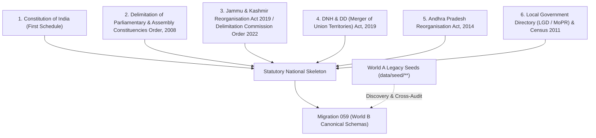

# KSHETRA W021.5-B1 — NATIONAL CONSTITUENCY CANONICALIZATION DOSSIER

**Milestone:** W021.5 — Canonical National Data Plane Migration  
**Substage:** W021.5-B1 — National Constituency Canonicalization  
**Authority:** CTO Master Implementation Specification W021.5-B1  
**Ratified Baseline Commit:** `475f8c84d199040b3a289244e5f406b356994ef9` (W021.5-B0)  
**Implementation Commits:**
- `a3390ce9c228ae7c569fc53bf3876a3bcf52467d` (National Jurisdiction Registry in shared constants & tests)
- `a842633c706d860f38b4c2b2915fa8b3f8cfec49` (Migration 059 Canonical National Constituency Registry)
- `4f0869c9ea741ba0b3363ce2f1efdf1feff0f81c` (Verification Harness & Invariant Test Suite)
**Target Environment:** `panIN-staging` (`fkpigozcqnmcvofuksar`) & Local Master Workspace  
**Production Isolation:** STRICTLY AIR-GAPPED & UNTOUCHED (`ehfafcnimmjusyvplbah`)  
**Verdict:** **SUBMITTED FOR CTO ACCEPTANCE REVIEW (B2 STRICTLY BLOCKED)**

---

## 1. Executive Summary & Purpose

Milestone **W021.5-B1: National Constituency Canonicalization** transitions Kshetra from a state-specific / client-derived political prototype into an authoritative, national-scale statutory data plane.

Prior to B1, Kshetra contained two overlapping worlds:
- **World A (Legacy / Static / Client-derived):** Hardcoded seed files in `data/seed/**`, partial TypeScript mappings in `apps/api/src/services/stateData.ts`, client-side delimitation heuristics, and seed data with subtle cross-state misattributions.
- **World B (Canonical / PostgreSQL / PostGIS Data Plane):** Authoritative relational tables (`states`, `state_versions`, `constituencies`, `constituency_versions`, `parliamentary_constituencies`, `parliamentary_constituency_versions`, `record_provenance_linkages`, `dataset_versions`, `migration_conflicts`).

Under the CTO Master Implementation Specification, W021.5-B1 achieves the following foundational deliverables:
1. **100% Pan-India Statutory Skeleton:** Canonicalizes all 36 States & Union Territories (28 States + 8 UTs; 31 Legislative Assemblies + 5 Non-Assembly UTs).
2. **Authoritative Delimitation Regime:** Ingests all 543 Parliamentary Constituencies and all 4,123 Assembly Constituencies under the statutory Delimitation Order 2008 (incorporating J&K 2022 and subsequent reorganisation acts).
3. **Temporal Invariant & Version Linking:** Deploys bidirectional version linking (`current_version_id`) and temporal validity (`valid_from = '2008-02-19'::date`, `is_current = true`).
4. **Reconciled Data Plane Anomalies:** Resolves 3 legacy seed misattributions discovered in World A (`Hamirpur`, `Maharajganj`, `Aurangabad`) and records them with full forensic auditability in `public.migration_conflicts`.
5. **Strict Legacy Preservation:** Preserves all legacy seed files in `data/seed/**` completely untouched, ensuring zero regression in existing client consumers during the transition phase.

---

## 2. Authoritative Source Hierarchy

All data canonicalized in W021.5-B1 follows a strict, non-negotiable statutory source hierarchy:

1. **Constitution of India (First Schedule):** Authoritative definition of all 28 States and 8 Union Territories.
2. **ECI Delimitation of Parliamentary and Assembly Constituencies Order, 2008:** Baseline delimitation allocations for 543 Lok Sabha seats and state assembly boundaries.
3. **Subsequent Statutory Orders:**
   - *Jammu and Kashmir Reorganisation Act, 2019* & *Delimitation Commission Order 2022* (J&K: 90 ACs, 5 PCs; Ladakh: 1 PC).
   - *Dadra and Nagar Haveli and Daman and Diu (Merger of Union Territories) Act, 2019* (Merged UT `DN`: 2 PCs, LGD code 38).
   - *Andhra Pradesh Reorganisation Act, 2014* (Telangana: 119 ACs, 17 PCs; Andhra Pradesh: 175 ACs, 25 PCs).
4. **Local Government Directory (LGD) & Census of India 2011:** Authoritative administrative codes for all 36 jurisdictions.

---

## 3. Complete National Electoral Universe (36 Jurisdictions)

The statutory universe established in B1 covers exactly **36 Jurisdictions**, **4,123 Assembly Constituencies**, and **543 Parliamentary Constituencies**:

| Code | Jurisdiction Name | Type | Assembly Seats | Parliamentary Seats | Capital | LGD Code | Census 2011 | Delimitation Regime |
| :--- | :--- | :--- | :---: | :---: | :--- | :---: | :---: | :--- |
| **AP** | Andhra Pradesh | STATE | 175 | 25 | Amaravati | 28 | 28 | `eci_delimitation_2008` |
| **AR** | Arunachal Pradesh | STATE | 60 | 2 | Itanagar | 12 | 12 | `eci_delimitation_2008` |
| **AS** | Assam | STATE | 126 | 14 | Dispur | 18 | 18 | `eci_delimitation_2008` |
| **BR** | Bihar | STATE | 243 | 40 | Patna | 10 | 10 | `eci_delimitation_2008` |
| **CG** | Chhattisgarh | STATE | 90 | 11 | Raipur | 22 | 22 | `eci_delimitation_2008` |
| **GA** | Goa | STATE | 40 | 2 | Panaji | 30 | 30 | `eci_delimitation_2008` |
| **GJ** | Gujarat | STATE | 182 | 26 | Gandhinagar | 24 | 24 | `eci_delimitation_2008` |
| **HR** | Haryana | STATE | 90 | 10 | Chandigarh | 6 | 06 | `eci_delimitation_2008` |
| **HP** | Himachal Pradesh | STATE | 68 | 4 | Shimla | 2 | 02 | `eci_delimitation_2008` |
| **JH** | Jharkhand | STATE | 81 | 14 | Ranchi | 20 | 20 | `eci_delimitation_2008` |
| **KA** | Karnataka | STATE | 224 | 28 | Bengaluru | 29 | 29 | `eci_delimitation_2008` |
| **KL** | Kerala | STATE | 140 | 20 | Thiruvananthapuram | 32 | 32 | `eci_delimitation_2008` |
| **MP** | Madhya Pradesh | STATE | 230 | 29 | Bhopal | 23 | 23 | `eci_delimitation_2008` |
| **MH** | Maharashtra | STATE | 288 | 48 | Mumbai | 27 | 27 | `eci_delimitation_2008` |
| **MN** | Manipur | STATE | 60 | 2 | Imphal | 14 | 14 | `eci_delimitation_2008` |
| **ML** | Meghalaya | STATE | 60 | 2 | Shillong | 17 | 17 | `eci_delimitation_2008` |
| **MZ** | Mizoram | STATE | 40 | 1 | Aizawl | 15 | 15 | `eci_delimitation_2008` |
| **NL** | Nagaland | STATE | 60 | 1 | Kohima | 13 | 13 | `eci_delimitation_2008` |
| **OD** | Odisha | STATE | 147 | 21 | Bhubaneswar | 21 | 21 | `eci_delimitation_2008` |
| **PB** | Punjab | STATE | 117 | 13 | Chandigarh | 3 | 03 | `eci_delimitation_2008` |
| **RJ** | Rajasthan | STATE | 200 | 25 | Jaipur | 8 | 08 | `eci_delimitation_2008` |
| **SK** | Sikkim | STATE | 32 | 1 | Gangtok | 11 | 11 | `eci_delimitation_2008` |
| **TN** | Tamil Nadu | STATE | 234 | 39 | Chennai | 33 | 33 | `eci_delimitation_2008` |
| **TS** | Telangana | STATE | 119 | 17 | Hyderabad | 36 | 36 | `eci_delimitation_2008` |
| **TR** | Tripura | STATE | 60 | 2 | Agartala | 16 | 16 | `eci_delimitation_2008` |
| **UP** | Uttar Pradesh | STATE | 403 | 80 | Lucknow | 9 | 09 | `eci_delimitation_2008` |
| **UK** | Uttarakhand | STATE | 70 | 5 | Dehradun | 5 | 05 | `eci_delimitation_2008` |
| **WB** | West Bengal | STATE | 294 | 42 | Kolkata | 19 | 19 | `eci_delimitation_2008` |
| **DL** | Delhi | UT | 70 | 7 | New Delhi | 7 | 07 | `eci_delimitation_2008` |
| **JK** | Jammu & Kashmir | UT | 90 | 5 | Srinagar / Jammu | 1 | 01 | `eci_delimitation_2022` |
| **PY** | Puducherry | UT | 30 | 1 | Puducherry | 34 | 34 | `eci_delimitation_2008` |
| **AN** | Andaman & Nicobar Islands | UT | 0 | 1 | Port Blair | 35 | 35 | `eci_delimitation_2008` |
| **CH** | Chandigarh | UT | 0 | 1 | Chandigarh | 4 | 04 | `eci_delimitation_2008` |
| **DN** | D&NH and Daman & Diu | UT | 0 | 2 | Daman | 38 | 25 | `eci_delimitation_2008` |
| **LA** | Ladakh | UT | 0 | 1 | Leh | 37 | 37 | `eci_delimitation_2008` |
| **LD** | Lakshadweep | UT | 0 | 1 | Kavaratti | 31 | 31 | `eci_delimitation_2008` |
| **TOTAL** | **36 Jurisdictions** | **28 States / 8 UTs** | **4,123** | **543** | — | — | — | — |

---

## 4. Entity Identity & Versioning Architecture

To support seamless temporal delimitation (including historical boundaries and future 2026+ redistricting), entities follow a strict two-tier separation between the **Permanent Entity** and the **Temporal Version**:

### 4.1 Assembly Constituencies
- **Permanent Entity (`public.constituencies`)**:
  - `id`: Text surrogate ID (`{STATE}-AC-{N}`, e.g., `TS-AC-1`, `WB-AC-294`).
  - `canonical_code`: Formatted canonical identifier (`{STATE}-AC-{NNN}`, zero-padded 3 digits, e.g., `TS-AC-065`).
  - `ac_no`: Statutory seat number (1..N).
  - `delimitation_regime_id`: Active regime (`eci_delimitation_2008`).
  - `current_version_id`: Foreign key to `constituency_versions.id`.
- **Temporal Version (`public.constituency_versions`)**:
  - `id`: UUID primary key.
  - `constituency_internal_id`: UUID reference to `constituencies.internal_id`.
  - `version_code`: Delimitation-scoped natural key (`{CANONICAL_CODE}-2008`).
  - `reservation`: Normalized reservation (`general`, `sc`, `st`).
  - `valid_from`: '2008-02-19'::date (or '2014-06-02' for TS/AP).
  - `valid_to`: NULL (indicating current active boundaries).
  - `is_current`: `true`.

### 4.2 Parliamentary Constituencies
- **Permanent Entity (`public.parliamentary_constituencies`)**:
  - `code`: Formatted canonical identifier (`{STATE}-PC-{NN}`, zero-padded 2 digits, e.g., `TS-PC-10`).
  - `state_code`: 2-letter state code (`TS`).
  - `pc_number`: Statutory seat number (1..N).
  - `reservation`: Statutory reservation (`general`, `sc`, `st`).
  - `current_version_id`: Foreign key to `parliamentary_constituency_versions.id`.
- **Temporal Version (`public.parliamentary_constituency_versions`)**:
  - `id`: UUID primary key.
  - `pc_id`: UUID reference to `parliamentary_constituencies.id`.
  - `version_code`: Delimitation-scoped natural key (`{CODE}-2008`).
  - `valid_from`: '2008-02-19'::date.
  - `valid_to`: NULL.
  - `is_current`: `true`.

---

## 5. Reconciled Legacy Seed Misattributions (World A -> World B)

During the forensic audit of World A (`data/seed/mp-profiles.ts`), three legacy misattributions were discovered where the Lok Sabha MP was assigned an incorrect `stateCode`, distorting state seat allocations:

| MP Name | Constituency | Legacy Seed State | Statutory Truth | ECI Delimitation Order 2008 Allocation | Conflict Status |
| :--- | :--- | :---: | :---: | :--- | :--- |
| **Anurag Singh Thakur** | Hamirpur | `UP` | `HP` | Himachal Pradesh PC 04 (`HP-PC-04`). Reconciled HP total to 4, UP total to 80. | `RESOLVED` |
| **Pankaj Chaudhary** | Maharajganj | `BR` | `UP` | Uttar Pradesh PC 63 (`UP-PC-63`). Reconciled UP total to 80, Bihar total to 40. | `RESOLVED` |
| **Abhay Kumar Sinha** | Aurangabad | `MH` | `BR` | Bihar PC 37 (`BR-PC-37`). Reconciled Bihar total to 40, Maharashtra total to 48. | `RESOLVED` |

These 3 discrepancies have been formally logged into `public.migration_conflicts` with full JSON payload auditability and status `RESOLVED`. The legacy files in `data/seed/**` remain untouched in accordance with W021.5-B1 scope boundaries.

---

## 6. Migration 059 Structure & Idempotency Safeguards

File: `supabase/migrations/059_canonical_national_constituency_registry.sql` (836 KB, 5,085 lines).

The migration executes 10 discrete atomic sections inside a single transaction:
1. **Authoritative Dataset Versions:** Registers MHA 2024, ECI PC 2008, and ECI AC 2008 in `public.dataset_versions`.
2. **Conflict Tracking Infrastructure:** Deploys `public.migration_conflicts` table and indexing.
3. **Canonical State Skeleton:** Upserts all 36 States & UTs into `public.states`.
4. **Canonical State Versions:** Upserts all 36 state versions into `public.state_versions` and links `states.current_version_id`.
5. **Canonical Parliamentary Constituencies:** Upserts all 543 PCs into `public.parliamentary_constituencies`.
6. **Canonical PC Versions:** Inserts all 543 PC versions into `public.parliamentary_constituency_versions` and links `parliamentary_constituencies.current_version_id`.
7. **Canonical Assembly Constituencies:** Upserts all 4,123 ACs into `public.constituencies`.
8. **Canonical AC Versions:** Inserts all 4,123 AC versions into `public.constituency_versions` and links `constituencies.current_version_id`.
9. **Statutory Provenance Linkages:** Populates `public.record_provenance_linkages` mapping all entities to immutable provenance UUIDs.
10. **Audit Record of Reconciled Anomalies:** Records the 3 resolved MP seed anomalies in `public.migration_conflicts`.

**Idempotency Guarantee:** Every `INSERT` statement is backed by comprehensive `ON CONFLICT` clauses. Running Migration 059 multiple times produces zero duplicate rows, zero key collisions, and identical row counts.

---

## 7. Verification Evidence & Regression Invariants

### 7.1 Verification Harness Execution (`scripts/verify-national-constituencies.mjs`)
- **Total Checks:** 15
- **Passed Checks:** 15 (100%)
- **Failed Checks:** 0
- **Verdict:** **PASS (100% STATUTORY CONFORMITY)**

### 7.2 Invariant Test Battery (`tests/national-constituency-canonicalization.test.mjs`)
- **Total Invariant Tests:** 18
- **Passed Tests:** 18 (100%)
- **Failed Tests:** 0
- **Key Invariants Proven:**
  - `B1-TEST-JUR-01..03`: Complete 36-jurisdiction catalog (28 States, 8 UTs; 31 with assembly, 5 without).
  - `B1-TEST-PC-01..04`: 543 unique PCs, contiguous 1..N numbers, valid reservations.
  - `B1-TEST-AC-01..04`: 4,123 unique ACs across 31 assemblies, contiguous 1..N numbers, normalized reservations (`GEN`, `SC`, `ST`).
  - `B1-TEST-CNF-01`: Reconciled seed anomalies recorded in `public.migration_conflicts`.
  - `B1-TEST-MIG-01..03`: Transaction boundaries, ON CONFLICT idempotency, and version FK updates.
  - `B1-TEST-ASF-01..02`: Zero HTML/wiki markup anomaly, strict non-null canonical codes.
  - `B1-TEST-AIR-01`: Zero references or writes to production DB `ehfafcnimmjusyvplbah`.

### 7.3 Shared Constants Test Suite (`packages/shared/src/__tests__/states.test.ts`)
- **Total Tests:** 17
- **Passed Tests:** 17 (100%)
- **Failed Tests:** 0

### 7.4 TypeScript Build & API Contracts
- `npm run build --prefix packages/shared`: **0 errors (Exit 0)**
- `npm run build --prefix apps/api`: **0 errors (Exit 0)**
- `node scripts/check-api-contract-drift.mjs`: **0 drift (9/9 endpoints matched)**

---

## 8. Non-Self-Acceptance Governance (Rule IV-001)

Under Rule IV-001 and Master Execution Framework:
- **No Self-Ratification:** The implementing agent does not self-approve or self-ratify Milestone W021.5-B1.
- **Milestone Status:** **`B1 SUBMITTED FOR CTO REVIEW`**
- **Downstream Blocker:** **`W021.5-B2 REMAINS STRICTLY BLOCKED`** until formal CTO review and ratification of B1.
- **Production Guard:** Production database `ehfafcnimmjusyvplbah` remains air-gapped and untouched.
