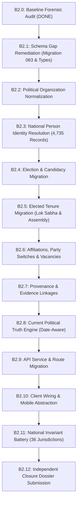

# W021.5-B2 BASELINE FORENSIC AUDIT & REPOSITORY VERIFICATION

**Milestone:** W021.5-B2 Phase B2.0 (Baseline Forensic Audit)  
**Repository:** `kshetra-app/Kshetra`  
**Execution Timestamp:** 2026-10-03T10:55:00Z  
**Parent Gate:** W021.5-B1-FINAL  
**Baseline Git Coordinates:**  
- `git rev-parse HEAD`: `9a62966fe0976343a54a89507bd38690f7a2d6d8`  
- `git rev-parse origin/master`: `9a62966fe0976343a54a89507bd38690f7a2d6d8`  
- Working Tree State: Clean (0 untracked modifications, 0 unstaged diffs)  
- Parent Baseline: `93df63cc5e3ea0d125dd4a5aa4424e3ea98bb48c` (B2 pre-flight submission commit)  
**Governance:** Master Execution Framework Rule IV-001  
**Production Air-Gap:** `ehfafcnimmjusyvplbah` **UNTOUCHED / AIR-GAPPED**  

---

## 1. PURPOSE & MANDATE

Under Section 2 of CTO Directive W021.5-B2:
> "Before modifying application code or performing any migration... Re-check the actual repository schema and code before implementing against any claimed table/column/function. Identify any discrepancy between B2 pre-flight documentation, actual migrations, actual TypeScript types, actual API consumers, and actual seed structures."

This forensic audit evaluates the actual physical codebase, establishes the inventory of existing political entities, identifies every schema gap, and defines the remediation requirements before any data migration script is executed.

---

## 2. INVENTORY OF EXISTING CANONICAL POLITICAL SCHEMA (SQL MIGRATIONS)

The repository has 62 migrations (`001` through `062`). Political entities and election records are defined primarily in Migrations **050**, **051**, and **059**:

### 2.1 Existing Tables & Structure
| Table Name | Defined In | Primary Key | Key Foreign Keys | Indexes | Immutability Triggers |
|---|---|---|---|---|---|
| `public.canonical_persons` | `050` | `UUID` (PK) | `provenance_id -> provenance_records`, `primary_user_id -> auth.users` | `name`, `status`, `eci_id`, `sansad_id` | No |
| `public.political_organizations` | `050` | `TEXT` (`ORG-PARTY-...`) | `headquarters_state -> states.code`, `parent_org_id -> political_organizations.id` | `type`, `short_name`, `ec_party_code` | No |
| `public.organization_relationships` | `050` | `UUID` (PK) | `source_org_id`, `target_org_id -> political_organizations.id` | `source`, `target`, `type`, `current` | No |
| `public.person_roles` | `050` | `UUID` (PK) | `person_id -> canonical_persons.id`, `organization_id -> political_organizations.id` | `person`, `type`, `rel`, `org`, `current` | No |
| `public.person_party_affiliations` | `050` | `UUID` (PK) | `person_id -> canonical_persons.id`, `party_id -> political_organizations.id` | `person`, `party`, `dates` | No |
| `public.candidacies` | `050`, `051` | `UUID` (PK) | `person_id -> canonical_persons.id`, `party_id -> political_organizations.id`, `contest_id -> election_contests.id` | `person`, `election`, `constituency`, `party` | `trg_candidacies_immutable_fields` (party_id, person_id, election frozen) |
| `public.elected_tenures` | `050` | `UUID` (PK) | `person_id -> canonical_persons.id`, `party_at_election -> political_organizations.id`, `candidacy_id -> candidacies.id` | `person`, `office`, `jurisdiction`, `current` | `trg_elected_tenures_immutable_fields` (party_at_election, person, jurisdiction frozen) |
| `public.tenure_party_switches` | `050` | `UUID` (PK) | `tenure_id -> elected_tenures.id`, `person_id -> canonical_persons.id`, `from_party_id`, `to_party_id -> political_organizations.id` | `tenure`, `person`, `date` | No |
| `public.election_events` | `051` | `UUID` (PK) | `provenance_id -> provenance_records.id` | `state`, `year_type`, `code` | No |
| `public.election_contests` | `051` | `UUID` (PK) | `election_id -> election_events.id`, `constituency_id -> constituencies.id`, `winning_candidacy_id -> candidacies.id` | `election`, `constituency`, `code`, `winning` | No |
| `public.ballot_choices` | `051` | `UUID` (PK) | `contest_id -> election_contests.id` | `contest`, `code` | No |
| `public.candidate_affidavits` | `008`, `050` | `UUID` (PK) | `provenance_id -> provenance_records.id` | `candidate_id` | No |
| `public.migration_conflicts` | `059` | `UUID` (PK) | `candidate_canonical_id` | `status`, `entity_type` | No |

---

## 3. DISCREPANCIES BETWEEN PRE-FLIGHT DOSSIER & ACTUAL REPOSITORY SCHEMA

A rigorous line-by-line inspection reveals **6 critical schema gaps** between the conceptual model designed in pre-flight and the actual SQL migrations currently committed:

### 3.1 Gap 1: `person_multilingual_identities` is Missing in SQL
- **Claimed in Pre-Flight:** A dedicated table `person_multilingual_identities` storing native Indian scripts (`te`, `hi`, `ta`, `bn`, etc.) and multi-representation variants (`OFFICIAL`, `PREFERRED`, `SOURCE_NATIVE`, `TRANSLITERATION`, `ALIAS`, `HISTORICAL`).
- **Actual Reality:** Does **NOT** exist in any migration file.
- **Required Remediation:** Must be created in Migration 063 with columns: `id`, `person_id`, `language_code`, `script_code`, `representation_type`, `representation_value`, `is_preferred`, `is_official`, `valid_from`, `valid_to`, `source`, `provenance_id`.

### 3.2 Gap 2: `tenure_vacancies` is Missing in SQL
- **Claimed in Pre-Flight:** A first-class table `tenure_vacancies` storing formal vacancy events (`DEATH`, `RESIGNATION`, `DISQUALIFICATION`, `ELECTION_ANNULLED`).
- **Actual Reality:** Does **NOT** exist in any migration file.
- **Required Remediation:** Must be created in Migration 063 with columns: `id`, `tenure_id`, `person_id`, `vacancy_reason`, `effective_date`, `notifying_authority`, `gazette_notification_ref`, `notes`, `data_status`, `provenance_id`.

### 3.3 Gap 3: Missing Explicit Status on `elected_tenures`
- **Current Migration 050 Schema:** `elected_tenures` only has `is_current BOOLEAN NOT NULL DEFAULT true`.
- **Defect:** Does not distinguish whether a non-current tenure was ended by `TERM_COMPLETED`, `RESIGNED`, `DECEASED`, `DISQUALIFIED`, or `ANNULLED`.
- **Required Remediation:** Add column `tenure_status TEXT NOT NULL DEFAULT 'ACTIVE' CHECK (tenure_status IN ('ACTIVE', 'COMPLETED', 'VACATED_RESIGNATION', 'VACATED_DEATH', 'VACATED_DISQUALIFICATION', 'ANNULLED', 'PROVISIONAL'))`.

### 3.4 Gap 4: Typing of Constituency Linkages on `elected_tenures` and `candidacies`
- **Current Migration 050 Schema:** `candidacies.constituency_id TEXT NOT NULL` and `elected_tenures.jurisdiction_id TEXT NOT NULL`.
- **Constituencies Reality (Migration 059):** In `public.constituencies`, `id` is `'AP-AC-1'`, `'TS-AC-65'` and `canonical_code` is `'AP-AC-001'`, `'TS-AC-065'`.
- **Required Remediation:** Enforce foreign key constraints linking `candidacies.constituency_id` to `public.constituencies(id)` or `canonical_code` and ensure consistent join keys across the API service layer.

### 3.5 Gap 5: Rajya Sabha Jurisdiction Semantics
- **Current Schema:** `elected_tenures.jurisdiction_type` is checked for `parliamentary_constituency`, `assembly_constituency`, `urban_local_body`, etc.
- **Defect:** Rajya Sabha members do not represent a Parliamentary Constituency. Under Article 80, they represent a State or Union Territory (or are Nominated).
- **Required Remediation:** Update `jurisdiction_type` check constraint to include `'state'` and `'nominated'` for `office_type = 'mp_rajya_sabha'`.

### 3.6 Gap 6: TypeScript Contract Synchronization
- `@kshetra/shared` (`packages/shared/src/types/politicalEntities.ts`) does not yet include TypeScript interfaces for `PersonMultilingualIdentity` and `TenureVacancy`.
- **Required Remediation:** Export `PersonMultilingualIdentity` and `TenureVacancy` contracts in `@kshetra/shared`.

---

## 4. INVENTORY OF LEGACY WORLD-A POLITICAL DATA ASSETS

| Category | File Path | Record Count | Representation Semantics |
|---|---|---|---|
| **MLA Profiles** | `data/seed/*-mla-profiles.ts` (31 files) | **4,050 actual profiles** | Scraped MyNeta objects with `acNo`, `name`, `party`, `criminalCases`, `totalAssets`, `education` |
| **MP Profiles** | `data/seed/mp-profiles.ts` (1 file) | **685 total profiles** | 543 Lok Sabha MPs + 142 Rajya Sabha MPs with `id`, `name`, `party`, `house`, `constituency` |
| **Constituency Seeds** | `data/seed/*-constituencies.ts` (31 files) | **4,123 constituencies** | Contains static `winnerName2023`, `winnerName2024`, `winner2023`, `currentParty` fields |
| **Election History** | `data/seed/elections/*.ts` & `*-election-history.ts` (39 files) | **~139 election cycles** | Historical election turnout and party seat tallies |
| **Mobile Stores** | `apps/mobile/stores/affidavits.ts` | 5 static seed affidavits | Hardcoded local affidavit stores |
| **Mobile Dispatcher** | `apps/mobile/lib/stateDataDispatcher.ts` | — | Dispatches to legacy seed functions (e.g. `getTSMLA`, `getAPMLAProfile`) |
| **API Legacy Service** | `apps/api/src/services/stateData.ts` | — | Maps state seeds into `ConstituencyBrief` using fallback chains: `winner2024 ?? winner2023 ?? ...` |

---

## 5. EXISTING SERVICES & RUNTIME CONSUMERS

1. **`apps/api/src/services/politicalEntityService.ts`:**
   - Implements data access methods: `getPersonById`, `searchEntities`, `getPersonTimeline`, `getLegislatorRoster`, `getOrganizationById`, `createOrLinkPersonIdentity`.
   - **Limitation:** Does not yet implement date-aware current representative resolution or vacancy inspection.
2. **`apps/api/src/routes/politicalEntities.ts`:**
   - Exposes REST routes:
     - `GET /api/v1/political-entities/persons/:id`
     - `GET /api/v1/political-entities/persons/:id/timeline`
     - `GET /api/v1/political-entities/organizations/:id`
     - `GET /api/v1/political-entities/search`
     - `GET /api/v1/political-entities/roster/:officeType/:jurisdictionId`
3. **`apps/api/src/services/electionService.ts`:**
   - Implements election events, contests, and candidacies queries.

---

## 6. DUPLICATE AND STALE RUNTIME REPRESENTATIONS

1. **`apps/api/src/services/stateData.ts`:**
   - `genericToBrief(stateCode, c)` queries static fields:
     `currentParty: c.winner2024 ?? c.winner2023 ?? c.winner2022 ?? c.winner2021 ?? c.winner ?? ''`
     `currentMLA: c.winnerName2024 ?? c.winnerName2023 ?? c.winnerName2022 ?? c.winnerName2021 ?? c.winnerName ?? ''`
   - Must be migrated in Phase B2.9 to query `politicalEntityService.getCurrentRepresentative()`.
2. **`apps/mobile/lib/stateDataDispatcher.ts`:**
   - Calls `getTSMLA()` and state-specific seed arrays.
   - Must be migrated in Phase B2.10 to query API representative endpoints.

---

## 7. MIGRATION ROADMAP & EXECUTION SEQUENCE

To remediate all identified gaps cleanly before writing data, the following phased sequence is established:



---

## 8. FORENSIC AUDIT VERDICT

```text
================================================================================
BASELINE FORENSIC AUDIT: COMPLETE & RECORDED
BASELINE SHA:            9a62966fe0976343a54a89507bd38690f7a2d6d8
WORKING TREE:            CLEAN
SCHEMA GAPS IDENTIFIED:  6 (person_multilingual_identities, tenure_vacancies,
                            tenure_status, RS jurisdiction, constituency typing,
                            shared TypeScript contracts)
ACTION AUTHORIZED:       PROCEED TO PHASE B2.1 (SCHEMA GAP REMEDIATION)
PRODUCTION STATUS:       STRICTLY AIR-GAPPED & UNTOUCHED
================================================================================
```
