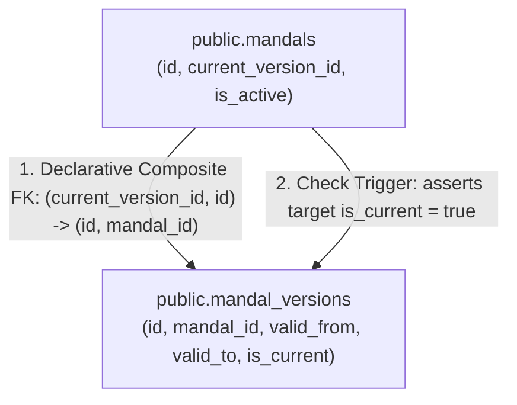

# W014: Mandal Temporal Version Model Preflight (CTO Revision)

**Authority:** Independent CTO / Co-founder Directive — W014 Mandal Version Preflight Correction Round  
**Status:** SUBMITTED FOR CTO REVIEW  
**Scope:** Architectural & Technical Preflight Design Only (Zero DDL Execution / Zero DB Mutations / Production Untouched)  
**Baseline Commit:** `2dabbf7dae4a76af56b831ca257f1b6d68d63b16`  
**Date:** September 2026  

---

## 1. Executive Summary & Authoritative Coordinates

In accordance with the **CTO Directive on W014 Mandal Version Preflight Corrections**, this document delivers the revised preflight design for the canonical W014 sub-district mandal temporal version model.

### Authoritative State Matrix

| Component | Status | Governance Authority |
|---|---|---|
| **W015 (Geography Relationship Engine)** | `ACCEPTED_COMPLETE` | Commit `4d99dd3` |
| **W015-B1 (Preflight Inspection)** | `ACCEPTED_COMPLETE` | Commit `4d99dd3` |
| **W015-B2 (Source Reconciliation)** | `ACCEPTED_COMPLETE` | Commit `4d99dd3` |
| **W016-A1 (Preflight Correction)** | `ACCEPTED` | Commit `1f8bde8` |
| **W016-B1 (Source Preflight)** | `ACCEPTED` | Commit `e240fc3` |
| **W016-B2 (Technical Spatial Rehearsal)** | `ACCEPTED_COMPLETE` | Commit `4beb9a7` |
| **W016-C1 (Candidate Acquisition)** | `ACCEPTED_COMPLETE` | Commit `46d4bcb` |
| **W016-C2 (Reconciliation Package)** | `ACCEPTED` | Commit `3d30640` |
| **W016-C3 (Geometry Preflight)** | `CONDITIONALLY_ACCEPTED` | Commit `8704afe` |
| **W014 Mandal Temporal Preflight** | `SUBMITTED_FOR_CTO_REVIEW` | This Document |
| **Migration 044 Execution** | `STRICTLY_NOT_AUTHORIZED` | Frozen |
| **Database Mutations / Ingestion** | `STRICTLY_NOT_AUTHORIZED` | Frozen |
| **Production Environment** | `STRICTLY_UNTOUCHED` | Air-Gapped |

---

## 2. Actual Existing W014 Architecture & Anchor Analysis

An inspection of Migration 041 (`041_geography_versioning_and_temporal_validity.sql`, Lines 369–395) reveals how W014 historically handled version pointers on stable anchor entities:

```sql
-- Migration 041 Historical Pattern (states, districts, pcs, constituencies)
ALTER TABLE public.states
  ADD COLUMN IF NOT EXISTS current_version_id UUID REFERENCES public.state_versions(id) ON DELETE SET NULL,
  ADD COLUMN IF NOT EXISTS valid_from DATE DEFAULT '2014-06-02',
  ADD COLUMN IF NOT EXISTS valid_to DATE,
  ADD COLUMN IF NOT EXISTS is_current BOOLEAN DEFAULT true;

ALTER TABLE public.districts
  ADD COLUMN IF NOT EXISTS current_version_id UUID REFERENCES public.district_versions(id) ON DELETE SET NULL,
  ADD COLUMN IF NOT EXISTS valid_from DATE DEFAULT '2016-10-11',
  ADD COLUMN IF NOT EXISTS valid_to DATE,
  ADD COLUMN IF NOT EXISTS is_current BOOLEAN DEFAULT true,
  ADD COLUMN IF NOT EXISTS predecessor_district_id UUID REFERENCES public.districts(id) ON DELETE SET NULL;
```

### Critical Findings on Migration 041:
1. **Unconstrained Foreign Key Weakness:** Migration 041 added `current_version_id` as a plain nullable foreign key. A plain foreign key in PostgreSQL enforces only that the target UUID exists in the version table; it **cannot declaratively verify** that:
   - The version belongs to the *same* anchor entity (e.g. preventing a district from pointing to another district's version);
   - The target version has `is_current = true`.
2. **Duplicate Temporal Truth:** Migration 041 duplicated `valid_from`, `valid_to`, and `is_current` across both anchor tables and version tables. For mandals, replicating statutory dates (`valid_from`, `valid_to`) on the anchor creates competing sources of truth whenever a mandal is reorganised or renamed.

---

## 3. Current Version Integrity Design (`mandals.current_version_id`)

To eliminate the unconstrained foreign key gap without introducing an untracked parallel system, mandal versioning introduces a **two-layer database integrity guarantee**:



### Layer 1: Declarative Composite Foreign Key (Same-Anchor Guarantee)
In `public.mandal_versions`, a unique constraint pairs the version ID with its mandal anchor:
```sql
CONSTRAINT uq_mandal_versions_id_mandal UNIQUE (id, mandal_id)
```
On `public.mandals`, the foreign key is defined over the composite pair:
```sql
CONSTRAINT fk_mandals_current_version_same_anchor
  FOREIGN KEY (current_version_id, id) 
  REFERENCES public.mandal_versions(id, mandal_id) 
  ON DELETE SET NULL
```
- **Engine Guarantee:** PostgreSQL natively rejects any update where `current_version_id` references a version belonging to any other mandal. Cross-entity assignment is physically impossible.

### Layer 2: Database Check Trigger (Active Status Guarantee)
A lightweight trigger on `public.mandals` asserts that the referenced version is actively current:
```sql
CREATE OR REPLACE FUNCTION public.fn_guard_mandal_current_version()
RETURNS TRIGGER AS $$
BEGIN
  IF NEW.current_version_id IS NOT NULL THEN
    IF NOT EXISTS (
      SELECT 1 FROM public.mandal_versions mv
      WHERE mv.id = NEW.current_version_id
        AND mv.mandal_id = NEW.id
        AND mv.is_current = true
    ) THEN
      RAISE EXCEPTION 'INTEGRITY VIOLATION: current_version_id % must point to an active version (is_current = true) for mandal %',
        NEW.current_version_id, NEW.id;
    END IF;
  END IF;
  RETURN NEW;
END;
$$ LANGUAGE plpgsql;

CREATE TRIGGER trg_guard_mandal_current_version
  BEFORE INSERT OR UPDATE OF current_version_id ON public.mandals
  FOR EACH ROW
  EXECUTE FUNCTION public.fn_guard_mandal_current_version();
```

---

## 4. Single Source of Temporal Truth: Field Ownership

To eliminate competing sources of truth, field ownership is partitioned cleanly between the stable anchor and the temporal version table:

### 4.1 Stable Anchor Table (`public.mandals`)
Holds only institutional existence and routing pointers:
- `id TEXT PRIMARY KEY`: Immutable canonical identifier (e.g. `'TS-MDL-5321'`).
- `current_version_id UUID`: Foreign key pointer to the active version row.
- `is_active BOOLEAN NOT NULL DEFAULT true`: Institutional operational status (toggled to `false` only if the mandal is permanently abolished).
- `state_code TEXT NOT NULL REFERENCES states(code)`: Immutable state jurisdiction.
- `type TEXT NOT NULL DEFAULT 'mandal'`: Regional administrative designation.
- **PROHIBITED:** `valid_from` and `valid_to` are **strictly prohibited** on `public.mandals`. Statutory date intervals belong exclusively to the version table.

### 4.2 Temporal Version Table (`public.mandal_versions`)
Holds all mutable administrative attributes and exact statutory dates:
- `id UUID PRIMARY KEY`: Surrogate version key.
- `mandal_id TEXT NOT NULL REFERENCES public.mandals(id)`: Stable anchor key.
- `district_id UUID NOT NULL REFERENCES public.districts(id)`: Captures temporal district reorganisations (e.g. transfers to Mulugu or Narayanpet).
- `version_code VARCHAR(50) NOT NULL UNIQUE`: Canonical version identifier.
- `name TEXT NOT NULL`: Statutory name during this interval.
- `lgd_code INTEGER`: Local Government Directory code during this interval.
- `valid_from DATE NOT NULL`: Enactment date of this version.
- `valid_to DATE`: Supersession or abolition date (`NULL` if current).
- `is_current BOOLEAN NOT NULL DEFAULT false`: **Fail-closed active flag**.
- `primary_dataset_version_id TEXT NOT NULL REFERENCES public.dataset_versions(id)`.
- `metadata JSONB NOT NULL DEFAULT '{}'::jsonb`: Gazette order reference and legal audit notes.

---

## 5. Fail-Closed Currentness Default

In accordance with CTO Directive Item 3, the default value for `is_current` on `public.mandal_versions` is defined as:
```sql
is_current BOOLEAN NOT NULL DEFAULT false
```
- **Rationale:** A fail-closed default ensures that any unverified, candidate, or historical row inserted into `mandal_versions` will **never accidentally become active** merely because an `INSERT` statement omitted the column.
- **Authorization Barrier:** Elevation to `is_current = true` requires an explicit, verified administrative statement satisfying the currentness invariant (`valid_to IS NULL`).

---

## 6. Temporal Semantics & Calendar Independence

1. **Non-Overlapping GiST Exclusion:**
   ```sql
   CONSTRAINT uq_mandal_versions_no_overlap EXCLUDE USING gist (
     mandal_id WITH =,
     (daterange(valid_from, valid_to, '[)')) WITH &&
   )
   ```
2. **Calendar-Independent Currentness Check:** Zero occurrences of `CURRENT_DATE`:
   ```sql
   CONSTRAINT chk_mandal_versions_current_invariants CHECK (
     (is_current = false) OR (is_current = true AND valid_to IS NULL)
   )
   ```
3. **Single-Current Partial Unique Index:**
   ```sql
   CREATE UNIQUE INDEX uq_mandal_versions_single_current 
     ON public.mandal_versions (mandal_id) 
     WHERE is_current = true;
   ```

---

## 7. Evidence-Qualified Treatment of the 23 Discrepancies

The preflight reframes the 23-mandal discrepancy identified in W016-C2 strictly as **empirical source observations**, not authoritative historical reality:

> **Finding:** W016-C2 identified 23 discrepancies between the acquired 589-feature TGRAC candidate layer and the current statutory 612-mandal total.

### Categorized Evidence Status:
1. **Verified Statutory Reorganisations (Gazette Documented):**
   - **Masaipet Mandal (Medak District):** Statutory creation under G.O.Ms.No. 110, Revenue (DA) Dept, dated 2020 (carved out of Yeldurthy / Chegunta).
   - **13 Mandals Created September 2022:** Endapalli, Bheemaram (Jagtial), Nizampet, Gattuppal, Seerole, Inugurthy, Akbarpet-Bhoompally, Kukunoorpally, Dongli, Koukuntla, Aloor, Donkeshwar, Saloora (Statutory notification in Telangana Gazette, September 2022).
   - *Treatment:* When historical versions are formally seeded, these entities receive explicit statutory `valid_from` dates matching their respective Gazette enactments.
2. **Chronology Unresolved (`UNK-16-01` Preserved):**
   - **9 Remaining Mandals:** Gundumal, Kothapalle, Dudyal, Sonala, Kothapalligori, Irwin, Bheemaram (Mancherial), Adilabad Rural, Nirmal Rural.
   - *Treatment:* Classified as `UNKNOWN / UNVERIFIED` until primary Gazette notifications are added to repo evidence registers.
3. **Quarantine Invariants:**
   - **Zero 2016 Versions:** No 2016 historical versions are fabricated for any of these 23 mandals.
   - **Zero Geometry Fabrication:** No synthetic polygon splits or artificial boundaries are inferred.
   - **Zero Statutory Inferences:** No inferred aggregation or containment is injected into `public.mandal_constituency_map`.

---

## 8. Preserving the 589 Historical TGRAC Snapshot

- **Regime Window:** `[2016-10-11, 2022-09-01)` (representing the October 2016 31-district reorganisation baseline).
- **Snapshot Representation:** The 589 mandals confirmed present in the 2016 baseline will be represented in `public.mandal_versions` with:
  - `valid_from = '2016-10-11'`
  - `valid_to = '2022-09-01'`
  - `is_current = false`
- **Future W016 Attachment Target:** When Migration 044 is authorized, `public.entity_geometries.mandal_version_id` will bind directly to these historical version UUIDs.

---

## 9. Proposed DDL Specification for Future W014 Extension

> [!CAUTION]
> **DESIGN ONLY — NOT AUTHORIZED FOR IMPLEMENTATION.**  
> The following DDL represents the complete technical design for a future W014 mandal versioning migration. It must NOT be executed or placed in `supabase/migrations/` until authorized by the CTO.

```sql
-- ==============================================================================
-- W014 Prerequisite: Mandal Temporal Versioning (DESIGN ONLY)
-- Status: DESIGN ONLY — NOT AUTHORIZED FOR IMPLEMENTATION
-- Target: Staging Supabase
-- ==============================================================================

BEGIN;

-- ─── 1. CREATE MANDAL VERSIONS TABLE ───────────────────────────────────────────

CREATE TABLE IF NOT EXISTS public.mandal_versions (
  id UUID PRIMARY KEY DEFAULT gen_random_uuid(),
  mandal_id TEXT NOT NULL REFERENCES public.mandals(id) ON DELETE RESTRICT,
  district_id UUID NOT NULL REFERENCES public.districts(id) ON DELETE RESTRICT,
  version_code VARCHAR(50) NOT NULL,
  name TEXT NOT NULL,
  name_te TEXT,
  headquarters TEXT,
  lgd_code INTEGER,
  census_code_2011 VARCHAR(20),
  valid_from DATE NOT NULL,
  valid_to DATE,
  is_current BOOLEAN NOT NULL DEFAULT false, -- Fail-closed default
  primary_dataset_version_id TEXT NOT NULL REFERENCES public.dataset_versions(id) ON DELETE RESTRICT,
  metadata JSONB NOT NULL DEFAULT '{}'::jsonb,
  created_at TIMESTAMPTZ NOT NULL DEFAULT now(),
  updated_at TIMESTAMPTZ NOT NULL DEFAULT now(),

  -- Unique version code
  CONSTRAINT uq_mandal_versions_code UNIQUE (version_code),

  -- Composite unique key to support composite FK from mandals
  CONSTRAINT uq_mandal_versions_id_mandal UNIQUE (id, mandal_id),

  -- Temporal non-overlapping interval exclusion
  CONSTRAINT uq_mandal_versions_no_overlap EXCLUDE USING gist (
    mandal_id WITH =,
    (daterange(valid_from, valid_to, '[)')) WITH &&
  ),

  -- Calendar-independent currentness check
  CONSTRAINT chk_mandal_versions_current_invariants CHECK (
    (is_current = false) OR (is_current = true AND valid_to IS NULL)
  )
);

-- ─── 2. INDEXING ───────────────────────────────────────────────────────────────

CREATE INDEX IF NOT EXISTS idx_mandal_versions_mandal_id ON public.mandal_versions(mandal_id);
CREATE INDEX IF NOT EXISTS idx_mandal_versions_district_id ON public.mandal_versions(district_id);
CREATE INDEX IF NOT EXISTS idx_mandal_versions_dataset ON public.mandal_versions(primary_dataset_version_id);
CREATE INDEX IF NOT EXISTS idx_mandal_versions_current ON public.mandal_versions(mandal_id) WHERE is_current = true;

CREATE UNIQUE INDEX IF NOT EXISTS uq_mandal_versions_single_current 
  ON public.mandal_versions (mandal_id) 
  WHERE is_current = true;

-- ─── 3. ENHANCE MANDALS ANCHOR (INTEGRITY HARDENED) ────────────────────────────

ALTER TABLE public.mandals
  ADD COLUMN IF NOT EXISTS current_version_id UUID,
  ADD COLUMN IF NOT EXISTS is_active BOOLEAN NOT NULL DEFAULT true;

-- Enforce same-anchor composite FK
ALTER TABLE public.mandals
  DROP CONSTRAINT IF EXISTS fk_mandals_current_version_same_anchor;

ALTER TABLE public.mandals
  ADD CONSTRAINT fk_mandals_current_version_same_anchor
  FOREIGN KEY (current_version_id, id)
  REFERENCES public.mandal_versions(id, mandal_id)
  ON DELETE SET NULL;

CREATE INDEX IF NOT EXISTS idx_mandals_current_version_id ON public.mandals(current_version_id);

-- Enforce active-version check trigger
CREATE OR REPLACE FUNCTION public.fn_guard_mandal_current_version()
RETURNS TRIGGER AS $$
BEGIN
  IF NEW.current_version_id IS NOT NULL THEN
    IF NOT EXISTS (
      SELECT 1 FROM public.mandal_versions mv
      WHERE mv.id = NEW.current_version_id
        AND mv.mandal_id = NEW.id
        AND mv.is_current = true
    ) THEN
      RAISE EXCEPTION 'INTEGRITY VIOLATION: current_version_id % must point to an active version (is_current = true) for mandal %',
        NEW.current_version_id, NEW.id;
    END IF;
  END IF;
  RETURN NEW;
END;
$$ LANGUAGE plpgsql;

DROP TRIGGER IF EXISTS trg_guard_mandal_current_version ON public.mandals;
CREATE TRIGGER trg_guard_mandal_current_version
  BEFORE INSERT OR UPDATE OF current_version_id ON public.mandals
  FOR EACH ROW
  EXECUTE FUNCTION public.fn_guard_mandal_current_version();

-- ─── 4. ROW LEVEL SECURITY (RLS) ───────────────────────────────────────────────

ALTER TABLE public.mandal_versions ENABLE ROW LEVEL SECURITY;

DROP POLICY IF EXISTS "Public read mandal_versions" ON public.mandal_versions;
CREATE POLICY "Public read mandal_versions"
  ON public.mandal_versions FOR SELECT
  TO anon, authenticated
  USING (true);

DROP POLICY IF EXISTS "Service role write mandal_versions" ON public.mandal_versions;
CREATE POLICY "Service role write mandal_versions"
  ON public.mandal_versions FOR ALL
  TO service_role
  USING (true)
  WITH CHECK (true);

COMMIT;
```

---

## 10. Comprehensive Acceptance Matrix (Assertions A Through Q)

| Assertion | Requirement | Design Requirement | Future Runtime Verification |
|---|---|---|---|
| **A** | `mandal_versions` has a real FK to `mandals` | `mandal_id TEXT NOT NULL REFERENCES public.mandals(id) ON DELETE RESTRICT` | `INSERT` with non-existent `mandal_id` fails with Foreign Key Violation (`23503`). |
| **B** | Every `mandal_version` resolves to exactly one stable anchor | `NOT NULL` constraint on `mandal_id` ensures 100% resolution to `public.mandals` | `SELECT count(*) FROM mandal_versions mv LEFT JOIN mandals m ON mv.mandal_id = m.id WHERE m.id IS NULL;` returns strictly `0`. |
| **C** | Historical intervals cannot overlap for the same mandal | GiST exclusion constraint `uq_mandal_versions_no_overlap` on `(mandal_id WITH =, daterange WITH &&)` | Inserting overlapping date ranges for the same `mandal_id` raises Exclusion Violation (`23P01`). |
| **D** | Adjacent valid intervals are allowed | Half-open intervals `[valid_from, valid_to)` allow contiguous date boundaries | Inserting `[2016-10-11, 2022-09-01)` and `[2022-09-01, NULL)` succeeds cleanly without error. |
| **E** | Current version semantics match existing W014 patterns | Partial unique index `uq_mandal_versions_single_current` and check constraint `valid_to IS NULL` | Inserting a second `is_current = true` row for the same mandal raises Unique Violation (`23505`). |
| **F** | Historical 2016–2022 snapshot can attach to exact versions | Explicit historical version row with `valid_from = '2016-10-11'`, `valid_to = '2022-09-01'`, `is_current = false` | In future W016, `entity_geometries.mandal_version_id` joins cleanly to `mandal_versions` where `valid_to = '2022-09-01'`. |
| **G** | W015 relationships remain unchanged | `mandal_constituency_map` and `polling_booths` retain foreign keys to `public.mandals(id)` | MCM row count and integrity test suites pass 100% during version table creation. |
| **H** | No current legal mandal geometry without a W014 version | `entity_geometries.mandal_version_id` is mandatory for mandal geometries | Inserting mandal geometry without `mandal_version_id` fails with check/FK violation. |
| **I** | W012 provenance resolves where required | `primary_dataset_version_id REFERENCES dataset_versions(id)` with provenance DAG nodes | Relational joins from `mandal_versions` to `dataset_versions` and `provenance_records` resolve 100%. |
| **J** | No 589 geometry ingestion performed during this task | Scope strictly limited to preflight design; zero geometry tables created | Catalog queries confirm zero geometry tables or rows exist. |
| **K** | No 23 missing mandals fabricated | Missing 23 mandals remain absent from 2016 snapshot; no inferred aggregation in MCM | Audit confirms zero synthetic 2016 version rows and zero fabricated polygons. |
| **L** | Rollback does not destroy W012 governance history | Rollback drops `mandal_versions` only; W012 dataset and provenance records remain intact | Rollback script execution leaves `dataset_versions` and `provenance_records` untouched. |
| **M** | `current_version_id` integrity matches established W014 pattern | Composite FK `(current_version_id, id)` and trigger `fn_guard_mandal_current_version()` | Setting `current_version_id` to a version belonging to a different mandal raises Foreign Key Violation (`23503`). |
| **N** | Stable mandal anchor does not contain duplicate temporal truth | `valid_from` and `valid_to` live exclusively on `mandal_versions`; anchor holds only `current_version_id` and `is_active` | Information schema audit confirms `valid_from` and `valid_to` do not exist on `public.mandals`. |
| **O** | `mandal_versions` defaults `is_current = false` | Column definition: `is_current BOOLEAN NOT NULL DEFAULT false` (fail-closed) | `INSERT` into `mandal_versions` without specifying `is_current` results in `is_current = false`. |
| **P** | 23 discrepancy chronology is evidence-qualified | Unverified chronologies classified as `UNKNOWN/UNVERIFIED`; zero unevidenced versions seeded | Audit of seeded `mandal_versions` confirms 100% of rows have verified statutory Gazette citations in metadata. |
| **Q** | Mandal versioning conforms to existing W014 temporal semantics | GiST non-overlapping interval exclusion, calendar-independent currentness, and partial unique index | Inserting conflicting intervals or setting `is_current = true` with `valid_to NOT NULL` violates constraints. |

---

## 11. Governance Summary & Final Checklist

- [x] Inspected actual Migration 041 anchor implementation; discovered unconstrained plain FK gap and duplicate anchor dates.
- [x] Hardened `mandals.current_version_id` integrity via composite foreign key `(current_version_id, id)` and active check trigger.
- [x] Eliminated duplicate temporal truth: `valid_from` and `valid_to` live exclusively on `public.mandal_versions`.
- [x] Implemented fail-closed default: `is_current BOOLEAN NOT NULL DEFAULT false`.
- [x] Evidence-qualified the 23-mandal discrepancy; classified unverified chronologies as `UNKNOWN/UNVERIFIED` (`UNK-16-01`).
- [x] Preserved the 589 historical TGRAC snapshot window `[2016-10-11, 2022-09-01)`.
- [x] Preserved W015 relational primacy (`mandal_constituency_map` untouched).
- [x] Updated acceptance matrix with assertions M through Q.
- [x] Zero application code changes, zero database mutations, zero migrations created.
- [x] Migration 044 remains strictly unauthorized.
