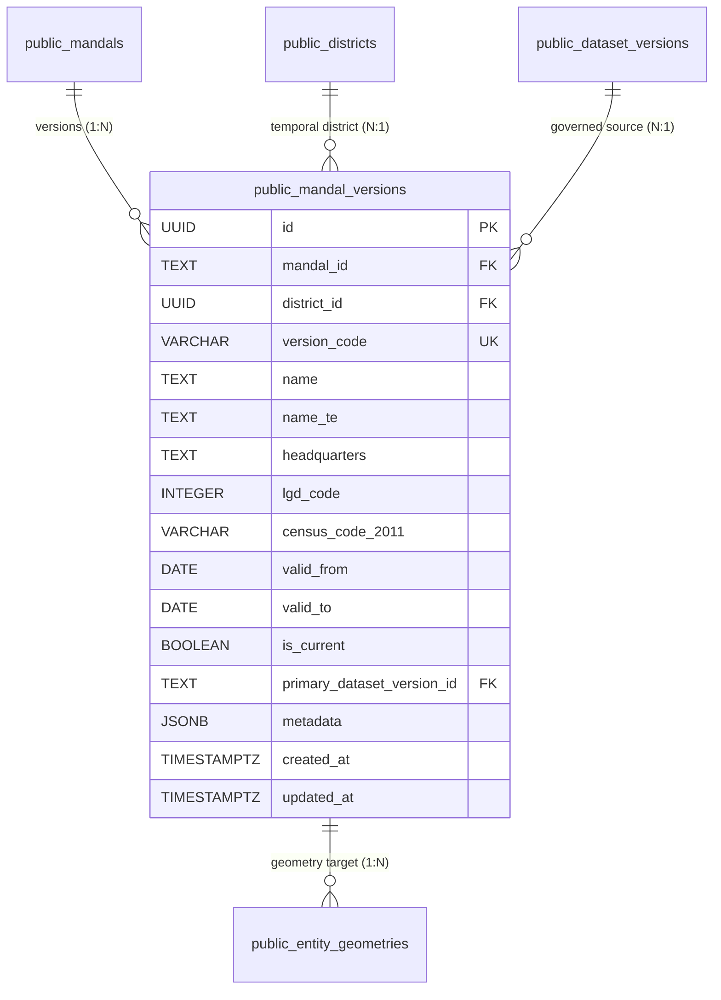

# W014: Mandal Temporal Version Model Preflight

**Authority:** Independent CTO / Co-founder Directive — W014 Mandal Version Prerequisite  
**Status:** SUBMITTED FOR CTO REVIEW  
**Scope:** Architectural & Technical Preflight Design Only (Zero DDL Execution / Zero DB Mutations / Production Untouched)  
**Baseline Commit:** `8704afe55a67426b7d9a366402a4f1d5bae9788a`  
**Date:** September 2026  

---

## 1. Executive Summary & Prerequisite Context

During the W016-C3 preflight review, the CTO conditionally accepted the geometry architecture with an explicit mandate: **geometry records must attach to canonical W014 version tables, never to unversioned stable anchor tables**.

An exhaustive repository and database schema audit confirmed that while W014 (Migration 041) created temporal version tables for:
- `public.state_versions`
- `public.district_versions`
- `public.parliamentary_constituency_versions`
- `public.constituency_versions`

**`public.mandal_versions` does not currently exist.** Mandals currently exist exclusively as canonical anchor records in `public.mandals` (created in Migration 022, enhanced in Migration 042).

This document establishes the **minimum canonical W014 temporal version model for sub-district revenue mandals** to satisfy the prerequisite for future geometry attachment without violating:
1. **W012 Data Governance** (dataset versioning and cryptographic provenance).
2. **W013 Stable Geography Identity** (immutable entity codes and anchor keys).
3. **W014 Temporal Semantics** (GiST interval exclusion, calendar-independent currentness, entity lineage).
4. **W015 Relational Primacy** (statutory administrative-to-electoral mappings).
5. **W016 Geometry Attachment** (clean foreign key targeting).

---

## 2. Current Schema Audit

An exhaustive audit was conducted across all existing migrations (`001` through `043`):

### 2.1 Schema Analysis of `public.mandals`
- **Creation:** Migration 022 (`022_administrative_hierarchy.sql`, Line 35).
- **Primary Key:** `id TEXT` (Format: `<state_code>-MDL-<code_or_sno>`, e.g., `'TS-MDL-5321'`).
- **Core Columns:**
  - `name TEXT NOT NULL`
  - `local_name TEXT`
  - `state_code TEXT NOT NULL REFERENCES states(code)`
  - `district TEXT NOT NULL` (denormalized name string from Migration 022)
  - `lgd_code INTEGER` (Local Government Directory code)
  - `type TEXT NOT NULL DEFAULT 'mandal'`
  - `headquarters TEXT`
  - `area_sq_km NUMERIC(10, 2)`
  - `population_2011 INTEGER`
  - `centroid GEOMETRY(Point, 4326)` (legacy fixture from Migration 022)
  - `boundary GEOMETRY(MultiPolygon, 4326)` (legacy fixture from Migration 022)
  - `created_at TIMESTAMPTZ`, `updated_at TIMESTAMPTZ`
- **W015 Enhancements (Migration 042, Line 116):**
  - `district_id UUID REFERENCES public.districts(id) ON DELETE RESTRICT`
  - `primary_dataset_version_id TEXT REFERENCES public.dataset_versions(id) ON DELETE RESTRICT`
- **Existing Date/Validity Fields:** **NONE.** `public.mandals` lacks `valid_from`, `valid_to`, `is_current`, and `current_version_id`.
- **Existing Triggers & Indexes:**
  - Trigger: `trg_mandals_updated_at`
  - Indexes: `idx_mandals_state_code`, `idx_mandals_state_district`, `idx_mandals_lgd_code`, `idx_mandals_centroid`, `idx_mandals_boundary`, `idx_mandals_district_id`.
- **Row Level Security (RLS):** Enabled. Public read for `anon` and `authenticated`; write restricted to `service_role`.

### 2.2 Existing W014 Temporal Versioning Patterns
Migration 041 established consistent temporal architectural patterns:
1. **Primary Key:** `id UUID DEFAULT gen_random_uuid()`.
2. **Anchor Foreign Key:** References the anchor table's primary key (`district_id UUID`, `state_code TEXT`, `constituency_internal_id UUID`) with `ON DELETE RESTRICT`.
3. **Version Code:** `version_code VARCHAR(50) UNIQUE NOT NULL`.
4. **Temporal Bounding:** `valid_from DATE NOT NULL`, `valid_to DATE`.
5. **Current Flag:** `is_current BOOLEAN NOT NULL DEFAULT true`.
6. **Non-Overlapping Interval Invariant:** PostgreSQL GiST exclusion constraint on `(anchor_id WITH =, daterange(valid_from, valid_to, '[)') WITH &&)`.
7. **Single-Current Invariant:** Partial unique index on `anchor_id WHERE is_current = true`.
8. **Provenance Linkage:** `primary_dataset_version_id TEXT NOT NULL REFERENCES public.dataset_versions(id) ON DELETE RESTRICT`.
9. **Anchor Enhancement:** Anchor table updated with `current_version_id UUID`, `valid_from DATE`, `valid_to DATE`, `is_current BOOLEAN`.

### 2.3 Existing W015 Relationship References
In Migration 042 and 043:
- `public.mandal_constituency_map.mandal_id` references `public.mandals(id)` (the stable anchor).
- `public.polling_booths.mandal_id` references `public.mandals(id)`.
- W015 relationships target the **stable anchor identity**, not a temporal version record.

### 2.4 Existing Lineage Infrastructure
Migration 043 (Line 48) expanded `public.geography_entity_lineage` to include `'mandal'`:
```sql
CHECK (entity_type IN ('state', 'district', 'parliamentary_constituency', 'constituency', 'mandal'))
```
Migration 043 already recorded an authentic historical mandal lineage transition: the `Mancherial -> Hajipur` split on `2016-10-11` under G.O.Ms.No. 222.

---

## 3. Stable Identity Evaluation: Supporting `mandals -> mandal_versions`

**Finding:** `public.mandals.id` (`TEXT PRIMARY KEY`) possesses complete, stable identity information to anchor `mandal_versions` without altering W013 identity semantics.

### Rationale:
1. **Direct Precedent in `state_versions`:** In Migration 041, `state_versions` references `state_code TEXT REFERENCES public.states(code)` where `states.code` is `TEXT PRIMARY KEY`. Similarly, `mandals.id` is `TEXT PRIMARY KEY`.
2. **Zero Anchor Renaming/Re-keying:** `mandals.id` remains the immutable anchor identifier (`'TS-MDL-5321'`), preserving all downstream foreign keys in `mandal_constituency_map`, `gram_panchayats`, and `polling_booths`.
3. **Decoupled Attributes:** Mutable attributes (mandal name, headquarters town, LGD code updates, district containment changes) migrate to temporal rows in `mandal_versions`, while the immutable anchor `mandals.id` remains stable across reorganisations.

---

## 4. Minimum Canonical W014 Mandal Version Architecture

The minimum canonical model for `public.mandal_versions` mirrors the proven design of `district_versions`:



### Table Column Specification:
1. `id UUID PRIMARY KEY DEFAULT gen_random_uuid()`: Immutable version surrogate key.
2. `mandal_id TEXT NOT NULL REFERENCES public.mandals(id) ON DELETE RESTRICT`: Foreign key to stable anchor.
3. `district_id UUID NOT NULL REFERENCES public.districts(id) ON DELETE RESTRICT`: Captures temporal district reorganisation (e.g. transfer of mandals to Mulugu or Narayanpet in 2019).
4. `version_code VARCHAR(50) NOT NULL UNIQUE`: Canonical version identifier (e.g. `'ts_mdl_5321_2016_v1'`).
5. `name TEXT NOT NULL`: Statutory mandal name during this temporal interval.
6. `name_te TEXT`: Telugu script name.
7. `headquarters TEXT`: HQ settlement during this temporal interval.
8. `lgd_code INTEGER`: Local Government Directory code assigned by MoPR during this interval.
9. `census_code_2011 VARCHAR(20)`: Census sub-district code where applicable.
10. `valid_from DATE NOT NULL`: Statutory enactment date of this version.
11. `valid_to DATE`: Statutory supersession or abolition date (`NULL` if currently active).
12. `is_current BOOLEAN NOT NULL DEFAULT true`: Active status flag.
13. `primary_dataset_version_id TEXT NOT NULL REFERENCES public.dataset_versions(id) ON DELETE RESTRICT`: W012 dataset version provenance.
14. `metadata JSONB NOT NULL DEFAULT '{}'::jsonb`: Statutory gazette citation and audit notes.
15. `created_at TIMESTAMPTZ NOT NULL DEFAULT now()`, `updated_at TIMESTAMPTZ NOT NULL DEFAULT now()`.

---

## 5. Temporal Semantics & Interval Constraints

### 5.1 Non-Overlapping Interval Invariant
A single physical mandal territory cannot exist in two conflicting version states on the same date. This is strictly enforced at the database engine level via PostgreSQL `btree_gist`:
```sql
CONSTRAINT uq_mandal_versions_no_overlap EXCLUDE USING gist (
  mandal_id WITH =,
  (daterange(valid_from, valid_to, '[)')) WITH &&
)
```
- **Interval Semantics:** Uses half-open ranges `[valid_from, valid_to)`.
- **Adjacent Intervals Permitted:** A historical version `[2016-10-11, 2022-09-01)` and a subsequent version `[2022-09-01, NULL)` touch at `2022-09-01` but do not overlap, which PostgreSQL allows without violation.

### 5.2 Calendar-Independent Currentness Invariant
In accordance with Blocker 2 and Blocker 4, `CURRENT_DATE` is completely excluded from database check constraints. Currentness is defined statically:
```sql
CONSTRAINT chk_mandal_versions_current_invariants CHECK (
  (is_current = false) OR (is_current = true AND valid_to IS NULL)
)
```

### 5.3 Single-Current Uniqueness
At most one active version can exist per mandal anchor:
```sql
CREATE UNIQUE INDEX uq_mandal_versions_single_current 
  ON public.mandal_versions (mandal_id) 
  WHERE is_current = true;
```

---

## 6. Administrative Lineage & Lifecycle Semantics

Mandal territorial reorganisations are represented through the synergy of `mandal_versions` and `public.geography_entity_lineage`:

| Administrative Event | Version Behavior | Lineage Registration in `geography_entity_lineage` |
|---|---|---|
| **Creation** | New `mandals` anchor inserted. New `mandal_versions` row with `valid_from = :effective_date`, `valid_to = NULL`, `is_current = true`. | Registered with `transition_type = 'creation'`, `statutory_order = :gazette_no`. |
| **Rename** | Existing version closed (`valid_to = :effective_date`, `is_current = false`). New version inserted with new `name`, `valid_from = :effective_date`, `valid_to = NULL`, `is_current = true`. | Registered with `transition_type = 'rename'`. |
| **District Transfer** | Existing version closed. New version inserted with new `district_id`, `valid_from = :effective_date`, `valid_to = NULL`, `is_current = true`. | Lineage notes district reorganisation (e.g. 2019 Mulugu/Narayanpet transfers). |
| **Split** | Predecessor version closed (`valid_to = :effective_date`, `is_current = false`). Remainder version and new successor version created with `valid_from = :effective_date`. | Registered with `transition_type = 'split'`, linking predecessor to successor. |
| **Merge** | Merging versions closed (`valid_to = :effective_date`, `is_current = false`). Unified version created with `valid_from = :effective_date`. | Registered with `transition_type = 'merge'`. |
| **Abolition** | Version closed (`valid_to = :effective_date`, `is_current = false`). Anchor updated to `is_current = false`. | Registered with `transition_type = 'abolition'`. |

---

## 7. Reconciling the 589 TGRAC Historical Snapshot

The acquired TGRAC mandal dataset contains exactly 589 features representing the initial **2016–2017 post-reorganisation baseline**:
- **Temporal Validity Window:** `[2016-10-11, 2022-09-01)`.
- **Historical Version Representation:**  
  When `mandal_versions` is populated, each of the 589 mandals will possess a historical version row:
  - `mandal_id = 'TS-MDL-<s_no>'`
  - `valid_from = '2016-10-11'`
  - `valid_to = '2022-09-01'`
  - `is_current = false`
  - `primary_dataset_version_id = 'tgrac_mandals_2016_candidate_v1'`
- **Clean Geometry Attachment:**  
  In future Migration 044, `entity_geometries.mandal_version_id` will reference this exact historical version UUID. Because `is_current = false` and `valid_to` is populated, it cannot satisfy current-geography queries.

---

## 8. Blocker Treatment: The 23 Post-2016 Mandals (`UNK-16-01` Quarantine)

1. **Chronological Reality:** 23 mandals were created between 2018 and 2023 (e.g. G.O.Ms. Revenue Dept September 2022 creating 13 new mandals).
2. **Zero Fabrication:** These 23 mandals did not exist during the 2016 snapshot. They possess **NO version record** for `[2016-10-11, 2022-09-01)` and **zero geometry records**.
3. **No Synthetic Relational Encoding:** PANIN will NOT fabricate synthetic polygon splits or infer containment mappings in statutory tables (`mandal_constituency_map`).
4. **Preservation of `UNK-16-01`:** Current legal mandal geometry remains `UNKNOWN / BLOCKED` until a certified 612-mandal vector dataset is acquired from CCLA or Survey of India.

---

## 9. Preservation of W015 Relational Primacy

- `public.mandal_constituency_map` and `public.polling_booths` link directly to `public.mandals(id)` (stable anchor).
- Introducing `mandal_versions` leaves `mandal_constituency_map` **100% untouched**.
- Spatial relationships remain purely observational and never mutate statutory containment mappings.

---

## 10. Preservation of W012 Data Governance

- `mandal_versions` requires a non-null foreign key `primary_dataset_version_id REFERENCES public.dataset_versions(id) ON DELETE RESTRICT`.
- Ingestion and maintenance operations log transformation nodes in `public.provenance_records` and linkages in `public.record_provenance_linkages` (`domain_table = 'mandal_versions'`).
- Zero parallel governance tables are created.

---

## 11. Scenario Isolation & Prospective Modeling

- If hypothetical or prospective mandal reorganisations (e.g. Delimitation Simulation Lab models) are modeled in the future:
  1. They must link to a `dataset_versions` record whose source has `authority_level = 'synthetic_model'`.
  2. They must have `is_current = false`.
  3. They must never be co-mingled with statutory historical or current versions.

---

## 12. Proposed DDL Specification for Future W014 Extension

> [!CAUTION]
> **DESIGN ONLY — NOT AUTHORIZED FOR IMPLEMENTATION.**  
> The following DDL represents the complete technical design for a future W014 mandal versioning migration. It must NOT be created or executed until authorized by the CTO.

```sql
-- ==============================================================================
-- W014 Prerequisite: Mandal Temporal Versioning (DESIGN ONLY)
-- Status: DESIGN ONLY — NOT AUTHORIZED FOR IMPLEMENTATION
-- Target: Staging Supabase
-- ==============================================================================

BEGIN;

-- 1. Create Mandal Versions Table
CREATE TABLE IF NOT EXISTS public.mandal_versions (
  id UUID PRIMARY KEY DEFAULT gen_random_uuid(),
  mandal_id TEXT NOT NULL REFERENCES public.mandals(id) ON DELETE RESTRICT,
  district_id UUID NOT NULL REFERENCES public.districts(id) ON DELETE RESTRICT,
  version_code VARCHAR(50) NOT NULL,
  name TEXT NOT NULL,
  name_te TEXT,
  headquarters TEXT,
  lgd_code INTEGER,
  census_code_2011 VARCHAR(20),
  valid_from DATE NOT NULL,
  valid_to DATE,
  is_current BOOLEAN NOT NULL DEFAULT true,
  primary_dataset_version_id TEXT NOT NULL REFERENCES public.dataset_versions(id) ON DELETE RESTRICT,
  metadata JSONB NOT NULL DEFAULT '{}'::jsonb,
  created_at TIMESTAMPTZ NOT NULL DEFAULT now(),
  updated_at TIMESTAMPTZ NOT NULL DEFAULT now(),

  -- Unique version code
  CONSTRAINT uq_mandal_versions_code UNIQUE (version_code),

  -- Temporal non-overlapping interval exclusion
  CONSTRAINT uq_mandal_versions_no_overlap EXCLUDE USING gist (
    mandal_id WITH =,
    (daterange(valid_from, valid_to, '[)')) WITH &&
  ),

  -- Calendar-independent currentness check
  CONSTRAINT chk_mandal_versions_current_invariants CHECK (
    (is_current = false) OR (is_current = true AND valid_to IS NULL)
  )
);

-- 2. Supporting Indexes
CREATE INDEX IF NOT EXISTS idx_mandal_versions_mandal_id ON public.mandal_versions(mandal_id);
CREATE INDEX IF NOT EXISTS idx_mandal_versions_district_id ON public.mandal_versions(district_id);
CREATE INDEX IF NOT EXISTS idx_mandal_versions_dataset ON public.mandal_versions(primary_dataset_version_id);
CREATE INDEX IF NOT EXISTS idx_mandal_versions_current ON public.mandal_versions(mandal_id) WHERE is_current = true;

-- Single-current partial unique index
CREATE UNIQUE INDEX IF NOT EXISTS uq_mandal_versions_single_current 
  ON public.mandal_versions (mandal_id) 
  WHERE is_current = true;

-- 3. Enhance Anchor Table
ALTER TABLE public.mandals
  ADD COLUMN IF NOT EXISTS current_version_id UUID REFERENCES public.mandal_versions(id) ON DELETE SET NULL,
  ADD COLUMN IF NOT EXISTS valid_from DATE DEFAULT '2016-10-11',
  ADD COLUMN IF NOT EXISTS valid_to DATE,
  ADD COLUMN IF NOT EXISTS is_current BOOLEAN DEFAULT true;

-- 4. Row Level Security
ALTER TABLE public.mandal_versions ENABLE ROW LEVEL SECURITY;

DROP POLICY IF EXISTS "Public read mandal_versions" ON public.mandal_versions;
CREATE POLICY "Public read mandal_versions"
  ON public.mandal_versions FOR SELECT
  TO anon, authenticated
  USING (true);

DROP POLICY IF EXISTS "Service role write mandal_versions" ON public.mandal_versions;
CREATE POLICY "Service role write mandal_versions"
  ON public.mandal_versions FOR ALL
  TO service_role
  USING (true)
  WITH CHECK (true);

COMMIT;
```

---

## 13. Safe Rollback Strategy

Rollback of any future mandal versioning migration is strictly non-destructive to W012 governance data:
```sql
-- SAFE ROLLBACK SCRIPT FOR MANDAL VERSIONING (DESIGN ONLY)
BEGIN;

-- 1. Remove Anchor Pointers
ALTER TABLE public.mandals
  DROP COLUMN IF EXISTS current_version_id,
  DROP COLUMN IF EXISTS valid_from,
  DROP COLUMN IF EXISTS valid_to,
  DROP COLUMN IF EXISTS is_current;

-- 2. Drop Version Table
DROP TABLE IF EXISTS public.mandal_versions CASCADE;

-- 3. Preserve W012 Records
-- Do NOT delete from dataset_versions, datasets, or data_sources.

COMMIT;
```

---

## 14. Required Acceptance Matrix

| Assertion | Requirement | Design Requirement | Future Runtime Verification |
|---|---|---|---|
| **A** | `mandal_versions` has a real FK to `mandals` | `mandal_id TEXT NOT NULL REFERENCES public.mandals(id) ON DELETE RESTRICT` | `INSERT` with non-existent `mandal_id` fails with Foreign Key Violation (`23503`). |
| **B** | Every `mandal_version` resolves to exactly one stable anchor | `NOT NULL` constraint on `mandal_id` ensures 100% resolution to `public.mandals` | `SELECT count(*) FROM mandal_versions mv LEFT JOIN mandals m ON mv.mandal_id = m.id WHERE m.id IS NULL;` returns strictly `0`. |
| **C** | Historical intervals cannot overlap for the same mandal | GiST exclusion constraint `uq_mandal_versions_no_overlap` on `(mandal_id WITH =, daterange WITH &&)` | Inserting overlapping date ranges for the same `mandal_id` raises Exclusion Violation (`23P01`). |
| **D** | Adjacent valid intervals are allowed | Half-open intervals `[valid_from, valid_to)` allow contiguous date boundaries | Inserting `[2016-10-11, 2022-09-01)` and `[2022-09-01, NULL)` succeeds cleanly without error. |
| **E** | Current version semantics match existing W014 patterns | Partial unique index `uq_mandal_versions_single_current` and check constraint `valid_to IS NULL` | Inserting a second `is_current = true` row for the same mandal raises Unique Violation (`23505`). |
| **F** | Historical 2016–2022 snapshot can attach to exact versions | Explicit historical version row with `valid_from = '2016-10-11'`, `valid_to = '2022-09-01'`, `is_current = false` | In future W016, `entity_geometries.mandal_version_id` joins cleanly to `mandal_versions` where `valid_to = '2022-09-01'`. |
| **G** | W015 relationships remain unchanged | `mandal_constituency_map` and `polling_booths` retain foreign keys to `public.mandals(id)` | MCM row count and integrity test suites pass 100% during version table creation. |
| **H** | No current legal mandal geometry without a W014 version | `entity_geometries.mandal_version_id` is mandatory for mandal geometries | Inserting mandal geometry without `mandal_version_id` fails with check/FK violation. |
| **I** | W012 provenance resolves where required | `primary_dataset_version_id REFERENCES dataset_versions(id)` with provenance DAG nodes | Relational joins from `mandal_versions` to `dataset_versions` and `provenance_records` resolve 100%. |
| **J** | No 589 geometry ingestion performed during this task | Scope strictly limited to preflight design; zero geometry tables created | Catalog queries confirm zero geometry tables or rows exist. |
| **K** | No 23 missing mandals fabricated | Missing 23 mandals remain absent from 2016 snapshot; no inferred aggregation in MCM | Audit confirms zero synthetic 2016 version rows and zero fabricated polygons. |
| **L** | Rollback does not destroy W012 governance history | Rollback drops `mandal_versions` only; W012 dataset and provenance records remain intact | Rollback script execution leaves `dataset_versions` and `provenance_records` untouched. |

---

## 15. Governance Summary & Final Checklist

- [x] Inspected actual current schema for `public.mandals`, W014 version tables, W015 MCM, and W012 provenance.
- [x] Verified that `public.mandals.id` provides complete stable identity to anchor `mandal_versions`.
- [x] Defined minimum canonical W014 `public.mandal_versions` architecture.
- [x] Applied GiST non-overlapping interval exclusion and calendar-independent currentness check.
- [x] Designed seamless integration with `geography_entity_lineage` for renames, splits, and transfers.
- [x] Reconciled 589-mandal historical snapshot attachment without fabricating the 23 missing post-2016 mandals.
- [x] Preserved W015 relational primacy (`mandal_constituency_map` untouched).
- [x] Preserved W012 data governance and provenance resolution.
- [x] Produced complete acceptance matrix (Assertions A through L).
- [x] Zero application code changes, zero database mutations, zero migrations created.
- [x] Migration 044 remains strictly unauthorized.
