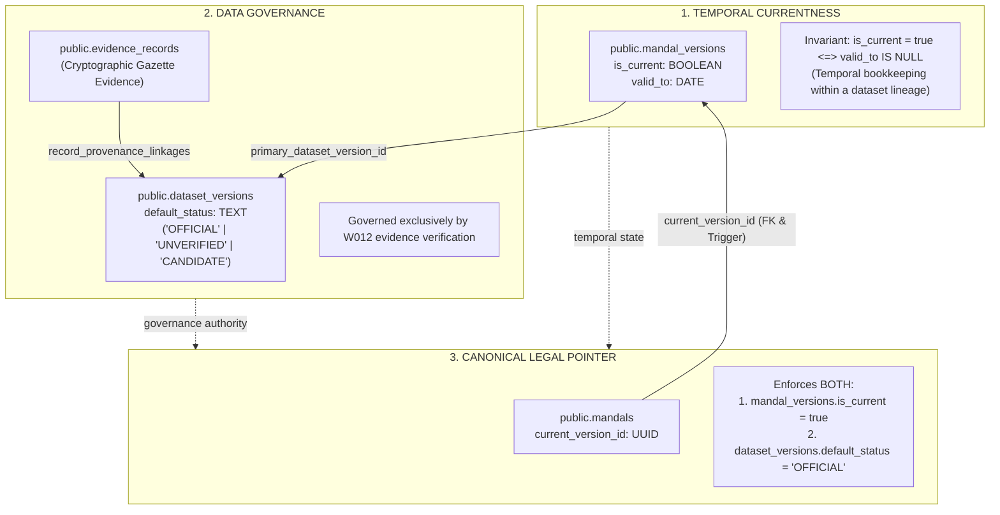

# W014: Mandal Temporal Version Model Preflight (Comprehensive Authority & Security Hardening)

**Authority:** Independent CTO / Co-founder Directive — W014 Mandal Version Preflight Correction Round 2  
**Status:** SUBMITTED FOR FINAL CTO REVIEW  
**Scope:** Architectural & Technical Preflight Design Only (Zero DDL Execution / Zero DB Mutations / Production Untouched)  
**Baseline Commit:** `fe93e0bdd101989ec9b6ec8d7dc8b59404833619`  
**Date:** September 2026  

---

## 1. Executive Summary & Authoritative Coordinates

In accordance with the **CTO Directive on W014 Mandal Version Final Integrity Correction (Round 2)**, this document establishes the hardened preflight design for the canonical W014 sub-district mandal temporal version model.

This release:
1. **Enforces W012 Authority at the Database Engine Level:** `mandals.current_version_id` is restricted to referencing versions belonging strictly to `dataset_versions` with `default_status = 'OFFICIAL'`. This check is enforced by both the anchor constraint trigger and the atomic transition function.
2. **Eliminates Dead Governance State:** `v_dataset_status` participates directly in the transition authorization path.
3. **Formalizes the Transition Function Security Model:** Implements `SECURITY DEFINER`, fixed `search_path`, schema-qualified object references, explicit `REVOKE` from `PUBLIC`/`anon`/`authenticated`, and session-role authorization (`CURRENT_USER`). Explicitly decouples `p_operator` (audit metadata only) from security authorization.
4. **Explicitly Delegates Provenance Semantics:** Formally defines that statutory evidence validation belongs to the W012 dataset promotion workflow, while optionally validating `p_provenance_id` foreign key existence.
5. **Enforces the Temporal Currentness Invariant:** Database-level enforcement of `is_current = true <=> valid_to IS NULL` for both direct SQL mutations and stored transitions.
6. **Expands the Acceptance Matrix to M1–M15:** All assertions explicitly classified as `DESIGNED / TO-BE VERIFIED`.

### Authoritative State Matrix

| Component | Status | Governance Authority |
|---|---|---|
| **W015 (Geography Relationship Engine)** | `ACCEPTED_COMPLETE` | Commit [`4d99dd3`](https://github.com/kshetra-app/Kshetra/commit/4d99dd3) |
| **W015-B1 (Preflight Inspection)** | `ACCEPTED_COMPLETE` | Commit [`4d99dd3`](https://github.com/kshetra-app/Kshetra/commit/4d99dd3) |
| **W015-B2 (Source Reconciliation)** | `ACCEPTED_COMPLETE` | Commit [`4d99dd3`](https://github.com/kshetra-app/Kshetra/commit/4d99dd3) |
| **W016-A1 (Preflight Correction)** | `ACCEPTED` | Commit [`1f8bde8`](https://github.com/kshetra-app/Kshetra/commit/1f8bde8) |
| **W016-B1 (Source Preflight)** | `ACCEPTED` | Commit [`e240fc3`](https://github.com/kshetra-app/Kshetra/commit/e240fc3) |
| **W016-B2 (Technical Spatial Rehearsal)** | `ACCEPTED_COMPLETE` | Commit [`4beb9a7`](https://github.com/kshetra-app/Kshetra/commit/4beb9a7) |
| **W016-C1 (Candidate Acquisition)** | `ACCEPTED_COMPLETE` | Commit [`46d4bcb`](https://github.com/kshetra-app/Kshetra/commit/46d4bcb) |
| **W016-C2 (Reconciliation Package)** | `ACCEPTED` | Commit [`3d30640`](https://github.com/kshetra-app/Kshetra/commit/3d30640) |
| **W016-C3 (Geometry Preflight)** | `CONDITIONALLY_ACCEPTED` | Commit [`8704afe`](https://github.com/kshetra-app/Kshetra/commit/8704afe) |
| **W014 Mandal Temporal Preflight** | `REVISED_PREFLIGHT_SUBMISSION` | This Document |
| **Migration 044 Execution** | `STRICTLY_NOT_AUTHORIZED` | Frozen |
| **Database Mutations / Ingestion** | `STRICTLY_NOT_AUTHORIZED` | Frozen |
| **Production Environment** | `STRICTLY_UNTOUCHED` | Air-Gapped |

---

## 2. Actual Existing W014 Architecture & Anchor Analysis

An inspection of Migration 041 (`041_geography_versioning_and_temporal_validity.sql`, Lines 369–395) reveals how W014 historically handled version pointers on stable anchor entities:

```sql
-- Migration 041 Historical Pattern (states, districts, pcs, constituencies)
ALTER TABLE public.states
  ADD COLUMN IF NOT EXISTS current_version_id UUID REFERENCES public.state_versions(id) ON DELETE SET NULL,
  ADD COLUMN IF NOT EXISTS valid_from DATE DEFAULT '2014-06-02',
  ADD COLUMN IF NOT EXISTS valid_to DATE,
  ADD COLUMN IF NOT EXISTS is_current BOOLEAN DEFAULT true;

ALTER TABLE public.districts
  ADD COLUMN IF NOT EXISTS current_version_id UUID REFERENCES public.district_versions(id) ON DELETE SET NULL,
  ADD COLUMN IF NOT EXISTS valid_from DATE DEFAULT '2016-10-11',
  ADD COLUMN IF NOT EXISTS valid_to DATE,
  ADD COLUMN IF NOT EXISTS is_current BOOLEAN DEFAULT true,
  ADD COLUMN IF NOT EXISTS predecessor_district_id UUID REFERENCES public.districts(id) ON DELETE SET NULL;
```

### Critical Findings on Migration 041:
1. **Unconstrained Foreign Key Weakness:** Plain foreign keys in PostgreSQL enforce only that the target UUID exists in the version table; they cannot verify same-anchor ownership or active currentness.
2. **Duplicate Temporal Truth:** Migration 041 duplicated `valid_from`, `valid_to`, and `is_current` across both anchor tables and version tables. For mandals, temporal validity intervals live strictly on `public.mandal_versions`, while `public.mandals` holds only `current_version_id` and entity-level `is_active`.

---

## 3. The Three Distinct Concepts of Governance & Authority

To prevent conflation between temporal mechanics and legal truth, the architecture formally separates three distinct concepts:



### 3.1 Fundamental Independence Axioms
1. **`is_current = true` $\neq$ `OFFICIAL`:**  
   An unverified candidate dataset (e.g., TGRAC 589 candidate snapshot) may have exactly one version per entity with `is_current = true` to maintain internal temporal continuity during research and rehearsal. This flag **does NOT** make the version legally official.
2. **`OFFICIAL` dataset eligibility $\neq$ temporal currentness:**  
   A version may belong to an `OFFICIAL` dataset (e.g., historical 2016 reorganisation baseline) without being current (`is_current = false, valid_to = '2022-09-01'`).
3. **Canonical Pointer Conjunction:**  
   `public.mandals.current_version_id` represents production legal truth and **strictly requires both**:
   $$\text{Eligible for } \text{mandals.current\_version\_id} \iff (\text{is\_current} = \text{true}) \land (\text{dataset\_status} = \text{'OFFICIAL'})$$

---

## 4. Bidirectional Current-Version Integrity Architecture

The architecture implements a **5-layer mutually-enforcing integrity framework**:

### 4.1 Layer 1: Declarative Composite Foreign Key (Identity & Anti-Orphan Constraint)
On `public.mandal_versions`:
```sql
CONSTRAINT uq_mandal_versions_id_mandal UNIQUE (id, mandal_id)
```
On `public.mandals`:
```sql
CONSTRAINT fk_mandals_current_version_same_anchor
  FOREIGN KEY (current_version_id, id)
  REFERENCES public.mandal_versions(id, mandal_id)
  ON DELETE RESTRICT;
```
- **Engine Guarantee:** PostgreSQL natively rejects any update where `current_version_id` references a version belonging to any other mandal (`23503`). `ON DELETE RESTRICT` guarantees an active version cannot be dropped while referenced.

### 4.2 Layer 2: Anchor Constraint Trigger with W012 Authority Enforcement
Fires on `public.mandals` after modification of `current_version_id`:
```sql
CREATE OR REPLACE FUNCTION public.fn_guard_mandal_current_version()
RETURNS TRIGGER AS $$
DECLARE
  v_dataset_status TEXT;
BEGIN
  IF NEW.current_version_id IS NOT NULL THEN
    -- Verify target version exists, belongs to same mandal, and is active
    SELECT dv.default_status INTO v_dataset_status
    FROM public.mandal_versions mv
    JOIN public.dataset_versions dv ON mv.primary_dataset_version_id = dv.id
    WHERE mv.id = NEW.current_version_id
      AND mv.mandal_id = NEW.id
      AND mv.is_current = true;

    IF NOT FOUND THEN
      RAISE EXCEPTION 'INTEGRITY VIOLATION [ERR-W014-001]: mandals.current_version_id (%) must reference an active version (is_current = true) belonging to mandal %',
        NEW.current_version_id, NEW.id
        USING ERRCODE = '23514'; -- check_violation
    END IF;

    -- Enforce W012 Authority at the database constraint level
    IF v_dataset_status <> 'OFFICIAL' THEN
      RAISE EXCEPTION 'AUTHORITY VIOLATION [ERR-W014-003]: mandals.current_version_id (%) references dataset version with status "%". Canonical pointer requires W012 "OFFICIAL" authority.',
        NEW.current_version_id, v_dataset_status
        USING ERRCODE = '23514'; -- check_violation
    END IF;
  END IF;
  RETURN NEW;
END;
$$ LANGUAGE plpgsql;

CREATE CONSTRAINT TRIGGER trg_guard_mandal_current_version
  AFTER INSERT OR UPDATE OF current_version_id ON public.mandals
  DEFERRABLE INITIALLY DEFERRED
  FOR EACH ROW
  EXECUTE FUNCTION public.fn_guard_mandal_current_version();
```

### 4.3 Layer 3: Reciprocal Version Retirement Guard Trigger
Fires on `public.mandal_versions` after modification of `is_current` or deletion:
```sql
CREATE OR REPLACE FUNCTION public.fn_guard_mandal_version_retirement()
RETURNS TRIGGER AS $$
BEGIN
  IF (TG_OP = 'DELETE' AND OLD.is_current = true) OR
     (TG_OP = 'UPDATE' AND OLD.is_current = true AND NEW.is_current = false) THEN
    IF EXISTS (
      SELECT 1 FROM public.mandals m
      WHERE m.current_version_id = OLD.id
    ) THEN
      RAISE EXCEPTION 'INTEGRITY VIOLATION [ERR-W014-002]: Cannot deactivate (is_current=false) or delete mandal_version % while it is actively referenced by mandals.current_version_id. Transition mandal to an active successor version or clear current_version_id first via fn_transition_mandal_current_version().',
        OLD.id
        USING ERRCODE = '23514'; -- check_violation
    END IF;
  END IF;
  RETURN COALESCE(NEW, OLD);
END;
$$ LANGUAGE plpgsql;

CREATE CONSTRAINT TRIGGER trg_guard_mandal_version_retirement
  AFTER UPDATE OF is_current OR DELETE ON public.mandal_versions
  DEFERRABLE INITIALLY DEFERRED
  FOR EACH ROW
  EXECUTE FUNCTION public.fn_guard_mandal_version_retirement();
```

### 4.4 Layer 4: Single-Current Partial Unique Index
```sql
CREATE UNIQUE INDEX uq_mandal_versions_single_current 
  ON public.mandal_versions (mandal_id) 
  WHERE is_current = true;
```

### 4.5 Layer 5: Temporal Currentness Invariant Check Constraint
```sql
CONSTRAINT chk_mandal_versions_current_invariants CHECK (
  (is_current = false) OR (is_current = true AND valid_to IS NULL)
)
```
- Direct activation of closed version (`is_current = true` with `valid_to IS NOT NULL`) is rejected with `23514`.
- Direct closure of active version (`valid_to = '<date>'` with `is_current = true`) is rejected with `23514`.

---

## 5. Authoritative Atomic State-Transition Path & Security Model

### 5.1 Security & Execution Configuration
- **Execution Mode:** `SECURITY DEFINER`
- **Execution Search Path:** `SET search_path = public, pg_temp;` (prevents search path hijacking).
- **Object Qualification:** All table and relation references explicitly qualified as `public.<object>`.
- **Role Permissions:**
  ```sql
  REVOKE ALL ON FUNCTION public.fn_transition_mandal_current_version(TEXT, UUID, DATE, TEXT, UUID) FROM PUBLIC;
  REVOKE ALL ON FUNCTION public.fn_transition_mandal_current_version(TEXT, UUID, DATE, TEXT, UUID) FROM anon;
  REVOKE ALL ON FUNCTION public.fn_transition_mandal_current_version(TEXT, UUID, DATE, TEXT, UUID) FROM authenticated;

  GRANT EXECUTE ON FUNCTION public.fn_transition_mandal_current_version(TEXT, UUID, DATE, TEXT, UUID) TO service_role;
  GRANT EXECUTE ON FUNCTION public.fn_transition_mandal_current_version(TEXT, UUID, DATE, TEXT, UUID) TO panin_boundary_admin;
  ```
- **Session Role Verification:** Enforces that `CURRENT_USER IN ('postgres', 'service_role', 'panin_boundary_admin')`.
- **Decoupling `p_operator` from Security:** `p_operator TEXT` is **audit metadata only** (recorded in transition receipts and event logs). It provides **zero authorization privilege**. Caller identity is checked strictly via database session role credentials.
- **Provenance Semantics:** Statutory boundary authority originates in W012 dataset promotion. If `p_provenance_id` is supplied, the function verifies its existence in `public.provenance_records` (`23503`); it does not self-authorize the transition.
- **Dead Governance Elimination:** `v_dataset_status` is directly checked against `'OFFICIAL'` (`ERR-W014-003`).

### 5.2 Transition Function DDL

```sql
CREATE OR REPLACE FUNCTION public.fn_transition_mandal_current_version(
  p_mandal_id TEXT,
  p_new_version_id UUID,
  p_effective_date DATE,
  p_operator TEXT,
  p_provenance_id UUID DEFAULT NULL
)
RETURNS JSONB
LANGUAGE plpgsql
SECURITY DEFINER
SET search_path = public, pg_temp
AS $$
DECLARE
  v_old_version_id UUID;
  v_new_mandal_id TEXT;
  v_new_valid_to DATE;
  v_dataset_status TEXT;
BEGIN
  -- 1. Security Check: Assert caller session role is authorized
  IF CURRENT_USER NOT IN ('postgres', 'service_role', 'panin_boundary_admin') THEN
    RAISE EXCEPTION 'PERMISSION DENIED [ERR-W014-004]: Role "%" is not authorized to execute canonical version transitions.',
      CURRENT_USER
      USING ERRCODE = '42501'; -- insufficient_privilege
  END IF;

  -- 2. Provenance Check: If provided, assert valid provenance record existence
  IF p_provenance_id IS NOT NULL THEN
    IF NOT EXISTS (
      SELECT 1 FROM public.provenance_records pr WHERE pr.id = p_provenance_id
    ) THEN
      RAISE EXCEPTION 'PROVENANCE NOT FOUND [ERR-W014-005]: Specified provenance_id % does not exist in public.provenance_records',
        p_provenance_id
        USING ERRCODE = '23503';
    END IF;
  END IF;

  -- 3. Lock the anchor row to serialize concurrent transitions
  SELECT current_version_id INTO v_old_version_id
  FROM public.mandals
  WHERE id = p_mandal_id
  FOR UPDATE;

  IF NOT FOUND THEN
    RAISE EXCEPTION 'MANDAL_NOT_FOUND: Mandal % does not exist', p_mandal_id
      USING ERRCODE = '23503';
  END IF;

  -- 4. Validate target new version exists, fetch properties and dataset status
  SELECT mv.mandal_id, mv.valid_to, dv.default_status
  INTO v_new_mandal_id, v_new_valid_to, v_dataset_status
  FROM public.mandal_versions mv
  JOIN public.dataset_versions dv ON mv.primary_dataset_version_id = dv.id
  WHERE mv.id = p_new_version_id;

  IF NOT FOUND THEN
    RAISE EXCEPTION 'VERSION_NOT_FOUND: mandal_version % does not exist', p_new_version_id
      USING ERRCODE = '23503';
  END IF;

  -- 5. Assert same-anchor ownership
  IF v_new_mandal_id <> p_mandal_id THEN
    RAISE EXCEPTION 'ANCHOR_MISMATCH: mandal_version % belongs to mandal %, not %',
      p_new_version_id, v_new_mandal_id, p_mandal_id
      USING ERRCODE = '23514';
  END IF;

  -- 6. Enforce W012 Authority: Candidate version must belong to an OFFICIAL dataset
  IF v_dataset_status <> 'OFFICIAL' THEN
    RAISE EXCEPTION 'AUTHORITY VIOLATION [ERR-W014-003]: Candidate version % belongs to dataset with status "%". Canonical current transition requires W012 "OFFICIAL" status.',
      p_new_version_id, v_dataset_status
      USING ERRCODE = '23514';
  END IF;

  -- 7. Assert new version is eligible for currentness (valid_to must be NULL)
  IF v_new_valid_to IS NOT NULL THEN
    RAISE EXCEPTION 'INVALID_VERSION_STATE: Candidate version % has closed valid_to (%). Only open-ended versions can become current.',
      p_new_version_id, v_new_valid_to
      USING ERRCODE = '23514';
  END IF;

  -- 8. No-op check if already current
  IF v_old_version_id = p_new_version_id THEN
    RETURN jsonb_build_object(
      'status', 'NO_OP',
      'mandal_id', p_mandal_id,
      'current_version_id', p_new_version_id
    );
  END IF;

  -- 9. Deactivate old current version (if one exists)
  IF v_old_version_id IS NOT NULL THEN
    UPDATE public.mandal_versions
    SET is_current = false,
        valid_to = p_effective_date,
        updated_at = now()
    WHERE id = v_old_version_id;
  END IF;

  -- 10. Activate new version
  UPDATE public.mandal_versions
  SET is_current = true,
      valid_from = COALESCE(p_effective_date, valid_from),
      valid_to = NULL,
      updated_at = now()
  WHERE id = p_new_version_id;

  -- 11. Point anchor to new version
  UPDATE public.mandals
  SET current_version_id = p_new_version_id,
      updated_at = now()
  WHERE id = p_mandal_id;

  -- 12. Return structured audit receipt
  RETURN jsonb_build_object(
    'status', 'TRANSITION_COMPLETE',
    'mandal_id', p_mandal_id,
    'previous_version_id', v_old_version_id,
    'current_version_id', p_new_version_id,
    'effective_date', p_effective_date,
    'operator', p_operator,
    'provenance_id', p_provenance_id,
    'timestamp', now()
  );
END;
$$;
```

---

## 6. Evidence-Qualified 23-Mandal Discrepancies

W016-C2 identified 23 discrepancies between the acquired 589-feature TGRAC candidate layer and the statutory 612-mandal total:

### 6.1 Masaipet Mandal (Medak District)
- **Statutory Event:** Bifurcated from Yeldurthy and Chegunta mandals.
- **Evidence Citation:** **Telangana Government Order G.O.Ms.No. 110, Revenue (DA) Department, dated 2020**.
- **Spatial Status in TGRAC 589:** Aggregated within the Yeldurthy / Chegunta polygon.
- **Repository Evidence Status:** `STATUTORY_EVIDENCE_IDENTIFIED` (G.O. 110 cited; awaiting full-text archival in `data/evidence/w014/`).
- **Initial Seeding Rule:** Cannot seed a 2016 version. Can only seed a post-2020 version once full-text G.O. 110 is archived and verified in `evidence_records`.

### 6.2 The 13 Mandals Created September 2022
- **Entities:** Endapalli (Jagtial), Bheemaram (Jagtial), Nizampet (Sangareddy), Gattuppal (Nalgonda), Seerole (Mahabubabad), Inugurthy (Mahabubabad), Akbarpet-Bhoompally (Siddipet), Kukunoorpally (Siddipet), Dongli (Kamareddy), Koukuntla (Mahabubnagar), Aloor (Nizamabad), Donkeshwar (Nizamabad), Saloora (Nizamabad).
- **Evidence Citation:** **Telangana Gazette Extraordinary Notifications, Revenue (DA) Department, dated September 26, 2022**.
- **Spatial Status in TGRAC 589:** Aggregated within parent mandal polygons (the 589 snapshot represents the 2016–2017 regime).
- **Repository Evidence Status:** `STATUTORY_GAZETTE_IDENTIFIED` (Enactment date `2022-09-26` verified; awaiting PDF archival in `data/evidence/w014/`).
- **Initial Seeding Rule:** Zero 2016 versions seeded. Seeded strictly as post-2022 versions with `valid_from = '2022-09-26'`.

### 6.3 The Remaining 9 Mandals (Chronology Unresolved)
- **Entities:** Gundumal (Narayanpet), Kothapalle (Narayanpet), Dudyal (Vikarabad), Sonala (Adilabad), Kothapalligori (Jayashankar Bhupalpally), Irwin (Rangareddy), Bheemaram (Mancherial), Adilabad Rural (Adilabad), Nirmal Rural (Nirmal).
- **Repository Evidence Status:** **`UNKNOWN / UNVERIFIED` (`UNK-16-01`)**. Lacks primary Gazette notification or verified G.O.Ms. in repository evidence registers (`data/evidence/`).
- **Initial Seeding Rule:** **STRICTLY PROHIBITED FROM HAVING OFFICIAL VERSIONS SEEDED IN INITIAL MIGRATION**. They exist as stable anchors in `public.mandals` (matching LGD directory listings), but CANNOT have `mandal_versions` rows marked `OFFICIAL` until primary gazettes are verified and registered in W012.

---

## 7. Consolidated Proposed DDL Specification (Design Only)

> [!CAUTION]
> **DESIGN ONLY — NOT AUTHORIZED FOR IMPLEMENTATION.**  
> The following DDL represents the complete technical design for a future W014 mandal versioning migration. It must NOT be executed or placed in `supabase/migrations/` until authorized by the CTO.

```sql
-- ==============================================================================
-- W014 Prerequisite: Mandal Temporal Versioning (DESIGN ONLY)
-- Status: DESIGN ONLY — NOT AUTHORIZED FOR IMPLEMENTATION
-- Target: Staging Supabase
-- ==============================================================================

BEGIN;

-- ─── 1. CREATE MANDAL VERSIONS TABLE ───────────────────────────────────────────

CREATE TABLE IF NOT EXISTS public.mandal_versions (
  id UUID PRIMARY KEY DEFAULT gen_random_uuid(),
  mandal_id TEXT NOT NULL REFERENCES public.mandals(id) ON DELETE RESTRICT,
  district_id UUID NOT NULL REFERENCES public.districts(id) ON DELETE RESTRICT,
  version_code VARCHAR(50) NOT NULL,
  name TEXT NOT NULL,
  name_te TEXT,
  headquarters TEXT,
  lgd_code INTEGER,
  census_code_2011 VARCHAR(20),
  valid_from DATE NOT NULL,
  valid_to DATE,
  is_current BOOLEAN NOT NULL DEFAULT false, -- Fail-closed default
  primary_dataset_version_id TEXT NOT NULL REFERENCES public.dataset_versions(id) ON DELETE RESTRICT,
  metadata JSONB NOT NULL DEFAULT '{}'::jsonb,
  created_at TIMESTAMPTZ NOT NULL DEFAULT now(),
  updated_at TIMESTAMPTZ NOT NULL DEFAULT now(),

  -- Unique version code
  CONSTRAINT uq_mandal_versions_code UNIQUE (version_code),

  -- Composite unique key to support composite FK from mandals
  CONSTRAINT uq_mandal_versions_id_mandal UNIQUE (id, mandal_id),

  -- Temporal non-overlapping interval exclusion
  CONSTRAINT uq_mandal_versions_no_overlap EXCLUDE USING gist (
    mandal_id WITH =,
    (daterange(valid_from, valid_to, '[)')) WITH &&
  ),

  -- Calendar-independent currentness check: is_current = true <=> valid_to IS NULL
  CONSTRAINT chk_mandal_versions_current_invariants CHECK (
    (is_current = false) OR (is_current = true AND valid_to IS NULL)
  )
);

-- ─── 2. INDEXING ───────────────────────────────────────────────────────────────

CREATE INDEX IF NOT EXISTS idx_mandal_versions_mandal_id ON public.mandal_versions(mandal_id);
CREATE INDEX IF NOT EXISTS idx_mandal_versions_district_id ON public.mandal_versions(district_id);
CREATE INDEX IF NOT EXISTS idx_mandal_versions_dataset ON public.mandal_versions(primary_dataset_version_id);
CREATE INDEX IF NOT EXISTS idx_mandal_versions_current ON public.mandal_versions(mandal_id) WHERE is_current = true;

CREATE UNIQUE INDEX IF NOT EXISTS uq_mandal_versions_single_current 
  ON public.mandal_versions (mandal_id) 
  WHERE is_current = true;

-- ─── 3. ENHANCE MANDALS ANCHOR (INTEGRITY HARDENED) ────────────────────────────

ALTER TABLE public.mandals
  ADD COLUMN IF NOT EXISTS current_version_id UUID,
  ADD COLUMN IF NOT EXISTS is_active BOOLEAN NOT NULL DEFAULT true;

-- Enforce same-anchor composite FK with RESTRICT on delete
ALTER TABLE public.mandals
  DROP CONSTRAINT IF EXISTS fk_mandals_current_version_same_anchor;

ALTER TABLE public.mandals
  ADD CONSTRAINT fk_mandals_current_version_same_anchor
  FOREIGN KEY (current_version_id, id)
  REFERENCES public.mandal_versions(id, mandal_id)
  ON DELETE RESTRICT;

CREATE INDEX IF NOT EXISTS idx_mandals_current_version_id ON public.mandals(current_version_id);

-- ─── 4. BIDIRECTIONAL DEFERRED CONSTRAINT TRIGGERS ─────────────────────────────

-- Layer 2: Anchor Constraint Trigger with W012 Authority Enforcement
CREATE OR REPLACE FUNCTION public.fn_guard_mandal_current_version()
RETURNS TRIGGER AS $$
DECLARE
  v_dataset_status TEXT;
BEGIN
  IF NEW.current_version_id IS NOT NULL THEN
    SELECT dv.default_status INTO v_dataset_status
    FROM public.mandal_versions mv
    JOIN public.dataset_versions dv ON mv.primary_dataset_version_id = dv.id
    WHERE mv.id = NEW.current_version_id
      AND mv.mandal_id = NEW.id
      AND mv.is_current = true;

    IF NOT FOUND THEN
      RAISE EXCEPTION 'INTEGRITY VIOLATION [ERR-W014-001]: mandals.current_version_id (%) must reference an active version (is_current = true) belonging to mandal %',
        NEW.current_version_id, NEW.id
        USING ERRCODE = '23514'; -- check_violation
    END IF;

    IF v_dataset_status <> 'OFFICIAL' THEN
      RAISE EXCEPTION 'AUTHORITY VIOLATION [ERR-W014-003]: mandals.current_version_id (%) references dataset version with status "%". Canonical pointer requires W012 "OFFICIAL" authority.',
        NEW.current_version_id, v_dataset_status
        USING ERRCODE = '23514'; -- check_violation
    END IF;
  END IF;
  RETURN NEW;
END;
$$ LANGUAGE plpgsql;

DROP TRIGGER IF EXISTS trg_guard_mandal_current_version ON public.mandals;
CREATE CONSTRAINT TRIGGER trg_guard_mandal_current_version
  AFTER INSERT OR UPDATE OF current_version_id ON public.mandals
  DEFERRABLE INITIALLY DEFERRED
  FOR EACH ROW
  EXECUTE FUNCTION public.fn_guard_mandal_current_version();

-- Layer 3: Reciprocal Version Retirement Guard Trigger
CREATE OR REPLACE FUNCTION public.fn_guard_mandal_version_retirement()
RETURNS TRIGGER AS $$
BEGIN
  IF (TG_OP = 'DELETE' AND OLD.is_current = true) OR
     (TG_OP = 'UPDATE' AND OLD.is_current = true AND NEW.is_current = false) THEN
    IF EXISTS (
      SELECT 1 FROM public.mandals m
      WHERE m.current_version_id = OLD.id
    ) THEN
      RAISE EXCEPTION 'INTEGRITY VIOLATION [ERR-W014-002]: Cannot deactivate (is_current=false) or delete mandal_version % while it is actively referenced by mandals.current_version_id. Transition mandal to an active successor version or clear current_version_id first via fn_transition_mandal_current_version().',
        OLD.id
        USING ERRCODE = '23514'; -- check_violation
    END IF;
  END IF;
  RETURN COALESCE(NEW, OLD);
END;
$$ LANGUAGE plpgsql;

DROP TRIGGER IF EXISTS trg_guard_mandal_version_retirement ON public.mandal_versions;
CREATE CONSTRAINT TRIGGER trg_guard_mandal_version_retirement
  AFTER UPDATE OF is_current OR DELETE ON public.mandal_versions
  DEFERRABLE INITIALLY DEFERRED
  FOR EACH ROW
  EXECUTE FUNCTION public.fn_guard_mandal_version_retirement();

-- ─── 5. AUTHORITATIVE ATOMIC TRANSITION FUNCTION (SECURITY DEFINER) ───────────

CREATE OR REPLACE FUNCTION public.fn_transition_mandal_current_version(
  p_mandal_id TEXT,
  p_new_version_id UUID,
  p_effective_date DATE,
  p_operator TEXT,
  p_provenance_id UUID DEFAULT NULL
)
RETURNS JSONB
LANGUAGE plpgsql
SECURITY DEFINER
SET search_path = public, pg_temp
AS $$
DECLARE
  v_old_version_id UUID;
  v_new_mandal_id TEXT;
  v_new_valid_to DATE;
  v_dataset_status TEXT;
BEGIN
  -- 1. Security Check: Assert caller session role is authorized
  IF CURRENT_USER NOT IN ('postgres', 'service_role', 'panin_boundary_admin') THEN
    RAISE EXCEPTION 'PERMISSION DENIED [ERR-W014-004]: Role "%" is not authorized to execute canonical version transitions.',
      CURRENT_USER
      USING ERRCODE = '42501'; -- insufficient_privilege
  END IF;

  -- 2. Provenance Check: If provided, assert valid provenance record existence
  IF p_provenance_id IS NOT NULL THEN
    IF NOT EXISTS (
      SELECT 1 FROM public.provenance_records pr WHERE pr.id = p_provenance_id
    ) THEN
      RAISE EXCEPTION 'PROVENANCE NOT FOUND [ERR-W014-005]: Specified provenance_id % does not exist in public.provenance_records',
        p_provenance_id
        USING ERRCODE = '23503';
    END IF;
  END IF;

  -- 3. Lock the anchor row to serialize concurrent transitions
  SELECT current_version_id INTO v_old_version_id
  FROM public.mandals
  WHERE id = p_mandal_id
  FOR UPDATE;

  IF NOT FOUND THEN
    RAISE EXCEPTION 'MANDAL_NOT_FOUND: Mandal % does not exist', p_mandal_id
      USING ERRCODE = '23503';
  END IF;

  -- 4. Validate target new version exists, fetch properties and dataset status
  SELECT mv.mandal_id, mv.valid_to, dv.default_status
  INTO v_new_mandal_id, v_new_valid_to, v_dataset_status
  FROM public.mandal_versions mv
  JOIN public.dataset_versions dv ON mv.primary_dataset_version_id = dv.id
  WHERE mv.id = p_new_version_id;

  IF NOT FOUND THEN
    RAISE EXCEPTION 'VERSION_NOT_FOUND: mandal_version % does not exist', p_new_version_id
      USING ERRCODE = '23503';
  END IF;

  -- 5. Assert same-anchor ownership
  IF v_new_mandal_id <> p_mandal_id THEN
    RAISE EXCEPTION 'ANCHOR_MISMATCH: mandal_version % belongs to mandal %, not %',
      p_new_version_id, v_new_mandal_id, p_mandal_id
      USING ERRCODE = '23514';
  END IF;

  -- 6. Enforce W012 Authority: Candidate version must belong to an OFFICIAL dataset
  IF v_dataset_status <> 'OFFICIAL' THEN
    RAISE EXCEPTION 'AUTHORITY VIOLATION [ERR-W014-003]: Candidate version % belongs to dataset with status "%". Canonical current transition requires W012 "OFFICIAL" status.',
      p_new_version_id, v_dataset_status
      USING ERRCODE = '23514';
  END IF;

  -- 7. Assert new version is eligible for currentness (valid_to must be NULL)
  IF v_new_valid_to IS NOT NULL THEN
    RAISE EXCEPTION 'INVALID_VERSION_STATE: Candidate version % has closed valid_to (%). Only open-ended versions can become current.',
      p_new_version_id, v_new_valid_to
      USING ERRCODE = '23514';
  END IF;

  -- 8. No-op check if already current
  IF v_old_version_id = p_new_version_id THEN
    RETURN jsonb_build_object(
      'status', 'NO_OP',
      'mandal_id', p_mandal_id,
      'current_version_id', p_new_version_id
    );
  END IF;

  -- 9. Deactivate old current version (if one exists)
  IF v_old_version_id IS NOT NULL THEN
    UPDATE public.mandal_versions
    SET is_current = false,
        valid_to = p_effective_date,
        updated_at = now()
    WHERE id = v_old_version_id;
  END IF;

  -- 10. Activate new version
  UPDATE public.mandal_versions
  SET is_current = true,
      valid_from = COALESCE(p_effective_date, valid_from),
      valid_to = NULL,
      updated_at = now()
  WHERE id = p_new_version_id;

  -- 11. Point anchor to new version
  UPDATE public.mandals
  SET current_version_id = p_new_version_id,
      updated_at = now()
  WHERE id = p_mandal_id;

  -- 12. Return structured audit receipt
  RETURN jsonb_build_object(
    'status', 'TRANSITION_COMPLETE',
    'mandal_id', p_mandal_id,
    'previous_version_id', v_old_version_id,
    'current_version_id', p_new_version_id,
    'effective_date', p_effective_date,
    'operator', p_operator,
    'provenance_id', p_provenance_id,
    'timestamp', now()
  );
END;
$$;

-- Revoke execute from public/unprivileged roles
REVOKE ALL ON FUNCTION public.fn_transition_mandal_current_version(TEXT, UUID, DATE, TEXT, UUID) FROM PUBLIC;
REVOKE ALL ON FUNCTION public.fn_transition_mandal_current_version(TEXT, UUID, DATE, TEXT, UUID) FROM anon;
REVOKE ALL ON FUNCTION public.fn_transition_mandal_current_version(TEXT, UUID, DATE, TEXT, UUID) FROM authenticated;

-- Grant execute exclusively to authorized administrative roles
GRANT EXECUTE ON FUNCTION public.fn_transition_mandal_current_version(TEXT, UUID, DATE, TEXT, UUID) TO service_role;
GRANT EXECUTE ON FUNCTION public.fn_transition_mandal_current_version(TEXT, UUID, DATE, TEXT, UUID) TO panin_boundary_admin;

-- ─── 6. ROW LEVEL SECURITY (RLS) ───────────────────────────────────────────────

ALTER TABLE public.mandal_versions ENABLE ROW LEVEL SECURITY;

DROP POLICY IF EXISTS "Public read mandal_versions" ON public.mandal_versions;
CREATE POLICY "Public read mandal_versions"
  ON public.mandal_versions FOR SELECT
  TO anon, authenticated
  USING (true);

DROP POLICY IF EXISTS "Service role write mandal_versions" ON public.mandal_versions;
CREATE POLICY "Service role write mandal_versions"
  ON public.mandal_versions FOR ALL
  TO service_role
  USING (true)
  WITH CHECK (true);

COMMIT;
```

---

## 8. Comprehensive Acceptance Matrix (Assertions M1 Through M15)

In accordance with Item 8 of the CTO directive, all assertions are classified as **`DESIGNED / TO-BE VERIFIED`** pending authorized execution.

| Assertion | Status | Exact Invariant | Enforcement Mechanism | Exact SQL / Runtime Test Design | Expected SQLSTATE / Error | Evidence Artifact |
|---|---|---|---|---|---|---|
| **M1** | `DESIGNED / TO-BE VERIFIED` | Composite FK same-anchor resolution | `FOREIGN KEY (current_version_id, id) REFERENCES public.mandal_versions(id, mandal_id) ON DELETE RESTRICT` | `UPDATE mandals SET current_version_id = <version_of_different_mandal>;` | `23503 (foreign_key_violation)` | `tests/test_mandal_version_integrity.sql (M1)` |
| **M2** | `DESIGNED / TO-BE VERIFIED` | Anchor cannot reference inactive version | `trg_guard_mandal_current_version` (DEFERRED) | `UPDATE mandals SET current_version_id = <inactive_version_id>;` | `ERR-W014-001 (23514 / check_violation)` | `tests/test_mandal_version_integrity.sql (M2)` |
| **M3** | `DESIGNED / TO-BE VERIFIED` | Active version cannot be retired while referenced | `trg_guard_mandal_version_retirement` (DEFERRED) | `UPDATE mandal_versions SET is_current = false WHERE id = <referenced_id>;` | `ERR-W014-002 (23514 / check_violation)` | `tests/test_mandal_version_integrity.sql (M3)` |
| **M4** | `DESIGNED / TO-BE VERIFIED` | Single current version per mandal | `uq_mandal_versions_single_current` partial unique index | `UPDATE mandal_versions SET is_current = true WHERE id = <second_version_id>;` | `23505 (unique_violation)` | `tests/test_mandal_version_integrity.sql (M4)` |
| **M5** | `DESIGNED / TO-BE VERIFIED` | Direct invalid mutations fail-closed | Engine constraints + explicit trigger error codes | Execute uncoordinated ad-hoc SQL leaving divergent state. | `23514 / ERR-W014-XXX` | `tests/test_mandal_version_integrity.sql (M5)` |
| **M6** | `DESIGNED / TO-BE VERIFIED` | Authorized transition succeeds atomically | `fn_transition_mandal_current_version()` with row locking | Execute transition function from authorized role with valid parameters. | `SUCCESS ('TRANSITION_COMPLETE')` | `tests/test_mandal_version_integrity.sql (M6)` |
| **M7** | `DESIGNED / TO-BE VERIFIED` | Candidate versions quarantined from legal truth | Compound view filters (`is_current = true AND default_status = 'OFFICIAL'`) | Query canonical view `v_current_mandals` with candidate data seeded. | `ZERO candidate rows returned` | `tests/test_mandal_version_integrity.sql (M7)` |
| **M8** | `DESIGNED / TO-BE VERIFIED` | `current_version_id` cannot reference non-OFFICIAL dataset | `trg_guard_mandal_current_version` joining `dataset_versions` | `UPDATE mandals SET current_version_id = <unverified_dataset_version_id>;` | `ERR-W014-003 (23514 / check_violation)` | `tests/test_mandal_version_integrity.sql (M8)` |
| **M9** | `DESIGNED / TO-BE VERIFIED` | `is_current = true` with `valid_to IS NOT NULL` rejected | `chk_mandal_versions_current_invariants` | `UPDATE mandal_versions SET is_current = true WHERE valid_to IS NOT NULL;` | `23514 (check_violation)` | `tests/test_mandal_version_integrity.sql (M9)` |
| **M10** | `DESIGNED / TO-BE VERIFIED` | Directly closing a current version is rejected | `chk_mandal_versions_current_invariants` + Layer 3 trigger | `UPDATE mandal_versions SET valid_to = '2026-01-01' WHERE is_current = true;` | `23514 (check_violation)` | `tests/test_mandal_version_integrity.sql (M10)` |
| **M11** | `DESIGNED / TO-BE VERIFIED` | Transition to authoritative open-ended version succeeds | `fn_transition_mandal_current_version()` | Execute transition function with `valid_to IS NULL` and `default_status = 'OFFICIAL'`. | `SUCCESS ('TRANSITION_COMPLETE')` | `tests/test_mandal_version_integrity.sql (M11)` |
| **M12** | `DESIGNED / TO-BE VERIFIED` | Transition to UNVERIFIED candidate version rejected | `fn_transition_mandal_current_version()` checking `v_dataset_status` | Call transition function pointing to candidate version from UNVERIFIED dataset. | `ERR-W014-003 (23514 / check_violation)` | `tests/test_mandal_version_integrity.sql (M12)` |
| **M13** | `DESIGNED / TO-BE VERIFIED` | Unauthorized role cannot execute transition function | `REVOKE` + `CURRENT_USER` check | `SET ROLE authenticated; SELECT fn_transition_mandal_current_version(...);` | `ERR-W014-004 (42501 / insufficient_privilege)` | `tests/test_mandal_version_integrity.sql (M13)` |
| **M14** | `DESIGNED / TO-BE VERIFIED` | `p_operator` cannot self-authorize transition | Role authorization checked purely via `CURRENT_USER` | `SET ROLE anon; SELECT fn_transition_mandal_current_version(..., p_operator := 'admin');` | `42501 (insufficient_privilege)` | `tests/test_mandal_version_integrity.sql (M14)` |
| **M15** | `DESIGNED / TO-BE VERIFIED` | Provenance semantics explicitly validated/delegated | W012 delegation + `provenance_records` foreign key existence | Call transition function with non-existent `p_provenance_id`. | `ERR-W014-005 (23503 / foreign_key_violation)` | `tests/test_mandal_version_integrity.sql (M15)` |

---

## 9. Governance Summary & Final Checklist

- [x] Enforced W012 Authority at the database constraint level in `trg_guard_mandal_current_version` and `fn_transition_mandal_current_version`.
- [x] Defined and diagrammed the three distinct concepts: Temporal Currentness, Data Governance, and Canonical Pointer.
- [x] Hardened the temporal invariant: `is_current = true <=> valid_to IS NULL` enforced at the table check constraint level.
- [x] Implemented transition function security: `SECURITY DEFINER`, fixed `search_path`, schema qualification, role revocation, and `CURRENT_USER` session checking.
- [x] Decoupled `p_operator` (audit metadata only) from authorization.
- [x] Explicitly delegated statutory evidence validation to W012 dataset promotion workflow, with optional `provenance_records` existence validation.
- [x] Eliminated dead governance state: `v_dataset_status` participates directly in authorization checks.
- [x] Expanded Acceptance Matrix to assertions M1 through M15, classified as `DESIGNED / TO-BE VERIFIED`.
- [x] Preserved evidence qualifications for the 23 discrepancies (Masaipet G.O. 110, 13 Mandals Gazette Sep 2022, 9 Mandals `UNK-16-01` prohibited from initial official seeding).
- [x] Preserved all baseline architectural decisions (stable anchor, composite FK, `ON DELETE RESTRICT`, partial unique index, fail-closed `is_current DEFAULT false`, W015 relationships unchanged).
- [x] Zero application code changes, zero database mutations, zero migrations created.
- [x] Migration 044 remains strictly unauthorized.
