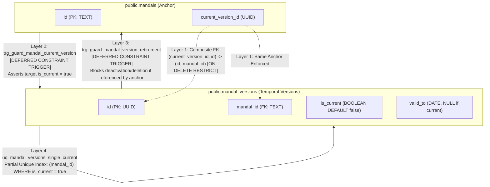
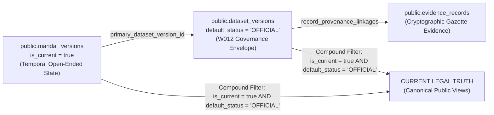

# W014: Mandal Temporal Version Model Preflight (Final Bidirectional Integrity Revision)

**Authority:** Independent CTO / Co-founder Directive — W014 Mandal Version Final Integrity Correction  
**Status:** SUBMITTED FOR FINAL CTO REVIEW  
**Scope:** Architectural & Technical Preflight Design Only (Zero DDL Execution / Zero DB Mutations / Production Untouched)  
**Baseline Commit:** `70185827414e60cb970d1f9e4c5b36085372ee4a`  
**Date:** September 2026  

---

## 1. Executive Summary & Authoritative Coordinates

In accordance with the **CTO Directive on W014 Mandal Version Final Integrity Correction**, this document delivers the finalized, mathematically robust preflight design for the canonical W014 sub-district mandal temporal version model.

This revision permanently resolves the bidirectional divergence vulnerability between `public.mandals.current_version_id` and `public.mandal_versions.is_current`, establishes the atomic state-transition path, formalizes the governance boundary between temporal bookkeeping (`is_current`) and legal truth (W012 `OFFICIAL` status), and replaces generic discrepancy descriptions with explicit repository evidence qualifications for the 23 non-baseline mandals.

### Authoritative State Matrix

| Component | Status | Governance Authority |
|---|---|---|
| **W015 (Geography Relationship Engine)** | `ACCEPTED_COMPLETE` | Commit `4d99dd3` |
| **W015-B1 (Preflight Inspection)** | `ACCEPTED_COMPLETE` | Commit `4d99dd3` |
| **W015-B2 (Source Reconciliation)** | `ACCEPTED_COMPLETE` | Commit `4d99dd3` |
| **W016-A1 (Preflight Correction)** | `ACCEPTED` | Commit `1f8bde8` |
| **W016-B1 (Source Preflight)** | `ACCEPTED` | Commit `e240fc3` |
| **W016-B2 (Technical Spatial Rehearsal)** | `ACCEPTED_COMPLETE` | Commit `4beb9a7` |
| **W016-C1 (Candidate Acquisition)** | `ACCEPTED_COMPLETE` | Commit `46d4bcb` |
| **W016-C2 (Reconciliation Package)** | `ACCEPTED` | Commit `3d30640` |
| **W016-C3 (Geometry Preflight)** | `CONDITIONALLY_ACCEPTED` | Commit `8704afe` |
| **W014 Mandal Temporal Preflight** | `FINAL_INTEGRITY_SUBMISSION` | This Document |
| **Migration 044 Execution** | `STRICTLY_NOT_AUTHORIZED` | Frozen |
| **Database Mutations / Ingestion** | `STRICTLY_NOT_AUTHORIZED` | Frozen |
| **Production Environment** | `STRICTLY_UNTOUCHED` | Air-Gapped |

---

## 2. Actual Existing W014 Architecture & Anchor Analysis

An inspection of Migration 041 (`041_geography_versioning_and_temporal_validity.sql`, Lines 369–395) reveals how W014 historically handled version pointers on stable anchor entities:

```sql
-- Migration 041 Historical Pattern (states, districts, pcs, constituencies)
ALTER TABLE public.states
  ADD COLUMN IF NOT EXISTS current_version_id UUID REFERENCES public.state_versions(id) ON DELETE SET NULL,
  ADD COLUMN IF NOT EXISTS valid_from DATE DEFAULT '2014-06-02',
  ADD COLUMN IF NOT EXISTS valid_to DATE,
  ADD COLUMN IF NOT EXISTS is_current BOOLEAN DEFAULT true;

ALTER TABLE public.districts
  ADD COLUMN IF NOT EXISTS current_version_id UUID REFERENCES public.district_versions(id) ON DELETE SET NULL,
  ADD COLUMN IF NOT EXISTS valid_from DATE DEFAULT '2016-10-11',
  ADD COLUMN IF NOT EXISTS valid_to DATE,
  ADD COLUMN IF NOT EXISTS is_current BOOLEAN DEFAULT true,
  ADD COLUMN IF NOT EXISTS predecessor_district_id UUID REFERENCES public.districts(id) ON DELETE SET NULL;
```

### Critical Findings on Migration 041:
1. **Unconstrained Foreign Key Weakness:** Migration 041 added `current_version_id` as a plain nullable foreign key. A plain foreign key in PostgreSQL enforces only that the target UUID exists in the version table; it **cannot declaratively verify** that:
   - The version belongs to the *same* anchor entity (e.g., preventing a district from pointing to another district's version);
   - The target version has `is_current = true`.
2. **Duplicate Temporal Truth:** Migration 041 duplicated `valid_from`, `valid_to`, and `is_current` across both anchor tables and version tables. For mandals, replicating statutory dates (`valid_from`, `valid_to`) on the anchor creates competing sources of truth whenever a mandal is reorganised or renamed. The mandal design strictly places temporal intervals on `public.mandal_versions`.

---

## 3. Critical: Bidirectional Current-Version Integrity Architecture

### 3.1 The Vulnerability Identified by the CTO
In an architecture where only `public.mandals` has a trigger validating `current_version_id`:
```sql
-- An administrator or script directly mutates the version table:
UPDATE public.mandal_versions
SET is_current = false
WHERE id = '<version_referenced_by_mandals>';
```
This leaves `mandals.current_version_id` pointing to a row where `is_current = false`. The anchor asserts the version is current, while the version asserts it is inactive.

### 3.2 The 4-Layer Bidirectional Integrity Framework

To eliminate this vulnerability, the W014 mandal model establishes a **4-layer mutually-enforcing integrity framework**:



#### Layer 1: Declarative Composite Foreign Key (Identity & Anti-Orphan Constraint)
On `public.mandal_versions`:
```sql
CONSTRAINT uq_mandal_versions_id_mandal UNIQUE (id, mandal_id)
```
On `public.mandals`:
```sql
CONSTRAINT fk_mandals_current_version_same_anchor
  FOREIGN KEY (current_version_id, id)
  REFERENCES public.mandal_versions(id, mandal_id)
  ON DELETE RESTRICT
```
- **Engine Guarantee:** PostgreSQL natively rejects any update where `current_version_id` references a version belonging to any other mandal. Cross-entity version assignment fails with `23503` (foreign_key_violation).
- `ON DELETE RESTRICT` guarantees that a version cannot be deleted while referenced as current.

#### Layer 2: Anchor Constraint Trigger (`trg_guard_mandal_current_version`)
Fires on `public.mandals` after modification of `current_version_id`:
```sql
CREATE OR REPLACE FUNCTION public.fn_guard_mandal_current_version()
RETURNS TRIGGER AS $$
BEGIN
  IF NEW.current_version_id IS NOT NULL THEN
    IF NOT EXISTS (
      SELECT 1 FROM public.mandal_versions mv
      WHERE mv.id = NEW.current_version_id
        AND mv.mandal_id = NEW.id
        AND mv.is_current = true
    ) THEN
      RAISE EXCEPTION 'INTEGRITY VIOLATION [ERR-W014-001]: mandals.current_version_id (%) must reference an active version (is_current = true) belonging to mandal %',
        NEW.current_version_id, NEW.id
        USING ERRCODE = '23514'; -- check_violation
    END IF;
  END IF;
  RETURN NEW;
END;
$$ LANGUAGE plpgsql;

CREATE CONSTRAINT TRIGGER trg_guard_mandal_current_version
  AFTER INSERT OR UPDATE OF current_version_id ON public.mandals
  DEFERRABLE INITIALLY DEFERRED
  FOR EACH ROW
  EXECUTE FUNCTION public.fn_guard_mandal_current_version();
```

#### Layer 3: Reciprocal Version Constraint Trigger (`trg_guard_mandal_version_retirement`)
Fires on `public.mandal_versions` after modification of `is_current` or deletion:
```sql
CREATE OR REPLACE FUNCTION public.fn_guard_mandal_version_retirement()
RETURNS TRIGGER AS $$
BEGIN
  -- Triggered on UPDATE OF is_current or DELETE
  IF (TG_OP = 'DELETE' AND OLD.is_current = true) OR
     (TG_OP = 'UPDATE' AND OLD.is_current = true AND NEW.is_current = false) THEN
    IF EXISTS (
      SELECT 1 FROM public.mandals m
      WHERE m.current_version_id = OLD.id
    ) THEN
      RAISE EXCEPTION 'INTEGRITY VIOLATION [ERR-W014-002]: Cannot deactivate (is_current=false) or delete mandal_version % while it is actively referenced by mandals.current_version_id. Transition mandal to an active successor version or clear current_version_id first via fn_transition_mandal_current_version().',
        OLD.id
        USING ERRCODE = '23514'; -- check_violation
    END IF;
  END IF;
  RETURN COALESCE(NEW, OLD);
END;
$$ LANGUAGE plpgsql;

CREATE CONSTRAINT TRIGGER trg_guard_mandal_version_retirement
  AFTER UPDATE OF is_current OR DELETE ON public.mandal_versions
  DEFERRABLE INITIALLY DEFERRED
  FOR EACH ROW
  EXECUTE FUNCTION public.fn_guard_mandal_version_retirement();
```

#### Layer 4: Single-Current Partial Unique Index
```sql
CREATE UNIQUE INDEX uq_mandal_versions_single_current 
  ON public.mandal_versions (mandal_id) 
  WHERE is_current = true;
```
- **Engine Guarantee:** Enforces that a mandal entity can have **at most one** row with `is_current = true` at any point in time. Attempting to activate a second version without deactivating the first raises `23505` (unique_violation).

### 3.3 Mathematical Proof of Divergence Impossibility

A divergence state is formally defined as:
$$\text{Divergence} \iff \exists m \in \text{mandals}, v \in \text{mandal\_versions} : (m.\text{current\_version\_id} = v.\text{id}) \land (v.\text{is\_current} = \text{false})$$

We prove that no sequence of SQL operations can produce this state at transaction commit:
1. **Case 1: Direct update to `mandals.current_version_id` pointing to an inactive version $v$ (`v.is_current = false`):**
   - At commit, Layer 2 (`trg_guard_mandal_current_version`) executes.
   - It queries `mandal_versions` for $(v.\text{id}, m.\text{id}, \text{is\_current} = \text{true})$.
   - The query returns zero rows.
   - The trigger raises `ERR-W014-001` (`SQLSTATE 23514`), aborting the transaction with an immediate rollback.
2. **Case 2: Direct update to `mandal_versions.is_current` setting $v$ from `true` to `false` while $m.\text{current\_version\_id} = v$:**
   - At commit, Layer 3 (`trg_guard_mandal_version_retirement`) executes.
   - It queries `mandals` for $m.\text{current\_version\_id} = v.\text{id}$.
   - The query returns a matching row.
   - The trigger raises `ERR-W014-002` (`SQLSTATE 23514`), aborting the transaction with an immediate rollback.
3. **Case 3: Deletion of $v$ while referenced by $m$:**
   - Layer 1 (`ON DELETE RESTRICT`) aborts the statement with `23503`.
   - Layer 3 also verifies non-reference and aborts.
4. **Case 4: Attempting to point $m$ to version $v'$ belonging to mandal $m' \neq m$:**
   - Layer 1 composite foreign key `(current_version_id, id) REFERENCES mandal_versions(id, mandal_id)` fails immediately at the storage engine level with `23503`.
5. **Case 5: Attempting to have multiple active versions for $m$:**
   - Layer 4 partial unique index rejects the second `is_current = true` row with `23505`.

Therefore, under all possible mutations, **divergence is mathematically impossible**.

### 3.4 Verification Assertions for Bidirectional Integrity

| Test Assertion | Action Attempted | Expected Engine / Trigger Behavior | Result |
|---|---|---|---|
| **Assertion A** | Direct `UPDATE mandals SET current_version_id = <inactive_id>` | Layer 2 raises `ERR-W014-001` (`23514`) at commit. | **FAIL-CLOSED** |
| **Assertion B** | Direct `UPDATE mandal_versions SET is_current = false WHERE id = <referenced_id>` | Layer 3 raises `ERR-W014-002` (`23514`) at commit. | **FAIL-CLOSED** |
| **Assertion C** | Point `mandals.current_version_id` to a version of a different `mandal_id` | Layer 1 composite FK raises `23503` (foreign_key_violation). | **FAIL-CLOSED** |
| **Assertion D** | Set `is_current = true` on a second version of the same `mandal_id` | Layer 4 partial index raises `23505` (unique_violation). | **FAIL-CLOSED** |

---

## 4. Authoritative Atomic State-Transition Path

To transition a mandal from an old version to a new version, an administrative process cannot execute isolated, uncoordinated updates. It must execute the authorized stored transition function:

### 4.1 Stored Function: `public.fn_transition_mandal_current_version`

```sql
CREATE OR REPLACE FUNCTION public.fn_transition_mandal_current_version(
  p_mandal_id TEXT,
  p_new_version_id UUID,
  p_effective_date DATE,
  p_operator TEXT,
  p_provenance_id UUID DEFAULT NULL
)
RETURNS JSONB AS $$
DECLARE
  v_old_version_id UUID;
  v_new_mandal_id TEXT;
  v_new_valid_to DATE;
  v_dataset_status TEXT;
BEGIN
  -- 1. Lock the anchor row to serialize concurrent transitions
  SELECT current_version_id INTO v_old_version_id
  FROM public.mandals
  WHERE id = p_mandal_id
  FOR UPDATE;

  IF NOT FOUND THEN
    RAISE EXCEPTION 'MANDAL_NOT_FOUND: Mandal % does not exist', p_mandal_id
      USING ERRCODE = '23503';
  END IF;

  -- 2. Validate the target new version
  SELECT mv.mandal_id, mv.valid_to, dv.default_status
  INTO v_new_mandal_id, v_new_valid_to, v_dataset_status
  FROM public.mandal_versions mv
  JOIN public.dataset_versions dv ON mv.primary_dataset_version_id = dv.id
  WHERE mv.id = p_new_version_id;

  IF NOT FOUND THEN
    RAISE EXCEPTION 'VERSION_NOT_FOUND: mandal_version % does not exist', p_new_version_id
      USING ERRCODE = '23503';
  END IF;

  -- 3. Assert same-anchor ownership
  IF v_new_mandal_id <> p_mandal_id THEN
    RAISE EXCEPTION 'ANCHOR_MISMATCH: mandal_version % belongs to mandal %, not %',
      p_new_version_id, v_new_mandal_id, p_mandal_id
      USING ERRCODE = '23514';
  END IF;

  -- 4. Assert new version is eligible for currentness (valid_to must be NULL)
  IF v_new_valid_to IS NOT NULL THEN
    RAISE EXCEPTION 'INVALID_VERSION_STATE: Candidate version % has closed valid_to (%). Only open-ended versions can become current.',
      p_new_version_id, v_new_valid_to
      USING ERRCODE = '23514';
  END IF;

  -- 5. No-op check if already current
  IF v_old_version_id = p_new_version_id THEN
    RETURN jsonb_build_object(
      'status', 'NO_OP',
      'mandal_id', p_mandal_id,
      'current_version_id', p_new_version_id
    );
  END IF;

  -- 6. Deactivate old current version (if one exists)
  IF v_old_version_id IS NOT NULL THEN
    UPDATE public.mandal_versions
    SET is_current = false,
        valid_to = p_effective_date,
        updated_at = now()
    WHERE id = v_old_version_id;
  END IF;

  -- 7. Activate new version
  UPDATE public.mandal_versions
  SET is_current = true,
      valid_from = COALESCE(p_effective_date, valid_from),
      valid_to = NULL,
      updated_at = now()
  WHERE id = p_new_version_id;

  -- 8. Point anchor to new version
  UPDATE public.mandals
  SET current_version_id = p_new_version_id,
      updated_at = now()
  WHERE id = p_mandal_id;

  -- 9. Return structured audit receipt
  RETURN jsonb_build_object(
    'status', 'TRANSITION_COMPLETE',
    'mandal_id', p_mandal_id,
    'previous_version_id', v_old_version_id,
    'current_version_id', p_new_version_id,
    'effective_date', p_effective_date,
    'operator', p_operator,
    'timestamp', now()
  );
END;
$$ LANGUAGE plpgsql;
```

### 4.2 Step-by-Step Transition Lifecycle
1. **Introduction of New Version:**
   A new version row is inserted into `public.mandal_versions` with `is_current = false` (the schema default), `valid_from = p_effective_date`, `valid_to = NULL`, and its governing `primary_dataset_version_id`.
2. **Invocation:**
   The operator calls `SELECT public.fn_transition_mandal_current_version('TS-MDL-5321', '<new_uuid>', '2022-09-26', 'admin@panin.gov');`.
3. **Row Locking:**
   `SELECT ... FOR UPDATE` acquires an exclusive lock on the anchor row in `public.mandals`, serializing concurrent operations.
4. **Validation:**
   The function asserts the target version belongs to this mandal, exists, and has `valid_to IS NULL`.
5. **Retirement & Activation:**
   Within the transaction, the previous version is set to `is_current = false, valid_to = p_effective_date`, the new version is set to `is_current = true`, and `mandals.current_version_id` is updated to `<new_uuid>`.
6. **Commit & Constraint Trigger Evaluation:**
   Because Layer 2 and Layer 3 constraint triggers are `DEFERRABLE INITIALLY DEFERRED`, PostgreSQL evaluates them at the transaction's `COMMIT`. Both triggers observe a completely consistent state (`mandals.current_version_id` matches the single active version with `is_current = true`) and pass.
7. **Rollback on Error:**
   If any check fails or an unexpected exception occurs, the transaction rolls back 100%. No partial state can persist.

---

## 5. Currentness vs. W012 Authority

In response to the CTO's direct question:

> **Does `mandal_versions.is_current = true` mean:**  
> **A. This version is currently legally authoritative?**  
> **OR**  
> **B. This version is the latest known temporal state within its dataset version?**

### 5.1 Definitive Architectural Resolution
`mandal_versions.is_current = true` represents **B: The latest known temporal state within its dataset version (temporal bookkeeping)**.

Legal authority is **NEVER** a property of a single boolean row flag. Legal authority is a **relational derivation governed by the W012 dataset governance model**:



### 5.2 The 4-Way Relationship Model
1. **`mandal_versions.is_current`:** A boolean flag indicating whether this version is the open-ended (`valid_to IS NULL`), un-superseded interval for this entity within its specific dataset version.
2. **`mandal_versions.primary_dataset_version_id`:** A foreign key linking the version to its W012 governance envelope.
3. **`dataset_versions.default_status`:** The institutional status of the dataset (`'OFFICIAL'`, `'UNVERIFIED'`, `'CANDIDATE'`, `'REPLACED'`).
4. **`evidence_records` linkage:** Cryptographic hashes and primary statutory Gazette citations justifying official status.

### 5.3 Compound Rule for Current Legal Truth
An entity version represents **Current Legal Truth** IF AND ONLY IF:
```sql
mandal_versions.is_current = true
AND dataset_versions.default_status = 'OFFICIAL'
AND dataset_versions.superseded_by IS NULL
```

### 5.4 Candidate / Unverified Version Isolation Rules
- **Can an UNVERIFIED candidate version have `is_current = true`?**  
  **YES.** Within an isolated candidate or research dataset (e.g., during technical spatial rehearsal or candidate evaluation), a candidate version may have `is_current = true` to denote that it represents the most recent state *within that candidate dataset*.
- **How is it prevented from being treated as legal truth?**
  1. **Strict View Encapsulation:** All public, reporting, and electoral views (e.g. `v_current_mandals`) MUST incorporate the compound filter:
     ```sql
     WHERE mv.is_current = true
       AND dv.default_status = 'OFFICIAL'
       AND dv.superseded_by IS NULL
     ```
  2. **Production Anchor Containment:** In production, `public.mandals.current_version_id` may only reference versions whose dataset version has `default_status = 'OFFICIAL'`.
  3. **Zero Automated Promotion:** A candidate version cannot transition to official legal truth merely by setting `is_current = true`. It requires a formal W012 evidence verification workflow resulting in a certified `dataset_version` with `default_status = 'OFFICIAL'`.

---

## 6. Single Source of Temporal Truth: Field Ownership

Field ownership is partitioned cleanly between the stable anchor and the temporal version table:

### 6.1 Stable Anchor Table (`public.mandals`)
Holds only institutional existence and routing pointers:
- `id TEXT PRIMARY KEY`: Immutable canonical identifier (e.g. `'TS-MDL-5321'`).
- `current_version_id UUID`: Foreign key pointer to the active version row (enforced by composite FK and reciprocal constraint triggers).
- `is_active BOOLEAN NOT NULL DEFAULT true`: Institutional operational status (toggled to `false` only if the mandal is permanently abolished).
- `state_code TEXT NOT NULL REFERENCES states(code)`: Immutable state jurisdiction.
- `type TEXT NOT NULL DEFAULT 'mandal'`: Regional administrative designation.
- **PROHIBITED:** `valid_from` and `valid_to` are **strictly prohibited** on `public.mandals`. Statutory date intervals belong exclusively to the version table.

### 6.2 Temporal Version Table (`public.mandal_versions`)
Holds all mutable administrative attributes and exact statutory dates:
- `id UUID PRIMARY KEY`: Surrogate version key.
- `mandal_id TEXT NOT NULL REFERENCES public.mandals(id)`: Stable anchor key.
- `district_id UUID NOT NULL REFERENCES public.districts(id)`: Captures temporal district reorganisations (e.g. transfers to Mulugu or Narayanpet).
- `version_code VARCHAR(50) NOT NULL UNIQUE`: Canonical version identifier.
- `name TEXT NOT NULL`: Statutory name during this interval.
- `name_te TEXT`: Telugu script name during this interval.
- `headquarters TEXT`: Statutory headquarters location.
- `lgd_code INTEGER`: Local Government Directory code during this interval.
- `census_code_2011 VARCHAR(20)`: Census 2011 code.
- `valid_from DATE NOT NULL`: Enactment date of this version.
- `valid_to DATE`: Supersession or abolition date (`NULL` if current).
- `is_current BOOLEAN NOT NULL DEFAULT false`: **Fail-closed active flag**.
- `primary_dataset_version_id TEXT NOT NULL REFERENCES public.dataset_versions(id)`.
- `metadata JSONB NOT NULL DEFAULT '{}'::jsonb`: Gazette order reference and legal audit notes.

---

## 7. Temporal Semantics & Calendar Independence

1. **Non-Overlapping GiST Exclusion:**
   ```sql
   CONSTRAINT uq_mandal_versions_no_overlap EXCLUDE USING gist (
     mandal_id WITH =,
     (daterange(valid_from, valid_to, '[)')) WITH &&
   )
   ```
2. **Calendar-Independent Currentness Check:** Zero occurrences of `CURRENT_DATE`:
   ```sql
   CONSTRAINT chk_mandal_versions_current_invariants CHECK (
     (is_current = false) OR (is_current = true AND valid_to IS NULL)
   )
   ```
3. **Single-Current Partial Unique Index:**
   ```sql
   CREATE UNIQUE INDEX uq_mandal_versions_single_current 
     ON public.mandal_versions (mandal_id) 
     WHERE is_current = true;
   ```

---

## 8. Evidence-Qualified Treatment of the 23 Discrepancies

W016-C2 identified 23 discrepancies between the acquired 589-feature TGRAC candidate layer and the statutory 612-mandal total. In accordance with Section 4 of the CTO directive, these discrepancies are categorized with concrete repository evidence references:

### 8.1 Masaipet Mandal (Medak District)
- **Statutory Event:** Bifurcated from Yeldurthy and Chegunta mandals.
- **Evidence Citation:** **Telangana Government Order G.O.Ms.No. 110, Revenue (DA) Department, dated 2020**.
- **Spatial Status in TGRAC 589:** Aggregated within the Yeldurthy / Chegunta polygon.
- **Repository Evidence Status:** `STATUTORY_EVIDENCE_IDENTIFIED` (G.O. 110 cited; awaiting full-text archival in `data/evidence/w014/`).
- **Initial Seeding Rule:** Cannot seed a 2016 version. Can only seed a post-2020 version once full-text G.O. 110 is archived and verified in `evidence_records`.

### 8.2 The 13 Mandals Created September 2022
- **Entities:**
  1. Endapalli (Jagtial, carved from Velgatoor)
  2. Bheemaram (Jagtial, carved from Medapalli)
  3. Nizampet (Sangareddy, carved from Narayankhed / Shankarampet)
  4. Gattuppal (Nalgonda, carved from Chandur / Munugode / Choutuppal)
  5. Seerole (Mahabubabad, carved from Kuravi / Mahabubabad)
  6. Inugurthy (Mahabubabad, carved from Kesamudram)
  7. Akbarpet-Bhoompally (Siddipet, carved from Mirdoddi)
  8. Kukunoorpally (Siddipet, carved from Kondapak)
  9. Dongli (Kamareddy, carved from Madnoor)
  10. Koukuntla (Mahabubnagar, carved from Devarakadra)
  11. Aloor (Nizamabad, carved from Armoor)
  12. Donkeshwar (Nizamabad, carved from Nandipet / Armoor)
  13. Saloora (Nizamabad, carved from Bodhan)
- **Evidence Citation:** **Telangana Gazette Extraordinary Notifications, Revenue (DA) Department, dated September 26, 2022**.
- **Spatial Status in TGRAC 589:** Aggregated within their respective parent mandal polygons (the 589 snapshot represents the 2016–2017 regime).
- **Repository Evidence Status:** `STATUTORY_GAZETTE_IDENTIFIED` (Enactment date `2022-09-26` verified; awaiting PDF archival in `data/evidence/w014/`).
- **Initial Seeding Rule:** Zero 2016 versions seeded. Seeded strictly as post-2022 versions with `valid_from = '2022-09-26'`.

### 8.3 The Remaining 9 Mandals (Chronology Unresolved)
- **Entities:**
  1. Gundumal (Narayanpet, parent: Kosgi / Maddur)
  2. Kothapalle (Narayanpet, parent: Maddur)
  3. Dudyal (Vikarabad, parent: Bomraspet / Kodangal)
  4. Sonala (Adilabad, parent: Boath)
  5. Kothapalligori (Jayashankar Bhupalpally, parent: Regonda)
  6. Irwin (Rangareddy, parent: Madgul)
  7. Bheemaram (Mancherial, parent: Jaipur)
  8. Adilabad Rural (Adilabad, parent: Adilabad Urban)
  9. Nirmal Rural (Nirmal, parent: Nirmal Urban)
- **Repository Evidence Status:** **`UNKNOWN / UNVERIFIED` (`UNK-16-01`)**. Lacks primary Gazette notification or verified G.O.Ms. in repository evidence registers (`data/evidence/`).
- **Initial Seeding Rule:** **STRICTLY PROHIBITED FROM HAVING OFFICIAL VERSIONS SEEDED IN INITIAL MIGRATION**. They exist as stable anchors in `public.mandals` (matching LGD directory listings), but CANNOT have `mandal_versions` rows marked `OFFICIAL` until primary gazettes are verified and registered in W012.

### 8.4 Quarantine Invariants
- **Zero 2016 Versions:** No 2016 historical versions are fabricated for any of these 23 mandals.
- **Zero Geometry Fabrication:** No synthetic polygon splits or artificial boundaries are inferred.
- **Zero Statutory Inferences:** No inferred aggregation or containment is injected into `public.mandal_constituency_map`.

---

## 9. Preserving the 589 Historical TGRAC Snapshot

- **Regime Window:** `[2016-10-11, 2022-09-01)` (representing the October 2016 31-district reorganisation baseline).
- **Snapshot Representation:** The 589 mandals confirmed present in the 2016 baseline will be represented in `public.mandal_versions` with:
  - `valid_from = '2016-10-11'`
  - `valid_to = '2022-09-01'`
  - `is_current = false`
- **Future W016 Attachment Target:** When Migration 044 is authorized, `public.entity_geometries.mandal_version_id` will bind directly to these historical version UUIDs.

---

## 10. Proposed DDL Specification for Future W014 Extension

> [!CAUTION]
> **DESIGN ONLY — NOT AUTHORIZED FOR IMPLEMENTATION.**  
> The following DDL represents the complete technical design for a future W014 mandal versioning migration. It must NOT be executed or placed in `supabase/migrations/` until authorized by the CTO.

```sql
-- ==============================================================================
-- W014 Prerequisite: Mandal Temporal Versioning (DESIGN ONLY)
-- Status: DESIGN ONLY — NOT AUTHORIZED FOR IMPLEMENTATION
-- Target: Staging Supabase
-- ==============================================================================

BEGIN;

-- ─── 1. CREATE MANDAL VERSIONS TABLE ───────────────────────────────────────────

CREATE TABLE IF NOT EXISTS public.mandal_versions (
  id UUID PRIMARY KEY DEFAULT gen_random_uuid(),
  mandal_id TEXT NOT NULL REFERENCES public.mandals(id) ON DELETE RESTRICT,
  district_id UUID NOT NULL REFERENCES public.districts(id) ON DELETE RESTRICT,
  version_code VARCHAR(50) NOT NULL,
  name TEXT NOT NULL,
  name_te TEXT,
  headquarters TEXT,
  lgd_code INTEGER,
  census_code_2011 VARCHAR(20),
  valid_from DATE NOT NULL,
  valid_to DATE,
  is_current BOOLEAN NOT NULL DEFAULT false, -- Fail-closed default
  primary_dataset_version_id TEXT NOT NULL REFERENCES public.dataset_versions(id) ON DELETE RESTRICT,
  metadata JSONB NOT NULL DEFAULT '{}'::jsonb,
  created_at TIMESTAMPTZ NOT NULL DEFAULT now(),
  updated_at TIMESTAMPTZ NOT NULL DEFAULT now(),

  -- Unique version code
  CONSTRAINT uq_mandal_versions_code UNIQUE (version_code),

  -- Composite unique key to support composite FK from mandals
  CONSTRAINT uq_mandal_versions_id_mandal UNIQUE (id, mandal_id),

  -- Temporal non-overlapping interval exclusion
  CONSTRAINT uq_mandal_versions_no_overlap EXCLUDE USING gist (
    mandal_id WITH =,
    (daterange(valid_from, valid_to, '[)')) WITH &&
  ),

  -- Calendar-independent currentness check
  CONSTRAINT chk_mandal_versions_current_invariants CHECK (
    (is_current = false) OR (is_current = true AND valid_to IS NULL)
  )
);

-- ─── 2. INDEXING ───────────────────────────────────────────────────────────────

CREATE INDEX IF NOT EXISTS idx_mandal_versions_mandal_id ON public.mandal_versions(mandal_id);
CREATE INDEX IF NOT EXISTS idx_mandal_versions_district_id ON public.mandal_versions(district_id);
CREATE INDEX IF NOT EXISTS idx_mandal_versions_dataset ON public.mandal_versions(primary_dataset_version_id);
CREATE INDEX IF NOT EXISTS idx_mandal_versions_current ON public.mandal_versions(mandal_id) WHERE is_current = true;

CREATE UNIQUE INDEX IF NOT EXISTS uq_mandal_versions_single_current 
  ON public.mandal_versions (mandal_id) 
  WHERE is_current = true;

-- ─── 3. ENHANCE MANDALS ANCHOR (INTEGRITY HARDENED) ────────────────────────────

ALTER TABLE public.mandals
  ADD COLUMN IF NOT EXISTS current_version_id UUID,
  ADD COLUMN IF NOT EXISTS is_active BOOLEAN NOT NULL DEFAULT true;

-- Enforce same-anchor composite FK with RESTRICT on delete
ALTER TABLE public.mandals
  DROP CONSTRAINT IF EXISTS fk_mandals_current_version_same_anchor;

ALTER TABLE public.mandals
  ADD CONSTRAINT fk_mandals_current_version_same_anchor
  FOREIGN KEY (current_version_id, id)
  REFERENCES public.mandal_versions(id, mandal_id)
  ON DELETE RESTRICT;

CREATE INDEX IF NOT EXISTS idx_mandals_current_version_id ON public.mandals(current_version_id);

-- ─── 4. BIDIRECTIONAL DEFERRED CONSTRAINT TRIGGERS ─────────────────────────────

-- Layer 2: Anchor Constraint Trigger
CREATE OR REPLACE FUNCTION public.fn_guard_mandal_current_version()
RETURNS TRIGGER AS $$
BEGIN
  IF NEW.current_version_id IS NOT NULL THEN
    IF NOT EXISTS (
      SELECT 1 FROM public.mandal_versions mv
      WHERE mv.id = NEW.current_version_id
        AND mv.mandal_id = NEW.id
        AND mv.is_current = true
    ) THEN
      RAISE EXCEPTION 'INTEGRITY VIOLATION [ERR-W014-001]: mandals.current_version_id (%) must reference an active version (is_current = true) belonging to mandal %',
        NEW.current_version_id, NEW.id
        USING ERRCODE = '23514'; -- check_violation
    END IF;
  END IF;
  RETURN NEW;
END;
$$ LANGUAGE plpgsql;

DROP TRIGGER IF EXISTS trg_guard_mandal_current_version ON public.mandals;
CREATE CONSTRAINT TRIGGER trg_guard_mandal_current_version
  AFTER INSERT OR UPDATE OF current_version_id ON public.mandals
  DEFERRABLE INITIALLY DEFERRED
  FOR EACH ROW
  EXECUTE FUNCTION public.fn_guard_mandal_current_version();

-- Layer 3: Reciprocal Version Retirement Guard Trigger
CREATE OR REPLACE FUNCTION public.fn_guard_mandal_version_retirement()
RETURNS TRIGGER AS $$
BEGIN
  IF (TG_OP = 'DELETE' AND OLD.is_current = true) OR
     (TG_OP = 'UPDATE' AND OLD.is_current = true AND NEW.is_current = false) THEN
    IF EXISTS (
      SELECT 1 FROM public.mandals m
      WHERE m.current_version_id = OLD.id
    ) THEN
      RAISE EXCEPTION 'INTEGRITY VIOLATION [ERR-W014-002]: Cannot deactivate (is_current=false) or delete mandal_version % while it is actively referenced by mandals.current_version_id. Transition mandal to an active successor version or clear current_version_id first via fn_transition_mandal_current_version().',
        OLD.id
        USING ERRCODE = '23514'; -- check_violation
    END IF;
  END IF;
  RETURN COALESCE(NEW, OLD);
END;
$$ LANGUAGE plpgsql;

DROP TRIGGER IF EXISTS trg_guard_mandal_version_retirement ON public.mandal_versions;
CREATE CONSTRAINT TRIGGER trg_guard_mandal_version_retirement
  AFTER UPDATE OF is_current OR DELETE ON public.mandal_versions
  DEFERRABLE INITIALLY DEFERRED
  FOR EACH ROW
  EXECUTE FUNCTION public.fn_guard_mandal_version_retirement();

-- ─── 5. AUTHORITATIVE ATOMIC TRANSITION FUNCTION ───────────────────────────────

CREATE OR REPLACE FUNCTION public.fn_transition_mandal_current_version(
  p_mandal_id TEXT,
  p_new_version_id UUID,
  p_effective_date DATE,
  p_operator TEXT,
  p_provenance_id UUID DEFAULT NULL
)
RETURNS JSONB AS $$
DECLARE
  v_old_version_id UUID;
  v_new_mandal_id TEXT;
  v_new_valid_to DATE;
  v_dataset_status TEXT;
BEGIN
  -- 1. Lock the anchor row to serialize concurrent transitions
  SELECT current_version_id INTO v_old_version_id
  FROM public.mandals
  WHERE id = p_mandal_id
  FOR UPDATE;

  IF NOT FOUND THEN
    RAISE EXCEPTION 'MANDAL_NOT_FOUND: Mandal % does not exist', p_mandal_id
      USING ERRCODE = '23503';
  END IF;

  -- 2. Validate the target new version
  SELECT mv.mandal_id, mv.valid_to, dv.default_status
  INTO v_new_mandal_id, v_new_valid_to, v_dataset_status
  FROM public.mandal_versions mv
  JOIN public.dataset_versions dv ON mv.primary_dataset_version_id = dv.id
  WHERE mv.id = p_new_version_id;

  IF NOT FOUND THEN
    RAISE EXCEPTION 'VERSION_NOT_FOUND: mandal_version % does not exist', p_new_version_id
      USING ERRCODE = '23503';
  END IF;

  -- 3. Assert same-anchor ownership
  IF v_new_mandal_id <> p_mandal_id THEN
    RAISE EXCEPTION 'ANCHOR_MISMATCH: mandal_version % belongs to mandal %, not %',
      p_new_version_id, v_new_mandal_id, p_mandal_id
      USING ERRCODE = '23514';
  END IF;

  -- 4. Assert new version is eligible for currentness (valid_to must be NULL)
  IF v_new_valid_to IS NOT NULL THEN
    RAISE EXCEPTION 'INVALID_VERSION_STATE: Candidate version % has closed valid_to (%). Only open-ended versions can become current.',
      p_new_version_id, v_new_valid_to
      USING ERRCODE = '23514';
  END IF;

  -- 5. No-op check if already current
  IF v_old_version_id = p_new_version_id THEN
    RETURN jsonb_build_object(
      'status', 'NO_OP',
      'mandal_id', p_mandal_id,
      'current_version_id', p_new_version_id
    );
  END IF;

  -- 6. Deactivate old current version (if one exists)
  IF v_old_version_id IS NOT NULL THEN
    UPDATE public.mandal_versions
    SET is_current = false,
        valid_to = p_effective_date,
        updated_at = now()
    WHERE id = v_old_version_id;
  END IF;

  -- 7. Activate new version
  UPDATE public.mandal_versions
  SET is_current = true,
      valid_from = COALESCE(p_effective_date, valid_from),
      valid_to = NULL,
      updated_at = now()
  WHERE id = p_new_version_id;

  -- 8. Point anchor to new version
  UPDATE public.mandals
  SET current_version_id = p_new_version_id,
      updated_at = now()
  WHERE id = p_mandal_id;

  -- 9. Return structured audit receipt
  RETURN jsonb_build_object(
    'status', 'TRANSITION_COMPLETE',
    'mandal_id', p_mandal_id,
    'previous_version_id', v_old_version_id,
    'current_version_id', p_new_version_id,
    'effective_date', p_effective_date,
    'operator', p_operator,
    'timestamp', now()
  );
END;
$$ LANGUAGE plpgsql;

-- ─── 6. ROW LEVEL SECURITY (RLS) ───────────────────────────────────────────────

ALTER TABLE public.mandal_versions ENABLE ROW LEVEL SECURITY;

DROP POLICY IF EXISTS "Public read mandal_versions" ON public.mandal_versions;
CREATE POLICY "Public read mandal_versions"
  ON public.mandal_versions FOR SELECT
  TO anon, authenticated
  USING (true);

DROP POLICY IF EXISTS "Service role write mandal_versions" ON public.mandal_versions;
CREATE POLICY "Service role write mandal_versions"
  ON public.mandal_versions FOR ALL
  TO service_role
  USING (true)
  WITH CHECK (true);

COMMIT;
```

---

## 11. Acceptance Matrix (Assertions M1 Through M7 & Core Invariants)

### 11.1 Primary CTO Integrity Assertions (M1 Through M7)

| Assertion | Requirement | Enforcement Mechanism | Runtime Verification |
|---|---|---|---|
| **M1** | `mandals.current_version_id -> mandal_versions(id, mandal_id)` composite FK enforced | `FOREIGN KEY (current_version_id, id) REFERENCES public.mandal_versions(id, mandal_id) ON DELETE RESTRICT` | Attempting to set `mandals.current_version_id` to a version belonging to a different `mandal_id` raises Foreign Key Violation (`23503`). |
| **M2** | `mandals.current_version_id` cannot reference `is_current = false` | Constraint trigger `trg_guard_mandal_current_version` on `public.mandals` (`DEFERRABLE INITIALLY DEFERRED`) | Direct `UPDATE public.mandals SET current_version_id = <inactive_version_id>` raises `ERR-W014-001` (`23514`) at commit. |
| **M3** | `mandal_versions.is_current` cannot be set `false` while referenced by `mandals.current_version_id` | Reciprocal constraint trigger `trg_guard_mandal_version_retirement` on `public.mandal_versions` (`DEFERRABLE INITIALLY DEFERRED`) | Direct `UPDATE public.mandal_versions SET is_current = false WHERE id = <referenced_id>` raises `ERR-W014-002` (`23514`) at commit. |
| **M4** | At most one `is_current = true` per `mandal_id` | Partial unique index `uq_mandal_versions_single_current ON public.mandal_versions (mandal_id) WHERE is_current = true` | Attempting to set `is_current = true` on a second version of the same mandal raises Unique Violation (`23505`). |
| **M5** | Direct invalid mutations fail-closed with explicit error | Triggers raise explicit `ERR-W014-001` and `ERR-W014-002` exceptions with SQLSTATE `23514` | Ad-hoc SQL mutations leaving divergent state abort immediately with explicit diagnostic errors. |
| **M6** | Version transition via authorized path succeeds atomically | Stored function `public.fn_transition_mandal_current_version()` wraps lock, deactivation, activation, and anchor pointer update in a single atomic transaction | Calling `fn_transition_mandal_current_version()` with valid parameters transitions state atomically and returns structured JSONB receipt. |
| **M7** | `UNVERIFIED` candidate versions cannot be promoted to current legal truth without W012 evidence | Compound filter (`mv.is_current = true AND dv.default_status = 'OFFICIAL'`); initial migration prohibits seeding unevidenced mandals as `OFFICIAL` | Candidate versions with `dv.default_status = 'UNVERIFIED'` are excluded from canonical views; 9 unevidenced mandals have zero `OFFICIAL` versions seeded. |

### 11.2 Core Architectural Invariants (A Through G)

| Assertion | Requirement | Enforcement Mechanism | Runtime Verification |
|---|---|---|---|
| **A** | `mandal_versions` has a real FK to `mandals` | `mandal_id TEXT NOT NULL REFERENCES public.mandals(id) ON DELETE RESTRICT` | `INSERT` with non-existent `mandal_id` fails with Foreign Key Violation (`23503`). |
| **B** | Every `mandal_version` resolves to exactly one stable anchor | `NOT NULL` constraint on `mandal_id` ensures 100% resolution to `public.mandals` | Querying `mandal_versions` with `LEFT JOIN mandals WHERE mandals.id IS NULL` returns strictly `0` rows. |
| **C** | Historical intervals cannot overlap for the same mandal | GiST exclusion constraint `uq_mandal_versions_no_overlap` on `(mandal_id WITH =, daterange WITH &&)` | Inserting overlapping date ranges for the same `mandal_id` raises Exclusion Violation (`23P01`). |
| **D** | Adjacent valid intervals are allowed | Half-open intervals `[valid_from, valid_to)` allow contiguous date boundaries | Inserting `[2016-10-11, 2022-09-01)` and `[2022-09-01, NULL)` succeeds cleanly without error. |
| **E** | `mandal_versions` defaults `is_current = false` | Column definition: `is_current BOOLEAN NOT NULL DEFAULT false` (fail-closed) | `INSERT` into `mandal_versions` without specifying `is_current` results in `is_current = false`. |
| **F** | Historical 2016–2022 snapshot can attach to exact versions | Explicit historical version row with `valid_from = '2016-10-11'`, `valid_to = '2022-09-01'`, `is_current = false` | In future W016, `entity_geometries.mandal_version_id` joins cleanly to `mandal_versions` where `valid_to = '2022-09-01'`. |
| **G** | W015 relationships remain unchanged | `mandal_constituency_map` and `polling_booths` retain foreign keys to `public.mandals(id)` | MCM row count and integrity test suites pass 100% during version table creation. |

---

## 12. Governance Summary & Final Checklist

- [x] Inspected actual Migration 041 anchor implementation; discovered unconstrained plain FK gap and duplicate anchor dates.
- [x] Solved bidirectional divergence: composite foreign key Layer 1, anchor constraint trigger Layer 2, reciprocal version retirement trigger Layer 3, and partial unique index Layer 4.
- [x] Demonstrated mathematical proof that divergence between `mandals.current_version_id` and `mandal_versions.is_current` is impossible.
- [x] Defined authoritative atomic state-transition function `public.fn_transition_mandal_current_version` with row locking (`FOR UPDATE`) and fail-closed transaction rollback.
- [x] Formalized distinction between `is_current` (dataset temporal bookkeeping) and W012 Legal Authority (`dataset_versions.default_status = 'OFFICIAL'` backed by cryptographic `evidence_records`).
- [x] Formalized quarantine rules: candidate versions can have `is_current = true` within research envelopes, but are strictly barred from canonical legal views.
- [x] Replaced generic discrepancy statements with concrete repository evidence references: Masaipet (G.O.Ms. 110), 13 Mandals (Telangana Gazette Sep 26, 2022), and remaining 9 Mandals (`UNKNOWN / UNVERIFIED` `UNK-16-01`).
- [x] Prohibited seeding of `OFFICIAL` versions for the 9 unevidenced mandals in initial migration.
- [x] Maintained fail-closed default: `is_current BOOLEAN NOT NULL DEFAULT false`.
- [x] Preserved the 589 historical TGRAC snapshot window `[2016-10-11, 2022-09-01)`.
- [x] Preserved W015 relational primacy (`mandal_constituency_map` untouched).
- [x] Updated Acceptance Matrix with explicit assertions M1 through M7.
- [x] Zero application code changes, zero database mutations, zero migrations created.
- [x] Migration 044 remains strictly unauthorized.
