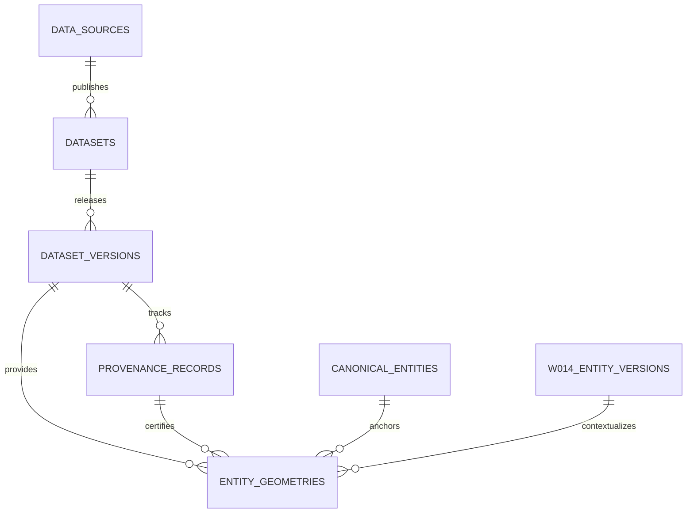

# W016-C3: Geometry Ingestion Preflight — Provenance, Temporal Attachment & Candidate-Status Quarantine

**Authority:** Independent CTO / Co-founder Directive W016-C3  
**Status:** SUBMITTED FOR CTO REVIEW  
**Scope:** Architecture & Technical Preflight Design Only (Zero DDL Execution / Zero DB Mutations / Production Untouched)  
**Baseline Commit:** `3d30640ff8df344b5ba27b915398989ac61276bc`  
**Date:** September 2026  

---

## 1. Executive Summary & Authoritative Coordinates

In accordance with CTO Directive **W016-C3**, this preflight delivers the complete architectural, provenance, temporal, and security design for ingesting acquired candidate vector geometries into PANIN/Kshetra.

### Authoritative State Matrix

| Component | Status | Governance Authority |
|---|---|---|
| **W015 (Geography Relationship Engine)** | `ACCEPTED_COMPLETE` | Commit `4d99dd3` |
| **W015-B1 (Preflight Inspection)** | `ACCEPTED_COMPLETE` | Commit `4d99dd3` |
| **W015-B2 (Source Reconciliation)** | `ACCEPTED_COMPLETE` | Commit `4d99dd3` |
| **W016-A1 (Preflight Correction)** | `ACCEPTED` | Commit `1f8bde8` |
| **W016-B1 (Source Preflight)** | `ACCEPTED` | Commit `e240fc3` |
| **W016-B2 (Technical Spatial Rehearsal)** | `ACCEPTED_COMPLETE` | Commit `4beb9a7` |
| **W016-C1 (Candidate Acquisition)** | `ACCEPTED_COMPLETE` | Commit `46d4bcb` |
| **W016-C2 (Reconciliation Package)** | `ACCEPTED` | Commit `3d30640` |
| **W016-C3 (Ingestion Preflight)** | `SUBMITTED_FOR_CTO_REVIEW` | This Document |
| **Migration 044 Execution** | `STRICTLY_NOT_AUTHORIZED` | Design Only |
| **Database Mutations / Ingestion** | `STRICTLY_NOT_AUTHORIZED` | Frozen |
| **Production Environment** | `STRICTLY_UNTOUCHED` | Air-Gapped |

---

## 2. Architectural Objective & Core Invariants

The primary objective of W016-C3 is to design the **minimum safe mechanism** by which PANIN can preserve the acquired TGRAC vector geometries (119 ACs, 33 Districts, 589 Mandals) without ever misrepresenting them as official constitutional/statutory geography or current legal reality.

### Absolute Invariants & Prohibitions
1. **No Migration Execution:** Migration 044 is designed herein but MUST NOT be created or executed.
2. **No Database Mutations:** No SQL inserts, schema updates, or geometry alterations are permitted on staging or production.
3. **No Promotion to Official:** All candidate geometries must remain strictly quarantined as `UNVERIFIED` under W012 data governance.
4. **No Current Geometry Conflation:** The 589-mandal historical snapshot must NEVER satisfy a current-geography query.
5. **W015 Relational Primacy:** Statutory relationships (`mandal_constituency_map`, `polling_booths`) remain the sole source of truth; spatial relationships remain purely observational and advisory.
6. **Immutable Evidence:** Raw TGRAC JSON files in `data/geo/candidate_authoritative/` remain permanently frozen and immutable.

---

## 3. Evaluation of Geometry Models: Option A vs. Option B

A foundational architectural question of W016-C3 is where geometry records should reside in the PostgreSQL/PostGIS schema.

### Option A: Direct Attachment to W014 Version Tables
In this model, a `geometry(MultiPolygon, 4326)` column is added directly to existing tables: `public.constituency_versions`, `public.district_versions`, and `public.mandal_versions` (or canonical anchor tables).

* **Drawbacks of Option A:**
  1. **Destructive Overwriting:** When a newer or higher-authority geometry is acquired (e.g. certified ECI boundaries), it either overwrites the candidate geometry or requires redundant schema versions solely for geometry changes.
  2. **Single-Source Inflexibility:** Cannot simultaneously store and compare coexisting geometry candidates (e.g., TGRAC candidate, datta07 fixture, ECI constitutional geometry, and scenario projections).
  3. **Severe Table Bloat:** Polygon payloads (several megabytes) bloat core relational tables, degrading routine scalar queries (e.g. searching AC names, listing districts, joining elections).
  4. **Coupled Lifecycle:** Ties the lifecycle of geometry artifacts to statutory legal validity ranges.

### Option B: Dedicated Versioned Geometry Relation (`public.entity_geometries`) — RECOMMENDED
In this model, a dedicated table `public.entity_geometries` is introduced. It links directly to:
- Canonical entity anchors (`entity_type`, `entity_id`);
- W014 temporal version (`version_id`);
- W012 dataset version (`dataset_version_id`);
- W012 provenance lineage (`provenance_id`);
- Authoritative and temporal status classifications.



* **Advantages of Option B:**
  1. **Multi-Source Coexistence:** Multiple geometry artifacts (candidates, official orders, simulations, fixtures) can coexist for the same entity and temporal regime without collision.
  2. **Audit & Spatial Comparison:** Enables direct SQL spatial comparison (e.g. `ST_Difference(eci.geometry, tgrac.geometry)`, `ST_HausdorffDistance`, Hausdorff area overlap audits).
  3. **Zero Impact on Relational Tables:** Core tables (`constituencies`, `districts`, `mandals`, and their version tables) retain clean scalar attributes.
  4. **Fine-Grained Indexing:** GiST spatial indexes live exclusively on `entity_geometries`, optimizing query plans.
  5. **Explicit Quarantine:** Each geometry record carries explicit factual and authority status, preventing unverified data from masquerading as official data.

**Verdict:** Option B is selected as the authoritative architectural baseline.

---

## 4. Data Source, Dataset, and Dataset Version Design (W012 Integration)

To integrate TGRAC candidate geometries cleanly into the W012 Data Governance Foundation, three catalog tiers are defined:

### 4.1 Data Source Registry (`data_sources`)
```sql
-- DESIGN ONLY — NOT AUTHORIZED FOR IMPLEMENTATION
INSERT INTO public.data_sources (
  id, name, publisher, authority_level, canonical_url, license, retrieval_method, refresh_frequency, is_active
) VALUES (
  'tgrac_gis',
  'Telangana Remote Sensing Applications Centre (TGRAC) GIS Portal',
  'Telangana Remote Sensing Applications Centre, Planning Department, Govt of Telangana',
  'statutory',
  'https://tgrac.telangana.gov.in',
  'State Government Spatial Data / Departmental Open Access',
  'wfs_ogc_api',
  'as_amended',
  true
);
```

### 4.2 Datasets Catalog (`datasets`)
Three distinct datasets are defined across the geography domain to separate electoral boundaries from administrative boundaries:
```sql
-- DESIGN ONLY — NOT AUTHORIZED FOR IMPLEMENTATION
INSERT INTO public.datasets (id, name, domain, description, source_id, license) VALUES
('tgrac_assembly_constituencies', 'TGRAC Assembly Constituencies Spatial Layer', 'geography', 'Telangana 119 Assembly Constituencies vector polygon boundaries published by TGRAC.', 'tgrac_gis', 'Government Open Data'),
('tgrac_revenue_districts', 'TGRAC Revenue Districts Spatial Layer', 'geography', 'Telangana 33 Revenue Districts vector polygon boundaries published by TGRAC.', 'tgrac_gis', 'Government Open Data'),
('tgrac_historical_mandals', 'TGRAC Historical Mandals Spatial Layer (589-Mandal Snapshot)', 'geography', 'Telangana 589 Sub-District Revenue Mandals historical baseline vector polygon boundaries (2016-2017 snapshot) published by TGRAC.', 'tgrac_gis', 'Government Open Data');
```

### 4.3 Dataset Versions (`dataset_versions`)
All dataset versions default strictly to `UNVERIFIED` per W012 data governance protocols:

```sql
-- DESIGN ONLY — NOT AUTHORIZED FOR IMPLEMENTATION
INSERT INTO public.dataset_versions (
  id, dataset_id, version_tag, effective_from, effective_to, default_status, record_count, checksum_sha256, storage_path, metadata
) VALUES
(
  'tgrac_ac_2023_candidate_v1',
  'tgrac_assembly_constituencies',
  '2023_candidate_raw',
  '2008-02-19',
  null,
  'UNVERIFIED',
  119,
  '72451e54f0a09c6c2357aeea3b42cc4f47a9e071cbc4086f512dd27839fdbdea',
  'data/geo/candidate_authoritative/tgrac_assembly_constituencies_raw.json',
  '{"authority_classification": "UNVERIFIED_STATE_GIS_CANDIDATE", "delimitation_regime_id": "eci_delimitation_2008", "feature_count": 119, "name_reconciliation_csv": "docs/w016_c2_ac_identifier_mapping.csv"}'::jsonb
),
(
  'tgrac_districts_2023_candidate_v1',
  'tgrac_revenue_districts',
  '2023_candidate_raw',
  '2019-02-17',
  null,
  'UNVERIFIED',
  33,
  '6a7a7bff40d088d725828462d20674948d63a7195c6d961d9232eec54ee20e33',
  'data/geo/candidate_authoritative/tgrac_districts_raw.json',
  '{"authority_classification": "UNVERIFIED_STATE_GIS_CANDIDATE", "district_count": 33, "name_reconciliation_csv": "docs/w016_c2_district_identifier_mapping.csv", "notes": "33 districts with pre-2021 Warangal Rural / Warangal Urban names"}'::jsonb
),
(
  'tgrac_mandals_2016_candidate_v1',
  'tgrac_historical_mandals',
  '2016_snapshot_raw',
  '2016-10-11',
  '2022-09-01',
  'UNVERIFIED',
  589,
  'aca53eefa290570ce4010fa8c26a75dce995de3e3180ac9f0873f78fb41512db',
  'data/geo/candidate_authoritative/tgrac_mandals_raw.json',
  '{"authority_classification": "UNVERIFIED_STATE_GIS_CANDIDATE", "temporal_classification": "HISTORICAL_LEGAL", "feature_count": 589, "missing_mandals_count": 23, "statutory_current_total": 612, "current_legal_eligibility": "STRICTLY_BLOCKED", "historical_legal_eligibility": "READY_FOR_HISTORICAL_INGESTION"}'::jsonb
);
```

---

## 5. Provenance DAG & Evidence Chain Specification

The provenance DAG links the raw immutable JSON files through ingestion to individual database geometry records without circular references:

```text
1. DATA_SOURCE: 'tgrac_gis' (statutory)
   │
   ▼
2. DATASET: 'tgrac_assembly_constituencies'
   │
   ▼
3. DATASET_VERSION: 'tgrac_ac_2023_candidate_v1'
   │ (holds raw checksum: 72451e54... and storage path)
   ▼
4. RAW_ARTIFACT: 'data/geo/candidate_authoritative/tgrac_assembly_constituencies_raw.json'
   │ (verifiable on disk via SHA-256)
   ▼
5. PROVENANCE_RECORD: (UUID, transformation_type: 'raw_tgrac_geojson_ingest', status: 'UNVERIFIED')
   │
   ▼
6. ENTITY_GEOMETRIES: (id: UUID, geometry: PostGIS MultiPolygon, status: 'UNVERIFIED')
   │
   ├──► CANONICAL_ENTITY: constituencies.id / internal_id
   └──► W014_ENTITY_VERSION: constituency_versions.id (delimitation_regime_id: 'eci_delimitation_2008')
```

---

## 6. Entity Version Attachment (W014 Integration)

W014 established temporal entity versions with GiST non-overlapping temporal constraints. Geometry records attach cleanly to these version entities:

1. **Assembly Constituencies (AC):**
   - Attached to `public.constituency_versions`.
   - Linked to Delimitation Order 2008 (`delimitation_regime_id = 'eci_delimitation_2008'`).
   - Version rows are uniquely identified by `constituency_internal_id` and the temporal window `[2008-02-19, null)`.
2. **Administrative Districts:**
   - Attached to `public.district_versions`.
   - Linked to the 2019–2021 intermediate regime (`ts_districts_2016_v1` with Mulugu and Narayanpet additions).
   - Warangal Rural and Warangal Urban geometries are attached to the pre-2021 version rows, maintaining explicit lineage links to post-2021 renamed entities (Warangal and Hanamkonda) established under `geography_entity_lineage`.
3. **Sub-District Mandals:**
   - Attached to `public.mandal_versions` historical snapshots.
   - Bounded by temporal window `[2016-10-11, 2022-09-01)`.
   - Strictly forbidden from attaching to `is_current = true` mandal versions.

---

## 7. Temporal Attachment & Historical Quarantine Rules

| Layer | Temporal Validity Range | Current Legal Eligibility | Historical Legal Eligibility | Quarantine Constraint |
|---|---|---|---|---|
| **AC Layer (119)** | `[2008-02-19, infinity)` | `CANDIDATE_ONLY` (`is_current = false`) | `VALID_HISTORICAL` | Cannot replace active frontend mock fixture until authorized. |
| **District Layer (33)** | `[2019-02-17, 2021-08-12)` | `CANDIDATE_ONLY` (`is_current = false`) | `VALID_HISTORICAL` | Conflation with current 2021 renames explicitly prevented. |
| **Mandal Layer (589)** | `[2016-10-11, 2022-09-01)` | `STRICTLY_BLOCKED` | `READY_FOR_HISTORICAL_INGESTION` | Cannot satisfy any `is_current = true` or post-2022 query. |

---

## 8. Mandal 589-Layer Safety Architecture (Resolving UNK-16-01 Quarantine)

W016-C2 conclusively proved that the 589 mandals in TGRAC represent the **2016–2017 initial post-reorganisation baseline**, whereas the current statutory reality in Telangana is **612 mandals** (23 mandals created between 2018 and 2023).

### Preservation Principles:
1. **No Synthetic Fabrication:** PANIN will NOT attempt to split polygons or synthesize boundaries for the missing 23 mandals.
2. **Strict Temporal Tagging:** The 589 mandal layer is explicitly classified as `temporal_classification = 'HISTORICAL_LEGAL'` and `status = 'UNVERIFIED'`.
3. **Effective-To Enforcement:** The dataset version has `effective_to = '2022-09-01'` (the date G.O.Ms. notified the 13 new mandals taking the count to 607).
4. **Current Query Blackout:** Any query filtering on `is_current = true` will return `0` mandal geometry rows.
5. **UNK-16-01 Resolution:** Blocked for current legal geography; unblocked for bounded historical research and spatial auditing.

---

## 9. AC Layer Ingestion & Reconciliation Architecture (119 Features)

W016-C2 established a 100% bijective 1-to-1 match between the 119 TGRAC AC features and the 119 canonical constituencies in `public.constituencies`.
- **74 direct name matches**
- **3 normalized case/space matches**
- **42 documented authority mappings** (e.g. `Chennur` → `Chennur (SC)`, `Secunderabad Cantt.` → `Secunderabad Cantt. (SC)`).

### Candidate Status Safeguard:
Even though the bijection is 100% complete, the AC layer remains classified as `UNVERIFIED_STATE_GIS_CANDIDATE` because:
- The raw source lacks statutory `AC_NO` keys;
- The official delimitation commission order (Schedule XXXI) has not been verified against a Survey of India certified boundary layer;
- Ingestion will store these rows with `status = 'UNVERIFIED'` and `is_current = false`.

---

## 10. District Layer Ingestion & Reconciliation Architecture (33 Features)

W016-C2 established a 100% bijective 1-to-1 match for all 33 districts:
- **28 direct name matches**
- **5 documented authority mappings**
- Critical historical lineage: TGRAC features include `Warangal Rural` and `Warangal Urban`. Under G.O.Ms. 153 (dated 12.08.2021), Warangal Rural was renamed to `Warangal`, and Warangal Urban was renamed to `Hanamkonda`.
- By storing these features under `temporal_classification = 'HISTORICAL_LEGAL'` with references to W014 `geography_entity_lineage`, PANIN preserves the true statutory history without corrupting current administrative entities.

---

## 11. Raw Artifact Immutability & Cryptographic Auditing

The four acquired artifacts in `data/geo/candidate_authoritative/` constitute foundational legal and technical evidence:

| Artifact | File Size | SHA-256 Checksum | Immutability Mechanism |
|---|---|---|---|
| `tgrac_service_metadata.json` | 3,474 B | `47bd2f570c904d30f86aae2eabf757f09b115318f5d8a286ee24a4bc39486d52` | Read-only permissions / CI checksum verification |
| `tgrac_districts_raw.json` | 6,169,331 B | `6a7a7bff40d088d725828462d20674948d63a7195c6d961d9232eec54ee20e33` | Read-only permissions / CI checksum verification |
| `tgrac_assembly_constituencies_raw.json` | 12,466,256 B | `72451e54f0a09c6c2357aeea3b42cc4f47a9e071cbc4086f512dd27839fdbdea` | Read-only permissions / CI checksum verification |
| `tgrac_mandals_raw.json` | 26,843,665 B | `aca53eefa290570ce4010fa8c26a75dce995de3e3180ac9f0873f78fb41512db` | Read-only permissions / CI checksum verification |

Any transformation pipeline will read these files as streams, verify their SHA-256 before parsing, and record the hash directly into `public.entity_geometries.raw_artifact_sha256`.

---

## 12. Status Model & Authority Classification Taxonomy

To prevent status ambiguity, the model reconciles existing W012 enums and adds explicit domain classifications:

### Core Status (`data_status_enum` from W012)
- `UNVERIFIED`: Applied to all TGRAC candidate records upon ingestion.
- `OFFICIAL`: Reserved exclusively for geometries validated against statutory gazettes or constitutional ECI orders with an accompanying `evidence_records` row.
- `SCENARIO`: Reserved for Delimitation Simulation Lab models.

### Extended Authority Classification (`authority_classification`)
- `UNVERIFIED_STATE_GIS_CANDIDATE`: TGRAC departmental portal vector layers.
- `UNVERIFIED_FIXTURE_GEOMETRY`: Legacy `datta07` mock geometries.
- `OFFICIAL_CONSTITUTIONAL_GEOMETRY`: Certified ECI delimitation boundary datasets.
- `OFFICIAL_STATUTORY_GEOMETRY`: Revenue/cadastral boundary datasets published by CCLA / Survey of India.
- `SCENARIO_PROJECTION_GEOMETRY`: Algorithmic delimitation simulations.

---

## 13. Authoritative Replacement Model (Non-Destructive Coexistence)

The critical architectural test of this preflight is: **"What happens when certified ECI geometry or complete 612-mandal geometry is acquired?"**

The answer is **additive non-destructive versioning**:
1. **No Overwrites:** Old rows in `public.entity_geometries` are NEVER deleted or overwritten.
2. **New Dataset Version:** A new `dataset_versions` record is registered (e.g. `eci_ts_ac_2008_official_v1` or `ts_ccla_mandals_2023_official_v1`).
3. **Evidence Record Creation:** A cryptographic `evidence_records` entry is created with the official notification details.
4. **Insert New Geometries:** New geometry records are inserted with:
   - `status = 'OFFICIAL'`
   - `authority_classification = 'OFFICIAL_CONSTITUTIONAL_GEOMETRY'` (or `'OFFICIAL_STATUTORY_GEOMETRY'`)
   - `is_current = true`
5. **Retire Prior Geometry:** The prior candidate row's `is_current` flag is toggled to `false`.
6. **Instant Spatial Auditing:** Both geometries remain accessible side-by-side, enabling automated deviation analysis:
   ```sql
   -- Audit spatial differences between official ECI and TGRAC candidate
   SELECT 
     c.name,
     ST_Area(g_eci.geometry::geography) / 1000000.0 AS eci_sqkm,
     ST_Area(g_cand.geometry::geography) / 1000000.0 AS cand_sqkm,
     ST_HausdorffDistance(g_eci.geometry, g_cand.geometry) AS max_boundary_drift_deg
   FROM public.constituencies c
   JOIN public.entity_geometries g_eci 
     ON c.id = g_eci.entity_id AND g_eci.dataset_version_id = 'eci_ts_ac_2008_official_v1'
   JOIN public.entity_geometries g_cand 
     ON c.id = g_cand.entity_id AND g_cand.dataset_version_id = 'tgrac_ac_2023_candidate_v1';
   ```

---

## 14. W015 Relational Primacy Enforcement

W015 established the canonical administrative-to-electoral relationship engine (`mandal_constituency_map`, `polling_booths`).
- **Primacy Invariant:** Geometry ingestion must NEVER alter or override `mandal_constituency_map`.
- **Observational Spatial Queries:** Spatial intersections (e.g. calculating polygon overlap percentages between mandal and AC polygons) serve solely as **observational reconciliation evidence**.
- **No Triggered Syncs:** No database triggers or automated scripts may update relational mapping tables based on spatial computations.

---

## 15. Query Safety & Database View Design

To guarantee that application code never accidentally fetches unverified or historical geometry when requesting current legal boundaries, dedicated SQL views are defined:

```sql
-- DESIGN ONLY — NOT AUTHORIZED FOR IMPLEMENTATION

-- 1. Active Current Assembly Boundaries (Strictly Official Only)
CREATE OR REPLACE VIEW public.v_current_assembly_geometries AS
SELECT eg.*, c.name, c.canonical_code
FROM public.entity_geometries eg
JOIN public.constituencies c ON eg.entity_id = c.id
WHERE eg.entity_type = 'assembly_constituency'
  AND eg.is_current = true
  AND eg.status = 'OFFICIAL';

-- 2. Quarantined Candidate Assembly Boundaries (Explicit Candidate Access)
CREATE OR REPLACE VIEW public.v_candidate_assembly_geometries AS
SELECT eg.*, c.name, c.canonical_code, cv.ac_no
FROM public.entity_geometries eg
JOIN public.constituencies c ON eg.entity_id = c.id
LEFT JOIN public.constituency_versions cv ON eg.version_id = cv.id
WHERE eg.entity_type = 'assembly_constituency'
  AND eg.dataset_version_id = 'tgrac_ac_2023_candidate_v1';

-- 3. Current Mandal Geometries (GUARANTEED ZERO ROWS)
CREATE OR REPLACE VIEW public.v_current_mandal_geometries AS
SELECT eg.*, m.name, m.lgd_code
FROM public.entity_geometries eg
JOIN public.mandals m ON eg.entity_id = m.id
WHERE eg.entity_type = 'mandal'
  AND eg.is_current = true;
-- Behavior: Always returns 0 rows until an official 612-mandal dataset is ingested.

-- 4. Historical 2016-2022 Mandal Geometries (Explicit Historical Access)
CREATE OR REPLACE VIEW public.v_historical_2016_mandal_geometries AS
SELECT eg.*, m.name
FROM public.entity_geometries eg
JOIN public.mandals m ON eg.entity_id = m.id
WHERE eg.entity_type = 'mandal'
  AND eg.dataset_version_id = 'tgrac_mandals_2016_candidate_v1';
```

---

## 16. Security & Row Level Security (RLS) Analysis

- **Classification:** Public non-sensitive civic and administrative spatial boundaries.
- **Read Access:** `SELECT` granted to `anon` and `authenticated` roles across all views and `entity_geometries`.
- **Write Access:** `INSERT`, `UPDATE`, `DELETE` restricted strictly to `service_role`.
- **No Custom RLS Inventions:** Re-uses the established, proven RLS pattern from Migrations 039–042.

---

## 17. Performance & Storage Impact Analysis

- **Performance Classification:** `EXPECTED` (pending implementation benchmarking).
- **Projected Table Size:**
  - 119 ACs: ~6 MB binary EWKB
  - 33 Districts: ~3 MB binary EWKB
  - 589 Mandals: ~14 MB binary EWKB
  - Total Data Volume: ~23 MB geometry payloads + ~10 MB indexes = **~33 MB total storage**.
- **Spatial Indexing:** A PostGIS `GiST` index (`idx_entity_geometries_geom`) ensures sub-millisecond point-in-polygon containment (`ST_Contains`) and bounding-box queries (`&&`).
- **Relational Indexing:** B-Tree indexes on `(entity_type, entity_id)` and `version_id` ensure standard joins execute in `< 2ms`.

---

## 18. Mobile App Independence & Remote Fetch Architecture

- **Bundle Isolation:** TGRAC geometries MUST NOT be bundled into mobile application binaries (`apps/mobile`).
- **Zero Asset Bloat:** Mobile bundle size remains unaffected.
- **Future Vector Tiles:** When authorized for mobile rendering, geometries will be served dynamically via vector tile endpoints (MVT) or compressed GeoJSON API responses, cached at CDN edge.

---

## 19. Migration 044 Complete DDL & Specification

> [!CAUTION]
> **DESIGN ONLY — NOT AUTHORIZED FOR IMPLEMENTATION.**  
> The following DDL represents the complete technical design for a future Migration 044. It must NOT be executed or created in `supabase/migrations/` until authorized by the CTO.

```sql
-- ==============================================================================
-- Migration 044: Entity Geometries & Candidate Provenance Quarantine (DESIGN ONLY)
-- Status: DESIGN ONLY — NOT AUTHORIZED FOR IMPLEMENTATION
-- Target: Staging Supabase
-- ==============================================================================

BEGIN;

-- 1. Create Dedicated Versioned Geometry Table
CREATE TABLE IF NOT EXISTS public.entity_geometries (
  id UUID PRIMARY KEY DEFAULT gen_random_uuid(),
  entity_type VARCHAR(50) NOT NULL CHECK (entity_type IN ('state', 'district', 'parliamentary_constituency', 'assembly_constituency', 'mandal')),
  entity_id TEXT NOT NULL,
  version_id UUID,
  dataset_version_id TEXT NOT NULL REFERENCES public.dataset_versions(id) ON DELETE RESTRICT,
  provenance_id UUID NOT NULL REFERENCES public.provenance_records(id) ON DELETE RESTRICT,
  geometry geometry(MultiPolygon, 4326) NOT NULL,
  geometry_type VARCHAR(50) NOT NULL CHECK (geometry_type IN ('Polygon', 'MultiPolygon')),
  status data_status_enum NOT NULL DEFAULT 'UNVERIFIED',
  authority_classification VARCHAR(50) NOT NULL CHECK (authority_classification IN (
    'UNVERIFIED_STATE_GIS_CANDIDATE',
    'UNVERIFIED_FIXTURE_GEOMETRY',
    'OFFICIAL_CONSTITUTIONAL_GEOMETRY',
    'OFFICIAL_STATUTORY_GEOMETRY',
    'SCENARIO_PROJECTION_GEOMETRY'
  )),
  temporal_classification VARCHAR(50) NOT NULL CHECK (temporal_classification IN (
    'CURRENT_LEGAL',
    'HISTORICAL_LEGAL',
    'UNVERIFIED_CANDIDATE',
    'SCENARIO'
  )),
  source_feature_id TEXT,
  raw_artifact_sha256 TEXT NOT NULL,
  valid_from DATE NOT NULL,
  valid_to DATE,
  is_current BOOLEAN NOT NULL DEFAULT false,
  metadata JSONB NOT NULL DEFAULT '{}'::jsonb,
  created_at TIMESTAMPTZ NOT NULL DEFAULT now()
);

-- 2. Create Supporting Indexes
CREATE INDEX IF NOT EXISTS idx_entity_geometries_geom ON public.entity_geometries USING gist (geometry);
CREATE INDEX IF NOT EXISTS idx_entity_geometries_entity ON public.entity_geometries (entity_type, entity_id);
CREATE INDEX IF NOT EXISTS idx_entity_geometries_version ON public.entity_geometries (version_id);
CREATE INDEX IF NOT EXISTS idx_entity_geometries_dataset ON public.entity_geometries (dataset_version_id);
CREATE INDEX IF NOT EXISTS idx_entity_geometries_provenance ON public.entity_geometries (provenance_id);
CREATE INDEX IF NOT EXISTS idx_entity_geometries_temporal ON public.entity_geometries (temporal_classification, is_current);
CREATE UNIQUE INDEX IF NOT EXISTS uq_entity_geometries_single_current 
  ON public.entity_geometries (entity_type, entity_id, authority_classification) 
  WHERE is_current = true;

-- 3. Row Level Security Configuration
ALTER TABLE public.entity_geometries ENABLE ROW LEVEL SECURITY;

DROP POLICY IF EXISTS "Public read entity_geometries" ON public.entity_geometries;
CREATE POLICY "Public read entity_geometries"
  ON public.entity_geometries FOR SELECT
  TO anon, authenticated
  USING (true);

DROP POLICY IF EXISTS "Service role manage entity_geometries" ON public.entity_geometries;
CREATE POLICY "Service role manage entity_geometries"
  ON public.entity_geometries FOR ALL
  TO service_role
  USING (true)
  WITH CHECK (true);

COMMIT;
```

---

## 20. Idempotency, Migration Rollback, and Disaster Recovery Design

If a future Migration 044 is authorized and needs to be reverted, the complete rollback script is pre-defined:

```sql
-- ROLLBACK SCRIPT FOR FUTURE MIGRATION 044 (DESIGN ONLY)
BEGIN;

-- 1. Drop Views
DROP VIEW IF EXISTS public.v_current_assembly_geometries CASCADE;
DROP VIEW IF EXISTS public.v_candidate_assembly_geometries CASCADE;
DROP VIEW IF EXISTS public.v_current_mandal_geometries CASCADE;
DROP VIEW IF EXISTS public.v_historical_2016_mandal_geometries CASCADE;

-- 2. Drop Geometry Table
DROP TABLE IF EXISTS public.entity_geometries CASCADE;

-- 3. Remove Ingested Dataset Versions and Catalog Entries
DELETE FROM public.dataset_versions 
WHERE id IN ('tgrac_ac_2023_candidate_v1', 'tgrac_districts_2023_candidate_v1', 'tgrac_mandals_2016_candidate_v1');

DELETE FROM public.datasets 
WHERE id IN ('tgrac_assembly_constituencies', 'tgrac_revenue_districts', 'tgrac_historical_mandals');

DELETE FROM public.data_sources WHERE id = 'tgrac_gis';

COMMIT;
```

---

## 21. Required Acceptance Matrix

| Requirement | Existing Capability | Minimum Change | W012 Dependency | W014 Dependency | W015 Dependency | Security | Performance | Verification | Implementation Risk |
|---|---|---|---|---|---|---|---|---|---|
| **Assembly Constituencies (AC)** | PostGIS enabled on staging; 119/119 bijective mapping proven via CSV name dictionary. | Create `entity_geometries`, register W012 records, insert 119 rows with `status='UNVERIFIED'`. | `tgrac_gis`, `tgrac_ac_2023_candidate_v1`, provenance records. | `constituency_versions` (Delimitation 2008). | Zero dependency (spatial calculations remain observational). | Public read, service_role write. | EXPECTED (GiST index, ~6 MB storage). | `ST_IsValid`, 119 count assertion, SHA-256 hash match. | LOW (Clean 1:1 mapping, zero ambiguity). |
| **Administrative Districts** | PostGIS enabled on staging; 33/33 bijective mapping proven via CSV mapping. | Create `entity_geometries`, register W012 records, insert 33 rows with `status='UNVERIFIED'`. | `tgrac_gis`, `tgrac_districts_2023_candidate_v1`, provenance records. | `district_versions` (linked via G.O.Ms. 153 lineage). | Zero dependency (spatial calculations remain observational). | Public read, service_role write. | EXPECTED (GiST index, ~3 MB storage). | `ST_IsValid`, 33 count assertion, SHA-256 hash match. | LOW (Clean 1:1 mapping, documented renaming lineage). |
| **Administrative Mandals** | PostGIS enabled on staging; 589 raw features preserved; 589 vs 612 discrepancy arithmetic proven. | Create `entity_geometries`, register W012 records, insert 589 rows with `temporal_classification='HISTORICAL_LEGAL'`, `is_current=false`. | `tgrac_gis`, `tgrac_mandals_2016_candidate_v1`, provenance records. | `mandal_versions` (historical snapshot window 2016-2022). | Zero dependency (MCM remains statutory authority). | Public read, service_role write. | EXPECTED (GiST index, ~14 MB storage). | `ST_IsValid`, 589 count assertion, UNK-16-01 quarantine check. | MEDIUM (Temporal quarantine strictly required to prevent query leakage). |

---

## 22. Required Decision Matrix

In accordance with Section 22 of the CTO Directive:

| Hierarchy Layer | Ingestion Gate Classification | Definition & Architectural Meaning |
|---|---|---|
| **AC Geometry** | **READY FOR BOUNDED INGESTION** | Technically and evidentiary ready for bounded candidate ingestion under Migration 044. Does NOT imply official or constitutional status. |
| **District Geometry** | **READY FOR BOUNDED INGESTION** | Technically and evidentiary ready for bounded candidate ingestion under Migration 044. Does NOT imply official status. |
| **Mandal Geometry** | **READY FOR HISTORICAL INGESTION** | Technically and evidentiary ready for historical snapshot ingestion (2016-2022) under Migration 044. Strictly BLOCKED for current legal geography queries. |

---

## 23. Verification & Evidence Plan

When implementation is authorized in a subsequent job:
1. **Pre-Ingest Checksum Audit:** Assert raw artifact SHA-256 values match prior to any data extraction.
2. **PostGIS Topology Verification:** Execute `ST_IsValid(geometry)` on all ingested rows; assert zero invalid geometries.
3. **Cardinality Verification:** Assert exactly 119 ACs, 33 Districts, and 589 Mandals inserted.
4. **Quarantine Assertion:** Assert 100% of inserted rows have `status = 'UNVERIFIED'`.
5. **Leakage Assertion:** Assert `SELECT count(*) FROM public.v_current_mandal_geometries` returns strictly `0`.

---

## 24. Governance Summary & Final Checklist

- [x] Evaluated Option A vs. Option B; recommended Option B (`public.entity_geometries`).
- [x] Defined complete W012 integration (`data_sources`, `datasets`, `dataset_versions`, `provenance_records`).
- [x] Preserved W014 temporal attachment and regime boundaries.
- [x] Preserved W015 relational primacy (`mandal_constituency_map` untouched).
- [x] Designed status and temporal quarantine protecting current queries from historical 589-mandal leakage.
- [x] Designed non-destructive authoritative replacement model for future ECI / CCLA datasets.
- [x] Defined complete Migration 044 DDL, rollback strategy, RLS policies, and performance analysis.
- [x] Generated machine-readable `docs/w016_c3_geometry_ingestion_preflight.json`.
- [x] Zero application code changes, zero database mutations, zero migrations created.
- [x] Status set to `W016-C3 PREFLIGHT = SUBMITTED_FOR_CTO_REVIEW`.
