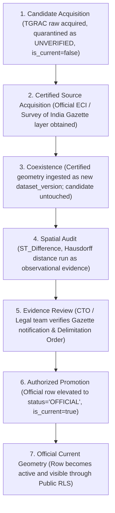

# W016-C3: Geometry Ingestion Preflight — Provenance, Temporal Attachment & Candidate-Status Quarantine (CTO Revision)

**Authority:** Independent CTO / Co-founder Directive W016-C3 Correction Round  
**Status:** SUBMITTED FOR CTO REVIEW  
**Scope:** Architecture & Technical Preflight Design Only (Zero DDL Execution / Zero DB Mutations / Production Untouched)  
**Baseline Commit:** `0d5fac67cf16193cfb72db955be4f553360ede17`  
**Date:** September 2026  

---

## 1. Executive Summary & Authoritative Coordinates

In accordance with the **W016-C3 CTO Correction Round Directive**, this document provides the revised, hardened architectural, relational, temporal, and security design for preserving acquired candidate vector geometries without misrepresenting them as official or current legal geography.

### Authoritative State Matrix

| Component | Status | Governance Authority |
|---|---|---|
| **W015 (Geography Relationship Engine)** | `ACCEPTED_COMPLETE` | Commit `4d99dd3` |
| **W015-B1 (Preflight Inspection)** | `ACCEPTED_COMPLETE` | Commit `4d99dd3` |
| **W015-B2 (Source Reconciliation)** | `ACCEPTED_COMPLETE` | Commit `4d99dd3` |
| **W016-A1 (Preflight Correction)** | `ACCEPTED` | Commit `1f8bde8` |
| **W016-B1 (Source Preflight)** | `ACCEPTED` | Commit `e240fc3` |
| **W016-B2 (Technical Spatial Rehearsal)** | `ACCEPTED_COMPLETE` | Commit `4beb9a7` |
| **W016-C1 (Candidate Acquisition)** | `ACCEPTED_COMPLETE` | Commit `46d4bcb` |
| **W016-C2 (Reconciliation Package)** | `ACCEPTED` | Commit `3d30640` |
| **W016-C3 (Ingestion Preflight Revision)** | `SUBMITTED_FOR_CTO_REVIEW` | This Document |
| **Migration 044 Execution** | `STRICTLY_NOT_AUTHORIZED` | Design Only |
| **Database Mutations / Ingestion** | `STRICTLY_NOT_AUTHORIZED` | Frozen |
| **Production Environment** | `STRICTLY_UNTOUCHED` | Air-Gapped |

---

## 2. Relational Integrity Architecture — Removal of Polymorphic Foreign Keys

### 2.1 Rejection of Unenforceable Polymorphic Keys
The initial draft utilized a generic polymorphic representation:
```sql
-- REJECTED AS UNENFORCEABLE BY POSTGRESQL ENGINE:
entity_type VARCHAR(50),
entity_id TEXT,
version_id UUID
```
In PostgreSQL, a polymorphic column tuple cannot be bound to target tables with declarative `FOREIGN KEY ... REFERENCES` constraints. Consequently, the database engine cannot verify whether `version_id` points to a genuine `constituency_versions`, `district_versions`, or `state_versions` record. This creates an unverified relational gap where orphan geometries or cross-entity mismatches can silently occur.

### 2.2 Evaluation of Relational Alternatives

#### Alternative 1: Typed Nullable Foreign Keys with an Exact-One CHECK Constraint (RECOMMENDED)
Introduce explicit, strongly-typed foreign key columns into `public.entity_geometries`, guarded by a strict cardinality constraint:
```sql
constituency_version_id UUID REFERENCES public.constituency_versions(id) ON DELETE RESTRICT,
district_version_id     UUID REFERENCES public.district_versions(id) ON DELETE RESTRICT,
state_version_id        UUID REFERENCES public.state_versions(id) ON DELETE RESTRICT,
pc_version_id           UUID REFERENCES public.parliamentary_constituency_versions(id) ON DELETE RESTRICT,
mandal_id               TEXT REFERENCES public.mandals(id) ON DELETE RESTRICT,

CONSTRAINT chk_entity_geometries_exact_one_target 
  CHECK (num_nonnulls(constituency_version_id, district_version_id, state_version_id, pc_version_id, mandal_id) = 1)
```
- **Strengths:** 
  1. Retains a unified PostGIS spatial table for cross-hierarchy spatial indexing, bounding-box searches, and geographic analysis.
  2. Every relationship is an authentic PostgreSQL foreign key enforced with `ON DELETE RESTRICT`.
  3. Centralized RLS policies and spatial integrity triggers avoid code duplication.
- **Verdict:** Selected as the primary architectural design.

#### Alternative 2: Separate Typed Geometry Relations
Create dedicated tables per geographic entity tier: `public.constituency_geometries`, `public.district_geometries`, `public.mandal_geometries`, each having a single `NOT NULL` foreign key.
- **Strengths:** Eliminates sparse nullable columns; guarantees 100% column-level `NOT NULL` constraints.
- **Weaknesses:** Requires duplicating RLS policies, spatial triggers, and catalog schemas across 4+ tables; complicates cross-boundary spatial queries (e.g., finding all mandals intersecting an assembly constituency).
- **Verdict:** Documented as a fully viable alternative if the CTO prefers physical relation isolation over a unified table.

### 2.3 The Verified Relational Chain
Under Alternative 1, every geometry record establishes an unbroken, database-enforced relational chain back to its canonical anchor and statutory provenance:

```text
GEOMETRY RECORD (public.entity_geometries)
  │
  ├──► [FK: constituency_version_id] ──► public.constituency_versions(id)
  │                                           │
  │                                           └──► [FK: constituency_internal_id] ──► public.constituencies(internal_id) [STABLE IDENTITY]
  │
  ├──► [FK: district_version_id]     ──► public.district_versions(id)
  │                                           │
  │                                           └──► [FK: district_id] ───────────────► public.districts(id) [STABLE IDENTITY]
  │
  ├──► [FK: mandal_id]               ──► public.mandals(id) [STABLE STATUTORY LGD IDENTITY]
  │
  ├──► [FK: dataset_version_id]      ──► public.dataset_versions(id) [W012 GOVERNED DATASET]
  │                                           │
  │                                           └──► [FK: dataset_id] ────────────────► public.datasets(id)
  │                                                                                        │
  │                                                                                        └──► [FK: source_id] ──► public.data_sources(id)
  │
  └──► [FK: provenance_id]           ──► public.provenance_records(id) [W012 PROVENANCE DAG]
                                              │
                                              └──► [FK: verification_evidence_id] ──► public.evidence_records(id) [CRYPTOGRAPHIC AUDIT]
```

---

## 3. Database-Level Quarantine & Row Level Security (RLS)

Public access cannot rely solely on views to quarantine candidate data. If an anonymous or authenticated client queries the base table `public.entity_geometries` directly, the database must enforce quarantine at the row level.

### 3.1 RLS Semantic Behavior

```sql
-- Enable RLS on the base geometry table
ALTER TABLE public.entity_geometries ENABLE ROW LEVEL SECURITY;

-- 1. Public Read Policy (anon, authenticated)
-- RESTRICTION: Public users may ONLY select current, official legal geometries.
-- UNVERIFIED candidates, SCENARIOS, and HISTORICAL geometries are completely INVISIBLE.
DROP POLICY IF EXISTS "Public read official current geometries only" ON public.entity_geometries;
CREATE POLICY "Public read official current geometries only"
  ON public.entity_geometries
  FOR SELECT
  TO anon, authenticated
  USING (
    status = 'OFFICIAL' 
    AND is_current = true
    AND temporal_classification = 'CURRENT_LEGAL'
  );

-- 2. Administrative Role Policy (service_role)
-- Controlled access for ingestion, governance audits, and internal research.
DROP POLICY IF EXISTS "Service role full access on entity_geometries" ON public.entity_geometries;
CREATE POLICY "Service role full access on entity_geometries"
  ON public.entity_geometries
  FOR ALL
  TO service_role
  USING (true)
  WITH CHECK (true);
```

### 3.2 Compatibility with Kshetra W010 Security Model
- Conforms directly to the established W010 security architecture (`anon` / `authenticated` / `service_role`).
- Introduces zero custom PostgreSQL roles.
- Eliminates candidate leakage: any query from the mobile app or public API requesting unverified candidate rows yields `0` rows by default.

---

## 4. Database-Level Guards on OFFICIAL Promotion

A geometry record must NEVER be promoted to `status = 'OFFICIAL'` simply by an administrative update or application script. The database engine itself must enforce the prerequisite governance chain.

### 4.1 Invariant Enforcement Breakdown

| Requirement | Enforcing Mechanism | Failure Behavior |
|---|---|---|
| **Authoritative Dataset Version** | `FOREIGN KEY (dataset_version_id) REFERENCES public.dataset_versions(id)` | Foreign key violation `23503` |
| **Cryptographic Evidence Record** | Trigger `fn_guard_geometry_official_promotion` asserts `dataset_versions.verification_evidence_id IS NOT NULL` | Exception `23514`: `OFFICIAL promotion rejected: Dataset version lacks verified evidence record` |
| **Statutory Publisher Authority** | Trigger asserts `data_sources.authority_level IN ('constitutional', 'statutory')` | Exception `23514`: `OFFICIAL promotion rejected: Source publisher is not statutory or constitutional` |
| **Approved Provenance Node** | Trigger asserts `provenance_records.verification_evidence_id IS NOT NULL` and `provenance_records.status IN ('OFFICIAL', 'VERIFIED')` | Exception `23514`: `OFFICIAL promotion rejected: Provenance node is unverified` |
| **Constitutional Delimitation Regime** | Trigger asserts referenced `constituency_versions` belongs to `CURRENT_LEGAL_REGIME` (never `SCENARIO_PROPOSED_REGIME`) | Exception `23514`: `OFFICIAL promotion rejected: Target regime is not current legal` |
| **Geometric Validity** | Trigger asserts `ST_IsValid(geometry) = true` | Exception `23514`: `OFFICIAL promotion rejected: Geometry is topologically invalid` |
| **Consistent Authority Class** | Check constraint `chk_geometry_status_classification_consistency` | Check constraint violation `23514` |
| **Write Authorization** | Row Level Security (RLS) restricts `INSERT`/`UPDATE` to `service_role` | Insufficient privilege error |

### 4.2 Trigger Implementation (Design Only)
```sql
-- DESIGN ONLY — NOT AUTHORIZED FOR IMPLEMENTATION
CREATE OR REPLACE FUNCTION public.fn_guard_geometry_official_promotion()
RETURNS TRIGGER AS $$
DECLARE
  v_source_authority public.source_authority_enum;
  v_dataset_evidence UUID;
  v_provenance_evidence UUID;
  v_provenance_status public.data_status_enum;
  v_regime_status VARCHAR(50);
BEGIN
  IF NEW.status = 'OFFICIAL' THEN
    -- 1. Assert Topological Validity
    IF NOT ST_IsValid(NEW.geometry) THEN
      RAISE EXCEPTION 'OFFICIAL promotion rejected: Geometry is topologically invalid (ST_IsValid = false)';
    END IF;

    -- 2. Inspect Dataset Version & Source Authority
    SELECT ds.authority_level, dv.verification_evidence_id
    INTO v_source_authority, v_dataset_evidence
    FROM public.dataset_versions dv
    JOIN public.datasets d ON dv.dataset_id = d.id
    JOIN public.data_sources ds ON d.source_id = ds.id
    WHERE dv.id = NEW.dataset_version_id;

    IF v_dataset_evidence IS NULL THEN
      RAISE EXCEPTION 'OFFICIAL promotion rejected: Dataset version % has no verification_evidence_id', NEW.dataset_version_id;
    END IF;

    IF v_source_authority NOT IN ('constitutional', 'statutory') THEN
      RAISE EXCEPTION 'OFFICIAL promotion rejected: Data source authority % is not constitutional or statutory', v_source_authority;
    END IF;

    -- 3. Inspect Provenance Record Lineage
    SELECT pr.verification_evidence_id, pr.status
    INTO v_provenance_evidence, v_provenance_status
    FROM public.provenance_records pr
    WHERE pr.id = NEW.provenance_id;

    IF v_provenance_evidence IS NULL OR v_provenance_status NOT IN ('OFFICIAL', 'VERIFIED') THEN
      RAISE EXCEPTION 'OFFICIAL promotion rejected: Provenance node % is not verified/official', NEW.provenance_id;
    END IF;

    -- 4. Prevent Scenario Contamination on Assembly Constituencies
    IF NEW.constituency_version_id IS NOT NULL THEN
      SELECT dr.legal_status
      INTO v_regime_status
      FROM public.constituency_versions cv
      JOIN public.delimitation_regimes dr ON cv.delimitation_regime_id = dr.id
      WHERE cv.id = NEW.constituency_version_id;

      IF v_regime_status != 'CURRENT_LEGAL_REGIME' THEN
        RAISE EXCEPTION 'OFFICIAL promotion rejected: Target delimitation regime % is not CURRENT_LEGAL_REGIME', v_regime_status;
      END IF;
    END IF;
  END IF;

  RETURN NEW;
END;
$$ LANGUAGE plpgsql SECURITY DEFINER;
```

---

## 5. Current Semantics & Invariant Definitions

To ensure state variables do not contradict each other, their relationships are mathematically and declaratively fixed.

### 5.1 Storage & Derivation of `is_current`
- `is_current` is stored as an explicit `BOOLEAN NOT NULL DEFAULT false` column to enable partial index optimization and sub-millisecond query planning.
- However, `is_current` is **strictly constrained** by database-level check constraints so that it cannot be set to `true` independently of governing legal attributes.

```sql
CONSTRAINT chk_geometry_current_invariants CHECK (
  (is_current = false) OR (
    is_current = true AND
    status = 'OFFICIAL' AND
    temporal_classification = 'CURRENT_LEGAL' AND
    authority_classification IN ('OFFICIAL_CONSTITUTIONAL_GEOMETRY', 'OFFICIAL_STATUTORY_GEOMETRY') AND
    (valid_to IS NULL OR valid_to > CURRENT_DATE)
  )
)
```

### 5.2 Semantic State Classification Matrix

| Semantic State | `status` | `authority_classification` | `temporal_classification` | `is_current` | `valid_to` | Public RLS Visibility |
|---|---|---|---|---|---|---|
| **`CURRENT_LEGAL`** | `OFFICIAL` | `OFFICIAL_CONSTITUTIONAL_GEOMETRY` or `OFFICIAL_STATUTORY_GEOMETRY` | `CURRENT_LEGAL` | `true` | `NULL` or `> CURRENT_DATE` | **VISIBLE** |
| **`HISTORICAL_LEGAL` (Official)** | `OFFICIAL` | `OFFICIAL_STATUTORY_GEOMETRY` | `HISTORICAL_LEGAL` | `false` | `<= CURRENT_DATE` | **HIDDEN** |
| **`HISTORICAL_LEGAL` (Candidate Snapshot)** | `UNVERIFIED` | `UNVERIFIED_STATE_GIS_CANDIDATE` | `HISTORICAL_LEGAL` | `false` | `<= CURRENT_DATE` (e.g. `2022-09-01`) | **HIDDEN** |
| **`UNVERIFIED_CANDIDATE`** | `UNVERIFIED` | `UNVERIFIED_STATE_GIS_CANDIDATE` or `UNVERIFIED_FIXTURE_GEOMETRY` | `UNVERIFIED_CANDIDATE` | `false` | `NULL` or bounded | **HIDDEN** |
| **`SCENARIO`** | `SCENARIO` | `SCENARIO_PROJECTION_GEOMETRY` | `SCENARIO` | `false` | `NULL` or bounded | **HIDDEN** |

### 5.3 Partial Unique Indexes
Because only official current geometries can have `is_current = true`, uniqueness is enforced at the entity level:
```sql
CREATE UNIQUE INDEX uq_constituency_geometries_single_current 
  ON public.entity_geometries (constituency_version_id) 
  WHERE is_current = true;

CREATE UNIQUE INDEX uq_district_geometries_single_current 
  ON public.entity_geometries (district_version_id) 
  WHERE is_current = true;
```

---

## 6. Authoritative Replacement Lifecycle

> [!IMPORTANT]
> **Spatial comparison is evidence only. Spatial similarity/difference MUST NOT automatically confer authority.**

A high geometric correlation between an acquired polygon and a known boundary provides circumstantial technical data, but legal authority stems strictly from constitutional/statutory lineage.

### The 7-Stage Authoritative Lifecycle


Under no circumstances does spatial closeness trigger automated promotion.

---

## 7. Performance Status & Benchmark Plan

> [!NOTE]
> **PERFORMANCE STATUS = UNKNOWN UNTIL IMPLEMENTED AND BENCHMARKED.**  
> In accordance with CTO Directive item 6, all preliminary speculative estimates (e.g. storage megabytes, execution millisecond counts) are hereby removed from authoritative governance artifacts.

### Future Benchmark Plan (Post-Authorization)
When Migration 044 is authorized and executed on staging, formal benchmarks will be conducted using `EXPLAIN (ANALYZE, BUFFERS)` across the following 7 test categories:

1. **Point-in-Polygon Containment:** `ST_Contains(geometry, ST_SetSRID(ST_Point(lng, lat), 4326))` for arbitrary points in Hyderabad, Warangal, and rural borders.
2. **Bounding-Box Viewport Filter:** Bounding-box intersection (`&&`) across typical mobile map viewports at zoom levels 8, 10, 12, and 14.
3. **Current Official Geometry Query:** Fetching active assembly boundaries via partial index `WHERE is_current = true`.
4. **Candidate Geometry Lookup:** Retrieving candidate boundaries filtered by `dataset_version_id = 'tgrac_ac_2023_candidate_v1'`.
5. **Historical Geometry Query:** Point-in-time temporal query (`valid_from <= target_date AND (valid_to IS NULL OR valid_to > target_date)`).
6. **W014 Version Join:** Join efficiency between `entity_geometries` and `constituency_versions` / `district_versions`.
7. **Representative Map Viewport Query:** Complex spatial query joining administrative boundaries with electoral polling station clusters.

---

## 8. Safe Migration Rollback Architecture

### 8.1 Protection of W012 Governance History
The initial rollback proposed deleting rows from `dataset_versions`, `datasets`, and `data_sources`. This is unsafe because once governance entries are created, they may be referenced by `provenance_records`, `evidence_records`, or audit logs.

### 8.2 Safe Rollback Specification
Rollback of Migration 044 is strictly confined to dropping W016 spatial objects:
```sql
-- SAFE ROLLBACK SCRIPT (DESIGN ONLY)
BEGIN;

-- 1. Drop Views
DROP VIEW IF EXISTS public.v_current_assembly_geometries CASCADE;
DROP VIEW IF EXISTS public.v_candidate_assembly_geometries CASCADE;
DROP VIEW IF EXISTS public.v_current_mandal_geometries CASCADE;
DROP VIEW IF EXISTS public.v_historical_2016_mandal_geometries CASCADE;

-- 2. Drop Triggers and Functions
DROP TRIGGER IF EXISTS trg_guard_geometry_official_promotion ON public.entity_geometries;
DROP FUNCTION IF EXISTS public.fn_guard_geometry_official_promotion();

-- 3. Drop Geometry Relation and Associated Indexes
DROP TABLE IF EXISTS public.entity_geometries CASCADE;

-- 4. Dependency-Checked Catalog Retirement (Non-Destructive)
-- Do NOT execute destructive DELETE on W012 governance tables.
-- If dataset_versions have external references, mark inactive rather than purging:
UPDATE public.dataset_versions 
SET metadata = metadata || '{"quarantine_status": "ROLLED_BACK"}'::jsonb 
WHERE id IN ('tgrac_ac_2023_candidate_v1', 'tgrac_districts_2023_candidate_v1', 'tgrac_mandals_2016_candidate_v1');

COMMIT;
```

**Irreversible State Acknowledgment:** Once geometry records or provenance linkages have been referenced in verified audit logs or external domain entities, an in-place destructive rollback of W012 governance entities is impossible, and governance history must be preserved.

---

## 9. Mandal Historical Safety (UNK-16-01 Quarantine)

1. **Historical Snapshot Window:** The 589 TGRAC mandals represent exclusively the `[2016-10-11, 2022-09-01)` post-reorganisation snapshot.
2. **Database Constraint:**
   ```sql
   CONSTRAINT chk_mandal_historical_only CHECK (
     entity_type != 'mandal' OR (
       authority_classification = 'UNVERIFIED_STATE_GIS_CANDIDATE' AND
       temporal_classification = 'HISTORICAL_LEGAL' AND
       is_current = false AND
       valid_to = '2022-09-01'
     )
   )
   ```
3. **Current Legal Block:** It is physically impossible under this schema for a 589-mandal record to be marked `is_current = true`.
4. **Missing 23 Mandals:** Remain `UNKNOWN / BLOCKED` (`UNK-16-01`). Their inferred spatial aggregation is strictly documented as technical notes and NEVER encoded into statutory relationship tables (`mandal_constituency_map`).

---

## 10. Preservation of W015 Relational Primacy

- The following remain the sole statutory ground truth for administrative and electoral containment:
  1. `public.mandal_constituency_map`
  2. `public.polling_booths`
  3. W015 verified relationship records
- **Observational Taxonomy:** Spatial geometry evaluations are categorized into four explicit observational states:
  - `CONFIRM`: Polygon intersection aligns with statutory containment.
  - `CONTRADICT`: Polygon intersection deviates from statutory containment; **statutory containment prevails unconditionally**.
  - `INCONCLUSIVE`: Border slivers or digitisation imprecision; statutory containment prevails.
  - `UNAVAILABLE`: Geometry is absent; statutory relationships operate without degradation.
- Under no circumstances does spatial calculation rewrite, update, or delete W015 relational mappings.

---

## 11. W012 Status Compatibility & Permitted Combinations

The design adheres strictly to the existing `data_status_enum`. The three classification axes interact according to the following permitted tuples:

```sql
CONSTRAINT chk_geometry_status_classification_consistency CHECK (
  -- Tuple 1: Official Current Constitutional Geometry (e.g. Certified ECI AC boundaries)
  (status = 'OFFICIAL' AND authority_classification = 'OFFICIAL_CONSTITUTIONAL_GEOMETRY' AND temporal_classification = 'CURRENT_LEGAL' AND is_current = true) OR
  -- Tuple 2: Official Current Statutory Geometry (e.g. Certified CCLA District boundaries)
  (status = 'OFFICIAL' AND authority_classification = 'OFFICIAL_STATUTORY_GEOMETRY' AND temporal_classification = 'CURRENT_LEGAL' AND is_current = true) OR
  -- Tuple 3: Official Historical Statutory Geometry (e.g. 10-district 2014 gazette boundaries)
  (status = 'OFFICIAL' AND authority_classification = 'OFFICIAL_STATUTORY_GEOMETRY' AND temporal_classification = 'HISTORICAL_LEGAL' AND is_current = false) OR
  -- Tuple 4: Unverified State GIS Candidate (Current Delimitation Regime) (e.g. TGRAC 119 ACs)
  (status = 'UNVERIFIED' AND authority_classification = 'UNVERIFIED_STATE_GIS_CANDIDATE' AND temporal_classification = 'UNVERIFIED_CANDIDATE' AND is_current = false) OR
  -- Tuple 5: Unverified State GIS Candidate (Historical Snapshot) (e.g. TGRAC 589 Mandals)
  (status = 'UNVERIFIED' AND authority_classification = 'UNVERIFIED_STATE_GIS_CANDIDATE' AND temporal_classification = 'HISTORICAL_LEGAL' AND is_current = false) OR
  -- Tuple 6: Unverified Fixture Geometry (e.g. datta07 mock polygons)
  (status = 'UNVERIFIED' AND authority_classification = 'UNVERIFIED_FIXTURE_GEOMETRY' AND temporal_classification = 'UNVERIFIED_CANDIDATE' AND is_current = false) OR
  -- Tuple 7: Scenario Projection Geometry (e.g. Delimitation Simulation Lab models)
  (status = 'SCENARIO' AND authority_classification = 'SCENARIO_PROJECTION_GEOMETRY' AND temporal_classification = 'SCENARIO' AND is_current = false)
)
```

---

## 12. Migration 044 Complete DDL Specification (DESIGN ONLY)

> [!CAUTION]
> **DESIGN ONLY — NOT AUTHORIZED FOR IMPLEMENTATION.**  
> The following DDL incorporates all CTO corrections. It must NOT be executed or placed in `supabase/migrations/` until authorized by the CTO.

```sql
-- ==============================================================================
-- Migration 044: Entity Geometries & Provenance Quarantine (DESIGN ONLY)
-- Status: DESIGN ONLY — NOT AUTHORIZED FOR IMPLEMENTATION
-- Target: Staging Supabase
-- ==============================================================================

BEGIN;

-- ─── 1. CREATE ENTITY GEOMETRIES RELATION ───────────────────────────────────────

CREATE TABLE IF NOT EXISTS public.entity_geometries (
  id UUID PRIMARY KEY DEFAULT gen_random_uuid(),
  entity_type VARCHAR(50) NOT NULL CHECK (entity_type IN ('state', 'district', 'parliamentary_constituency', 'assembly_constituency', 'mandal')),
  
  -- Explicit typed foreign keys resolving to W014 version tables and statutory anchors
  constituency_version_id UUID REFERENCES public.constituency_versions(id) ON DELETE RESTRICT,
  district_version_id     UUID REFERENCES public.district_versions(id) ON DELETE RESTRICT,
  state_version_id        UUID REFERENCES public.state_versions(id) ON DELETE RESTRICT,
  pc_version_id           UUID REFERENCES public.parliamentary_constituency_versions(id) ON DELETE RESTRICT,
  mandal_id               TEXT REFERENCES public.mandals(id) ON DELETE RESTRICT,

  -- W012 Governance & Provenance linkages
  dataset_version_id TEXT NOT NULL REFERENCES public.dataset_versions(id) ON DELETE RESTRICT,
  provenance_id      UUID NOT NULL REFERENCES public.provenance_records(id) ON DELETE RESTRICT,

  -- Spatial payload
  geometry      geometry(MultiPolygon, 4326) NOT NULL,
  geometry_type VARCHAR(50) NOT NULL CHECK (geometry_type IN ('Polygon', 'MultiPolygon')),

  -- Status & Authority classifications
  status data_status_enum NOT NULL DEFAULT 'UNVERIFIED',
  authority_classification VARCHAR(50) NOT NULL CHECK (authority_classification IN (
    'UNVERIFIED_STATE_GIS_CANDIDATE',
    'UNVERIFIED_FIXTURE_GEOMETRY',
    'OFFICIAL_CONSTITUTIONAL_GEOMETRY',
    'OFFICIAL_STATUTORY_GEOMETRY',
    'SCENARIO_PROJECTION_GEOMETRY'
  )),
  temporal_classification VARCHAR(50) NOT NULL CHECK (temporal_classification IN (
    'CURRENT_LEGAL',
    'HISTORICAL_LEGAL',
    'UNVERIFIED_CANDIDATE',
    'SCENARIO'
  )),

  source_feature_id   TEXT,
  raw_artifact_sha256 TEXT NOT NULL,
  valid_from          DATE NOT NULL,
  valid_to            DATE,
  is_current          BOOLEAN NOT NULL DEFAULT false,
  metadata            JSONB NOT NULL DEFAULT '{}'::jsonb,
  created_at          TIMESTAMPTZ NOT NULL DEFAULT now(),

  -- Cardinality and alignment constraints
  CONSTRAINT chk_entity_geometries_exact_one_target 
    CHECK (num_nonnulls(constituency_version_id, district_version_id, state_version_id, pc_version_id, mandal_id) = 1),
    
  CONSTRAINT chk_entity_geometries_type_alignment CHECK (
    (entity_type = 'assembly_constituency' AND constituency_version_id IS NOT NULL) OR
    (entity_type = 'district' AND district_version_id IS NOT NULL) OR
    (entity_type = 'state' AND state_version_id IS NOT NULL) OR
    (entity_type = 'parliamentary_constituency' AND pc_version_id IS NOT NULL) OR
    (entity_type = 'mandal' AND mandal_id IS NOT NULL)
  ),

  -- Current legal invariants
  CONSTRAINT chk_geometry_current_invariants CHECK (
    (is_current = false) OR (
      is_current = true AND
      status = 'OFFICIAL' AND
      temporal_classification = 'CURRENT_LEGAL' AND
      authority_classification IN ('OFFICIAL_CONSTITUTIONAL_GEOMETRY', 'OFFICIAL_STATUTORY_GEOMETRY') AND
      (valid_to IS NULL OR valid_to > CURRENT_DATE)
    )
  ),

  -- Status consistency
  CONSTRAINT chk_geometry_status_classification_consistency CHECK (
    (status = 'OFFICIAL' AND authority_classification IN ('OFFICIAL_CONSTITUTIONAL_GEOMETRY', 'OFFICIAL_STATUTORY_GEOMETRY') AND temporal_classification IN ('CURRENT_LEGAL', 'HISTORICAL_LEGAL')) OR
    (status = 'UNVERIFIED' AND authority_classification IN ('UNVERIFIED_STATE_GIS_CANDIDATE', 'UNVERIFIED_FIXTURE_GEOMETRY')) OR
    (status = 'SCENARIO' AND authority_classification = 'SCENARIO_PROJECTION_GEOMETRY' AND temporal_classification = 'SCENARIO')
  ),

  -- Mandal historical safety
  CONSTRAINT chk_mandal_historical_only CHECK (
    entity_type != 'mandal' OR (
      authority_classification = 'UNVERIFIED_STATE_GIS_CANDIDATE' AND
      temporal_classification = 'HISTORICAL_LEGAL' AND
      is_current = false AND
      valid_to = '2022-09-01'
    )
  )
);

-- ─── 2. INDEXING ───────────────────────────────────────────────────────────────

CREATE INDEX IF NOT EXISTS idx_entity_geometries_geom ON public.entity_geometries USING gist (geometry);
CREATE INDEX IF NOT EXISTS idx_entity_geometries_constituency ON public.entity_geometries (constituency_version_id) WHERE constituency_version_id IS NOT NULL;
CREATE INDEX IF NOT EXISTS idx_entity_geometries_district ON public.entity_geometries (district_version_id) WHERE district_version_id IS NOT NULL;
CREATE INDEX IF NOT EXISTS idx_entity_geometries_mandal ON public.entity_geometries (mandal_id) WHERE mandal_id IS NOT NULL;
CREATE INDEX IF NOT EXISTS idx_entity_geometries_dataset ON public.entity_geometries (dataset_version_id);
CREATE INDEX IF NOT EXISTS idx_entity_geometries_provenance ON public.entity_geometries (provenance_id);

CREATE UNIQUE INDEX IF NOT EXISTS uq_constituency_geometries_single_current 
  ON public.entity_geometries (constituency_version_id) 
  WHERE is_current = true;

CREATE UNIQUE INDEX IF NOT EXISTS uq_district_geometries_single_current 
  ON public.entity_geometries (district_version_id) 
  WHERE is_current = true;

-- ─── 3. ROW LEVEL SECURITY (RLS) ───────────────────────────────────────────────

ALTER TABLE public.entity_geometries ENABLE ROW LEVEL SECURITY;

DROP POLICY IF EXISTS "Public read official current geometries only" ON public.entity_geometries;
CREATE POLICY "Public read official current geometries only"
  ON public.entity_geometries FOR SELECT
  TO anon, authenticated
  USING (status = 'OFFICIAL' AND is_current = true AND temporal_classification = 'CURRENT_LEGAL');

DROP POLICY IF EXISTS "Service role full access on entity_geometries" ON public.entity_geometries;
CREATE POLICY "Service role full access on entity_geometries"
  ON public.entity_geometries FOR ALL
  TO service_role
  USING (true)
  WITH CHECK (true);

COMMIT;
```

---

## 13. Revised Acceptance Matrix (Assertions A Through M)

| Assertion | Requirement | Design Mechanism | Future Runtime / Database Verification Test |
|---|---|---|---|
| **A** | Exact W014 FK Resolution | Explicit FK columns `constituency_version_id`, `district_version_id`, etc. with `ON DELETE RESTRICT` | `INSERT` geometry referencing non-existent version UUID fails with Foreign Key Violation (`23503`). |
| **B** | No Orphan Geometry Rows | `CHECK (num_nonnulls(...) = 1)` and `chk_entity_geometries_type_alignment` | `INSERT` geometry with all NULL foreign keys fails with Check Constraint Violation (`23514`). |
| **C** | No Candidate Public Exposure | RLS `SELECT` policy restricted to `status = 'OFFICIAL' AND is_current = true` | `SET ROLE anon; SELECT count(*) FROM entity_geometries WHERE status = 'UNVERIFIED';` returns strictly `0`. |
| **D** | No Scenario Public Exposure | RLS `SELECT` policy excludes `status = 'SCENARIO'` | `SET ROLE anon; SELECT count(*) FROM entity_geometries WHERE status = 'SCENARIO';` returns strictly `0`. |
| **E** | No Invalid OFFICIAL Promotion | Trigger `fn_guard_geometry_official_promotion` asserts verified evidence and statutory source | `UPDATE entity_geometries SET status = 'OFFICIAL' WHERE id = <cand_id>` raises Exception (`23514`). |
| **F** | Current/Legal Uniqueness | Partial unique indexes on version IDs `WHERE is_current = true` | Setting `is_current = true` on two geometries for the same version fails with Unique Violation (`23505`). |
| **G** | Historical Temporal Compatibility | Check constraint `chk_geometry_current_invariants` enforces `is_current = false` for historical dates | Setting `is_current = true` on historical geometry fails with Check Constraint Violation (`23514`). |
| **H** | 589 Mandals Cannot Attach to Current | Check constraint `chk_mandal_historical_only` enforces `temporal_classification = 'HISTORICAL_LEGAL'` | `INSERT` mandal geometry with `is_current = true` fails with Check Constraint Violation (`23514`). |
| **I** | Candidate + Official Coexistence | Multiple rows permitted per entity with distinct `dataset_version_id` when `is_current = false` | Coexistence of TGRAC candidate row and official ECI row for same AC verifies without constraint violation. |
| **J** | W012 Provenance Resolution | `NOT NULL` FKs to `dataset_versions(id)` and `provenance_records(id)` with SHA-256 hash | Relational join from geometry record to source publisher and raw artifact checksum resolves 100%. |
| **K** | W015 Relational Primacy | Geometry schema completely decoupled from `mandal_constituency_map`; zero spatial triggers | Executing geometry ingestion leaves `mandal_constituency_map` and booth rows 100% unaltered. |
| **L** | No Destructive W012 Rollback | Rollback script drops spatial tables only; W012 records preserved with dependency validation | Rollback script execution leaves `data_sources`, `datasets`, and `provenance_records` intact. |
| **M** | Performance Remains UNKNOWN | All speculative numbers removed; 7-category PostGIS benchmark suite planned | Benchmarking conducted post-implementation via `EXPLAIN (ANALYZE, BUFFERS)` on staging PostGIS. |

---

## 14. Revised Decision Matrix

In accordance with Section 22 of the CTO Directive:

| Hierarchy Layer | Ingestion Gate Classification | Definition & Architectural Meaning |
|---|---|---|
| **AC Geometry** | **READY FOR BOUNDED INGESTION (DESIGN ONLY)** | Technically and relational-design ready for bounded candidate ingestion under Migration 044. Does NOT imply official or constitutional status. |
| **District Geometry** | **READY FOR BOUNDED INGESTION (DESIGN ONLY)** | Technically and relational-design ready for bounded candidate ingestion under Migration 044. Does NOT imply official status. |
| **Mandal Geometry** | **READY FOR HISTORICAL INGESTION (DESIGN ONLY)** | Technically and relational-design ready for historical snapshot ingestion [2016–2022] under Migration 044. Strictly BLOCKED for current legal geography queries. |

---

## 15. Governance Summary & Final Checklist

- [x] Polymorphic foreign key completely removed; typed nullable FKs with exact-one CHECK constraint designed.
- [x] Database-level quarantine enforced via Row Level Security on base table `public.entity_geometries`.
- [x] Database-level guards on `OFFICIAL` promotion specified (trigger, check constraints, foreign keys).
- [x] Current/historical/candidate/scenario state invariants formally defined in state matrix.
- [x] Authoritative replacement lifecycle explicitly models spatial comparison as evidence only.
- [x] All speculative performance estimates removed; formal 7-category benchmark plan defined.
- [x] Migration 044 rollback redesigned safely to prevent destruction of W012 governance history.
- [x] Mandal historical safety strictly enforced by database check constraints.
- [x] W015 relational primacy reinforced with 4-state observational taxonomy.
- [x] Acceptance matrix updated with explicit design-time assertions A through M.
- [x] Updated design artifacts: `docs/w016_c3_geometry_ingestion_preflight.md` & `.json`.
- [x] Zero application code changes, zero database mutations, zero migrations created.
- [x] Migration 044 remains strictly unauthorized.
