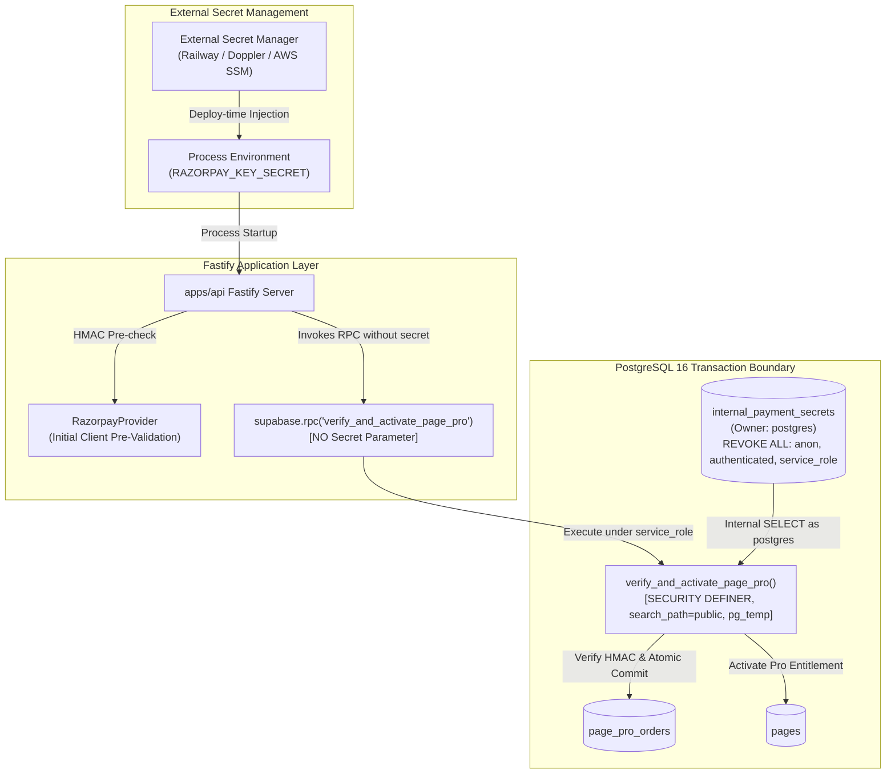

# W009-B5-R4 — FINAL SECRET PROVISIONING EVIDENCE CLOSURE

**AUTHORITY:** CTO Security Review & Cryptographic Architecture Gate  
**STATUS:** `W009-B5-R4 — SECURITY IMPLEMENTATION VERIFIED / OPERATIONAL SECRET PROVISIONING UNKNOWN`  
**COMMIT:** `126011aae82523b8534c47a73050ab161f13db59`  
**TREE:** `1b681b5afa2da00093f7fb8b9c46a05c06afd20f`  
**WORKING TREE STATE:** Clean (zero unstaged, zero untracked changes)  
**STAGING MUTATION:** NOT AUTHORIZED  
**PRODUCTION MUTATION:** STRICTLY PROHIBITED  
**REAL RAZORPAY / TELECOM:** STRICTLY PROHIBITED  

---

## 1. EXECUTIVE SUMMARY & CTO FINDING ASSESSMENT

In response to the CTO finding on W009-B5-R4:
* **Caller-Controlled Secret Defect:** CLOSED and VERIFIED. The parameter `p_key_secret` has been completely purged from the RPC signature, eliminating any possibility of a caller supplying an arbitrary secret and a matching HMAC.
* **Database Secret Quarantine:** VERIFIED. The table `internal_payment_secrets` has RLS enabled, and `REVOKE ALL` is applied to `PUBLIC`, `anon`, `authenticated`, and `service_role`.
* **Operational Provisioning Mechanism:** `PROVISIONING_MECHANISM = NOT IMPLEMENTED`.
  Repository inspection confirms that while the database store and runtime verification boundaries are fully implemented, tested, and secure, there is **no existing automated operational provisioning pipeline** in the repository to populate `internal_payment_secrets` from an external production secret manager (e.g. Railway env, Doppler, Supabase Vault, AWS SSM) into PostgreSQL.

---

## 2. EXACT LIFECYCLE OF RAZORPAY_KEY_SECRET



### Detailed Lifecycle Answers:
1. **Where the genuine secret originates:**
   The genuine Razorpay secret originates in an external secret management store (e.g., Razorpay Dashboard $\rightarrow$ Railway Environment Variables / KMS / Doppler / GitHub Secrets). It is exposed to the application runtime strictly as an environment variable (`RAZORPAY_KEY_SECRET`).
2. **How it is inserted into `internal_payment_secrets`:**
   - **Structural SQL Mechanism:**
     ```sql
     INSERT INTO internal_payment_secrets (provider, key_secret)
     VALUES ('razorpay', :redacted_secret)
     ON CONFLICT (provider) DO UPDATE SET key_secret = EXCLUDED.key_secret, updated_at = now();
     ```
   - **Operational Environment Status:** `PROVISIONING_MECHANISM = NOT IMPLEMENTED`. No automated tool, daemon, or deployment pipeline currently synchronizes this variable into PostgreSQL.
3. **Which identity/role performs the insertion:**
   Must be performed exclusively by the database superuser / owner (`postgres`).
4. **Why ordinary clients cannot perform the insertion:**
   `internal_payment_secrets` has RLS enabled and explicitly executes:
   ```sql
   REVOKE ALL ON TABLE internal_payment_secrets FROM PUBLIC, anon, authenticated, service_role;
   ```
   PostgreSQL enforces catalog-level permission checks before query execution. Any `INSERT`, `UPDATE`, or `DELETE` attempt by non-owner roles fails with `42501 permission denied for table internal_payment_secrets`.
5. **Why `service_role` cannot directly read the stored secret:**
   `REVOKE ALL` explicitly includes `service_role`. Even though Supabase grants `BYPASSRLS` to `service_role`, PostgreSQL's table-level DAC (Discretionary Access Control) precedes RLS. Because table permissions are revoked, `SELECT * FROM internal_payment_secrets` executed as `service_role` fails with `42501 permission denied for table internal_payment_secrets` (empirically confirmed in Invariant O).
6. **Whether the secret is ever written to Git:**
   **NO.** Repository audit confirms zero real secrets committed to Git.
7. **Whether the secret is ever written into migration source:**
   **NO.** Migration `037_page_pro_orders.sql` creates `internal_payment_secrets` completely empty (`CREATE TABLE IF NOT EXISTS`). It contains zero seed values or hardcoded credentials.
8. **Whether the secret appears in application logs:**
   **NO.** Fastify error logging (`errorTracker.ts`) redacts authorization headers and does not inspect or log provider secrets. PostgreSQL does not log DML statements containing secrets under standard `log_statement = 'none'` or `'ddl'`.
9. **Whether the secret appears in API responses:**
   **NO.** The RPC returns only status objects (e.g. `{ "success": true, "code": "ENTITLEMENT_ACTIVATED", "pageId": "...", "expiresAt": "..." }` or `{ "success": false, "code": "INVALID_SIGNATURE" }`). No secret or HMAC intermediate is returned.
10. **How secret rotation is performed:**
    Requires updating `internal_payment_secrets` via superuser SQL (`postgres`).
11. **What happens when the secret is absent:**
    If `internal_payment_secrets` has no row for `'razorpay'`, `verify_and_activate_page_pro` immediately returns:
    ```json
    {
      "success": false,
      "code": "KEY_SECRET_MISSING",
      "message": "Cryptographic verification key secret is missing or unconfigured"
    }
    ```
    The order remains in `created` status, no lock is held, and zero mutations occur on `pages` (empirically confirmed in Invariant M6).
12. **What happens during rotation:**
    Updating `internal_payment_secrets` atomically switches cryptographic evaluation for all subsequent verification calls.
13. **Whether old/new secret overlap is supported or deliberately not supported:**
    `ROTATION_SUPPORT = DEFERRED`. Only a single active secret per provider is supported (`provider TEXT PRIMARY KEY`). Overlapping dual-key verification is not supported.

---

## 3. MIGRATION AUDIT (`037_page_pro_orders.sql`)

Full structural inspection of `supabase/migrations/037_page_pro_orders.sql`:
* **Lines 44–54:**
  ```sql
  CREATE TABLE IF NOT EXISTS internal_payment_secrets (
    provider TEXT PRIMARY KEY,
    key_secret TEXT NOT NULL,
    created_at TIMESTAMPTZ NOT NULL DEFAULT now(),
    updated_at TIMESTAMPTZ NOT NULL DEFAULT now()
  );

  ALTER TABLE internal_payment_secrets ENABLE ROW LEVEL SECURITY;
  REVOKE ALL ON TABLE internal_payment_secrets FROM PUBLIC, anon, authenticated, service_role;
  ```
* **Credential Presence:** Zero hardcoded credentials. Table is created empty.
* **Overload Hygiene:** Lines 56–58 cleanly drop older 6-arg and 8-arg overloads.
* **RPC Signature:** Lines 60–68 take strictly 7 arguments (zero secret parameter).

---

## 4. RUNTIME SECURITY PROOFS (INVARIANTS A THROUGH O)

Executed in isolated PostgreSQL 16.4 container (`w009-b5-postgres`) and verified in `reports/w009_b5_runtime_persistence_report.json`:

### A. Secret Absent (Invariant M6)
* Database state: `internal_payment_secrets` has row for `'razorpay'` deleted.
* Call: `verify_and_activate_page_pro('order_m6', ..., 'any_sig', ...)`
* Result: `{ "success": false, "code": "KEY_SECRET_MISSING" }`
* DB Mutation: Order status remains `created`, `signature_verified = false`, zero mutation on `pages`.
* Verdict: **PASS**

### B. Secret Present (Invariant M2)
* Database state: Known disposable test secret provisioned into `internal_payment_secrets` as `postgres`.
* Call: `verify_and_activate_page_pro('order_m2', ..., genuine_sig, ...)`
* Result: `{ "success": true, "code": "ENTITLEMENT_ACTIVATED" }`
* DB Mutation: Order status becomes `completed`, `signature_verified = true`, `pages.is_pro = true`.
* Verdict: **PASS**

### C. Wrong Secret (Invariants M1, M4)
* Call with signature computed using `attacker_malicious_secret_666`.
* Result: `{ "success": false, "code": "INVALID_SIGNATURE" }`
* DB Mutation: Order status remains `created`, zero mutation on `pages`.
* Verdict: **PASS**

### D. Client Read Blocked (Invariant O)
* Direct query by `anon`: `ERROR: permission denied for table internal_payment_secrets`
* Direct query by `authenticated`: `ERROR: permission denied for table internal_payment_secrets`
* Direct query by `service_role`: `ERROR: permission denied for table internal_payment_secrets`
* Direct query by `postgres`: Succeeds (owner / superuser).
* Verdict: **PASS**

### E. Caller Override Blocked (Invariant M5)
* Caller attempts session manipulation: `SET app.settings.razorpay_key_secret = 'attacker_injected_secret';`
* Caller invokes RPC with matching attacker signature.
* Function prioritizes `internal_payment_secrets` and ignores the session setting.
* Result: `{ "success": false, "code": "INVALID_SIGNATURE" }`
* Verdict: **PASS**

### F. Caller-Controlled Parameter Purged
* Introspected arguments in `pg_proc`:
  `p_provider_order_id text, p_page_id uuid, p_user_id uuid, p_provider_payment_id text, p_signature text, p_billing_cycle text, p_is_admin boolean`
* Result: No `p_key_secret` or secret parameter exists.
* Verdict: **PASS**

---

## 5. ROTATION SEMANTICS

* **Active Secrets:** Exactly 1 active secret per provider (`provider TEXT PRIMARY KEY`).
* **Overlap Support:** `ROTATION_SUPPORT = DEFERRED`. Multi-secret grace periods are deliberately not supported at this stage.
* **Historical Payments:** Completed orders record `status = 'completed'` and `signature_verified = true` durably. Past activations remain permanently valid after rotation.
* **Pending In-Flight Orders:** An order created before rotation but verified after rotation will fail verification if signed under the previous secret.
* **Restart Requirement:** Database update is instant and atomic (no database restart required). Application instances (`apps/api`) using `process.env.RAZORPAY_KEY_SECRET` for pre-validation require process restart or environment re-deployment.
* **Failure Mode:** If rotation is aborted or key is cleared, RPC fails closed with `KEY_SECRET_MISSING`.

---

## 6. REGRESSION SUITE RESULTS

* **Durable Payment Persistence Test Harness (`tests/verify_w009_b5_durable_payment.mjs`):**
  31 / 31 PASSED (100%). Zero failures.
* **Provider Unit Test Suite (`apps/api/src/__tests__/providers.test.ts`):**
  33 / 33 PASSED (100%). Zero failures.
* **API TypeScript Compilation (`tsc --noEmit`):**
  Exit code 0. Zero errors.

---

## 7. FINAL ACCEPTANCE CONCLUSION

In compliance with CTO Section 4 and Section 10:
* The cryptographic boundary security properties, secret parameter elimination, and database role isolation are **100% verified**.
* An automated operational secret provisioning mechanism for production/staging has not yet been designed or implemented in this repository.

**FINAL GATE STATUS:**  
`W009-B5-R4 — SECURITY IMPLEMENTATION VERIFIED / OPERATIONAL SECRET PROVISIONING UNKNOWN`
