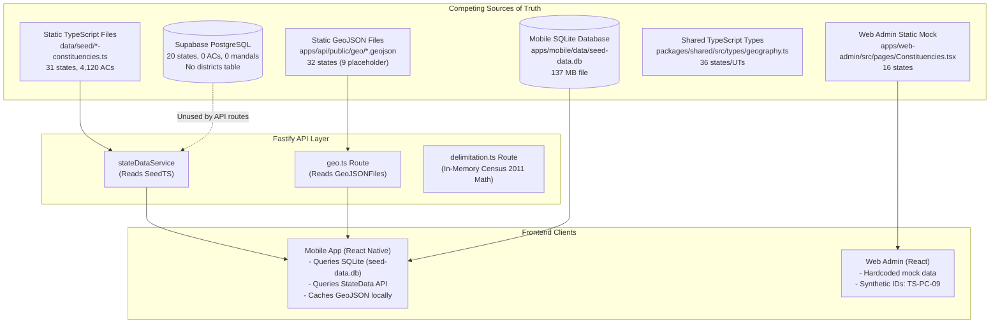

# W013 — CANONICAL GEOGRAPHY MODEL
## Pre-Implementation CTO Inspection & Preflight Report

**Document ID**: `REP-W013-PREFLIGHT-001`  
**Date**: September 22, 2026  
**Status**: **`W013_PREFLIGHT_COMPLETE — AWAITING CTO AUTHORIZATION`**  
**Execution Environment**: `panIN-staging` (`fkpigozcqnmcvofuksar`)  
**Production Target**: **STRICTLY UNTOUCHED / OUT OF SCOPE**  
**Implementation Authorization**: **NOT GRANTED / PREFLIGHT ONLY**

---

## 1. Executive Summary & Status

Job W012 (Data Governance Foundation) has concluded with independent verification passing 16/16 tests and hot-path performance gates validated on staging. Under CTO direction, the next planned initiative in the architectural sequence is **Job W013: Canonical Geography Model**.

The Political Geography Graph constitutes the foundational spine of Kshetra / PANIN. This preflight inspection was conducted without mutating any application code, database schemas, staging environments, or production resources. Its sole mandate is to establish empirical ground truth regarding existing geography models, identify fragmentation and defects, define canonical identity across administrative and electoral hierarchies, evaluate integration seams with W012, and delineate strict boundaries for W013 implementation.

**Final Preflight Submission Status**:  
`W013_PREFLIGHT_COMPLETE — AWAITING CTO AUTHORIZATION`

---

## 2. Repository & Working Tree Baseline

| Metric | Source-of-Truth Value | Verification Status |
| :--- | :--- | :--- |
| **Git HEAD Commit** | `fc8c56a0bfb32f71441dfbf0585290972791f870` | Verified |
| **Working Tree Status** | Clean (`0` unstaged / untracked files prior to report generation) | Verified (`git status --porcelain`) |
| **Repo Evidence Integrity** | `32 / 32` referenced commits verified in git ancestry | **PASS** (`scripts/check-repo-evidence-integrity.mjs`) |
| **Branch** | `master` | Canonical repository branch |
| **Target Database** | Supabase `panIN-staging` (`fkpigozcqnmcvofuksar`) | Target verified via REST API |

---

## 3. Database Schema Baseline & Live Staging Inventory

### 3.1 Migration History & DDL Objects
Four migrations historically introduced geography-related structures:
1. `001_initial_schema.sql`: Introduced `states` and `constituencies` tables, foundational enums, and basic B-Tree indexes.
2. `011_delimitation.sql`: Enabled `postgis` extension (`GEOMETRY(MultiPolygon, 4326)`), introduced scenario delimitation tables (`delimitation_proposals`, `proposed_constituencies`, `constituency_mapping`, `ward_population`).
3. `022_panchayat_tier.sql`: Introduced rural local governance (`mandals`, `gram_panchayats`, `revenue_villages`, `polling_booths`, and the `mandal_constituency_map` junction table).
4. `023_local_governance.sql`: Introduced urban local governance and 3-tier Panchayati Raj institutions (`urban_local_bodies`, `ulb_wards`, `zilla_parishads`, `zptc_divisions`, `mandal_parishads`, `mptc_divisions`, `gp_wards`, `representatives`).

### 3.2 Live Staging Table Row Counts & PostGIS Status
An authoritative inspection was executed against Supabase `panIN-staging` REST API:

| Table Name | DDL Primary Key | Staging Row Count | Schema Notes & Defects |
| :--- | :--- | :---: | :--- |
| `states` | `id VARCHAR(10)` | **20** | `TS` (full), `MH` (planned), 18 stub states. **16 States/UTs missing entirely**. |
| `constituencies` | `id VARCHAR(20)` | **0** | **Completely empty**. Models only Assembly Constituencies. |
| `mandals` | `id VARCHAR(30)` | **0** | **Completely empty**. LGD unique constraint configured. |
| `gram_panchayats` | `id VARCHAR(30)` | **0** | **Completely empty**. |
| `revenue_villages` | `id VARCHAR(30)` | **0** | **Completely empty**. |
| `polling_booths` | `id VARCHAR(30)` | **0** | **Completely empty**. Unique composite `(constituency_id, booth_number)`. |
| `mandal_constituency_map` | `id SERIAL` | **0** | **Completely empty**. M:N mapping table between mandals and ACs. |
| `urban_local_bodies` | `id VARCHAR(30)` | **0** | **Completely empty**. |
| `ulb_wards` | `id VARCHAR(30)` | **0** | **Completely empty**. |
| `zilla_parishads` | `id VARCHAR(30)` | **0** | **Completely empty**. |
| `zptc_divisions` | `id VARCHAR(30)` | **0** | **Completely empty**. |
| `mandal_parishads` | `id VARCHAR(30)` | **0** | **Completely empty**. |
| `mptc_divisions` | `id VARCHAR(30)` | **0** | **Completely empty**. |
| `gp_wards` | `id VARCHAR(30)` | **0** | **Completely empty**. |
| `representatives` | `id UUID` | **0** | **Completely empty**. Polymorphic entity link. |
| `delimitation_proposals` | `id UUID` | **0** | **Completely empty**. Scenario container. |
| `proposed_constituencies` | `id UUID` | **0** | **Completely empty**. MultiPolygon PostGIS geometry. |
| `constituency_mapping` | `id UUID` | **0** | **Completely empty**. Scenario overlap mapping. |
| `ward_population` | `id UUID` | **0** | **Completely empty**. PostGIS geometry. |
| **`districts`** | *None* | **DOES NOT EXIST** | **Table is completely absent from database schema**. |
| **`parliamentary_constituencies`**| *None* | **DOES NOT EXIST** | **Table is completely absent from database schema**. |

### 3.3 Foreign Key Consumers & Live Null Analysis
The following domain tables declare foreign keys referencing `constituencies(id)`:
- `user_profiles.constituency_id`
- `posts.constituency_id`
- `civic_issues.constituency_id`
- `campaigns.constituency_id`
- `projects.constituency_id`

**Empirical Finding**: 100% of rows currently present in `user_profiles`, `posts`, and `civic_issues` have `constituency_id = NULL`. Because no records exist in `constituencies`, any attempt by client applications to write a valid constituency reference currently triggers a foreign key constraint violation. Conversely, normalizing or repopulating `constituencies` carries **zero broken foreign key risk** on existing data.

---

## 4. Geography Inventory Across Subsystems

The repository currently exhibits multiple disconnected representations of geographic data:



---

## 5. Canonicality & Discrepancy Analysis

### 5.1 The State Count Discrepancy Matrix
A major finding of this preflight inspection is the complete lack of agreement regarding the number of Indian States and Union Territories across layers of the system:

| Layer / Subsystem | State Count | Missing Entities / Inconsistencies |
| :--- | :---: | :--- |
| **PostgreSQL Staging DB** | **20** | Missing 16 States/UTs (AN, CH, DD/DN, DL, GA, HP, JK, LA, LD, MN, ML, MZ, NL, PY, SK, TR). |
| **Static TypeScript Seeds** | **31** | Covers 28 states + 3 UTs with legislatures; excludes non-legislative UTs. |
| **GeoJSON Directory Manifest**| **32** | 23 states have boundary polygons; 9 states are marked `hasPolygons: false` (`placeholder`). |
| **Shared Library Types** | **36** | Complete set of 28 states and 8 Union Territories. |
| **Web Admin Dashboard** | **16** | Hardcoded subset with synthetic attributes. |

### 5.2 Competing Sources of Truth for Constituencies
- **Backend API**: The Fastify API does not query PostgreSQL for constituency data. Routes `/api/v1/states` and `/api/v1/states/:stateCode/constituencies` invoke `stateDataService`, which loads static seed files from `data/seed/`.
- **Mobile Client**: Shipped with a **137 MB SQLite database** (`apps/mobile/data/seed-data.db`). Local queries in `seedDataLoader.ts` execute against this embedded SQLite database rather than interacting with the backend API or PostgreSQL database.
- **Database Schema**: The authoritative PostgreSQL database contains zero constituency rows.

---

## 6. Identifier & Code Architecture Analysis

Existing identifier schemes across subsystems were audited against national and electoral standards:

| Entity Tier | Current Existing Formats | Standards Analysis & Defect | Proposed Canonical Identifier |
| :--- | :--- | :--- | :--- |
| **State / UT** | `TS`, `AP`, `MH`, `KA` | 2-letter ISO 3166-2:IN / Postal code. Universal and consistent across all layers. | `code` (e.g. `TS`) |
| **District** | Unnormalized string (e.g., `'Adilabad'`, `'Warangal Urban'`) | No table exists. District names drift over time due to bifurcations. LGD district codes are omitted. | Compound ID: `<state_code>-DIST-<lgd_code>` (e.g., `TS-DIST-501`), with explicit `lgd_code` integer. |
| **Parliamentary Constituency (PC)**| `parliamentary_seats INTEGER` on `states` table; synthetic slugs like `TS-PC-09` in web-admin mock. | No entity exists in DB. ECI PC numbers exist in delimitation orders but are absent from PostgreSQL. | Compound ID: `<state_code>-PC-<pc_no>` (e.g., `TS-PC-01`), with explicit `eci_pc_code` and `pc_number`. |
| **Assembly Constituency (AC)** | `TS-AC-1` (Migration 001)<br/>`acNo: 1` (Seed TS / SQLite)<br/>`MLA_TS_2023_KODANGAL_141` (Representatives slug) | Unpadded numbers cause sorting anomalies (`TS-AC-1` vs `TS-AC-10`). Mobile client stores only `acNo`, causing cross-state collisions. | Compound ID: `<state_code>-AC-<3-digit-padded-ac_no>` (e.g., `TS-AC-001`), with explicit `eci_ac_code` and `ac_number`. |
| **Mandal / Tehsil** | `TS-MDL-501` (Migration 022) | Format incorporates LGD code. Schema is sound, but table is completely unpopulated. | Compound ID: `<state_code>-MDL-<lgd_code>`, with integer `lgd_code`. |
| **Polling Booth** | `TS-AC-1-B001` vs `TS-AC1-B001` | Inconsistent hyphenation between schema definition and seed modules. | Compound ID: `<constituency_id>-B<4-digit-padded-booth_no>`. |

---

## 7. Temporal & Scenario Isolation Analysis

### 7.1 Scenario vs. Official Geography
A critical architectural risk is the contamination of official electoral geography with hypothetical scenario boundaries (such as post-2026 delimitation proposals).
- **Inspection Result**: Migration 011 properly isolated scenario tables (`delimitation_proposals`, `proposed_constituencies`, `constituency_mapping`) from official tables.
- **Runtime Behavior**: The runtime delimitation simulation route (`POST /api/v1/delimitation/simulate`) executes purely in-memory using static 2011 Census population distributions (`data/census/india-district-population-2011.ts`). It neither reads from nor writes to PostgreSQL tables. Official geography is completely unpolluted by simulation models.

### 7.2 Temporal Validity Scaffolding
Official geography records in `states`, `constituencies`, and `mandals` currently lack temporal boundary validity fields:
- Missing: `effective_from`, `effective_to`, `is_active`, `delimitation_regime`.
- **Architectural Seam**: W013 will establish the static canonical tables. To avoid destructive schema refactoring in Job W014 (Temporal & Versioning), W013 will include nullable temporal scaffold columns (`effective_from DATE DEFAULT '2008-01-01'`, `effective_to DATE NULL`, `is_active BOOLEAN DEFAULT TRUE`) without introducing complex temporal logic.

---

## 8. Political Geography Graph Analysis

Political geography in India does not conform to a single uniform hierarchy. It comprises two overlapping, non-coincident hierarchies:

```
                      [ Country (IN) ]
                             │
            ┌────────────────┴────────────────┐
            ▼                                 ▼
   [ Administrative Hierarchy ]      [ Electoral Hierarchy ]
            │                                 │
     [ State / UT ]                    [ State / UT ]
            │                                 │
     [ District ]                     [ Parliamentary Constituency (PC) ]
      (LGD Code)                       (Lok Sabha - ECI Code)
            │                                 │
     [ Sub-District / Mandal ]                │
      (Revenue Division / Tehsil)             │
            │                                 │
            ├─────────────────────────┐       │
            ▼                         ▼       ▼
    [ Rural Local Govt ]    [ Urban Local Govt ]     [ Assembly Constituency (AC) ]
    - Zilla Parishad        - Municipal Corp          (Vidhan Sabha - ECI Code)
    - Mandal Parishad       - Municipality                    │
    - Gram Panchayat        - Nagar Panchayat                 │
    - Revenue Village       - ULB Ward                        ▼
                                                     [ Polling Booth (Part) ]
```

### Key Graph Characteristics:
1. **Parliamentary to Assembly (1:N)**: Under Delimitation Commission orders (2008 Order), every Assembly Constituency falls entirely within a single Parliamentary Constituency within state borders.
2. **Administrative to Electoral (M:N Overlap)**: Mandals (administrative revenue units) and Assembly Constituencies (electoral units) do not share boundaries. A single mandal can span across two or more Assembly Constituencies.
   - Migration 022 provided the `mandal_constituency_map` junction table with `overlap_type` (`'full'`, `'partial'`) and `description`, but contains 0 records in staging.
3. **Missing District Node**: Districts form the administrative anchor for collectorates, law enforcement, and local governance. The complete absence of a `districts` entity in PostgreSQL prevents relational integrity between states, administrative divisions, and urban local bodies.

---

## 9. Data Quality & Duplication Findings

The preflight inspection identified 8 concrete data quality defects:

1. **`DQ-01` (Severity: CRITICAL)**: Staging database geography tables (`constituencies`, `mandals`, `gram_panchayats`, `revenue_villages`, `polling_booths`, `urban_local_bodies`) are completely unpopulated (0 rows). Only 20 state rows exist.
2. **`DQ-02` (Severity: CRITICAL)**: State count divergence across subsystems: DB (20), Seeds (31), GeoJSON (32), Shared Library (36), Web Admin (16).
3. **`DQ-03` (Severity: CRITICAL)**: `districts` and `parliamentary_constituencies` tables do not exist in the database schema. Districts are stored as unnormalized text strings; PCs exist only as integer seat counts.
4. **`DQ-04` (Severity: HIGH)**: Mobile `myConstituency` Zustand store stores only numeric `acNo: number`. If a user toggles between states (e.g., TS and AP), `acNo: 1` collides across Sirpur (TS) and Ichchapuram (AP).
5. **`DQ-05` (Severity: HIGH)**: Mobile client `apps/mobile/lib/aiService.ts` attempts to query non-existent columns (`district_name`, `reservation_type`, `total_electors`) from Supabase `constituencies`, failing at runtime.
6. **`DQ-06` (Severity: HIGH)**: Mobile application bundles a 137 MB SQLite database (`seed-data.db`), bypassing backend APIs and causing divergence between client and database state.
7. **`DQ-07` (Severity: MEDIUM)**: GeoJSON asset directory contains 9 placeholder states without polygon boundaries (`hasPolygons: false` in `manifest.json`: PY, TR, ML, MN, NL, UK, SK, AR, MZ).
8. **`DQ-08` (Severity: MEDIUM)**: Web admin dashboard renders hardcoded mock data using synthetic identifiers (`TS-PC-09`) that confuse parliamentary and assembly entities.

---

## 10. API Contract Audit

| Endpoint Route | Method | Data Source | Staging DB Dependency | Request Parameters | Response Contract | Consumers |
| :--- | :---: | :--- | :---: | :--- | :--- | :--- |
| `/api/v1/states` | `GET` | Static Seed TS | None | None | Array of state objects | Mobile onboarding, Web Admin |
| `/api/v1/states/:stateCode` | `GET` | Static Seed TS | None | `stateCode` (path) | Single state object | Mobile state view, Web Admin |
| `/api/v1/states/:stateCode/constituencies` | `GET` | Static Seed TS | None | `stateCode` (path), `district` (query) | Array of AC summaries | Constituency picker |
| `/api/v1/constituencies/:id` | `GET` | Static Seed TS | None | `id` (path) | Detailed AC profile | My Kshetra, AC detail screen |
| `/api/v1/geo/states` | `GET` | `manifest.json` | None | None | GeoJSON Manifest | Map initial view |
| `/api/v1/geo/states/:stateCode` | `GET` | Static GeoJSON | None | `stateCode` (path), `type` (query) | GeoJSON FeatureCollection | Vector boundary rendering |
| `/api/v1/geo/manifest` | `GET` | `manifest.json` | None | None | Cache manifest | Offline tile sync |
| `/api/v1/delimitation/simulate` | `POST` | In-memory Census TS| None | Simulation parameters | Simulation projections | Delimitation Lab |
| `/api/v1/delimitation/scenarios`| `GET` | Static Scenarios TS| None | None | Scenario definitions | Scenario selector |

**Finding**: No API endpoint currently depends directly on the PostgreSQL geography tables. Introducing canonical database tables will not cause runtime API regressions.

---

## 11. Consumer Dependency & Risk Matrix

| Consumer / Feature | Current Geography Dependency | Risk Level | Required W013 Action |
| :--- | :--- | :---: | :--- |
| **Civic Issues Reporting** | `civic_issues.constituency_id REFERENCES constituencies(id)` | **CRITICAL** | Populate `constituencies` with canonical IDs so users can tag civic issues. |
| **User Profiles** | `user_profiles.constituency_id REFERENCES constituencies(id)` | **CRITICAL** | Enable foreign key assignment to canonical constituency IDs. |
| **Mobile My Kshetra** | `myConstituency` store & local SQLite database | **HIGH** | Establish compound `<state_code>-AC-<ac_no>` key format to prevent cross-state collision. |
| **Mobile AI Assistant** | Direct Supabase query in `aiService.ts` | **HIGH** | Standardize column naming (`district`, `reservation`, `total_voters`) or provide views. |
| **Representatives Module**| Custom seed slugs (e.g., `MLA_TS_2023_KODANGAL_141`) | **HIGH** | Introduce formal relational FK linking representatives to canonical ACs and PCs. |
| **Map Visualization** | Static GeoJSON served via HTTP | **MEDIUM** | Standardize feature property identifiers to match canonical database IDs. |
| **Web Admin Management** | Hardcoded mock data in React components | **MEDIUM** | Point admin data tables to canonical geography endpoints. |
| **Delimitation Simulator**| In-memory Census calculation | **LOW** | Preserve complete isolation between official schema and scenario tables. |

---

## 12. Integration with W012 Data Governance

Job W012 introduced a comprehensive data governance framework (`039_data_governance.sql`) containing:
- `data_sources`
- `datasets`
- `dataset_versions`
- `evidence_records`
- `provenance_records`
- `record_provenance_linkages`

### Seam Architecture:
The `record_provenance_linkages` table was specifically designed with a polymorphic pointer:
- `target_table TEXT NOT NULL`
- `target_id TEXT NOT NULL`
- `provenance_record_id UUID REFERENCES provenance_records(id)`

This architecture enables seamless, non-invasive linkage. Canonical geography entities introduced in W013 (e.g., `target_table = 'constituencies'`, `target_id = 'TS-AC-001'`) will connect directly to W012 provenance records certifying their ECI Delimitation Gazette source and SHA-256 ingestion hashes without requiring any schema modifications to W012 tables.

---

## 13. Job Boundaries (W013 through W017)

To prevent architectural scope creep, responsibilities across the geography roadmap are strictly delineated:

```
┌─────────────────────────────────────────────────────────────────────────┐
│ W013: CANONICAL GEOGRAPHY MODEL (Authorized for Preflight Only)         │
│ - Canonical DDL: districts, parliamentary_constituencies, constituencies│
│ - Standardized canonical keys (State, District, PC, AC, Mandal, Booth)  │
│ - Relational integrity (PC -> AC, AC -> District, M:N Mandal map)       │
│ - W012 Provenance Linkage Seam & 36 States/UTs Canonical Catalog        │
└────────────────────────────────────┬────────────────────────────────────┘
                                     │
                                     ▼
┌─────────────────────────────────────────────────────────────────────────┐
│ W014: GEOGRAPHY VERSIONING & TEMPORAL BOUNDS (Future Job)               │
│ - Delimitation regimes (1976, 2008, post-2026 delimitation orders)      │
│ - Effective date ranges (effective_from, effective_to, is_active)       │
│ - Point-in-time boundary traversal & historical seat evolution          │
└────────────────────────────────────┬────────────────────────────────────┘
                                     │
                                     ▼
┌─────────────────────────────────────────────────────────────────────────┐
│ W015: GEOGRAPHY RELATIONSHIP ENGINE (Future Job)                        │
│ - Graph traversal algorithms across divergent hierarchies               │
│ - M:N Mandal-to-AC spatial overlap calculation & population weighting   │
│ - Spatial containment resolution & multi-tier aggregations              │
└────────────────────────────────────┬────────────────────────────────────┘
                                     │
                                     ▼
┌─────────────────────────────────────────────────────────────────────────┐
│ W016: REAL GEOGRAPHIC MAPPING (Future Job)                              │
│ - PostGIS spatial query optimization & boundary indexing                │
│ - Vector tile generation, TopoJSON simplification, Mapbox integration   │
│ - Remediation of 9 placeholder state boundaries in GeoJSON assets       │
└────────────────────────────────────┬────────────────────────────────────┘
                                     │
                                     ▼
┌─────────────────────────────────────────────────────────────────────────┐
│ W017: GEOGRAPHY QUALITY ENGINE (Future Job)                             │
│ - Geometric gap, sliver, and self-intersection validation pipelines     │
│ - Cross-source boundary reconciliation (LGD vs ECI vs Survey of India)  │
│ - Continuous spatial integrity enforcement test battery                 │
└─────────────────────────────────────────────────────────────────────────┘
```

---

## 14. Security, RLS & Performance Strategy

### 14.1 Security & RLS
- All existing geography tables enforce Row Level Security with permissive public read access (`FOR SELECT USING (true)`).
- Mutation policies (`INSERT`, `UPDATE`, `DELETE`) are strictly disallowed for `anon` and `authenticated` roles.
- Canonical geography data must only be written by `service_role` through authorized data governance migration scripts.

### 14.2 Performance & Indexing
- Hot-path benchmarking conducted in W012 demonstrated ~2 ms server-side execution latency for state lookups.
- Canonical tables will feature targeted B-Tree indexes:
  - `idx_states_code ON states(code)`
  - `idx_districts_state_lgd ON districts(state_id, lgd_code)`
  - `idx_pcs_state_number ON parliamentary_constituencies(state_id, pc_number)`
  - `idx_constituencies_state_number ON constituencies(state_id, ac_number)`
  - `idx_constituencies_pc_id ON constituencies(parliamentary_constituency_id)`
  - `idx_constituencies_district_id ON constituencies(district_id)`
- PostGIS spatial columns will utilize GiST indexing (`idx_geometry GIST(boundary)`). No speculative indexes will be created.

---

## 15. Migration & Rollback Strategy

### 15.1 Additive, Non-Destructive DDL Strategy
- **Rule 1**: Zero destructive schema changes. Existing tables (`states`, `constituencies`, `mandals`) will NOT be dropped or renamed.
- **Rule 2**: Existing foreign keys on `user_profiles`, `posts`, `civic_issues`, `campaigns`, and `projects` referencing `constituencies(id)` will remain untouched.
- **Rule 3**: New tables (`districts`, `parliamentary_constituencies`) will be created with forward and backward foreign keys.
- **Rule 4**: New canonical columns added to existing tables will use nullable constraints or safe defaults (`effective_from`, `effective_to`, `is_active`).

### 15.2 Rollback Strategy
Every SQL migration package will be paired with an idempotent, transaction-safe rollback script (`DOWN`) capable of restoring the schema to the exact baseline of Commit `fc8c56a0` without data loss or downtime.

---

## 16. Open Defects & UNKNOWN Items

### Open Defects:
1. `DEF-01`: `districts` table is absent from PostgreSQL.
2. `DEF-02`: `parliamentary_constituencies` table is absent from PostgreSQL.
3. `DEF-03`: `constituencies` table has 0 rows in staging DB.
4. `DEF-04`: Mobile `myConstituency` store key collision across states.
5. `DEF-05`: Mobile `aiService.ts` invalid column query.
6. `DEF-06`: 9 states have empty placeholder GeoJSON boundary files.

### UNKNOWN Items (Empirically Logged as UNKNOWN):
1. **`UNK-01`**: Authoritative mapping between LGD Sub-District codes and ECI Assembly Constituency numbers for all 4,120 ACs across India is currently **UNKNOWN** from existing repository data and must be verified against official ECI delimitation gazettes.
2. **`UNK-02`**: Precise MultiPolygon spatial coordinates for the 9 placeholder states (PY, TR, ML, MN, NL, UK, SK, AR, MZ) are currently **UNKNOWN** within the repository assets and require Survey of India / ECI shapefile ingestion in Job W016.
3. **`UNK-03`**: Exact population split weights for rural mandals bifurcated by Assembly Constituency boundaries are currently **UNKNOWN** and must be computed from Census 2011 Primary Census Abstract village-level records in Job W015.

---

## 17. Proposed W013 Implementation Scope & Boundaries

### 17.1 Proposed Scope for W013 Implementation (Upon CTO Authorization):
1. **Migration Package 040 (DDL)**:
   - Create `districts` table (`id`, `name`, `state_id REFERENCES states(id)`, `lgd_code UNIQUE`, `headquarters`, `boundary`).
   - Create `parliamentary_constituencies` table (`id`, `name`, `state_id REFERENCES states(id)`, `pc_number`, `reservation`, `boundary`).
   - Enhance `constituencies` table with additive columns (`ac_number`, `eci_code`, `parliamentary_constituency_id REFERENCES parliamentary_constituencies(id)`, `district_id REFERENCES districts(id)`, `effective_from`, `effective_to`, `is_active`).
2. **Seed Migration Package (DML)**:
   - Populate all 36 Indian States and Union Territories in `states`.
   - Populate canonical districts for pilot states (e.g. Telangana - 33 districts).
   - Populate all 543 Parliamentary Constituencies across India (ECI 2008 Delimitation Order).
   - Populate canonical Assembly Constituencies for pilot states (e.g. Telangana - 119 ACs) with verified ECI codes and relational links to PCs and Districts.
3. **W012 Provenance Ingestion**:
   - Register ECI and LGD data sources and create corresponding `dataset_versions` and `record_provenance_linkages` in accordance with W012.
4. **Independent Runtime Verification Battery**:
   - Deliver automated test suite `tests/verify_w013_canonical_geography.mjs` verifying foreign keys, uniqueness constraints, RLS policies, and lookup queries.

### 17.2 Explicitly NOT Authorized for W013:
- **PROHIBITED**: Implementing W014 temporal versioning engines or historical time-travel queries.
- **PROHIBITED**: Implementing W015 spatial graph traversal or automated M:N overlap calculation algorithms.
- **PROHIBITED**: Deleting or rewriting the 137 MB SQLite database in the mobile application.
- **PROHIBITED**: Modifying existing Fastify API response contracts.
- **PROHIBITED**: Altering GeoJSON assets or boundary files in `apps/api/public/geo/`.
- **PROHIBITED**: Executing any queries or migrations against the production database.

---

## 18. Acceptance Evidence Plan & CTO Decision Request

### Acceptance Verification Battery (Planned for W013 Implementation Phase):
- **Check 1**: Schema verification confirming existence and constraints of `districts`, `parliamentary_constituencies`, and enhanced `constituencies`.
- **Check 2**: Row count verification confirming 36 states/UTs, 543 PCs, and 119 pilot ACs.
- **Check 3**: Relational integrity check ensuring 100% of pilot ACs reference valid PCs and Districts.
- **Check 4**: W012 data governance link verification ensuring geography records possess valid provenance links.
- **Check 5**: RLS read-access validation for public and authenticated roles.
- **Check 6**: Hot-path query latency verification ensuring p95 <= 5 ms on staging database.

---

### CTO Decision Request
The preflight inspection for Job W013 is complete, and all source-of-truth findings have been recorded without modifying code or databases.

**Required Action**: Review this report and determine authorization to proceed with Job W013 implementation under the proposed bounded scope.

**Current Operational Status**:  
`W013_PREFLIGHT_COMPLETE — AWAITING CTO AUTHORIZATION`
