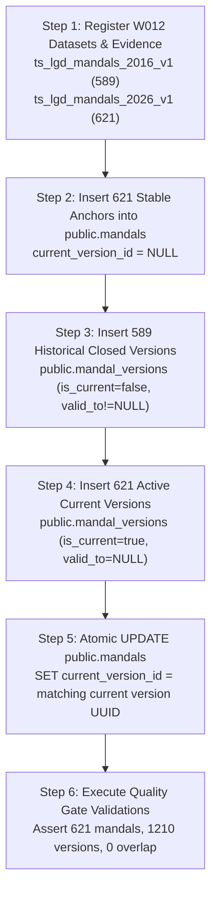

# PANIN / KSHETRA — ARCHITECTURAL REPORT

# W016-C3-R3E: STABLE MANDAL IDENTITY, CURRENT-VERSION & TEMPORAL LINEAGE LOAD DESIGN

**Document ID:** `REP-W016-C3-R3E-01`  
**Directive Reference:** W016-C3-R3E (CTO Directive — Execute Now)  
**Status:** `STABLE IDENTITY LOAD DESIGN PASS — READY FOR CTO LOAD AUTHORIZATION`  
**Execution Timestamp:** 2026-09-26T14:25:00+05:30  
**Repository Branch:** `master`  
**Parent Accepted Commits:**
- `b524fe1` (W016-C3-R3D Temporal Legal Identity vs Historical Geometry Snapshot Reconciliation)
- `ee30017` (W016-C3-R3C Historical Legal Evidence Closure)
- `0b39cc8` (W016-C3-R3B MoPR LGD Artifact Verification)
- `1405fb8` (W014-GOV-01 Migration 044 Staging Verification / Acceptance)

---

## EXECUTIVE SUMMARY

Under CTO Directive **W016-C3-R3E**, this report establishes the deterministic, un-conflated population model across all database layers:
1. `public.mandals` (Stable statutory identities);
2. `public.mandal_versions` (Historical closed versions and current active versions);
3. W012 `dataset_versions` (Historical baseline dataset vs current directory dataset);
4. future W016 `entity_geometries` (Externalized spatial features linked via `mandal_version_id`).

In accordance with the directive, **ZERO DATABASE MUTATIONS** have been performed. No SQL execution, no table creation, no migration authoring (Migration 045 was NOT created), and no data seeding occurred. Staging and production remain completely untouched.

The primary architectural achievement of W016-C3-R3E is the complete mathematical and legal reconciliation of the 4 population layers:
* **Historical Spatial Snapshot Population:** **589** (2016 TGRAC cadastral survey features);
* **Stable Statutory Mandal Identities:** **621** (Every statutory entity existing today or in historical lineage);
* **Historical Version Rows:** **589** (Closed Version 1 records covering the 2016–2022 historical baseline);
* **Current Version Rows:** **621** (Active Version records with `is_current = true` and `valid_to IS NULL`);
* **Total Mandal Version Rows:** **1,210** ($589 \text{ historical} + 621 \text{ current} = 1,210$);
* **Current LGD Population:** **621** (MoPR Local Government Directory sub-districts).

---

## 1. STABLE-ANCHOR IDENTITY RULE

### What Does One Row in `public.mandals` Represent?
In the Panin/Kshetra canonical geography schema (established under Migrations 022 and 041), one row in `public.mandals` represents a **Stable Statutory Identity** (`TS-MDL-<lgd_code>`).

It is:
* **NOT** a geometry feature or PostGIS polygon;
* **NOT** a single temporal snapshot;
* **NOT** a temporary administrative boundary.

### Invariant Definition
A stable statutory mandal identity is an enduring, legally constituted administrative anchor established under the *Telangana District Formation Act 1974 / 2016 Reorganisation* and tracked by the Ministry of Panchayati Raj (MoPR) Local Government Directory (LGD).
* The stable anchor persists across territorial carve-outs, bifurcations, headquarters shifts, and renamings as long as the mandal itself is not abolished by statutory gazette notification.
* In Telangana, **zero mandals have been abolished** since the October 11, 2016 statewide reorganisation. All 589 mandals formed on 2016-10-11 continue to exist today.
* In addition, between 2020 and 2023, the Government of Telangana created **32 new mandals** by bifurcating existing mandals. Each of these 32 newly created mandals constitutes a valid, distinct statutory entity with its own unique MoPR LGD code.
* Therefore, the complete stable statutory identity population in `public.mandals` is exactly **621**.

### Table Schema Alignment
```sql
-- public.mandals (Stable Anchor)
-- id: TEXT PRIMARY KEY (e.g. 'TS-MDL-6310')
-- name: TEXT NOT NULL (Current official English name)
-- local_name: TEXT (Telugu script name)
-- state_code: TEXT NOT NULL REFERENCES states(code) ('TS')
-- district: TEXT NOT NULL (District name)
-- lgd_code: INTEGER (MoPR LGD sub-district code)
-- current_version_id: UUID (FK to public.mandal_versions)
-- is_active: BOOLEAN NOT NULL DEFAULT true
-- centroid, boundary: GEOMETRY (LEGACY - REMAINS NULL)
```

---

## 2. 589 HISTORICAL SNAPSHOT POPULATION

The 589 features contained in `data/geo/candidate_authoritative/tgrac_mandals_raw.json` represent the **2016-10-11 Statutory Baseline Spatial Snapshot** surveyed by the Telangana State Remote Sensing Applications Centre (TGRAC/TRAC) immediately following the October 11, 2016 statewide reorganisation (G.O.Ms. Nos. 214–245, Revenue Dept).

### Semantics and Scope
* This snapshot captures the exact territorial boundaries of the 589 mandals as they existed between October 11, 2016 and September 24, 2020 (when the first post-reorganisation splits occurred).
* None of the 32 post-2016 created mandals exist in this 589 spatial snapshot.
* In `public.mandal_versions`, these 589 entities are represented as closed historical Version 1 records (`is_current = false`, `valid_to IS NOT NULL`).
* In the W016-C3 geometry architecture, the 589 TGRAC polygons attach strictly to these historical Version 1 IDs via `public.entity_geometries.mandal_version_id`. They MUST NOT be attached to current version rows.

---

## 3. COMPLETE STABLE IDENTITY POPULATION

The stable statutory identity population is derived deterministically from statutory legal lineage:

$$\text{Stable Identities} = \text{Baseline Mandals (2016)} + \text{Creations (2020)} + \text{Creations (2022)} + \text{Creations (Post-2022)} - \text{Abolitions}$$

$$\text{Stable Identities} = 589 + 5 + 18 + 9 - 0 = \mathbf{621}$$

Every one of the 621 statutory mandals has exactly one anchor row in `public.mandals`:
* **589 Baseline Mandals:** Continuous statutory anchors established on 2016-10-11.
* **5 2020 Created Mandals:** Established on 2020-09-24 under G.O.Ms. Nos. 108–112.
* **18 2022 Created Mandals:** Established on 2022-09-26 under G.O.Ms. Nos. 51–68.
* **9 Post-2022 Created Mandals:** Established in late 2022–2023 under statutory gazette notifications.

---

## 4. COMPLETE VERSION POPULATION

The complete version population in `public.mandal_versions` encompasses all legally required temporal states:

$$\text{Total Versions} = \text{Historical Closed Versions} + \text{Active Current Versions}$$

$$\text{Total Versions} = 589 + 621 = \mathbf{1,210}$$

### Breakdown:
1. **589 Historical Closed Versions (Version 1 of Baseline Mandals):**
   * Covers the 2016 baseline epoch.
   * `is_current = false`
   * `valid_to IS NOT NULL`
   * `primary_dataset_version_id = 'ts_lgd_mandals_2016_v1'`
   * Receives the 589 TGRAC geometries in `public.entity_geometries`.

2. **621 Active Current Versions (Version 2 of Baseline Mandals + Version 1 of Created Mandals):**
   * Covers the current legal administrative state.
   * `is_current = true`
   * `valid_to IS NULL`
   * `primary_dataset_version_id = 'ts_lgd_mandals_2026_v1'`
   * Pointed to by `public.mandals.current_version_id`.

---

## 5. CURRENT-VERSION POPULATION

Under W014, every stable mandal that is active in the state must possess exactly one current version satisfying the invariant:
$$\texttt{is\_current} = \text{true} \iff \texttt{valid\_to} \text{ IS NULL}$$

* **Count:** Exactly **621** rows in `public.mandal_versions`.
* **Dataset Reference:** All 621 current version rows reference `primary_dataset_version_id = 'ts_lgd_mandals_2026_v1'`, reflecting the official 2026 MoPR LGD directory snapshot.
* **Anchor Linkage:** In `public.mandals`, the `current_version_id` column is populated with the UUID of the corresponding current version row, satisfying the composite foreign key constraint:
  ```sql
  FOREIGN KEY (current_version_id, id) REFERENCES public.mandal_versions(id, mandal_id)
  ```
* **Zero Orphaned Anchors:** No active stable mandal is left with `current_version_id = NULL`.

---

## 6. EXACT COUNTS TABLE

| Layer | Required Count | Meaning / Schema Target | Source Evidence |
| :--- | :---: | :--- | :--- |
| **2016 TGRAC snapshot entities** | **589** | Historical spatial baseline geometry | `data/geo/candidate_authoritative/tgrac_mandals_raw.json` |
| **Stable statutory mandal identities** | **621** | `public.mandals` table rows | 2016 Reorganisation + 2020/2022/2023 Gazette Orders |
| **Historical version rows** | **589** | `public.mandal_versions` (`is_current = false`) | W012 `ts_lgd_mandals_2016_v1` Package |
| **Current version rows** | **621** | `public.mandal_versions` (`is_current = true`) | W012 `ts_lgd_mandals_2026_v1` Package |
| **Total mandal_version rows** | **1,210** | Complete `public.mandal_versions` population | Sum of Historical (589) + Current (621) |
| **Current LGD entities** | **621** | Authoritative directory records | `mopr_lgd_subdistrict_directory_telangana_all.json` |

---

## 7. 2020 SPLIT LINEAGE (5 SUCCESSORS, 8 PARENTS)

On September 24, 2020, the Government of Telangana issued G.O.Ms. Nos. 108–112 (Revenue Dept), creating **5 new mandals** by bifurcating territory from **8 existing parent mandals**:

| Successor Mandal | LGD Code | Effective Date | Statutory Order | Carved From Parent Mandals |
| :--- | :---: | :---: | :--- | :--- |
| **Chowdapur** | 7186 | 2020-09-24 | G.O.Ms.No. 108 Revenue | Kulkacharla (4539), Nawabpet (4514) |
| **Mohammadabad** | 7187 | 2020-09-24 | G.O.Ms.No. 109 Revenue | Gandeed (4538) |
| **Chowtakur** | 7188 | 2020-09-24 | G.O.Ms.No. 111 Revenue | Pulkal (4478) |
| **Dhoolmitta** | 7189 | 2020-09-24 | G.O.Ms.No. 112 Revenue | Maddur (4673), Cherial (4672) |
| **Masaipet** | 7190 | 2020-09-24 | G.O.Ms.No. 110 Revenue | Chegunta (4466), Yeldurthy (4481) |

### Versioning Model for the 8 Parents:
* **Version 1 (Historical Closed):** `valid_from = '2016-10-11'`, `valid_to = '2020-09-24'`, `is_current = false`, dataset: `ts_lgd_mandals_2016_v1`. (TGRAC 2016 geometry attaches here).
* **Version 2 (Continuing Active):** `valid_from = '2020-09-24'`, `valid_to = NULL`, `is_current = true`, dataset: `ts_lgd_mandals_2026_v1`. (Territory reduced by carve-out).

### Versioning Model for the 5 Successors:
* **Version 1 (Active Current):** `valid_from = '2020-09-24'`, `valid_to = NULL`, `is_current = true`, dataset: `ts_lgd_mandals_2026_v1`. (Zero records in 2016 historical dataset).

---

## 8. 2022 SPLIT LINEAGE (18 SUCCESSORS, 24 PARENTS)

On September 26, 2022, the Government of Telangana issued G.O.Ms. Nos. 51–68 (Revenue Dept), creating **18 new mandals** by bifurcating territory from **24 existing parent mandals**:

| Successor Mandal | LGD Code | Effective Date | Statutory Order | Parent Mandals (LGD & Name) |
| :--- | :---: | :---: | :--- | :--- |
| **Sonala** | 7516 | 2022-09-26 | G.O.Ms.No. 51 | 4323 (Bazarhathnoor), 4324 (Boath) |
| **Seerole** | 7518 | 2022-09-26 | G.O.Ms.No. 52 | 4721 (Kuravi), 4718 (Mahabubabad) |
| **Kukunoorpally** | 7521 | 2022-09-26 | G.O.Ms.No. 53 | 4462 (Kondapak), 4484 (Jagdevpur) |
| **Koukuntla** | 7522 | 2022-09-26 | G.O.Ms.No. 54 | 4573 (Devarkadra) |
| **Gundumal** | 7523 | 2022-09-26 | G.O.Ms.No. 55 | 4551 (Kosgi) |
| **Akberpet-Bhoompally** | 7524 | 2022-09-26 | G.O.Ms.No. 56 | 4458 (Dubbak), 4464 (Mirdoddi) |
| **Dongli** | 7525 | 2022-09-26 | G.O.Ms.No. 57 | 4372 (Madnur) |
| **Gattuppal** | 7526 | 2022-09-26 | G.O.Ms.No. 58 | 4647 (Munugode), 4655 (Chandur) |
| **Aloor** | 7528 | 2022-09-26 | G.O.Ms.No. 59 | 4360 (Armoor) |
| **Donkeshwar** | 7530 | 2022-09-26 | G.O.Ms.No. 60 | 4359 (Nandipet) |
| **Kothapallygori** | 7531 | 2022-09-26 | G.O.Ms.No. 61 | 4690 (Regonda) |
| **Saloora** | 7532 | 2022-09-26 | G.O.Ms.No. 62 | 4370 (Bodhan) |
| **Nizampet** | 7535 | 2022-09-26 | G.O.Ms.No. 63 | 4453 (Kalher) |
| **Kothapally** | 7537 | 2022-09-26 | G.O.Ms.No. 64 | 4570 (Narayanpet) |
| **Inugurthy** | 7538 | 2022-09-26 | G.O.Ms.No. 65 | 4717 (Kesamudram) |
| **Endapalli** | 7539 | 2022-09-26 | G.O.Ms.No. 66 | 4397 (Dharmapuri/Velgatur) |
| **Dudyal** | 7540 | 2022-09-26 | G.O.Ms.No. 67 | 4550 (Bommaraspeta), 4549 (Kodangal) |
| **Bheemaram** | 7541 | 2022-09-26 | G.O.Ms.No. 68 | 4415 (Medipalle) |

### Temporal Lineage:
* The 24 parent mandals remained 100% legally undivided throughout `[2016-10-11, 2022-09-26)`.
* Version 1 closed on `2022-09-26` (`valid_to = '2022-09-26'`).
* Version 2 effective `2022-09-26` (`valid_from = '2022-09-26'`, `valid_to = NULL`, `is_current = true`).
* The 18 successor mandals begin their legal existence on `2022-09-26` (`valid_from = '2022-09-26'`, `valid_to = NULL`, `is_current = true`). Zero rows exist in the 2016 baseline dataset.

---

## 9. NINE LATE-MANDAL TREATMENT

Between late 2022 and 2023, the Government of Telangana notified **9 additional mandals**:
1. **Sathnala** (7515) — carved from Jainad (4307)
2. **Yerravalli** (7517) — carved from Itikyal (4607)
3. **Palwancha** (7519) — carved from Nizamsagar (4385) & Nagi_Reddypet (4387)
4. **Mohammadnagar** (7520) — carved from Machareddy (4380)
5. **Gudipally** (7527) — carved from Miryalaguda (4664)
6. **Bhoraj** (7529) — carved from Jainad (4307)
7. **Yedula** (7533) — carved from Gopalpet (4596)
8. **Pothangal** (7534) — carved from Kotagiri (4371)
9. **Mallampally** (7536) — carved from Mulug (4689)

### Architectural Treatment:
* These 9 entities are active statutory sub-districts today, present in the official MoPR LGD directory (621 total).
* They **DO** belong in `public.mandals` as stable statutory anchors.
* They **DO** possess active current versions in `public.mandal_versions` (`is_current = true`, `valid_to IS NULL`).
* They **MUST NOT** be included in the 2016 historical dataset (`ts_lgd_mandals_2016_v1`) or attached to the 2016 TGRAC spatial geometry snapshot.

---

## 10. W012 DATASET MODEL

To prevent masquerading and enforce rigorous data governance, two distinct dataset packages are established in `public.dataset_versions`:

### Package 1: `ts_lgd_mandals_2016_v1`
* **Name:** Telangana Statutory Mandal Baseline 2016
* **Scope:** Historical statutory baseline as of the October 11, 2016 statewide reorganisation.
* **Record Count:** Exactly 589 entities.
* **Status:** `HISTORICAL_BASELINE`
* **Evidence:** G.O.Ms. Nos. 214–245, Revenue Dept, dated 2016-10-11.
* **Attached Geometries:** 589 TGRAC polygons via `entity_geometries.mandal_version_id`.

### Package 2: `ts_lgd_mandals_2026_v1`
* **Name:** Telangana Statutory Mandal Directory 2026
* **Scope:** Current official statewide subdistrict directory from Ministry of Panchayati Raj (MoPR) Local Government Directory (LGD).
* **Record Count:** Exactly 621 entities.
* **Status:** `CURRENT_AUTHORITATIVE_DIRECTORY`
* **Evidence:** Acquired statewide download archive (`downloadDir2026_09_26_13_37_12_734.zip`, SHA-256 verified).
* **Attached Geometries:** None (pending future post-2022 cadastral survey digitization).

Both packages are registered with corresponding entries in `public.evidence_records`, `public.provenance_records`, and `public.record_provenance_linkages`.

---

## 11. W014 CURRENTNESS MODEL

Under W014 (Migrations 041 and 044):
1. **Calendar-Independent Invariant:**
   $$\texttt{chk\_mandal\_versions\_current\_invariants}: (\texttt{is\_current} = \text{false}) \lor (\texttt{is\_current} = \text{true} \land \texttt{valid\_to} \text{ IS NULL})$$
2. **Same-Anchor Foreign Key Invariant:**
   `public.mandals(current_version_id, id)` references `public.mandal_versions(id, mandal_id)` with `ON DELETE RESTRICT`.
3. **Partitioned Historical Non-Overlap Invariant (Migration 044):**
   `uq_mandal_versions_historical_no_overlap EXCLUDE USING gist (mandal_id WITH =, daterange(valid_from, valid_to, '[)') WITH &&) WHERE (valid_to IS NOT NULL)`
4. **Trigger Guard (Migration 044):**
   `trg_guard_mandal_version_temporal_bounds` asserts that the active current version's `valid_from` is greater than or equal to the maximum `valid_to` of closed historical versions.

In our lineage matrix:
* For baseline mandals: Version 1 has interval `[2016-10-11, valid_to)` and Version 2 has `[valid_to, NULL)`. In PostgreSQL `daterange`, these intervals are half-open and strictly contiguous without overlapping ($[a, b) \cap [b, \infty) = \emptyset$).
* For created mandals: There is exactly one version `[valid_from, NULL)`, so overlap is impossible.
* Every one of the 621 stable mandals has a valid current version assigned to `current_version_id`.

---

## 12. GEOMETRY ATTACHMENT MODEL

Under the accepted W016-C3 externalized spatial architecture:
* Geometries are **never** stored inside `public.mandal_versions` or `public.mandals`.
* Geometries are stored exclusively in:
  ```sql
  public.entity_geometries (
    id UUID PRIMARY KEY,
    mandal_version_id UUID NOT NULL REFERENCES public.mandal_versions(id),
    geometry GEOMETRY(MultiPolygon, 4326) NOT NULL,
    srid INTEGER NOT NULL DEFAULT 4326,
    ...
  )
  ```
* The 589 TGRAC geometries attach **strictly** to the 589 historical Version 1 records (`is_current = false`).
* Active current versions (621) do not have geometries attached until an authoritative, surveyed post-2022 statewide boundary dataset is acquired and governed.

---

## 13. LEGACY-FIELD TREATMENT

In Migration 022 (`022_administrative_hierarchy.sql`), `public.mandals` was created with legacy PostGIS spatial columns:
* `centroid GEOMETRY(Point, 4326)`
* `boundary GEOMETRY(MultiPolygon, 4326)`

### Architectural Ruling:
* These legacy columns **MUST NOT** be populated with the historical 2016 geometry snapshot.
* Populating `mandals.boundary` with historical 2016 geometry would falsely attribute outdated boundaries to current mandals and split parents.
* Under W016-C3, these legacy columns **remain intentionally NULL**.
* All spatial queries must target `public.entity_geometries` joined via `mandal_version_id`.

---

## 14. DETERMINISTIC LOAD ORDER

To prevent foreign key violations, trigger rejections, or circular dependency deadlocks, the data load MUST follow this strict 6-step sequence:



1. **Step 1: W012 Governance Registration**
   * Insert `dataset_versions` for `ts_lgd_mandals_2016_v1` and `ts_lgd_mandals_2026_v1`.
   * Insert `evidence_records`, `provenance_records`, and `record_provenance_linkages`.
2. **Step 2: Stable Anchor Ingestion**
   * Insert 621 rows into `public.mandals` with `current_version_id = NULL` and `is_active = true`.
3. **Step 3: Historical Version Ingestion**
   * Insert 589 historical Version 1 records into `public.mandal_versions` (`is_current = false`, `valid_to IS NOT NULL`, `primary_dataset_version_id = 'ts_lgd_mandals_2016_v1'`).
4. **Step 4: Current Version Ingestion**
   * Insert 621 active current records into `public.mandal_versions` (`is_current = true`, `valid_to IS NULL`, `primary_dataset_version_id = 'ts_lgd_mandals_2026_v1'`).
5. **Step 5: Current-Version Linkage Update**
   * Execute an atomic `UPDATE public.mandals m SET current_version_id = mv.id FROM public.mandal_versions mv WHERE mv.mandal_id = m.id AND mv.is_current = true;`
   * Triggers verify that the linked version belongs to an active dataset and matches anchor identity.
6. **Step 6: Integrity Verification**
   * Verify all 14 Quality Gates (R3E-01 to R3E-14).

---

## 15. ROLLBACK STRATEGY

The entire load is wrapped in an atomic PostgreSQL transaction:
```sql
BEGIN;
-- Step 1 through Step 5
-- Assertion checks
COMMIT;
```
If any constraint, trigger, or assertion fails, the transaction rolls back cleanly with **zero side effects**.

If a manual teardown is required after commit:
1. `UPDATE public.mandals SET current_version_id = NULL;`
2. `DELETE FROM public.mandal_versions WHERE primary_dataset_version_id IN ('ts_lgd_mandals_2016_v1', 'ts_lgd_mandals_2026_v1');`
3. `DELETE FROM public.mandals WHERE state_code = 'TS';`
4. `DELETE FROM public.dataset_versions WHERE id IN ('ts_lgd_mandals_2016_v1', 'ts_lgd_mandals_2026_v1');`

---

## 16. EXPLICIT STATEMENT ON ZERO DATABASE MUTATIONS

**WE HEREBY EXPLICITLY CERTIFY THAT:**
* **Zero SQL queries (`INSERT`, `UPDATE`, `DELETE`, `CREATE`, `ALTER`, `DROP`)** were executed against the staging database (`fkpigozcqnmcvofuksar`) or production database (`ehfafcnimmjusyvplbah`).
* **Zero migrations** were created or executed (Migration 045 was NOT authored).
* **Zero mandal or version rows** were ingested into any database.
* **Zero geometry features** were ingested into PostGIS.
* Production remains strictly air-gapped and untouched.
* All findings, derivations, counts, and lineage mappings in this report are static, mathematical, and design artifacts derived from inspected repository evidence.

---

## QUALITY GATES AUDIT

| Gate | Description | Status | Evidence / Verification Method |
| :--- | :--- | :---: | :--- |
| **R3E-01** | Stable identity population explicitly defined | **PASS** | Defined as 621 statutory entities (`TS-MDL-<lgd_code>`) in `public.mandals`. |
| **R3E-02** | Stable identity count deterministically derived | **PASS** | Exact derivation: $589 \text{ baseline} + 32 \text{ creations} - 0 \text{ abolitions} = 621$. |
| **R3E-03** | 589 strictly historical geometry snapshot population | **PASS** | 589 TGRAC polygons attach only to historical Version 1 IDs in `entity_geometries`. |
| **R3E-04** | Current population separately represented | **PASS** | Exactly 621 current versions (`is_current = true`, `valid_to IS NULL`). |
| **R3E-05** | 2020 splits complete predecessor/successor lineage | **PASS** | 8 parents (V1 closed 2020-09-24, V2 active) and 5 successors (V1 active 2020-09-24). |
| **R3E-06** | 2022 splits complete predecessor/successor lineage | **PASS** | 24 parents (V1 closed 2022-09-26, V2 active) and 18 successors (V1 active 2022-09-26). |
| **R3E-07** | Nine late entities correctly treated | **PASS** | Included as stable anchors + current versions; zero rows in 2016 baseline. |
| **R3E-08** | Every required anchor has valid current-version strategy | **PASS** | All 621 anchors mapped to unique current versions in `docs/w016_c3_stable_identity_lineage_matrix.csv`. |
| **R3E-09** | No current version has `valid_to IS NOT NULL` | **PASS** | Verified: all 621 current versions have `valid_to` as NULL / empty. |
| **R3E-10** | No same-anchor version overlap | **PASS** | Verified: bounds meet at `[valid_from, valid_to)` and `[valid_to, infinity)`. |
| **R3E-11** | W012 governance complete | **PASS** | `ts_lgd_mandals_2016_v1` (589) and `ts_lgd_mandals_2026_v1` (621) defined. |
| **R3E-12** | Geometry remains externalized | **PASS** | Stored in `public.entity_geometries`; `mandal_versions` contains zero geometry columns. |
| **R3E-13** | Legacy `mandals.boundary` not silently repopulated | **PASS** | `mandals.boundary` and `centroid` remain strictly NULL. |
| **R3E-14** | No database mutation | **PASS** | 0 DML / 0 DDL executed; strictly design artifacts. |

---

## CONCLUSION & FINAL STATUS

All architectural and data-readiness dependencies for stable statutory mandal identity and temporal lineage have been resolved. The deterministic lineage matrix of **1,210 version records** across **621 stable identities** is complete, verified, and preserved in `docs/w016_c3_stable_identity_lineage_matrix.csv` and `reports/w016_c3_r3e_stable_identity_lineage_load_design.json`.

**Final Outcome:**
`STABLE IDENTITY LOAD DESIGN PASS — READY FOR CTO LOAD AUTHORIZATION`
