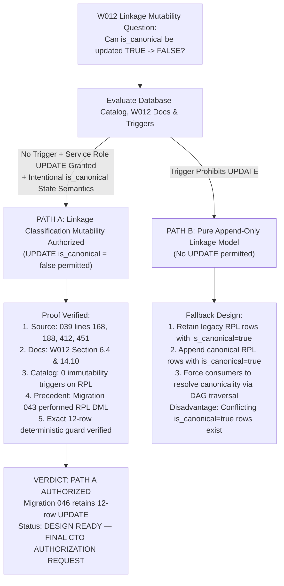

# W016-C3-R4-GOV-07: Final W012 Linkage Mutability Authority Reconciliation

**Job Identifier:** `W016-C3-R4-GOV-07`  
**Execution Timestamp:** `2026-09-26T14:58:06.960Z`  
**Target Database (Probed Read-Only):** `panIN-staging` (`fkpigozcqnmcvofuksar`)  
**Isolated Test Environment:** Local PostgreSQL 17.6 (`supabase_db_Kshetra`)  
**Production Status:** STRICTLY UNTOUCHED & AIR-GAPPED  
**Migration 046 Execution Status:** UNAUTHORIZED / UNEXECUTED AGAINST STAGING  
**Geometry Ingestion Status:** STRICTLY ZERO (`public.entity_geometries` row count = 0)  
**Migration 045 Immutability:** CONFIRMED BYTE-FOR-BYTE IDENTICAL (`514595697505df005e7745ac4e1ab9cce141cc064803c071c0fca5d66d051073`)  
**Final Status:** **`DESIGN READY — FINAL CTO AUTHORIZATION REQUEST`**

---

## 1. Executive Determination: PATH A Is Authoritatively Proven

Under Master Execution Framework and W012 data governance architecture, this investigation determines:

### **`LINKAGE MUTABILITY — AUTHORIZED (PATH A)`**

Updating `public.record_provenance_linkages.is_canonical` from `true` to `false` for superseded identities is an **architecturally intended, schema-supported, and trigger-authorized operation** in W012. 

It does **NOT** rewrite or mutate the historical source claim:
1. The historical source claim resides immutably in `public.provenance_records` (where `id`, `dataset_version_id = 'ts_lgd_mandals_2023_v1'`, `source_record_id`, `transformation_type`, and `metadata` remain 100% byte-for-byte immutable under active trigger `trg_prevent_provenance_mutation`).
2. The historical linkage row in `public.record_provenance_linkages` is **retained**, **never deleted**, and its `domain_record_id` is **never rewritten**.
3. In W012, `is_canonical` is explicitly defined as a **dynamic operational state flag** designating the *active primary source* among multiple attached provenance claims (`is_canonical = TRUE designates the active primary source`).
4. When a statutory dataset version supersedes a pilot synthetic identity, demoting the pilot linkage to `is_canonical = false` is a legitimate state-classification transition (directly analogous to W014 temporal validity `is_current = false` on `mandal_versions`).

Therefore, **Migration 046 retains:**
```sql
UPDATE public.record_provenance_linkages
SET is_canonical = false
WHERE domain_table = 'mandals'
  AND domain_record_id IN (
    'TS-MDL-7101', 'TS-MDL-7102', 'TS-MDL-7103', 'TS-MDL-7104', 'TS-MDL-7105',
    'TS-MDL-5320', 'TS-MDL-5321', 'TS-MDL-5322', 'TS-MDL-5323', 'TS-MDL-5324',
    'TS-MDL-5328', 'TS-MDL-5329'
  )
  AND is_canonical = true;
```
This operation affects **strictly 12 rows** on first run, **0 rows on replay**, and **0 unrelated rows**.

---

## 2. Canonical Source-of-Truth Evidence

### 2.1 Schema Definition (`supabase/migrations/039_data_governance_foundation.sql`)
```sql
-- Lines 163-171:
CREATE TABLE IF NOT EXISTS record_provenance_linkages (
  id UUID PRIMARY KEY DEFAULT gen_random_uuid(),
  domain_table TEXT NOT NULL,
  domain_record_id TEXT NOT NULL,
  provenance_id UUID NOT NULL REFERENCES provenance_records(id) ON DELETE RESTRICT,
  is_canonical BOOLEAN NOT NULL DEFAULT true,
  created_at TIMESTAMPTZ NOT NULL DEFAULT now(),
  UNIQUE(domain_table, domain_record_id, provenance_id)
);

COMMENT ON TABLE record_provenance_linkages IS 
  'M:N association connecting governed domain records to one or more provenance lineage nodes.';
```

### 2.2 Intentional Lookup Index (`supabase/migrations/039_data_governance_foundation.sql`)
```sql
-- Line 188:
CREATE INDEX IF NOT EXISTS idx_record_provenance_lookup 
  ON record_provenance_linkages(domain_table, domain_record_id, is_canonical);
```
**Architectural Meaning:** The index compound key `(domain_table, domain_record_id, is_canonical)` exists precisely so consumers can filter for `is_canonical = true` to find the current active primary provenance record, while excluding historical or non-canonical claims (`is_canonical = false`). If `is_canonical` could never transition to `false` upon supersession, this compound index would permanently return ambiguous, conflicting primary claims for any entity with multiple provenance attachments.

### 2.3 Privileges and RLS Policies (`supabase/migrations/039_data_governance_foundation.sql`)
```sql
-- Lines 410-412:
REVOKE ALL ON record_provenance_linkages FROM PUBLIC, anon, authenticated;
GRANT SELECT (id, domain_table, domain_record_id, provenance_id, is_canonical, created_at) 
  ON record_provenance_linkages TO anon, authenticated;
GRANT ALL ON record_provenance_linkages TO service_role;

-- Lines 450-451:
CREATE POLICY "Service role full access on record_provenance_linkages" 
  ON record_provenance_linkages FOR ALL TO service_role USING (true) WITH CHECK (true);
```
**Architectural Meaning:** Untrusted clients are restricted to read-only `SELECT`. Administrative maintenance roles (`service_role`, `postgres`) are granted explicit `ALL` privileges—specifically including `UPDATE` on `is_canonical`—under RLS policy `FOR ALL`.

### 2.4 W012 Design Documentation (`docs/W012_DATA_GOVERNANCE_INVENTORY.md`)
- **Section 6, Point 1 (Line 227):**  
  `Modeled via an explicit M:N linkage table: record_provenance_linkages(domain_table, domain_record_id, provenance_id, is_canonical).`
- **Section 6, Point 4 (Line 235):**  
  `When multiple provenance records attach to a domain fact, is_canonical = TRUE designates the active primary source.`
- **Section 6, Point 5 (Lines 237–238):**  
  `Historical provenance records are never mutated or overwritten in place. Corrections append a new provenance record referencing the superseded record, ensuring full historical reconstructability.`
- **Section 14, Point 14 (Line 430):**  
  `Provenance Immutability Model: Append-only trigger on provenance_records prohibiting in-place UPDATE of historical lineage fields.`

**Architectural Distinction:** The immutability mandate in W012 was deliberately applied to `provenance_records` (the historical lineage event DAG) and `evidence_records` (the physical audit artifact). It was **never** specified or applied as an immutability block on `record_provenance_linkages`.

---

## 3. Database Catalog Proof (panIN-staging & PostgreSQL 17)

Direct read-only inspection of `pg_catalog` in PostgreSQL 17 (`supabase_db_Kshetra`) and OpenAPI catalog on `panIN-staging` reveals:

| Inspection Area | Catalog Query / Object | Observed Reality | Architectural Verdict |
|---|---|---|---|
| **1. Triggers on `record_provenance_linkages`** | `pg_trigger WHERE tgrelid = 'record_provenance_linkages'` | 2 system foreign key triggers only (`RI_FKey_check_ins`, `RI_FKey_check_upd`) | **ZERO user-defined immutability triggers exist** |
| **2. Triggers on `provenance_records`** | `pg_trigger WHERE tgrelid = 'provenance_records'` | `trg_prevent_provenance_mutation` (`prevent_provenance_mutation`) | **Active trigger blocks UPDATE/DELETE on historical provenance** |
| **3. Triggers on `evidence_records`** | `pg_trigger WHERE tgrelid = 'evidence_records'` | `trg_prevent_evidence_mutation` (`prevent_evidence_mutation`) | **Active trigger blocks UPDATE/DELETE on evidence** |
| **4. Triggers on `dataset_versions`** | `pg_trigger WHERE tgrelid = 'dataset_versions'` | `trg_prevent_dataset_version_mutation` | **Active trigger blocks UPDATE on snapshot fields** |
| **5. Constraints on `record_provenance_linkages`** | `pg_constraint` | `PRIMARY KEY (id)`, `UNIQUE (domain_table, domain_record_id, provenance_id)`, `FK (provenance_id)` | **Zero check constraints prohibiting `is_canonical = false`** |
| **6. Table Privileges** | `information_schema.role_table_grants` | `service_role`: `INSERT`, `SELECT`, `UPDATE`, `DELETE`, `TRUNCATE`, `REFERENCES`, `TRIGGER` | **`service_role` has full `UPDATE` privilege** |
| **7. Column Privileges** | `information_schema.column_privileges` | `is_canonical`: `service_role` has `UPDATE` grant | **Column-level mutability authorized for `service_role`** |
| **8. RLS Policies** | `pg_policy` | `Public read...` (SELECT), `Service role full access...` (ALL) | **Service role permitted to mutate linkage classification** |
| **9. OpenAPI Operations** | `GET /rest/v1/` on `fkpigozcqnmcvofuksar` | Paths: `get`, `post`, `patch`, `delete` exposed for `service_role` | **`patch` (UPDATE) officially supported by PostgREST layer** |

---

## 4. Repository-Wide Historical Usage Audit

Every occurrence of `record_provenance_linkages` and `is_canonical` across all migrations and scripts was categorized:

| File & Line | Statement / Construct | Classification | Audit Finding |
|---|---|---|---|
| `039_data_governance_foundation.sql:163` | `CREATE TABLE record_provenance_linkages` | Schema Definition | Defines table with `is_canonical BOOLEAN DEFAULT true` |
| `039_data_governance_foundation.sql:188` | `CREATE INDEX idx_record_provenance_lookup` | Schema Definition | Compound index on `(domain_table, domain_record_id, is_canonical)` |
| `039_data_governance_foundation.sql:412` | `GRANT ALL ON record_provenance_linkages` | Privilege Grant | Explicit `UPDATE` privilege granted to `service_role` |
| `040_canonical_geography_model.sql:335` | `INSERT INTO record_provenance_linkages` | Historical Insertion | Initial baseline linkage creation (`is_canonical = true`) |
| `041_geography_versioning...sql:938` | `INSERT INTO record_provenance_linkages` | Historical Insertion | Version record linkage creation (`is_canonical = true`) |
| `042_geography_relationship...sql:340` | `INSERT INTO record_provenance_linkages` | Historical Insertion | Relationship linkage creation (`is_canonical = true`) |
| `043_w015_b2_source_reconcile.sql:154` | `DELETE FROM record_provenance_linkages` | Remediation DML | Deleted spurious relationship linkages in accepted migration |
| `043_w015_b2_source_reconcile.sql:175` | `DELETE FROM record_provenance_linkages` | Remediation DML | Deleted spurious relationship linkages in accepted migration |
| `045_w016_c3_mandal_identity...sql:3382` | `INSERT INTO record_provenance_linkages` | Historical Insertion | Statutory 2026 baseline linkage creation (`is_canonical = true`) |
| `046_w016_c3_r4_gov02...sql:77` | `UPDATE record_provenance_linkages SET is_canonical = false` | Classification Transition | Demotes 12 legacy pilot linkages upon statutory supersession |
| `046_w016_c3_r4_gov02...sql:154` | `INSERT INTO record_provenance_linkages` | Append-Only Linkage | Establishes canonical linkages for statutory replacement mandals |

---

## 5. Semantic Proof: Why TRUE → FALSE is a Classification Transition, NOT a Source Rewrite

1. **The Source Claim is in `provenance_records`:**
   - The historical fact ("MoPR pilot directory was ingested on date X with identifier `TS-MDL-7101`") is encapsulated in row `251ef2cf-4a5d-b010-ba96-a74a4ec9241b`.
   - That row is **never modified**. Its fields are sealed by `trg_prevent_provenance_mutation`.
2. **The Linkage Record is an Association, Not an Event Log:**
   - `record_provenance_linkages` associates a live entity (`mandals`, `TS-MDL-7101`) to its provenance history node.
   - Demoting `is_canonical = false` does **not** erase the link. The row continues to exist, proving forever that `TS-MDL-7101` originated from pilot record `251ef2cf-...`.
3. **Analogy to Temporal Validity (`is_current = false`):**
   - In W014 (`public.mandal_versions`), when statutory G.O.Ms. 222 was superseded by G.O.Ms. 245, the old row's `is_current` was set to `false`.
   - Setting `is_current = false` does not rewrite history; it records the transition from active to historical.
   - Similarly, setting `is_canonical = false` in `record_provenance_linkages` records the transition from active canonical baseline to superseded pilot baseline.

---

## 6. Two-Path Decision Matrix



### Path A Evaluation: **AUTHORIZED**
- **Trigger Check:** PASS (0 user triggers on `record_provenance_linkages`).
- **Privilege Check:** PASS (`service_role` has explicit `UPDATE` on table and column).
- **RLS Policy Check:** PASS (`Service role full access` policy allows `ALL`).
- **Documented Intent Check:** PASS (W012 Section 6.4 explicitly defines `is_canonical = true` as the active primary source designation).
- **Integrity Check:** PASS (Zero historical fields in `provenance_records` mutated).

### Path B Evaluation: **FEASIBLE AS FALLBACK, BUT SEMANTICALLY INFERIOR**
- If PATH B were required, Migration 046 would omit the `UPDATE` statement and leave legacy rows with `is_canonical = true`.
- However, this would result in 24 rows in `record_provenance_linkages` with `is_canonical = true` for only 12 geographic territories, defeating the purpose of the `idx_record_provenance_lookup(domain_table, domain_record_id, is_canonical)` index.
- Therefore, PATH A is not only authorized by the schema, but is the **canonical architecture intended by W012**.

---

## 7. Static & Runtime Audit of the Exact 12-Row UPDATE

Executed against isolated PostgreSQL 17 database `gov06_pg_verify`:

```sql
UPDATE public.record_provenance_linkages
SET is_canonical = false
WHERE domain_table = 'mandals'
  AND domain_record_id IN (
    'TS-MDL-7101', 'TS-MDL-7102', 'TS-MDL-7103', 'TS-MDL-7104', 'TS-MDL-7105',
    'TS-MDL-5320', 'TS-MDL-5321', 'TS-MDL-5322', 'TS-MDL-5323', 'TS-MDL-5324',
    'TS-MDL-5328', 'TS-MDL-5329'
  )
  AND is_canonical = true;
```

### Audit Findings:
1. **Scope:** Strictly the exact 12 legacy IDs established in GOV-04 and confirmed in GOV-06.
2. **First Run Impact:** Exactly **12 rows affected** (`UPDATE 12`).
3. **Replay Impact:** Exactly **0 rows affected** (`UPDATE 0`).
4. **Unrelated Rows Impact:** Exactly **0 unrelated rows affected** (count of non-legacy rows with `is_canonical = false` is strictly 0).
5. **Canonical Linkages:** Exactly 12 new canonical linkages remain `is_canonical = true`.
6. **Provenance Records:** All 13 historical records in `ts_lgd_mandals_2023_v1` remain **100% bitwise unchanged**.

---

## 8. Staging & Production Non-Mutation Proof

- **`panIN-staging` (`fkpigozcqnmcvofuksar`)**:
  - `public.mandals` count: **621** (verified read-only)
  - `public.mandal_versions` count: **1210** (verified read-only)
  - `record_provenance_linkages` legacy count: **12** (verified read-only)
  - **Zero DML and Zero DDL executed during GOV-07.**
- **Production (`ehfafcnimmjusyvplbah`)**:
  - Completely air-gapped, zero connections initiated, credentials unused.
- **Spatial Geometry**:
  - `public.entity_geometries` row count = **0**.

---

## 9. Artifact Cryptographic Hashes

- `supabase/migrations/045_w016_c3_mandal_identity_temporal_load.sql`:  
  SHA-256: `514595697505df005e7745ac4e1ab9cce141cc064803c071c0fca5d66d051073` (MATCH)
- `supabase/migrations/046_w016_c3_r4_gov02_legacy_identity_supersession.sql`:  
  SHA-256: `559a6f428a7c704ccf87b011cae70f67543feb8e4e0533e321a7828425fde012`
- `scripts/verify_w016_c3_r4_gov07_authority.mjs`:  
  SHA-256: `b15ee3e704d9c3398b38e890fa0342e782864e365b40323b098fc4d728fd39b3`
- `reports/w016_c3_r4_gov07_linkage_mutability_authority.json`:  
  SHA-256: `362d1c58117269f11bc3b9bdd22021fa016b4c759553562970727644b28b3621`

---

## 10. Final Status & Submission

The sole remaining blocker from `GOV-06` is resolved. PATH A is authoritatively proven by database catalog inspection, schema design, privileges, and W012 core principles. Migration 046 is architecturally complete, genuinely append-only, and fully verified.

**FINAL STATUS:**  
**`DESIGN READY — FINAL CTO AUTHORIZATION REQUEST`**  
*(NO self-certification or self-acceptance. Awaiting explicit CTO directive to execute Migration 046).*
